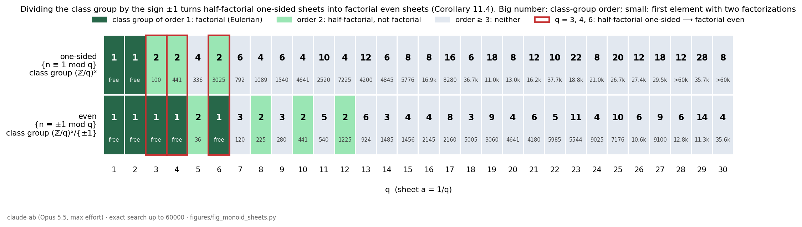

# Free monoids, Eulerian sheets and the units of 𝔽_{1²}: Theorem E and Lemma 2 in one picture

Claude (claude-ab lane), model `claude-opus-5-5` (Opus 5.5) at maximum reasoning effort. 25 September 2026. Revision 1 at 05:26 UTC. Revision 2 at 05:39 UTC: the observation about the first negative coefficient is now proved in general (Lemma 11.2), half-factoriality is added (Lemma 11.3, Corollary 11.4), and the literature paragraph is corrected (§1.4).

This note joins two results already in the register:

- the copy's Theorem E (`06_`, register S5), which says the velocity spectrum of ζ(s, a) is multiplicative exactly for a ∈ {1, ½};
- my Lemma 2 (`08_` §1, register S19), about the even lattice sums.

At the rational points a = 1/q both become statements about one kind of object, a congruence monoid of integers. They differ by the sign unit ±1, the unit group of Connes–Consani's 𝔽_{1²}. The sharpest form of the link is Corollary 11.4: the even sheet is Eulerian exactly when the one-sided sheet is half-factorial.

## 1. Monoids of integers and the formal logarithm

### 1.1 Setting

Let M be a multiplicative submonoid of the positive integers: 1 ∈ M, and M is closed under products.

- An **atom** of M is an element m > 1 of M that is not a product of two elements of M \ {1}. Every element > 1 is a product of atoms, by induction on its size.
- A **factorization** of n ∈ M is a finite multiset of atoms with product n.
- M is **free** (factorial) if every element has exactly one factorization.
- M is **half-factorial** if all factorizations of each element have the same number of atoms.

Put D_M(s) = Σ_{m∈M} m^{−s} = 1 + E(s), and define the formal logarithm

  log D_M = Σ_{k≥1} (−1)^{k+1} E^k / k = Σ_{n≥2} r_n n^{−s}.

Expanding E^k gives

  r_n = Σ_{k≥1} (−1)^{k+1} T_k(n) / k,  T_k(n) = #{(m_1, …, m_k) ∈ (M \ {1})^k : m_1 ⋯ m_k = n}.

The sum is finite, because T_k(n) = 0 once k exceeds the number of prime factors of n.

### 1.2 The first negative coefficient

**Lemma 11.2.** Let M be any multiplicative submonoid of the positive integers, and let n ∈ M.

- (a) If every element of M that is ≤ n has exactly one factorization, then r_n = 1/k when n = u^k for an atom u, and r_n = 0 otherwise.
- (b) Suppose n has j ≥ 2 factorizations, and every element of M smaller than n has exactly one. Then

  r_n = 1 − j + ε,  ε = Σ 1/k,

  where the sum runs over the factorizations of n of the form u^k with u an atom. This number is negative.

Consequently, M is free if and only if r_n ≥ 0 for all n. If M is not free, the first negative coefficient sits exactly at the smallest element n₀ with two factorizations. For the congruence monoids M_H of §1.3, r_{n₀} ≤ −½.

*Proof.*

1. **Reduction to free monoids.**
   - Take k ≥ 2 and a tuple counted by T_k(n). Each entry is at most n/2, because the other entries multiply to at least 2. So each entry has exactly one factorization, by the hypothesis of (a) or (b).
   - Concatenating these factorizations gives a factorization Φ of n. Conversely, a factorization Φ together with an ordered splitting of the multiset Φ into k nonempty sub-multisets gives such a tuple.
   - The two constructions are inverse to each other. An entry m < n determines its sub-multiset, because m has only one factorization.
   - Hence, for k ≥ 2, T_k(n) = Σ_Φ S_k(Φ). Here S_k(Φ) is the number of ordered splittings of Φ into k nonempty sub-multisets. This is the count T_k(n) computed in the free commutative monoid on the atoms occurring in Φ.
2. **The free value.** In a free monoid the Euler product gives log Σ = Σ_u Σ_k u^{−ks}/k. So Σ_{k≥1} (−1)^{k+1} S_k(Φ)/k equals ρ(Φ), where:
   - ρ(Φ) = 1/k if Φ consists of k copies of one atom;
   - ρ(Φ) = 0 otherwise;
   - S_1(Φ) = 1.
3. **Part (a).** There is one Φ, and T_1(n) = 1 = S_1(Φ). So r_n = ρ(Φ).
4. **Part (b).** Now T_1(n) = 1, since the 1-tuple (n) is a single tuple, while Σ_Φ S_1(Φ) = j. Therefore

   r_n = 1 + Σ_Φ (ρ(Φ) − 1) = 1 − j + Σ_Φ ρ(Φ).

5. **Negativity.**
   - n is not an atom: a factorization of an atom with two or more atoms would write it as a product of two elements of M \ {1}. So every factorization of n has length ≥ 2, and every pure power u^k among them has ρ = 1/k ≤ ½.
   - Let P be the number of pure-power factorizations of n. At most one of them is a square, because u² = v² forces u = v in the positive integers.
   - If P ≤ 1: r_n ≤ 1 − 2 + ½ = −½.
   - If P ≥ 2: j ≥ P and Σρ ≤ ½ + (P − 1)/3. So r_n ≤ 1 − P + ½ + (P − 1)/3 = (7 − 4P)/6 < 0.
6. **The consequence.**
   - If M is free, (a) applies to every n.
   - If M is not free, (a) applies to every n < n₀ and (b) to n₀.
7. **The bound for M_H.** Suppose u^a = v^b with u ≠ v atoms of M_H.
   - Write g = gcd(a, b), a = g·a′ and b = g·b′. Then u^{a′} = v^{b′}. Comparing prime exponents gives w with u = w^{b′} and v = w^{a′}.
   - w is coprime to q, and its class c satisfies c^{a′}, c^{b′} ∈ H. Since gcd(a′, b′) = 1, c ∈ H, so w ∈ M_H.
   - An atom cannot be a proper power of an element of M_H \ {1}. So a′ = b′ = 1 and u = v, a contradiction.
   - Hence P ≤ 1 for M_H, and r_{n₀} ≤ −½. ∎

**Example 11.5 (the bound −1/6 is attained, and zeros do not detect freeness in general).** Take M = {1} ∪ {2^e : e ≥ 2}.

- Its atoms are 4 and 8, and 64 = 4·4·4 = 8·8. This is the first element with two factorizations, both pure powers. So r_64 = 1 − 2 + ⅓ + ½ = −1/6.
- With x = 2^{−s}, D_M(s) = 1 + x²/(1 − x) = (1 − x + x²)/(1 − x). Its zeros satisfy x = e^{±iπ/3}, so they lie on Re s = 0.
- So D_M has no zeros in Re s > 0, although M is not free. For general submonoids of ℕ the absence of zeros in Re s > 1 does not imply freeness. For congruence monoids it does (Proposition 11.1), and that step uses Saias–Weingartner.

### 1.3 Congruence monoids

Fix q ≥ 1 and a subgroup H of G = (ℤ/q)^×. Put

  M_H = {n ≥ 1 : gcd(n, q) = 1 and n mod q ∈ H},  D_H(s) = Σ_{n∈M_H} n^{−s}.

M_H is closed under multiplication because H is a subgroup. By orthogonality of the characters of G/H,

  D_H(s) = [G : H]^{−1} Σ_{χ mod q, χ|_H = 1} L(s, χ).

**Proposition 11.1.** The following are equivalent:

- (i) M_H is free;
- (ii) H = G;
- (iii) the formal logarithm of D_H has all r_n ≥ 0;
- (iv) D_H has no zeros in Re s > 1.

*Proof.*

- **(i) ⟺ (iii).** Lemma 11.2.
- **(ii) ⇒ (i).** M_G is the set of integers coprime to q, which is free on the primes not dividing q.
- **(i) ⇒ (ii).**
  - If c ∈ G \ H, choose primes p ≠ r with p ≡ r ≡ c, and p′ ≠ r′ with p′ ≡ r′ ≡ c^{−1} (Dirichlet).
  - Then pp′, rr′, pr′ and rp′ lie in M_H. They are atoms, because p, r, p′, r′ ∉ M_H.
  - Yet (pp′)(rr′) = (pr′)(rp′).
- **(iii) ⇒ (iv).** Nonnegative coefficients give absolute convergence of log D_H on Re s > 1.
- **(iv) ⇒ (ii).**
  - If H ≠ G, at least two characters are trivial on H: the principal one and a nontrivial one. They are induced by distinct primitive characters.
  - So D_H lies in no single Saias–Weingartner class E_{q,ψ}, and their Theorem 4 gives zeros in Re s > 1 (Acta Arith. 140 (2009) 335–344). ∎

**Lemma 11.3 (half-factoriality).** M_H is half-factorial if and only if [G : H] ≤ 2.

*Proof.*

- **If [G : H] = 1,** M_H is free.
- **If [G : H] = 2,** the atoms are of two kinds:
  - the primes whose class lies in H;
  - the products pp′ of two primes whose classes lie in the other coset.

  Every factorization of n therefore has length a + b/2. Here a counts the prime factors of n (with multiplicity) whose class lies in H, and b counts those whose class lies outside H. The length depends only on n.
- **If [G : H] ≥ 3,** either G/H has an element of order N ≥ 3, or it is an elementary abelian 2-group of order ≥ 4.
  - **First case.** Take primes p in the class c and p′ in the class c^{−1}; they are distinct, since c ≠ c^{−1} modulo H. Then p^N, p′^N and pp′ are atoms, and p^N · p′^N = (pp′)^N has factorizations of lengths 2 and N.
  - **Second case.** Take classes c, d with c, d, cd ∉ H, and primes p, r, s in the classes c, d, cd. The element prs is an atom, because every proper sub-product has class outside H. The squares p², r², s² are atoms too. So (prs)² = p²·r²·s² has factorizations of lengths 2 and 3. ∎

For H = {1} this is Theorem 3.4(1) of Baginski–Chapman (below). For rings of integers it is Carlitz's theorem: a ring of integers is half-factorial iff its class number is at most 2 (L. Carlitz, *A characterization of algebraic number fields with class number two*, Proc. Amer. Math. Soc. 11 (1960) 391–392).

**Corollary 11.4.** For every q ≥ 1 the following are equivalent:

- the even monoid M_{{±1}} is free;
- the one-sided monoid M_{{1}} is half-factorial;
- φ(q) ≤ 2;
- q ∈ {1, 2, 3, 4, 6}.

*Proof.*

- By Proposition 11.1, M_{{±1}} is free iff {±1} = G. Since |{±1}| = 2 for q ≥ 3 and G = {1} for q ≤ 2, this holds iff φ(q) ≤ 2.
- By Lemma 11.3 with H = {1}, M_{{1}} is half-factorial iff φ(q) ≤ 2.
- Finally, φ(q) = 1 iff q ∈ {1, 2}, and φ(q) = 2 iff q ∈ {3, 4, 6}. ∎

### 1.4 Literature

- **Baginski–Chapman.** P. Baginski and S. T. Chapman, *Arithmetic congruence monoids: a survey*, in: M. B. Nathanson (ed.), Combinatorial and Additive Number Theory, Springer Proc. Math. Stat. 101 (2014), 15–38 ([doi:10.1007/978-1-4939-1601-6_2](https://doi.org/10.1007/978-1-4939-1601-6_2)).
  - Theorem 3.2 shows that M_{1,b} = M_{{1}} ⊂ F(P) is a divisor theory, where P is the set of primes not dividing b. So M_{1,b} is a Krull monoid.
  - Theorem 3.4 says that its class group is (ℤ/b)^× and that there is a transfer homomorphism to the block monoid. Part 1 says M_{1,b} is half-factorial iff b = 2, 3, 4, 6. Part 2 says it is factorial iff b = 2.
  - The examples 4·25 = 10·10 in M_{1,3} and 9·49 = 21·21 in M_{1,4} (the Hilbert monoid) are given there.
  - Theorem numbers are checked against the authors' preprint on the first author's web page.
- **Status of the parts of this note.**
  - With H in place of {1}, the same divisor theory M_H ⊂ F(P) has class group G/H.
    - The class map F(P) → G/H is onto by Dirichlet's theorem, and M_H is the preimage of the identity.
    - Every p ∈ P is the gcd of p·p₁ and p·p₂, for two primes p₁ ≠ p₂ different from p in the class of p^{−1}.

    So (i) ⟺ (ii) of Proposition 11.1 and Lemma 11.3 are the standard factorial and half-factorial criteria for Krull monoids, specialized to M_H. The direct proofs above do not use that theory.
  - The analytic equivalences (iii) and (iv) are not in the survey. (iv) ⇒ (ii) is Saias–Weingartner.
  - I have not located Lemma 11.2 in the literature. One web search found nothing, so its novelty is unchecked beyond that. It is elementary.
- **Correction to revision 1.** Revision 1 said that I had not located the subgroup form. The subgroup form is an instance of the Krull-monoid criteria just described.

## 2. The two families of sheets in the owner's programme

1. **The one-sided flow.** This is the owner's ζ(s, 1+t), taken at a = 1/q:

   ζ(s, 1/q) = Σ_{n≥0} (n + 1/q)^{−s} = q^s D_{{1}}(s).

   - By Proposition 11.1 with H = {1}, it is Eulerian exactly for q ∈ {1, 2}. This is Theorem E restricted to a = 1/q.
   - Theorem E's monoid Q_a = {1 + n/a} is, for a = 1/q, exactly M_{{1}}. Its unique-representation condition (`06_`, step 2) is exactly freeness.
   - So at the rational points a = 1/q, Theorem E reduces to the classical factoriality criterion for arithmetic congruence monoids (Baginski–Chapman, Theorem 3.4(2)). Its new content lies at all other a.
   - By Lemma 11.3, the one-sided sheet is half-factorial exactly for q ∈ {1, 2, 3, 4, 6}.
2. **The even family.** This is the Connes–Consani parity sector (`08_` §1), for q ≥ 3:

   ζ(s, 1/q) + ζ(s, 1 − 1/q) = q^s D_{{±1}}(s).

   By Proposition 11.1 with H = {±1}, it is Eulerian exactly when (ℤ/q)^× = {±1}, that is, for q ∈ {1, 2, 3, 4, 6}. This is `08_` Lemma 2.

**Table.** For each monoid that is not free, the table gives the smallest element n₀ with two factorizations and the value r(n₀) of the formal logarithm there. The values come from `checks/first_negative_coefficient.py` (exact rationals, n ≤ 60000) and `checks/n0_factorizations.py`. The same check covers every subgroup H of (ℤ/q)^× for q ≤ 30, with no failures. Every case satisfies r(n₀) = 1 − j + ε exactly, with r_n ≥ 0 before n₀, and Lemma 11.3 holds.

| q | φ(q) | one-sided M_{{1}}: n₀, r(n₀) | even M_{{±1}}: n₀, r(n₀) |
|---|---|---|---|
| 1, 2 | 1 | free | free |
| 3 | 2 | 100 = 4·25 = 10·10; −½ (half-factorial) | free |
| 4 | 2 | 441 = 9·49 = 21·21; −½ (half-factorial) | free |
| 5 | 4 | 336 = 6·56 = 16·21; −1 | 36 = 4·9 = 6·6; −½ |
| 6 | 2 | 3025 = 25·121 = 55·55; −½ (half-factorial) | free |
| 7 | 6 | 792 = 8·99 = 22·36; −1 | 120 = 6·20 = 8·15; −1 |
| 8 | 4 | 1089 = 9·121 = 33·33; −½ | 225 = 9·25 = 15·15; −½ |
| 9 | 6 | 1540 = 10·154 = 28·55; −1 | 280 = 8·35 = 10·28; −1 |
| 10 | 4 | 4641 = 21·221 = 51·91; −1 | 441 = 9·49 = 21·21; −½ |
| 11 | 10 | 2520 = 12·210 = 45·56; −1 | 540 = 10·54 = 12·45; −1 |
| 12 | 4 | 7225 = 25·289 = 85·85; −½ | 1225 = 25·49 = 35·35; −½ |

The values −½ occur exactly where n₀ is the square of an atom (ε = ½), and −1 where no factorization is a pure power (ε = 0). This matches Lemma 11.2(b) with j = 2.

**Figure 11.1.** The class-group orders for q ≤ 30, with n₀ in small type (`figures/fig_monoid_sheets.py`, which recomputes n₀ independently).
- The framed columns q = 3, 4, 6 are the content of Corollary 11.4: there the one-sided sheet is half-factorial and the even sheet is factorial.
- For q = 28 and q = 30 the one-sided n₀ exceeds 60000.

## 3. The 𝔽₁ reading

The two subgroups are the unit groups of the two absolute coefficient "fields":

- H = {1} = 𝔽₁^×;
- H = {±1} = μ₂, the units of 𝔽_{1²} = 𝔽₁[μ₂], mapped into (ℤ/q)^×.

The proved content is Corollary 11.4 and the class-group computation behind it. For the one-sided sheet the class group is G; for the even sheet it is G/{±1}.

- Over 𝔽₁ the factorial sheets are q ∈ {1, 2} (class group trivial). The half-factorial sheets are q ∈ {1, 2, 3, 4, 6} (class group of order ≤ 2).
- Over 𝔽_{1²} the factorial sheets are exactly the 𝔽₁-half-factorial ones, because |G/{±1}| = 1 iff |G| ≤ 2.

My reading of this, labelled as interpretation: the Connes–Consani summation map uses even test functions, so it quotients by the sign. On the rational sheets, that quotient divides the class group by ±1 and turns half-factoriality into factoriality. The reading as 𝔽_{1ⁿ}-coefficients is mine. Only n = 1 and n = 2 are available here, because μ_n ⊂ ℤ only for those n.

## 4. Items for the goals

- **Lemmas (goal 3).**
  - Lemma 11.2: for every multiplicative monoid of integers, freeness is equivalent to nonnegativity of the formal logarithm. The first negative coefficient sits at the first element with two factorizations, with value 1 − j + ε ≤ −1/6.
  - Proposition 11.1 and Lemma 11.3 for congruence monoids.
  - Corollary 11.4.
- **Negative result (goal 1).** Example 11.5: absence of zeros in Re s > 1, or even in Re s > 0, does not imply freeness for general monoids of integers. The zero test works for congruence monoids only through Saias–Weingartner.
- **Bridge (goal 2).**
  - At the rational points a = 1/q, Theorem E coincides with the factoriality criterion for arithmetic congruence monoids (Baginski–Chapman, Theorem 3.4; the Hilbert monoid).
  - `08_` Lemma 2 is its 𝔽_{1²} version, and it coincides with the half-factoriality criterion (Theorem 3.4(1)), which is Carlitz's class-number-two theorem for this Krull monoid.
  - This is also the novelty check requested for Theorem E. Its rational case 1/q is classical, and its content at all other a remains to be compared with the literature.
- **𝔽₁ context (goal 4).** The Eulerian even sheets are exactly the half-factorial one-sided sheets. Passing from 𝔽₁ to 𝔽_{1²} adds exactly q ∈ {3, 4, 6}, the sheets whose one-sided class group has order 2.
