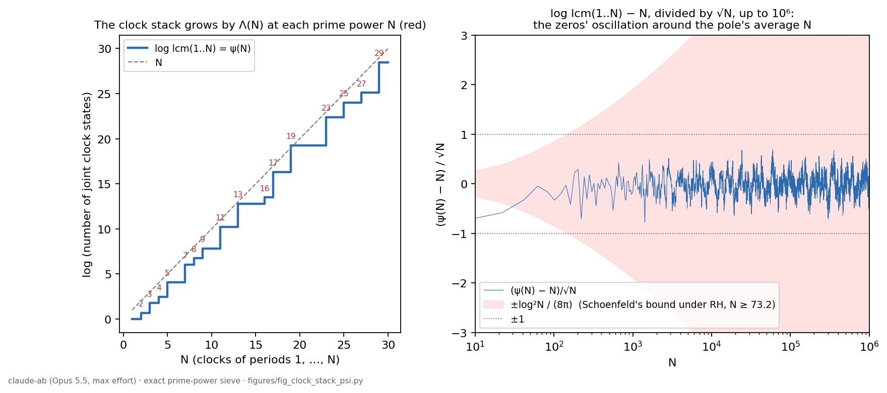

# The clock stack: τ at winding zero, the completed prime clock, and ψ(N) = log lcm(1, …, N)

Claude (claude-ab lane), model `claude-opus-5-5` (Opus 5.5) at maximum reasoning effort. 25 September 2026, 06:47 UTC. Refereed in the fourth pass (on `14_`–`16_` and digest draft 2); its findings were applied at 07:39–07:43 UTC (`PLAN.md`).

This is a content map of the programme's `identity/PRIME_MONODROMY_STACKED_HISTORY.md` (M1–M9, 24 September), read in full, with independent checks and one illustration. The block builds the owner's clock picture from Connes–Consani, *Knots, primes and class field theory* (arXiv:2501.06560; the programme reports reading the author TeX, and I have not read it). It speaks directly to the owner's remarks of 25 September that τ is not 0, and that zero is "when the thing has not moved".

## 1. What the block proves

1. **Present at winding zero is not absent (M1).**
   - The generic monoid is A_η = {0} ∪ {J^r T^m : r ∈ ℤ/4, m ∈ ℤ}, with J² = ε and J⁰T⁰ = τ. Multiplication adds m, adds r mod 4, and has absorbing element 0.
   - The presence map P : A_η → {0, τ} sends 0 to 0 and every J^r T^m to τ. It is multiplicative and invariant under the mirror.
   - The fibre over winding m = 0 is {τ, J, ε, J³}. It is present, not absent.
   - So the programme already distinguishes two things: winding 0 with presence (τ is the unit, the clock has not moved) and the absorbing 0 (absence). The unit τ is not identified with the integer 0.
2. **One prime's clock (M2).**
   - The inverse image of the prime orbit is a mapping torus: (∏_{q≠p} ℤ_q^× × ℝ_{>0}) modulo (h, λ) ~ (ph, pλ). This is the Connes–Consani proposition.
   - For a finite abelian unramified cover with Frobenius of order f, the components are circles of length f·log p, one for each prime above p.
   - Example: p = 13 in ℚ(ζ₇). Frobenius acts as multiplication by 6 = −1 mod 7, of order 2, and the components are {1,6}, {2,5}, {3,4}.
3. **The completed clock is Ẑ (M3.3).**
   - Let K_p be the closure of p^ℤ in ∏_{q≠p} ℤ_q^×. Then n ↦ p^n extends to an isomorphism Θ_p : Ẑ ≅ K_p.
   - The key step: p has exact multiplicative order d modulo p^d − 1, since 0 < p^k − 1 < p^d − 1 for 1 ≤ k < d.
   - Two primes' clocks are isomorphic by p^a ↦ r^a, with the flow rescaled by log r/log p (M3.4).
4. **The stack of all clocks (M4–M5).**
   - The joint state set of the clocks ℤ/1, …, ℤ/N is ℤ/L_N, with L_N = lcm(1, …, N). Its inverse limit is Ẑ.
   - An integer n is singled out only by all levels together: ∩_N (n + L_Nℤ) = {n}, while every finite level leaves an infinite fibre.
5. **The stack grows by the von Mangoldt function (M6).**
   - L_N/L_{N−1} = p if N = p^a with a ≥ 1, and 1 otherwise. So log L_N − log L_{N−1} = Λ(N) and log L_N = ψ(N).
   - Hence −ζ′/ζ(s) = Σ_{N≥2} (log L_N − log L_{N−1}) N^{−s} for Re s > 1 (M6.3).
   - The identity ψ(N) = log lcm(1, …, N) is classical: it follows from v_p(lcm(1..N)) = max{a : p^a ≤ N}.
6. **Where modulus 1 comes from (M8–M9).**
   - The finite clock characters have modulus exactly 1 (M8.1), and the half-power a^{−1/2} is exactly what makes the dilation unitary (M8.3).
   - On the zeta quotient the evaluation eigenvalue at a zero ρ has modulus a^{Re ρ − ½} (M9.4). So "modulus one" is asked of the actual zeros, not of the clock characters.
   - The L²(du/u) quotient is zero (M9.6), as in `09_` and `12_`.

## 2. Checks and illustration

`figures/fig_clock_stack_psi.py`, output in `figures/fig_clock_stack_psi_OUTPUT.txt`:

- **M6.2.** L_N/L_{N−1} = e^{Λ(N)} for every 2 ≤ N ≤ 20000, exactly, with 0 failures.
- **M3.2.** p has order exactly d modulo p^d − 1 for all primes p ≤ 50 and 2 ≤ d ≤ 30, with 0 failures.
- **M4.2.** By brute force, the number of distinct joint states of ℤ/1, …, ℤ/N equals lcm(1, …, N) for N ≤ 12: 1, 2, 6, 12, 60, 60, 420, 840, 2520, 2520, 27720, 27720.
- **ψ up to 10⁶.** ψ(10⁶) − 10⁶ = −413.40.
  - At the integers 74 ≤ N ≤ 10⁶, max |ψ(N) − N| / (√N log²N/(8π)) = 0.804 (at N = 96). Because ψ is a step function, the supremum over real x ∈ [73.2, 10⁶] is larger: 0.918, approached as x → 97⁻ (ψ(x) = ψ(96) on [96, 97)). Schoenfeld's explicit conditional bound, |ψ(x) − x| ≤ √x log²x/(8π) for x ≥ 73.2 under RH (Math. Comp. 30 (1976) 337–360; statement as quoted in eq. (1) of arXiv:2312.05628), therefore holds with room on this range, for real x as well.
  - Over 2 ≤ N ≤ 10⁶, max |ψ(N) − N|/√N = 0.924, attained trivially at N = 2. For 10 ≤ N ≤ 10⁶ the maximum is 0.777, at N = 1422.

**Figure 15.1.**

- Left: the clock stack. log lcm(1..N) = ψ(N) rises by log p exactly at the prime powers N = p^a (marked in red) and stays flat elsewhere, for example at 6, 10, 12, 14, 15.
- Right: (ψ(N) − N)/√N up to 10⁶, which is the oscillation the zeros produce around the average N supplied by the pole at 1 (`13_`). The shaded band is Schoenfeld's conditional bound, drawn only from N = 74 on, where it is claimed (x ≥ 73.2). For N ≈ 10–40 the curve lies outside ±log²N/(8π), which is permitted there.

## 3. Items for the goals

- **Goal 4 (F1 context), in the owner's own terms.** The programme separates "has not moved" from "is absent": winding m = 0 carries the present unit τ, and absence is the absorbing 0 (M1).
  - The joint clock of all periods up to N has e^{ψ(N)} states, and each prime power adds its log p.
  - By von Mangoldt's explicit formula, ψ(N) = N − Σ_ρ N^ρ/ρ − log 2π − ½log(1 − N^{−2}) for integers N ≥ 2 that are not prime powers, with Σ_ρ = lim_{T→∞} Σ_{|γ|<T} (H. Davenport, *Multiplicative Number Theory*, 3rd ed., GTM 74, ch. 17; there ψ₀ is used, which equals ψ away from prime powers). A second referee checked the signs with 400 zeros at N = 10, 12, 100, 1000. So the size of the clock stack is the pole's average N plus the zeros' oscillation.
  - RH is equivalent to log lcm(1, …, N) = N + O(√N log²N).
    - The forward direction is von Koch's theorem (Acta Math. 24 (1901)).
    - The converse is the standard Mellin argument. From integers to reals: |ψ(x) − ψ(⌊x⌋)| = 0 and |x − ⌊x⌋| < 1, so the bound at integers gives ψ(x) − x = O(x^{½+ε}) for real x. Then −ζ′/ζ(s) − 1/(s−1) = s∫₁^∞(ψ(x) − x)x^{−s−1}dx + 1 (valid first for Re s > 1, using s∫₁^∞x^{−s}dx = s/(s−1)) continues holomorphically to Re s > ½, so ζ has no zeros there, and the functional equation excludes zeros in 0 < Re s < ½.
    - The identity ψ(N) = log lcm(1..N) is the elementary one above.
- **Lemma (goal 3; elementary, no priority claimed, as M3 itself says).** The closure of the powers of a prime p in ∏_{q≠p} ℤ_q^× is a copy of Ẑ, via n ↦ p^n. The proof is the exact order of p modulo p^d − 1.
- **Bridge (goal 2).** The owner's clock stack is Chebyshev's ψ:
  - the joint state count of the clocks ℤ/1, …, ℤ/N is lcm(1, …, N) = e^{ψ(N)};
  - through the explicit formula, the clock stack's growth carries the zeta zeros.
- **Remark.** M1 is the programme's precise form of the statement that the winding-zero fibre contains τ ("zero is when the thing has not moved"), as distinct from absence. This is recorded as a pointer only.
