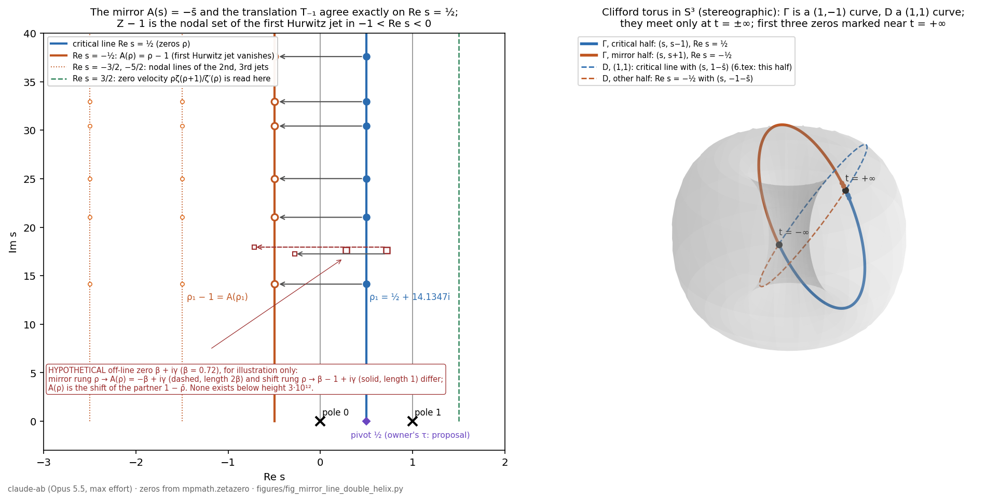

# The mirror line Re s = −½, the first Hurwitz jet, and the two centres of reflection

Claude (claude-ab lane), model `claude-opus-5-5` (Opus 5.5) at maximum reasoning effort. 25 September 2026, begun 07:32 UTC. Revised at 08:24 UTC after an independent referee pass (16 findings, listed in §11), with §10 added in answer to three further messages from the owner.

This note answers messages from the owner of 25 September (M12, M13, and in §10 M14–M16). All are kept verbatim in the owner's private provenance file.

- In the first, the owner proposes a second critical line at Re s = −½: "It's at minus one half. And it mirrors the line exactly. And it is invisible […]"
- In the second, the owner asks for that line to be built as a chiral double-helix partner of the critical line, by shifting the entire line as the programme's Hurwitz shift does. The expected outcome, decoded from keyboard-shifted text: the partner "is off the critical line — because the whole line is shifted, but in a way that does not contradict RH".

The theorems and propositions below are proved in the note or checked by `checks/mirror_line_hurwitz_jet_check.py` (output in `checks/mirror_line_hurwitz_jet_check_OUTPUT.txt`) and `checks/davenport_heilbronn_coexistence_check.py`. The paragraphs headed "Reading" and the comparisons in §§7–8 are interpretations, not proofs. Figure 17.1 is made by `figures/fig_mirror_line_double_helix.py`.

## 0. Notation

- Z is the multiset of nontrivial zeros of ζ. By the functional equation and ξ(s̄) = conj ξ(s), Z is invariant, with multiplicities, under ρ ↦ 1 − ρ and ρ ↦ ρ̄.
- A(s) = −s̄ is the reflection in the vertical line through the pole at 0. Its fixed set is Re s = 0.
- B(s) = 1 − s̄ = s^# is the reflection in the vertical line through the pivot ½. Its fixed set is Re s = ½.
  - In the centred coordinate z = s − ½, B is z ↦ −z̄. This has the form of the owner's "Cartan involution ζ ↦ −ζ̄" (message M7). In the owner's file `modular_cartan_realform_bridge_20260719.tex` that involution acts on a complex modular parameter and fixes its imaginary axis. Applied to z = s − ½ the formula gives B; applied to s itself it gives A. Which centre is meant is the question of §5.
- T_c(s) = s + c.
- A direct computation gives B∘A = T₁: B(A(s)) = 1 − conj(−s̄) = 1 + s. So the two centres differ exactly by the one-line shift. (Calling T₁ the "Tate twist" below is a reading: on characters u^s it is multiplication by u, the character carried by the pole at 1.)
- ζ_t(s) = Σ_{n≥1}(n+t)^{−s} = ζ(s, 1+t) is the programme's shifted sheet (`satellites/14_globalization_cue_split_zero_and_shifted_sheets.tex`, §"Shifted Dirichlet flow").

## 1. The first Hurwitz jet vanishes on the zero set moved one line to the left

**Theorem 17.1.**

(a) For every s ≠ 1, ∂_t ζ(s, 1+t)|_{t=0} = −sζ(s+1), where at s = 0 the right side means its holomorphic extension (value −1). More generally, the m-th jet is ∂_t^m ζ(s, 1+t)|_{t=0} = (−1)^m (s)_m ζ(s+m).

(b) The function sζ(s+1) is entire, and its value at s = 0 is 1.

(c) In the strip −1 < Re s < 0, the zeros of the first jet are exactly Z − 1, with multiplicities. In −m < Re s < 1 − m, the zeros of the m-th jet are exactly Z − m.

(d) ζ has no zero on Z − 1. So at each point ρ − 1 the first-order Hurwitz velocity vanishes while ζ itself does not.

**Proof.**

(a) On Re s > 1 this is the programme's theorem thm:gcue-shift-flow, with a_n = 1 (ζ(s, 1+t) is DLMF 25.11.1 with a = 1+t). The Euler–Maclaurin representation of ζ(s, a) shows that it is jointly analytic on {s ≠ 1} × {Re a > 0}. So ∂_aζ(s,a) and −sζ(s+1,a) are analytic in s ≠ 1, agree on Re s > 1, and agree everywhere by the identity theorem. The jet formula for m ≥ 2 follows in the same way from the programme's formula ∂_t^m L_t(s) = (−1)^m(s)_m L_t(s+m).

(b) ζ(s+1) has a single simple pole, at s = 0, with residue 1. So sζ(s+1) extends holomorphically there with value 1: the residue at 1 becomes an ordinary value at 0.

(c) Take −1 < Re s < 0. The factor s does not vanish there, and 0 < Re(s+1) < 1, so ζ(s+1) = 0 exactly when s + 1 ∈ Z. The trivial zeros −2, −4, … lie outside the strip.
- For general m: (s)_m vanishes only at 0, −1, …, 1 − m, and none of these has real part in (−m, 1 − m). The pole of ζ(s+m) at s = 1 − m lies on the boundary of the strip.

(d) Points of Z − 1 have real part in (−1, 0). There ζ has no zeros: ζ(s) ≠ 0 for Re s ≥ 1 (Euler product and Hadamard–de la Vallée Poussin), and the functional equation ζ(s) = χ(s)ζ(1−s) leaves only the trivial zeros in Re s ≤ 0 (Titchmarsh, *The Theory of the Riemann Zeta-Function*, 2nd ed., Oxford 1986, chs. I–III). ∎

Only (a) is general: it holds for every L_t of the programme's theorem. Parts (b)–(d) use ζ's pole and zero-free regions.

**Checks.**
- The central t-difference agrees with −sζ(s+1) to below 6·10⁻²⁰ at s = 2.3+1.1i, ½+14.1347i, −½+3i and ¼−7.5i. The last three lie outside Re s > 1.
- sζ(1+s) = 1.000…005772 at s = 10⁻²⁰, which is 1 + γ_E s, as expected.
- The t-derivative of ζ(s, 1+t), computed directly by mpmath's adaptive differentiation at s = ρ_k − 1, has absolute value below 4·10⁻²⁹ for k = 1, 2, 3 (at s + 0.3 it is 2.99, 6.02, 8.43). Meanwhile |ζ(ρ_k − 1)| = 1.2255, 2.2224, 2.9643.
- The second and third jets vanish at ρ₁ − 2 and ρ₁ − 3 (closed formula). mp.diff reproduces the jet formula at s = 1.7 + 0.9i and at s = −0.6 + 8.3i, which lies outside Re s > 1.

**The two neighbouring lines.**
- The flow t ↦ ζ(s, 1+t) does not translate Z; its zeros move. A simple zero ρ of ζ moves with velocity ρ′(0) = ρζ(ρ+1)/ζ′(ρ), obtained by implicit differentiation of ζ(ρ(t), 1+t) = 0 using (a).
  - This value is read at ρ + 1: on Re s = 3/2 for ρ on the critical line, on Re s = 1 + Re ρ in general.
  - For ρ₁, ρ′(0) = 0.98358 + 9.65780i, agreeing with (root(t) − root(−t))/2t to 12 digits. The first zero therefore leaves the line to the right as t increases; the second has Re ρ′(0) = −0.44179.
- These velocities are the initial tangents of the zero tracks of ζ(s, 1+t), 0 ≤ t ≤ 1, in `figures/fig_shifted_flow_crossings.py` (digest Figure 3). The saved tracks give forward differences over [0, 0.005] of 0.98327 + 9.65439i, −0.44268 + 12.26164i and 1.86137 + 13.45198i for the first three zeros, against 0.98358 + 9.65780i, −0.44179 + 12.27515i and 1.86075 + 13.44988i from the formula.
- So, for zeros on the critical line, the flow reads its velocity on Re s = 3/2, and its first jet has its nodal set on Re s = −½ under RH (unconditionally, Z − 1 lies in −1 < Re s < 0).
- These two lines are B-mirror images: B(3/2 + iγ) = −½ + iγ.

## 2. The shifted set is the mirror set; pointwise agreement is RH

**Theorem 17.2.**

(a) A(Z) = Z − 1 as multisets. This holds unconditionally.

(b) For every s, A(s) − T₋₁(s) = 1 − 2Re s. Hence, for ρ ∈ Z, A(ρ) = ρ − 1 exactly when Re ρ = ½, and

  RH ⟺ A(ρ) = ρ − 1 for every nontrivial zero ρ.

(c) For every ρ, A(ρ) = B(ρ) − 1. So the mirror of ρ is the shift of its partner ρ^#.

**Proof.**
- (a) −ρ̄ = (1 − ρ̄) − 1, and 1 − ρ̄ ∈ Z with the multiplicity of ρ, by the two symmetries in §0.
- (b) −s̄ − (s − 1) = 1 − (s + s̄) = 1 − 2Re s.
- (c) B(ρ) − 1 = 1 − ρ̄ − 1 = −ρ̄. ∎

**Reading.** The zero set carries two ladders of horizontal rungs.
- The shift ladder joins ρ to ρ − 1; its rungs have length 1.
- The mirror ladder joins ρ to A(ρ) = −ρ̄; its rungs have length 2Re ρ ∈ (0, 2).
- The two coincide iff Re ρ = ½.
- At a hypothetical off-line zero, the mirror rung from ρ ends at −ρ̄, which is where the shift rung from the partner ρ^# = 1 − ρ̄ ends. The rungs at height γ lie on one horizontal line and overlap. Figure 17.1 (left) draws one such pair, dashed and labelled hypothetical. No such zero exists below height 3·10¹² (Platt–Trudgian, BLMS 53 (2021) 792–797).

In this exact sense the owner's two operations produce the same line at Re s = −½: the mirror A in the place of the pole at 0, and the translation T₋₁ of the whole line (whose image Z − 1 is the nodal set of the first Hurwitz jet in −1 < Re s < 0).
- As sets they agree unconditionally.
- As maps on the zeros they agree exactly under RH.
- The set contains no zero of ζ, because ζ has no zeros in −1 < Re s < 0 (proof of Theorem 17.1(d)).

## 3. The chiral pair of circles, and the helix over a meridian

**Proposition 17.3.**

(a) *Equator.* Write w = z₂/z₁ for [z₁ : z₂] ∈ ℂP¹, so the equator is |w| = 1. For s ∉ {0, 1}, the point [s : s − 1] lies on the equator iff Re s = ½. For s ∉ {0, −1}, the point [s : s + 1] lies on the equator iff Re s = −½.

(b) *One circle from two lines.* Normalise the pairs (s, s − 1) for s = ½ + it and (s, s + 1) for s = −½ + it to unit vectors in ℂ². Then:
- The first family is Γ(ψ) = (e^{iψ}, −e^{−iψ})/√2 with ψ = arctan 2t ∈ (−π/2, π/2).
- The second family is Γ(ψ) with ψ = π − arctan 2t ∈ (π/2, 3π/2).
- So the critical line and the line at −½ are the two open halves of one closed curve Γ on the Clifford torus |z₁| = |z₂| = 1/√2, joined at t = +∞ (the point (i, i)/√2) and at t = −∞ (the point (−i, −i)/√2).
- Γ is a (1, −1) torus curve. It is the fibre over [1 : −1] of the conjugate Hopf map (z₁, z₂) ↦ [z₁ : z̄₂], and it runs twice around the equator of the ordinary Hopf map [z₁ : z₂].

(c) *The opposite-handed strand.* The fibre D = {(e^{iφ}, e^{iφ})/√2} of the ordinary Hopf map over [1:1] is a (1, 1) curve. Γ is a (1, −1) curve, so for any fixed orientation of the torus the two have opposite handedness.
- `6.tex` (Theorem "Hopf Fiber Localization") maps the critical line, with the pairing (s, 1 − s̄), into D. Since Re s = ½ > 0 forces arg s ∈ (−π/2, π/2), the image is only the open half φ ∈ (−π/2, π/2). The corollary in `6.tex` (lines 926–928), which states that the image is the whole fibre, overclaims.
- The line at −½, with its own reflection s ↦ −1 − s̄, gives the other half.
- Γ and D meet exactly at the two points t = ±∞.

(d) *Helix over a meridian.* For ρ = β + iγ and x = log u ∈ ℝ, consider the character pairs P_A(x) = (e^{ρx}, e^{A(ρ)x}) and P_T(x) = (e^{ρx}, e^{(ρ−1)x}), normalised to S³. Under H(z, w) = (2z w̄, |z|² − |w|²):

  H(P_A(x)) = (sech 2βx, tanh 2βx),  H(P_T(x)) = (sech x, tanh x).

- Both curves run along the same meridian of S² through the equator point (1, 0), which they reach at x = 0, i.e. u = 1.
- The mirror pair runs at speed 2β and the shift pair at speed 1.
- The height γ appears only in the common phase e^{iγx}, the fibre coordinate that H forgets.
- So the two strands match (the shift "modulated to match") iff β = ½.

**Proof.**
- (a) |s − 1|² − |s|² = 1 − 2Re s and |s + 1|² − |s|² = 1 + 2Re s.
- (b) For s = ½ + it, |s| = |s − 1| and s − 1 = −s̄. So the normalised pair is (e^{iφ}, −e^{−iφ})/√2 with φ = arg s = arctan 2t.
  - For s = −½ + it, s + 1 = ½ + it has argument φ = arctan 2t, and s = −(½ − it) has phase −e^{−iφ}. Put ψ = π − φ; then −e^{−iφ} = e^{iψ} and e^{iφ} = −e^{−iψ}.
  - On Γ, z₁z₂ = −½ and [z₁ : z̄₂] = [e^{iψ} : −e^{iψ}] = [1 : −1], while [z₁ : z₂] = [1 : −e^{−2iψ}].
- (c) Γ(ψ) = D(φ) forces e^{iψ} = e^{iφ} and −e^{−iψ} = e^{iφ}, hence e^{2iψ} = −1 and ψ = ±π/2. These two points are exactly the limits t → ±∞ computed in (b).
- (d) P_A(x) = e^{iγx}(e^{βx}, e^{−βx}). After normalisation, 2zw̄ = 2/(e^{2βx} + e^{−2βx}) = sech 2βx and |z|² − |w|² = tanh 2βx.
  - P_T(x) = e^{ρx}(1, e^{−x}), so H(P_T(x)) = (2e^{−x}/(1 + e^{−2x}), (1 − e^{−2x})/(1 + e^{−2x})) = (sech x, tanh x). ∎

**Check.** The normalised pairs agree with Γ to 3·10⁻³¹ at 14 sample points on the two halves. |w| = 1.0 to all printed digits on both lines. On Re s = ±0.3, |w| = 2.236, 1.169, 1.001, 1.0000002 at t = 0.1, 1, 14.13, 1000. Equality holds only in the limit t → ∞, which is where the two circles meet.

**The contragredient strand.** The pair (e^{ρx}, e^{−ρx}) has H = (sech(2βx)·e^{2iγx}, tanh 2βx). There the height enters the base point as a rotation in longitude. So the opposite-handed (contragredient) partner makes γ visible on S², while the A-mirror hides γ in the fibre. This is one precise sense of "invisible" in (d). It uses the diagonal-phase invariance stated in `giuga_blind_plane_cayley_dickson.tex`, Theorem "Projection loss and arithmetic recovery", with the common phase being the height of the zero; it is not that theorem.

## 4. The receivers: the mirror is reached only by reversing the flow

For σ ∈ ℝ let H_σ = L²((0,∞), u^{2σ−1}du), the unweighted (δ = 0) receivers of `14_CONTINUATIONS_25SEP_PART3_WEIGHT_RECEIVERS_AND_TENSOR_GROWTH.md`, with the dilations U_a f(u) = f(au).

**Proposition 17.4.**

(a) I₀ f(u) = f(1/u) is an isometry of H_σ onto H_{−σ}. On Mellin transforms, Mf(s) = ∫f(u)u^{s−1}du, it acts by M(I₀f)(s) = Mf(−s). It reverses the flow: I₀U_a = U_{1/a}I₀.

(b) I_{½} f(u) = u^{−1}f(1/u) is an isometry of H_σ onto H_{1−σ}, acting by s ↦ 1 − s. Multiplication by u is an isometry of H_{σ+1} onto H_σ, acting by s ↦ s + 1.

(c) *Blind lemma.* If σ ≠ σ′, every bounded operator K : H_σ → H_{σ′} with KU_a = U_aK for all a > 0 is zero.

(d) The Haar pairing ⟨f, g⟩₀ = ∫fg du/u is bounded on H_σ × H_{−σ} and dilation invariant. The Lebesgue pairing ⟨f, g⟩₁ = ∫fg du is bounded on H_σ × H_{1−σ} and satisfies ⟨U_af, U_ag⟩₁ = a^{−1}⟨f, g⟩₁. They are related by ⟨f, ug⟩₀ = ⟨f, g⟩₁.

**Proof.**

(a) Substitute v = 1/u: ∫|f(1/u)|²u^{2σ−1}du = ∫|f(v)|²v^{−2σ−1}dv. The same substitution gives ∫f(1/u)u^{s−1}du = ∫f(v)v^{−s−1}dv = Mf(−s). Finally, (I₀U_af)(u) = f(a/u) = (U_{1/a}I₀f)(u).

(b) The same substitutions: ∫|u^{−1}f(1/u)|²u^{2σ−1}du = ∫|f(v)|²v^{1−2σ}dv, and ∫|uf|²u^{2σ−1}du = ‖f‖²_{σ+1}.

(c) ‖U_af‖_σ = a^{−σ}‖f‖_σ, so U_a = a^{−σ}V_a with V_a unitary on H_σ, and likewise U_a = a^{−σ′}V′_a on H_{σ′}.
- KU_a = U_aK gives V′_aK = a^{σ′−σ}KV_a.
- Hence ‖Kf‖ = ‖V′_aKf‖ ≤ a^{σ′−σ}‖K‖‖f‖ for every a > 0.
- Let a → ∞ if σ′ < σ, or a → 0 if σ′ > σ. Then Kf = 0.

(d) Cauchy–Schwarz: ∫|fg|du/u = ∫|f|u^{σ−½}·|g|u^{−σ−½}du ≤ ‖f‖_σ‖g‖_{−σ}, and ∫|fg|du ≤ ‖f‖_σ‖g‖_{1−σ}. Invariance and the twist follow from the substitution v = au. ∎

**Reading.**
- The receiver at −½ is an exact isometric copy of the critical receiver, and its Mellin line is Re s = −½.
- No nonzero bounded operator from the critical receiver to it commutes with the flow (c). Boundedness is essential. The identity on C_c^∞(0,∞) is a nonzero, closable, densely defined operator H_½ → H_{−½} that commutes with every U_a.
- Compare the equivariant blind-plane theorem of `giuga_blind_plane_cayley_dickson.tex`: the conclusion is the same, but the mechanism differs. There, distinct unitary characters kill every equivariant map with no boundedness needed. Here, the unbounded scalar a^{σ′−σ} does the killing, and only for bounded maps.
- The receiver at −½ is reached by the flow-reversing isometry I₀ (the owner's "anti-causal involution", M7). It is also reached by the neutral pairing ⟨·,·⟩₀, which is where the two partners "cancel" to the trivial character.
- The critical receiver is self-paired only under the twisted pairing ⟨·,·⟩₁. Its twist a^{−1} is, in the reading of §0, the character of the pole at 1.

## 5. Where an anomaly can sit: the explicit formula with the two centres

Let (g₁ ⋆ g₂)(x) = ∫g₁(y)g₂(x/y)dy/y, and ĝ(s) = ∫₀^∞g(x)x^{s−1}dx. The explicit formula is used in Weil's form as written by Bombieri (*Problems of the Millennium: the Riemann Hypothesis*, Clay Mathematics Institute, §V):

  Σ_ρ ĥ(ρ) = ĥ(0) + ĥ(1) − Σ_n Λ(n)[h(n) + h(1/n)/n] − (log 4π + γ_E)h(1) − ∫₁^∞ [h(x) + h(1/x)/x − 2h(1)/x] dx/(x − 1/x).

**Proposition 17.5.**

(a) *Centre ½.* Put g*(x) = x^{−1}conj g(1/x) and h = g ⋆ g*. Then:
- ĥ(s) = ĝ(s)·conj ĝ(1 − s̄) = ĝ(s)·conj ĝ(B s);
- h(1/x) = x·conj h(x);
- both sides of the explicit formula are real;
- an off-line pair {ρ, ρ^#} contributes 2Re(ĝ(ρ)·conj ĝ(ρ^#)), which is an indefinite Hermitian form in (ĝ(ρ), ĝ(ρ^#)) with matrix [[0,1],[1,0]] and eigenvalues ±1, while an on-line zero contributes |ĝ(ρ)|² ≥ 0.

Weil's criterion (A. Weil, "Sur les 'formules explicites' de la théorie des nombres premiers", Comm. Sém. Math. Univ. Lund, vol. suppl. (1952), 252–265; Bombieri, loc. cit.) states that RH is equivalent to Σ_ρ ĥ(ρ) ≥ 0 for these h, with g in Bombieri's test class and ĝ(0) = ĝ(1) = 0.

(b) *Centre 0.* Put g^♭(x) = conj g(1/x) and h = g ⋆ g^♭. Then:
- ĥ(s) = ĝ(s)·conj ĝ(−s̄) = ĝ(s)·conj ĝ(A s);
- h(1/x) = conj h(x);
- the prime term has imaginary part Σ_n Λ(n)(1 − 1/n) Im h(n). The factor 1/n (the Tate twist, in the reading of §0) is left uncancelled;
- the sum over zeros is not real in general.

**Proof.**

(a) Substituting y = 1/x gives ĝ*(s) = ∫conj g(y)·y^{−s}dy = conj ĝ(1 − s̄). The Mellin transform turns ⋆ into a product.
- Reality: B permutes Z with multiplicities. So conj Σ ĝ(ρ)conj ĝ(Bρ) = Σ conj ĝ(ρ)ĝ(Bρ), and re-indexing ρ′ = Bρ returns the original sum.
- h(1/x) = x·conj h(x) follows from the substitution w = y/x in the convolution integral. It makes h(n) + h(1/n)/n = 2Re h(n).
- The 2 × 2 block is the expansion of the pair's contribution.

(b) The same substitutions give ĝ^♭(s) = conj ĝ(−s̄) and h(1/x) = conj h(x). ∎

**Check (explicit, both sides computed independently).**
- Test function: g(x) = exp(−(log x)²/(2w) + i b log x). Its transform ĝ(s) = √(2πw)·e^{w(s+ib)²/2} is Gaussian in vertical strips.
- Zero side: the first ten zeros and their conjugates. Prime side: n ≤ 2·10⁵, plus the archimedean integral.
- With w = 1 and b = ½ − γ₁ one zero dominates, and every other term is below e⁻⁵⁰:

| centre | zero side | prime + archimedean side | difference |
|---|---|---|---|
| ½ (Weil) | 6.28318530717959 = 2π | 6.28318530717958 + 1.8·10⁻³⁰ i | 4·10⁻¹⁵ |
| 0 | 5.51401385870661 + 3.01231950004459 i = 2πe^{i/2} | 5.51401385870592 + 3.01231950004606 i | 1.6·10⁻¹² |

- With w = 0.1 and b = −25 the first six zeros contribute. The ½-centred sum is 0.811740610857893, real, matched to 3·10⁻¹⁸. The 0-centred sum is 0.796171499070122 − 0.0322071550546131i, matched to 4·10⁻¹⁸.
- The referee found the same values independently, and also computed the archimedean term from its digamma form.

The agreement also confirms the normalisation of the formula as displayed.

**Reading.**
- Requiring a real partner pairing selects the centre ½, the owner's τ at the pivot (recorded in `13_` as a proposal), and excludes the pole at 0.
- Once centred there, the only possible source of negativity is the 2 × 2 hyperbolic block of an off-line pair.
- So an "anomaly" in the only sense in which the pairing can detect one is an off-line zero. By Weil's criterion, a negative value exists iff RH fails.

## 6. What this does and does not show

**Shown.** The owner's construction exists and has exact form.
- The chiral partner of the critical line is the whole zero set shifted by one: Z − 1 = A(Z). It is the nodal set of the first Hurwitz jet in −1 < Re s < 0; the full nodal set also contains −3, −5, −7, ….
- It lies at Re s = −½ under RH and contains no zero of ζ. Its receiver H_{−½} admits no nonzero bounded map from H_½ that commutes with the dilations.
- It closes the critical line into one circle on the Clifford torus, and its helix runs over the same meridian as the shift.
- It does not contradict RH: the chain of equivalences

  RH ⟺ A = T₋₁ on Z ⟺ every shift rung (ρ, ρ − 1) lies over the equator ⟺ (Weil) the ½-centred pairing is nonnegative

  consists of exact reformulations.

**Not shown, and why no disproof follows.**
- *Direct argument.* Every statement of 17.2–17.5 is either unconditional (true whether or not RH holds) or an equivalence with RH itself. None can therefore decide RH. The second half of Γ is the first half with its coordinates swapped, (ρ, ρ − 1) ↦ (ρ − 1, ρ), so closing the circle adds no information about Z.
- *Model argument.* Theorem 17.2 and Propositions 17.3–17.5 use three inputs: the B-symmetry of the zeros, their location in the strip, and an explicit formula with a positivity criterion. All three have counterparts for the zeta function ζ_C(s) = Z(C, q^{−s}) of a smooth projective curve C over a finite field.
  - The explicit formula there is not of the same shape. ζ_C is periodic with period 2πi/log q, the prime sum runs over places, and there is no Γ-factor integral. But Weil's explicit formula and positivity criterion hold there.
  - The zeros are symmetric under B by the functional equation and integrality, and they all lie on Re s = ½ (A. Weil, *Sur les courbes algébriques et les variétés qui s'en déduisent*, Hermann 1948; see M. Rosen, *Number Theory in Function Fields*, GTM 210, Springer 2002, ch. 5 and the appendix). So these properties are satisfied by zeta functions for which RH holds, and they cannot by themselves imply that some zero of ζ is off the line.

Theorem 17.1 is specific to ζ. By 17.2(a), however, its nodal set is the unconditional mirror set, so it adds no information about where Z lies.

A disproof of RH requires one zero ρ with ρ^# ≠ ρ, equivalently, by Weil's criterion, one test function with a negative ½-centred sum.

## 7. Relation to the owner's files

The two files below are the owner's private originals, received on 25 September; the Giuga note is dated 12 July 2026, and `6.tex` carries no date. They are not public. They are cited by title, theorem name and line number. What this note reproduces from them:
- the invariant C(s) = 32(1−σ)²t² and its root argument;
- the statement of "Hopf Fiber Localization" and its corollary, with the pairing (s, 1 − s̄);
- the statement Hom_{T²}(Q, P) = 0;
- the (standard) Hopf quotient formula.

- **`giuga_blind_plane_cayley_dickson.tex`** (read in full).
  - Its equivariant blind-plane theorem (Hom_{T²}(Q, P) = 0) and Proposition 17.4(c) have the same conclusion by different mechanisms (§4, Reading).
  - Proposition 17.3(d) uses the diagonal-phase invariance stated in its Hopf projection-loss theorem, with the common phase being the height of the zero.
  - The file's own audit of `6.tex` shows that the quartet family never reaches the sedenion zero divisors. Nothing here depends on the sedenion construction.
- **`6.tex`**, §"Geometric Localization via the Hopf Fibration" (lines 869–1073, read in full). Its Theorem "Hopf Fiber Localization" gives half of the (1,1) circle D of Proposition 17.3(c); its corollary's claim of the whole fibre overclaims (17.3(c)). The (1,−1) circle Γ, a fibre of the conjugate Hopf map, is new here. The line at −½ is the second half of each.
- **`6.tex`**, Corollary to "The Commutator Norm Invariant" (lines 687–712).
  - The displayed invariant is C(s) = 32(1−σ)²t², and for t ≠ 0, C(s) = 8t² gives σ ∈ {½, 3/2}. `6.tex` discards 3/2 as outside the strip.
  - Composing with σ ↦ 1 − σ gives 32σ²t², and for t ≠ 0, 32σ²t² = 8t² gives σ ∈ {½, −½}.
  - For t ≠ 0 the two conditions together single out σ = ½ without any strip restriction (at t = 0 both hold for every σ). Their extraneous roots, 3/2 and −½, are the reflections of the critical line in the poles 1 and 0.
  - So the owner's line at −½ is already present in the owner's own invariant, as the extraneous root of its functional-equation mirror. (Derived from the displayed formula only.)

## 8. Items for the goals

- **Goal 1 (negative results).**
  - The mirror line and the anomaly-cancellation mechanism do not disprove RH. Every statement used is unconditional or equivalent to RH, and the properties used have counterparts for curves over finite fields, where RH is a theorem (§6).
  - The pairing centred at the pole 0 is not Hermitian (sum 2πe^{i/2} in §5), so as it stands it is not a positivity criterion.
  - Coexistence of ζ with its translates does not force the zeros onto the line (§10, the Davenport–Heilbronn function).
- **Goal 2 (bridges).**
  - The generator Df(s) = s f(s+1) of the programme's shift flow (thm:gcue-shift-flow) has nodal set Z − 1 = A(Z) in −1 < Re s < 0. On the critical line, T₋₁ coincides with A.
  - B∘A = T₁, which in the reading of §0 is the Tate twist carried by the pole at 1.
  - `6.tex` gives half of the (1,1) circle D. The (1,−1) circle Γ, a fibre of the conjugate Hopf map, is new here.
- **Goal 3 (lemmas stateable independently).**
  1. For every nontrivial zero ρ of ζ, ∂_aζ(s, a)|_{a=1} vanishes at s = ρ − 1, where ζ does not vanish. In −1 < Re s < 0 these are all the zeros. (Classical ingredients: the identity ∂_aζ(s,a) = −sζ(s+1,a) and the zero-free regions. No novelty claimed.)
  2. Proposition 17.4(c), the blind lemma for weighted L² receivers. (A scaling argument; boundedness is essential. No novelty claimed.)
  3. Proposition 17.5(b): with the 0-centred involution the explicit-formula sum is not real, witnessed by an explicit Gaussian example. (Not searched.)
- **Goal 4 (F1 context).**
  - The difference between centring at 0 and centring at the pivot is exactly one translation T₁, read as a Tate twist.
  - The pole at 1 is carried to the value 1 at 0 by the Hurwitz generator: sζ(1+s)|_{s=0} = 1.

## 9. Checks

| file | what | result |
|---|---|---|
| `checks/mirror_line_hurwitz_jet_check.py` | 17.1(a)–(d) (with direct t-derivatives and a test point outside Re s > 1), zero velocities, 17.2, 17.3(a)–(b), 17.5 with both sides and two test functions | all agree; output in `checks/mirror_line_hurwitz_jet_check_OUTPUT.txt` |
| `checks/davenport_heilbronn_coexistence_check.py` | §10: the functional equation of the Davenport–Heilbronn function, its zero off the line, and the corresponding zero of its translate | all agree; output in `checks/davenport_heilbronn_coexistence_check_OUTPUT.txt` |
| `figures/fig_mirror_line_double_helix.py` | Figure 17.1 | zeros from `mpmath.zetazero` |

**Figure 17.1.**
- *Left.* The critical line with the first six zeros, the mirror/shift line Re s = −½ carrying A(ρ) = ρ − 1, the nodal lines of the second and third jets, and the line Re s = 3/2 where the zero velocity is read. One hypothetical off-line pair, labelled, shows that the mirror rung and the shift rung end at different points.
- *Right.* The Clifford torus, stereographically projected, with the (1,−1) circle Γ (critical half blue, mirror half orange) and the (1,1) circle D (dashed), half of which is the image in `6.tex`. The two circles meet only at t = ±∞; the first three zeros sit near t = +∞.

## 10. Simultaneity: the two functions exist together, and what that implies

The owner's messages M14–M16 (25 September, about 08:00–08:20 UTC) make three points.
- The point is not the mirroring but the simultaneous existence of both: "there's two. And there is never not two."
- A second zeta function whose critical zeros have real part −½ "indisputably and always" would be "a violation to the Riemann hypothesis".
- Or perhaps "the fact that there's two of them means neither of them can have critical zeros off the line."

**Proposition 17.6 (the ladder).** For every s ≠ 1 and |t| < 1,

  ζ(s, 1+t) = Σ_{m≥0} (−t)^m (s)_m/m! · ζ(s+m),

where each term at s + m = 1 is read as its holomorphic extension. The m-th coefficient has, in −m < Re s < 1 − m, exactly the zeros Z − m.

*Proof.* For fixed s ≠ 1, a ↦ ζ(s, a) is holomorphic on Re a > 0 (joint analyticity, §1). Hence t ↦ ζ(s, 1+t) is holomorphic on |t| < 1 and equals its Taylor series there. By 17.1(a) its coefficients are ∂_t^m ζ(s,1+t)|_{t=0}/m! = (−1)^m(s)_mζ(s+m)/m!. The zeros are 17.1(c). ∎

So the Hurwitz family holds ζ(s), ζ(s+1), ζ(s+2), … simultaneously (with polynomial factors). Under RH their nontrivial zeros lie on Re s = ½, −½, −3/2, …. "There is never not two" holds exactly, with infinitely many.

**Proposition 17.7 (two statements, one proposition).** Consider

- (R) every nontrivial zero of ζ(s) has real part ½;
- (R′) every zero of ζ(s+1) in the strip −1 < Re s < 0 has real part −½.

Then (R) ⟺ (R′). More precisely:
- ρ is a nontrivial zero of ζ off Re s = ½ iff ρ − 1 is a zero of ζ(s+1) in the strip off Re s = −½, with the same multiplicity;
- no zero of ζ(s+1) in the strip is a zero of ζ.

*Proof.* T₋₁ is a bijection of the zero sets preserving multiplicities, and Re(ρ − 1) = Re ρ − 1. The last part is the proof of 17.1(d). ∎

**Reading.**
- The zeros "at −½" are zeros of ζ(s+1). That they do not have real part ½ says nothing about any zero of ζ(s), so they are not counterexamples to (R).
- The second set was produced by an action: T₋₁ on the plane, or the generator D on functions. An action carries true statements to true statements, so it cannot create a contradiction with (R).
- The owner's third message is Proposition 17.7: the two stand or fall together.

**Proposition 17.8 (coexistence does not decide).** Let f be the Davenport–Heilbronn function (Titchmarsh, 2nd ed., §10.25):

  f(s) = ((1 − iκ)/2)L(s, χ) + ((1 + iκ)/2)L(s, χ̄),

where χ is the character mod 5 with χ(2) = i, and κ = (√(10 − 2√5) − 2)/(√5 − 1).

(a) f satisfies a functional equation of the same kind as ζ's, f(s) = X(s)f(1−s) with X(s) = 5^{½−s}·2(2π)^{s−1}Γ(1−s)cos(πs/2).

(b) f vanishes at z₀ = 0.808517182456637 + 85.6993484853776i, which is off Re s = ½, and at its partner 1 − z̄₀ = 0.191482817543 + 85.6993484854i. Spira (Math. Comp. 63 (1994) 747–748) lists this zero.

(c) The translate f(s+1) coexists with f exactly as ζ(s+1) coexists with ζ(s), and it vanishes at z₀ − 1 = −0.191482817543 + 85.6993484854i, off Re s = −½.

*Check* (`checks/davenport_heilbronn_coexistence_check.py`):
- the functional equation holds to ≤ 2·10⁻³⁰ (relative) at three points;
- |f(z₀)| = 1.2·10⁻³²;
- |f(1 − z̄₀)| = 2.9·10⁻²⁹;
- the translate g(s) = f(s+1) has |g(z₀ − 1)| = 3.7·10⁻³².

So coexistence of a function with its translate, together with a functional equation, does not force the zeros onto the line.

**Reading.** What f lacks and ζ has is an Euler product: f is a linear combination of two L-functions. An argument from coexistence can therefore have force only if the pairing of the copies uses the primes. This agrees with the assessment in the digest, §1.1: a separating step has to use unique factorization, the positive prime measure, the prime clocks, or the self-dual functional equation.

**Proposition 17.9 (superposition moves zeros off the line).**

(a) As separate functions, ζ(s) and ζ(s+1) do not interact (17.7). Superposed, as in ζ(s, 1+t) = ζ(s) − t·sζ(s+1) + O(t²), they move the zeros. Since ρ₁(t) = ρ₁ + tρ₁′(0) + O(t²) with Re ρ₁′(0) = 0.98358 (§1), the first zero of ζ(s, 1+t) lies off Re s = ½ for all small t > 0.

(b) The programme's even sheet is a superposition of two Euler products:

  Z_{1/5}(s) = ζ(s, 1/5) + ζ(s, 4/5) = 5^s Σ_{n ≡ ±1 mod 5} n^{−s} = 5^s·½(L(s, χ₀) + L(s, (·/5))),

with χ₀ the principal character mod 5. It has 24 zeros with Re s > 0.505 below height 150 (`08_`; digest Figure 1).

*Proof of (b).*
- ζ(s,1/5) + ζ(s,4/5) = Σ_{n≥0}[(n + 1/5)^{−s} + (n + 4/5)^{−s}] = 5^s Σ_{n≥0}[(5n+1)^{−s} + (5n+4)^{−s}].
- For n prime to 5, ½(1 + (n/5)) equals 1 if n is a square mod 5, that is n ≡ ±1, and 0 otherwise. For 5 | n both characters vanish. ∎

**Reading.** The zeros that leave the line are zeros of the superposed functions ζ(s, 1+t) (t ≠ 0) and Z_{1/5}. RH makes no claim about these.

**On the charitable reading (M15).** Read charitably, the proposal resolves one tension exactly: "the only real part is ½" and "there is another real part, −½" are both true, of different functions, and they are one statement in two charts (17.7). It does not resolve RH, since (R′) is provably equivalent to (R) and therefore exactly as hard.

## 11. Referee findings applied (08:23–08:24 UTC)

An independent referee pass on this note ran from about 07:45 to 08:20 UTC. It reproduced the check script's output byte for byte and verified every theorem and proposition, including with its own explicit-formula tests. It made 16 findings, all applied.

1. §1 is retitled. The flow ζ(s, 1+t) moves zeros; only its first jet vanishes on Z − 1. The same correction is made in §2, in §8 (goal 2) and in the Figure 17.1 title.
2. The rung lengths in §2 are corrected: shift rungs have length 1, mirror rungs 2Re ρ.
3. The "neighbouring lines" statements in §1 now carry their hypotheses.
4. The corollary in `6.tex` claims the whole fibre; the critical line gives half of it (17.3(c), §7).
5. Γ is new here; it is not in the owner's files (§7, §8).
6. The blind lemma needs boundedness, and its mechanism differs from the Giuga theorem (§4, §6, §7, §8).
7. For curves over finite fields, "exact counterparts" is replaced by "counterparts", with the direct argument added (§6).
8. The convergence-region remark in the checks now says the last three points lie outside Re s > 1.
9. The nodal set of the first jet also contains −3, −5, … (§6).
10. The hypothesis t ≠ 0 is added to the commutator roots (§7).
11. The checks are strengthened: direct t-derivatives, a jet test outside Re s > 1, and a second explicit-formula test in which several zeros contribute.
12. The privacy paragraph now lists what is reproduced, and the dates of the two files are corrected (§7).
13. Interpretations are labelled as such: the intro, the Cartan-involution identification in §0, "one precise sense" in §3, the Tate-twist readings, and "not a positivity criterion as it stands".
14. Handedness is stated as (1,1) versus (1,−1).
15. The Titchmarsh citation now reads chs. I–III.
16. Minor wording: the value at s = 0, the definition of w, the full name of note 14, the scope of 17.1, and the truncation mark in the M12 quote.

The referee's scripts and full report are kept in the session scratch space. They are not on the branch.
