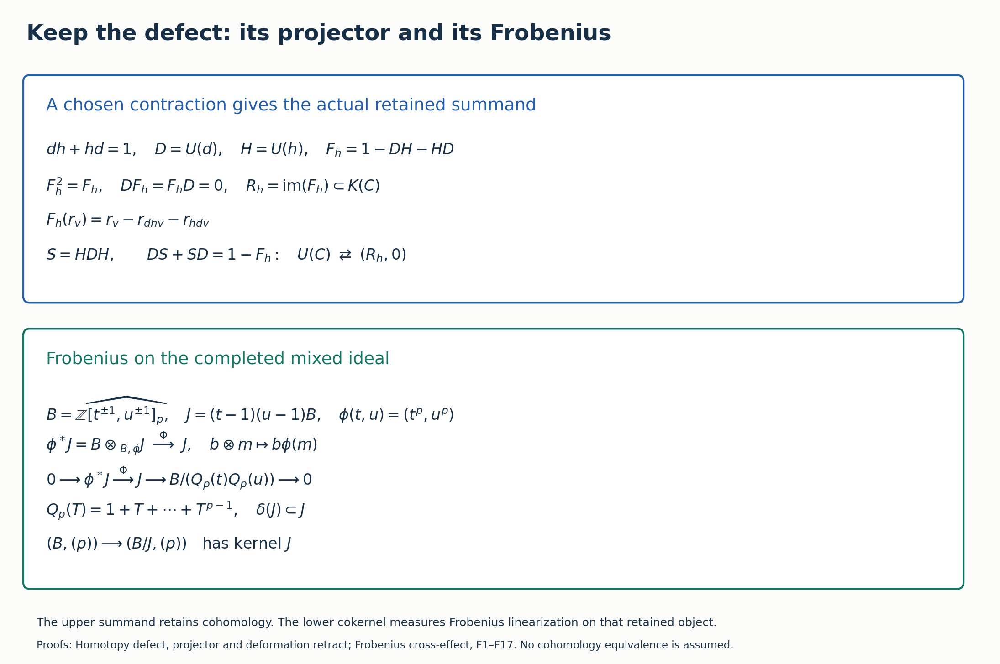

# The retained object of a contracting homotopy

This paper constructs an actual zero-differential summand representing the extra cohomology of the reduced free construction on a contractible complex. It retains the contraction, every degree, the additive-relation complex, and the maps under changes of coefficients. The construction is a positive description of the defect of additivity.

## 1. Objects and typed maps

For an abelian group \(V\), let \(U(V)\) be the free abelian group on symbols \(r_v\) for \(v\ne0\), with \(r_0=0\). A homomorphism \(f:V\to W\) gives \(U(f)r_v=r_{f(v)}\). This preserves composition and identities, since both equalities hold on each generator; it sends the zero homomorphism to zero. It need not preserve sums of homomorphisms. Evaluation \(\epsilon_V(r_v)=v\) is a natural surjection, and \(K(V)=\ker\epsilon_V\). The multiplicative scalar ring \(\Lambda=\mathbb Z[\mathbb Z\setminus\{0\}]\) acts by \([n]r_v=r_{nv}\), and every displayed map is \(\Lambda\)-linear, with \([n]\) acting on \(V\) by ordinary integer multiplication.

Let \(C=(C^i,d^i)\) be a cochain complex of abelian groups. Put
\[
D^i=U(d^i):U(C^i)\to U(C^{i+1}),\qquad
D^{i+1}D^i=U(0)=0.
\tag{HD1}
\]
Naturality of evaluation shows that these maps preserve \(K(C^i)\), giving the subcomplex \(K(C)\). Suppose a specified contraction is given:
\[
h^i:C^i\to C^{i-1},\qquad
d^{i-1}h^i+h^{i+1}d^i=\mathrm{id}_{C^i}.
\tag{HD2}
\]
No assumption \(h^{i-1}h^i=0\) is imposed. Define
\[
H^i=U(h^i),\quad
P^i=D^{i-1}H^i,\quad Q^i=H^{i+1}D^i,\quad
F_h^i=\mathrm{id}-P^i-Q^i.
\tag{HD3}
\]
Every summand in the last expression is an endomorphism of \(U(C^i)\). Its generator formula is
\[
F_h^i(r_v)=r_v-r_{d^{i-1}h^iv}-r_{h^{i+1}d^iv}.
\tag{HD4}
\]
Evaluation of this expression is zero by (HD2); hence its image lies in \(K(C^i)\). Unlike the arithmetic expression (HD2), the three symbols in (HD4) have not been equated by a free-group relation.

## 2. The exact projector and deformation retract

**Theorem HD1.** The endomorphism \(F_h\) is a degreewise idempotent satisfying
\[
D^iF_h^i=0,\qquad F_h^{i+1}D^i=0.
\tag{HD5}
\]
Thus \(R_h^i=\operatorname{im}F_h^i\subseteq K(C^i)\) defines a complex with differential zero. Inclusion and the projection \(F_h\) make both \(U(C)\) and \(K(C)\) strongly deformation retract onto \((R_h,0)\). The homotopy is
\[
S^i=H^iD^{i-1}H^i:U(C^i)\to U(C^{i-1}),
\tag{HD6}
\]
with the exact identities
\[
D^{i-1}S^i+S^{i+1}D^i=\mathrm{id}-F_h^i,
\quad S^{i-1}S^i=0,\quad S^iF_h^i=0,\quad F_h^{i-1}S^i=0.
\tag{HD7}
\]

**Proof.** Temporarily suppress degree indices only in compositions whose sources and targets are determined by (HD1)–(HD3). Multiplying (HD2) by d gives \(dhd=d\). Therefore \(a=dh\) and \(b=hd\), in each fixed degree, satisfy \(a^2=a\), \(b^2=b\), and \(a+b=1\). Since \(b=1-a\), both \(ab\) and \(ba\) are zero. Applying U to compositions gives
\[
P^2=P,\quad Q^2=Q,\quad PQ=QP=0,\quad DHD=D.
\tag{HD8}
\]
It is legitimate to apply U to these compositions and zero maps; no additivity of U is used. In the target endomorphism ring, expansion now gives \((1-P-Q)^2=1-P-Q\). Also \(D(1-P-Q)=D-DHD=0\) and \((1-P-Q)D=D-DHD=0\), with the corresponding degree indices. These are (HD5).

For \(S=HDH\), one has \(DS=P^2=P\) and \(SD=Q^2=Q\), proving the first identity (HD7). Also \(DHH D=PQ=0\), so \(S^2=H(DHH D)H=0\). Direct composition gives \(SP=S\), \(SQ=0\), \(PS=0\), \(QS=S\), and hence \(SF=FS=0\). All these equalities have exactly the degree types in (HD6)–(HD7). Naturality of evaluation gives \(\epsilon H=h\epsilon\) and \(\epsilon D=d\epsilon\); consequently H, D and S preserve K. The projection's image lies in K by (HD4), and its restriction to its image is the identity. Thus the same identities prove the two claimed strong deformation retracts. \(\square\)

The full decomposition is
\[
U(C^i)=\operatorname{im}P^i\oplus R_h^i\oplus\operatorname{im}Q^i.
\tag{HD9}
\]
Indeed the three orthogonal idempotents P,F,Q sum to the identity, so every element is their sum and applying each projector proves uniqueness. The differential is zero on the first two summands. Its map
\[
D^i:\operatorname{im}Q^i\xrightarrow{\sim}\operatorname{im}P^{i+1}
\tag{HD10}
\]
has inverse \(H^{i+1}\) on the indicated target. For an element in im Q, \(HD=Q\) acts as identity; for one in im P, \(DH=P\) acts as identity. The image assertions follow by (HD8). Thus the complement of R consists of these explicit two-term complexes with an invertible differential. Intersecting all three summands with K gives the identical decomposition there, since each projector preserves K and R already lies in K. In particular
\[
H^i(U(C))\cong R_h^i\cong H^i(K(C)),
\quad [z]\longmapsto F_h^iz,
\tag{HD11}
\]
with inverse given by including an element of R as a cycle. A cycle differs from its projection by \(D^{i-1}S^iz\), and a boundary has projection zero by (HD5), proving both well-definedness and the inverse assertions directly.

## 3. Changes of contraction and maps between retained objects

Let h and k be contractions on the same C. The map
\[
c_{k,h}^i:R_h^i\to R_k^i,\qquad x\longmapsto F_k^ix
\tag{HD12}
\]
is a canonical isomorphism between the specified summands, with inverse \(c_{h,k}\). For x in R_h, it is a cycle, and (HD7) for k gives \(x-F_kx=DS_kx\). Applying F_h and using F_hD=0 gives \(F_hF_kx=x\). Interchanging h,k proves the other inverse. For a third contraction l, the difference \(F_kx-x\) is a boundary killed by F_l, so \(c_{l,k}c_{k,h}=c_{l,h}\) exactly. Thus the concrete summands depend on the contraction, but their specified transition maps satisfy a strict cocycle law.

Let \(f:C\to C'\) be any cochain map between contractible complexes with chosen contractions h and k. No compatibility between f and those contractions is required. Define
\[
R(f)^i:R_h^i\to R_k^i,
\qquad x\longmapsto F_k^iU(f^i)x.
\tag{HD13}
\]
Since U preserves compositions, U(f) is a cochain map. For composable f,g, the difference \(F_kU(f)x-U(f)x\) is a boundary by (HD7), because U(f)x is a cycle. U(g) sends it to a boundary and the target projector kills it. Therefore \(R(g)R(f)=R(gf)\). The identity map acts as the identity on R. Formula (HD13) defines an actual functor on complexes with chosen contractions and arbitrary cochain maps; (HD12) gives its coherent changes of chosen contraction. When f preserves the contractions, U(f) commutes with P,Q,F and (HD13) is simply its restriction.

There is also an exact formula for a general ordinary homotopy. If \(f,g:C\to C'\) and \(a^i:C^i\to C'^{i-1}\) satisfy
\[
f^i-g^i=d'^{i-1}a^i+a^{i+1}d^i,
\tag{HD14}
\]
put \(A^i=U(a^i)\) and
\[
\Delta_a^i=U(f^i)-U(g^i)-D'^{i-1}A^i-A^{i+1}D^i:
U(C^i)\longrightarrow K(C'^i).
\tag{HD15}
\]
The codomain follows by evaluating and applying (HD14). It is a cochain map: expanding \(D'\Delta_a-\Delta_aD\), the f and g terms cancel because they are cochain maps, the terms containing two successive differentials vanish, and the two terms \(D'AD\) cancel with opposite signs. Its generator value is
\[
\Delta_a^i(r_v)=r_{f^iv}-r_{g^iv}
-r_{d'^{i-1}a^iv}-r_{a^{i+1}d^iv}.
\tag{HD16}
\]
In cohomology the difference between U(f) and U(g) is exactly the map induced by inclusion of \(\Delta_a\), since the remaining difference is the explicit homotopy \(D'A+AD\). The obstruction to transporting the ordinary homotopy is therefore a specified cochain map into K, with full domain and codomain; it is not a claim that the constructions are unrelated.

## 4. Exact coefficient and completion comparisons

For any unital ring map \(\Lambda\to T\), apply \(T\otimes_\Lambda-\) to the maps in (HD7). Tensoring preserves sums, compositions and identities, so the same deformation retract holds, without a flatness assumption. Its retained object is \(T\otimes_\Lambda R_h\), embedded as a direct summand because its original inclusion has a left inverse. Hence
\[
H^i(T\otimes_\Lambda U(C))
\cong T\otimes_\Lambda R_h^i
\cong H^i(T\otimes_\Lambda K(C)).
\tag{HD17}
\]
The isomorphisms have the same explicit cycle/projection formulas as (HD11).

For a prime p, write \(\widehat X_p=\varprojlim_nX/p^nX\). Every homomorphism used in (HD7) preserves p^n multiples and therefore induces maps on these inverse limits. The same finite algebraic identities hold after inverse limit, because they hold modulo each p^n. Thus ordinary degreewise p-completion also gives a strong deformation retract onto \((\widehat{R_h}_p,0)\), and
\[
H^i(\widehat{U(C)}_p)\cong\widehat{R_h^i}_p
\cong H^i(\widehat{K(C)}_p).
\tag{HD18}
\]
No general exactness of completion is assumed: the explicit split maps and homotopies prove this case.

For \(T=\widehat\Lambda_p\), the completed group \(\widehat X_p\) is a T-module by coordinatewise multiplication modulo p^n. The exact natural map comparing the two coefficient constructions is
\[
\eta_X:T\otimes_\Lambda X\longrightarrow\widehat X_p,
\qquad a\otimes x\longmapsto(a_nx\bmod p^nX)_n,
\tag{HD19}
\]
where a_n is any lift of the reduction of a in \(\Lambda/p^n\Lambda\). This is independent of the lift and satisfies the tensor balancing relation in every coordinate. Naturality follows from applying a homomorphism to each coordinate. Applied to U(C), K(C) and R_h it commutes with all projectors and homotopies. Under (HD17)–(HD18), its cohomology map is exactly \(\eta_{R_h^i}\). This proves the comparison map; it does not silently identify tensor extension with completion for an infinite-rank module.

## 5. Integer example and programme support

For \(C:\mathbb Z\to\mathbb Z^2\to\mathbb Z\), with maps \(x\mapsto(x,0)\) and \((x,y)\mapsto y\), choose \(h^1(x,y)=x\), \(h^2(y)=(0,y)\). Then
\[
F_h^1(r_{(x,y)})=r_{(x,y)}-r_{(x,0)}-r_{(0,y)}.
\tag{HD20}
\]
These vectors for x,y nonzero form a free basis of \(R_h^1\): they have distinct coefficients at the basis vectors \(r_{(x,y)}\) with both coordinates nonzero, and (HD20) generates the image with all other values zero. All other R_h degrees are zero. Thus this is precisely the retained group computed by [Chain comparison](CHAIN_COMPARISON.md), Q42–Q46, and [Cross-effects](CROSS_EFFECTS.md) identifies it with \(U(\mathbb Z)\otimes U(\mathbb Z)\). The split extension of its arithmetic comparison to zero has categorical kernel only the external element, but all supported classes go to the supported zero. The full typed quotient and both kernels are proved in Chain comparison, Q4, using [the programme's D6–D8 proof](https://github.com/KokunoYumeto/zeta-function-research-reader/blob/39ced92952a9c807d51500783b221beb141da3b6/workbenches/splitzero-tandem/tex/support_diagrams.tex#L125).

The upper panel is (HD3)–(HD7). The lower panel concerns the specified integer example and is proved in *Frobenius on the retained cross-effect*, F1–F19. The actual degrees suppressed in the schematic are retained in every formula above.
