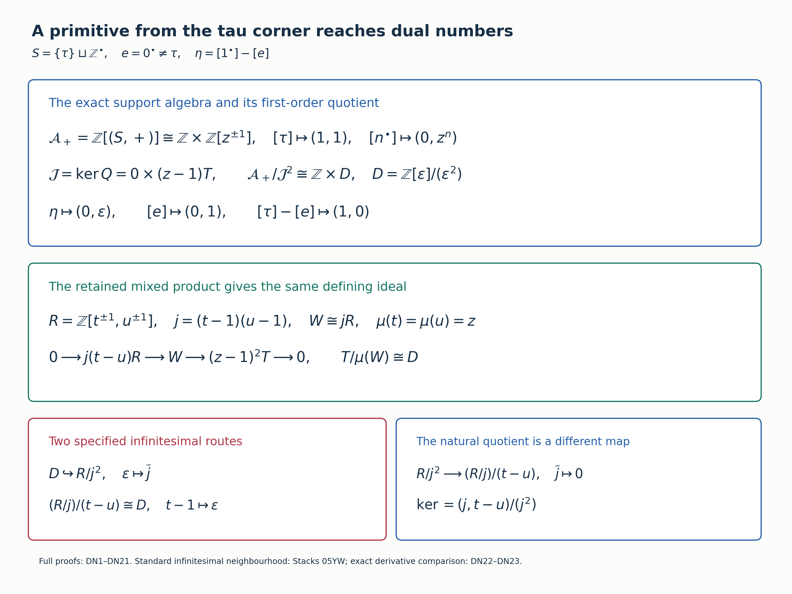

# A primitive for dual-number infinitesimals from the tau corner

The primitive is the formal translation difference between the distinguished integer one and the supported integer zero. Its first-order quotient is determined by the existing support map, and also by the existing mixed-support fold. This paper proves the exact isomorphisms, keeps both support states, and compares the result with the smoothing parameter and with first derivatives in real analysis.

The standard dual-number algebra over a commutative ring \(k\) is \(D_k=k[\varepsilon]/(\varepsilon^2)\), with free \(k\)-basis \(1,\varepsilon\). Multiplication is
\((a+b\varepsilon)(c+d\varepsilon)=ac+(ad+bc)\varepsilon\).
This standard definition is [Stacks, Tag 0B29](https://stacks.math.columbia.edu/tag/0B29); its tangent-space use is [Tag 0B28](https://stacks.math.columbia.edu/tag/0B28). The maps connecting it to the programme objects are proved below.

## 1. The primitive and the support map

Keep the exact tau corner
\[
S=\{\tau\}\sqcup\{n^\bullet:n\in\mathbb Z\},\quad
e=0^\bullet,\quad \mathbf1=1^\bullet,
\quad n^\bullet+m^\bullet=(n+m)^\bullet,
\quad\tau+s=s.
\tag{DN1}
\]
Its original multiplication distinguishes \(\mathbf1\), and satisfies \(\tau s=\tau\) and \(n^\bullet m^\bullet=(nm)^\bullet\). In particular \(e\ne\tau\).

Form the **additive monoid algebra**
\[
\mathcal A_+=\mathbb Z[(S,+)],\qquad
[s][s']=[s+s'],\qquad 1_{\mathcal A_+}=[\tau].
\tag{DN2}
\]
It is free as an abelian group on the displayed elements of \(S\). This construction uses addition as the monoid product. The multiplicative monoid-ring coefficient functor \(\Gamma(S)\) used in the earlier papers is a different explicitly typed construction. Define
\[
E=[e],\quad E^2=E,\quad E[n^\bullet]=[n^\bullet],
\quad\eta=[\mathbf1]-[e].
\tag{DN3}
\]
The element \(\eta\) is a difference of formal basis vectors. It is not the subtraction of two elements performed in the original semiring.

**Theorem DN1.** With \(T=\mathbb Z[z,z^{-1}]\), there is an isomorphism of unital rings
\[
\Phi:\mathcal A_+\xrightarrow{\sim}\mathbb Z\times T,
\quad[\tau]\mapsto(1,1),\quad[n^\bullet]\mapsto(0,z^n),
\quad E\mapsto(0,1),\quad\eta\mapsto(0,z-1).
\tag{DN4}
\]
The existing support map \(q:S\to P=\{\tau,e\}\), given by \(q(\tau)=\tau\) and \(q(n^\bullet)=e\), induces
\[
Q:\mathcal A_+\longrightarrow\mathbb Z[P]\cong\mathbb Z\times\mathbb Z,
\quad(k,f)\longmapsto(k,f(1)).
\tag{DN5}
\]
Its kernel is the principal ideal
\[
\mathcal J=(\eta)=0\times(z-1)T,
\qquad\mathcal J^r=0\times(z-1)^rT\quad(r\ge1).
\tag{DN6}
\]

**Proof.** Multiplication of two supported basis images gives \((0,z^{n+m})\); multiplication by \((1,1)\) leaves each image fixed. Thus \(\Phi\) preserves multiplication and the identity. Its additive inverse is
\[
(k,\textstyle\sum_n a_nz^n)\longmapsto
k([\tau]-[e])+\sum_n a_n[n^\bullet].
\]
Direct substitution proves both inverse identities; the sums are finite. The map \(q\) preserves addition: a sum with a supported summand is supported, and a sum of two external elements is external. It also preserves the original multiplication, by the same two support cases. Its monoid-ring extension therefore gives (DN5). A Laurent polynomial vanishes at 1 exactly when it is divisible by \(z-1\), using ordinary polynomial division after multiplying by an invertible power of \(z\). This proves its kernel and generator. Multiplying that principal ideal repeatedly gives the displayed powers. \(\square\)

Thus the primitive \(\eta\) is specified by \(\mathbf1,e\), and the ideal in which it lives is specified by the support map. No freely selected tangent direction was added to define it.

## 2. The exact first-order algebra

**Theorem DN2.** There is an isomorphism
\[
\mathcal A_+/\mathcal J^2\xrightarrow{\sim}\mathbb Z\times D_{\mathbb Z},
\quad[\tau]\mapsto(1,1),\quad
[n^\bullet]\mapsto(0,1+n\varepsilon),\quad
\eta\mapsto(0,\varepsilon).
\tag{DN7}
\]
It preserves the two distinct elements \([\tau]\) and \([e]\). The corner with identity \(E\) is exactly \(D_{\mathbb Z}\). The full quotient has the exact sequence
\[
0\longrightarrow\mathcal J^2\longrightarrow\mathcal A_+
\longrightarrow\mathbb Z\times D_{\mathbb Z}\longrightarrow0.
\tag{DN8}
\]

**Proof.** The homomorphism \(T\to D_{\mathbb Z}\), \(z\mapsto1+\varepsilon\), is well-defined because \((1+\varepsilon)^{-1}=1-\varepsilon\). For every integer \(n\), including negative integers, \((1+\varepsilon)^n=1+n\varepsilon\), by multiplication and the inverse formula. Every Laurent polynomial has a unique expression modulo \((z-1)^2\) of the form \(a+b(z-1)\): write \(f=f(1)+(z-1)g\), and then \(g=g(1)+(z-1)h\). Evaluation under \(z\mapsto1+\varepsilon\) gives \(a+b\varepsilon\), whose two coefficients vanish only when \(a=b=0\). Consequently its kernel is exactly \((z-1)^2T\), and the inverse is \(a+b\varepsilon\mapsto a+b(z-1)\). Apply (DN4) and (DN6). In the resulting product, \([\tau]=(1,1)\), \([e]=(0,1)\), and their difference is the nonzero idempotent \((1,0)\). Multiplication by \(E=(0,1)\) picks the second factor with its own identity. \(\square\)

This quotient has an exact universal property. Consider a commutative ring \(B\), a map \(B\to\mathbb Z[P]\) with square-zero kernel, and a map \(f:\mathcal A_+\to B\) over \(\mathbb Z[P]\). Then \(f(\mathcal J)\) lies in that kernel, so \(f(\mathcal J^2)=0\). There is a unique factorization through (DN7), since the quotient is surjective. This proves the universal first-order support thickening, with its map from the original algebra included in the data.

Equivalently, unital ring maps \(\mathbb Z\times D_{\mathbb Z}\to B\) correspond exactly to pairs \(c,v\in B\) satisfying
\[
c^2=c,\qquad cv=v,\qquad v^2=0.
\tag{DN9}
\]
The map sends \((0,1)\) to \(c\), \((0,\varepsilon)\) to \(v\), and is explicitly
\[
(k,a+b\varepsilon)\longmapsto k(1-c)+ac+bv.
\tag{DN10}
\]
Expansion using (DN9) proves multiplicativity; conversely the images of the two generators of the product satisfy those relations. The generator formula proves uniqueness. This describes which square-zero elements can receive the primitive while retaining its support idempotent.

## 3. Every scalar, including tau, still has its own map

Multiplication by a supported integer \(n\) in \(S\) is an endomorphism of its additive monoid. Its extension to \(\mathcal A_+\) is \((k,f(z))\mapsto(k,f(z^n))\), including \(n=0\). It preserves \(\mathcal J^2\) by (DN6). Thus its action on the first-order quotient is
\[
\lambda_n(k,a+b\varepsilon)=(k,a+nb\varepsilon).
\tag{DN11}
\]
Multiplication by \(\tau\) sends every element of \(S\) to \(\tau\). Under (DN4), its monoid-ring extension sends \((k,f)\) to \((f(1),f(1))\): the inverse formula of DN1 has total coefficient sum \(f(1)\). It therefore induces
\[
\lambda_\tau(k,a+b\varepsilon)=(a,a).
\tag{DN12}
\]
Both \(\lambda_0\) and \(\lambda_\tau\) kill \((0,\varepsilon)\). Their values on \(E\) differ:
\(\lambda_0(E)=E\), whereas \(\lambda_\tau(E)=1\).
The action of the two zero-like elements is therefore still distinguished by an explicit coordinate. Composition of the scalar maps follows from their original multiplication and can also be checked in (DN11)–(DN12).

Forgetting external support is the additive monoid map \(S\to\mathbb Z\) that sends \(\tau\) and \(e\) to 0 and \(n^\bullet\) to \(n\). It induces the exact projection \(\mathbb Z\times T\to T\); on (DN7) this becomes \(\mathbb Z\times D\to D\), with kernel \(\mathbb Z\times0\). Thus ordinary supported integer addition already supplies the dual-number factor; the full construction additionally retains the external-support factor. The source dependence of both statements is proved by these maps.

## 4. The mixed-support fold derives the same quotient

Take two copies of the supported integer group and put
\[
R=\mathbb Z[t^{\pm1},u^{\pm1}],\quad
I_t=(t-1)\mathbb Z[t^{\pm1}],\quad I_u=(u-1)\mathbb Z[u^{\pm1}],
\quad j=(t-1)(u-1),\quad W=I_t\otimes I_u=jR.
\tag{DN13}
\]
The identification sends \(r_a\otimes r_b\) to \((t^a-1)(u^b-1)\). Its complete derivation as the retained cross-effect and its exact programme support maps are in [Cross-effects](https://github.com/KokunoYumeto/zeta-function-research-reader/blob/6af54ea3c8ef99127af327f3103e086c68d482c2/workbenches/splitzero-tandem/branches/identity-absorber-square/CROSS_EFFECTS.md), (X1)–(X13), and [Mixed support](https://github.com/KokunoYumeto/zeta-function-research-reader/blob/6af54ea3c8ef99127af327f3103e086c68d482c2/workbenches/splitzero-tandem/branches/identity-absorber-square/MIXED_SUPPORT.md), (MS22)–(MS33). Its distinguished element \(w_{1,1}\) maps to \(j\): it is the mixed product of the two copies of the primitive in (DN3).

The original integer addition \((a,b)\mapsto a+b\) induces the fold
\[
\mu:R\longrightarrow T,\quad t\mapsto z,\ u\mapsto z.
\tag{DN14}
\]
Its kernel is \((t-u)R\), since identifying the two invertible generators gives \(T\), with inverse \(z\mapsto\overline t\). Restricting to the mixed ideal gives the exact sequence
\[
0\longrightarrow j(t-u)R\longrightarrow W=jR
\xrightarrow{\mu}(z-1)^2T\longrightarrow0.
\tag{DN15}
\]
Indeed \(\mu(jf)=(z-1)^2\mu(f)\), the fold is onto, and multiplication by \((z-1)^2\) is injective in \(T\). This proves both image and kernel without deleting any mixed class from the source.

Consequently the exact receiver of the folded mixed product is
\[
T/\mu(W)=T/(z-1)^2T\xrightarrow{\sim}D_{\mathbb Z},
\qquad z-1\longmapsto\varepsilon.
\tag{DN16}
\]
This is the same quotient as DN2, obtained from the already defined mixed-support map. Equivalently, the quotient ring \(A=R/jR\) constructed in *Node cotangent* has the diagonal quotient
\[
A/(t-u)A\xrightarrow{\sim}D_{\mathbb Z},
\qquad t,u\longmapsto1+\varepsilon.
\tag{DN17}
\]
Its inverse sends \(\varepsilon\) to \(\overline{t-1}=\overline{u-1}\); the original relation \((t-1)(u-1)=0\) then proves its square is zero. Both inverse identities hold on the ring generators. The kernel of \(A\to D\) is exactly \((t-u)A\). Multiplication by \(t-u\) in \(A\) is injective: under \(A\cong\mathbb Z[t^{\pm1}]\times_{\mathbb Z}\mathbb Z[u^{\pm1}]\), its two components are \(t-1\) and \(-(u-1)\), each a nonzero element of a domain. This proves the additional exact sequence \(0\to A\xrightarrow{t-u}A\to D\to0\).

The construction before any quotient has no nonzero nilpotent: both factors of \(\mathbb Z\times T\) are reduced. DN7 and DN16 specify the operation that produces the infinitesimal and its full kernel. They are a derivation from the support map and mixed fold, not an identification of an original role element with \(\varepsilon\).

## 5. The smoothing infinitesimal and the diagonal infinitesimal

Let \(\widetilde A=R/j^2R\), and let \(\overline j\) denote the class of \(j\). The smoothing-parameter map is
\[
\iota_j:D_{\mathbb Z}\longrightarrow\widetilde A,
\qquad a+b\varepsilon\longmapsto a+b\overline j.
\tag{DN18}
\]
It is injective. If \(a+bj\in j^2R\), evaluation at \(t=u=1\) gives \(a=0\). Cancelling \(j\) in \(R\) then gives \(b\in jR\), whose evaluation implies \(b=0\). Its image is precisely the subalgebra \(\mathbb Z\oplus\mathbb Z\overline j\), so (DN18) is an isomorphism onto that subalgebra. It is not surjective onto \(\widetilde A\): modulo \(j\), its image consists only of constants in the nonconstant ring \(A\).

In fact the nilradical of \(\widetilde A\) is exactly \(jR/j^2R\), and every member of that ideal is square-zero. The quotient by this ideal is the reduced ring \(A\), a subring of the product of the two Laurent domains. Thus every nilpotent must lie in it, and the product of any two of its elements is zero. Multiplication by \(j\) identifies it with the \(A\)-module \(A\), as proved in (N6). The line generated by \(\overline j\) is the distinguished constant submodule of this larger ideal.

Every mixed generator has an explicit image, including negative indices. Define
\[
S_a(t)=\begin{cases}\sum_{r=0}^{a-1}t^r,&a>0,\\
0,&a=0,\\-\sum_{r=a}^{-1}t^r,&a<0.\end{cases}
\]
Then \(t^a-1=(t-1)S_a(t)\), and
\[
w_{a,b}\longmapsto\overline jS_a(t)S_b(u)\in jR/j^2R.
\tag{DN18a}
\]
Under \(jR/j^2R\cong A\), its two branch values are
\(\bigl(bS_a(t),aS_b(u)\bigr)\), with common evaluation \(ab\). The kernel of \(W\to jR/j^2R\) is exactly \(j^2R\) under \(W\cong jR\). Thus the distinguished dual-number line sits in a fully specified mixed module.

The isomorphism between the smoothing dual-number subalgebra and the diagonal dual-number quotient is
\[
\mathbb Z\oplus\mathbb Z\overline j\xrightarrow{\sim}A/(t-u)A,
\qquad a+b\overline j\longmapsto a+b\overline{t-1}.
\tag{DN19}
\]
Its inverse is given by the two coefficient coordinates of DN2. The natural ambient quotient
\[
\widetilde A\longrightarrow A\longrightarrow A/(t-u)A
\tag{DN20}
\]
instead sends \(\overline j\) to zero. On the subalgebra in DN19 its kernel is \(\mathbb Z\overline j\), and its image is \(\mathbb Z\). On all of \(\widetilde A\), the kernel is \((j,t-u)R/j^2R\). These are distinct maps with fully specified relationships; their abstract dual-number isomorphism does not change the natural quotient.

There is also a direct compatible extension through a cubic nilpotent algebra. Define
\[
\theta:\widetilde A\longrightarrow\mathbb Z[v]/(v^3),
\quad t,u\longmapsto1+v,
\qquad\theta(\overline j)=v^2.
\tag{DN21}
\]
The elements \(1+v\) are invertible with inverse \(1-v+v^2\), and \(j^2\) maps to \(v^4=0\). The map is onto because \(t-1\) maps to \(v\). Its kernel is the ideal generated by \(t-u\) and \((t-1)^3\) in \(\widetilde A\): imposing those relations gives exactly the target, with inverse \(v\mapsto t-1\). Its restriction along (DN18) is the injective map \(a+b\varepsilon\mapsto a+bv^2\). This exact diagram will receive square-zero operators that are squares of specified cubic-nilpotent operators.

## 6. Exact comparison with first derivatives

Scalar extension of (DN16) gives \(D_{\mathbb R}=\mathbb R[\varepsilon]/\varepsilon^2\). Let \(\mathcal G_1\) be the ring of germs of smooth real functions at the real point 1, and \(\mathfrak n=\{f:f(1)=0\}\). Then
\[
J_1:\mathcal G_1\longrightarrow D_{\mathbb R},
\qquad f\longmapsto f(1)+f'(1)\varepsilon
\tag{DN22}
\]
is a surjective ring homomorphism. The product rule proves multiplicativity; affine functions give every pair of coefficients. Its kernel is exactly \(\mathfrak n^2\). One inclusion follows from the product rule. For the other, if \(f(1)=f'(1)=0\), the fundamental theorem of calculus gives
\[
f(s)=(s-1)g(s),\qquad
g(s)=\int_0^1 f'(1+r(s-1))\,dr.
\]
The function \(g\) is smooth and \(g(1)=0\). Applying the same formula to \(g\) gives \(f(s)=(s-1)^2h(s)\) with \(h\) smooth. This lies in \(\mathfrak n^2\), proving the kernel equality and the exact isomorphism
\[
\mathcal G_1/\mathfrak n^2\xrightarrow{\sim}D_{\mathbb R}.
\tag{DN23}
\]
The Laurent polynomial inclusion \(\mathbb R[z^{\pm1}]\to\mathcal G_1\), \(z\mapsto(s\mapsto s)\), is well-defined near 1. Composing it with (DN22) sends \(z-1\) to \(\varepsilon\), exactly as in (DN16), and induces an isomorphism of the corresponding first-order quotients. Thus the primitive has a proved map to ordinary first-derivative data.

A nonzero square-zero infinitesimal is an element of these algebras of first-order data. Every homomorphism from a dual-number algebra to a field sends it to zero: its image has square zero in a field, hence vanishes. The derivative coordinate in (DN22) explains exactly how the algebra retains additional information beyond a real-valued evaluation.

## 7. What is standard and what this calculation supplies

Dual numbers, tangent vectors through dual-number points, and the first-order augmentation quotient are established constructions. The concrete result here identifies the primitive \(\eta\), the support kernel, the retained external-support factor, every integer scalar map, the mixed fold, and both distinct routes from the node. The explicit forgetful projection in Section 3 also proves that the dual-number factor does not require all four corners: the tau corner's supported integer addition supplies it. Historical novelty of these general constructions is not asserted.

The programme's original boundary operator has the faithful representation
\[
D_{\mathbb C}\xrightarrow{\sim}\mathbb C[I,R_N],\qquad
a+b\varepsilon\longmapsto aI+bR_N.
\]
[Native dual-number receiver](https://github.com/KokunoYumeto/zeta-function-research-reader/blob/6af54ea3c8ef99127af327f3103e086c68d482c2/workbenches/splitzero-tandem/branches/identity-absorber-square/NATIVE_DUAL_NUMBER_RECEIVER.md), NI1–NI16, proves this map, its compatible cubic extension of DN21, and the exact module defect
\[
\operatorname{Tor}^{D_{\mathbb C}}_1(\mathbb C,E)
\cong\ker R_N/\operatorname{im}R_N
\cong\ker W_N=\{e_N,f_N\}^{\perp_{G_N}}.
\]
The last space is already the kernel of the full original arithmetic current. This is a concrete programme receiver for the square-derived infinitesimal and for its nonflat directions. It leaves the original operator and metric intact. No sign conclusion for the separately marked terminal class follows from this isomorphism alone.

The source for the standard definition and tangent-space terminology was read in the original Stacks Project `varieties.tex`, pinned at commit `a04446e57ec1fbc252a871afcec7752fb2807b14`, Section `tangent-spaces`, beginning at line 2912. [Pinned original TeX](https://github.com/stacks/stacks-project/blob/a04446e57ec1fbc252a871afcec7752fb2807b14/varieties.tex#L2912). The source's mathematical authorship remains with the Stacks Project. The local programme definitions are the original sources cited in [the source guide](https://github.com/KokunoYumeto/zeta-function-research-reader/blob/6af54ea3c8ef99127af327f3103e086c68d482c2/workbenches/splitzero-tandem/branches/identity-absorber-square/SOURCE_GUIDE.md); the additive algebra and all maps in this paper have complete proofs above.

The diagram records DN3–DN8 and DN13–DN21. Its two different maps involving the smoothing parameter are labeled separately; all kernels remain in the complete proofs.

## Receiver at the observed collision

The original primitive \([1]-[e]\) also has a faithful receiver in the actual observed collision algebra: its dual-number coordinate maps to \(\widetilde R=F_B(-\epsilon r/a)\). Retaining the external factor sends \([\tau]\) to \(I_B\), supported \([e]\) to the range projection \(P\), and \([n]\) to \(P+n\widetilde R\). [Observed support propagation](https://github.com/KokunoYumeto/zeta-function-research-reader/blob/c9df443d9e1df000dfbb083943f97197e746eb08/workbenches/splitzero-tandem/branches/identity-absorber-square/OBSERVED_SUPPORT_PROPAGATION.md) proves the complete representation, its exact support kernel, projective module and cubic mixed factorization. [Observed collision](https://github.com/KokunoYumeto/zeta-function-research-reader/blob/c9df443d9e1df000dfbb083943f97197e746eb08/workbenches/splitzero-tandem/branches/identity-absorber-square/OBSERVED_COLLISION.md), OC9 and OC11, proves the specialization map and signed correction to the original arithmetic parameter zero.
