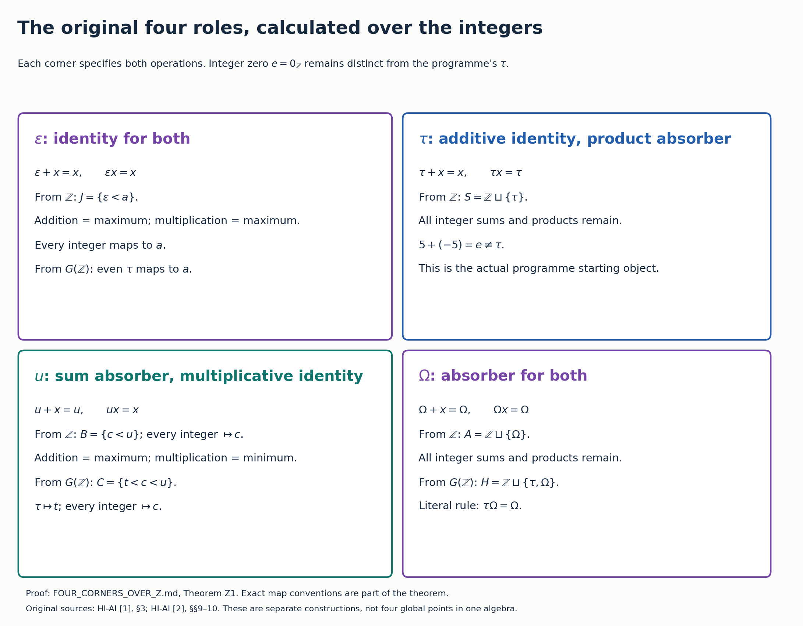

# Identity Absorber Square

The exploratory prismatic cohomology branch of the Split-Zero programme studies identity and absorber adjunctions, their retained integer arithmetic and mixed support, monoid rings, cohomology comparisons and prismatic structures.

Its starting object is the programme's \(G(\mathbb Z)=\mathbb Z\sqcup\{\tau\}\), with supported integer zero \(e\ne\tau\). The four-role square specifies identity or absorber behavior for each operation. The collection computes the receivers, isomorphisms, forced identifications, exact support and arithmetic maps, and the effect of monoidal base extension. Both operations and their local identity domains are retained in the full classifications.

Every corner has a completed coefficient-ring prism construction. The tau corner also gives an explicit chain comparison and nonzero retained cohomology for contractible complexes. These classes are studied as cross-effects: their projectors, scalar actions, mixed-support maps, augmentation filtrations and Frobenius structures are calculated. A quotient of crystalline prisms has the completed retained mixed ideal as its exact kernel. The construction supplies actual site objects and morphisms; an equivalence with absolute prismatic cohomology or an RH theorem is not asserted.

## Read the complete proofs

| Paper | Results and exact scope |
|---|---|
| [Coefficient branch](COEFFICIENT_BRANCH.md) · [TeX](COEFFICIENT_BRANCH.tex) | Role definitions, original programme maps, idempotent decompositions and arithmetic addition. |
| [Four corners over the integers](FOUR_CORNERS_OVER_Z.md) · [TeX](FOUR_CORNERS_OVER_Z.tex) | All four roles; full and one-operation isomorphisms; congruences; exact reconstruction; monoid rings. |
| [Prismatic comparison](PRISMATIC_COMPARISON.md) · [TeX](PRISMATIC_COMPARISON.tex) | Canonical prisms, the addition defect, Witt maps, classified lifts and a simultaneous arithmetic-compatible Frobenius family. |
| [Chain comparison](CHAIN_COMPARISON.md) · [TeX](CHAIN_COMPARISON.tex) | Supported-zero composites, the free complex, exact cohomology sequence, complete basis and actual programme quotient maps. |
| [Retained cross-effects](CROSS_EFFECTS.md) · [TeX](CROSS_EFFECTS.tex) | The cross-effect object, augmentation powers, integer scalar action, exact filtration and the nonseparated torsion example. |
| [Homotopy defect](HOMOTOPY_DEFECT.md) · [TeX](HOMOTOPY_DEFECT.tex) | Explicit contraction projector, zero-differential retained summand, maps, coefficient extensions and completion. |
| [Frobenius on the retained classes](FROBENIUS_CROSS_EFFECT.md) · [TeX](FROBENIUS_CROSS_EFFECT.tex) | Mixed Laurent ideal, exact Frobenius linearization cokernel, delta-stable ideal and quotient of crystalline prisms. |
| [Node cotangent](NODE_COTANGENT.md) · [TeX](NODE_COTANGENT.tex) | Illusie source application: mixed differential, exact de Rham kernel, divided Frobenius, cyclotomic kernel and explicit deformation. |
| [Mixed support](MIXED_SUPPORT.md) · [TeX](MIXED_SUPPORT.tex) | All support fibres including the bottom fibre; label-changing maps; mixed terms; independent and folded integer joins. |
| [Primitive dual numbers](PRIMITIVE_DUAL_NUMBERS.md) · [TeX](PRIMITIVE_DUAL_NUMBERS.tex) | Distinguished translation primitive, exact support quotient, mixed fold, diagonal and smoothing maps, and comparison with first derivatives. |
| [Original arithmetic receiver](NATIVE_DUAL_NUMBER_RECEIVER.md) · [TeX](NATIVE_DUAL_NUMBER_RECEIVER.tex) | Faithful dual-number algebra, cubic roots in the original metric, exact deformation kernel, and nonflat directions equal to the full current kernel. |
| [Idempotent deformation](IDEMPOTENT_DEFORMATION.md) · [TeX](IDEMPOTENT_DEFORMATION.tex) | Flat two-branch family, exact idempotent norms, unchanged current along the real parameter, and spectral/resolvent bounds. |
| [Literature and the GCT question](LITERATURE_AND_GCT_BRIDGE.md) · [TeX](LITERATURE_AND_GCT_BRIDGE.tex) | Exact standard first-neighbourhood comparison, historical source meaning, and the proved scope of the arithmetic bridge. |
| [Receivers and all orders](RECEIVERS.md) · [TeX](RECEIVERS.tex) | Arbitrary-ring common extension, congruences, both identity-role orders and all six orders involving the literal absorber. |
| [Cumulative paper](CUMULATIVE.md) · [TeX](CUMULATIVE.tex) | Every paper above, with all definitions, calculations and proofs. |

The four-role framing, the prismatic research direction, and the instruction to investigate the objects exposed by obstructions came from the programme's creator. [Original sources and precise proof locators](SOURCE_GUIDE.md) distinguish the originating manuscripts, human literature and the present derivations. The sources retain their authorship. The new derivations were developed and checked with Codex; independent computational derivations within this work do not constitute human peer review. Historical novelty is not claimed.

## Reproduce the sources and checks

Run `python build.py` with Python, Matplotlib, SymPy and Pandoc available. The fifteenth figure is supplied as exact SVG source and a rendered PNG. It executes the finite algebra and polynomial checks, regenerates the sixteen Matplotlib figures, and produces the individual and cumulative TeX sources. The full proofs establish the general statements; the finite checks have their recorded sample scope.

This source package contains Markdown and TeX, PNG/SVG figures and their generating scripts, finite checkers with outputs, and the unchanged originating programme TeX files. The human literature is cited through versioned original-source links. The local reading archives and correspondence are kept distinct from the mathematical papers. No Lean verification or PDF edition is claimed.

[Dated results, 21 September](RESULTS_20260921.md) · [Retained objects and mixed support, 22 September](RESULTS_20260922.md) · [Earlier receiver proofs](RESULTS_20260920.md) · [Literature intake](PRISMATIC_LITERATURE_INTAKE.md)

The node calculation applies the user-designated [Illusie edition](https://zenodo.org/records/22884471). Both volumes and their diplomatic/corrected French source treatments are retained. [Node cotangent](NODE_COTANGENT.md) supplies the full specialized proof and exact source-use locators.

The supported additive monoid also supplies a distinguished first-order primitive. Its mixed-product quotient is the standard dual-number algebra, with external support retained in a second factor. An exact receiver in the original arithmetic programme identifies the nilpotent with its boundary operator; the full module defect is its full current kernel. These concrete maps are proved in the primitive, receiver and deformation papers and do not claim historical novelty for dual numbers.

[Parent Split-Zero workbench](https://github.com/KokunoYumeto/zeta-function-research-reader/blob/main/workbenches/splitzero-tandem/README.md) · [Branch research state](BRANCH_RESEARCH_STATE.md)
