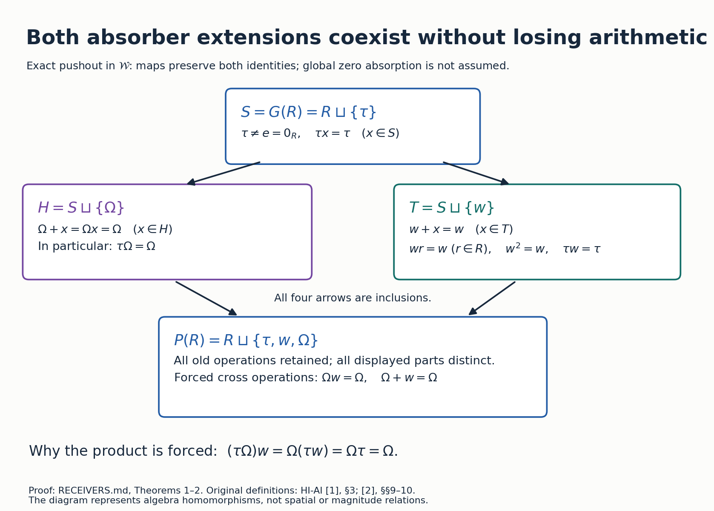
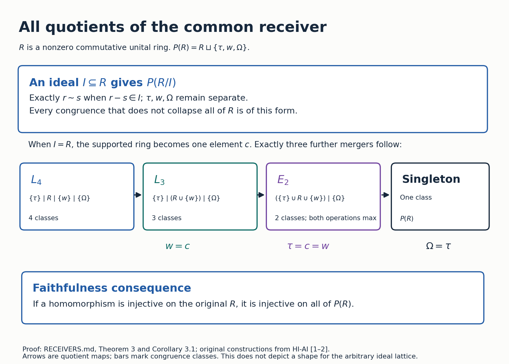
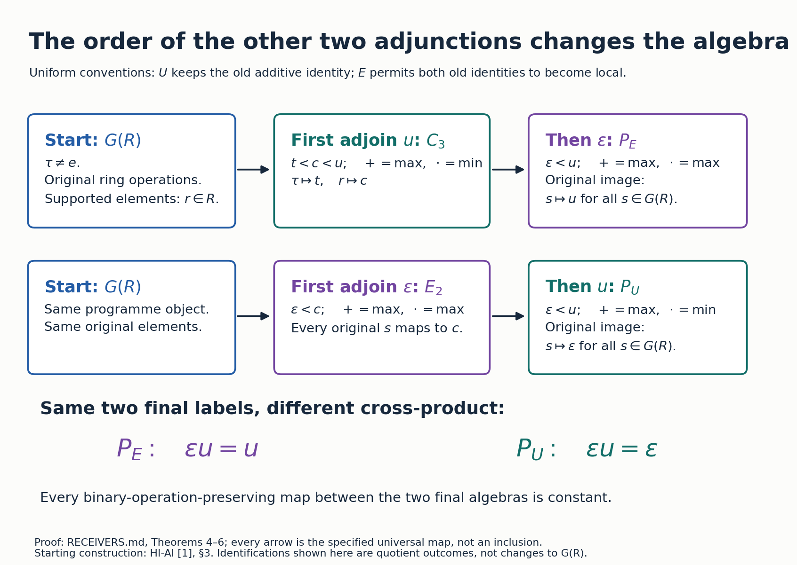
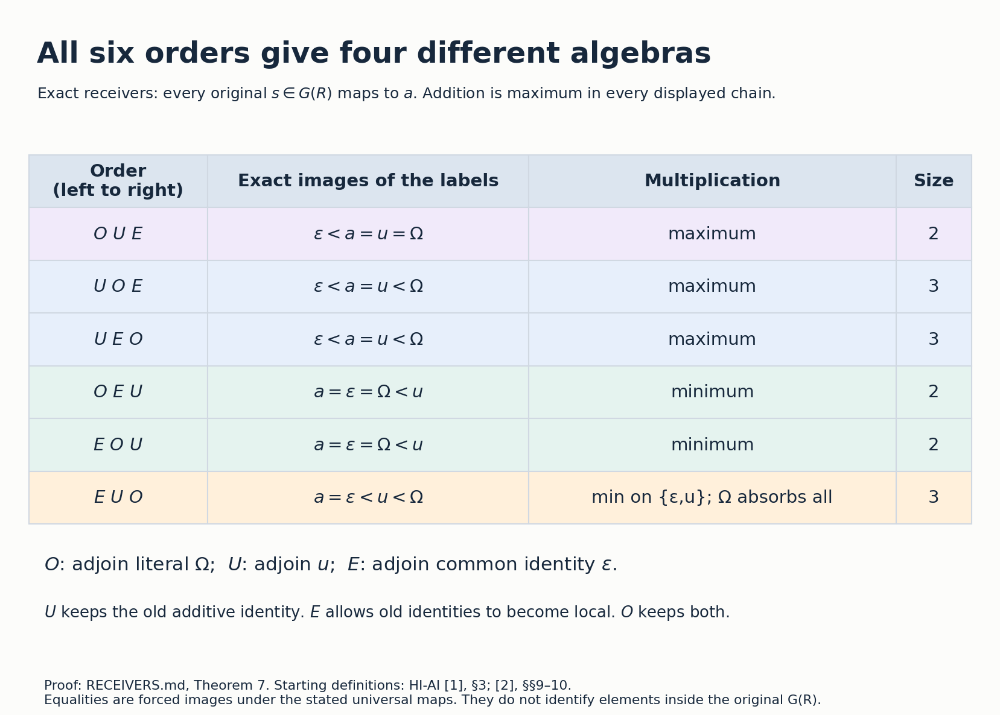

The starting element is the programme's own \(\tau\). This paper computes two further constructions from that object. The two admissible additive-absorber extensions have an injective common receiver, whose full congruence lattice is calculated below. Adjoining the other two roles in opposite orders gives different two-element receivers. These are proved local results, without a claim of novelty in the wider literature or an established application to the current analytic programme.

# 1. Objects, maps, and the original tau

Fix a nonzero commutative unital ring \(R\). Write \(e=0_R\) and \(1_R\) for its distinct ring identities. Ring elements, their addition, and their multiplication are retained throughout every injective construction.

The category \(\mathcal W\) consists of sets with a commutative additive monoid \((D,+,0_D)\), a commutative multiplicative monoid \((D,\cdot,1_D)\), and multiplication distributing over addition. A morphism in \(\mathcal W\) preserves both operations and both identities. The equation \(0_Dd=0_D\) is **not** an axiom of \(\mathcal W\). A standard semiring here is an object also satisfying that equation. Whenever a map is allowed to preserve fewer identities, this is stated explicitly.

The programme semiring is
\[
S=G(R)=R\sqcup\{\tau\},\qquad
\tau+x=x+\tau=x,\qquad \tau x=x\tau=\tau.
\tag{1}
\]
The operations on two ring elements are the original ones. In particular \(1_R+(-1_R)=e\ne\tau\). Its additive identity is \(\tau\), and its multiplicative identity is \(1_R\).

For completeness, the operations in (1) are associative and commutative. For addition, deleting occurrences of \(\tau\) leaves the original ring sum, or \(\tau\) when no ring argument remains. For multiplication, any occurrence of \(\tau\) makes every parenthesization equal \(\tau\); otherwise use the ring law. For distributivity, a multiplier \(\tau\) gives \(\tau=\tau+\tau\). A ring multiplier distributes over two ring summands by the ring law; if a summand is \(\tau\), its product is \(\tau\), the additive identity, so the other product is unchanged. These cases also cover two \(\tau\) summands. Thus \(S\) is a standard semiring.

The original manuscript writes \(\mathcal T_R\) for the adjoined element. The bijection fixing \(R\) and sending \(\mathcal T_R\) to \(\tau\) preserves all pairs in (1), the ring pairs, and the identities. It is a unital semiring isomorphism. This is the same starting construction, not an identification of \(\tau\) with \(e\). The original definitions are in source [1], Section 3 and its arbitrary-ring generalization.

# 2. The two extensions and their joint receiver

Introduce distinct new elements \(w,\Omega\), neither in \(S\). The first extension is
\[
T=S\sqcup\{w\},\qquad
w+x=w\ (x\in T),\quad wr=w\ (r\in R),\quad
w^2=w,\quad w\tau=\tau.
\tag{2}
\]
The second is the original literal extension
\[
H=S\sqcup\{\Omega\},\qquad
\Omega+x=\Omega,\quad \Omega x=\Omega\quad(x\in H).
\tag{3}
\]
In particular \(\tau\Omega=\Omega\); this is the original rule in source [2], Sections 9–10.

**Theorem 1 (complete one-point classification).** Equations (2) and (3) are the only associative, commutative, distributive extensions on \(S\sqcup\{v\}\) that preserve \(S\) and make \(v\) an additive absorber. Both preserve the identities \(\tau,1_R\). The extension (2) is standard; (3) belongs to \(\mathcal W\) and is not standard.

**Proof.** For nonzero \(r\in R\), distributivity gives \(rv=rv+r\). If \(rv\in R\), ring cancellation gives \(r=e\), a contradiction. If \(rv=\tau\), the equation becomes \(\tau=r\), also impossible. Hence \(rv=v\). Applying this to \(1_R,-1_R\), which are both nonzero even in characteristic two, gives
\[
ev=(1_R+(-1_R))v=v+v=v.
\]
Also \(v^2=v(v+1_R)=v^2+v=v\). Put \(a=\tau v\). Associativity yields \(ea=e(\tau v)=(e\tau)v=a\). If \(a\in R\), then \(a=e\). But then associativity gives \(av=(\tau v)v=\tau v^2=a=e\), whereas \(ev=v\ne e\). Thus \(a\) is either \(\tau\) or \(v\).

It remains to verify both tables. Addition in either extension is the old addition with a new absorber, so is associative and commutative. For (2), a multiplicative triple containing \(\tau\) gives \(\tau\); one without \(\tau\) but containing \(w\) gives \(w\); the remaining triples are ring triples. These observations prove associativity, and commutativity is in the table. The old \(1_R\) is a unit, including at \(w\). A multiplier \(\tau\) distributes because every term is \(\tau\). A multiplier \(w\) gives \(\tau\) exactly when both summands are \(\tau\), and gives \(w\) otherwise on both sides. A ring multiplier uses the old distributivity if both summands are in \(S\); if a summand is \(w\), both sides are \(w\). Thus (2) is standard.

For (3), an occurrence of \(\Omega\) in any associative or distributive expression makes both sides \(\Omega\); otherwise use \(S\). The old identities remain identities at \(\Omega\). The equation \(\tau\Omega=\Omega\ne\tau\) proves that (3) is not standard. All forced cases have now been realized. \(\square\)

**Theorem 2 (injective pushout).** The pushout \(H\amalg_S T\) in \(\mathcal W\) is
\[
P(R)=R\sqcup\{\tau,w,\Omega\}.
\tag{4}
\]
It contains the exact tables (2) and (3), and its two remaining cross operations are
\[
\boxed{\Omega+w=\Omega,\qquad \Omega w=\Omega.}
\tag{5}
\]
Both canonical maps \(H\to P(R)\), \(T\to P(R)\) are injective, and their images intersect exactly in \(S\).

**Proof.** Construct (4) by adjoining a literal absorber \(\Omega\) to the standard semiring \(T\). Commutativity is immediate. Any associative expression containing \(\Omega\) evaluates to \(\Omega\); otherwise associativity is that of \(T\). In \(x(y+z)=xy+xz\), an occurrence of \(\Omega\) in any of \(x,y,z\) makes both sides \(\Omega\); without it use \(T\). The identities remain \(\tau,1_R\), since \(\tau+\Omega=\Omega\) and \(1_R\Omega=\Omega\). Hence this is an object of \(\mathcal W\), and the stated inclusions are injective morphisms.

To prove universality, let \(f:H\to D\), \(g:T\to D\) be morphisms in \(\mathcal W\) agreeing on \(S\). Put \(z=0_D\), \(a=f(\Omega)\), \(b=g(w)\). The preserved source equations give \(za=a\), \(zb=z\), and \(a+1_D=a\). Therefore
\[
ab=(za)b=a(zb)=az=a.
\tag{6}
\]
Multiplying \(a+1_D=a\) by \(b\) gives \(ab+b=ab\), hence \(a+b=a\). Thus every such pair of maps already satisfies (5). Define \(h:P(R)\to D\) to equal the common map on \(S\), to send \(\Omega\) to \(a\), and \(w\) to \(b\). Pairs lying in \(H\) or \(T\) are preserved by the given maps; the only remaining pairs are \((w,\Omega)\) and its reverse, handled by (6) and \(a+b=a\). The identities lie in \(S\). Hence \(h\) is a morphism, and every value was forced. This proves the universal property. \(\square\)

There is no identity-preserving morphism \(H\to T\) or \(T\to H\), despite their injective common receiver. Indeed, for \(f:H\to T\), standard zero absorption gives \(f(\Omega)=f(\tau\Omega)=\tau f(\Omega)=\tau\). Applying \(f\) to \(\Omega+1_R=\Omega\) gives \(1_R=\tau\), impossible. For \(g:T\to H\), the equation \(\tau g(w)=\tau\) excludes \(g(w)=\Omega\). If \(g(w)=\tau\), then \(g(w)+1_R=g(w)\) contradicts \(1_R\ne\tau\). If \(g(w)\in R\), that same equation contradicts ring cancellation and \(1_R\ne e\). The pushout proves the exact surviving relationship after these particular maps fail.

# 3. Every quotient of the joint receiver

A congruence is an equivalence relation preserved by addition and multiplication. Its quotient has the induced operations and the images of the two identities.

**Theorem 3 (complete congruence lattice).** For every ideal \(I\) of \(R\), define \(\theta_I\) by
\[
r\mathrel{\theta_I}s\iff r-s\in I\quad(r,s\in R),
\tag{7}
\]
with \(\tau,w,\Omega\) three separate singleton classes. Then
\[
P(R)/\theta_I\cong P(R/I).
\tag{8}
\]
Above the congruence belonging to the greatest ideal \(I=R\), exactly three further congruences occur, in the following chain of partitions:
\[
\begin{split}
&\{\tau\}\mid R\mid\{w\}\mid\{\Omega\},\\
<&\{\tau\}\mid(R\cup\{w\})\mid\{\Omega\},\\
<&(\{\tau\}\cup R\cup\{w\})\mid\{\Omega\},\\
<&P(R).
\end{split}
\tag{9}
\]
Thus the full congruence lattice is the ideal lattice of \(R\) with three additional successive elements above its maximum.

**Proof.** The map fixing the three extra labels and sending \(r\) to its residue class modulo \(I\) preserves each displayed operation, and preserves \(\tau,1_R\). Its fibres are (7). This proves existence and (8), including the zero ring quotient \(R/R\): its supported element remains distinct from the three extra labels.

Conversely let \(\theta\) be any congruence. Put \(I=\{r\in R:r\mathrel\theta e\}\). If \(r,s\in I\), then \(r+s\mathrel\theta e+e=e\). Multiplication by \(-1_R\) gives \(-r\in I\), and multiplication by any \(a\in R\) gives \(ar\in I\). Thus \(I\) is an ideal. Adding \(-s\), and conversely adding \(s\), proves \(r\mathrel\theta s\) exactly when \(r-s\in I\).

Any further identification forces \(I=R\). The exhaustive possibilities are these:

* If \(\tau\mathrel\theta r\in R\), multiplication by \(e\) gives \(\tau\mathrel\theta e\). Multiplication by \(w\) gives \(\tau\mathrel\theta w\). Adding any \(s\in R\) then gives \(s\mathrel\theta w\), so all of \(R\) collapses.
* If \(w\mathrel\theta r\in R\), addition of \(-r\) gives \(w\mathrel\theta e\). Adding \(s\in R\) gives \(w\mathrel\theta s\).
* If \(\Omega\mathrel\theta r\in R\), adding \(-r\) gives \(\Omega\mathrel\theta e\), and multiplying by \(\tau\) gives \(\Omega\mathrel\theta\tau\). Since one is an additive absorber and the other an additive identity, addition of any \(x\) gives \(\Omega\mathrel\theta x\); the congruence is total.
* Identifying \(\tau,w\) collapses \(R\) by their additive rules. Identifying \(\tau,\Omega\) is total by the preceding identity/absorber calculation. Identifying \(w,\Omega\), followed by multiplication by \(\tau\), gives \(\tau\mathrel\theta\Omega\) and is total.

It remains to classify congruences when \(I=R\). The quotient has four elements \(\tau,c,w,\Omega\), with addition the maximum in
\[
\tau<c<w<\Omega
\]
and multiplication
\[
\begin{array}{c|cccc}
\cdot&\tau&c&w&\Omega\\\hline
\tau&\tau&\tau&\tau&\Omega\\
c&\tau&c&w&\Omega\\
w&\tau&w&w&\Omega\\
\Omega&\Omega&\Omega&\Omega&\Omega
\end{array}.
\tag{10}
\]
The unit is \(c\). A congruence for maximum has interval classes: if \(x\le y\le z\) and \(x\sim z\), adding \(y\) gives \(y\sim z\). Identifying \(\tau,c\) forces \(\tau,w\), by multiplying by \(w\). Identifying \(w,\Omega\) forces \(\tau,\Omega\), by multiplying by \(\tau\), so is total. Identifying \(c,\Omega\) has the same consequence. The only remaining adjacent merger is \(c\sim w\), which is compatible with every row of (10) and with maximum. The merger \(\tau\sim c\sim w\) is also compatible: the resulting two-element algebra has both operations maximum. Thus (9) lists exactly all possibilities.

Finally, \(\theta_I\subseteq\theta_J\) exactly when \(I\subseteq J\), by (7). The exhaustive classification and (9) prove the stated lattice description, not merely a count of its elements. \(\square\)

**Corollary 3.1.** The only congruence on \(P(R)\) whose restriction to the nonzero ring \(R\) is equality is the identity congruence. Hence every homomorphism from \(P(R)\) that is injective on \(R\) is injective on all of \(P(R)\).

**Proof.** Equality on \(R\) gives \(I=\{e\}\ne R\), so Theorem 3 leaves exactly \(\theta_{\{e\}}\), the identity. For the second assertion use the congruence of equal images under the homomorphism. \(\square\)

The first new quotient in (9) is the literal absorber adjunction to the Boolean semiring:
\[
L_3=\{0,1,\Omega\},\qquad
\tau\mapsto0,\quad r\mapsto1\ (r\in R),\quad w\mapsto1,\quad\Omega\mapsto\Omega.
\tag{11}
\]
Its addition is maximum; its multiplication is Boolean on \(\{0,1\}\), while \(\Omega\) absorbs all products, including \(0\Omega=\Omega\). These rules are precisely the quotient of (10). On \(S\), (11) is the programme support character: sums of supported elements remain supported even when their ring value is \(e\), and products become unsupported exactly when a factor is \(\tau\). This proves the support comparison on all arguments.

The quotient imposing \(\tau=e\) is the next, two-element quotient in (9):
\[
P(R)/(\tau=e)=\{d,\Omega\},\qquad +=\max,\quad\cdot=\max,\quad d<\Omega.
\tag{12}
\]
Indeed \(\tau=e\) forces \(w=e\) by multiplication by \(w\), and then \(w+r=w\) forces every \(r=e\). Equation (12) is an actual model in which \(\Omega\ne d\), so no further merger is forced. Its additive and multiplicative identities both equal \(d\). In particular \(0=1\) does not by itself make an object of \(\mathcal W\) a singleton.

For comparison, imposing \(\tau=e\) on \(H\) alone gives
\[
A(R)=R\sqcup\{\Omega\},
\]
with unchanged ring operations and \(\Omega\) absorbing both operations; its identities are \(e,1_R\). The map fixes \(R,\Omega\) and sends \(\tau\) to \(e\). Ring pairs are unchanged; a \(\tau,r\) pair maps to \(e+r=r\), respectively \(er=e\); a pair involving \(\Omega\) maps to the corresponding absorber value. It is a surjective morphism with only the class \(\{\tau,e\}\) nonsingleton. Every morphism identifying that pair factors uniquely by assigning these values to the quotient. Consequently
\[
P(R)\amalg_H A(R)\cong\{d,\Omega\}
\tag{13}
\]
in \(\mathcal W\): a morphism from \(P(R)\) factors through this pushout exactly when its restriction to \(H\) identifies \(\tau,e\), and (12) is the universal such quotient. This proves exactly why the same arithmetic identification has a different effect after \(w\) is present.

Finally the universal standard-semiring receiver of \(P(R)\), allowing the singleton standard semiring, is that singleton. For a zero-preserving unital map \(h:P(R)\to D\) with standard target,
\[
h(\Omega)=h(\tau\Omega)=0_Dh(\Omega)=0_D.
\]
The equation \(\Omega+1_R=\Omega\) forces \(1_D=0_D\). The standard absorption law then gives \(x=x1_D=x0_D=0_D\) for every \(x\in D\). Conversely the unique map to the singleton is a morphism. Every allowed map factors uniquely through it. This argument uses the standard target axiom and therefore does not contradict the nontrivial weak quotient (12).

# 4. Specify the adjunction before comparing its order

Here are uniform identity conventions for the two remaining roles.

* A \(U\)-receiver for an object \(A\) is an object \(D\in\mathcal W\) whose global unit \(u_D=1_D\) also satisfies \(u_D+x=u_D\), with a map \(A\to D\) preserving both binary operations and the additive identity. The old multiplicative unit need not remain global. Universal factorizations preserve both global identities and the map from \(A\).
* An \(E\)-receiver for \(A\) is an object \(D\in\mathcal W\) whose additive and multiplicative identities are a common element \(\epsilon_D\), with a binary-operation-preserving map \(A\to D\). Both old identities may become local. Universal factorizations preserve the common global identity and the map from \(A\).

These conventions describe the earlier \(u\)- and \(\epsilon\)-receivers with their actual identity requirements. The order computations below use these same conventions at each occurrence of \(U\) or \(E\).

In every \(U\)-receiver, distributivity forces addition to be idempotent:
\[
x=x(u_D+u_D)=x+x.
\tag{14}
\]
It also forces standard zero absorption, even though this was not an axiom of \(\mathcal W\):
\[
0_D=0_D(u_D+x)=0_D+0_Dx=0_Dx.
\tag{15}
\]

**Theorem 4 (the first receivers).** The universal receivers from \(S=G(R)\) are
\[
U(S)=C_3=\{t<c<u\},\quad +=\max,\quad\cdot=\min,\qquad
\tau\mapsto t,\quad r\mapsto c,
\tag{16}
\]
and
\[
E(S)=E_2=\{\epsilon<c\},\quad +=\max,\quad\cdot=\max,\qquad
s\mapsto c\quad(s\in S).
\tag{17}
\]

**Proof.** For a \(U\)-receiver \(f:S\to D\), equation (14) applied to \(f(1_R)\), followed by addition of \(f(-1_R)\), gives \(f(1_R)=f(e)\). Thus
\[
f(r)=f(r1_R)=f(r)f(1_R)=f(r)f(e)=f(re)=f(e).
\]
Write \(a=f(e)\). It satisfies \(a+a=a\), \(a^2=a\). Since \(f(\tau)=0_D\), the only possible factor in (16) sends \(t\) to \(0_D\), \(c\) to \(a\), and \(u\) to \(u_D\). Identity laws, (15), the two idempotences of \(a\), and the roles of \(u_D\) check every pair of its three-element table. Thus that factor is a morphism.

Maximum and minimum on a chain are associative and commutative. To verify distributivity, order \(y\le z\). Then \(\min(x,\max(y,z))=\min(x,z)=\max(\min(x,y),\min(x,z))\). The least element is additive identity and the greatest is multiplicative identity and additive absorber. These observations verify the object (16) and its old map on every ring/ring, ring/tau and tau/tau pair. They also prove uniqueness of the factor.

For an \(E\)-receiver \(j:S\to D\), put \(a=j(s)\), \(t=j(\tau)\). The source gives \(a+t=a\), \(at=t\). Hence
\[
t=at=a(\epsilon_D+t)=a\epsilon_D+at=a+t=a.
\]
All of \(S\) has one image \(t\), with \(t+t=t\), \(t^2=t\). The unique possible factor from (17) sends \(\epsilon\) to \(\epsilon_D\) and \(c\) to \(t\). The common-identity laws and these idempotences prove preservation of every pair. In (17), both associative operations are maximum, and their distributive identity says that both sides equal the maximum of the three arguments. The constant old map preserves operations. Thus (17) also exists and has the asserted universal property. \(\square\)

# 5. The two orders, their maps, and their exact common quotient

**Theorem 5 (order-dependent receivers).** With the conventions of Section 4,
\[
\begin{array}{c|c|c|c}
\text{order}&\text{carrier}&\text{addition}&\text{multiplication}\\\hline
E(U(S))&\{\epsilon<u\}&\max&\max\\
U(E(S))&\{\epsilon<u\}&\max&\min
\end{array}.
\tag{18}
\]
Call these two objects \(P_E\) and \(P_U\), respectively; neither symbol denotes the four-part object \(P(R)\). The map from every original element of \(S\) is constant \(u\) in \(P_E\), and constant \(\epsilon\) in \(P_U\). The adjoined labels \(\epsilon,u\) remain distinct in each universal receiver.

**Proof.** For an \(E\)-receiver \(f:C_3\to D\), put \(T=f(t)\), \(C=f(c)\), \(U=f(u)\). The old table gives \(UT=T\), \(U+T=U\), \(T+C=C\), \(U+C=U\). The new common identity gives
\[
T=UT=U(\epsilon_D+T)=U\epsilon_D+UT=U+T=U.
\]
It follows that \(C=T+C=U+C=U\). Thus the entire first receiver has one image \(a\), with \(a+a=a^2=a\). Adjoining the new common identity gives exactly the two-element maximum/maximum table. The factor sends \(\epsilon\) to \(\epsilon_D\), \(u\) to \(a\); the identity laws and idempotences prove every pair and uniqueness. The nontrivial two-element table itself is a receiver, proving that its two labels are not forced equal.

For a \(U\)-receiver \(g:E_2\to D\), put \(E=g(\epsilon)\), \(C=g(c)\). The old table gives \(E+C=C\), \(EC=C\). The new role gives \(C+u_D=u_D\), \(Eu_D=E\). Distributivity forces
\[
E=Eu_D=E(C+u_D)=EC+Eu_D=C+E=C.
\tag{19}
\]
Our \(U\)-convention also gives \(E=0_D\), so both old elements map to \(0_D\). Their common class \(\epsilon\), with the new \(u\), has addition maximum and multiplication minimum. The unique factor sends \(\epsilon\) to \(0_D\), \(u\) to \(u_D\); (14), (15) and the identity laws check the full Boolean table. Chain distributivity was proved above. Again the actual nontrivial two-element model prevents a further universal merger. \(\square\)

In \(P_E\), the old \(u\) still acts as multiplicative identity on its old image \(\{u\}\), but \(u\epsilon=u\ne\epsilon\), so it is not the new global multiplicative identity. In \(P_U\), the old \(\epsilon\) is the global additive identity and remains a multiplicative identity on the old image \(\{\epsilon\}\), but \(\epsilon u=\epsilon\ne u\). These assertions follow directly from (18) and state the exact domains of the surviving roles.

If the second \(U\)-step is instead allowed to forget the old additive identity, (19) still forces \(E=C=a\). The same Boolean table gives a factor sending \(\epsilon\) to \(a\), preserving both operations and the new multiplicative unit, but it need not preserve additive zero. For example \(D=C_3\), with both old elements mapped to \(c\), has that factor \(\epsilon\mapsto c,u\mapsto u\). Thus its broader universal property uses maps that need not preserve additive zero. This is a different convention on maps, not a silent change to the theorem.

**Theorem 6 (all comparisons between the two orders).** Every binary-operation-preserving map between \(P_E\) and \(P_U\), in either direction, is constant. Each target element gives exactly one such constant map. Their full identity and original-object behavior is:

| Map | Preserves additive identity | Preserves multiplicative identity | Commutes with the maps from \(S\) |
|---|---|---|---|
| \(P_E\to P_U\), constant \(\epsilon\) | yes | no | yes |
| \(P_E\to P_U\), constant \(u\) | no | yes | no |
| \(P_U\to P_E\), constant \(\epsilon\) | yes | yes | no |
| \(P_U\to P_E\), constant \(u\) | no | no | yes |

**Proof.** For \(f:P_E\to P_U\), put \(a=f(\epsilon)\), \(b=f(u)\). Since both \(\epsilon+u\) and \(\epsilon u\) are \(u\) in the source, preservation says \(a\vee b=b\) and \(a\wedge b=b\). Therefore \(a\le b\) and \(b\le a\), so \(a=b\). For \(g:P_U\to P_E\), write the images as \(a,b\) in the same order. The source sum is \(u\), the source product is \(\epsilon\), and both target operations are join. Thus \(a\vee b=b\) and \(a\vee b=a\), again giving equality. Conversely every target element is idempotent for both operations, so every constant map preserves them.

The additive identities in both objects are \(\epsilon\); their multiplicative identities are \(\epsilon\) in \(P_E\) and \(u\) in \(P_U\). The original maps are constant \(u\) and \(\epsilon\), respectively. Comparing the two possible constant values with these specified elements proves every entry of the table. \(\square\)

There are also exact comparisons to the first receivers. The map \(E_2\to P_E\) sending \(\epsilon\mapsto\epsilon,c\mapsto u\) is an isomorphism of both operations and identities, and commutes with the maps from \(S\). The map \(C_3\to P_U\) sending \(t,c\mapsto\epsilon,u\mapsto u\) preserves maxima and minima: for an ordered pair its smaller and larger images are precisely the images of its smaller and larger elements. It preserves both identities and is onto, with congruence classes \(\{t,c\},\{u\}\). Hence
\[
P_U\cong C_3/(t=c).
\tag{20}
\]

The unique binary-preserving maps under \(S\), as given in the last column of Theorem 6, have composites constant \(u\) on \(P_E\) and constant \(\epsilon\) on \(P_U\). These are the actual idempotent collapse maps; the two orders are not isomorphic even if their distinguished labels are forgotten.

Finally their universal common quotient preserving both added labels is the singleton. To prove this with its precise scope, take binary-preserving maps from \(P_E,P_U\) to an algebra \(D\), agreeing on the images \(\epsilon_D,u_D\) of the two labels. The first source requires \(\epsilon_Du_D=u_D\); the second requires \(\epsilon_Du_D=\epsilon_D\). Thus the two images coincide. Both source images are the same one-element algebra, and the maps factor uniquely through it. Conversely the singleton with its unique operations is such a common quotient. This proves universality for binary-preserving labelled maps. It does not require every unrelated element of \(D\) to collapse. If both specified roles are imposed globally in \(D\) as well, then \(x=\epsilon_D+x=u_D+x=u_D\) for every \(x\), and \(D\) itself is a singleton.

# 6. All six orders of the three remaining roles

Write \(O(A)\) for adjoining a new literal absorber \(\Omega\) to both operations of \(A\in\mathcal W\), keeping its global identities. This construction has the following precise universal property. A morphism \(f:A\to D\) in \(\mathcal W\) extends with \(\Omega\mapsto b\) exactly when
\[
b+b=b,\quad b^2=b,\quad b+f(x)=bf(x)=b\quad(x\in A).
\tag{21}
\]
Necessity follows by applying a morphism to the source equations. Conversely the map defined by those values preserves all old pairs by \(f\), every mixed pair by (21), and the new/new pair by the two idempotences. It preserves identities because they lie in \(A\), and is unique. Existence and the \(\mathcal W\) axioms for \(O(A)\) follow by the same complete absorber case analysis used in Theorem 2. No condition that \(b\) absorb unrelated elements of \(D\) is inserted.

We apply \(O,U,E\) once each to the original \(S\), retaining the \(U,E\) identity conventions of Section 4. Words below give the execution order from left to right. In a row, \(a\) denotes the image of any original \(s\in S\); it need not remain distinct from the added labels.

**Theorem 7 (complete order table).** The six resulting receivers, all their element identifications and their operations are:

| Order | Ordered carrier and label identifications | Addition | Multiplication |
|---|---|---|---|
| \(O\,U\,E\) | \(\epsilon<a=u=\Omega\) | maximum | maximum |
| \(U\,O\,E\) | \(\epsilon<a=u<\Omega\) | maximum | maximum |
| \(U\,E\,O\) | \(\epsilon<a=u<\Omega\) | maximum | maximum |
| \(O\,E\,U\) | \(a=\epsilon=\Omega<u\) | maximum | minimum |
| \(E\,O\,U\) | \(a=\epsilon=\Omega<u\) | maximum | minimum |
| \(E\,U\,O\) | \(a=\epsilon<u<\Omega\) | maximum | minimum on \(\{\epsilon,u\}\); \(\Omega x=\Omega\) for all \(x\) |

Each row specifies its original-object map by \(s\mapsto a\). Each occurrence of an added symbol has the image explicitly shown; distinct positions separated by \(<\) remain distinct in the universal receiver. The order notation concerns the displayed finite addition chains, not any ordering of \(R\).

**Proof.** Four exact elementary receivers suffice to compute every row.

First, if \(A\) is any standard semiring, then \(E(A)\) is the two-element maximum/maximum algebra, with all old elements mapped to its nonidentity element. The proof of Theorem 4 uses only \(x+0_A=x\) and \(x0_A=0_A\), so applies unchanged to every such \(A\). Its factor is forced by the old common image and the newly specified common identity.

Second, for every \(A\in\mathcal W\),
\[
U(O(A))\cong\mathbb B,
\tag{22}
\]
with all old elements, including the old \(\Omega\), mapped to Boolean zero, and the new \(u\) mapped to Boolean one. To prove it, let \(f:O(A)\to D\) be a \(U\)-receiver. Equation (15) makes \(D\) standard, and \(f\) preserves the old additive identity. Therefore
\[
f(\Omega)=f(0_A\Omega)=0_Df(\Omega)=0_D.
\]
For each \(x\in O(A)\), applying \(f\) to \(\Omega+x=\Omega\) yields \(0_D+f(x)=0_D\), hence \(f(x)=0_D\). The new unit \(u_D\) need not be zero: the input map is not required to preserve the old unit. The unique factor from \(\mathbb B\) sends \(0\) to \(0_D\), \(1\) to \(u_D\); identity laws, (14), (15) prove that it preserves both operations and identities. The constant old map to Boolean zero is admissible, and \(\mathbb B\) is nontrivial. This proves (22) without an unwarranted singleton conclusion.

Third, if \(A\) has a common additive and multiplicative identity, then \(U(A)\cong\mathbb B\), again with all old elements mapped to zero. Indeed, the input preserves \(0_A\), and the source identity \(0_Ax=x\) gives
\[
f(x)=f(0_Ax)=0_Df(x)=0_D
\]
by (15). The same Boolean factor and nontrivial model prove universality.

Fourth, for a standard semiring \(A\),
\[
E(O(A))\cong\{\epsilon<c<\Omega\},
\qquad +=\max,\quad\cdot=\max,
\tag{23}
\]
with all of \(A\) mapped to \(c\). For an \(E\)-receiver of \(O(A)\), the first calculation collapses \(A\) to a common idempotent \(c_D\). Write \(b_D\) for the image of its original \(\Omega\). Its source equations give
\[
c_D+c_D=c_D^2=c_D,\quad
b_D+b_D=b_D^2=b_D,\quad c_D+b_D=c_Db_D=b_D.
\]
The new \(\epsilon_D\) is the identity for both operations. These relations check every pair in the three-element maximum/maximum table and force a unique factor preserving the new identities. That table itself is an admissible receiver with three distinct elements, proving (23).

Now follow the six words. For \(OUE\), (22) first gives Boolean \(\{0,u\}\), with the original \(S,\Omega\) at zero. The first calculation then collapses both Boolean elements to \(a=u=\Omega\) and adjoins \(\epsilon\), giving the first row. For \(UOE\), Theorem 4 first gives standard \(C_3\); (23) then sends its three elements, including the old \(u\), to \(a\) and retains \(\epsilon,\Omega\) as the other two elements. For \(UEO\), Theorem 5 gives the two-element maximum/maximum algebra \(\{\epsilon<a=u\}\); adjoining a literal absorber gives the same three-element table with all labels as in the preceding row.

For \(OEU\), (23) first gives a three-element algebra with a common identity \(\epsilon\). The third calculation sends all its elements to Boolean zero and adjoins the new \(u\), giving \(a=\epsilon=\Omega<u\). For \(EOU\), \(E(S)\) first has a common identity and its literal absorber adjunction still has that same common identity: both operations are maximum on the resulting three-element chain. The third calculation therefore gives the identical labelled Boolean receiver. Finally, \(EUO\) starts from the Boolean receiver of Theorem 5 and literally adjoins \(\Omega\). It has the last row's exact table by the definition of \(O\). Every intermediate universal factor has been proved in the required category, so these computations prove the sequential universal claims. \(\square\)

The paired equalities \(UOE\cong UEO\) and \(OEU\cong EOU\) preserve every original element's image and all three added labels: the maps fixing the displayed chain elements are bijections and preserve each table entry. There are exactly four algebra-isomorphism classes among the six rows. Two versus three elements distinguishes classes of different sizes. Among the two-element algebras, minimum differs from maximum on the pair of distinct elements; any additive isomorphism must preserve their chain order. Among the three-element algebras, the maximum/maximum table gives \(\epsilon u=u\), whereas the last row gives \(\epsilon u=\epsilon\); again any additive isomorphism preserves the unique chain order. Thus the remaining equally sized candidates are not isomorphic.

The universal common quotient of all six rows that preserves the three added labels is a singleton. In the first row \(u=\Omega\), and in the fourth \(\epsilon=\Omega\); agreement on these labelled images therefore forces \(\epsilon=u=\Omega\). Every original image equals one of these labels in every row, so all six maps have the same single-element image and factor uniquely through the singleton. This is the universal quotient of the labelled generated images; it does not assert collapse of unrelated elements in an arbitrary larger target.

# 7. What the calculation establishes

Theorem 2 replaces the earlier unfinished claim of a singleton common receiver: the exact common receiver is injective and retains \(R,\tau,w,\Omega\) as separate parts. Theorem 3 computes all its quotients and proves that preserving the original ring faithfully preserves the entire joint object faithfully. Equations (11)–(13) give its exact support and arithmetic comparisons.

Theorems 5–6 resolve the two orders of the other identity roles, and Theorem 7 includes the literal absorber in all six orders. Their tables, forced original images, comparisons, and labelled common quotients are explicit. These results do not establish that an additional corner contributes a new invariant to the present analytic programme. The starting tau remains the actual programme object throughout.

# Sources and proof provenance

1. HI-AI, *An Algebraic Structure Incorporating a Z/1Z-Symmetric Element Adjoined to the Integers: Construction, Analysis, and Generalizations*, Zenodo record 17555345, original source 11.tex. Section 3 defines the original \(\mathcal T\) and proves its semiring structure; the arbitrary-ring section gives \(S_R\). The exact source is included as sources/17555345_11.tex. The operative definitions are reproduced and proved here, rather than imported from the record's title.
2. HI-AI, *An Examination of Semiring Structures Derived from the Integers by Sequential Adjunction of Identity and Absorbing Elements*, Zenodo record 17547186, original source 5.tex, Sections 9–10. The literal rule is \(\mathcal T\Omega=\Omega\), with global multiplicative zero absorption explicitly weakened. The exact source is included as sources/17547186_5.tex.

Theorem 1 and the first receivers in Theorem 4 were already present in the preserved private working draft and are fully reproved here. Theorems 2–3 repair and complete its unfinished common-receiver calculation. Theorems 5–7 complete the two-role calculation and all six orders including the literal absorber. These results were independently derived from the stated tables. Finite checks supplied alongside this paper supplement the proofs and do not replace their arbitrary-ring arguments. Historical private conversations and publication instructions are not part of this mathematical repository.
