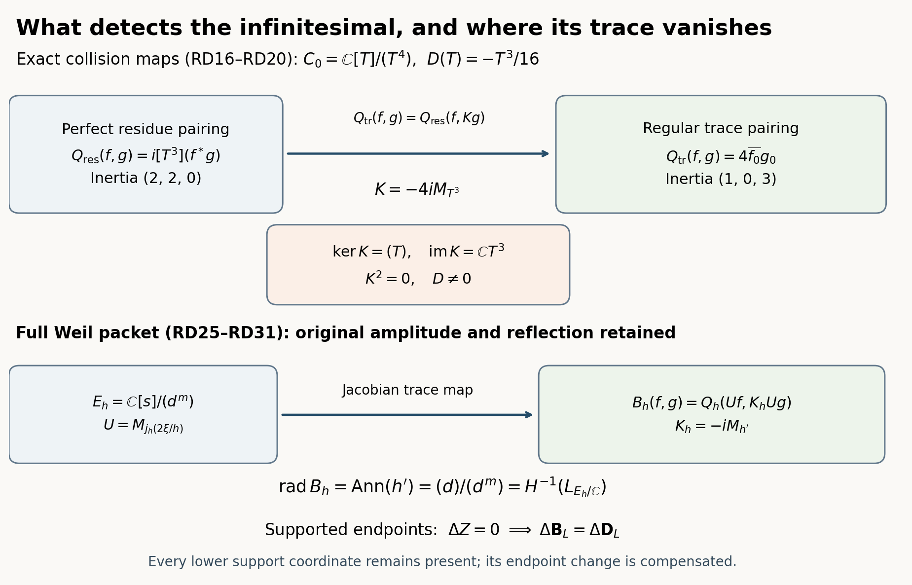

# Residue duality, the collision Jacobian, and the supported Weil trace

23 September 2026.

This calculation gives the exact map from a perfect pairing that detects the collision infinitesimal to the regular trace pairing that annihilates it. It then proves the corresponding identity for the programme's full Weil packets, including their original amplitude multiplier and involution. The trace radical is identified with a specified cotangent cohomology group. No off-critical zeta zero is constructed, and no positivity of the full arithmetic form is asserted.

The incoming collision and meridian are [EHM43–EHM46](https://github.com/KokunoYumeto/zeta-function-research-reader/blob/4a4238afc992e77aee83b97d38a1a63d283f540c/workbenches/splitzero-tandem/branches/tau-zero-prime-positivity/EIGHT_STATE_HOLONOMY_DERIVATION.md). The incoming Weil multiplier and analytic identity are [WP13–WP46b](https://github.com/KokunoYumeto/zeta-function-research-reader/blob/4a4238afc992e77aee83b97d38a1a63d283f540c/workbenches/splitzero-tandem/branches/tau-zero-prime-positivity/WEIL_PACKET_DERIVATION.md) and [WA24–WA30](https://github.com/KokunoYumeto/zeta-function-research-reader/blob/4a4238afc992e77aee83b97d38a1a63d283f540c/workbenches/splitzero-tandem/branches/tau-zero-prime-positivity/WEIL_PACKET_ANALYTIC_DERIVATION.md). The supported-zero identity used here is [SZW33–SZW35](https://github.com/KokunoYumeto/zeta-function-research-reader/blob/4a4238afc992e77aee83b97d38a1a63d283f540c/workbenches/splitzero-tandem/branches/tau-zero-prime-positivity/SUPPORTED_ZERO_PRIME_WEIL_DERIVATION.md). All additional finite algebra identities are proved below.

## 1. The integral algebras and their complete duality maps

Over the integers put
\[
B=\mathbb Z[x,T]/(x^2(x+3),\,T^2-3x(x+2)),\qquad
C=\mathbb Z[\epsilon,T]/(\epsilon^2,\,T^2-6\epsilon).
\tag{RD1}
\]
The original coordinate is \(x=R_{\rm original}-1\). First reducing powers of \(T\), and then powers of \(x\), proves that the retained bases are
\[
\mathcal B_B=(1,x,x^2,T,xT,x^2T),\qquad
\mathcal B_C=(1,\epsilon,T,\epsilon T).
\tag{RD2}
\]
Uniqueness follows by viewing \(B\) as the monic quadratic extension of \(\mathbb Z[x]/(x^2(x+3))\), and \(C\) as the monic quadratic extension of \(\mathbb Z[\epsilon]/(\epsilon^2)\). These are free of ranks six and four. The surjective algebra map
\[
q:B\longrightarrow C,\qquad q(x)=\epsilon,\quad q(T)=T
\tag{RD3}
\]
is well defined: the first relation maps to zero and the second to \(T^2-6\epsilon\). Its kernel is the free subgroup generated by \(x^2,x^2T\), equivalently the ideal \((x^2)\). This follows directly from RD2.

Define \(\lambda_B\) to be the coefficient of \(x^2T\), and \(\lambda_C\) the coefficient of \(\epsilon T\). Their bilinear pairing matrices \(\lambda(ab)\) in RD2 are
\[
G_B=\begin{pmatrix}0&G\\G&0\end{pmatrix},
\quad
G=\begin{pmatrix}0&0&1\\0&1&-3\\1&-3&9\end{pmatrix},
\quad
G_C=\begin{pmatrix}0&0&0&1\\0&0&1&0\\0&1&0&0\\1&0&0&0\end{pmatrix}.
\tag{RD4}
\]
For example \(x^3=-3x^2\) and \(x^4=9x^2\), which give every entry of \(G\). A product with an even total power of \(T\) has no \(T\)-coefficient, giving the two zero diagonal blocks. The analogous calculations with \(\epsilon^2=0,T^2=6\epsilon\) give \(G_C\). In particular
\[
G^{-1}=\begin{pmatrix}0&3&1\\3&1&0\\1&0&0\end{pmatrix}.
\tag{RD5}
\]
Thus both pairings are perfect over \(\mathbb Z\), not only over a field. The maps
\[
\Theta_B:B\xrightarrow{\sim}B^\vee,\quad
a\mapsto(f\mapsto\lambda_B(af)),\qquad
\Theta_C:C\xrightarrow{\sim}C^\vee
\tag{RD6}
\]
are isomorphisms of modules over the respective algebras, where \(A^\vee=\operatorname{Hom}_{\mathbb Z}(A,\mathbb Z)\) and \((a\ell)(f)=\ell(af)\). This module assertion is immediate from associativity. The inverse matrices in RD4–RD5 prove bijectivity integrally.

For a finite free algebra \(A\), write \(\operatorname{tr}_A(f)=\operatorname{Tr}(m_f)\), the regular multiplication trace. If \(b_i,b_i^*\) are dual for \(\lambda\), then the coefficient of \(b_i\) in \(fb_i\) is \(\lambda(b_i^*fb_i)\). Summing the diagonal entries therefore gives
\[
\operatorname{tr}_A(f)=\lambda\!\left(f\sum_i b_i b_i^*\right).
\tag{RD7}
\]
For \(B\), the dual basis is
\[
(3xT+x^2T,\;3T+xT,\;T,\;3x+x^2,\;3+x,\;1).
\]
Its product sum is \(6x(x+2)T\). For \(C\), the dual basis is \((\epsilon T,T,\epsilon,1)\), with product sum \(4\epsilon T\). These are exactly the two Jacobian determinants:
\[
J_B=\det\begin{pmatrix}3x(x+2)&-6(x+1)\\0&2T\end{pmatrix}
=6x(x+2)T,\qquad
J_C=\det\begin{pmatrix}2\epsilon&-6\\0&2T\end{pmatrix}
=4\epsilon T.
\tag{RD8}
\]
Columns here are the differentials of the two defining relations, and rows are \(dx,dT\), or \(d\epsilon,dT\). Consequently the full trace maps are
\[
\operatorname{tr}_B(f)=\lambda_B(J_Bf),\qquad
\operatorname{tr}_C(f)=\lambda_C(J_Cf).
\tag{RD9}
\]
For \(f=p_0+p_1x+p_2x^2+(q_0+q_1x+q_2x^2)T\), the first equals \(6p_0-6p_1+18p_2\). The second trace, for \(f=a+b\epsilon+cT+d\epsilon T\), equals \(4a\). These formulas also follow by direct multiplication matrices and hold after every base change.

The dual of RD3 is particularly informative:
\[
q^\vee\lambda_C=(x+3)\lambda_B,\qquad
q^\vee(c\lambda_C)=(x+3)\widetilde c\,\lambda_B.
\tag{RD10}
\]
Here \(\widetilde c\) is any lift of \(c\). Indeed the coefficient of \(x^2T\) in \((x+3)f\) is \(q_1\), because \(x^3+3x^2=0\); this equals \(\lambda_C(qf)\). Independence of the lift follows from \((x+3)x^2=0\). Thus RD10 proves the complete dual comparison, not just an equality of dimensions. On traces it gives the exact decomposition
\[
J_B=4x(x+3)T+2x^2T,\qquad
q^\vee\operatorname{tr}_C=4x(x+3)T\,\lambda_B.
\tag{RD11}
\]
The two trace functionals evaluate to \(4p_0\) and \(2(p_0-3p_1+9p_2)\). This formula holds over \(\mathbb Z\), including at the prime three. It is not a claim that the integral algebra splits as a direct product.

## 2. The nonzero residue acts on perfect duality

Base change now to \(\mathbb Z[1/2]\). Put
\[
n_1=x(x+3),\quad n_3=Tx(x+3),\qquad
D_B(x)=0,\quad D_B(T)=-n_3/8,\qquad
D_C(\epsilon)=0,\quad D_C(T)=-3\epsilon T/8.
\tag{RD12}
\]
The derivations descend: \(D_B(x^2(x+3))=0\), and the derivative of the second relation is \(-T^2n_1/4=0\), since \(T^2n_1=3x^2(x+2)(x+3)=0\). For \(C\) the only further check is \(2TD_C(T)=-3\epsilon T^2/4=0\). Direct substitution gives \(qD_B=D_Cq\). Also \(n_1^2=0\), \(D_B(n_1)=0\), and \(\epsilon^2=D_C(\epsilon)=0\), proving \(D_B^2=D_C^2=0\).

For either algebra let \(D^\vee\ell=-\ell\circ D\). Then
\[
D_B^\vee\lambda_B=\frac{n_1}{8}\lambda_B,\qquad
D_C^\vee\lambda_C=\frac{3\epsilon}{8}\lambda_C.
\tag{RD13}
\]
For the general element \(f\) in RD9, \(D_Bf=-q_0n_3/8\): multiplying \(n_3\) by \(x\) gives zero. Hence \(-\lambda_B(D_Bf)=q_0/8\), while \(\lambda_B(n_1f)=q_0\), proving the first identity. The calculation on the four coefficients of \(C\) gives the second. For an arbitrary multiplier \(a\), the Leibniz rule proves the full connection formula
\[
D^\vee(a\lambda)=(Da+ra)\lambda,\qquad
r_B=n_1/8,\quad r_C=3\epsilon/8.
\tag{RD14}
\]
Indeed \(-\lambda(aDf)=-\lambda(D(af))+\lambda((Da)f)\). This is the dual action on the specified dualizing module, not a Frobenius lift. Compatibility with \(q^\vee\) follows both from \(qD_B=D_Cq\) and the exact identity \((x+3)n_1=3n_1\).

The residue acts nontrivially on the perfect dual generators, but
\[
D_BJ_B=0,\quad r_BJ_B=0,\qquad
D_CJ_C=0,\quad r_CJ_C=0.
\tag{RD15}
\]
Each assertion follows by inserting RD8 into RD12–RD13 and using \(x^2(x+3)=0\) or \(\epsilon^2=0\). Thus the two regular trace functionals are fixed by the dual action. RD9 and RD13–RD15 identify the precise map at which the nonzero action disappears.

## 3. The complete Hermitian calculation on the complex collision

After base change to \(\mathbb C\), there is the explicit isomorphism
\[
C_{\mathbb C}\simeq C_0:=\mathbb C[T]/(T^4),\qquad
\epsilon\longmapsto T^2/6.
\tag{RD16}
\]
Its inverse sends \(T\) to \(T\); \(T^4=36\epsilon^2=0\). This isomorphism does not hold over \(\mathbb Z\): the natural map \(\mathbb Z[T]/(T^4)\to C\) has image generated by \(1,T,6\epsilon,6\epsilon T\), and cokernel \((\mathbb Z/6)^2\) on the \(\epsilon\) and \(\epsilon T\) coordinates.

Use \(f^*(T)=\overline{f(-\overline T)}\), and define \(\ell(f)=[T^3]f\). Then \(\ell(f^*)=-\overline{\ell(f)}\), so
\[
Q_{\rm res}(f,g)=i\ell(f^*g)
\tag{RD17}
\]
is Hermitian. Its matrix in \((1,T,T^2,T^3)\) has antidiagonal entries \(i,-i,i,-i\), all other entries zero. Each of the pairs \((1,T^3)\) and \((T,T^2)\) has one positive and one negative eigenvalue, of absolute value one. Thus the form is nondegenerate with inertia \((2,2,0)\).

The regular trace pairing and its exact comparison are
\[
Q_{\rm tr}(f,g)=\operatorname{Tr}(m_{f^*g})=4\overline{f_0}g_0
=Q_{\rm res}(f,Kg),\qquad K=-4iM_{T^3}.
\tag{RD18}
\]
The final equality follows by taking the coefficient of \(T^3\). The multiplier \(-4iT^3\) is fixed by \(*\), so \(K\) is self-adjoint for \(Q_{\rm res}\). It satisfies
\[
K^2=0,\qquad \ker K=(T),\qquad \operatorname{im}K=\mathbb CT^3.
\tag{RD19}
\]
The trace form is positive semidefinite with radical \((T)\). These properties coexist with the indefinite, perfect residue form. They are related by the displayed map; they are not contradictory positivity claims about a single pairing.

All constants agree with the integral calculation. Under RD16, \(\lambda_C=6\ell\) and \(J_C=(2/3)T^3\). Their product is \(4\ell(T^3\,\cdot)\), exactly RD18.

The retained infinitesimal is \(D(T)=-T^3/16\), so \(Df=-f_1T^3/16\). The maps \(V_a=1+aD\), for real \(a\), are algebra automorphisms: \(D^2=0\) and \((Df)(Dg)=0\) show multiplicativity and \(V_aV_b=V_{a+b}\). Their entire effect on RD17 is
\[
Q_{\rm res}(V_af,V_ag)-Q_{\rm res}(f,g)
=-\frac{ia}{16}(\overline{f_0}g_1-\overline{f_1}g_0).
\tag{RD20}
\]
Expanding the two factors proves this equality; the quadratic term is zero because it contains \(T^6\). For \(a\ne0\) the difference has inertia \((1,1,2)\), with nonzero eigenvalues \(\pm |a|/16\). Congruence by the invertible \(V_a\) leaves the full residue form's inertia \((2,2,0)\). The difference of the trace pairings is identically zero, since \(V_a\) preserves \(f_0\).

This is a nonzero signed response to the infinitesimal, together with an exact zero response after RD18. The \(V_a\) are the automorphisms generated by the already computed residue. They are not identified with the original finite-order meridian or with a new value of the original heat clock.

## 4. A complete monic-polynomial identity

Let \(h(s)\) be any monic complex polynomial of degree \(n\ge1\), let \(E_h=\mathbb C[s]/(h)\), and let \(\lambda_h(f)\) be the coefficient of \(s^{n-1}\) in the remainder of \(f\) modulo \(h\). The bilinear form \(\lambda_h(fg)\) is perfect: its matrix in \(1,s,\ldots,s^{n-1}\) is zero when the row and column indices sum to less than \(n-1\), and is one when they sum to \(n-1\). Reversing the columns gives a triangular matrix with diagonal entries one. This proves invertibility without any hypothesis on repeated roots.

The exact identity for every such polynomial is
\[
\operatorname{Tr}_{E_h}(m_f)=\lambda_h(h'f).
\tag{RD21}
\]
Here is a proof including the repeated-root case. For a polynomial with distinct roots \(\alpha_j\), Lagrange interpolation of the remainder \(r\) gives
\[
\lambda_h(r)=\sum_j\frac{r(\alpha_j)}{h'(\alpha_j)}.
\]
Apply this to the remainder of \(h'f\); the result is \(\sum_jf(\alpha_j)\). Evaluation is an algebra isomorphism to \(\mathbb C^n\), so this is also the regular trace. For each of the basis choices \(f=1,s,\ldots,s^{n-1}\), both sides of RD21 are polynomial expressions in the \(n\) coefficients of the monic \(h\): the multiplication matrices and all remainders are obtained by monic polynomial division. Their difference vanishes when the discriminant is nonzero. A polynomial vanishing on that nonempty open subset of \(\mathbb C^n\) is identically zero, for instance by the identity theorem successively in each variable. Hence RD21 holds for every monic \(h\), including all multiplicities. Linearity then proves it for all \(f\in E_h\).

Suppose now that \(n\) is even and \(h^\#=h\), where
\[
f^\#(s)=\overline{f(1-\overline s)}.
\tag{RD22}
\]
This involution preserves \((h)\). A representative of degree less than \(n\) remains of degree less than \(n\) after reflection, and its top coefficient changes by \((-1)^{n-1}=-1\) and conjugation. Thus \(\lambda_h(f^\#)=-\overline{\lambda_h(f)}\). It follows exactly as in RD17 that
\[
Q_h(f,g)=i\lambda_h(f^\#g)
\tag{RD23}
\]
is a nondegenerate Hermitian form. Differentiating \(h^\#=h\) yields \((h')^\#=-h'\), so
\[
K_h=-iM_{h'},\qquad
Q_h(f,K_hg)=\operatorname{Tr}(m_{f^\#g}).
\tag{RD24}
\]
The multiplier \(-ih'\) is fixed by \(\#\), proving its self-adjointness for \(Q_h\). The factor \(h'\), rather than a freely chosen positive metric, is forced by the trace identity RD21.

## 5. The actual amplitude and the cotangent group of the Weil packet

Use the programme's \(g=2\xi\), the original \(s\)-coordinate, and its finite involution-stable divisor \(h=d^m\), where \(d\) has four distinct roots. The full quotient \(v_h=g/h\) is entire and nonzero at those roots, because \(m\) is their exact multiplicity. Let
\[
u=j_h(v_h)\in E_h,\qquad U=M_u.
\tag{RD25}
\]
The remainder \(j_h\) is defined by simultaneous Taylor interpolation through order \(m-1\) at each of the four roots. The Chinese remainder theorem constructs it uniquely modulo \(h\), and its kernel is the entire functions divisible by \(h\). Since each constant Taylor coefficient of \(v_h\) is nonzero, its inverse in each truncated Taylor algebra is the finite geometric-series inverse; therefore \(u\) and \(U\) are invertible. All derivatives of \(v_h\) through the retained orders occur in \(U\). None is replaced by its constant value in RD25.

The original packet pairing WP28 equals
\[
B_h(f,g)=\operatorname{Tr}_{E_h}(m_{(uf)^\#(ug)})
=\lambda_h(h'u^\#u\,f^\#g)
=Q_h(Uf,K_hUg).
\tag{RD26}
\]
To prove the first identity, in the primary factor at \(\alpha\) a multiplication matrix is triangular with diagonal its constant coefficient repeated \(m\) times. That coefficient here is
\(\overline{v_h(1-\overline\alpha)f(1-\overline\alpha)}v_h(\alpha)g(\alpha)\).
Summing over the four factors gives precisely WP28. The next two equalities are RD21 and RD24. In particular all the amplitude factors, the factor \(m\), and the sign in the reflected jets are retained.

The complete cotangent complex of this hypersurface over \(\mathbb C\) has the presentation
\[
L_{E_h/\mathbb C}=
\bigl[E_h\xrightarrow{\;h'\;}E_h\,ds\bigr],
\quad\text{in degrees }-1,0.
\tag{RD27}
\]
One construction is the free differential graded resolution with degree-zero generator \(s\) and degree-minus-one exterior generator \(\eta\), differential \(d\eta=h(s)\). Its only underlying two terms are multiplication by \(h\) on \(\mathbb C[s]\); this is injective and has cokernel \(E_h\), so it resolves \(E_h\). Taking its differentials and tensoring with \(E_h\) gives \(d\eta\mapsto h'ds\), proving RD27. Thus its degree-minus-one cohomology is the explicitly included submodule \(\operatorname{Ann}_{E_h}(h')\) of \(E_h\).

The precise comparison is
\[
\operatorname{rad}B_h=\ker K_h
=\operatorname{Ann}_{E_h}(h')
=\frac{(d)}{(d^m)}
=H^{-1}(L_{E_h/\mathbb C}).
\tag{RD28}
\]
For the radical equality, RD26 and perfection of \(\lambda_h\) show that the radical in the second argument is \(\operatorname{Ann}(h'u^\#u)\). The factor \(u^\#u\) is a unit, so this is \(\operatorname{Ann}(h')\). Hermitian symmetry gives the same radical in the first argument. Since \(h'=m d^{m-1}d'\) and \(d\) is squarefree in characteristic zero, \(d'\) is relatively prime to \(d\); cancellation in \(\mathbb C[s]\) proves that \(d^m\) divides \(h'f\) exactly when \(d\) divides \(f\). This proves the middle ideal equality. At \(m=1\) the displayed ideal is zero, as it should be.

Every map in RD28 is specified: a cohomology class represented by \(a\eta\) maps to \(a\in E_h\); the radical inclusion is this same map. The trace-to-dual map is \(\Theta_h\circ M_{h'}\), where \(\Theta_h(a)(f)=\lambda_h(af)\). Multiplication by \(u^\#u\) gives the amplitude-weighted version, with the same kernel. Its image has dimension four, while its kernel and cokernel both have dimension \(4m-4\). These dimensions follow from RD28 and the perfect \(4m\)-dimensional duality, without discarding the kernel.

More precisely \(\operatorname{im}K_h=(d^{m-1})/(d^m)\), because \(m d'\) is a unit modulo \(d^m\). For \(m\ge2\), \(2m-2\ge m\) shows \(K_h^2=0\). For \(m=1\), \(K_h\) is invertible. In the off-critical quartet, each reflected pair of primary summands is isotropic for \(Q_h\), and they pair perfectly with each other. A dual basis for that pairing gives a Hermitian block \(\begin{pmatrix}0&I_m\\I_m&0\end{pmatrix}\), with inertia \((m,m,0)\). The two reflected pairs therefore give inertia \((2m,2m,0)\) for the full residue form. This retains the precise difference between the perfect form and its rank-four trace image.

This identifies the surviving nilpotent packet directions with a cotangent cohomology group through the trace's actual Jacobian. It does not identify the whole collision algebra \(C_0\) with an arbitrary actual zeta packet: their specified presentations and multiplicities remain part of the comparison.

The other cotangent cohomology group is also retained:
\[
H^0(L_{E_h/\mathbb C})=(E_h/(h'))\,ds,\qquad
H^{-1}(L_{E_h/\mathbb C})\times H^0(L_{E_h/\mathbb C})
\longrightarrow\mathbb C,\quad (a\eta,[b\,ds])\longmapsto\lambda_h(ab).
\tag{RD28a}
\]
This pairing is well defined because \(ah'=0\). It is perfect: multiplication by \(h'\) is self-adjoint for the perfect bilinear form \(\lambda_h(ab)\), by commutativity. Therefore the orthogonal complement of its image is its kernel. Identifying \(E_h\) with its dual by this form identifies that kernel with the dual of its cokernel. This proves both nondegeneracy assertions and supplies the exact duality map. For \(m>1\) these two groups have dimension \(4m-4\); for \(m=1\) both are zero. Thus the radical invisible to the regular trace is still detected by an explicit pairing with the cotangent cokernel.

## 6. The supported-zero formula keeps its endpoint terms

Retain the finite support semilattice \(L\), its top \(1_L\), and its separate coordinate vectors \(\mathbf e_\lambda\). For an admissible test with Mellin transform \(A(s)\), write \(P(A)\) and \(A_\infty(A)\) for exactly the convergent finite-prime and archimedean terms of SZW24, or their proved extension WA24. The full supported formula is
\[
\begin{aligned}
\boldsymbol B_L(A)&=(A(0)+A(1))\mathbf e_{1_L}
+A(0)\sum_{\lambda\ne1_L}\mathbf e_\lambda,\\
\boldsymbol Z_L(A)&=Z(A)\mathbf e_{1_L},\\
\boldsymbol D_L(A)&=(P(A)-A_\infty(A))\mathbf e_{1_L}
+A(0)\sum_{\lambda\ne1_L}\mathbf e_\lambda,\\
\boldsymbol B_L(A)-\boldsymbol Z_L(A)&=\boldsymbol D_L(A).
\end{aligned}
\tag{RD29}
\]
For the entire polynomial packet tests, take
\(A_{f,g}(s)=f^\#(s)g(s)v_h(s)^2\), with polynomial representatives \(f,g\). The functional equation gives \(v_h^\#=v_h\), and WA24 proves the full convergent analytic identity for these tests. All zeros outside the chosen packet contribute zero because \(v_h\) vanishes there. Therefore
\[
\boldsymbol Z_L(A_{f,g})=
Q_h(U[f],K_hU[g])\,\mathbf e_{1_L}.
\tag{RD30}
\]
The endpoint values in RD29 still use the actual entire function, not merely its jet class.

Here is their exact behavior on a change in an invisible jet direction. For a polynomial \(b\), replacing \(g\) by \(g+db\) changes its packet class by \((d)/(d^m)\), and changes \(A\) by
\(\Delta A=f^\#db\,v_h^2\). Every packet value of \(\Delta A\) is zero, and the other zeros still give zero. Thus \(\Delta Z=0\). Subtracting the two complete analytic identities gives
\[
\Delta(P-A_\infty)=\Delta A(0)+\Delta A(1),\qquad
\Delta\boldsymbol B_L=\Delta\boldsymbol D_L.
\tag{RD31}
\]
The lower-label coordinates on both sides are exactly
\(\Delta A(0)\sum_{\lambda\ne1_L}\mathbf e_\lambda\).
This proves the compensation with every supported-zero term retained. It would be incorrect to infer that the endpoints individually vanish because the packet trace does.

There is an explicit nonzero endpoint witness. In the original quartet write \(\rho=1/2+\delta+i\gamma\) and put
\[
D_0=d(0)=d(1)=|\rho(1-\rho)|^2
=(1/4-\delta^2+\gamma^2)^2+4\delta^2\gamma^2>0.
\tag{RD31a}
\]
The product formula for \(d\) proves the equalities. Since \(2\xi(0)=2\xi(1)=1\), one has \(v_h(0)=v_h(1)=D_0^{-m}\). Taking \(f=1,b=1\) in the preceding perturbation gives
\[
\Delta A(0)=\Delta A(1)=D_0^{\,1-2m},\quad
\Delta(P-A_\infty)=2D_0^{\,1-2m},\quad \Delta Z=0.
\tag{RD31b}
\]
Every lower support coordinate changes by the same positive number \(D_0^{1-2m}\). This is an exact endpoint calculation on the programme packet construction; it does not assert existence of an off-critical zero. At \(m=1\) even the finite packet class is unchanged, while these actual entire-test endpoint changes remain nonzero.

For completeness supported zero \(e\) remains the identity of \(\{\tau,e\}\), with \(e^2=e\); the support projection on an \(S\)-semimodule is \(p_M(m)=em\), with \(p_Mi_M=\operatorname{id}_{eM}\). On the split extension of any algebra above, a vanishing linear trace has value \(e\), while the unsupported argument has value \(\tau\). The linear maps in RD9 lift by \(f^\bullet\mapsto\operatorname{tr}(f)^\bullet\), \(\tau\mapsto\tau\). The Hermitian pairings in RD18 and RD26 lift as sesquilinear maps: two supported inputs give the bullet of their pairing, and an unsupported input gives \(\tau\). No assertion of complex linearity of a Hermitian first argument is intended. These formulas show precisely how a nonzero algebra element can have supported trace zero without being identified with the unsupported element.

The sign calculation remains exact. In an off-critical quartet the value form is two blocks \(m\begin{pmatrix}0&1\\1&0\end{pmatrix}\), so it has two positive and two negative directions, plus the \(4m-4\) radical directions in RD28. The full endpoint expression equals that same value form by RD29–RD30. This analysis does not establish the existence of an off-critical quartet. It proves that modifying only its radical cannot turn its negative value directions positive: for \(r\) in RD28, \(B_h(f+r,f+r)=B_h(f,f)\). A proof of the desired arithmetic positivity must therefore determine the sign on the retained value quotient; the nonzero infinitesimal and its perfect residue pairing have now been mapped to that exact question.

## 7. Reproducible verification and figure

The accompanying exact symbolic checker verifies the integral duality matrices, Jacobians, trace maps, quotient dual map, dual Lie weights, and both complex Hermitian defects. The proofs above establish the identities over their stated coefficient rings and for all monic polynomials; finite checks are additional verification. The diagram displays RD18–RD19 and RD26–RD31 with the full cotangent kernel retained.

Figure: the upper row is the complex collision, with \(K=-4iM_{T^3}\), kernel \((T)\), and image \(\mathbb CT^3\). The lower row is the actual amplitude-weighted packet map, whose radical is RD28. The right-hand equations retain the supported-zero boundary from RD29. This is a diagram of proved linear maps and forms; it is not a plot of actual off-critical zeta zeros.
