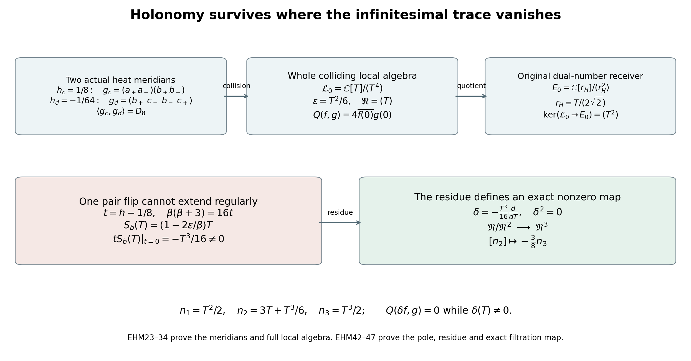

# Holonomy of the original signed eight-state completion

23 September 2026. This derivation computes continuation of the actual completed ES–Fable cover, including the omitted infinity sign, the two original involutions, the complete finite trace forms, and the surviving collision algebra. It distinguishes a permutation of nearby states from an automorphism extending through a nonreduced fibre, and calculates the residue when such an extension fails. No finite trace form in this note is identified with an arithmetic Weil distribution.

Original sources read: the original finite signed-completion source linked below, FS1–FS31, and [*The ES–Fable inverse correspondence*, SM1–SM19, pinned original TeX, source lines 2097–2513](https://github.com/KokunoYumeto/zeta-function-research-reader/blob/ab45e221579a0d48ce2885b4ecdf1a6aefc24a20/workbenches/splitzero-tandem/continuations/20260920-fable-boundary-action/FABLE_TO_ORIGINAL_CONDUCTOR.tex#L2097), including the explicit paths and sign choices in SM7–SM14. The latter already proves the order-192 monodromy group; that result is not claimed as new here. The completed chart and local algebra source is [*The finite signed-root completion*, FS1–FS31, pinned original TeX](https://github.com/KokunoYumeto/zeta-function-research-reader/blob/0fd693c844aad9117e30ec447c59864a28af10f3/workbenches/splitzero-tandem/continuations/20260921-native-spectral-real-pair/005/independent/FINITE_SIGNED_COMPLETION.tex). Their exact source hashes are, respectively, `10906ba3bd21c06645571560e4c7b0c3948c0ccaf65d8b9e525abf7cd732794c` and `eaf980a16e7d639e21953e5779e7f76abf18e8bdb80ae923c4160b456c22da6f`. The complete group proof needed here is included below. The receiving heat calculation [the complete eight-state heat proof](https://github.com/KokunoYumeto/zeta-function-research-reader/blob/d5c9d198a8432e3ede468b280162a99c00e3f4f7/workbenches/splitzero-tandem/branches/tau-zero-prime-positivity/EIGHT_STATE_HEAT_COMPARISON.md), ESH1–ESH72, was read, and every used map and local relation is restated and proved here. Source provenance of the original polynomial is retained in FS's bibliography: *Erdős–Straus project reader*, source version 69, `explicit-four-time-Jacobian-collision`; the added completion and monodromy are programme derivations.

## 1. The unchanged cover and its continuation maps

Retain target coordinates \(u=(A,B,C,D)\), the fixed cubic coefficient one, and
\[
\begin{aligned}
H_u(U,V)&=AU^4+U^3V+BU^2V^2+CUV^3+DV^4,\\
F_u(R)&=AR^4+R^3+BR^2+CR+D,\\
k_u(v)&=A+v+Bv^2+Cv^3+Dv^4.
\end{aligned}
\tag{EHM1}
\]
The completed finite and infinity charts are
\[
F_u(R)=0,\quad T^2=F'_u(R),\qquad
k_u(v)=0,\quad\Theta^2=-k'_u(v),
\quad v=R^{-1},\quad\Theta=-T/R.
\tag{EHM2}
\]
The inverse transition is \(R=v^{-1},T=-\Theta/v\). At a root, differentiation of \(k(v)=v^4F(1/v)\) gives \(k'(v)=-v^2F'(1/v)\), proving both squared relations and every transition sign. Write \(\mathfrak D\) for the binary quartic discriminant, with its original value \(A^6\prod_{i<j}(R_j-R_i)^2\) when \(A\ne0\). The completed unramified base is
\[
\mathcal B^\circ=\{\mathfrak D\ne0\},\qquad
\mathcal B=\{A\mathfrak D\ne0\}\subset\mathcal B^\circ.
\tag{EHM3}
\]
On \(\mathcal B^\circ\) each projective root is simple and has two nonzero sign values. On a finite chart the relative Jacobian determinant is \(2T F'(R)=2T^3\ne0\). At infinity, \(v=0\) forces \(A=0\) and \(\Theta=\pm i\), and the relative determinant is \(2\Theta k'(0)=2\Theta\ne0\). Thus these eight points have separate local holomorphic inverse charts. Covering a compact path by finitely many such neighborhoods and matching its initial point gives unique continuation of each state. In particular infinity itself is not a branch point of the completed cover.

For a finite root and nonzero \(T\), the original source coordinate \(\alpha\), called \(a\) in FS, and the other three source coordinates are
\[
\begin{aligned}
\alpha&=T^{-1},\qquad y=-R-iT,\\
z&=AT^3+2RT+3iT^2,\\
w&=7iR^2T+(B-17R+AR^2)T^2-13iT^3-2AT^4.
\end{aligned}
\tag{EHM4}
\]
These are FS13 in the unchanged reciprocal coordinate. They invert the original factor equations: \(b=-R/T,c=AT,d=(1+AR)T,e=(B+R+AR^2)T,f=(C+BR+R^2+AR^3)T\); multiplication gives the four coefficients of EHM1, and the resultant is \(T^{-2}F'(R)=1\). The original source is the completed cover with the ramification divisor and the infinity sign \(\Theta=i\) removed. At \(A=0\) its retained sign is \(\Theta=-i\), with source point
\((0,B,i(7B^2-C)/2,11B^3-2BC-D)\), as direct substitution in the original polynomial verifies.

For a path entirely in \(\mathcal B\), order its roots continuously and choose one initial \(T_j\) at each. The exact continuation formula is
\[
T_j(t)=T_j(0)\exp\left(\frac12\int_0^t
\left[\frac{A'}A+\sum_{k\ne j}\frac{R'_j-R'_k}{R_j-R_k}\right]ds\right).
\tag{EHM5}
\]
The denominators are nonzero on this path. Differentiating proves that \(T_j^2/[A\prod_{k\ne j}(R_j-R_k)]\) is constant with value one. The inverse source sign \(\alpha_j=1/T_j\) has the negative exponent, exactly SM14. EHM2 supplies continuation through infinity where EHM5's finite coordinates cannot be used.

## 2. The original order-192 group, with its actual generators

For four finite ordered roots let \(\Delta=\prod_{j<k}(R_k-R_j)\). The derivative product is
\(\prod_jF'(R_j)=A^4\Delta^2\): each of six unordered pairs contributes a minus sign, whose product is one. Therefore
\[
\chi=A^2\Delta\prod_{j=1}^4\alpha_j,\qquad \chi^2=1.
\tag{EHM6}
\]
This continuous value is constant along any ordered lift. A base loop acts by
\[
(j,\epsilon)\longmapsto(\pi(j),\sigma_j\epsilon),\qquad
\prod_j\sigma_j=\operatorname{sgn}(\pi),
\quad
G=\{(\sigma,\pi)\in\{\pm1\}^4\rtimes S_4:
\prod_j\sigma_j=\operatorname{sgn}(\pi)\}.
\tag{EHM7}
\]
Indeed the final Vandermonde changes by \(\operatorname{sgn}(\pi)\), while the product of source signs changes by \(\prod_j\sigma_j\), and EHM6 fixes their product. The same signs describe \(T_j=1/\alpha_j\). This gives \(|G|=8\cdot24=192\) as an upper bound.

The original SM7–SM11 realize the bound without assuming a braid-group presentation. Retain their exact real roots, target, and inverse-source signs:
\[
\begin{gathered}
(R_1,R_2,R_3,R_4)=(7,9,11,13),\quad
u_{\mathrm{real}}=(-1/40,-59/4,95,-9009/40),\\
(\alpha_1,\alpha_2,\alpha_3,\alpha_4)
=(\sqrt{5/6},-i\sqrt{5/2},-\sqrt{5/2},i\sqrt{5/6}).
\end{gathered}
\tag{EHM8}
\]
The derivatives are \((6/5,-2/5,2/5,-6/5)\), proving \(\alpha_j^2F'(R_j)=1\) in each coordinate. For an adjacent pair, with center \(c=(R_j+R_{j+1})/2\), take
\[
R_j(\theta)=c-e^{i\theta},\quad
R_{j+1}(\theta)=c+e^{i\theta},\quad0\le\theta\le\pi,
\qquad \beta_j=(j+\ (j+1)+\ j-\ (j+1)-).
\tag{EHM9}
\]
Keep the other roots and \(A=-1/40\) fixed. The root sum stays forty, so the cubic coefficient stays one. The pair disk contains no other root, and the endpoint unordered root set is the initial one, proving this is a base loop. At a fixed root, the moving derivative factor is \((R_k-c)^2-e^{2i\theta}\), contained in a right-half-plane disk not meeting zero, so its logarithm has zero total change. At a moving root the difference from its partner has argument change \(\pi\); each difference from an outside root has a logarithm with zero imaginary endpoint change, because it lies in a left or right half-plane and has real endpoints of the same sign. Thus \(\alpha_j\) changes phase by \(-\pi/2\). Substituting the four actual signs EHM8 proves exactly the four-cycle EHM9 and fixes every other state.

The squares \(\beta_j^2\) flip the two adjacent signs. The three vectors \((1,1,0,0),(0,1,1,0),(0,0,1,1)\) are independent over \(\mathbb F_2\) and span the even-sum subspace, so these squares generate all eight allowed pure sign patterns. The root permutations of the \(\beta_j\) generate \(S_4\). The generated group therefore has at least \(8\cdot24\) elements, proving that the upper bound EHM7 is attained. Its product \(\beta_1\beta_2\beta_3\), applied rightmost first, is the eight-cycle \((1+\ 2+\ 3+\ 4+\ 1-\ 2-\ 3-\ 4-)\). This is the determinant-one signed-permutation group, not the even-sign group called \(W(D_4)\): in the latter a signed four-cycle must have positive sign product and order four, while all shorter-cycle combinations have order dividing four or six, so no element has order eight.

The completed cover over \(\mathcal B^\circ\) has the same monodromy. At a base point with \(A\ne0\), any loop in \(\mathcal B^\circ\) can be moved slightly to avoid \(A=0\), with its base point fixed. Here is the needed elementary justification. Cover the compact loop by finitely many convex balls contained in \(\mathcal B^\circ\), subdivide its parameter, and replace each piece by a polygon in these balls. Perturb the finitely many vertices so that their \(A\)-coordinates are nonzero, and detour any zero of a segment's linear \(A\)-coordinate by a small semicircle in that complex coordinate, within the same ball. The replacements are homotopic to the original paths inside these convex balls and avoid \(A=0\). Thus every completed-loop permutation already occurs over \(\mathcal B\). Conversely the loops EHM9 remain available, so the group is exactly \(G\). The base is path connected: the discriminant restricted to the complex line through any two allowed endpoints is a nonzero polynomial, and detouring its finitely many zeros connects them. Base-point changes therefore conjugate the permutation representation by an actual bijection of path lifts. That bijection preserves each sign pair, since the two initial opposite signs continue as opposites. The determinant-one subgroup EHM7 is invariant under conjugation by such a signed permutation, so the same description applies in the explicit labels at \(u_*\).

## 3. Labels and both involutions at the original seven-point target

Use the original target \(u_*=(0,0,-1,0)\), with \(F_*(R)=R^3-R\). Label all eight completed states by
\[
\begin{array}{c|cccccccc}
\text{label}&a_+&a_-&b_+&b_-&c_+&c_-&m&n\\\hline
(R,T)\text{ or }(\infty,\Theta)&(1,\sqrt2)&(1,-\sqrt2)&(0,i)&(0,-i)&(-1,\sqrt2)&(-1,-\sqrt2)&(\infty,i)&(\infty,-i).
\end{array}
\tag{EHM10}
\]
The missing original state is exactly \(m\). Write \(\mathcal A_*\cong\mathbb C^8\) for the reduced fibre algebra, with point idempotents \(e_x\). Evaluation supplies this isomorphism: the root idempotents at \(0,1,-1\) are \(1-R^2,(R^2+R)/2,(R^2-R)/2\), and splitting each nonzero sign quadratic gives its two indicator functions. At infinity,
\(e_m=(1-i\Theta)/2\) and \(e_n=(1+i\Theta)/2\), extended by zero elsewhere. These formulas square to themselves, are complementary, and evaluate to the indicated indicator values.

The original deck involution \(\Sigma\) negates \(T,\Theta\). Coefficient conjugation \(\kappa\) fixes the coordinate generators. Native \(J\) has target map \(j_{\mathrm{out}}(A,B,C,D)=(-A,-B,C,-D)\) and chart maps
\[
J(R,T)=(-R,-T),\qquad J(v,\Theta)=(-v,\Theta).
\tag{EHM11}
\]
They follow either from EHM4 and \(J(\alpha,y,z,w)=(-\alpha,-y,z,-w)\), or by substituting in \(F_{j_{\mathrm{out}}u}(-R)=-F_u(R)\) and its derivative. At \(u_*\), the relevant permutations on EHM10 are
\[
\begin{aligned}
s&=(a_+a_-)(b_+b_-)(c_+c_-)(mn),\\
k&=(b_+b_-)(mn),\qquad
j=(a_+c_-)(a_-c_+)(b_+b_-),\\
\tau_\Sigma:=sk&=(a_+a_-)(c_+c_-),\qquad
\tau_J:=jk=(a_+c_-)(a_-c_+)(mn).
\end{aligned}
\tag{EHM12}
\]
Here \(s,j\) act complex-linearly on the algebra; \(\kappa\), \(\#_\Sigma=\Sigma\kappa\), and \(\#_J=J\kappa\) conjugate coefficients as well as applying \(k,\tau_\Sigma,\tau_J\), respectively. Applying their coordinate formulas to every state verifies EHM12, including the fact that \(J\) fixes each infinity sign but \(\#_J\) exchanges them.

For any of these conjugate-linear involutions, the complete Hermitian regular-trace pairing is
\[
Q_\tau(f,g)=\sum_x\overline{f(\tau x)}g(x),\qquad
[Q_\tau]=P_\tau,
\tag{EHM13}
\]
where \(P_\tau e_x=e_{\tau x}\). To prove it, multiplication by \(f\) on the point basis is diagonal with entries \(f(x)\), so its trace is their sum; now multiply \(\iota(f)g\). A fixed point of \(\tau\) contributes one positive scalar form. A transposed pair contributes \(\left(\begin{smallmatrix}0&1\\1&0\end{smallmatrix}\right)\), with one positive and one negative eigenvalue. Hence the full inertias are
\[
\operatorname{inertia}Q_k=(6,2,0),\quad
\operatorname{inertia}Q_{\tau_\Sigma}=(6,2,0),\quad
\operatorname{inertia}Q_{\tau_J}=(5,3,0).
\tag{EHM14}
\]
In particular \(e_m\) is positive for \(Q_{\tau_\Sigma}\), but isotropic for \(Q_{\tau_J}\), where it pairs with \(e_n\). The negative native infinity vector is \(e_m-e_n\), with value \(-2\). The omitted state, a negative direction, and a radical direction are therefore explicitly related, but are not interchangeable names.

## 4. An explicit loop involving the omitted infinity state

The completed coefficient line
\[
u(A)=(A,0,-1,0),\qquad
F_A(R)=R(AR^3+R^2-1),\qquad
\mathfrak D(u(A))=4-27A^2
\tag{EHM15}
\]
starts at \(u_*\). The discriminant identity follows either from the Sylvester determinant or from the cubic discriminant of \(AR^3+R^2-1\), multiplied by the squared resultant with \(R\), which is one. Put \(A_c=2/(3\sqrt3)\). For \(0<A<A_c\), the three nonzero roots consist of \(R_L<-2/(3A)<R_C<0<R_P\): the cubic tends to minus infinity on the left, has positive value \(4/(27A^2)-1\) at \(-2/(3A)\), value \(-1\) at zero, and tends to plus infinity on the right. Its derivative has only these two critical points, proving the stated root count and order. As \(A\to0^+\), \(R_C\to-1,R_P\to1\), and \(R_L=-1/A+O(A)\), the original infinity branch. At a nonzero root,
\[
F_A'(R)=R^2(3AR+2),\qquad
\Theta^2=3AR+2.
\tag{EHM16}
\]
The first follows by differentiating \(R(AR^3+R^2-1)\) at a root; the second uses EHM2. For the stated large-root asymptotic, put \(w=AR_L\) while \(A\ne0\); the root equation becomes \(w^2(w+1)=A^2\). Its derivative in \(w\) at \((w,A)=(-1,0)\) is one, so its unique analytic branch there satisfies \(w=-1+A^2+O(A^4)\), obtained by substituting its convergent series. Dividing by the retained nonzero \(A\) gives \(R_L=-1/A+A+O(A^3)\). EHM16 now gives \(\Theta\to\pm i\). Thus the sign \(m\) continues along the large negative root with \(T=-R_L\Theta\) positive imaginary, while \(c_+\) continues along \(R_C\) with positive real \(T\).

At \(A_c\), the two negative roots collide at \(-\sqrt3\). The other nonzero root is \(\sqrt3/2\). The collision is transverse because \(\partial_A F_A(R)=R^4=9\) and \(\partial_R^2F_A(R)=2\sqrt3\ne0\) there. Choose a sufficiently small \(\epsilon>0\), approach \(A_c-\epsilon\) along the positive real interval, traverse the circle \(A=A_c+\epsilon e^{i\theta}\), \(\pi\le\theta\le3\pi\), and return along the interval. No other discriminant point lies on or within this small disk. The resulting based-loop permutation is
\[
g_\infty=(m\ c_-\ n\ c_+),\qquad
g_\infty^2=(mn)(c_+c_-),
\tag{EHM17}
\]
fixing \(a_\pm,b_\pm\). Here is the sign computation. In the local coordinate centered at the collision, the two root displacements initially are negative and positive real; their difference makes a positive half-turn as the target makes one turn. The derivative at the negative displacement initially is negative real and at the positive displacement positive real, since \(F_{RR}>0\). Each derivative therefore acquires argument change \(\pi\); its square root acquires phase \(i\). Thus positive imaginary \(T\) on the large branch ends as negative real \(T\) on the other branch, giving \(m\mapsto c_-\), whereas positive real \(T\) on that branch ends as positive imaginary on the large branch, giving \(c_+\mapsto m\). Negating signs gives the other two arrows. Analytic nonzero factors have logarithms on this small disk and contribute no further winding. The other two root pairs have separate holomorphic nonzero sign branches and are fixed. Returning along the real interval proves the exact labels in EHM17.

This loop leaves \(A=0\); loops entirely in its simple-root locus fix the two infinity sections \(\Theta=\pm i\). The missing infinity state is nevertheless in the full monodromy orbit. In particular, two traversals take the retained state \(n\) to the omitted state \(m\). On its returning original affine inverse branch, \(T=-iR_L(1+O(A^2))\), so EHM4 gives
\[
y=-2R_L+O(A)=2/A+O(A),\qquad\alpha=1/T\longrightarrow0.
\tag{EHM18}
\]
Thus the loop has a bounded lift in the completed cover and an escaping lift at the endpoint in the original affine chart. This is the actual relation of the nontrivial holonomy to the seventh/eighth distinction, with its original coordinate divergence.

Let \(v_c=e_{c_+}-e_{c_-}\) and \(v_\infty=e_m-e_n\). Under the point-permutation action \(\rho(g)e_x=e_{gx}\),
\[
\rho(g_\infty)v_c=v_\infty,\qquad
\rho(g_\infty)v_\infty=-v_c,
\qquad Q_{\tau_\Sigma}(v_c,v_c)=-2,
\quad Q_{\tau_\Sigma}(v_\infty,v_\infty)=2.
\tag{EHM19}
\]
All four equations follow by applying EHM17 and EHM12. One negative and one positive direction are exchanged. Both remain in the same eight-dimensional space; the next section calculates exactly what happens to the form.

## 5. The typed transport of the forms and involutions

The action \(\rho(g)e_x=e_{gx}\) is a unital algebra automorphism of \(\mathbb C^8\), because it permutes the orthogonal primitive idempotents. It preserves the complex bilinear regular trace pairing and the positive coefficient form \(\sum_x\overline{f(x)}g(x)\). For an original conjugate-linear involution with point permutation \(\tau\), exact substitution gives
\[
Q_\tau(\rho(g)f,\rho(g)h)=Q_{g^{-1}\tau g}(f,h),\qquad
\rho(g)\iota_\tau\rho(g)^{-1}=\iota_{g\tau g^{-1}}.
\tag{EHM20}
\]
Thus \(\rho(g)\) is an isometry from \(Q_\tau\) to \(Q_{g\tau g^{-1}}\). It preserves the original fixed form precisely when \(g\tau=\tau g\), since equality of the matrices in EHM13 is then necessary and sufficient. EHM19 does not meet that condition; it is not a sign flip by an isometry of the unchanged indefinite form.

The same fact has a pathwise formulation retaining both native maps. Uniqueness of lifts gives
\[
\Sigma M_\gamma=M_\gamma\Sigma,\qquad
\kappa M_\gamma\kappa=M_{\overline\gamma},\qquad
J M_\gamma J^{-1}=M_{j_{\mathrm{out}}\gamma}.
\tag{EHM21}
\]
For a path with differing endpoints these are identities between its stated endpoint fibres; at the real, native-fixed base point \(u_*\) they are identities on that fibre. Conjugating a lifted path by the respective coordinate map gives a lift of the transformed base path with the corresponding initial point, which proves each equality. Combining the second identity with the first or third gives the corresponding equations for \(\#_\Sigma\) and \(\#_J\). In particular native reflection of \(\gamma_+(h)=(0,0,-1-16h,16h)\) is \(\gamma_-(h)=(0,0,-1-16h,-16h)\), generally a different target path. Native reflection is not to be substituted for continuation around a loop of \(\gamma_+\).

The seven-state quotient has its exact transported family. For any state \(x\), let \(q_x:\mathcal A_*\to\mathcal A_*/\mathbb Ce_x\). Then
\[
\overline\rho_g:\mathcal A_*/\mathbb Ce_x\xrightarrow{\sim}
\mathcal A_*/\mathbb Ce_{gx},\qquad
\overline\rho_g q_x=q_{gx}\rho(g).
\tag{EHM22}
\]
This is well defined because \(\rho(g)(\mathbb Ce_x)=\mathbb Ce_{gx}\); its inverse is induced by \(g^{-1}\). Since \(G\) is transitive, the smallest monodromy-stable ideal containing the omitted line \(\mathbb Ce_m\) is all of \(\mathcal A_*\): it contains every point idempotent and hence their sum one. Consequently there is no nonzero quotient algebra with the full induced monodromy action that kills exactly this one state. The seven-state objects instead form the explicitly transported family EHM22, or a single such quotient over its stabilizer subgroup of order \(192/8=24\). This proves the obstruction and its replacement object, rather than treating the missing state as unrelated to the cover.

## 6. Both meridians of the actual chosen heat path

Retain
\[
\gamma_+(h)=(0,0,-1-16h,16h),\qquad
F_h(R)=(R-1)(R^2+R-16h),\qquad
\operatorname{Disc}F_h=(2-16h)^2(1+64h).
\tag{EHM23}
\]
The factorization follows by expansion. For the discriminant, the quadratic discriminant is \(1+64h\), and its resultant with \(R-1\) is its value \(2-16h\) at one; the product of squared pairwise root differences gives their stated product. Thus the path meets the discriminant at \(h_c=1/8\) with multiplicity two and at \(h_d=-1/64\) with multiplicity one. On the branch \(s(h)=\sqrt{1+64h}\) with \(s(0)=1\), its roots and derivatives are
\[
R_a=1,\quad R_b=(-1+s)/2,\quad R_c=(-1-s)/2,
\qquad
\mu_a=(9-s^2)/4,\quad\mu_b=s(s-3)/2,\quad\mu_c=s(s+3)/2.
\tag{EHM24}
\]
The derivatives follow by evaluating \(3R^2-1-16h\), or by differentiating the factorization at each root.

Take the positive meridian around \(h_c\) approached along \((0,h_c)\), and the positive meridian around \(h_d\) approached along \((h_d,0)\). In the exact base labels EHM10 their permutations are
\[
g_c=(a_+a_-)(b_+b_-),\qquad
g_d=(b_+\ c_-\ b_-\ c_+).
\tag{EHM25}
\]
Near \(h_c\), all three root functions are individually holomorphic, \(\mu_a,\mu_b\) have simple zeros, and \(\mu_c\) has none. The first two square roots therefore change sign once, and the third does not, proving the first formula. Around \(h_d\), let \(h=h_d+\epsilon e^{i\theta}\), starting to its right; then \(s=8\sqrt\epsilon e^{i\theta/2}\) makes an upper half-circle. For sufficiently small \(\epsilon\), the continuous argument of \(\mu_b\) runs from \(\pi\) to \(2\pi\), and that of \(\mu_c\) from zero to \(\pi\): in EHM24 the factors \(s-3,s+3\) remain in their respective left and right half-planes, with real endpoint ratios of the same sign. Consequently \(b_+\mapsto c_-\), \(c_+\mapsto b_+\), and the other two arrows follow by negating signs. This proves the second formula. The infinity states are the constant sections \(\Theta=\pm i\) on this path and are fixed by both loops.

These permutations obey \(g_c^2=1,g_d^4=1,g_cg_dg_c=g_d^{-1}\). The four powers of \(g_d\) fix \(a_\pm\), and the four elements \(g_cg_d^j\) exchange them, so these eight elements are distinct; the relations reduce every word to one of them. The path's monodromy is thus the group of order eight
\[
\langle g_c,g_d\rangle\cong D_8,
\qquad g_d^2=(b_+b_-)(c_+c_-).
\tag{EHM26}
\]
The base is the complex \(h\)-plane with these two points deleted. To see that these two meridians generate all its loop permutations, surround each puncture by a small disjoint disk and join their boundaries to the base point by nonintersecting arcs. Cutting a large disk containing any given compact loop along those arcs leaves a region without holes, in which the loop reduces to successive boundary traversals of the two punctures. These are the two stated meridians and their inverses. This supplies the elementary topological generation needed for the equality, rather than only a subgroup assertion.

The first loop is an isometry of the fixed \(Q_{\tau_\Sigma}\), since both permutations in EHM12 and \(g_c\) are products of individual pair flips. It sends the negative vector \(v_a=e_{a_+}-e_{a_-}\) to \(-v_a\) and the positive vector \(v_b=e_{b_+}-e_{b_-}\) to \(-v_b\); their squared values stay \(-2\) and \(2\). The second loop instead sends \(v_c\mapsto v_b\) and \(v_b\mapsto-v_c\), exchanging values \(-2\) and \(2\) for the fixed form. Its transported form is exactly EHM20. Therefore neither nontrivial continuation nor a sign change alone proves positivity of the unchanged pairing.

## 7. The exact local family, the retained radical, and the regular heat-loop extension

Put \(t=h-1/8\), \(\epsilon=R-1\), and
\[
\beta(t)=\frac{\sqrt{9+64t}-3}{2},\quad\beta(\beta+3)=16t,
\qquad
\mathscr L=\frac{\mathbb C\{t\}[\epsilon,T]}
{(\epsilon^2-\beta\epsilon,\ T^2+16t-(6+3\beta)\epsilon)}.
\tag{EHM27}
\]
Here \(\mathbb C\{t\}\) means convergent power series at zero and the square root has value three. The root branches in this cluster are \(\epsilon=0,\beta\); the third root is separated, so its root factor is invertible in this local algebra. Reducing \(F_h'(1+\epsilon)=6\epsilon+3\epsilon^2-16t\) by \(\epsilon^2=\beta\epsilon\) proves the second relation. Successive division by the two monic relations proves that \(1,\epsilon,T,\epsilon T\) is a free basis. The special fibre is therefore
\[
\mathscr L_0=\mathbb C[\epsilon,T]/(\epsilon^2,T^2-6\epsilon)
\cong\mathbb C[T]/(T^4),\qquad\epsilon=T^2/6.
\tag{EHM28}
\]
Substitution proves both inverse maps in this isomorphism.

The chosen-loop permutation \(g_c\) has the regular local-family realization \(\epsilon\mapsto\epsilon,T\mapsto-T\). On the whole eight-state family near \(h_c\), let
\[
e_c(h,R)=\frac{(R-1)(R-R_b(h))}{(R_c(h)-1)(R_c(h)-R_b(h))},
\qquad R\mapsto R,\quad T\mapsto(2e_c-1)T,\quad\Theta\mapsto\Theta.
\tag{EHM29}
\]
The denominator stays nonzero near \(h_c\). The numerator evaluates to zero on the cluster and to its denominator at the separated root, so it is the separated-root idempotent. Since \((2e_c-1)^2=1\), this map preserves the entire signed relation, flips just the two cluster signs, and fixes the separated pair and infinity states. It is an involution and realizes EHM25. At \(h_c\), \(e_c=(R-1)^2/9\). This is a local extension of this loop, not the global sign deck map, which would negate all eight signs.

Retain the original radical generators, extended by zero on the separated and infinity factors:
\[
\begin{aligned}
n_1&=(R-1)(R+2)=T^2/2,\\
n_2&=T(R+2)=3T+T^3/6,\\
n_3&=T(R-1)(R+2)=T^3/2.
\end{aligned}
\tag{EHM30}
\]
The right sides follow from \(R=1+T^2/6\) modulo \(T^4\). Conversely \(T=n_2/3-n_3/9,T^2=2n_1,T^3=2n_3\), proving independence and spanning of \(\mathfrak N=(T)\). Multiplication gives
\[
n_2^2=18n_1,\quad n_1n_2=3n_3,\quad
n_1^2=n_1n_3=n_2n_3=n_3^2=0,
\quad\mathfrak N^2=\langle n_1,n_3\rangle,\quad
\mathfrak N^3=\langle n_3\rangle,\quad\mathfrak N^4=0.
\tag{EHM31}
\]
Each assertion follows by multiplying the displayed powers of \(T\); the nonzero products and independence prove the stated ideal powers. The specialized loop acts by
\[
g_c^*: (n_1,n_2,n_3)\longmapsto(n_1,-n_2,-n_3).
\tag{EHM32}
\]
Here the point map and its pullback are both involutions, so the idempotent-transport convention \(\rho\) agrees with the pullback in this case.

Every \(f\in\mathscr L_0\) has multiplication trace \(4f(0)\): its nonconstant part lies in the nilpotent ideal and has a nilpotent multiplication operator, while its constant part acts on four basis vectors. The conjugate-deck form, with \(T^\#=-T\), is consequently
\[
Q_{\mathscr L_0}(f,g)=4\overline{f(0)}g(0),\qquad
\operatorname{rad}Q_{\mathscr L_0}=\mathfrak N.
\tag{EHM33}
\]
The complete special fibre is \(\mathscr L_0\times\mathbb C[T_c]/(T_c^2-9)\times\mathbb C[\Theta]/(\Theta^2+1)\). Its latter forms have Gram matrices \(\operatorname{diag}(2,-18)\) and \(\operatorname{diag}(2,2)\); direct multiplication proves them as in EHM13. Thus the whole form has inertia \((4,1,3)\), and the nonzero negative separated vector remains. The local radical is exactly the kernel of the regular trace pairing, not an assertion that its elements vanish as algebra elements.

The original HEB map is the further quotient setting \(R=1\), hence \(T^2=0\), with \(r_H=T/(2\sqrt2)\). Its exact sequence on the radical is
\[
0\longrightarrow\mathfrak N^2\longrightarrow\mathfrak N
\xrightarrow{\pi_1}\mathbb Cr_H\longrightarrow0,
\quad\pi_1(n_1)=0,\quad\pi_1(n_2)=6\sqrt2\,r_H,\quad\pi_1(n_3)=0.
\tag{EHM34}
\]
These images follow by evaluation in EHM30, proving the kernel, surjectivity, and constants. The loop \(g_c\) negates this surviving infinitesimal and preserves its nonzero algebra class.

## 8. The transverse order-four collision and its original-coordinate correction

An actual transverse path through the same coefficient point is
\[
F_z(R)=((R-1)^2-z)(R+2),\quad
u(z)=(0,0,-3-z,2-2z),\quad
x=R-1,\quad x^2=z,\quad T^2=2x(x+3).
\tag{EHM35}
\]
Expansion proves the target formula, and differentiating on the root relation proves the last equation. Choose the analytic square root \(g(x)=\sqrt{2(x+3)}\) with \(g(0)=\sqrt6\). Then
\[
y=T/g(x),\quad y^2=x,\quad y^4=z,
\qquad x=y^2,\quad T=yg(y^2).
\tag{EHM36}
\]
Both compositions are exact and analytic near the local point because \(g\) never vanishes. Positive point continuation is \(y\mapsto iy\). Its analytic deck map and coordinate pullback are
\[
\alpha:(x,T)\longmapsto\left(-x,,iT\sqrt{\frac{3-x}{3+x}}\right),
\qquad \alpha^2:(x,T)\longmapsto(x,-T).
\tag{EHM37}
\]
The ratio is the specific analytic branch with value one at zero. Substitution in EHM36 proves the equations and the square, without omitting any unit factor. At the special fibre, using \(x=T^2/6,x^2=0\), its pullback is
\[
\alpha_0^*(T)=iT-\frac{i}{18}T^3,\qquad
\alpha_0^*(n_1)=-n_1,\quad
\alpha_0^*(n_2)=in_2-in_3,\quad
\alpha_0^*(n_3)=-in_3.
\tag{EHM38}
\]
Indeed \(\sqrt{(3-x)/(3+x)}=1-x/3\) modulo \(x^2\), giving the first formula. Inserting it in EHM30 gives the remaining three. Its square sends \(T\) to \(-T\) and its fourth power is the identity. Thus it preserves all products EHM31. The correction \(-iT^3/18\) is required for the analytic continuation in the original reciprocal coordinate.

The distinction between point maps and pullbacks is explicit: a point map \(\alpha\) has pullback \(\alpha^*e_x=e_{\alpha^{-1}x}\). Therefore the forward idempotent transport \(\rho(\alpha)e_x=e_{\alpha x}\) of EHM20 is \((\alpha^{-1})^*\). On this special local algebra it sends
\(T\mapsto-iT+iT^3/18\), with the inverse of the three radical transformations EHM38. Both maps have the same invariants and coinvariants, but opposite eigenvalues \(i,-i\) on the corresponding nonreal eigenspaces. This retains the orientation rather than silently changing the convention for a four-cycle.

The relation with the chosen heat path is itself an exact map. Put
\[
m(t)=(1+R_b)/2,\quad d(t)=(1-R_b)/2,
\quad\ell(t)=m(t)-R_c,\quad x=R-m(t).
\tag{EHM39}
\]
Then \(F_h(R)=(x^2-d(t)^2)(x+\ell(t))\) by its three root factors. Also
\[
d(t)=-\frac{16t}{3+\sqrt{9+64t}},\qquad
d(t)^2=\frac{256t^2}{(3+\sqrt{9+64t})^2}.
\tag{EHM40}
\]
These identities follow by rationalizing \((3-\sqrt{9+64t})/4\). The denominator is an analytic nonzero unit near zero, so one small positive \(t\)-loop makes this transverse parameter wind twice. Replacing \(x+3\) in EHM36 by the retained analytic unit \(x+\ell(t)\) gives the same exact fourth-root calculation. Its continuation is consequently the square of the transverse order-four map, exactly \(g_c\). This proves the relationship between the two paths and their cycle orders.

At the other collision put \(v=h+1/64,x=R+1/2\). Direct expansion gives
\(F_h=(x^2-16v)(x-3/2)\) and \(T^2=2x(x-3/2)\) on the root algebra. Choosing \(\sqrt{2(x-3/2)}\) with value \(i\sqrt3\) gives the exact coordinate \(y=T/\sqrt{2(x-3/2)}\) with \(y^4=16v\). At the special fibre \(x=-T^2/3\), so its positive point continuation has pullback
\[
\alpha_{d,0}^*(T)=iT-\frac{2i}{9}T^3,\qquad
(\alpha_{d,0}^*)^2(T)=-T.
\tag{EHM41}
\]
This follows by expanding the corresponding ratio square root to first order in \(x\). Its branch has the four-cycle \(g_d\) from EHM25. It is a regular specialization at its own collision, which does not imply regular specialization at the different collision \(h_c\).

## 9. The regular-extension obstruction and its nonzero residue

A based permutation is not automatically a single-valued deck map over the punctured \(h_c\)-disk. Such a deck map must commute with the local monodromy \(g_c\): apply it before and after lifting a local loop and use uniqueness. Conversely a commuting permutation extends uniquely over that punctured disk by continuing it in the eight local branches; commutation makes the result independent of the chosen continuation path. Inside the explicitly computed \(D_8\), the centralizer is
\[
C_{D_8}(g_c)=\{1,g_c,g_d^2,g_cg_d^2\}.
\tag{EHM42}
\]
Indeed \(g_cg_d^j=g_d^{-j}g_c\), so commutation requires \(g_d^j=g_d^{-j}\), exactly even \(j\); multiplying by \(g_c\) gives the other two. Thus the odd powers of \(g_d\), and their \(g_c\)-multiples, already require a slit neighborhood to label their transported maps. They also move some states in the four-point collision cluster to separated reduced states. Any holomorphic extension to the special fibre would preserve its unique nonreduced local factor, so these maps could not extend through the collision even after attempting that identification.

The commuting element \(g_d^2\) has a stronger, explicitly calculable obstruction. It fixes the \(a\)-sign and flips only the \(b\)-sign in the local cluster. The two local root values of \(\epsilon\) are zero and \(\beta\), so its unique generic algebra formula is
\[
S_b(\epsilon)=\epsilon,\qquad
S_b(T)=\left(1-\frac{2\epsilon}{\beta}\right)T,
\qquad S_b(\epsilon T)=-\epsilon T.
\tag{EHM43}
\]
The interpolation multiplier has values one and minus one on the two root branches. Its square is one because \(\epsilon^2=\beta\epsilon\), proving that this is an involutive algebra automorphism on the punctured disk; the last equation follows from that same relation. This is its only possible continuation there, since the eight reduced points determine the algebra map. The separated \(c\)-factor also changes sign under \(g_d^2\), but this is a bounded, regular operation on that separate factor.

The simple zero of \(\beta\) produces an actual pole in the free basis EHM27. Its residue, meaning the specialization of the operator \(tS_b\) at \(t=0\), is
\[
\begin{aligned}
\left.tS_b(T)\right|_{0}
&=-\left.\frac{2t}{\beta}\epsilon T\right|_0
=-\frac38\epsilon T=-\frac{T^3}{16}\ne0,\\
\left.tS_b(1)\right|_0&=\left.tS_b(\epsilon)\right|_0
=\left.tS_b(\epsilon T)\right|_0=0.
\end{aligned}
\tag{EHM44}
\]
Here \(t/\beta=(\beta+3)/16\) follows from EHM27, and \(\epsilon T=T^3/6\) at the collision. Freeness of the four-element basis shows that this nonzero pole cannot be removed by another regular formula agreeing on the punctured disk. Projection onto the analytic cluster summand shows that adjoining the separated and infinity factors cannot cancel it either.

The residue is exactly the derivation
\[
\delta=-\frac{T^3}{16}\frac{d}{dT}:
\mathbb C[T]/(T^4)\longrightarrow\mathbb C[T]/(T^4),
\qquad
\ker\delta=\mathbb C1\oplus(T^2),\quad
\operatorname{im}\delta=(T^3),\quad\delta^2=0.
\tag{EHM45}
\]
The polynomial derivation preserves the ideal \((T^4)\), since it sends \(T^4\) to \(-T^6/4\); hence it descends and obeys the Leibniz identity. On \(1,T,T^2,T^3\), its values are \(0,-T^3/16,0,0\), exactly EHM44. These four values prove the kernel, image, and square. In the retained radical coordinates this is
\[
\delta(n_1)=0,\qquad\delta(n_2)=-\frac38n_3,
\qquad\delta(n_3)=0,
\qquad
\overline\delta:\mathfrak N/\mathfrak N^2\xrightarrow{\sim}\mathfrak N^3,
\quad[n_2]\longmapsto-\frac38n_3.
\tag{EHM46}
\]
The values follow by applying EHM45 to EHM30. Since \(\delta\) kills \(\mathfrak N^2\), the quotient map is well defined; both its source and target are one dimensional and its displayed value is nonzero, proving the isomorphism. This residue is an actual nonzero map between the retained infinitesimal layers. Its value depends on the specified original clock \(t=h-1/8\), whose scale is kept in EHM44.

The other nontrivial commuting candidate \(g_cg_d^2\) acts on \(T\) by the negative of EHM43 and has residue \(-\delta\). Consequently exactly
\[
\{1,g_c\}\subset\langle g_c,g_d\rangle
\tag{EHM47}
\]
extends holomorphically over the whole \(h_c\)-fiber. These two extensions were constructed in EHM29. All others fail either the punctured-disk commutation condition or the explicit nonzero residue test. This is a complete classification within the actual based heat-path group, not a claim that the different transverse local group has only two extending elements: its four elements were explicitly constructed in EHM37.

## 10. The action on invariants, coinvariants, and the trace radical

For any finite permutation group \(K\) acting on the eight states, let \(V=\mathbb C^8\), \(V^K\) be its invariant vectors, and \(V_K=V/W_K\), where
\(W_K=\operatorname{span}\{\rho(g)v-v:g\in K,v\in V\}\). For an orbit \(O\) let \(u_O=\sum_{x\in O}e_x\). The exact maps are
\[
\mathcal P_Kv=\sum_{O}\frac{\sum_{x\in O}v_x}{|O|}u_O,
\qquad
0\longrightarrow W_K\longrightarrow V\xrightarrow{\mathcal P_K}V^K\longrightarrow0,
\qquad V_K\xrightarrow{\sim}V^K,\quad[v]\mapsto\mathcal P_Kv.
\tag{EHM48}
\]
On every orbit the differences \(e_x-e_y\) span the coefficient-sum-zero subspace: choose one base point in the orbit and subtract it from all the others. Each such difference belongs to \(W_K\) because some group element takes one point to the other. Hence \(W_K\) is exactly the direct sum of those subspaces, proving the kernel, exactness, and quotient isomorphism. The invariant algebra consists of functions constant on each orbit and is \(\mathbb C^{\#\mathrm{orbits}}\), with trace weights \(|O|\). The map \(\mathcal P_K\) is linear and is not in general multiplicative: for two different points in a nontrivial orbit, their product is zero, whereas the product of their two images is \(u_O/|O|^2\ne0\). Thus the linear coinvariant space has not been assigned an unjustified quotient-algebra product. The ideal generated by the differences kills every nontrivial orbit, since multiplying \(e_x-e_y\) by \(e_x\) gives \(e_x\).

The actual dimensions and restrictions of the unchanged conjugate-deck form are
\[
\begin{array}{c|c|c|c}
K&\text{nontrivial state orbits}&\dim V^K=\dim V_K&
\operatorname{inertia}(Q_{\tau_\Sigma}|_{V^K})\\\hline
\langle g_c\rangle&\{a_+,a_-\},\{b_+,b_-\}&6&(5,1,0)\\
\langle g_d\rangle&\{b_+,c_-,b_-,c_+\}&5&(4,1,0)\\
\langle g_c,g_d\rangle&\{a_+,a_-\},\{b_+,b_-,c_+,c_-\}&4&(4,0,0)\\
G&\text{all eight states}&1&(1,0,0).
\end{array}
\tag{EHM49}
\]
To prove the signature entries without a dimension inference, every displayed orbit sum has positive value equal to its cardinality, since its orbit is preserved by \(\tau_\Sigma\). For the first row the remaining \(c_+,c_-\) block is hyperbolic and the two infinity states are positive. For the second the remaining \(a_+,a_-\) block is hyperbolic and infinity is positive. In the last two rows every invariant basis vector is an orbit sum and these sums have disjoint supports, giving mutually orthogonal positive values. These are restrictions to explicitly mapped subspaces, not positivity of the full original form. On the reduced eight-state fibre none of these nontrivial linear coinvariant projections makes the original full form descend by arbitrary lifts: its radical is zero by EHM14, whereas \(W_K\ne0\). A form descends through a projection precisely when its kernel pairs to zero with every vector, which proves this obstruction directly. The projection EHM48 still supplies its specified comparison with the invariant restriction.

At the nonreduced collision, the answer changes in an exactly calculable way. The extending local heat involution has invariants \(\langle1,T^2\rangle\) and difference space \(\langle T,T^3\rangle\). The latter lies in the trace radical \((T)\), so the local form EHM33 does descend to its two-dimensional linear coinvariant space, with radical the surviving class of \(T^2\). Its invariant restriction has inertia \((1,0,1)\). On the whole fibre the unchanged separated factor and infinity pair add their signatures, giving the complete invariant/coinvariant form inertia
\[
(4,1,1)\quad\text{for the extending heat involution at }h_c.
\tag{EHM50}
\]
By contrast, the transverse order-four map EHM38 has eigenvalues \(1,i,-1,-i\) on a suitable basis of \(\mathscr L_0\). One may use the exact coordinate \(y=T/\sqrt{2(3+T^2/6)}\) from EHM36, in which the basis \(1,y,y^2,y^3\) gives these four values; its linear change of basis is invertible since the coefficient of \(T\) in \(y\) is \(1/\sqrt6\ne0\). Thus its invariants are the scalar line and its difference space is the entire nilpotent radical. The local trace descends to the resulting one-dimensional quotient with value \(4|c|^2\). On the whole transverse fibre the invariant/coinvariant form is nondegenerate of inertia \((4,1,0)\), with the same separated negative direction still present. These conclusions use only the maps that actually specialize; EHM47 excludes assigning a full based \(D_8\)-action to the special fibre.

The residue EHM45 is invisible to this regular trace because its image lies in \(\mathfrak N^3\subset\operatorname{rad}Q\), but it is visible in the algebra and its filtration through the isomorphism EHM46. Explicitly \(Q(\delta f,g)=Q(f,\delta g)=0\) for all local \(f,g\), while \(\delta(T)=-T^3/16\ne0\). These are simultaneous exact identities; zero pairing has not been used to delete the map.

## 11. Native reflection through both local algebras

Native \(J\) maps the positive-path critical point \((0,0,-3,2)\) to \((0,0,-3,-2)\). In the negative-path cluster put \(\epsilon_-=R+1\); its local algebra has \(\epsilon_-^2=0,T_-^2=-6\epsilon_-\), while the positive cluster has \(T_+^2=6\epsilon_+\). The coordinate pullback is
\[
J^*(\epsilon_-)=-\epsilon_+,\qquad J^*(T_-)=-T_+.
\tag{EHM51}
\]
Substitution proves both relations and the inverse, which has the same signs. Coefficient conjugation adds the native \(\#_J\) map. For the negative-side generators
\(\nu_1=(R+1)(R-2),\nu_2=T_-(R-2),\nu_3=T_-(R+1)(R-2)\), this gives
\[
J^*(\nu_1)=n_1,\qquad J^*(\nu_2)=n_2,\qquad J^*(\nu_3)=-n_3.
\tag{EHM52}
\]
Every equality follows by replacing \(R\) with \(-R\) and \(T_-\) with \(-T_+\), so it preserves the entire nilpotent ideal and its powers, with their original constants.

The positive meridians on the negative target path, in the same initial eight labels, are
\[
g_c^-=(c_+c_-)(b_+b_-),\qquad
g_d^-=(b_+\ a_-\ b_-\ a_+).
\tag{EHM53}
\]
These follow by applying the native coordinate map and the same root/sign continuation argument used in EHM25. Since coefficient conjugation reverses the orientation of a positive meridian, the correctly typed native identities are
\(\#_Jg_c^+(\#_J)^{-1}=(g_c^-)^{-1}\) and
\(\#_Jg_d^+(\#_J)^{-1}=(g_d^-)^{-1}\); they can also be verified directly from EHM12, EHM25, and EHM53. On the positive path \(\#_\Sigma g_c\#_\Sigma^{-1}=g_c\) and \(\#_\Sigma g_d\#_\Sigma^{-1}=g_d^{-1}\). At the positive critical local algebra, coefficient conjugation and \(\#_\Sigma\) each conjugate \(\alpha_0^*\) of EHM38 to its inverse, since they conjugate \(i\) to \(-i\) and preserve its real coefficients. Its square preserves both involutions. All these local maps preserve the degenerate regular-trace form EHM33 because they fix the constant coefficient, even where they do not commute with the original involution; the whole radical accounts for that exact loss of detection.

The monodromy receiver for any subsequent programme pairing is now explicit: its fibre is the full eight-state algebra, its transport is \(\rho:G\to\operatorname{Aut}_{\mathbb C\text{-alg}}(\mathcal A_*)\), its two original involutions and their transport are EHM12 and EHM20–EHM21, and its regular collision maps and obstruction residue are EHM29, EHM38, and EHM43–EHM46. Any proposed scalar pairing transported by these same maps has the directly testable transformation matrix \(\rho(g)^*Q\rho(g)\). No equality of that matrix with a new supported-zero Weil formula is assumed here.

## 12. Exact verification scope

The reproducible script `check_eight_state_holonomy.py` passed **96 exact checks**, recorded in `EIGHT_STATE_HOLONOMY_CHECKS.json`. They reconstruct the 192 signed permutations and the eight-element heat-path group; verify the original involution matrices, all three selected-loop pairing transports, the invariant restriction signatures, the two original discriminants and transverse derivative constants, the order-four local coordinate maps and their original radical products, and the nonzero residue with every basis-monomial Leibniz identity. The analytic path-lifting, chosen logarithm branches, unramified infinity continuation, full local extension classification, and specialization arguments have their complete proofs above; finite symbolic checks are not substituted for those proofs.

## Exact residue-duality continuation

[RD1–RD31b](COLLISION_RESIDUE_DUALITY_DERIVATION.md) proves the complete Jacobian map from perfect residue duality to the retained regular trace, identifies the actual packet radical with cotangent cohomology, and computes the supported endpoint compensation. The existing formulas and all their coordinates remain unchanged.
