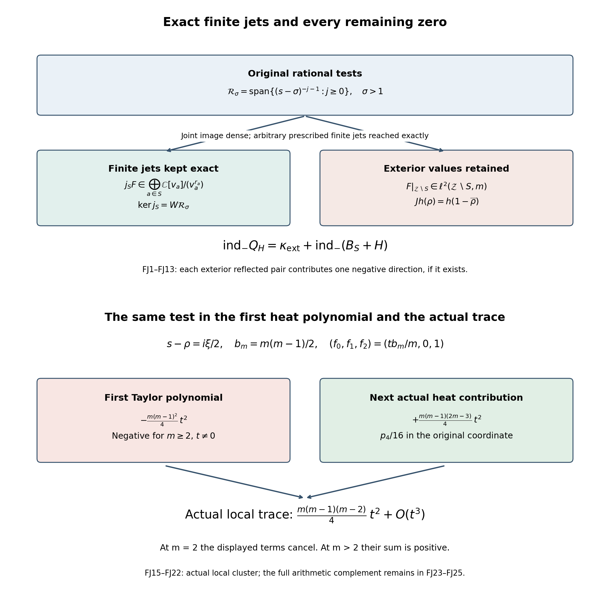

# Finite local jets, the whole Weil form, and the second heat coefficient

This proof calculates the exact connection between a finite set of original collision jets and the complete supported arithmetic form. It also calculates a negative direction of the first heat Taylor polynomial and the next coefficient of the actual heat trace in that same direction. No off-critical zeta zero is assumed to exist. The indices below count actual zeros, whatever their locations are.

## 1. The original objects and the finite-jet map

Let \(\mathcal Z\) be the set of distinct nontrivial zeros of the Riemann zeta function, with their actual multiplicities \(m_\rho\). Write \(\rho^\#=1-\bar\rho\). The functional equation gives \(m_{\rho^\#}=m_\rho\). Fix a real \(\sigma>1\) and the vector space and algebra
\[
\mathcal R_\sigma=\operatorname{span}_{\mathbb C}\{(s-\sigma)^{-j-1}:j\ge0\}.
\tag{FJ1}
\]
Its elements are proper rational functions with their only possible pole at \(\sigma\). Products remain in this algebra; the constant function one is not included. The exact reflected form is
\[
Q(F,G)=\sum_{\rho\in\mathcal Z}m_\rho
 \overline{F(\rho^\#)}G(\rho).
\tag{FJ2}
\]
The genus-one growth estimate in [AG4–AG5](ACTUAL_HEAT_ZERO_DISTRIBUTION_VARIATION.md) gives \(\sum m_\rho/(1+|\rho|^2)<\infty\); hence this sum is absolutely convergent. Its arithmetic value is the whole Cauchy coefficient form CK14–CK16, including the endpoints, archimedean term and prime sum in HA10–HA20. The full supported identity is retained in Section 6 below.

Take a finite reflection-stable subset \(S\subset\mathcal Z\), and positive integers \(r_a=r_{a^\#}\) for \(a\in S\). These are the number of test coefficients retained at each point. They may equal the actual zero multiplicities, or exceed them when the higher coefficients of fixed tests are needed. Set
\[
P(s)=\prod_{a\in S}(s-a)^{r_a},\quad D=\sum_{a\in S}r_a,
\quad W(s)=\frac{P(s)}{(s-\sigma)^D},\quad
\mathcal J_S=\bigoplus_{a\in S}\mathbb C[v_a]/(v_a^{r_a}).
\tag{FJ3}
\]
For \(S=\varnothing\), use \(D=0,W=1,\mathcal J_S=0\). The algebra map
\[
j_S:\mathcal R_\sigma\longrightarrow\mathcal J_S,
\qquad (j_SF)_a=\sum_{k=0}^{r_a-1}\frac{F^{(k)}(a)}{k!}v_a^k
\tag{FJ4}
\]
is onto. Here is an exact linear section. Given a prescribed jet \(f\), choose the unique polynomial \(N_f\) of degree less than \(D\) such that
\[
N_f(s)\equiv (s-\sigma)^D f_a(s-a)
 \pmod{(s-a)^{r_a}}\quad(a\in S),\qquad
\mathfrak s(f)=\frac{N_f(s)}{(s-\sigma)^D}.
\tag{FJ5}
\]
The polynomials \((s-a)^{r_a}\) are pairwise coprime. Repeated Euclidean identities for each pair give the Chinese remainder isomorphism from polynomials modulo \(P\) to the displayed finite quotient spaces, proving existence and uniqueness of \(N_f\). Since \(a-\sigma\ne0\), division by the denominator in each quotient proves \(j_S\mathfrak s=I\). Its numerator degree makes the section proper rational. This is a linear section, not a multiplicative section.

The exact kernel is
\[
\ker j_S=W\mathcal R_\sigma.
\tag{FJ6}
\]
One inclusion follows from the numerator factors. For the other, a proper rational \(F\) with these vanishing jets has polynomial numerator divisible by \(P\). Thus \(F/W\) is rational with no poles outside \(\sigma\); moreover it is \(O(s^{-1})\), since \(W\to1\) at infinity. This proves the reverse inclusion without changing the original coordinate.

## 2. Density while all finite jets are kept exact

Define
\[
\mathcal H_{\rm ext}=\ell^2(\mathcal Z\setminus S,m),\quad
J_{\rm ext}h(\rho)=h(\rho^\#),\quad
T(F)=(j_SF,(F(\rho))_{\rho\notin S}).
\tag{FJ7}
\]
The inner product on the Hilbert space is conjugate-linear in the first variable and includes the weights \(m_\rho\). The involution \(J_{\rm ext}\) is a linear self-adjoint isometry. Equip the finite jet space with the Euclidean norm in its stated coefficient coordinates. The image of \(T\) is dense in \(\mathcal J_S\oplus\mathcal H_{\rm ext}\), and approximation can keep its first coordinate exactly prescribed.

We prove this claim, including the required infinite convergence. If \(h\in\mathcal H_{\rm ext}\) is orthogonal to all evaluations of \((s-\sigma)^{-j-1}\), the function
\[
C_h(z)=\sum_{\rho\notin S}\frac{m_\rho\overline{h(\rho)}}{\rho-z}
\tag{FJ8}
\]
converges absolutely and locally uniformly off its discrete pole set. For a compact set \(|z|\le R\), its tail with \(|\rho|>2R\) is bounded by
\[
2\left(\sum_{|\rho|>2R}m_\rho|h(\rho)|^2\right)^{1/2}
 \left(\sum_{|\rho|>2R}\frac{m_\rho}{|\rho|^2}\right)^{1/2}.
\tag{FJ9}
\]
On a small disc at \(\sigma\), termwise Taylor expansion gives
\(C_h^{(j)}(\sigma)=j!\langle h,((\rho-\sigma)^{-j-1})_\rho\rangle=0\).
Consequently \(C_h\) vanishes there. The complement of a discrete subset of the complex plane is connected: any polygonal path has a compact image meeting only finitely many points of the discrete set and can be diverted in small disjoint discs about those points. The identity theorem now makes \(C_h\) zero throughout this complement. Its residue at \(a\notin S\) is \(-m_a\overline{h(a)}\), so all coordinates of \(h\) vanish. This proves density of the rational evaluations in the exterior Hilbert space.

On the remaining zero set, both \(W\) and \(W^{-1}\) are bounded. Indeed \(W(s)\to1\) as \(|s|\to\infty\), and only finitely many remaining zeros lie in any fixed disc; none is a zero or pole of \(W\). Multiplication by \(W\) is therefore a bounded invertible diagonal operator on \(\mathcal H_{\rm ext}\). By (FJ6), evaluations of \(\ker j_S\) are also dense there. To approximate an arbitrary pair \((f,h)\), take \(\mathfrak s(f)\) from (FJ5), and add elements of \(\ker j_S\) whose exterior evaluations tend to \(h-\mathfrak s(f)|_{\rm ext}\). Their jets remain exactly \(f\). This proves the assertion. It proves an approximation statement with an exact finite coordinate, not an isomorphism from rational functions onto arbitrary infinite data.

## 3. Exact inertia of every finite local correction

On the finite jet space define its original trace form
\[
B_S(f,g)=\sum_{a\in S}m_a\overline{f_{a^\#,0}}g_{a,0}.
\tag{FJ10}
\]
All coefficients with index at least one remain present in its radical. The exact jet involution is \((f^\#)_{a,k}=(-1)^k\overline{f_{a^\#,k}}\); hence (FJ10) is the regular local trace of \(f^\#g\) when \(r_a=m_a\). For other \(r_a\), the same expression is the stated constant-coefficient receiver, with the multiplicity of the actual zero retained.

Let \(H\) be any Hermitian sesquilinear form on this specified finite space. It defines the precise correction
\[
Q_H(F,G)=Q(F,G)+H(j_SF,j_SG)
 =(B_S+H)(j_SF,j_SG)
   +\langle J_{\rm ext}F|_{\rm ext},G|_{\rm ext}\rangle.
\tag{FJ11}
\]
Write \(\kappa_{\rm ext}\) for the number of distinct two-point orbits of \(\rho\mapsto\rho^\#\) in \(\mathcal Z\setminus S\), with infinity allowed. Then the negative index, defined as the supremum of the dimensions of strictly negative subspaces, is exactly
\[
\boxed{\operatorname{ind}_-Q_H=
 \kappa_{\rm ext}+\operatorname{ind}_-(B_S+H).}
\tag{FJ12}
\]
This statement includes every finite section of the rational coefficient space; it makes no supposition about the existence of off-line zeros.

For the proof, the bounded Hermitian form on \(\mathcal J_S\oplus\mathcal H_{\rm ext}\) has coefficient operator \(A=(B_S+H)\oplus J_{\rm ext}\). Each fixed reflection point in the exterior contributes one positive direction. Each two-point orbit of multiplicity \(m\), in coordinates divided by \(\sqrt m\), contributes the matrix \(\left(\begin{smallmatrix}0&1\\1&0\end{smallmatrix}\right)\), with one positive and one negative direction. The finite Hermitian matrix \(B_S+H\) has its usual orthogonal spectral decomposition. Thus the negative dimension of the full operator is the right side of (FJ12). A negative subspace injects into its negative spectral part: a vector whose negative projection vanishes has nonnegative form value. This gives the upper bound, including for every rational subspace.

For the lower bound, take any finite-dimensional negative spectral subspace with orthonormal basis \(u_1,\ldots,u_n\). On this subspace the form is bounded above by \(-\eta I\) for some \(\eta>0\), since only finitely many negative eigenvalues are involved and the exterior eigenvalue is \(-1\). By Section 2 choose rational vectors whose images \(v_i=T(F_i)\) approach the \(u_i\). For column operators \(U,V\),
\[
\|V^*AV-U^*AU\|
 \le\|A\|\bigl(2\|U\|\|V-U\|+\|V-U\|^2\bigr).
\tag{FJ13}
\]
This is obtained by expanding \(V=U+(V-U)\) and applying the operator norm inequality to its three additional terms. Choose the approximation so the bound is less than \(\eta/2\). Their Gram matrix is strictly negative, and the \(F_i\) are linearly independent because a dependence would have zero quadratic value. This realizes every such dimension in the rational space, proving (FJ12), also when the index is infinite.

In particular, for a finite set consisting entirely of actual critical-line zeros, every off-line negative direction remains detectable on the exact kernel of all of these jet maps. A local correction supported on these jets cannot remove an exterior negative direction. This is an exact description of which corrections act on which part of the original form. It does not assert that the negative directions exist. If a correction changes the complement as well, its action must be calculated there; (FJ12) concerns precisely the finite-jet corrections (FJ11).

## 4. A quantitative exterior tail for the actual Cauchy matrix

For fixed poles \(z_1,\ldots,z_n\) with \(\Re z_l>1\), let \(K_T\) be the sum in (FJ2) over \(|\Im\rho|\le T\), evaluated on \(F_l=(s-z_l)^{-1}\). Both this cutoff and its complement are reflection-stable. For
\(T\ge\max(1,2\max_l|\Im z_l|)\), each tail vector satisfies
\(\|(F_l(\rho))_l\|\le2\sqrt n/|\Im\rho|\), and the same bound holds at \(\rho^\#\). Summing the norms of the rank-one matrix contributions gives
\[
\|K-K_T\|\le4n\sum_{|\Im\rho|>T}\frac{m_\rho}{|\Im\rho|^2}
 \le8n\sum_{|\rho|>T}\frac{m_\rho}{|\rho|^2}
 =O\left(\frac{n\log(T+2)}T\right).
\tag{FJ14}
\]
For the second inequality use \(0<\Re\rho<1\), so \(|\rho|^2\le1+|\Im\rho|^2\le2|\Im\rho|^2\). The last estimate is AG5. No numerical value is assigned to its growth constant. The inequality with the actual tail sum is exact, and proves convergence in operator norm. It supplies no sign for the omitted matrix. The same proof applies after deleting any fixed finite set of local clusters, so the complement in HR17 is this actual convergent exterior form.

## 5. What the first and second heat coefficients actually do

Fix an actual critical-line zero \(\rho=1/2+ix_0/2\), of order \(m\), in the original family
\(g_t(s)=16H_t(-2i(s-1/2))\), \(\partial_tg_t=g_t''/4\).
Write
\[
g_0(\rho+v)=v^m u(v),\quad a=u'(0)/u(0),\quad
F(\rho+v)=f_0+f_1v+f_2v^2+\cdots.
\tag{FJ15}
\]
The reflection \(g_0^\#=g_0\) gives \(u(v)=(-1)^m\overline{u(-\bar v)}\), whence \(a=-\bar a\). All of these are original coefficients; \(v=s-\rho=i\xi/2\), with no change of heat time.

For a fixed analytic test \(A\), its local zero trace is a small contour integral of \(Ag_t'/g_t\). Differentiating this finite contour and using the heat equation gives
\[
\left.\partial_t Z_{\rho,t}(A)\right|_0
 =-\frac{m(m-1)}4 A''(\rho)-\frac m2aA'(\rho).
\tag{FJ16}
\]
To verify every coefficient, the principal part of \(g_0''/g_0\) is \(m(m-1)v^{-2}+2ma v^{-1}\). Its derivative, multiplied by \(A/4\), has residue \(-m(m-1)A''/4-maA'/2\). This proves (FJ16) and is the same residue calculation as AG17.

With \(A=F^\#G\), one has
\(A'=\bar f_0g_1-\bar f_1g_0\) and
\(A''=2\bar f_0g_2-2\bar f_1g_1+2\bar f_2g_0\).
Put \(b_m=m(m-1)/2\). The exact first Taylor polynomial of the local trace is therefore the Hermitian matrix on the **test** coefficients \((f_0,f_1,f_2)\)
\[
M^{[1]}_\rho(t)=
\begin{pmatrix}
m&-tma/2&-tb_m\\
tma/2&tb_m&0\\
-tb_m&0&0
\end{pmatrix}.
\tag{FJ17}
\]
For \(m=2\), the third test coefficient is still needed: it is not a third basis vector of the two-dimensional original collision algebra. HR7–HR9 gives the exact map of such fixed tests into that algebra, including their higher coefficients. Formula (FJ17) is a Taylor coefficient calculation on fixed tests.

For \(m\ge2\) and \(t\ne0\), the matrix is nonsingular and
\[
\det M^{[1]}_\rho(t)=-t^3b_m^3,\qquad
(n_+,n_-,n_0)=
\begin{cases}(2,1,0),&t>0,\\(1,2,0),&t<0.\end{cases}
\tag{FJ18}
\]
Indeed the block on coordinates \((0,2)\) has determinant \(-t^2b_m^2\), hence one sign of each kind. Its inverse has zero \((0,0)\) entry, so the Schur complement of this block at coordinate 1 is exactly \(tb_m\), despite the retained coefficient \(a\). Block Gaussian congruence proves the asserted inertia, and multiplication of the block determinant by its Schur complement gives the determinant. For \(m=1\), \(b_m=0\) and the retained matrix has upper two-by-two determinant \(-t^2|a|^2/4\); when \(ta\ne0\) it has one positive and one negative direction and a zero third coordinate, and when \(ta=0\) only its first coordinate is nonzero.

For \(m\ge2\) the particularly direct vector
\[
(f_0,f_1,f_2)=\left(\frac{tb_m}{m},0,1\right)
\quad\hbox{has}\quad
f^*M^{[1]}_\rho(t)f=-\frac{t^2b_m^2}{m}.
\tag{FJ19}
\]
It is realized by an actual proper rational test depending analytically on \(t\), using the linear section (FJ5) with \(S=\{\rho\}\) and \(r_\rho=3\). Its higher Taylor coefficients remain bounded and retained.

We now evaluate the next coefficient of the **actual** local heat trace on this same family. In the original coordinate \(v=i\xi/2\), the leading roots are \(\xi_\nu=r_\nu\sqrt t+O(t)\), where
\[
P_m(y)=\sum_{j=0}^{\lfloor m/2\rfloor}
 \frac{(-1)^j m!}{j!(m-2j)!}y^{m-2j}.
\tag{FJ20}
\]
This polynomial is obtained directly by applying \(\exp(-t\partial_\xi^2)\) to the leading original term \(\xi^m\). The full-unit derivation and its analytic root expansion are HR1–HR6 and HC1–HC14; only the displayed leading coefficient is used here. Newton's identities, with \(p_k=\sum_\nu r_\nu^k\), give
\[
p_2=2m(m-1),\qquad p_4=4m(m-1)(2m-3).
\tag{FJ21}
\]
For verification, the coefficients of \(y^{m-2}\) and \(y^{m-4}\) are \(-m(m-1)\) and \(m(m-1)(m-2)(m-3)/2\); the second and fourth Newton identities give these expressions. For \(m=2,3\), omit the absent fourth coefficient and use the same identity with that coefficient zero; the displayed formula remains exact.

The local Hermitian trace entry on the second test coefficient has leading value \(t^2p_4/16\), since \(|(i/2)^2|^2=1/16\). The \((0,2)\) entry has leading value \(-tb_m\), the \((0,0)\) entry is exactly \(m\), and all contributions of the bounded higher test coefficients to the vector (FJ19) are \(O(t^3)\). To justify the latter assertion, every higher product has degree at least five in \(\xi\), except a product with the constant coefficient, which has an additional factor \(t\); odd power sums are analytic in \(t\) and start at the next integer power. Uniform convergence of the analytic test expansions on the finitely many roots bounds the remaining tail. Consequently the actual value is
\[
\begin{aligned}
Z_{\rho,t}(F_t^\#F_t)
&=t^2\left(\frac{p_4}{16}-\frac{b_m^2}{m}\right)+O(t^3)\\
&=\frac{m(m-1)(m-2)}4t^2+O(t^3).
\end{aligned}
\tag{FJ22}
\]
The calculation keeps the negative term from (FJ19) and the positive term that is absent from the first Taylor matrix. For \(m=2\) they cancel at this order; for \(m>2\) the displayed residual coefficient is positive. For sufficiently small positive time the actual local roots are distinct and remain on the critical line, as follows from the real, distinct roots of \(P_m\) and their real analytic lifts in the original coordinate. Thus the actual local form is a positive evaluation Gram form, consistent with (FJ22). This is a finite local statement, not a sign assigned to the complement of this cluster.

The simpler restriction \(f_0=0\) in (FJ17) gives the known positive first-jet coefficient \(tb_m\bar f_1g_1\). Equations (FJ18)–(FJ22) identify exactly why that restriction cannot be used as the sign of the complete first Taylor matrix, and why the complete first Taylor matrix cannot be used as the sign of the actual positive-time cluster.

For a double zero the next term can also be calculated exactly for the particular rational section (FJ5), so the cancellation in (FJ22) is not an endpoint of the calculation. Put \(\delta=\rho-\sigma\) and take precisely that section with \(r_\rho=3\), \((f_0,f_1,f_2)=(t/2,0,1)\). At time zero it is \(F_0(\rho+v)=\delta^3v^2/(\delta+v)^3\), so \(f_3(0)=-3/\delta\). The two original arithmetic roots have expansions
\(v_\pm=\pm i\sqrt{t/2}-(a/2)t+O(t^{3/2})\).
To verify the drift directly, substitute \(v=bu+du^2\), \(t=u^2\) into \(g_t=g_0+(t/4)g_0''+\cdots\): the coefficients of \(u^2,u^3\), after division by \(u(0)\), are \(b^2+1/2\) and \(2bd+ab^3+3ab/2\). Thus \(b=\pm i/\sqrt2\) and \(d=-a/2\). All omitted heat terms start at order \(u^4\). Substituting the fixed test gives
\[
\begin{aligned}
F_t(\rho+v_\pm)&=\frac{\pm i}{\sqrt2}
 \left(-a+\frac{3}{2\delta}\right)t^{3/2}+O(t^2),\\
Z_{\rho,t}(F_t^\#F_t)&=
 \left|-a+\frac{3}{2\delta}\right|^2t^3+O(t^4),\\
\left|-a+\frac{3}{2\delta}\right|^2
&\ge\frac{9(\sigma-1/2)^2}{4|\rho-\sigma|^4}>0.
\end{aligned}\tag{FJ22a}
\]
For positive time both roots are on the critical line, so the trace is the sum of these two squared moduli. Its analyticity in \(t\) removes the possible half-integer remainder. Finally \(a\) is purely imaginary and \(\Re(1/\delta)=(1/2-\sigma)/|\delta|^2\), proving the strict bound. This proves that the specified rational test recovers a strictly positive third-order local value at a double collision, while retaining the complete unit derivative and the original pole.

## 6. Support, compensation and the complete arithmetic receiver

Let \(L\) be the retained finite support lattice, and use independent vectors \(\mathbf e_\lambda\) for its labels. For \(A=F^\#G\), the original full formula remains
\[
\begin{aligned}
\boldsymbol B_L(A)&=(A(0)+A(1))\mathbf e_{1_L}
              +A(0)\sum_{\lambda\ne1_L}\mathbf e_\lambda,\\
\boldsymbol Z_L(A)&=Q(F,G)\mathbf e_{1_L},\\
\boldsymbol D_L(A)&=(P_{\rm fin}(A)-A_\infty(A))\mathbf e_{1_L}
              +A(0)\sum_{\lambda\ne1_L}\mathbf e_\lambda,\\
\boldsymbol B_L(A)-\boldsymbol Z_L(A)&=\boldsymbol D_L(A).
\end{aligned}\tag{FJ23}
\]
Here the notation for the geometric terms denotes their proved rational-test continuation in AG12–AG16 and HA10–HA14, not an independently assigned extension. This is [SZW33–SZW38](https://github.com/KokunoYumeto/zeta-function-research-reader/blob/3c022a0adde0a6aa3d8fc8e43ef42795d88e44b0/workbenches/splitzero-tandem/branches/tau-zero-prime-positivity/SUPPORTED_ZERO_PRIME_WEIL_DERIVATION.md), with the supported-zero endpoints integrated. Neither supported zero \(e\) nor unsupported \(\tau\) is identified with a vanishing scalar amplitude.

The decomposition (FJ11) is a decomposition of the top coefficient of this formula, while every lower labelled endpoint stays as written. If the new form \(Q_H\) is inserted as a new divisor receiver, its exact companion is
\[
\boldsymbol Z_{L,H}=\boldsymbol Z_L+H(j_SF,j_SG)\mathbf e_{1_L},
\qquad
\boldsymbol D_{L,H}=\boldsymbol D_L-H(j_SF,j_SG)\mathbf e_{1_L}.
\tag{FJ24}
\]
Substitution proves \(\boldsymbol B_L-\boldsymbol Z_{L,H}=\boldsymbol D_{L,H}\). Thus an added local sign correction has an explicitly changed arithmetic counterpart. The original \(\boldsymbol D_L\) cannot simultaneously remain equal to that new receiver unless the displayed correction vanishes. The finite-jet and exterior maps in Sections 1–3 identify the spaces where it vanishes and where it acts; no claim of unrelatedness replaces those maps.

Finally the original full heat matrix splits as HR17–HR18:
\[
C_{\rm full}(t)=C_\rho(t)+C_{\rm ext}(t),\qquad
\dot C_{\rm full}(0)_{al}
=\frac{J_0(z_l)+\overline{J_0(z_a)}}{z_l+\bar z_a-1},\quad
J_0=\tfrac14\partial_s(L_0'+L_0^2).
\tag{FJ25}
\]
AG8–AG11 proves that this is the actual global rational trace. HR7–HR18 gives its exact original local algebra map. Equations (FJ12), (FJ14) and (FJ22) now retain, respectively, the exterior sign count, its convergent matrix tail and the second local coefficient. The sign of the entire arithmetic matrix at time zero remains to be established.

## 7. Endpoint-annihilating tests still detect all zeros

For every fixed integer \(r\ge1\), impose the exact endpoint conditions
\(F^{(j)}(0)=F^{(j)}(1)=0\) for \(0\le j<r\). Their kernel in \(\mathcal R_\sigma\) is
\[
\mathcal R_{\sigma,r}^{\rm end}=W_r\mathcal R_\sigma,
\qquad W_r(s)=\frac{s^r(s-1)^r}{(s-\sigma)^{2r}}.
\tag{FJ26}
\]
The divisibility proof of (FJ6) applies verbatim at the two distinct points 0 and 1. Neither is a nontrivial zero. Thus both \(W_r\) and its inverse are bounded on the entire actual zero set, by their limit 1 at infinity and the finitely many nonzero values in a bounded disc. Section 2 proves that evaluations of this exact endpoint kernel are dense in \(\mathcal H=\ell^2(\mathcal Z,m)\). Section 3, with no finite local block, therefore gives
\[
\operatorname{ind}_-\bigl(Q|_{\mathcal R_{\sigma,r}^{\rm end}}\bigr)
=\#\{\text{two-point orbits of }\rho\mapsto1-\bar\rho\}.
\tag{FJ27}
\]
In particular this is an all-zero detector after every one of the specified endpoint values and derivatives has vanished exactly. For these tests \(A=F^\#G\) has \(A(0)=A(1)=0\), and (FJ23) has zero amplitude in every boundary coordinate while retaining each label. The nonzero spectral values are still tested by a dense family. This proves the relation between boundary annihilation and the complete form, without inferring the sign of that form from the annihilation.

Write \(\kappa_-\) for the total number of distinct two-point reflection orbits in \(\mathcal Z\), allowing infinity. The same finite interpolation and exact-kernel argument proves that
\(F\mapsto(F(0),F(1),\operatorname{ev}F)\) has dense image in \(\mathbb C^2\oplus\mathcal H\), with its first two coordinates attained exactly. Therefore for every Hermitian endpoint form \(H_e\),
\[
\operatorname{ind}_-\{Q+H_e(F(0),F(1))\}
=\kappa_-+\operatorname{ind}_-H_e.
\tag{FJ28}
\]
Here notation on the left denotes the polarized sesquilinear form; the right side follows from the bounded direct-sum form and the complete approximation proof (FJ13).

For the actual order-192 holonomy correction proved in HWA, write \(A=F(0),B=F(1)\). Its Hermitian matrix and eigenvalues are
\[
K_e=\begin{pmatrix}1/2&-5/6\\-5/6&1/2\end{pmatrix},
\quad \operatorname{spec}K_e=\{-1/3,4/3\},\quad
\operatorname{ind}_-(Q+K_e)=\kappa_-+1.
\tag{FJ29}
\]
Thus the full form obtained by replacing the original endpoint by its positive holonomy average while leaving the original geometric terms fixed has a negative rational-test direction, regardless of RH. To exhibit the direction by its exact construction, prescribe \((A,B)=(1,1)\), so its correction is \(-2/3\). The dense joint map just proved supplies proper rational functions with these exact endpoint values and \(\|\operatorname{ev}F\|^2<1/3\). Since \(|Q(F,F)|\le\|\operatorname{ev}F\|^2\), each such test has \((Q+K_e)(F,F)<-1/3\).

The two compensation conventions have different signs because they keep different terms fixed. With \(\boldsymbol B_{L,\rm av}=\boldsymbol B_L+K_e\mathbf e_{1_L}\), the exact identities are
\[
\begin{aligned}
\boldsymbol B_{L,\rm av}-\boldsymbol D_L
  &=(Q+K_e)\mathbf e_{1_L},\\
\boldsymbol D_{L,\rm av}=\boldsymbol D_L+K_e\mathbf e_{1_L},
\qquad \boldsymbol B_{L,\rm av}-\boldsymbol D_{L,\rm av}
  &=Q\mathbf e_{1_L}.
\end{aligned}\tag{FJ29a}
\]
Thus subtracting \(K_e\) from the uncorrected averaged scalar form restores \(Q\); in the averaged-boundary convention the geometric term increases by \(K_e\). By contrast (FJ24) keeps the original boundary fixed while changing the divisor receiver, so its geometric term decreases by that correction. Substitution proves each signed relation. This result describes the corrected and uncorrected receivers separately and proves their connecting maps. It does not assign an RH sign by changing the endpoint.

The endpoint test operator reported in the boundary handoff, \(T=\partial_v^2-1/4\), has \(M_{Tf}(s)=s(s-1)M_f(s)\) on compactly supported smooth tests, by two integrations by parts in the convention \(M_f(s)=\int f(v)e^{-(s-1/2)v}dv\). Its multiplier vanishes at the two endpoints and at no nontrivial zero. Formula (FJ26) gives a proper-rational counterpart of this same multiplier, with the exact denominator required for the rational test domain. No surjectivity onto the compact-test domain is inferred from this rational comparison.

{width=95%}

## Sources and proof locations

The original heat convention is Brad Rodgers and Terence Tao, [*The de Bruijn–Newman constant is non-negative*, arXiv:1801.05914v5](https://arxiv.org/abs/1801.05914v5), original author equations `hoz`, `htdef`, `sas`. The entire original author archive and precise reading coverage are retained with AG. The supported explicit formula uses Alain Connes, [*Trace formula in noncommutative geometry and the zeros of the Riemann zeta function*, arXiv:math/9811068v1](https://arxiv.org/abs/math/9811068v1), Appendix II Theorem 6, through the complete SZW proof linked above. The programme proofs [AG1–AG24](ACTUAL_HEAT_ZERO_DISTRIBUTION_VARIATION.md), [HA1–HA26](HEAT_CAUCHY_ARITHMETIC_DERIVATION.md), [CK1–CK19](CAUCHY_WEIL_POSITIVITY_CRITERION.md), and `FIXED_ARITHMETIC_HEAT_FLAGS.tex`, HR1–HR18, are included in the same publication package. The finite Hermite interpolation, Cauchy-transform density, inertia and second-coefficient calculations needed here are proved in full above; no historical novelty claim is made for the classical methods.

## One fixed primitive test and the entire prime window

The [prime-operator calculation](PRIME_PROJECTOR_MOBIUS_DERIVATION.md), PM1–41, proves both distinct Fourier support corrections and their exact map into the full Weil formula. The [local estimate](PRIMITIVE_SHORT_SUPPORT_DERIVATION.md), PS1–21, gives a positive translation-difference remainder. The [fixed-test proof](UNIVERSAL_PRIMITIVE_TRANSLATION_CRITERION.md), UP1–35, constructs one compact test whose transform is nonzero at every possible off-critical zero. The [complete arithmetic calculation](PRIMITIVE_PRIME_WINDOW_DERIVATION.md), PW1–22, expresses its entire translated correlation through a fixed-width prime window and an explicit archimedean remainder. Its boundedness is equivalent to RH; that bound remains unresolved. All boundary coordinates and supported-zero labels remain explicit.
