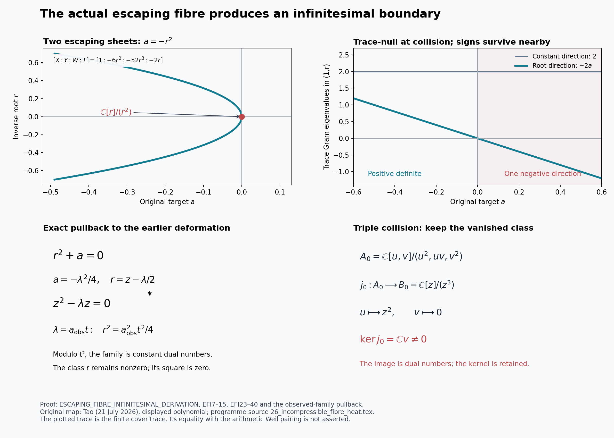
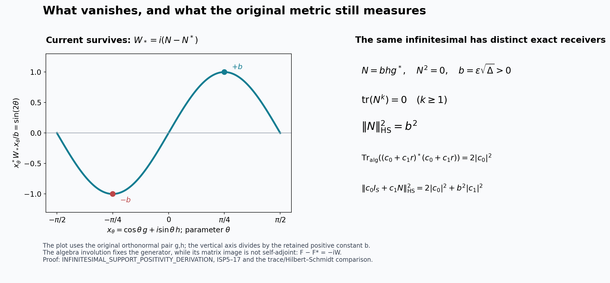
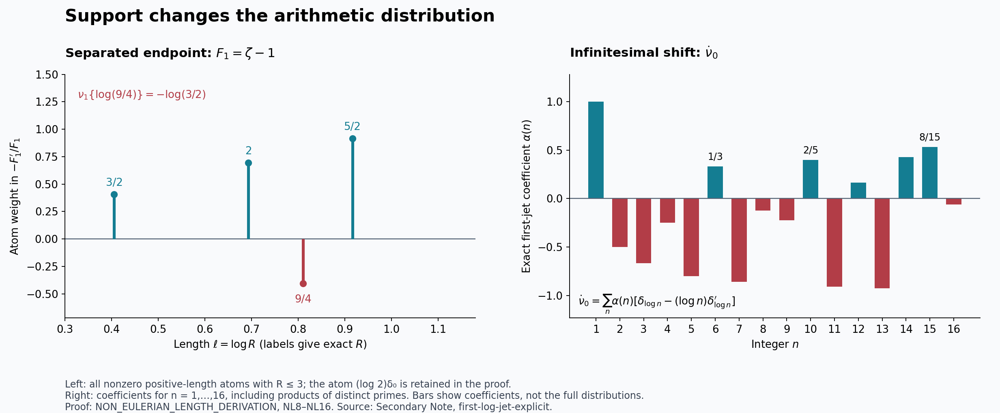
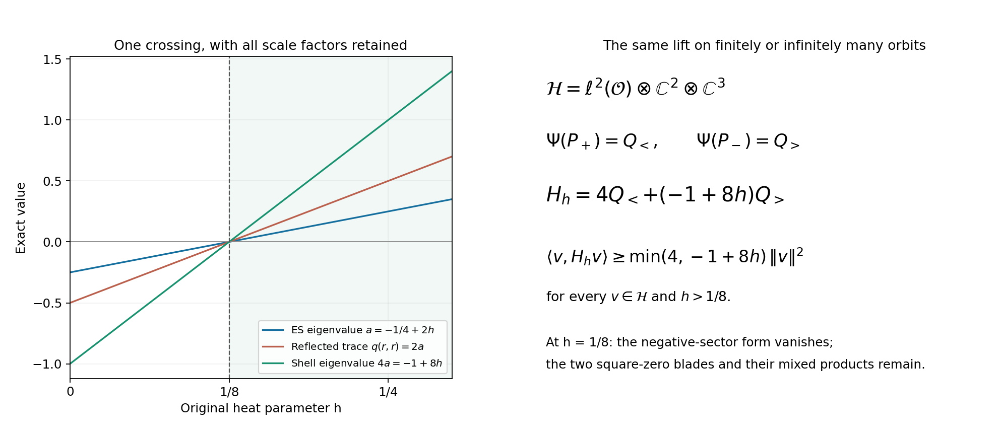

# Split-Zero: escaping fibres and separated-zeta positivity

This research addition studies the supported-zero prime, the infinitesimal boundary of the original escaping inverse map, and the explicit formula for the separated quotient-counting zeta function. It retains both zero elements, all support sectors, the original observation metric, and the difference between algebraic trace and the signed arithmetic current.

This collection also proves the endpoint heat comparison, the exact ES metric and tetrahedral maps, finite and infinite shell operators, and the complete signed eight-state fibre with its omitted infinity point. Its Weil calculations retain the compensating analytic term and both finite involutions; the positive factor is not asserted to prove positivity of the whole Weil form.

Read [the complete proof edition](https://github.com/KokunoYumeto/zeta-function-research-reader/blob/adfbfe74fa49e31cb7aa068cf755fb083be37c32/workbenches/splitzero-tandem/branches/tau-zero-prime-positivity/TAU_ZERO_PRIME_POSITIVITY.pdf), [its LaTeX source](https://github.com/KokunoYumeto/zeta-function-research-reader/blob/adfbfe74fa49e31cb7aa068cf755fb083be37c32/workbenches/splitzero-tandem/branches/tau-zero-prime-positivity/TAU_ZERO_PRIME_POSITIVITY.tex), or the individual proofs below. [Sources and exact reading scope](https://github.com/KokunoYumeto/zeta-function-research-reader/blob/4a4238afc992e77aee83b97d38a1a63d283f540c/workbenches/splitzero-tandem/branches/tau-zero-prime-positivity/SOURCES.md) records the prior programme results and human foundations. [The dated result bulletin](https://github.com/KokunoYumeto/zeta-function-research-reader/blob/173dbc6ed5a03235dbe7654f928f3692107db39b/workbenches/splitzero-tandem/branches/tau-zero-prime-positivity/RESULTS_20260922.md) gives stable IDs and proof locators.

| Complete proof | Principal calculations |
|---|---|
| [Escaping fibre](https://github.com/KokunoYumeto/zeta-function-research-reader/blob/173dbc6ed5a03235dbe7654f928f3692107db39b/workbenches/splitzero-tandem/branches/tau-zero-prime-positivity/ESCAPING_FIBRE_INFINITESIMAL_DERIVATION.md) | EFI1–EFI68: actual inverse map, double and triple collision schemes, trace signatures, supported prime contraction, exact pullback to the observed family and its cotangent differential. |
| [Infinitesimal positivity](https://github.com/KokunoYumeto/zeta-function-research-reader/blob/173dbc6ed5a03235dbe7654f928f3692107db39b/workbenches/splitzero-tandem/branches/tau-zero-prime-positivity/INFINITESIMAL_SUPPORT_POSITIVITY_DERIVATION.md) | ISP1–ISP53: what vanishes and what survives, signed current, full operator derivative, full-support forms, endpoint-jet maps, exact trace versus matrix-norm defect. |
| [Non-Eulerian length distribution](https://github.com/KokunoYumeto/zeta-function-research-reader/blob/173dbc6ed5a03235dbe7654f928f3692107db39b/workbenches/splitzero-tandem/branches/tau-zero-prime-positivity/NON_EULERIAN_LENGTH_DERIVATION.md) | NL1–NL18: exact quotient maps, convergent signed length distribution, negative atom and actual first derivative distribution with mixed-prime coefficients. |
| [Separated zeta explicit formula](https://github.com/KokunoYumeto/zeta-function-research-reader/blob/173dbc6ed5a03235dbe7654f928f3692107db39b/workbenches/splitzero-tandem/branches/tau-zero-prime-positivity/SHIFTED_WEIL_POSITIVITY_DERIVATION.md) | SW1–SW42: continuation, gamma poles, reflection defect, corrected formula, exact negative test for the full shifted divisor, and the retained signed quotient and positive subspace. |
| [Full support reconstruction](https://github.com/KokunoYumeto/zeta-function-research-reader/blob/173dbc6ed5a03235dbe7654f928f3692107db39b/workbenches/splitzero-tandem/branches/tau-zero-prime-positivity/FULL_SUPPORT_RECONSTRUCTION_DERIVATION.md) | FSR1–FSR36: actual base and spectrum, faithful joint branches, mixed kernel after linearization, all support-valued packet signatures. |
| [Finite Weil packet](https://github.com/KokunoYumeto/zeta-function-research-reader/blob/173dbc6ed5a03235dbe7654f928f3692107db39b/workbenches/splitzero-tandem/branches/tau-zero-prime-positivity/WEIL_PACKET_DERIVATION.md) | WP1–WP57: every primary jet, actual observation multiplier, exact radical and diagonal form. |
| [Analytic Weil packet](https://github.com/KokunoYumeto/zeta-function-research-reader/blob/173dbc6ed5a03235dbe7654f928f3692107db39b/workbenches/splitzero-tandem/branches/tau-zero-prime-positivity/WEIL_PACKET_ANALYTIC_DERIVATION.md) | WA1–WA30: complete contour and convergence proof for the actual entire test functions. |
| [Prime-norm comparison](https://github.com/KokunoYumeto/zeta-function-research-reader/blob/173dbc6ed5a03235dbe7654f928f3692107db39b/workbenches/splitzero-tandem/branches/tau-zero-prime-positivity/TAU_WEIL_NORM_RECONSTRUCTION.md) | TN1–TN21: maps between the two quotient counts and the separate prime-weight Euler product, with its compensating archimedean distribution. |

The finite cover trace becomes positive semidefinite at a dual-number collision; the original matrix metric still detects the nilpotent, and its current has both signs. The separated numerical sheet is the Hurwitz family with endpoint zeta minus one. Its full-divisor pairing has an exact negative test using a real zero between minus twenty and minus nineteen. That is not a classical RH counterexample or a result about a critical-strip-only replacement pairing. The papers construct the exact defects and their connecting maps.

## Figures and reproducibility

The corresponding Python sources reproduce these figures. Exact symbolic checks supplement the written proofs; their JSON reports state their scope. Run `python build_tau_positivity.py` with Pandoc and a LaTeX installation to rebuild the complete edition. Run the ten `check_*.py` files to reproduce the finite algebra checks. Python dependencies are SymPy, NumPy and Matplotlib. No numerical zero search is used to establish the shifted-divisor countertest.

## Quarter heat, tetrahedral transport, and the infinite shell

The added proofs identify the original target coordinate −1/4 with the endpoint trace receiver, transport its heat coefficient through the actual ES metric and tetrahedral frame, and construct the corresponding finite and infinite shell operators. The full multiplication maps, mixed blades, ambient kernels and explicit-formula correction are retained.

- [HEB1–HEB36: Complete original inverse curve, compactified infinitesimal, endpoint isometry and the compensating term in the full Weil identity. An admissible bump-derivative test retains its first jet at the collision and proves the compensating change.](https://github.com/KokunoYumeto/zeta-function-research-reader/blob/d5c9d198a8432e3ede468b280162a99c00e3f4f7/workbenches/splitzero-tandem/branches/tau-zero-prime-positivity/HEAT_ENDPOINT_SIGN_BRIDGE.md)
- [PZS1–PZS38: The reflected sign, nilpotent residue obstruction, positive twist and exact observed-family comparison.](https://github.com/KokunoYumeto/zeta-function-research-reader/blob/d5c9d198a8432e3ede468b280162a99c00e3f4f7/workbenches/splitzero-tandem/branches/tau-zero-prime-positivity/PRIME_ZERO_SIGN_DEFORMATION_DERIVATION.md)
- [ESQ1–ESQ68: Exact metric isometry, tetrahedral symmetry, multiplication embedding, collision algebra and original moving spatial metric.](https://github.com/KokunoYumeto/zeta-function-research-reader/blob/d5c9d198a8432e3ede468b280162a99c00e3f4f7/workbenches/splitzero-tandem/branches/tau-zero-prime-positivity/ES_QUARTER_HEAT_TRACE_DERIVATION.md)
- [ESHL1–ESHL64: Spectral and matrix-algebra lifts, every shell sector, sharp infinite-dimensional positivity and retained finite-volume observables.](https://github.com/KokunoYumeto/zeta-function-research-reader/blob/d5c9d198a8432e3ede468b280162a99c00e3f4f7/workbenches/splitzero-tandem/branches/tau-zero-prime-positivity/ES_SHELL_HEAT_LIFT_DERIVATION.md)
- [WEC1–WEC18: The actual four-evaluation correction in Weil’s formula is isometric to the original ES quarter form, with an explicit test section, kernel and involution-preserving map.](https://github.com/KokunoYumeto/zeta-function-research-reader/blob/d5c9d198a8432e3ede468b280162a99c00e3f4f7/workbenches/splitzero-tandem/branches/tau-zero-prime-positivity/WEIL_ES_COMPENSATION_DERIVATION.md)
- [ESH1–ESH72: The original seven-point chart, its omitted infinity state, both full involutions and traces, and the complete eight-state heat collision with its length-four algebra and dual-number quotient.](https://github.com/KokunoYumeto/zeta-function-research-reader/blob/d5c9d198a8432e3ede468b280162a99c00e3f4f7/workbenches/splitzero-tandem/branches/tau-zero-prime-positivity/EIGHT_STATE_HEAT_COMPARISON.md)

The positive lower bound applies to the specified shell operator for h > 1/8. It does not establish positivity of the classical Weil form: HEB28–HEB30 calculate the exact term transferred elsewhere in that form when its endpoint factor moves. The original zeta zeros are not shown to move onto the critical line by this construction.

[The dated results and proof locators](https://github.com/KokunoYumeto/zeta-function-research-reader/blob/d5c9d198a8432e3ede468b280162a99c00e3f4f7/workbenches/splitzero-tandem/branches/tau-zero-prime-positivity/RESULTS_20260923.md) accompany the complete proofs. The six additional check scripts validate their finite identities; the infinite extension has a written proof.

## Supported-zero Weil formula and actual holonomy

The full supported-zero theta now has a proved map from admissible Weil tests, a complete label-resolved trace identity, and a minimal Fourier-closed endpoint extension. The original signed cover has explicit infinity and heat monodromies, including a nonzero residue on the collision algebra. Averaging the native trace over its actual order-192 group gives a positive semidefinite form; the complete calculation retains its nonzero correction in the integrated Weil identity. These statements do not assert RH.

- [SZW1–SZW47: Full supported-zero prime, theta, divisor and fixed-support trace maps](https://github.com/KokunoYumeto/zeta-function-research-reader/blob/adfbfe74fa49e31cb7aa068cf755fb083be37c32/workbenches/splitzero-tandem/branches/tau-zero-prime-positivity/SUPPORTED_ZERO_PRIME_WEIL_DERIVATION.md)
- [EHM1–EHM53: Actual eight-state monodromy and nonzero collision residue](https://github.com/KokunoYumeto/zeta-function-research-reader/blob/adfbfe74fa49e31cb7aa068cf755fb083be37c32/workbenches/splitzero-tandem/branches/tau-zero-prime-positivity/EIGHT_STATE_HOLONOMY_DERIVATION.md)
- [HWA1–HWA38: Positive holonomy average and its exact integrated Weil correction](https://github.com/KokunoYumeto/zeta-function-research-reader/blob/adfbfe74fa49e31cb7aa068cf755fb083be37c32/workbenches/splitzero-tandem/branches/tau-zero-prime-positivity/HOLONOMY_AVERAGING_WEIL_ENDPOINT_DERIVATION.md)

The three earlier complete background derivations are retained in [supporting proofs](https://github.com/KokunoYumeto/zeta-function-research-reader/blob/adfbfe74fa49e31cb7aa068cf755fb083be37c32/workbenches/splitzero-tandem/branches/tau-zero-prime-positivity/supporting_proofs/TAU_PRIME_SPECTRUM_DERIVATION.md). All original coefficients, support labels and quotient kernels remain in the proofs.

## Class-field monodromy and the original collision

The Connes–Consani finite covers now receive an explicit quadratic quotient of the original signed frame cover. Its conductor-23 specialization, prime return maps, and integral model are calculated. The prime-orbit traces retain both orientations and the complete supported-zero trivial sector. The heat collision retains a nonzero filtered residue which the abelian character forgets.

- [PHW1–PHW25: oriented prime traces, inertia, character decomposition and supported endpoints](https://github.com/KokunoYumeto/zeta-function-research-reader/blob/4a4238afc992e77aee83b97d38a1a63d283f540c/workbenches/splitzero-tandem/branches/tau-zero-prime-positivity/PRIME_HOLONOMY_SUPPORTED_WEIL_DERIVATION.md)
- [CBR1–CBR29: discriminant quotient, arithmetic cover and surviving infinitesimal residue](https://github.com/KokunoYumeto/zeta-function-research-reader/blob/4a4238afc992e77aee83b97d38a1a63d283f540c/workbenches/splitzero-tandem/branches/tau-zero-prime-positivity/CLASS_FIELD_SIGNED_HOLONOMY_DERIVATION.md)

## Supported-zero identity and the exact residue-to-trace map

The original singlet algebra has supported zero as its own multiplicative identity and inverse. Its semilattice adjunctions and the actual invertible heat group are now calculated explicitly. The collision infinitesimal acts nontrivially on perfect residue duality; the Jacobian maps this duality to regular trace. On the actual Weil packet that same map identifies the trace radical with cotangent cohomology, retaining all amplitude jets and all supported endpoint corrections. No proof or disproof of RH is asserted.

- [ZH1–ZH26: intrinsic zero identity, heat flow and residue-generated actions](SUPPORTED_ZERO_HEAT_IDENTITY_DERIVATION.md)
- [RD1–RD31b: integral duality, Jacobian trace, cotangent radical and endpoint compensation](COLLISION_RESIDUE_DUALITY_DERIVATION.md)
- [HZ1–HZ29: supporting specialization maps and local persistence of zeros](supporting_proofs/TAU_HEAT_ZERO_LOCALIZATION_DERIVATION.md)

## Collision prism, integral extension, and supported spectrum

The retained collision algebra now carries the bounded prism with divisor 3+epsilon. Its quotient is exactly (Z/9)[T]/T². The original nilradical quotient is the nilradical (3,T) of this ring, and the divided residue detects its square (3T). The cotangent quotient keeps its larger extension and both connecting maps. All unsupported and arithmetic prime pullbacks are calculated explicitly.

- [EC1–EC48: the complete extension group and both connecting maps](NILRADICAL_COTANGENT_EXTENSION_CLASS_DERIVATION.md).
- [DP1–DP43: the bounded prism, its universal property, and both module specializations](DISTINGUISHED_COLLISION_PRISM_DERIVATION.md).
- [SG1–SG23: the supported spectrum, nilradical, Frobenius kernel, and divided derivation](SUPPORTED_PRISM_SPECTRUM_DERIVATION.md).

These results identify integral infinitesimal data; they do not establish positivity of the complete supported Weil form. The full earlier analytic formula and every support coordinate remain in this reader.

## The actual heat family and the complete arithmetic pairing

The original heat family now has a global rational-test trace with all zero multiplicities retained. Its Cauchy kernel evaluates the full supported-zero endpoints, the archimedean term and the prime sum separately. The actual time derivative introduces products of distinct prime contributions. The complete matrix positivity criterion is equivalent to RH; this equivalence does not assert that its matrices have been proved positive.

- [The global heat zero trace and its exact variation](ACTUAL_HEAT_ZERO_DISTRIBUTION_VARIATION.md).
- [The full supported arithmetic Cauchy pairing and first heat derivative](HEAT_CAUCHY_ARITHMETIC_DERIVATION.md).
- [The exact mixed-prime recurrence at every time-derivative order](HEAT_MIXED_PRIME_RECURRENCE.md).
- [The complete Cauchy–Weil positivity criterion and its proof](CAUCHY_WEIL_POSITIVITY_CRITERION.md).

The earlier finite-fibre, infinitesimal, integral-prismatic and supported-spectrum proofs remain in the collection. The new calculation preserves their distinction between a trace that vanishes and a nonzero infinitesimal element.

## Exact reflection index and the complete local-to-global comparison

The [reflection-index proof](CAUCHY_REFLECTION_INDEX_DERIVATION.md), NI1–32, determines the negative index of the full Cauchy form and every coefficient tail from the actual reflected zero pairs. The [finite-jet calculation](FINITE_JET_COMPLEMENT_AND_HEAT_TRUNCATION.md), FJ1–29, proves the exact exterior comparison, calculates the second and third original heat coefficients, and retains all endpoint corrections. Positivity of the full original form remains unresolved. Both new full proofs and the inspected reproducible diagram are included in the cumulative reader. The preceding algebraic, prismatic, supported-spectrum and arithmetic proofs are preserved.
