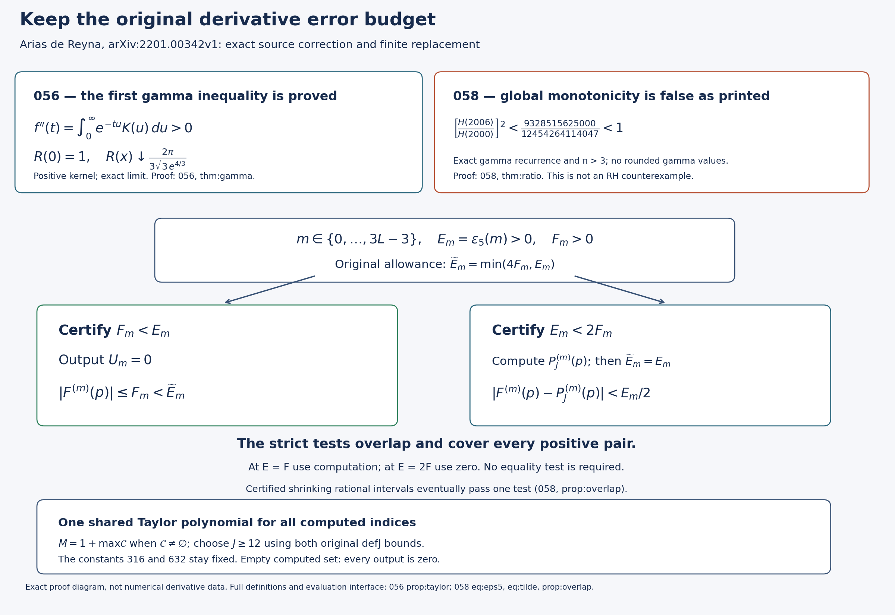

# Gamma bounds and a corrected finite derivative calculation

The Split-Zero programme uses the completed zeta function and its derivatives as arithmetic inputs. Reliable finite calculations need error bounds from the source literature. This edition works through a specific part of Juan Arias de Reyna's Riemann–Siegel computation: the gamma estimate that controls its Taylor cutoff, and the rule selecting which derivatives must be calculated.

The first technical gamma inequality is now proved on its full stated domain, including its sharp constants. The third technical lemma is false as printed: an exact recurrence proves **H(2006) < H(2000)**. A replacement computes the required finite derivative list with the same error budgets, without relying on that monotonicity claim. This is a correction to a computational lemma, not an RH counterexample or certification of an entire implementation.

## Read the complete mathematics

- [All three complete proof bodies in LaTeX](COMPLETE_PROOFS.tex).
- [The gamma inequality and original Taylor cutoff](GAMMA_INEQUALITY.tex), result SZ-20260920-056.
- [The exact counterexample and finite replacement](FINITE_DERIVATIVE_REPAIR.tex), result SZ-20260920-058.
- [Independent derivation, including an explicit rational evaluation bound](INDEPENDENT_DERIVATIVE_CHECK.md) and its [complete LaTeX](INDEPENDENT_DERIVATIVE_CHECK.tex).
- [Machine-readable results, proof locators and programme uses](RESULT_INDEX.json).
- [Human sources and actual reading coverage](SOURCE_USE_LEDGER.json).

The diagram shows proved formulas and branch tests, not sampled derivatives. Its [reproducible source](make_figure.py) and [vector version](ARIAS_DERIVATIVE_REPAIR.svg) are included.

## What is kept unchanged

The original function, point p, derivative set 0 through 3L−3, gamma factors, constants 316 and 632, both Taylor-cutoff inequalities, and the minimum of epsilon5 with 4F_m all remain. The finite selection uses overlapping strict tests so equality does not require an oracle. The full proof gives a rational cutoff search and an explicit polynomial-evaluation error constant. A conservative alternative calculates every derivative.

The human source is Juan Arias de Reyna, *High Precision Computation of Riemann's Zeta Function by the Riemann–Siegel Formula, II*, [original arXiv:2201.00342v1](https://arxiv.org/abs/2201.00342v1), especially `gammainequality`, `fincreasing`, `defeps5`, `defJ` and `PropAprTaylor`. The original author LaTeX was read; it was not edited or executed. The derivative and coefficient estimates attributed there to Part I remain explicitly attributed to their author. Part I has not been independently read in this intake.

## Verification and integration

[Validation details](VALIDATION.md) distinguish complete proofs from exact finite tests. The source edition contains three full cumulative LaTeX successors, with reversible insertion records in [CUMULATIVE_INSERTION.json](CUMULATIVE_INSERTION.json). Earlier editions remain intact. This does not mean that all indexed literature has been read or that the programme's remaining arithmetic estimates have been closed.
