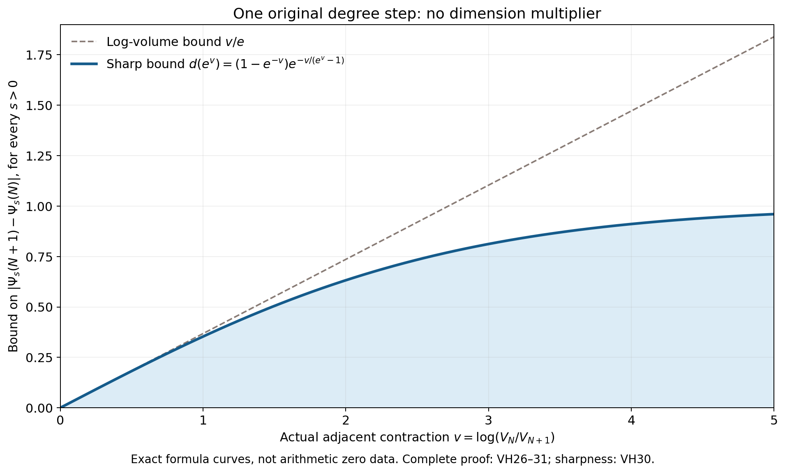
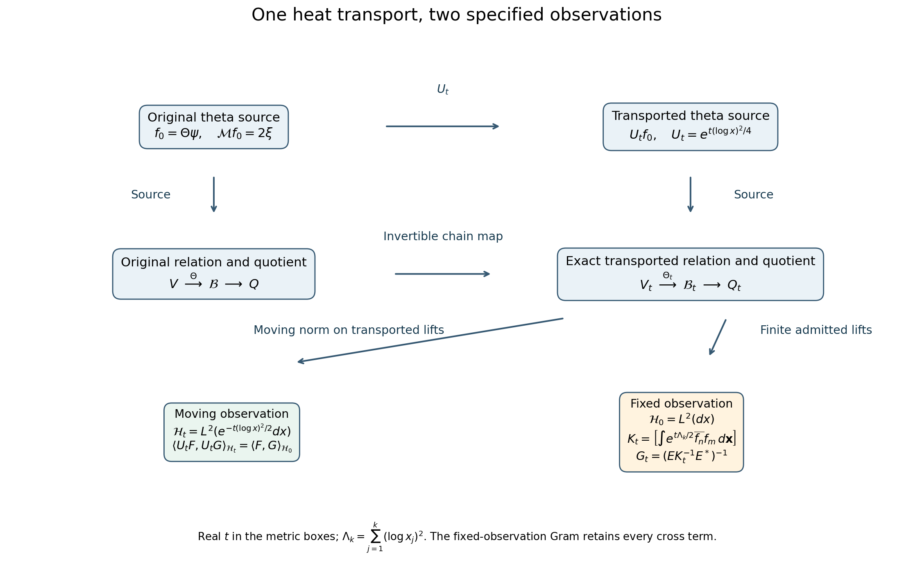

# Heat transport and the original arithmetic volume

The Split-Zero programme starts with the theta source whose Mellin transform is (2\xi). Dividing out a finite set of its zeros, with every order retained, produces the source (F_h). Polynomials in the original Euler operator act on this source. Their classes form a finite quotient, equipped with the least source norm at each admitted polynomial degree.

This edition connects two concrete calculations on those objects.

* The de Bruijn–Newman heat flow is realized by the exact source multiplier (U_tF(x)=e^{t(\log x)^2/4}F(x)). The complete proof follows its Euler operator, Fourier transform, theta relations, quotient, jets, tensor products and observation metrics. It also calculates the motion of a selected zero packet, including collisions and the exterior term.
* The existing Toda source and relation determinants calculate the adjacent quotient-volume ratio. That ratio now bounds the change in the positive heat trace, with no dimension multiplier. The bound is sharp for general finite matrices. The arithmetic companion and its original complex phase are retained.

[All complete proofs in one LaTeX file](COMPLETE_PROOFS.tex) · [Machine-readable results and programme uses](RESULT_INDEX.json) · [Human sources and exact use](HUMAN_SOURCE_USE.json) · [Verification](VALIDATION.md)

The curves show exact bound formulas, not measured arithmetic zeros. The horizontal input is the actual adjacent contraction (v=\log(V_N/V_{N+1})). The sharper blue bound is (d(e^v)=(1-e^{-v})\exp[-v/(e^v-1)]), with value zero at (v=0). The complete argument and both equality examples are VH26–31 in [the degree-volume proof](DEGREE_VOLUME_HEAT_RETURN.tex).

The two observation choices are connected by explicit maps; they are not identified. In the moving weighted Hilbert space the source transport is an isometry. In the original fixed Hilbert space the finite source Gram changes by the displayed weight, and the same quotient map gives (G_t=(E K_t^{-1}E^*)^{-1}). Full arguments: [theta transport](DEBRUIJN_THETA_TRANSPORT.tex) and [its included metric sections](weighted_theta/WEIGHTED_THETA_METRIC_SECTIONS.tex).

The [moment-error proof](NATIVE_HEAT_MOMENT_RETURN.tex) also propagates shared arithmetic moment enclosures into both heat observations. [The metric comparison](ENDPOINT_METRIC_HEAT.tex) retains the original complex cross terms and marked unit. [The independent rank-one proof](RANK_ONE_HEAT_BOUND.tex) gives the full sharp inequality, including zero and repeated eigenvalues.

Three full cumulative LaTeX successors are retained in `cumulative/`; their predecessors can be recovered byte-for-byte by removing the recorded insertion. All proofs, checkers, figure sources and point-of-use citations accompany this edition. No growing-degree decay, RH conclusion or new Zenodo publication is claimed.
