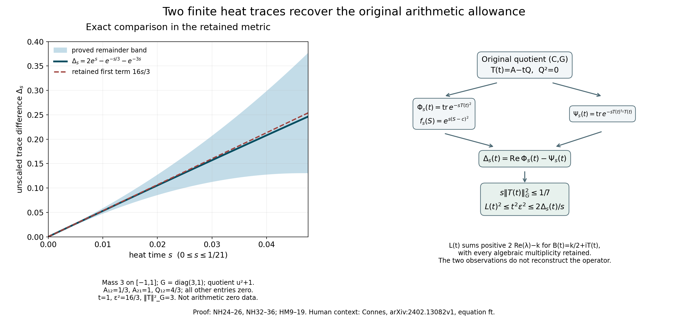
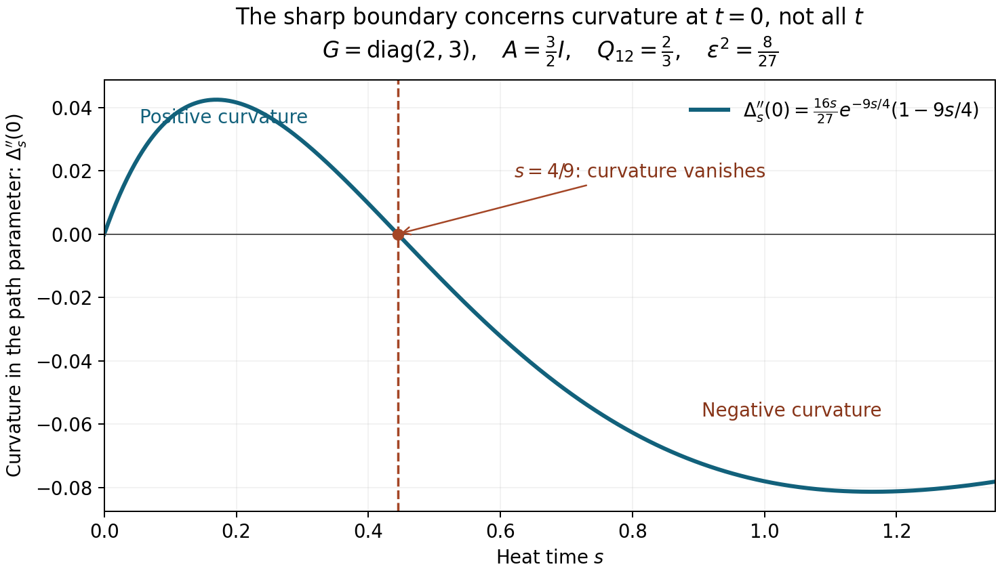

# Exact finite heat comparison

The left panel uses \((3/2)1_{[-1,1]}(u)\,du\), of mass 3, quotient \(u^2+1\), degree \(L=1\), and unchanged metric \(G=\operatorname{diag}(3,1)\). The nonzero entries are \(A_{12}=1/3\), \(A_{21}=1\), \(Q_{12}=4/3\). At outgoing parameter \(t=1\), the holomorphic heat trace is \(2e^s\), the metric heat trace is \(e^{-s/3}+e^{-3s}\), and their exact difference is plotted.

The retained leading term is \(16s/3\), since \(\epsilon^2=16/3\). The band is the proved interval \((16s/3)[1-E(3s),1+E(3s)]\), \(E(x)=(1+2x)e^x-1\), on \(0\le s\le1/21\). It is not statistical. This comparison measure is not a packet of arithmetic zeros.

The right panel retains \(S=c+iu\), \(c=k/2\), and both heat observations. For \(s>0\) and \(s\|T(t)\|_G^2\le1/7\), it gives \(L(t)^2\le t^2\epsilon^2\le2\Delta_s(t)/s\). Here \(L(t)\) sums positive \(2\Re\lambda-k\) over eigenvalues of \(k/2+iT(t)\), with full algebraic multiplicity.

Complete proofs: NH24–26, NH32–36, HM9–19. Human context: Alain Connes, [*Heat Expansion and Zeta*](https://arxiv.org/abs/2402.13082v1), Gaussian equation ft. [Reproducible generator](make_figure.py) and [vector figure](figures/heat_gap.svg) are included. Root inspected the rendered PNG for legibility and mathematical labels.

## The sharp curvature boundary

This second, synthetic example fixes \(G=\operatorname{diag}(2,3)\), \(A=(3/2)I\), \(Q_{12}=2/3\), and every other entry of \(Q\) equal to zero. It therefore has \(Q^2=0\) and \(\epsilon^2=\operatorname{tr}(Q^{\dagger_G}Q)=8/27\). The entire plotted function is

\[
\Delta_s''(0)=\frac{16s}{27}e^{-9s/4}(1-9s/4).
\]

The derivative is in the outgoing parameter \(t\) of \(T(t)=A-tQ\); the horizontal axis is heat time \(s\). The sign changes at \(s=4/9\), exactly \(s\|A\|_G^2=1\). This proves sharpness of the uniform curvature threshold in ID6–ID7, not a sign claim for the full difference at every \(t\). No arithmetic zeros are represented.

Complete proof and source context: [ID6–ID7](INDEPENDENT_HEAT_CURVATURE.tex). Human trace-action context: Connes and van Suijlekom, [*Quadratic Forms, Real Zeros and Echoes of the Spectral Action*](https://arxiv.org/abs/2511.23257v1), section “Spectral action and divided differences”. [Reproducible generator](make_curvature_figure.py) and [vector figure](figures/heat_curvature.svg) retain the exact formula and constants. Root inspected the rendered PNG.
