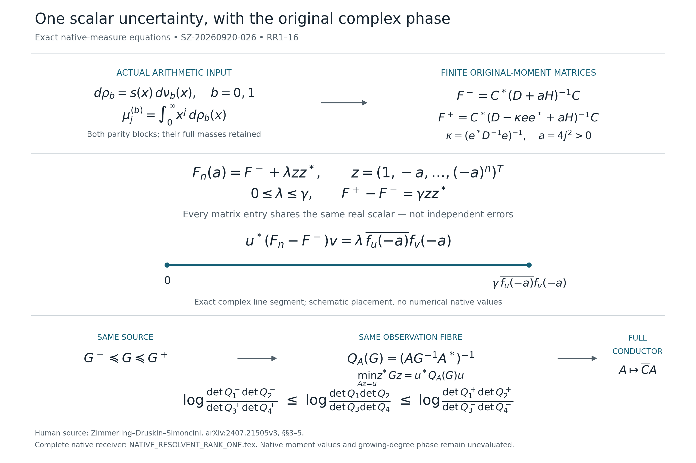

# One scalar uncertainty in the original arithmetic observation

This is a diagram of proved equations, not a plot of zero data or estimated native moments. The line segment's placement is schematic; its endpoints and direction are the exact expressions shown.

The two original parity measures are $d\nu_0(x)=m_k(\sqrt{x})x^{-1/2}dx$ and $d\nu_1=x\,d\nu_0$, with $m_k=w_h^{*k}$ and $w_h(y)=|(2\xi/h)(1/2+iy)|^2/(2\pi)$. The complete quartet divisor $h$ retains every zero order. The positive multiplier is $s(x)=\tanh(\pi\sqrt{x}/2)/\sqrt{x}$; $d\rho_b=s\,d\nu_b$. Neither mass is replaced by one.

For each parity degree $n$, $v_n=(1,x,\ldots,x^n)^T$ and $F_n(a)=\int v_nv_n^*/(x+a)\,d\rho_b$. The matrices $H,D,C$ and last coordinate vector $e$ are exactly those of RR3–4, at the chosen original polynomial degree $r\ge n+1$. The full scalar gap is

$$
\gamma=\frac{\kappa}{p_r(-a)^2\bigl(1-\kappa e^*(D+aH)^{-1}e\bigr)},
$$

where $p_r$ is the monic polynomial for the same measure, not a raw Pollaczek polynomial. RR6–9 prove $F_n-F^-=\lambda zz^*$ and $F^+-F^-=\gamma zz^*$, with $z=v_n(-a)$ and $0\le\lambda\le\gamma$. Thus the entire error in the complex pairing of specified vectors $u,v$ is $\lambda\overline{f_u(-a)}f_v(-a)$, with $f_u(x)=v_n(x)^Tu$. Discarding the phase or assigning independent entrywise errors would discard this exact information.

The bottom row includes both parity blocks, their literal complex-coordinate congruence, the positive reciprocal-resolvent sum and its original native tail. These give the source bounds $G^-\preceq G\preceq G^+$. The original onto observation $A$ is kept fixed. Its metric $Q_A(G)$ is the least norm on the identical fibre $Az=u$. Replacing $A$ with the actual composite $\overline C A$ gives the full conductor bound, including its kernel. At the four original cutoffs $(q-1,q,2q-1,2q)$, determinant monotonicity gives the displayed inequality with the two numerator and two denominator signs retained.

Complete proof: [NATIVE_RESOLVENT_RANK_ONE.tex](NATIVE_RESOLVENT_RANK_ONE.tex), RR1–16. The companion [finite-moment proof](NATIVE_RESOLVENT_MOMENT_ENCLOSURES.tex) gives fixed-pole convergence from the actual native tail, explicit matrix error certificates and the untilted-moment route. Native moments must still be evaluated or certified; neither result asserts a growing-degree projected-current sign.

Human source: Jörn Zimmerling, Vladimir Druskin and Valeria Simoncini, *Monotonicity, bounds and acceleration of Block Gauss and Gauss–Radau quadrature for computing $B^T\phi(A)B$*, original author LaTeX of [arXiv:2407.21505v3](https://arxiv.org/abs/2407.21505v3), §§3–5. The exact transport into these unbounded arithmetic measures is proved in RR1–16, including the polynomial block's actual dimension. The source's nondeflation assumptions or numerical complex-shift observations are not silently imported. The parity multiplier retains the human source attribution to Aptekarev, López Lagomasino and Martínez-Finkelshtein, [arXiv:1410.1261v1](https://arxiv.org/abs/1410.1261v1), as explained in result019.
