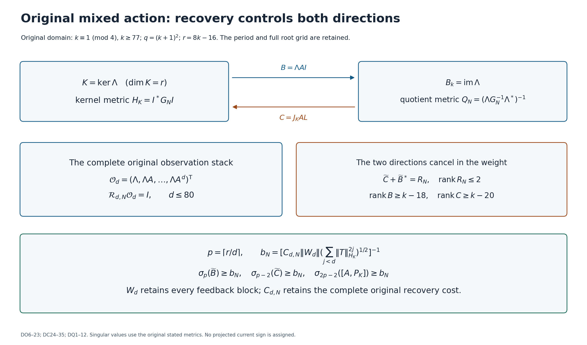
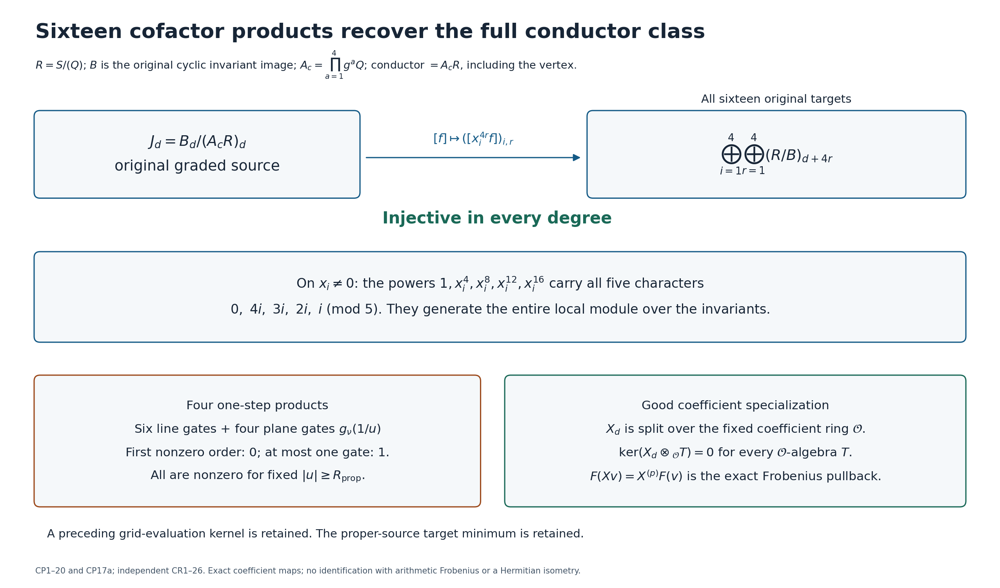
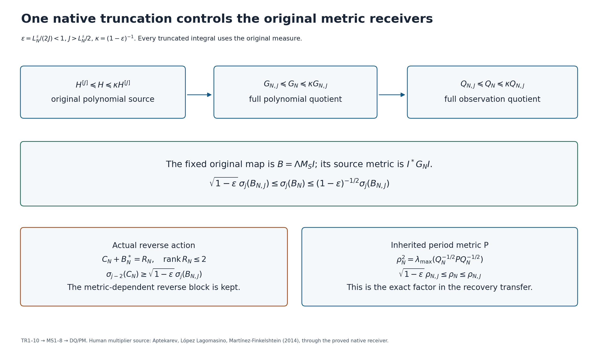
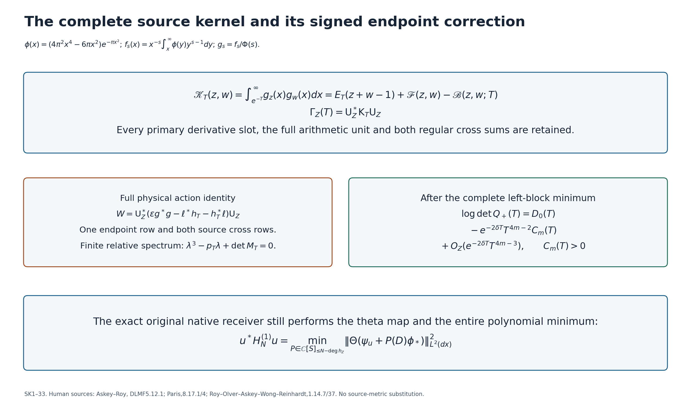

# Original mixed action, conductor recovery, and the evaluated source kernel

These four figures display exact maps and proved formulas. They contain no numerical samples, hypothetical zero locations, or replacement metrics. The PNG files are convenient for reading; the SVG files retain vector text. The full definitions and proofs are in the accompanying LaTeX sources. Each figure has its own notation, specified below.

## 1. Original mixed action: recovery controls both directions

The domain is the original simple-quartet period locus, with $k\equiv1\pmod4$, $k\ge77$, $q=(k+1)^2$, and $r=8k-16$. The polynomial quotient is $E_k$, its attained metric is $G_N$, multiplication is $A=M_S$, and the original observation is the onto map $\Lambda:E_k\to B_k=\operatorname{im}\Lambda$. An unchanged frame $I:\mathbb C^r\to K=\ker\Lambda$ gives $H_K=I^*G_NI$. The actual minimum-norm lift and kernel coordinate map are

$$
L=G_N^{-1}\Lambda^*Q_N,\qquad Q_N=(\Lambda G_N^{-1}\Lambda^*)^{-1},\qquad
J_K=H_K^{-1}I^*G_N.
$$

The arrows in the top row are $B=\Lambda AI$ and $C=J_KAL$, in the displayed kernel frame. The other two blocks are $T=J_KAI$ and $D=\Lambda AL$. The left middle box states that no more than 81 consecutive observations recover every original class, with a fully specified inverse. The right box keeps the exact cancellation between the two mixed-action directions. Its rank-two remainder bounds their sum; the two directions separately have ranks at least $k-18$ and $k-20$.

The bottom box supplies sizes as well as ranks. Tildes mean the isometric coordinate presentations for the original metrics, for example $\widetilde B=Q_N^{1/2}BH_K^{-1/2}$. Singular values are in decreasing order. The integer $d\le80$ is the actual recovery depth, $C_{d,N}$ is the complete inverse bound, and $W_d$ is the exact lower-triangular feedback map defined by

$$
y_{n+1}=BT^nx+Dy_n+\sum_{a=0}^{n-1}BT^{n-1-a}Cy_a,\qquad y_0=0.
$$

The commutator uses the actual orthogonal projection $P_K=IJ_K$. All singular values shown therefore refer to the original multiplication and observation, with their full attained metrics. The bounds do not identify a specified eigenclass with a singular vector or assign its projected current sign.

**Complete proofs:** `CONSTANT_DEPTH_ORIGINAL_OBSERVATION.tex`, DO1–23; `DIFFERENTIATED_CONDUCTOR_REDERIVATION.tex`, DC24–35; `QUANTITATIVE_MIXED_ACTION_RETURN.tex`, DQ1–12. The first two are the checked original-observation and differentiated-conductor derivations; DQ proves the quantitative receiving statement in full.

## 2. Sixteen cofactor products recover the full conductor class

Here $S=\mathbb C[x_1,x_2,x_3,x_4]$, $g x_i=\zeta^i x_i$, and $\zeta$ is the original primitive fifth root. The original invertible period matrix $H$ gives $Q=Q_0(H^{-1}x)$, where $Q_0(t)=t_1t_4-t_2t_3$. On the five-orbit domain the quadrics $g^aQ$ are pairwise nonassociate. Put $R=S/(Q)$, $B=\operatorname{im}(S^{\langle g\rangle}\to R)$, and $A_c=\prod_{a=1}^4g^aQ$. The conductor is exactly $A_cR$, including at the vertex.

The top arrow tests a class using all sixteen products $x_i^{4r}f$, $1\le i,r\le4$. If every target class vanishes, the five displayed powers span all character components on each chart $x_i\ne0$. Hence $fR\subset B$ on those charts, and the proved conductor calculation, including all factor multiplicities and the vertex, gives $f\in A_cR$. Thus this map is injective in every degree.

The lower left box concerns the four original one-step products. The actual period family supplies ten entire coefficient tests: six coordinate-line tests and four coordinate-plane tests. Their computed first nonzero coefficients show that, for each fixed actual quartet, a finite radius $R_{\rm prop}$ excludes all their zeros in the original allowed large-period range. The possible exceptional line test has nonzero first derivative; all the other tests have nonzero constant term. The full original phase and coefficient matrix are retained in this assertion. It does not count the finite exceptional periods or identify this graded quotient with a preceding grid-evaluation space.

The lower right box uses the exact coefficient ring $\mathcal O$ constructed in CP16–17. After the displayed finite localizations, the actual graded injection $X_d$ is split and survives base change to every $\mathcal O$-algebra, including nonreduced algebras. In characteristic $p\ne5$, $F(Xv)=X^{(p)}F(v)$ is its coefficientwise Frobenius pullback. This is the stated morphism; an identification with the programme's arithmetic action requires further work. CP20 also keeps the independent target-$J$ metric minimum when the proper-source kernel vanishes.

**Complete proofs:** `COFACTOR_PERIOD_AND_SPECIALIZATION.tex`, CP1–20 and CP17a; independent `COFACTOR_PERIOD_SPECIALIZATION_REDERIVATION.tex`, CR1–26. The original coefficient family and phase are the PCL provider cited and used there; NC supplies the preceding original conductor and metric receivers.

## 3. One native truncation controls the original metric receivers

Retain the full original polynomial cutoff $N\ge q-1$. The native-resolvent theorem TR1–4 proves a source bracket at the integer $J>L_N^\sharp/2$: set $\epsilon=L_N^\sharp/(2J)<1$ and $\kappa=(1-\epsilon)^{-1}$. The top row takes this bracket through the *same two affine-fibre minima*: first the full original root-polynomial quotient and then the original observation quotient. In this figure, $G_{N,J},Q_{N,J},B_{N,J},\rho_{N,J}$ denote the quantities written $\underline G,\underline Q,\underline B,\underline\rho$ in MS1–8. They retain all finite native integrals.

The middle box uses the fixed original map $B=\Lambda M_SI$, with source metric $I^*G_NI$ and target metric $Q_N$. Taking the same min–max over subspaces in the two metric brackets bounds **every** singular value by the displayed factors. Zero singular values remain zero because the fixed map is unchanged.

The original reverse block depends on the actual metric. The lower left box obtains its bound directly from its exact cancellation with $B_N^*$, losing at most two singular directions. Its range is $3\le j\le\min(\dim K,\dim B_k)$. No reverse block built from the truncated metric replaces the original reverse block.

The lower right box retains the inherited period Gram $P=\jmath^*\jmath$. The quotient-to-period norm conversion is exactly $\rho_N^2=\sup_{b\ne0}(b^*Pb)/(b^*Q_Nb)$; the bracket therefore encloses the extra factor needed by PM19. MS8 gives the corresponding norm enclosure for any fixed exact reconstruction map. These statements propagate a native integral certificate when obtained; they do not themselves supply its numerical values or the phases of the actual observed class.

**Complete proofs:** `NATIVE_METRIC_SINGULAR_VALUE_BRACKETS.tex`, MS1–8; provider `NATIVE_TRUNCATION_CONDUCTOR_RETURN.tex`, TR1–10; `ORIGINAL_PERIOD_METRIC_AND_FACTORIAL_RETURN.tex`, PM1–20. The human multiplier source credited in the TR companion is A. I. Aptekarev, G. López Lagomasino and A. Martínez-Finkelshtein, *Strong asymptotics for the Pollaczek multiple orthogonal polynomials ensembles*, [arXiv:1410.1261v1](https://arxiv.org/abs/1410.1261v1). The programme companion proves the transport to the actual measure. This figure uses that proved transport and makes no claim of a new reading of the full author paper.

## 4. The complete source kernel and its signed endpoint correction

The original scalar source is the displayed Gaussian polynomial, with Mellin transform $\Phi(s)=\tfrac12s(s-1)\pi^{-s/2}\Gamma(s/2)$, on $0<\Re s<1$. In this figure $\epsilon=e^{-T}$, $T\ge0$. The top box evaluates its complete cutoff pairing. Here $E_T(a)=(e^{aT}-1)/a$ for $a\ne0$ and $E_T(0)=T$; $\mathscr F$ is the removable divided difference SK5–6; $\mathscr B$ is the full absolutely convergent series SK8, with both negative cross sums and the positive double sum. SK10 gives the truncation error, including its parameter-derivative versions. The matrix $\mathsf K_T$ takes every divided derivative at $z=\bar\rho,w=\sigma$; $\mathsf U_Z$ is the full original arithmetic principal-part map SK11. Consequently the displayed Gram retains all multiplicities and unit factors.

The left middle box keeps all three physical rows in the action identity. The symbol $W$ is $A_Z^*\Gamma_Z+\Gamma_ZA_Z-\Gamma_Z$; $g=g(\epsilon)$, and $\ell,h_T$ are precisely the rows in SK18. For the full quartet of multiplicity $m$, put

$$
Y_T=[\sqrt\epsilon\,g(\epsilon)^*,\ell^*,h_T^*],\qquad
J_3=\begin{pmatrix}1&0&0\\0&0&-1\\0&-1&0\end{pmatrix},\qquad
M_T=Y_T^*\mathsf K_T^{-1}Y_T,\quad p_T=\tfrac12\operatorname{Tr}((J_3M_T)^2).
$$

The exact finite relative characteristic polynomial is

$$
\lambda^{4m-3}\bigl(\lambda^3-p_T\lambda+\det M_T\bigr).
$$

The right middle box retains the full left-block minimum for the original quartet $1/2\pm\delta\pm i\gamma$, $0<\delta<1/2$, $\gamma>0$. The first correction has a strictly negative coefficient. In full notation,

$$
C_m(T)=\frac{\operatorname{Tr}[H_+D_\gamma(T)H_-D_\gamma(T)^*]}{((2m-1)!)^2}>0,
$$

where $H_+=J_+^*G_+^{-1}J_+$, $H_-=J_-^*L_-^{-1}J_-$, and $D_\gamma=\operatorname{diag}(e^{i\gamma T},e^{-i\gamma T})$. The entire inverses are taken before extracting the highest two slots. The unchanged leading term is

$$
D_0(T)=4m\delta T-4m\log\!\left(2\left|\frac{\zeta^{(m)}(\rho)}{m!}\right|\right)
+2m^2\log\frac{\gamma}{2\delta\sqrt{\delta^2+\gamma^2}}.
$$

The bottom box is the exact receiver into the original native one-factor quotient: it performs the theta map and minimizes over the entire allowed polynomial space. Thus the evaluated source Gram feeds the programme through a specified map, while that additional native minimum remains to be evaluated.

**Complete proof:** `EVALUATED_SOURCE_KERNEL.tex`, SK1–33, in particular SK3–10, SK13, SK19–22, SK28, SK30–33. **Human formula sources used in the proof:** Richard A. Askey and Ranjan Roy, [DLMF 5.12.1](https://dlmf.nist.gov/5.12.E1); Richard B. Paris, [DLMF 8.17.1](https://dlmf.nist.gov/8.17.E1) and [8.17.4](https://dlmf.nist.gov/8.17.E4); Ranjan Roy, Frank W. J. Olver, Richard A. Askey, Roderick Wong and William P. Reinhardt, [DLMF 1.14.7](https://dlmf.nist.gov/1.14.E7) and [1.14.37](https://dlmf.nist.gov/1.14.E37). Original formula TeX and exact source hashes accompany the proof. The new receiving calculations and their assumptions are proved there; the source identities are not credited as new programme discoveries.
