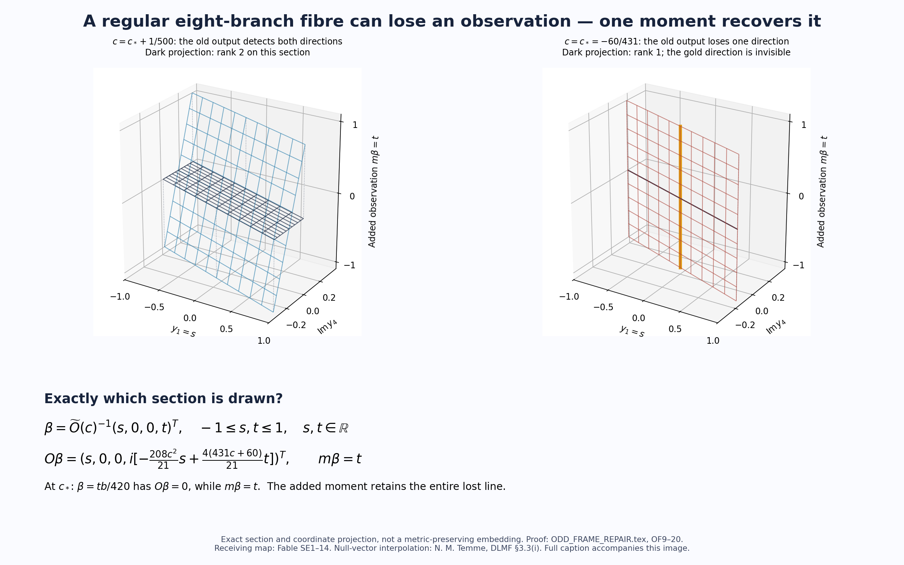

# A lost receiving direction and its one-moment recovery

The drawing is an exact two-real-dimensional section of the four-complex-dimensional odd receiving map. It uses the original family $h_c(r)=r^4+r^3+cr$, the original marked roots and square-root phases, and the repaired frame $\widetilde O(c)$ of **ODD_FRAME_REPAIR.tex, OF10–11**. The displayed coordinates are the original outputs $y_1$, $\operatorname{Im}y_4$ and the added cubic observation $m\beta$. Set

$$
\beta=\widetilde O(c)^{-1}(s,0,0,t)^T,\qquad s,t\in[-1,1]\subset\mathbb R.
$$

The plotted plane is exactly

$$
(y_1,\operatorname{Im}y_4,m\beta)
=\left(s,-\frac{208c^2}{21}s+\frac{4(431c+60)}{21}t,t\right).
$$

The other original outputs are identically $y_2=y_3=0$, and $y_4$ is purely imaginary on this section. The dark projection forgets the added moment by sending $(y_1,\operatorname{Im}y_4,m\beta)$ to $(y_1,\operatorname{Im}y_4,0)$.

On the left, $c=-60/431+1/500$ and this projection has rank two on the section. On the right, $c=c_*=-60/431$ and its rank is one. The gold line is $s=0$, or $\beta=tb/420$: its entire original output vanishes, while its added moment is exactly $t$. The repaired observation therefore retains this lost direction. OF9–17 prove the null vector, the nonzero cubic moment, the inverse and the actual augmented Gram. OF18–20 recover all original even contributions in the complete eight-coordinate object.

Both targets have four simple roots. The figure depicts a receiving-frame singularity, not a collision of the underlying roots. It is a stated coordinate section and projection, not an isometric embedding of the original Gamma metric. The complete metric retains both $G_Y$ and $G$, and the extra-channel weight $\eta$ remains explicit in OF20. The wireframe is generated from the displayed exact linear formulas; it is not numerical evidence for a theorem about zeta zeros.

Source and proof attribution: the original receiving columns are **FABLE_TO_ORIGINAL_CONDUCTOR.tex, SE1–14**; the received web-session calculation supplied the new divisor and proposed repair, with its exact source hash in the proof bibliography. The null-vector calculation uses classical Lagrange interpolation, explicitly proved in OF8 and cited to **N. M. Temme, NIST DLMF §3.3(i), equations 3.3.1–3.3.3_1**, whose original formula TeX was read: [Lagrange interpolation](https://dlmf.nist.gov/3.3.i).

Reproduction: `make_frame_illustration.py` produces the vector SVG and PNG directly. A first rendering had a caption overlapping the axes; the labels and ticks were revised and the rendered result inspected. No separate tetrahedral construction or expensive rendering job was introduced.
