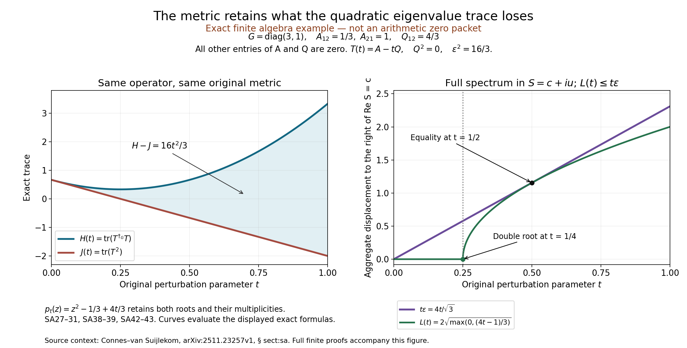

# What the original metric adds to the trace calculation

This is the exact mass-three uniform comparison measure on \([-1,1]\), with quotient polynomial \(u^2+1\), at the first admitted polynomial degree. It is not an arithmetic zero packet. Its fixed quotient metric is \(G=\operatorname{diag}(3,1)\), with \(A=\begin{pmatrix}0&1/3\\1&0\end{pmatrix}\), \(Q=\begin{pmatrix}0&4/3\\0&0\end{pmatrix}\), and \(T(t)=A-tQ\).

Left: \(J(t)=\operatorname{tr}(T(t)^2)=2/3-8t/3\), while \(H(t)=\operatorname{tr}(T(t)^{\dagger_G}T(t))=J(t)+16t^2/3\). The shaded difference retains the metric curvature \(\epsilon^2=16/3\), despite \(Q^2=0\).

Right: the complete polynomial is \(p_t(z)=z^2-1/3+4t/3\). In the original coordinate \(S=c+iu\), the aggregate rightward spectral displacement is zero until \(t=1/4\), then \(L(t)=2\sqrt{(4t-1)/3}\). Both roots and their algebraic multiplicities are retained. The bound \(L(t)\leq4t/\sqrt3=t\epsilon\) is an equality at \(t=1/2\). The marked double root at \(t=1/4\) is retained, not removed from the determinant.

Complete proofs: [NATIVE_SPECTRAL_ACTION.tex](NATIVE_SPECTRAL_ACTION.tex), SA27–31, SA38–39 and SA42–43. Contextual human source: Alain Connes and Walter D. van Suijlekom, [arXiv:2511.23257v1](https://arxiv.org/abs/2511.23257v1), Section sect:sa; the exact finite receiving formulas and cyclic coefficient are proved in this edition. The plotted curves evaluate the displayed exact formulas; they are not interval-certified arithmetic samples.

Reproduce with [make_figure.py](make_figure.py); exact coordinates and formulas are in [FORMULAS.json](figures/FORMULAS.json). The [SVG](figures/metric_trace.svg) preserves selectable labels.
