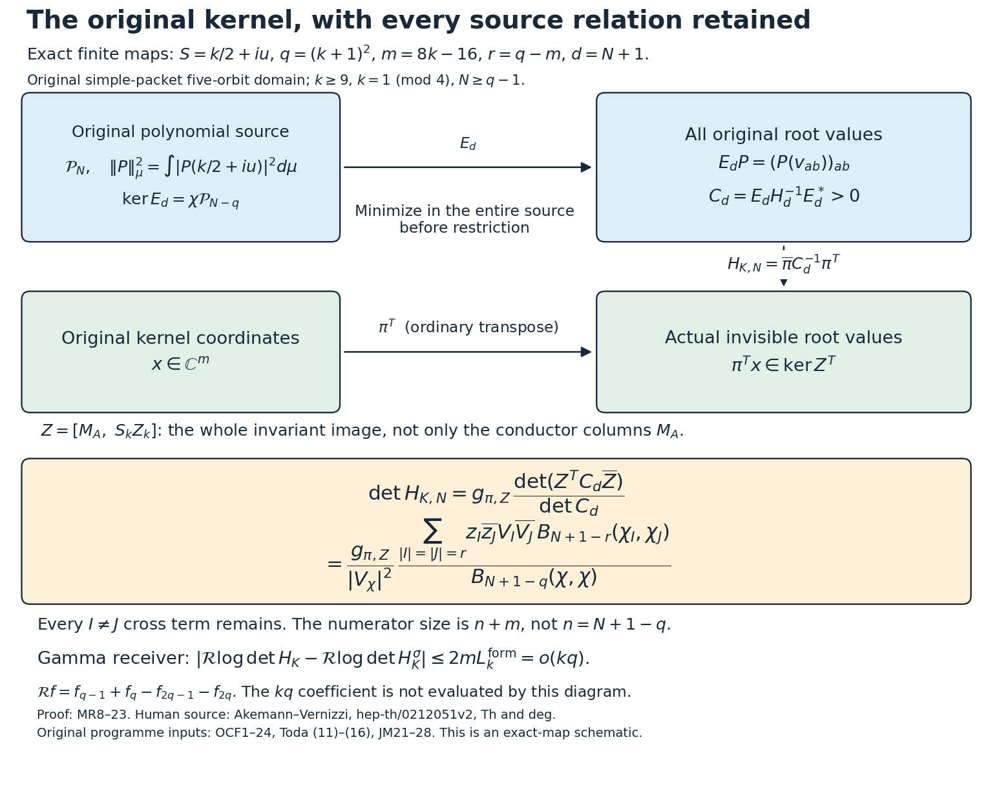

# The original observation kernel as a mixed-relation determinant

The Split-Zero programme represents finite zero-divisor classes of the completed zeta function by polynomials in an arithmetic theta-source Hilbert space. Its observation map leaves a kernel whose metric is obtained by minimizing over **all** polynomial representatives first. This calculation expresses the determinant of that actual kernel metric without changing the observation, the arithmetic measure, or the relation space.

[Read the complete proofs](COMPLETE_PROOFS.pdf) · [Full LaTeX](COMPLETE_PROOFS.tex) · [Exact objects, proof locators and programme use](RESULT_INDEX.json) · [Human sources and reading coverage](SOURCE_USE_LEDGER.json) · [Verification](VALIDATION.md).

## What the calculation supplies

Result SZ-20260920-062 applies Akemann and Vernizzi's finite characteristic-polynomial determinant theorem to the programme's original arithmetic convolution measure. It retains mixed relations, repeated-root derivatives, factorials, complex conjugation, and the source's full mass. The older diagonal source/relation volume quotient is credited to the existing Toda continuation; it is not presented as a new theorem.

For the original simple-quartet observation, the calculation keeps the entire invariant image, including the directions outside the conductor ideal. Its complementary determinant is a sum of **all** complex mixed relation determinants. A positive integral represents that whole sum; discarding the off-diagonal terms would give a different answer.

The earlier Gamma comparison changes the four-cutoff logarithmic return by less than order kq. The new formula identifies the exact finite Gamma matrix whose large-degree coefficient remains to be calculated. It does not evaluate that coefficient or prove an RH conclusion.

## Read and reproduce

- [Original-kernel proof, MR1–23](ORIGINAL_KERNEL_MIXED_DETERMINANT.tex).
- [Complete mixed/confluent finite proof](MIXED_CONFLUENT_PROOF.tex), including the canonical minimum section and modified-polynomial norms.
- [Complete independent review](INDEPENDENT_RECEIVER_REVIEW.tex), including a direct generating-function derivation of the Gamma norms.
- [Original coefficient frame](providers/ORIGINAL_CONDUCTOR_STRIP_FRAME.tex), [Gamma reduction](providers/KERNEL_GAMMA_INDEPENDENT.tex), and [one-factor coercivity proof](providers/COERCIVITY_INDEPENDENT.tex).
- [Original Toda source](providers/TODA_VOLUME_CONTROL.tex) and [joint-minimum source](providers/JOINT_MINIMUM_RECEIVERS.tex), retained as complete predecessor proofs, not newly claimed results.
- [Checks and their exact scope](checks/ROOT_REPLAY.json). Run the three Python checkers in `checks/source/`; they require SymPy. The `replay.py` runner repeats ordinary and optimized runs with deliberate-error controls.
- [Complete cumulative successors](CUMULATIVE_INSERTION.json), each retaining its predecessor verbatim around one reversible insertion.

This schematic records the actual maps, matrix sizes and degree shifts in MR1–23. It is not an arithmetic data plot. [Reproducible figure source](make_figure.py).

The primary human source is Gernot Akemann and Graziano Vernizzi, *Characteristic Polynomials of Complex Random Matrix Models*, Nuclear Physics B 660 (2003), 532–556, [original arXiv source version](https://arxiv.org/abs/hep-th/0212051v2), [DOI](https://doi.org/10.1016/S0550-3213(03)00221-9). The original author LaTeX was read completely. The source-use record separates that reading from the programme's previous derivations and from the classical Gamma and orthogonal-polynomial formulas.
