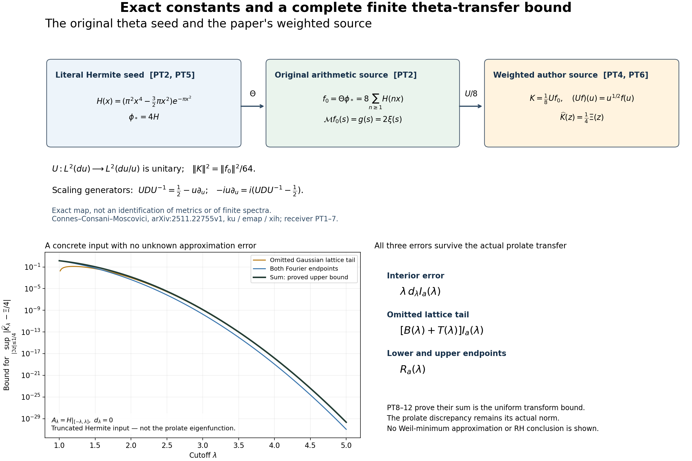

# Original theta sources, finite-prime transfers and full-Weil certificates

The Split-Zero programme starts with the Gaussian theta source, its quotient by the original theta relations, and the arithmetic norm of finite polynomial classes. This edition applies human literature directly to those objects. It contains the entire proofs—not just the formulas or a bibliography.

[Seven complete LaTeX proofs](COMPLETE_PROOFS.tex) · [Machine-readable results and programme uses](RESULT_INDEX.json) · [Human-source identities and reading coverage](HUMAN_SOURCE_USE.json) · [Verification](VALIDATION.md)

The full-Weil calculation expresses its moving-pole coefficients through the complete function \(\xi\), including all zeros. It proves a positive lower bound on the original cubic Gaussian-source space and certifies positive matrices through degree eight at five specified poles. The [complete two-proof edition and reproducible certificates](weil/README.md) retain the tail estimates and human sources.

The [native prolate calculation](NATIVE_PROLATE_LIE_DEFECT.tex) keeps the actual arithmetic measure. Its recurrence coefficients cannot satisfy the proposed Lie relations identically for any real centre. The proof then constructs the precise finite selfadjoint operator and identifies the boundary correction; it does not stop at the failure of an identification.

The [finite-prime source transfer](SEMILOCAL_DUAL_THETA_TRANSFER.tex) and [full quotient-current calculation](SEMILOCAL_MIXED_QUOTIENT_CURRENTS.tex) give the source maps, original physical units, all multiplicity jets and complex pairings. A degree-raising relation contributes a calculated term to the quotient action. That term remains in the current; separate minimization produces its own explicitly computed correction.

The [literal theta-source comparison](THETA_PROLATE_SOURCE_RECEIVER.tex) evaluates the exact factors between the Hermite seed used by Connes–Consani–Moscovici and the programme's source. It bounds all three truncation contributions, including the omitted Gaussian lattice tail. The [independent derivation](THETA_PROLATE_INDEPENDENT_CHECK.tex) calculates every repeated-zero quotient jet: multiplicity \(m\) requires numerator derivatives through order \(2m-1\).

[Full mathematical caption, proof locators and human citations](theta_prolate_figures/FIGURE_CAPTION.md). The plotted bound uses the explicitly specified truncated Hermite input; it is not a minimum Weil eigenvector.

Three [complete cumulative source successors](cumulative/) retain all earlier text and append these full proofs. [Insertion identities](CUMULATIVE_INSERTION.json) show how to recover each predecessor exactly. The [earlier complete proof providers](providers/) remain available.

These results do not prove or disprove RH. The native growing-degree estimate, spectral convergence of minimum Weil eigenvectors, and the broad literature-reading programme remain unfinished. This GitHub source edition does not claim a new Zenodo or Overleaf edition.
