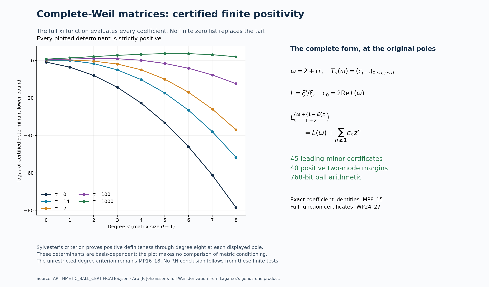

# Complete-Weil tests on the original source and movable-pole families

**SZ-20260920-030.** This continuation checks the supplied full-Weil calculation, completes its analytic tail arguments, and evaluates additional full-function certificates. It retains the original conductor coordinate, the actual multiplicities of every zeta zero, all prime powers, Gamma factors and complex phases.

For the original Gaussian source

$$
\phi_*(x)=(4\pi^2x^4-6\pi x^2)e^{-\pi x^2},\qquad
\Phi(s)=\tfrac12s(s-1)\pi^{-s/2}\Gamma(s/2),
$$

the complete proof establishes

$$
\mathcal W(\Phi P,\Phi P)\ge e^{-300}\|p\|_2^2
\quad\text{for every }P(s)=\sum_{j=0}^3p_js^j.
$$

This includes the unknown high-zero tail. Four certified critical-line zeros give the finite positive Gram; Platt–Trudgian's finite-height theorem and the explicit zero-counting bound of Hasanalizade–Shen–Wong control the remainder. The original conductor receives this form by the exact map (S'=s+c_*-1/2), with matrix entries (C_{ij}=\binom ji(c_*-1/2)^{j-i}), and pullback (\Psi^*C^*\mathsf W_\Phi C\Psi). All definitions, constants and proofs are in [WP1–16](WEIL_POSITIVITY_AND_ARITHMETIC_CERTIFICATES.tex).

For each fixed pole (\Re\omega>1), define

$$
\varphi_j^\omega(s)=\frac{\sqrt{2\Re\omega-1}}{\omega-s}
\left(\frac{s+\bar\omega-1}{\omega-s}\right)^j.
$$

Their complete-Weil Gram is (T_d(\omega)=(c_{j-i})). The proof evaluates every coefficient by the full logarithmic derivative (L=\xi'/\xi), proves (c_0>0) unconditionally, and proves the exact fixed-pole equivalence

$$
\mathrm{RH}\quad\Longleftrightarrow\quad
|c_n(\omega)|\le c_0(\omega)\text{ for every }n\ge1.
$$

It also proves that the Taylor radius equals the smallest modulus of an off-line zero's actual Möbius image, when such a zero exists, and gives the exact corresponding coefficient-growth rate. The prime-power and Gamma expansions include explicit finite-tail bounds and a certificate using the computed complex phase. Complete derivations: [MP1–38](MOVABLE_POLE_WEIL_DERIVATION.tex). The classical genus-one product is credited to the original treatment in Lagarias; no novelty claim is made for the broad Li/Weil approach.

The new computation proves (T_d(2+i\tau)\succ0) for (0\le d\le8), at (\tau=0,14,21,100,1000), through **45 strictly positive Arb determinant enclosures**. These use the full xi function, not a finite list of zeros. A separate analytic proof gives (T_3(2)\succeq [2\cdot200^4 30^{12}]^{-1}I). All errors and certificates appear in [WP17–27](WEIL_POSITIVITY_AND_ARITHMETIC_CERTIFICATES.tex), [the full matrix receipt](ARITHMETIC_BALL_CERTIFICATES.json) and [the four-zero receipt](FOUR_CRITICAL_ZERO_CERTIFICATES.json).

The unrestricted degree criterion remains unevaluated. These finite positive results establish neither RH nor a counterexample. They identify the complete positive spaces already controlled and supply an exact arithmetic route for further original-family calculations.

## Corrections and receiving work

- The numerical negative-vector test requires a nonzero computed off-diagonal coefficient and a real diagonal approximation (or its real part). MP31–33 states and proves the corrected certificate.
- DLMF 25.2.12 is a valid genus-one zeta product, with source attribution to Titchmarsh. An earlier integration warning about this locator was wrong and is withdrawn. The original formula TeX has now been read directly; its exact completed-xi constants are displayed in MP6a. The proof also retains the separately read Lagarias Lemmas 2.1 and 4.1.
- A draft translation in the present integration was corrected before publication to the original (S'=s+c_*-1/2). The incoming translation was correct.
- The incoming zeta multiplication determinant needs the original Gamma completion factors: it is generally not ( |\zeta(\rho)|^4 ). The separate Fable receiver **SZ-20260920-029** proves that correction and the original eight-state/native-metric congruences. This root proof does not assume the incorrect incoming formula.
- The complex projection and signed-class receiver **SZ-20260920-028**, PD1–23, separately retains the original native metric and both mixed pairings. The Weil coefficient form is not silently substituted for that metric.

## Human sources and reproducibility

- Jeffrey C. Lagarias, *Li Coefficients for Automorphic L-Functions*, [math/0404394v4](https://arxiv.org/abs/math/0404394v4), Lemmas 2.1 and 4.1, and the reflected form in Section 3.
- Dave Platt and Tim Trudgian, *The Riemann hypothesis is true up to (3\cdot10^{12})*, [2004.09765v1](https://arxiv.org/abs/2004.09765v1), Theorem 1.
- Elchin Hasanalizade, Quanli Shen and Peng-Jie Wong, *Counting zeros of the Riemann zeta function*, [2107.06506v1](https://arxiv.org/abs/2107.06506v1), Corollary 1.2.
- Richard A. Askey and Ranjan Roy, DLMF Gamma Function chapter, [5.11.1](https://dlmf.nist.gov/5.11.E1) and [5.11(ii)](https://dlmf.nist.gov/5.11.ii).
- Tom H. Koornwinder, Roderick Wong, Roelof Koekoek, René F. Swarttouw and William P. Reinhardt, DLMF Orthogonal Polynomials chapter, [18.12.13](https://dlmf.nist.gov/18.12.E13).
- Fredrik Johansson, *Arb: Efficient Arbitrary-Precision Midpoint-Radius Interval Arithmetic*, [1611.02831v1](https://arxiv.org/abs/1611.02831v1), original source sections on inclusion bounds, series and matrices.

Original author TeX, exact source versions and bounded reading coverage are recorded in the private source-use ledger. The unavailable Sekatskii source was not read as a PDF or used as an imported theorem. The two supplied calculation scripts use Python and `python-flint==0.9.0`; the figure script additionally uses Matplotlib. The stored certificates contain exact input specifications, precision and script hashes. Both complete proof sources pass two draft-mode LaTeX compilations; no new PDF is claimed by this source edition.
