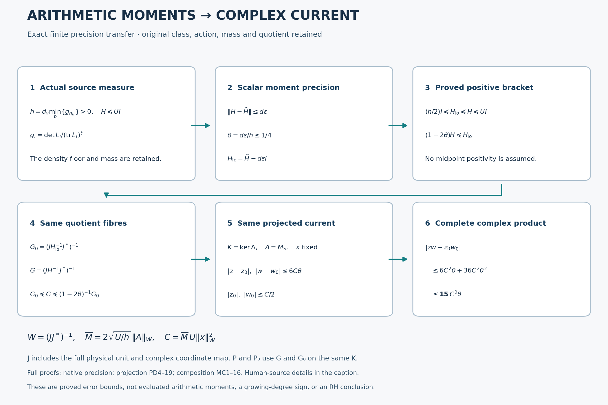

# Original theta transfer and certified complex-current precision

The Split-Zero cohomology programme starts from a theta-function source, divides by its original theta relations, and measures finite polynomial classes in the arithmetic convolution norm. Its unresolved signed calculations involve complex pairings after projection onto a fixed relation kernel. A norm estimate alone does not evaluate those pairings.

This edition provides three complete calculations and their precise composition:

- **Native moment precision (026 sequel):** positive lower bounds for the actual arithmetic moment matrices give explicit tolerances for outward inverse, quotient, conductor and four-endpoint estimates. The original mass and coordinate maps remain present.
- **Burnol-to-theta transfer (027):** a literal convolution kernel sends Burnol's right-Mellin space into the original strong left-Mellin theta source. The proof calculates every multiplicity jet, Gamma factor, theta-boundary correction and full finite Gram. It identifies exactly how Burnol's complete systems enter this programme.
- **Projection phase control (028):** varying the source metric changes the projection onto the same original kernel. The calculation retains the projection change, metric change and both complex phases.
- **Moment-to-current composition (026 sequel):** the previous estimates give an explicit scalar moment tolerance for a prescribed complex-product error. The proved bound is `15 C² theta`, with C calculated from the original action, class and source bounds. No actual native moment values or growing-degree sign are assigned by this formula.

[All six complete derivations in one LaTeX reader](COMPLETE_PROOFS.tex) · [Machine-readable result/use index](RESULT_INDEX.json) · [Human primary-source provenance](HUMAN_SOURCE_USE.json) · [Exact-check coverage](VALIDATION.md)

[Full mathematical caption and proof locators](FIGURE_CAPTION.md) · [Vector image](figures/moment_current_transfer.svg) · [Reproducible figure code](make_moment_current_figure.py)

The three complete cumulative manuscript successors are in [cumulative](cumulative), with their earlier contents recoverable byte for byte after removing the documented additions. The full earlier mathematical sources needed by these proofs are retained in [providers](providers). This source edition includes LaTeX for every new mathematical claim; it does not claim a new PDF, Zenodo or Overleaf edition.

These are advances in the calculation, not a proof or disproof of the Riemann hypothesis. Actual native moment evaluation, its error certification and the growing-degree projected-current estimate remain to be done.
