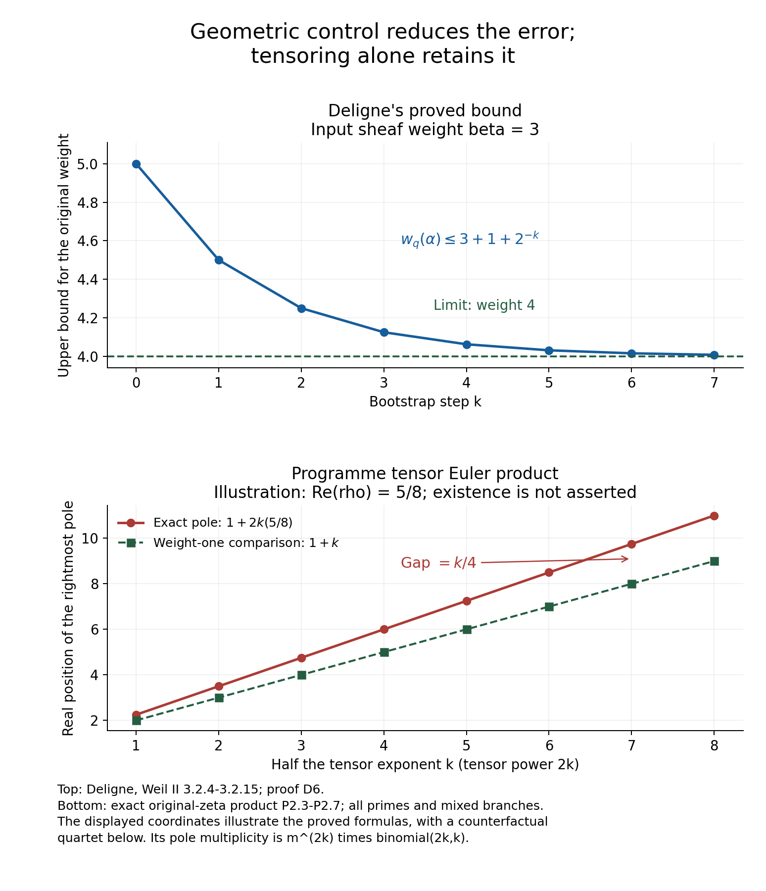

# Deligne's weight argument and the programme's global quotient

24 September 2026. A reconstruction and receiving calculation, with the original zeta function retained.

The mathematical source is Pierre Deligne, *La conjecture de Weil : II*, Publications Mathématiques de l'IHÉS **52** (1980), 137–252, [official publication](https://www.numdam.org/item/PMIHES_1980__52__137_0/), DOI 10.1007/BF02684780. The local reading source is the complete French S20 LaTeX transcription, retained with its hash. It is not an original author TeX file. The reading ledger identifies the parts actually read and the errors detected in that transcription. A corrected deduction below is identified as a deduction, not silently attributed to the transcription.

Source notation throughout: \(Z_0\) is absence, \(Z_1\) is primitive presence, and \(Z_2\) is carried integer parity. Source \(\tau\) has no addition and no parity. The retracted equation \(\tau+\tau=\tau\) is not used. Deligne's zero sheaf, an arithmetic zero, a vector-space zero, the source support \(\eta\), and source \(\tau\) are not identified. Every calculation below takes place in a named arithmetic or cohomological receiver.

The user's proposed global quotient is tested on the existing, identified original zeta function and its actual zero observations. No new arithmetic is postulated as a counterexample. The conclusion established here is an exact description of the tensor-pole displacement and of what an observation-preserving quotient does to it. It is not a proof or disproof of RH.

## D1. What Deligne controls

Let \(X_0\) be a finite-type scheme over \(\mathbb F_q\), \(X=X_0\otimes_{\mathbb F_q}\overline{\mathbb F}_q\), and let \(\ell\ne\operatorname{char}\mathbb F_q\). A lisse Weil sheaf \(\mathcal F_0\) has finite-dimensional \(\overline{\mathbb Q}_\ell\) stalks and an action of geometric Frobenius. At a closed point \(x\), put
\[
d_x=[k(x):\mathbb F_q],\qquad N(x)=q^{d_x}.
\]
For a fixed field isomorphism \(\iota:\overline{\mathbb Q}_\ell\to\mathbb C\), Deligne's numerical weight is
\[
w_{N(x)}(\alpha)=\frac{2\log|\iota\alpha|}{\log N(x)}.
\tag{D1.1}
\]
Pointwise \(\iota\)-purity of weight \(\beta\) means that every Frobenius eigenvalue at every closed point satisfies
\[
|\iota\alpha|=N(x)^{\beta/2}.
\tag{D1.2}
\]
Here \(\beta\) may be any real number. Purity without \(\iota\) additionally requires algebraicity and the equality for every complex conjugate, with integer weight. Deligne proves the estimates separately for each \(\iota\); these two statements must not be conflated.

A mixed sheaf is built by a finite filtration whose nonzero successive quotients are pointwise pure. Mixedness does not mean that a numerical average of weights is pure. An extension retains the eigenvalues of both its subobject and quotient, with multiplicities, because an adapted basis makes Frobenius block triangular.

The zero sheaf has no eigenvalues, so every asserted eigenvalue bound on it is vacuous. Its set of weights is empty. A nonzero constant rank-one sheaf has one Frobenius eigenvalue, equal to \(1\), and weight \(0\). This distinction follows directly from determinants:
\[
\det(1-TF,0)=1,\qquad
\det(1-TF,\overline{\mathbb Q}_\ell)=1-T.
\tag{D1.3}
\]
It is not a definition of source \(\tau\), and no map from \(\tau\) to either of these objects has been assumed.

The Tate factor is essential: geometric Frobenius on \(\overline{\mathbb Q}_\ell(1)\) is \(q^{-1}\), of weight \(-2\). On a twist by \((-1)\), it is \(q\), of weight \(2\). On a constant Weil twist with Frobenius \(b\), it is \(b^{d_x}\) at \(x\). Consequently
\[
w_{N(x)}(b^{d_x}\alpha)
=w_{N(x)}(\alpha)+\frac{2\log|\iota b|}{\log q}.
\tag{D1.4}
\]
This records the factor explicitly; none of the proofs below replaces the original sheaf by an unnamed weight-zero object. [Deligne, §§1.1–1.2, pp.146–156.]

## D2. The global trace formula and its independently controlled poles

For a smooth geometrically connected curve and a lisse sheaf, write \(V\) for a geometric stalk and \(\pi_1^{\rm geom}\) for geometric monodromy. The extreme cohomology groups are
\[
H^0(X,\mathcal F)=V^{\pi_1^{\rm geom}},
\qquad
H_c^0(X,\mathcal F)=
\begin{cases}
V^{\pi_1^{\rm geom}}&X\text{ proper},\\
0&X\text{ not proper},
\end{cases}
\]
\[
H_c^2(X,\mathcal F)=V_{\pi_1^{\rm geom}}(-1).
\tag{D2.1}
\]
The quotient in the last formula is the quotient by the span of \(gv-v\). It retains an explicitly computed Frobenius action, and then the Tate factor multiplies it by \(q\). It is not an arbitrary quotient chosen to remove an unwanted eigenvalue.

Grothendieck's trace formula is
\[
\prod_{x\in|X_0|}
\det(1-F_xT^{d_x},\mathcal F_x)^{-1}
=
\frac{\det(1-FT,H_c^1(X,\mathcal F))}
{\det(1-FT,H_c^0(X,\mathcal F))
 \det(1-FT,H_c^2(X,\mathcal F))}.
\tag{D2.2}
\]
Both denominator factors are retained. On an affine curve the first factor is \(1\), by the stated vanishing of \(H_c^0\).

The number of closed points of degree \(d\) is at most \(Cq^d\): a finite stratification by quasi-finite maps to affine space gives this estimate. If the stalk eigenvalues have absolute value at most \(N(x)^{\beta/2}\), the logarithm of the product converges absolutely for
\[
|T|<q^{-(\beta+2)/2}.
\tag{D2.3}
\]
Indeed the first powers are bounded by a constant times
\(\sum_{d\ge1}q^dq^{d\beta/2}|T|^d\); the higher powers form convergent geometric tails on each smaller disk. The exponential of this convergent logarithm has neither zero nor pole there.

For pointwise pure input, (D2.1) gives exact extreme weights \(\beta\) and \(\beta+2\), when the corresponding spaces are nonzero. More generally their weights are obtained from the determinant weights of the constituents. This is the source of an independent pole bound in (D2.2). Recovering an Euler product alone would not calculate these two cohomology groups. [Deligne, §§1.3–1.4, especially (1.4.1.3), (1.4.3), (1.4.5.1), (1.4.6).]

## D3. First amplification: positivity and determinant weights

For a lisse \(\iota\)-real sheaf, every \(\operatorname{Tr}(F_x^r)\) is real. For its \(2k\)-th tensor power,
\[
\log\det(1-F_xT^{d_x},\mathcal F_x^{\otimes2k})^{-1}
=\sum_{r\ge1}\frac{(\operatorname{Tr}F_x^r)^{2k}}rT^{rd_x}.
\tag{D3.1}
\]
Every coefficient on the right is nonnegative. Exponentiating preserves nonnegative coefficients and constant coefficient \(1\).

Let \(r_0\) be the largest determinant weight of a constituent of \(\mathcal F_0\). Deligne first proves that determinant weights add under tensor products, using the central degree element of the algebraic monodromy group; see §1.3. In detail, on an irreducible representation a central element of degree \(d\) acts as a scalar \(c\). Its determinant has modulus \(|c|^{\dim V}\), so determinant weight \(r_0\) means \(|c|=q^{dr_0/2}\). Tensoring multiplies these scalar actions and hence adds their weights. Passing to constituent subquotients preserves their scalar eigenspaces.

It follows from (D2.1) that the right side of (D2.2), for \(\mathcal F^{\otimes2k}\), has no poles in
\[
|T|<q^{-(2kr_0+2)/2}.
\tag{D3.2}
\]
The nonnegative Euler coefficients transfer this pole exclusion to each local factor. Write the full formal product as \(P_x(T)B_x(T)\), with \(P_x\) the local factor at \(x\). There are finitely many closed points of bounded degree, so each coefficient is well-defined. Both factors have nonnegative coefficients and constant coefficient \(1\), giving
\[
0\le[T^n]P_x(T)\le[T^n](P_x(T)B_x(T)).
\]
The global rational function is analytic throughout the disk (D3.2); its Taylor series therefore converges at every smaller positive radius. The displayed coefficient domination proves convergence of \(P_x\) there. This proves the local pole exclusion without assuming that arbitrary complex poles cannot cancel.

The factor at \(x\) has a pole of modulus \(|\iota\alpha|^{-2k/d_x}\) for every stalk eigenvalue \(\alpha\). Therefore
\[
|\iota\alpha|^{2k/d_x}\le q^{(2kr_0+2)/2},
\qquad
|\iota\alpha|\le N(x)^{r_0/2+1/(2k)}.
\tag{D3.3}
\]
For all \(k\), this forces \(|\iota\alpha|\le N(x)^{r_0/2}\).

The determinant identities turn the upper bounds into equalities for each constituent. If \(n(\gamma)\) is the total rank of constituents of determinant weight \(\gamma\), then
\[
\sum_i w_{N(x)}(\alpha_i^\gamma)=n(\gamma)\gamma.
\tag{D3.4}
\]
For a chosen \(\beta\), take the exterior power of degree
\(1+\sum_{\gamma>\beta}n(\gamma)\). Its largest determinant weight is
\(\beta+\sum_{\gamma>\beta}n(\gamma)\gamma\). Applying the bound to the eigenvalue
\(\alpha_i^\beta\prod_{\gamma>\beta,j}\alpha_j^\gamma\), and subtracting the exact equalities (D3.4), gives
\(w_{N(x)}(\alpha_i^\beta)\le\beta\).
Their sum is \(n(\beta)\beta\), so every inequality is an equality. This is Deligne's purity criterion (1.5.1), not an inference from uniqueness of an Euler product.

## D4. Local monodromy, with its Tate action retained

After a finite cover, local inertia is unipotent:
\[
\rho(\sigma)=\exp\!\left(Nt_\ell(\sigma)\right),
\qquad N:V(1)\longrightarrow V.
\tag{D4.1}
\]
The map is Frobenius-equivariant as a map with that domain. Upon displaying the Tate scalar it says
\[
FN=q^{-1}NF,\qquad FNF^{-1}=q^{-1}N.
\tag{D4.2}
\]
In particular \(N\) sends the generalized \(\alpha\)-eigenspace to the generalized \(\alpha/q\)-eigenspace. This follows by repeatedly applying
\((F-\alpha/q)N=q^{-1}N(F-\alpha)\).

The monodromy filtration \(M\) is the unique finite increasing filtration satisfying
\[
NM_i\subset M_{i-2},
\qquad
N^j:\operatorname{Gr}^M_jV(j)\xrightarrow{\sim}\operatorname{Gr}^M_{-j}V.
\tag{D4.3}
\]
It is constructed recursively from kernels and images of the highest nonzero power of \(N\). On a Jordan chain of length \(d+1\), the basis degrees are \(d,d-2,\ldots,-d\), and \(N\) lowers the degree by two. This gives the filtration explicitly. Tensoring uses
\(N_{V\otimes V'}=N_V\otimes1+1\otimes N_{V'}\); taking a dual uses \(-N_V^t\).

Write
\[
P_{-j}=\ker\bigl(N:\operatorname{Gr}_{-j}^MV\to
                     \operatorname{Gr}_{-j-2}^MV\bigr).
\]
The decomposition, with the Tate sign forced by (D4.2), is
\[
\operatorname{Gr}_i^MV
\cong
\bigoplus_{\substack{j\ge|i|\\j\equiv i\ (2)}}P_{-j}\bigl(-(i+j)/2\bigr).
\tag{D4.4}
\]
Indeed \(N^{(i+j)/2}\) identifies the corresponding summand of
\(\operatorname{Gr}_i^MV((i+j)/2)\) with \(P_{-j}\). Moving the displayed twist to the other side gives its negative in (D4.4). The available transcription has a positive sign in (1.6.14.3); that is internally inconsistent with its own Tate convention and its stated equal-weight check. We use the derived formula and retain the source unchanged.

Deligne's boundary estimate first gives
\[
|\iota\alpha|\le N(x)^{(\beta+2)/2}
\quad\text{on }(j_*\mathcal F)_x.
\]
The complete formula includes the factors at the missing points:
\[
\prod_{x\in U_0}\det(1-F_xT^{d_x},\mathcal F_x)^{-1}
\prod_{x\in X_0\setminus U_0}
\det(1-F_xT^{d_x},(j_*\mathcal F)_x)^{-1}
=\frac{\det(1-FT,H_c^1)}
{\det(1-FT,H_c^2)}
\tag{D4.5}
\]
on the affine curve used in the proof. The omitted \(H_c^0\) is zero by (D2.1). Both the first product and the right-side denominator are controlled in (D2.3), which proves the displayed estimate for the remaining local poles.

The injection
\[
(\mathcal F_{\bar\eta}^{I})^{\otimes k}
\hookrightarrow(\mathcal F_{\bar\eta}^{\otimes k})^{I}
\tag{D4.6}
\]
is the usual inclusion: a tensor of invariant vectors is invariant, and the inclusions of vector spaces stay injective on tensoring over a field. It implies
\[
|\iota\alpha|^k\le N(x)^{(k\beta+2)/2},
\qquad
|\iota\alpha|\le N(x)^{\beta/2+1/k}.
\tag{D4.7}
\]
Letting \(k\) grow gives the exact boundary bound \(N(x)^{\beta/2}\).

Put \(Q=N(s)\) at a specified boundary point \(s\). If \(\alpha\) is an eigenvalue on \(P_{-j}\), the primitive decomposition of the tensor square contains
\[
P_{-j}\otimes P_{-j}(-j)\subset
P_0(V\otimes V).
\tag{D4.8}
\]
Thus \(\alpha^2Q^j\) occurs in the inertia invariants of the tensor square. That input has weight \(2\beta\), so (D4.7) gives
\[
|\iota\alpha|^2Q^j\le Q^\beta,
\qquad |\iota\alpha|\le Q^{(\beta-j)/2}.
\tag{D4.9}
\]
The dual primitive piece is \(P_{-j}(V^\vee)=P_{-j}(V)^\vee(j)\); its eigenvalue is \(\alpha^{-1}Q^{-j}\). Apply the same upper bound with input weight \(-\beta\):
\[
|\iota\alpha|^{-1}Q^{-j}\le Q^{(-\beta-j)/2},
\qquad |\iota\alpha|\ge Q^{(\beta-j)/2}.
\tag{D4.10}
\]
Equality follows. Formula (D4.4) multiplies this eigenvalue by \(Q^{(i+j)/2}\), giving weight \(\beta+i\) on \(\operatorname{Gr}_i^MV\). Every Tate factor is visible. [Deligne, §§1.6–1.8, especially (1.8.1), (1.8.4).]

## D5. The strict bound before the final improvement

The first cohomology estimate is
\[
w_q(\alpha)\le\beta+2.
\tag{D5.1}
\]
Deligne improves it to
\[
w_q(\alpha)<\beta+2
\tag{D5.2}
\]
before beginning the product bootstrap. This strict inequality is Corollary (2.2.10). Its proof cannot be replaced by saying that the spectrum is complete.

Here is the chain of the argument. Semisimplifying reduces to irreducible sheaves. The Zariski closure of geometric monodromy has semisimple identity component, by (1.3.9). Its extension by the degree group admits a compact form modulo its central degree action. The determinant calculation and already proved purity criterion put the semisimple Frobenius conjugacy classes in that compact form after keeping their scalar modulus separately.

For unitary representations \(V\) of the compact part, the prime-power measure gives
\[
-\frac{L'}{L}(V,\sigma)
=\sum_{x,r\ge1}(\log N(x))\,N(x)^{-r\sigma}
\operatorname{Tr}(F_x^r\mid V),\qquad \sigma>1.
\tag{D5.3}
\]
For \(V\otimes\overline V\), each trace is the squared modulus of a trace, so the expression is nonnegative. The residue at \(\sigma=1\) is the pole order of the \(L\)-function. These integer orders define an additive functional \(\nu\) on representations with
\[
\nu(1)=1,\qquad \nu(V)=\nu(\overline V),\qquad
\nu(V)\le0\ (V\ne1),\qquad \nu(V\otimes\overline V)\ge0.
\tag{D5.4}
\]
Approximating a positive central function concentrated at the identity by characters gives, for any finite family \(T\) of irreducibles and any \(\epsilon>0\), a representation \(R\) such that
\[
[R\otimes\overline R:V]\ge
(1-\epsilon)\dim(V)[R\otimes\overline R:1]\quad(V\in T).
\]
One may obtain an actual representation from a virtual integral character \(R_+-R_-\) by using \(R_++R_-\); the mixed summands increase the required multiplicities, while the multiplicity of the trivial representation is unchanged because \(R_+\) and \(R_-\) have disjoint irreducible supports. Substitution in (D5.4), followed by \(\epsilon\downarrow0\), gives
\[
\sum_{V\in T}\dim(V)(-\nu(V))\le1.
\tag{D5.5}
\]
Consequently at most one nontrivial representation has a zero on that boundary; it must be a one-dimensional real character of order two. Its double cover has zeta function
\(\zeta_{X'}=\zeta_X L(\epsilon)\). Both curve zeta functions have a simple pole at the boundary, excluding the exceptional zero. This is §§2.1.4–2.2.9.

The trace formula (D2.2) now excludes first-cohomology zeros at the boundary where the top cohomology has weight \(\beta+2\), yielding (D5.2). For arbitrary \(\beta\), retain a constant twist \(b\) with \(|\iota b|=q^{\beta/2}\): the comparison spectral variable is \(bT\), the corresponding determinant eigenvalues are \(b\alpha_0\), and its absolute value restores exactly \(q^{(\beta+2)/2}\). The scalar has not been dropped or called harmless. This passage is between specified sheaves over the finite field; it is not a rescaling of the original Riemann zeta function.

## D6. The complete product improvement with the original weight

For every \(k\ge0\), let the current universal curve estimate be
\[
|\iota\alpha|\le q^{(\beta+1+2^{-k})/2}
\quad\text{on }H_c^1(U,\mathcal F).
\tag{D6.1}
\]
The case \(k=0\) is (D5.1). We now reconstruct the induction proving the case \(k+1\), retaining \(\beta\).

Let \(X_0\) be the smooth projective completion of \(U_0\), set
\[
S_0=X_0\times X_0,\quad V_0=U_0\times U_0,\quad
\mathcal G_0=\operatorname{pr}_1^*\mathcal F_0
\otimes\operatorname{pr}_2^*\mathcal F_0.
\tag{D6.2}
\]
The input \(\mathcal G_0\) has weight \(2\beta\). The boundary is the union
\((X_0\setminus U_0)\times X_0\) and \(X_0\times(X_0\setminus U_0)\), with their actual crossings. Choose a Lefschetz pencil whose axis misses the boundary, whose exceptional fibres have at most one exceptional point, and whose exceptional points consist of ordinary nodes away from the boundary, ordinary tangencies to a boundary branch, and crossings of two boundary branches.

Blowing up the axis gives \(\pi:\widetilde S\to S\) and the pencil map \(f:\widetilde S\to\mathbb P^1\). Put \(\widetilde V=\pi^{-1}V\). The blowup contribution is retained:
\[
H_c^*(\widetilde V,\pi^*\mathcal G)
\cong H_c^*(V,\mathcal G)\oplus
\bigl(H^0(V\cap A,\mathcal G)(-1)\text{ in degree }2\bigr).
\tag{D6.3}
\]
In particular \(\pi^*\) injects the original cohomology. Leray gives
\[
E_2^{ab}=H^a(\mathbb P^1,R^bf_!\pi^*\mathcal G)
\Longrightarrow H_c^{a+b}(\widetilde V,\pi^*\mathcal G).
\tag{D6.4}
\]

The precise boundary calculation is as follows. Let \(\epsilon(B)\) be the rank-one orientation module of a two-element set \(B\), with its two opposite generators. Its finite permutation action contributes roots of unity, of weight zero.

* At an ordinary node away from the boundary, the only nonzero vanishing-cycle sheaf is
  \(\Phi_x^1=\mathcal G_x(-1)\otimes\epsilon(B)\), where \(B\) is the pair of branches.
* At a tangency, the exact sequence
  \(0\to j_!\overline{\mathbb Q}_\ell\to\overline{\mathbb Q}_\ell
  \to\overline{\mathbb Q}_{\ell D}\to0\)
  gives \(\Phi_x^1=\overline{\mathbb Q}_\ell\otimes\epsilon(B)\) for constant coefficients. Filtering the locally unipotent sheaf gives
  \(\operatorname{Gr}\Phi_x^1=\operatorname{Gr}\mathcal G_x\otimes\epsilon(B)\).
* At a crossing, the four-term sequence
  \(0\to j_!\overline{\mathbb Q}_\ell\to\overline{\mathbb Q}_\ell
  \to i_*\overline{\mathbb Q}_\ell
  \to\overline{\mathbb Q}_{\ell x}\otimes\epsilon(B)\to0\),
  with \(i\) the boundary normalization map, gives the same graded formula. The two successive connecting maps account for the degree shift.

In every case \(\Phi_x^a=0\) for \(a\ne1\). The source proves these statements by Picard–Lefschetz at the node and the displayed exact sequences at the other two types. They retain the node's additional Tate factor; it is absent at the other types. [Deligne, (3.1.3.2), (3.1.4.6), (3.1.5.4).]

Let \(w:W_0\hookrightarrow\mathbb P^1\) remove the exceptional values and write \(\mathcal K=R^1f_!\pi^*\mathcal G\). The five-term exact sequence at an exceptional value \(t\) is
\[
0\to\mathcal K_{\bar t}\to\mathcal K_{\bar\eta}
\to\Phi_x^1
\to(R^2f_!\pi^*\mathcal G)_{\bar t}
\to(R^2f_!\pi^*\mathcal G)_{\bar\eta}\to0.
\tag{D6.5}
\]
Thus \(\mathcal K\hookrightarrow w_*w^*\mathcal K\); there is no nonzero section supported just at the exceptional values.

The sheaf \(w^*\mathcal K\) has pointwise pure constituents. To see the real comparison without changing the input weight, choose the constant Weil line \(\mathcal C\) with Frobenius \(q^{2\beta}\) under \(\iota\); its weight is \(4\beta\). At a point of degree \(d\), eigenvalues of
\(\mathcal G^\vee\otimes\mathcal C\) are \(q^{2\beta d}/\alpha=\overline\alpha\), because \(|\alpha|^2=q^{2\beta d}\). Therefore
\[
\mathcal G\oplus(\mathcal G^\vee\otimes\mathcal C)
\tag{D6.6}
\]
is \(\iota\)-real of weight \(2\beta\) and contains the original \(\mathcal G\) as a direct summand. Write \(\mathcal H\) for this displayed sheaf restricted to a smooth pencil fibre \(Y\). The strict bound (D5.2) separates its \(H_c^1\) eigenvalues from its \(H_c^2\) eigenvalues. Consequently the latter determinant is recovered from the poles of the real rational function (D2.2) of modulus \(N(x)^{-(2\beta+2)/2}\); those poles cannot cancel with the numerator. Its coefficients are therefore real. If \(Y\) is affine, \(H_c^0=0\). If \(Y\) is projective, the exact duality
\[
H^0(Y,\mathcal H)\cong H^2(Y,\mathcal H^\vee(1))^\vee
\]
proves reality of \(H^0\) by the same \(H^2\) calculation on the pure real input \(\mathcal H^\vee(1)\). Both denominator factors of (D2.2) are now real, so its numerator is real as well. Apply D3 to the resulting real sheaf on \(W_0\). The consulted transcription prints a negative Tate twist at this step in (3.2.1); the positive twist here is forced by the displayed Poincaré duality.

Take the constituent filtration of \(w^*\mathcal K\), extend it by intersection inside \(w_*w^*\mathcal K\), and denote a successive quotient on \(\mathbb P^1\) by \(\mathcal K_i\). At each exceptional point there is an exact sequence
\[
0\to(\mathcal K_i)_{\bar t}\to(\mathcal K_i)_{\bar\eta}
\to A_t^i\to0,
\tag{D6.7}
\]
where \(A_t^i\) is a subquotient of \(\Phi_x^1\).

The product input and D4 give all weights of \(\Phi_x^1\) in \(2\beta+\mathbb Z\). If some \(A_t^i\ne0\), D4 applied to the pure constituent shows that its weight is also in \(2\beta+\mathbb Z\). If every \(A_t^i=0\), \(\mathcal K_i\) is lisse on the whole geometric projective line, hence geometrically constant, and \(H^1(\mathbb P^1,\mathcal K_i)=0\).

For every constituent that contributes to this \(H^1\), the strict fibrewise curve bound (D5.2) gives
\[
\text{weight}\in2\beta+\mathbb Z,\qquad
\text{weight}<2\beta+2.
\]
Therefore its weight is at most \(2\beta+1\). This is the integer-step deduction, with the original \(\beta\) retained. It concerns differences of cohomological weights, not the parity of source \(\tau\).

Apply the induction estimate (D6.1) on the pencil's base curve:
\[
w_q(\alpha)\le2\beta+2+2^{-k}
\quad\text{on }E_2^{11}.
\tag{D6.8}
\]
For the other two terms of total degree two, (D2.1) used on the fibres and then on the base gives
\[
w_q(\alpha)\le2\beta+2
\quad\text{on }E_2^{02}\text{ and }E_2^{20}.
\tag{D6.9}
\]
Spectral-sequence differentials commute with Frobenius. Each later page is a subquotient of the earlier page; its eigenvalues therefore occur among those already bounded. The finite filtration of the abutment has these bounded eigenvalues as its successive factors. This proves the bound \(2\beta+2+2^{-k}\) on \(H_c^2(\widetilde V,\pi^*\mathcal G)\), including the contribution (D6.3).

Künneth embeds
\[
H_c^1(U,\mathcal F)\otimes H_c^1(U,\mathcal F)
\hookrightarrow H_c^2(V,\mathcal G)
\hookrightarrow H_c^2(\widetilde V,\pi^*\mathcal G).
\tag{D6.10}
\]
An eigenvector of eigenvalue \(\alpha\) gives a nonzero tensor eigenvector of eigenvalue \(\alpha^2\). Hence
\[
|\iota\alpha|^2\le q^{(2\beta+2+2^{-k})/2},
\qquad
|\iota\alpha|\le q^{(\beta+1+2^{-(k+1)})/2}.
\tag{D6.11}
\]
This proves the induction. The error halves because the pencil bound in (D6.8) contains one copy of the previous error. Tensoring the old bound directly would contain two copies and prove no improvement.

The preliminary finite covers and finite field extensions are removed by the injective pullback maps in (3.2.14). A field extension of degree \(d\) replaces \(\alpha\) by \(\alpha^d\) and \(q\) by \(q^d\); the equality
\[
\frac{2\log|\iota\alpha^d|}{\log q^d}
=\frac{2d\log|\iota\alpha|}{d\log q}
\tag{D6.12}
\]
proves that the original weight bound follows. No scale has been silently discarded.

Letting \(k\to\infty\) gives the upper bound \(\beta+1\). For \(H^1(X,j_*\mathcal F)\), duality pairs it perfectly with \(H^1(X,j_*\mathcal F^\vee)\) into \(\overline{\mathbb Q}_\ell(-1)\). The partner of \(\alpha\) is \(q/\alpha\); the upper bound for input weight \(-\beta\) gives
\[
|q/\iota\alpha|\le q^{(-\beta+1)/2},
\qquad |\iota\alpha|\ge q^{(\beta+1)/2}.
\tag{D6.13}
\]
Together the two bounds give purity of weight \(\beta+1\). The degrees zero and two follow from (D2.1). This reconstructs (3.2.3) through (3.2.15).

## D7. Mixed objects and proper pushforward

Deligne extends the curve theorem by exact sequences, open/closed decompositions, compositions and relative-curve reductions. The basic open/closed sequence is
\[
0\to j_!j^*\mathcal F\to\mathcal F\to i_*i^*\mathcal F\to0.
\tag{D7.1}
\]
On a relative curve compactification \(\bar f\), the boundary is finite over the base after the stated stratifications and finite alterations of the relative curve. For pure input, D4 gives on its boundary
\[
\operatorname{Gr}_i^M(i^*j_*\mathcal F)
\text{ of weight }\beta+i,\qquad i\le0.
\tag{D7.2}
\]
The curve theorem controls \(R^a\bar f_*j_*\mathcal F\) at weight \(\beta+a\). Apply the long exact sequence from
\(0\to j_!\mathcal F\to j_*\mathcal F\to i_*i^*j_*\mathcal F\to0\).
Because the boundary map is finite, its higher direct images vanish, and its remaining weights are bounded by (D7.2). The resulting \(R^af_!\mathcal F\) have weights at most \(\beta+a\).

For a composition \(f=g\circ h\), Leray has terms \(R^ag_!R^bh_!\mathcal F\) of weights at most \(\beta+b+a\), so the same bound passes to the abutment in degree \(a+b\). For an extension of input sheaves, the long exact sequence passes the bounds from its two factors to the middle term. The relative dimension-zero case follows directly from finite sums of stalks. These reductions give Theorem (3.3.1), with the real-weight refinement (3.3.10).

For smooth \(X\) of dimension \(d\), duality retains both degree and Tate shift:
\[
H^a(X,\mathcal F)^\vee
\cong H_c^{2d-a}(X,\mathcal F^\vee)(d).
\tag{D7.3}
\]
The right side has upper weight
\(-\beta+(2d-a)-2d=-\beta-a\), so \(H^a\) has lower weight \(\beta+a\). Thus the image of \(H_c^a\to H^a\) is pure of weight \(\beta+a\). Properness identifies the two groups and yields purity.

At the derived level, retain the actual dualizing complex
\[
K_X=Ra^!\overline{\mathbb Q}_\ell,\qquad
DK=R\mathcal Hom(K,K_X).
\]
For smooth \(d\)-dimensional \(X\), \(K_X=\overline{\mathbb Q}_\ell(d)[2d]\). A complex has weight at most \(n\) when \(\mathcal H^iK\) has weight at most \(n+i\); it is pure when both \(K\) and \(DK\) have the corresponding upper bounds \(n\) and \(-n\). Properness gives
\[
DRf_*K=Rf_*DK,\qquad Rf_*=Rf_!,
\tag{D7.4}
\]
so applying (3.3.1) to both sides proves purity of the proper direct image, (6.2.6). Mixed extension control is what makes these maps usable. A mixed object is not rendered pure merely by forgetting its filtration.

Deligne's separate integrality observation, (3.3.2), says that a nonzero algebraic integer pure of integer weight \(n\) has \(n\ge0\): its field norm is a nonzero integer of modulus \(q^{nd/2}\ge1\). This is different from D6's statement that weight differences belong to \(\mathbb Z\). Counting integers, algebraic-integrality of an eigenvalue, and the discrete monodromy weight steps have different exact maps in the proof.

## P1. The programme object receiving this calculation

The established source reconstruction retains
\[
1\to H\to G\to W\to1,\qquad
R=\operatorname{End}_{\rm Ab}(W),\qquad
\mathbf1_R=\operatorname{id}_W,
\tag{P1.1}
\]
with the finite signed states in \(H\), the complete infinite cyclic quotient \(W\), the chart maps, and every power map \([n]\). A chart isomorphism \(b\) satisfies \(b[n]b^{-1}=[n]\), so it preserves \(p=|W/[p]W|\).

The full return measures are
\[
\mathcal R=\sum_p\sum_{r\ge1}\frac1r\delta_{r\log p},
\quad
\mathcal D=\exp_*\mathcal R=\delta_0+\sum_{n\ge2}\delta_{\log n},
\quad
\mathcal W=t\mathcal R=\sum_p\sum_{r\ge1}(\log p)\delta_{r\log p}.
\tag{P1.2}
\]
Their transforms are the original functions
\[
\int e^{-st}\,d\mathcal D(t)=\zeta(s),\qquad
\int e^{-st}\,d\mathcal W(t)=-\zeta'(s)/\zeta(s)
\quad(\Re s>1).
\tag{P1.3}
\]
All coefficients, return times and the unit atom are retained. The receiving composition proves the same meromorphic continuation for both charts. This part of item 26 is carried forward as closed.

For the actual analytic quotient, use
\[
\mathcal A=\{k\in C^\infty(\mathbb R_{>0}):
\sup_{u>0}(u^N+u^{-N})|(u\partial_u)^jk(u)|<\infty
\text{ for every }N,j\ge0\},
\]
\[
\mathcal E f(u)=u^{1/2}\sum_{n\ge1}f(nu),\quad
I=\overline{\mathcal E(S^{\rm even}_0)}^{\mathcal A},\quad Q=\mathcal A/I,
\quad
F_k(s)=\int_0^\infty k(u)u^{s-1/2}\frac{du}{u}.
\tag{P1.4}
\]
Here \(S^{\rm even}_0\) consists of even Schwartz functions with \(f(0)=0\) and \(\int_{\mathbb R}f=0\). Absolute interchange first in \(\Re s>1\), followed by continuation, gives
\[
F_{\mathcal E f}(s)=\zeta(s)\int_0^\infty f(v)v^s\,\frac{dv}{v}.
\tag{P1.5}
\]
Thus the jet of order below the multiplicity at any actual nontrivial zero vanishes on \(I\), and defines an observation on \(Q\).

For the counterfactual actual zero \(\rho=\beta+i\gamma\), \(0<\beta<1\), \(\beta\ne1/2\), its distinct four-point orbit is
\[
\mathcal O=\{\rho,\overline\rho,1-\rho,1-\overline\rho\}.
\]
The original functional equation used here is
\[
\zeta(s)=2^s\pi^{s-1}\sin(\pi s/2)\Gamma(1-s)\zeta(1-s).
\tag{P1.5a}
\]
Every factor in its multiplier is holomorphic and nonzero in \(0<\Re s<1\), the exact domain of this comparison. Complex conjugation preserves the original Dirichlet series and hence its continuation. Thus all four multiplicities are the same, denoted \(m\). Moreover \(\gamma\ne0\): for \(0<s<1\), pairing consecutive terms makes \(\sum_{n\ge1}(-1)^{n-1}n^{-s}\) strictly positive, while \(1-2^{1-s}<0\), and their quotient is \(\zeta(s)\). The four points are therefore distinct. Retain
\[
A_\omega=\mathbb C[t_\omega]/(t_\omega^m),\qquad
V_{\mathcal O}=\bigoplus_{\omega\in\mathcal O}A_\omega,\qquad
j_\omega[k]=\sum_{r=0}^{m-1}\frac{F_k^{(r)}(\omega)}{r!}t_\omega^r.
\tag{P1.6}
\]
The full finite observation \(j_{\mathcal O}\) is onto: the functionals on compactly supported logarithmic tests have independent densities
\(v^re^{(\omega-1/2)v}/r!\).
Apply \(\prod_{\nu\ne\omega}(\partial_v-\nu+1/2)^m\) to a vanishing linear combination. It kills the other exponents and is invertible on the polynomial attached to \(\omega\), since its constant diagonal factors are \(\omega-\nu\ne0\). All polynomial coefficients vanish, proving independence and hence surjectivity.

The original prime action, including the comparison scalar, is
\[
W_pk(u)=p^{1/2}k(u/p),\qquad
F_{W_pk}(s)=p^sF_k(s),
\qquad
W_p|_{A_\omega}=p^\omega\exp((\log p)t_\omega).
\tag{P1.7}
\]
Nothing in (P1.1)–(P1.7) assigns numerical parity or addition to \(\tau\). This is the programme's already reconstructed arithmetic and its actual receiving quotient.

## P2. The global tensor Euler product and its exact moving pole

Put \(B=\max(\beta,1-\beta)>1/2\). On \(V_{\mathcal O}^{\otimes2k}\), use the diagonal prime action, retaining every ordered tuple of branches and every jet:
\[
W_p^{\otimes2k}\big|_{A_{\omega_1}\otimes\cdots\otimes A_{\omega_{2k}}}
=p^{\omega_1+\cdots+\omega_{2k}}
\exp\!\left((\log p)\sum_{a=1}^{2k}t_a\right).
\tag{P2.1}
\]
The commuting variables satisfy \(t_a^m=0\). The nilpotent exponential is triangular with every diagonal entry \(1\) in the monomial basis of dimension \(m^{2k}\). Consequently, exactly,
\[
\det(1-p^{-s}W_p^{\otimes2k})
=
\prod_{(\omega_1,\ldots,\omega_{2k})\in\mathcal O^{2k}}
\left(1-p^{\omega_1+\cdots+\omega_{2k}-s}\right)^{m^{2k}}.
\tag{P2.2}
\]
This determinant calculation retains the nilpotent operator (P2.1); it proves why its strictly triangular entries do not enter this determinant.

Therefore the complete prime product is
\[
\boxed{\displaystyle
\mathcal L_k(s)=
\prod_p\det(1-p^{-s}W_p^{\otimes2k})^{-1}
=
\prod_{\boldsymbol\omega\in\mathcal O^{2k}}
\zeta\!\left(s-\sum_{a=1}^{2k}\omega_a\right)^{m^{2k}}.}
\tag{P2.3}
\]
Absolute convergence holds for \(\Re s>1+2kB\), since every shifted argument has real part greater than \(1\). The right side is a finite product and supplies meromorphic continuation without a completed substitute.

All prime-power logarithmic coefficients are nonnegative:
\[
\log\mathcal L_k(s)
=\sum_p\sum_{r\ge1}\frac{p^{-rs}}r
\left[
2m\bigl(p^{r\beta}+p^{r(1-\beta)}\bigr)
\cos(r\gamma\log p)
\right]^{2k}.
\tag{P2.4}
\]
Exponentiating gives nonnegative Dirichlet coefficients. The expression includes every prime and repetition, not a finite-prime sample.

At the real point
\[
s_k=1+2kB
\tag{P2.5}
\]
a tuple has sum \(2kB\) precisely when every branch has real part \(B\) and exactly \(k\) of the \(2k\) branches have imaginary part \(+\gamma\), the other \(k\) having imaginary part \(-\gamma\). There are \(\binom{2k}{k}\) such tuples. Each contributes a pole of order \(m^{2k}\).

No other factor cancels those poles. For a tuple with smaller total real part, its zeta argument at \(s_k\) has real part greater than one and hence is nonzero. For a tuple with maximal real part but nonzero imaginary sum, its argument lies on \(\Re s=1\) away from \(1\), where the original zeta has no zero. For completeness, this last fact follows directly from
\[
\zeta(\sigma)^3|\zeta(\sigma+it)|^4|\zeta(\sigma+2it)|\ge1
\quad(\sigma>1),
\]
whose logarithm is the sum of
\(p^{-r\sigma}[3+4\cos(rt\log p)+\cos(2rt\log p)]/r\),
with bracket \(2(1+\cos(rt\log p))^2\ge0\).
A zero of multiplicity \(a\ge1\) at \(1+it\), \(t\ne0\), makes the left side tend to zero as \(\sigma\downarrow1\), since its order is at least \(4a-3>0\); this contradicts the inequality. Only the known simple pole of the original zeta at one was used.

Thus the pole order at (P2.5) is exactly
\[
\operatorname{ord}_{\rm pole,s_k}\mathcal L_k
=m^{2k}\binom{2k}{k}.
\tag{P2.6}
\]
There are no poles further to the right: each factor has its only pole when its shifted argument equals one. The use of the zero-free boundary above is the classical Hadamard–de la Vallée-Poussin argument, reproduced here for this application; it is not a new nonvanishing theorem.

For \(k=1\), the full product can be written without tuple notation:
\[
\begin{aligned}
\mathcal L_1(s)=\bigl[&
\zeta(s-2\beta-2i\gamma)\zeta(s-2\beta+2i\gamma)
\zeta(s-2\beta)^2\\
&\cdot\zeta(s-2+2\beta-2i\gamma)
\zeta(s-2+2\beta+2i\gamma)\zeta(s-2+2\beta)^2\\
&\cdot\zeta(s-1-2i\gamma)^2\zeta(s-1+2i\gamma)^2
\zeta(s-1)^4\bigr]^{m^2}.
\end{aligned}
\tag{P2.6a}
\]
The displayed exponents total \(16\), accounting for all ordered pairs. No mixed branch terms have been removed.

The whole quartet already has an integral determinant of average weight one:
\[
\det(W_p\mid V_{\mathcal O})
=p^{m(\rho+\overline\rho+1-\rho+1-\overline\rho)}
=p^{2m},\qquad\dim V_{\mathcal O}=4m,
\]
\[
\frac{2\log|\det W_p|}{4m\log p}=1.
\tag{P2.6b}
\]
Its semisimple joint characters nevertheless have weights \(2\beta\) and \(2(1-\beta)\), each with total multiplicity \(2m\). Their maximum is \(2B\). Deligne's \(r_0\) in D3 is the maximum determinant weight of the constituents, not the determinant average of the whole object. Substituting that average would replace the quantity actually controlled by his proof.

The displacement from the weight-one boundary is
\[
s_k-(1+k)=2k\left|\beta-\frac12\right|.
\tag{P2.7}
\]
It grows under tensor amplification. The calculation does not change the reconstructed prime spectrum or the original zeta function. It shows exactly how an off-line zero, inside that same function, appears in a global Euler product derived from the programme's actual prime operators.

## P3. What quotienting preserves

Fix a branch and a prime \(p\). Every \(W_p\)-invariant subspace of \(A_\omega\) is invariant under multiplication by \(t_\omega\). Indeed
\[
t_\omega=
\frac1{\log p}
\sum_{j=1}^{m-1}\frac{(-1)^{j+1}}j
\left(p^{-\omega}W_p-1\right)^j
\tag{P3.1}
\]
as an exact finite nilpotent logarithm. A subspace stable under \(t_\omega\) is an ideal of \(\mathbb C[t_\omega]/(t_\omega^m)\), since it is stable under every polynomial. Such ideals are exactly \((t_\omega^r)\), \(0\le r\le m\): take the smallest degree of a nonzero element; its remaining factor has nonzero constant coefficient and is a unit, so the corresponding monomial generates the ideal.

The quotient is consequently
\[
A_\omega/(t_\omega^r)\cong\mathbb C[t_\omega]/(t_\omega^r).
\tag{P3.2}
\]
For \(r>0\) it still has eigenvalue \(p^\omega\), now of multiplicity \(r\). The constant observation \(a(t)\mapsto a(0)\) descends precisely for \(r\ge1\); retaining the entire original jet requires \(r=m\). An equivariant quotient cannot move the eigenvalue to \(p^{1/2}\).

For distinct branches, the joint eigenvalue pair
\((2^\omega,3^\omega)\) separates them. Equality for two branches would give
\((\omega-\nu)\log2=2\pi ia\) and
\((\omega-\nu)\log3=2\pi ib\).
If \(\omega\ne\nu\), this would make \(\log2/\log3=a/b\) rational and hence \(2^b=3^a\), impossible for nonzero integers. Finite-dimensional polynomial spectral projectors for a generic linear combination of \(W_2\) and \(W_3\) therefore recover each branch. Every invariant quotient splits into the quotients (P3.2).

It follows that all four branch observations survive an equivariant quotient exactly when each branch retains positive length. Its even tensor Euler product still has a pole at \(1+2kB\); the multiplicity is changed by the retained branch lengths, but remains positive. An isomorphism retains the original multiplicities as well. This is the exact restriction on “quotient out the differences” supplied by the current prime actions.

For any quotient \(q:Q\to Q/K\), the full observation \(j_{\mathcal O}\) descends if and only if
\[
K\subseteq\ker j_{\mathcal O}.
\tag{P3.3}
\]
Proof: if \(j_{\mathcal O}=\bar j_{\mathcal O}q\), it vanishes on \(\ker q\). Conversely the inclusion makes \(\bar j_{\mathcal O}([x])=j_{\mathcal O}(x)\) independent of the representative. Thus a quotient that preserves all these observations cannot erase their pole displacement. A quotient that erases them is a different, explicitly nonfaithful observation map.

## P4. Full support and the exact nilpotent comparison

Retain the programme's existing formal coefficient receiver, with its separate coefficient symbols and the vector space \(W_L\) on all specified support labels. On its algebraic coefficient extension, the comparison is
\[
j_{\mathcal O}\otimes\operatorname{id}\otimes\operatorname{id}.
\tag{P4.1}
\]
For any linear map \(T:V\to V'\) and any coefficient vector space \(C\) with specified basis \(\{c_a\}\),
\[
\ker(T\otimes\operatorname{id}_C)
=(\ker T)\otimes C.
\tag{P4.2}
\]
Every tensor is a finite sum \(\sum_a v_a\otimes c_a\); its image vanishes exactly when all \(T(v_a)=0\). This proves the equality while retaining each label. For a finite retained support subspace of dimension \(d\), the tensor-power determinant in (P2.2) repeats each eigenvalue \(d^{2k}\) times. For an infinite support receiver, the proof applies coordinatewise; no finite determinant of the whole infinite support space is asserted.

These are exact maps on the existing formal receiver. They do not establish an equivalence with every proposed semimodule cohomology over the source. In particular they do not define source \(\tau+\tau\), replace source absence by a vector zero, or remove the actual mixed-support maps. A general nontrivial action on support would enter the determinant through its own eigenvalues; it cannot be suppressed by the identity-extension calculation.

For the actual jet, put \(T=m_{t_\omega}\). Formula (P1.7) gives
\[
W_pTW_p^{-1}=T.
\tag{P4.3}
\]
Deligne's local monodromy equation (D4.2) instead has \(p^{-1}T\). The exact difference is
\[
W_pTW_p^{-1}-p^{-1}T=(1-p^{-1})T.
\tag{P4.4}
\]
This vanishes for a length-one jet and is nonzero for a jet of length greater than one. It is unrelated to whether \(\Re\omega=1/2\). Therefore the original spectral jet nilpotent cannot silently stand in for Deligne's inertia nilpotent.

There is a constructive relation retaining the original jet. For \(m\ge1\), form
\[
\begin{gathered}
B=\mathbb C[x,y]/(x,y)^m,\quad X=m_x,\quad N=m_y,\\
F=p^\omega\exp((\log p)X)\,S,\qquad
S f(x,y)=f(x,p^{-1}y).
\end{gathered}
\tag{P4.5}
\]
Then \(FX=XF\) and \(FNF^{-1}=p^{-1}N\). The map
\(A_\omega\hookrightarrow B,\ t_\omega\mapsto x\)
is injective and preserves the original \(W_p\) and its full commuting jet. On the other hand \(B\to A_\omega,\ x,y\mapsto t_\omega\), identifies \(X\) and \(N\) but fails Frobenius descent:
\[
F(y-x)\ \mapsto\
p^\omega\exp((\log p)t_\omega)(p^{-1}-1)t_\omega.
\tag{P4.6}
\]
Thus the two different nilpotents and their exact defect have a single receiving object. This creates no purity theorem: on \(y\)-degree \(j\), the eigenvalue of \(F\) is \(p^{\omega-j}\), with the surviving \(x\)-jets still present.

## P5. The result of the proposed contradiction test

The complete reconstruction fixes the arithmetic actions and the original \(\zeta\). It now gives an explicit global tensor calculation, (P2.3), whose rightmost real pole is (P2.5) with multiplicity (P2.6). Observation-preserving equivariant quotients retain that pole. This directly addresses the class of deviations represented by actual off-line zero blocks; it does not replace them by arbitrary malformed arithmetic.

Deligne's quotient (D2.1) computes geometric coinvariants and their Frobenius action. His integer-step argument then comes from actual local monodromy and the three vanishing-cycle geometries in D6. These supply a tensor-power bound whose error does not grow with the tensor exponent. Our quotient classification and positivity calculation by themselves give the pole in (P2.5), not that independent bound.

Consequently the proposed contradiction has not been established. The calculated issue is now precise and global: the retained programme would have to control the pole \(1+2kB\) through its genuine cohomological trace maps. Merely mapping back to the same unique zeta function retains this pole rather than contradicting it. No off-line zero has been found, and no assumption of an off-line zero has been discharged.

## Figure: the two global calculations

The top panel shows the proved source bound D6.1 for the illustrative input sheaf weight \(3\). The bottom panel shows P2.5 for the illustrative counterfactual real part \(5/8\). These are different named parameters, not an identification of the sheaf weight with a zero coordinate. The pole gap is \(2k(5/8-1/2)=k/4\); the complete pole multiplicity is P2.6. The bottom panel does not assert that such a zeta zero exists. Source, full proof and rendering code remain alongside the figure.

## Sources and mathematical provenance

The finite-field weight arguments D1–D7 are Deligne's, reconstructed from the cited sections; the trace formula and cohomology formalism are credited there to Alexander Grothendieck and the SGA authors. The local monodromy construction is from SGA 7 and Deligne's §§1.6–1.8. The account does not claim that these arguments are new.

The user's contribution is the proposed full-spectrum reconstruction and global-quotient contradiction question, with \(Z_0,Z_1,Z_2,\tau\) kept in the specified notation. P2's exact shifted-zeta tensor product, P3's receiving quotient calculation and P4's two-nilpotent comparison are derivations in this continuation, assisted by independent mathematical agents. They are applications and tests of that question, not attributed to Deligne as statements about the Riemann zeta function.

The programme input is retained in the companion source directory and in the preceding *Integral history and purity* note, IH1–IH8. The public source for the timed reconstruction is [TP0–TP14, pinned programme edition](https://github.com/KokunoYumeto/zeta-function-research-reader/blob/32acd0df89ae22c96d2bc30372e4426a31ce4506/workbenches/splitzero-tandem/temporary-arguments/20260924-fixed-generic-point-purity/timed-prime-reconstruction/README.md). Connes–Consani's geometric source remains Alain Connes and Caterina Consani, [*On the Absolute Geometry of Spec Z*, arXiv:2606.06604v1](https://arxiv.org/abs/2606.06604v1), together with their [arXiv:2609.00299v1](https://arxiv.org/abs/2609.00299v1); exact local author-TeX reading locations are in the preceding source ledger. None of the private correspondence is being represented as a published proof.
