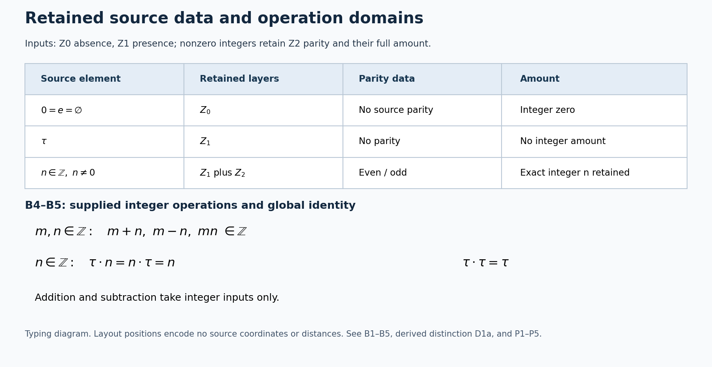

# Source operations and their exact arithmetic consequences

24 September 2026. Agent-authored formal interpretation and complete elementary proofs. The user's wording is in USER_DEFINITIONS_VERBATIM.md (private construction record; not included). References U01–U18 below identify those exact quotations. No historical novelty is claimed for the elementary algebra. The source interpretation is explicit, so a correction to it can be applied without rewriting the user record.

## Scope and order of construction

This defines the arithmetic operations currently specified for tau and the integer layer. It does not construct the full support lattice, an involution geometry, a Cartan involution, a metric, a vector representation, a pairing, reflection positivity, a Deligne weight, or an RH conclusion. The plank is a metaphor, as U09 says. No theorem below substitutes that metaphor for source data.

The latest instructions U15–U16 authorize continued mathematics without an approval gate. They require the definition to precede its use. The exact geometric production of integer torsion is not being assumed accomplished by taking the already supplied integer layer as input.

## B1–B5. Primitive supplied data and retained integer operations

These are the inputs. The separation from integers, the global-versus-integer identity distinction, and the excluded inputs to existing integer operations are proved below; they are not additional primitive definitions. U18 controls this distinction.

### B1–B3. Absence, presence and the integer data

The source symbols are:

- \(0_{\langle Z_0;\mathrm{no}\ Z_2\rangle}=e=\varnothing\): the supplied absence element, also the integer zero. [U02, U05]
- \(\tau_{\langle Z_1;\mathrm{no}\ Z_2\rangle}\): primitive presence with no parity. No integer coefficient is introduced here; exclusion from the integer carrier is proved in D1a. [U01, U06]
- For each nonzero integer \(n\), the original integer with its exact amount \(n\), its \(Z_1\) presence, and its \(Z_2\) odd/even data. The word torsion here means the user's retained integer amount; it does not assert finite order in a group. [U01, U08, U11]

An integer's full amount is not replaced by parity: 2 and 4 have different amounts. Equality preserves the complete declared source data. An absent parity value is not an even value. No source parity is assigned to zero or tau. No family of copies of tau is introduced. [U01–U03]

**D1a. Distinctness follows from these data.** Tau differs from zero because their declared presence statuses are \(Z_1\) and \(Z_0\). Tau differs from a nonzero integer because that integer has the declared \(Z_2\) datum and tau does not. Equality would require retaining and lacking that datum simultaneously. Therefore tau differs from every integer. This conclusion uses the source distinctions rather than adding a midpoint or an independent separation axiom. [U07]

After that conclusion, denote the whole indicated carrier by \(S\), and its original integer part by \(\mathbb Z\). Thus \(S\) consists of that integer part and the additional primitive tau. This is a description of the resulting carrier, not an equation constructing tau from integer arithmetic.

## B4–B5. The existing operations

**B4. Integer arithmetic.** The notation \(+, -\) denotes the original operations on the supplied integer layer:

\[
+, -:\mathbb Z\times\mathbb Z\longrightarrow\mathbb Z.
\]

Integer multiplication is the original operation \(m\cdot n=mn\) for integer arguments. An output retains the data of the resulting integer, including the supplied \(Z_0\) status when that result is zero. This specifies the existing integer operations. It is not a postulate that every conceivable additive extension is impossible. [U01, U05, U08]

**B5. The supplied global identity.** For every indicated source element \(x\), use the source statement that tau is the global multiplicative identity:

\[
\tau\cdot x=x\cdot\tau=x.
\]

This interprets the explicit global-identity wording in U13. It is not proved from tau lacking parity. In particular the displayed laws \(\tau\cdot\tau=\tau\), \(\tau\cdot n=n\cdot\tau=n\), and \(0\cdot\tau=\tau\cdot0=0\) follow by applying B5 to those arguments. The integer coefficient of a mixed product comes from its integer input. The integer rules in B4 and the identity rules in B5 together give a product on the whole indicated carrier. [U05, U13]

**Retraction R1.** U04 withdraws the former tau self-sum. The previous mixed additive line is not used as a current premise. No new sum involving tau is introduced here. A retraction removes an alleged law; it is not a proof of a universal nonexistence theorem.

**Derived input exclusion.** By D1a, tau is not in the integer carrier. Therefore the ordered pairs \((n,\tau)\), \((\tau,n)\), and \((\tau,\tau)\) are not in the domain of either integer operation in B4. Consequently these expressions cannot be evaluated by those operations. This proves the input exclusion from the declared integer signatures and D1a, rather than adding the exclusion as a separate axiom. The complete expression result is P4; P5 states its precise limit. [U04, U12, U18]

Integer comparison retains its original integer domain. D1a similarly excludes tau as an argument to that comparison. The sign of an integer is not thereby a displacement from tau; U14 supplies no permission to erase integer signs.

## L1. Specification limit: a missing metric is not an impossibility axiom

B1–B5 supply no distance operation, numerical coordinate for tau, inner product or norm. This records the actual input data; it is not an extra axiom saying such structures can never be studied. The expressions \(n-\tau\) and \(\tau-n\) have already been excluded from the existing integer subtraction by D1a and B4. A statement excluding every possible relation would require a stronger argument than that input-domain proof; it is not assumed here. The specified multiplication is retained throughout. [U10–U13, U18]

The user's intended positive-undefined statement is preserved verbatim in U13. No metric, numerical infinity, positive scalar or purity conclusion is inserted into the inputs to make it true. The present calculation proves the narrower arithmetic consequences stated in P1–P5.

Figure 1. This displays the supplied data and the proved arithmetic-domain distinctions; it assigns no source metric or coordinate. Source references: U01–U05 and U08–U13. The complete arguments remain below. Reproducible figure source: `render_source_domains.py`.

## P1. Multiplication is associative and commutative, with global identity tau

**Proof.** For two integer inputs, commutativity is integer commutativity. For an input tau, the product is the other input. For two tau inputs it is tau. These cases exhaust the domain and prove commutativity.

Three integer inputs satisfy associativity by original integer arithmetic. All remaining triples are covered by the following identities, for arbitrary source elements \(x,y,z\):

\[
(\tau y)z=yz=\tau(yz),
\qquad
(x\tau)z=xz=x(\tau z),
\qquad
(xy)\tau=xy=x(y\tau).
\]

The same identities include triples with more than one tau. Thus multiplication is associative. Its stipulated two-sided identity is tau. If \(u\) were another global identity, its identity property would give \(u\tau=\tau\), whereas tau's identity property gives \(u\tau=u\); hence \(u=\tau\).

Zero is absorbing: integer products with zero are zero, and \(0\tau=\tau0=0\) by the supplied mixed rule. Integer 1 acts as identity on integers. It is not the global identity because \(1\tau=1\), while D1a gives \(1\ne\tau\). This distinguishes the global identity from the integer identity without assigning parity to tau. ∎

## P2. Every product with an integer input has integer output

**Proof.** The other input is either an integer, giving an integer product, or tau, leaving the integer input unchanged. Both cases return the integer part of the carrier. ∎

## P3. Available distributivity uses integer additive inputs

For every \(a\in S\) and integers \(m,n\), both sides of

\[
a(m+n)=am+an,
\qquad
(m+n)a=ma+na
\]

are defined and equal.

**Proof.** If \(a\) is an integer, use original integer distributivity. If \(a=\tau\), each side of the first equation is the original integer sum \(m+n\). Multiplication is commutative by P1, giving the second equation. P2 ensures that each sum on the right is a sum of integers. This assertion has no instance with tau as an additive input. ∎

## P4. Exactly which defined arithmetic expressions can produce tau

Consider finite expressions whose leaves are source elements and whose internal operations are the operations of B4–B5. An expression is defined only when each operation receives inputs in its stated domain.

Then:

1. Every defined expression containing at least one integer leaf has integer value.
2. A defined expression with only tau leaves has value tau and uses multiplication only.

**Proof by induction on the expression tree.** A single integer leaf has integer value; a single tau leaf has value tau.

At a multiplication node, if either subtree contains an integer leaf, its value is an integer by induction. P2 then gives an integer value for the node. If neither subtree contains an integer leaf, induction gives value tau to each, and their product is tau.

At an addition or subtraction node, both subtree values must be integers for the expression to be defined. In particular neither subtree can consist entirely of tau leaves, since induction would give it value tau, outside the input domain. The original integer operation returns an integer.

These cases exhaust the allowed nodes and establish both conclusions. ∎

**Exact consequence.** No defined expression made from integer inputs by these addition, subtraction and multiplication rules produces tau. This remains true when tau is allowed as a multiplicative identity within an expression already containing an integer input. Tau is not recovered as an integer midpoint, an integer difference, or another expression of this language. This is the precise algebraic content established for U10–U12.

The quantifier is over the stated finite-expression language. No claim is made about every conceivable additional operation, an unspecified category, or a subsequently added geometric construction. Such a stronger statement is not contained in this proof.

## P5. The proposed numerical comparison is outside the source language

A subtraction node requires integer-valued arguments. D1a proves tau is not an integer source element. Therefore a node with arguments \((n,\tau)\), \((\tau,n)\), or \((\tau,\tau)\) is not an instance of source subtraction. B4–B5 contain no distance-operation node. This fact specifies the expression language; it does not prove that every extension of the language is impossible.

This is a typing conclusion, not a negative numerical value and not an unknown numerical value. It does not establish a positive numerical value either. In particular no sign or magnitude of \(d(n,\tau)\) is deduced by the present proof. U13's intended positive-undefined statement remains accurately quoted rather than being replaced with a metric claim.

## Consequence for the rejected auxiliary construction

The supplied transcript introduced vectors, a midpoint, a metric and a pairing before providing a source construction of them. Those operations do not occur in B1–B5, and no comparison carrying them from this source was supplied. Its matrix calculation therefore cannot be used here as a test of this source. This scope correction does not assert that its separate matrix arithmetic was internally false. It withdraws the claimed application to the user's construction.

No replacement pairing is chosen here. P1–P5 do not supply a proof of reflection positivity, Deligne purity or RH.

## Exact dependency record

| Statement | Status | Premises and complete derivation |
| --- | --- | --- |
| \(Z_0\) absence; \(Z_1\) presence; source parity data | Supplied data | B1–B3, traced to U01–U02, U05–U06, U08 |
| Original integer operations | Supplied operations | B4; these do not claim integers were generated from tau |
| Tau is the global multiplicative identity | Supplied law | B5, explicit interpretation of U13 |
| Tau self-addition | Retracted law | R1 and U04; never an input to P1–P5 |
| \(\tau\ne0\) and \(\tau\ne n\) for nonzero integers | Derived | D1a: equality preserves the stated presence and parity data |
| Integer 1 is not the global identity | Derived | P1 uses B5 and D1a, not an independent inequality axiom |
| Integer arithmetic expressions cannot produce tau | Derived | P2 and the complete induction in P4 |
| Existing integer subtraction has no tau input | Derived | D1a and the integer input signature B4; P5 |
| No numerical distance was supplied | Specification fact | L1; not converted into a universal impossibility axiom |
| Geometric fixed-centre, positive-undefined and purity conclusions | Not asserted as proved here | They are not added as premises to the arithmetic proofs |

This classification follows U18. An agent-authored contradiction with the supplied definitions must be repaired before the affected calculation continues. No proof may depend on a correction being silently promoted to an axiom.

## Reproducibility and provenance

All source quotations have locators in USER_DEFINITIONS_VERBATIM.md and hashes in SOURCE_MANIFEST.json. The complete pasted exchanges are preserved without byte changes. These proofs are elementary direct derivations from the explicit operations and the retained integer arithmetic; no unseen literature theorem is invoked. The user's geometric proposal and terminology are credited to the user, without publishing a personal name. This is a local foundational note; no remote publication or acceptance of a complete geometric reconstruction is claimed.
