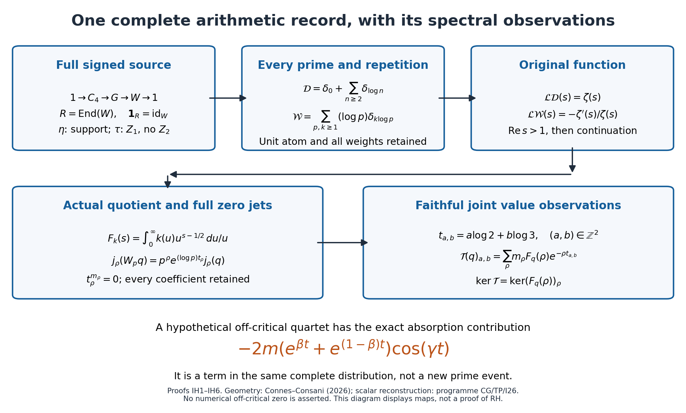

# Integral history, the identified zeta function, and a detected off-critical orbit

24 September 2026. Complete receiving calculation IH1–IH8. The question is whether the complete reconstruction of the integers, their unit and their normed prime spectrum makes an off-critical zero an undetected object, and therefore a contradiction. This note accepts the completed scalar zeta identification in item 26 and calculates the proposed counterfactual in that identified function and its actual quotient.

The source notation remains \(Z_0\) for absence, \(Z_1\) for primitive presence, and \(Z_2\) for carried integer parity. Source \(\tau\) has no parity and no addition. The source support \(\eta\), the arithmetic identity \(\operatorname{id}_W\), the identity of a coefficient algebra, and a zero vector in a linear receiving space are not identified. In particular, a vanishing observation in a linear receiver does not mean that the unsupported source element has been identified with a numerical zero.

## IH1. The completed identification is an input carried forward

The complete source comparison is CG0–CG8 of *The unique common support and canonical reconstruction of the original zeta function*, together with TP0–TP14 of *First-appearance time, primitive periods, and the original zeta function*. The receiving composition is I26.1–I26.4 of *Applying the canonical reconstruction to item 26*. The source versions and their complete files are retained alongside this note. They use the actual signed Connes–Consani chart system, not a bare singleton from which a stalk is presumed to emerge.

For the essential composition, retain

\[
1\longrightarrow H\longrightarrow G\longrightarrow W\longrightarrow1,
\qquad R=\operatorname{End}_{\mathrm{Ab}}(W),\qquad
\mathbf1_R=\operatorname{id}_W.
\tag{IH1.1}
\]

Here \(H\) retains the four finite-order states of the signed source and \(W\) is its infinite cyclic quotient. CG0 constructs the unique primitive step of each complete ordered chart quotient; CG2 proves the twisted chart restrictions and their group-completion universal properties. CG4 proves \(R\cong\mathbb Z\), with the isomorphism \(n\mapsto[n]\), where \([n](x)=x^n\). The comparison \(b:W\to W'\) preserves every power action because

\[
b[n]b^{-1}(x')=b((b^{-1}x')^n)=(x')^n.
\tag{IH1.2}
\]

It follows that it preserves each residue norm \(p=|W/[p]W|\). The complete return measures are

\[
\mathcal R=\sum_p\sum_{k\ge1}\frac1k\delta_{k\log p},\qquad
\mathcal D=\exp_*\mathcal R=\delta_0+\sum_{n\ge2}\delta_{\log n},
\qquad
\mathcal W=t\mathcal R=\sum_p\sum_{k\ge1}(\log p)\delta_{k\log p}.
\tag{IH1.3}
\]

The coefficients of the convolution exponential are one by unique prime factorization. In detail, for one prime the formal identity \(\exp(\sum_{k\ge1}X^k/k)=\sum_{k\ge0}X^k\) follows by differentiating and comparing coefficients, with constant coefficient one. Finite-prime convolution products enumerate exponent tuples once each. On a bounded time interval only finitely many primes, repetitions and convolution orders contribute, so the resulting identity holds for the complete locally finite measures. This retains the empty convolution and its mass-one atom at zero.

For \(\Re s>1\), absolute convergence gives

\[
\int e^{-st}\,d\mathcal D(t)=1+\sum_{n\ge2}n^{-s}=\zeta(s),
\qquad
\int e^{-st}\,d\mathcal W(t)=-\frac{\zeta'(s)}{\zeta(s)}.
\tag{IH1.4}
\]

Indeed \(\sum n^{-\sigma}<\infty\) and \(\sum (\log n)n^{-\sigma}<\infty\) for \(\sigma>1\), uniformly on smaller closed half-planes. These bounds justify the products, convolution transforms and derivative of the logarithmic series. Both chart constructions preserve every term in (IH1.3), so their transforms agree with the original zeta function. Its classical meromorphic continuation is unique by the identity theorem: two such continuations have zero difference on the open half-plane and hence everywhere. All zero germs and their multiplicities agree. No completion multiplier is introduced in (IH1.4). The continuation fact is [DLMF 25.2\(i\)](https://dlmf.nist.gov/25.2#i); this calculation does not claim a new proof of that classical fact.

The chart mirror induces inversion \(a(x)=x^{-1}\) on \(W\). Its arithmetic transport is conjugation, and

\[
(a[n]a^{-1})(x)=((x^{-1})^n)^{-1}=x^n.
\tag{IH1.5}
\]

Thus this particular transport preserves the reconstructed zeta function at the same parameter \(s\). The completed scalar identification is retained. An isometry of a cohomology space or fixedness of each spectral character is not an additional consequence contained in this identity.

## IH2. The actual quotient detects an off-critical zero

Use the linked task's spaces exactly. Let \(\mathcal A\) consist of smooth \(k:(0,\infty)\to\mathbb C\) with

\[
p_{N,j}(k)=\sup_{u>0}(u^N+u^{-N})|(u\partial_u)^j k(u)|<\infty
\quad(N,j\ge0).
\]

Let \(S_0^{\rm even}\) consist of even Schwartz functions \(f\) on \(\mathbb R\) with \(f(0)=0\) and \(\int f=0\). Retain the original sum and its factor:

\[
\mathcal E f(u)=u^{1/2}\sum_{n\ge1}f(nu),\qquad
I=\overline{\mathcal E(S_0^{\rm even})}^{\mathcal A},\qquad Q=\mathcal A/I,
\]
\[
F_k(s)=\int_0^\infty k(u)u^{s-1/2}\frac{du}{u}.
\tag{IH2.1}
\]

The integral is entire in \(s\): any fixed real strip and any derivative in \(s\) are dominated by a stronger defining seminorm. For \(\Re s>1\), absolute interchange and \(v=nu\) give

\[
F_{\mathcal E f}(s)=\zeta(s)\int_0^\infty f(v)v^s\frac{dv}{v}.
\tag{IH2.2}
\]

The second factor is holomorphic throughout the critical strip: evenness and \(f(0)=0\) give \(f(v)=O(v^2)\) at zero, and Schwartz decay controls infinity. The identity continues to this strip. Hence every derivative of order below the multiplicity of an actual zero vanishes on the source image, and continuity of Mellin derivatives gives the same statement on \(I\). Poisson summation with both stated endpoints zero proves that \(\mathcal E f\in\mathcal A\); these are the precise source and topology used in G2 and GIQ1, not an \(L^2\) closure substituted for them.

For a zero \(\rho\) of multiplicity \(m_\rho\), define

\[
A_\rho=\mathbb C[t_\rho]/(t_\rho^{m_\rho}),\qquad
j_\rho([k])=\sum_{r=0}^{m_\rho-1}\frac{F_k^{(r)}(\rho)}{r!}t_\rho^r.
\tag{IH2.3}
\]

This is a well-defined algebra map for multiplicative convolution. Its product law is the derivative product rule with the displayed factorials. G4 identifies the continuous characters of \(Q\) with the original nontrivial zeros; its complete retained kernel comparison is

\[
F_{\mathcal E f_0}(s)=\frac{s(s-1)}8\pi^{-s/2}\Gamma(s/2)\zeta(s),
\qquad f_0(v)=\frac\pi2v^2(2\pi v^2-3)e^{-\pi v^2}.
\tag{IH2.4}
\]

The limits at zero and one are \(1/8\). At \(s=-2r\), \(r\ge1\), the value is

\[
\frac{r(2r+1)(-1)^r\pi^r}{2r!}\zeta'(-2r)\ne0.
\tag{IH2.5}
\]

The residue of \(\Gamma(s/2)\) is \(2(-1)^r/r!\); multiplication by the simple trivial-zero germ proves the formula. Simplicity follows from the sine factor of the original functional equation and its nonzero remaining factors there. Thus the completion data are explicit in this comparison and are not a replacement for the original zeta function.

Here is a direct detector that answers the proposed inference. Choose a nonnegative nonzero \(\varphi\in C_c^\infty(\mathbb R)\), and for any actual zero, on or off the line, set

\[
k_\rho(e^v)=\varphi(v)e^{-(\rho-1/2)v}.
\]

It belongs to \(\mathcal A\), and

\[
F_{k_\rho}(\rho)=\int_{\mathbb R}\varphi(v)\,dv>0.
\tag{IH2.6}
\]

Since every element of \(I\) has zero observation at \(\rho\), this test gives a nonzero class of the actual quotient. No zero outside the detected system has been introduced. The proposed off-critical zero is an actual detected character under the counterfactual assumption itself.

## IH3. The complete counterfactual orbit and every prime action

For the contradiction test, write the hypothetical actual off-critical zero as \(\rho=\beta+i\gamma\), with \(0<\beta<1\), \(\beta\ne1/2\). Nontrivial zeros are nonreal: for real \(0<s<1\), the alternating series \(\sum_{n\ge1}(-1)^{n-1}n^{-s}\) is positive, by grouping its positive consecutive pairs, whereas \(1-2^{1-s}<0\); its quotient is \(\zeta(s)\). Thus \(\gamma\ne0\).

The full four-point orbit and its full local algebra are

\[
\mathcal O_\rho=\{\rho,1-\overline\rho,\overline\rho,1-\rho\},
\qquad
B_\rho=\prod_{\omega\in\mathcal O_\rho}\mathbb C[t_\omega]/(t_\omega^m),
\quad j_{\mathcal O}:Q\longrightarrow B_\rho.
\tag{IH3.1}
\]

All four points are distinct and have the same multiplicity \(m\), by conjugation and the original functional equation. The product observation is surjective. Indeed its finitely many coordinate functionals on compact smooth logarithmic tests have densities \(v^r e^{(\omega-1/2)v}/r!\). To prove their independence, apply \(\prod_{\nu\ne\omega}(\partial_v-(\nu-1/2))^m\) to a vanishing exponential-polynomial combination. It kills the other summands and is invertible on the remaining polynomial after removing its exponential, because each resulting operator \(\partial_v+\omega-\nu\) has nonzero constant diagonal. Every coefficient therefore vanishes. Compact smooth tests separate these densities, proving surjectivity onto the finite-dimensional product.

Retain both compared operators

\[
V_a k(u)=k(u/a),\qquad W_a=a^{1/2}V_a,\qquad
F_{V_a k}(s)=a^{s-1/2}F_k(s),\quad F_{W_a k}(s)=a^sF_k(s).
\tag{IH3.2}
\]

They preserve \(I\): substitution gives \(V_a\mathcal E f=\mathcal E(a^{-1/2}f(\cdot/a))\), and the new Schwartz function has both required vanishing endpoints. Continuity gives preservation of the closure. The inverse is the corresponding operator at \(1/a\). On every local factor the full \(W_a\) action is multiplication by

\[
w_{a,\omega}=a^\omega\sum_{r=0}^{m-1}\frac{(\log a)^r t_\omega^r}{r!},
\qquad j_\omega W_a=M_{w_{a,\omega}}j_\omega.
\tag{IH3.3}
\]

The finite exponential retains all multiplicity information. Its product rule follows by the binomial formula, so \(W_aW_b=W_{ab}\) on the complete quotient. Thus all prime powers and products act in the same object.

The off-critical displacement is visible at every prime, through the original unscaled coordinate:

\[
D_p(\rho)=|p^\rho|^2-p=p^{2\beta}-p,
\qquad \log\frac{|p^\rho|^2}{p}=(2\beta-1)\log p.
\tag{IH3.4}
\]

For every pair of positive integers, the complete defect satisfies

\[
D_{ab}=bD_a+aD_b+D_aD_b,\qquad D_1=0,
\]
\[
D_{p^k}=(p^{2\beta}-p)\sum_{j=0}^{k-1}p^{2\beta(k-1-j)}p^j.
\tag{IH3.5}
\]

Expand \((D_a+a)(D_b+b)-ab\) for the first identity and use the difference-of-powers identity for the second. Every term in the last sum is positive. Thus retaining every repetition detects and propagates the displacement; it does not set it to zero. No new prime or nonintegral integer label appears.

Reflection on \(B_\rho\) is \((x^\#)_\omega(t)=\overline{x_{1-\overline\omega}}(-t)\). It gives the exact full-jet identity \(w_a^\#w_a=a1_{B_\rho}\). Conjugation supplies the other orbit permutation. The algebra trace form is

\[
\operatorname{Tr}_{B_\rho/\mathbb C}(M_{x^\#y})
=m\sum_{\omega\in\mathcal O_\rho}\overline{x_{1-\overline\omega}(0)}y_\omega(0).
\tag{IH3.6}
\]

In the displayed order of the four points its value matrix is \(m\operatorname{diag}(J_2,J_2)\), \(J_2=\left(\begin{smallmatrix}0&1\\1&0\end{smallmatrix}\right)\); its signature is \((2,2)\). Its radical is precisely the four higher-jet ideals, of total dimension \(4(m-1)\). This follows because multiplication on each jet algebra is triangular with constant diagonal \(x(0)\), while the displayed value matrix is invertible. These are all maps in one receiving diagram: the actual \(Q\), its actual orbit quotient, every \(W_a\), both symmetries and the trace. It is not a separately selected polynomial masquerading as a zeta zero.

## IH4. What the off-critical orbit looks like in the absorption record

The actual absorption measure for this route is \(\mathcal W\) in (IH1.3), with its full prime-power weights. On \(t>0\) its exact spectral identity is

\[
\boxed{\mathcal W=e^t\,dt-\sum_\omega m_\omega e^{\omega t}\,dt
-\sum_{r\ge1}e^{-2rt}\,dt.}
\tag{IH4.1}
\]

The middle sum ranges over all distinct original nontrivial zeros with multiplicities. This is a distribution identity on compact smooth tests supported in \((0,\infty)\), not a pointwise convergent series of densities. Here is its derivation retaining the full archimedean and endpoint contributions.

The programme's full original-zeta explicit formula, for \(h\in C_c^\infty(\mathbb R)\), is

\[
\sum_\omega m_\omega H(\omega)=H(0)+H(1)+A_\infty(h)-P(h),
\quad H(s)=\int h(v)e^{-(s-1/2)v}\,dv,
\]
\[
P(h)=\sum_{p,k\ge1}\frac{\log p}{p^{k/2}}
\bigl(h(k\log p)+h(-k\log p)\bigr),
\]
\[
A_\infty(h)=\frac1{2\pi}\int_{\mathbb R}\widehat h(y)
\left(\Re\frac{\Gamma'(1/4+iy/2)}{\Gamma(1/4+iy/2)}-\log\pi\right)dy,
\quad \widehat h(y)=\int h(v)e^{-iyv}\,dv.
\tag{IH4.2}
\]

The exact digamma integral and Fourier inversion, with both endpoints retained, give the equivalent full expression already derived in C10.3:

\[
A_\infty(h)=-(\gamma_E+\log\pi)h(0)
+\int_0^\infty\frac{2h(0)e^{-2v}-(h(v)+h(-v))e^{-v/2}}{1-e^{-2v}}\,dv.
\tag{IH4.3}
\]

For clarity about the interchange: first integrate on \([\varepsilon,R]\). The paired numerator in the digamma representation vanishes at zero; after Fourier inversion the displayed numerator is \(O(v)\). At infinity the exponentials and compact support give integrable bounds. The truncated digamma kernel is bounded uniformly by \(C(1+y^2)\): near zero use \(1-\cos(yv)\le y^2v^2/2\), and away from zero use the exponential factors. The rapid decay of \(\widehat h(y)\) then justifies the outer integral limit by dominated convergence. No gamma or constant term has been silently suppressed.

Now take \(f\in C_c^\infty((0,\infty))\) and set \(h(v)=e^{v/2}f(v)\), extended by zero. This is an explicit invertible comparison on this test subspace, \(f(v)=e^{-v/2}h(v)\). It gives, term by term,

\[
P(h)=\int f\,d\mathcal W,\quad H(0)=\int e^v f(v)dv,
\quad H(1)=\int f(v)dv,
\]
\[
A_\infty(h)=-\int_0^\infty\frac{f(v)}{1-e^{-2v}}dv,
\quad
H(1)+A_\infty(h)=-\sum_{r\ge1}\int f(v)e^{-2rv}dv.
\tag{IH4.4}
\]

The constant in (IH4.3) is zero here because this specified test is identically zero near zero, not because the term has been discarded globally. The trivial-zero series converges uniformly on the test support. Also \(H(\omega)=\int f(v)e^{(1-\omega)v}dv\); reindexing by the multiplicity-preserving symmetry \(\omega\mapsto1-\omega\) proves (IH4.1). Its nontrivial-zero sum is absolutely convergent on each such smooth test by repeated integration by parts and the unconditional \(O(T\log(T+2))\) zero count. The atom at time zero remains in \(\mathcal D\), and the pole at one supplies \(e^t\) in (IH4.1).

The full four-point counterfactual (IH3.1) contributes exactly

\[
-m\sum_{\omega\in\mathcal O_\rho}e^{\omega t}
=-2m\bigl(e^{\beta t}+e^{(1-\beta)t}\bigr)\cos(\gamma t).
\tag{IH4.5}
\]

This is the precise answer to where it would be in the absorption spectrum: a detected oscillatory component with two unequal growth rates. On a single critical-line conjugate pair the corresponding term is \(-2m e^{t/2}\cos(\gamma t)\). Letting an off-line quartet approach the line merges two pairs and doubles multiplicity; it must not be relabelled as one simple pair.

The locations of the atoms on the arithmetic side remain \(k\log p\), with coefficients \(\log p\). Equation (IH4.1) does not identify one zero term with an extra atomic event. Its complete sum is the spectral expression for the already identified arithmetic measure. Completeness therefore puts the counterfactual inside the tested spectrum. It does not supply the sign or growth bound excluding (IH4.5).

The diagram displays the same complete prime record and its actual quotient. Every off-critical symbol is conditional on the counterfactual zero in (IH3.1); no numerical zero or omitted prime is asserted. Proofs: IH1–IH6. The source of the illustration is `draw_integral_history.py`.

## IH5. The exact comparison of integral counting with prime dilation

On \(Q\), the reconstructed ring has the scalar action \(c([n])=nI_Q\). Alongside it, retain the full clock family and the actual \(W_n\). The map

\[
[n]\longmapsto\bigl(([n]\text{ on }W/dW)_{d\ge1},\ nI_Q,\ W_n\bigr),
\qquad n\ge1,
\tag{IH5.1}
\]

is an injective multiplicative-monoid map. Every component respects multiplication. Its first component is injective: equality says that every positive \(d\) divides \(n-m\), forcing \(n=m\). All prime labels and their integral degree actions are retained.

The \(W_n\) component does not preserve the ring addition. On the full \(\rho\)-jet, the coefficient of \(t^j\) in \(W_{a+b}-W_a-W_b\) is

\[
\frac{(a+b)^\rho\log^j(a+b)-a^\rho\log^j a-b^\rho\log^j b}{j!},
\quad0\le j<m_\rho.
\tag{IH5.2}
\]

This follows by expanding (IH3.3). At \(a=b=1,j=0\) it is \(2^\rho-2\ne0\), since \(0<\Re\rho<1\) implies \(|2^\rho|<2\). Thus the distinction is present even on the critical line. It is a calculated difference between two actions of the reconstructed numbers, not an alteration of integer addition or any operation on source \(\tau\).

There is a stronger verified fact about algebraic integrality of these particular eigenvalues. For every nonreal \(\rho\), at most two distinct primes have algebraic \(p^\rho\). To prove it, suppose three distinct primes \(p,q,r\) have algebraic powers. The matrix

\[
M=\begin{pmatrix}\log p&\log q&\log r\\
\rho\log p&\rho\log q&\rho\log r\end{pmatrix}
\tag{IH5.3}
\]

then consists of logarithms of algebraic numbers and has complex rank one. Its rows are rationally independent because \(1,\rho\) are, by taking imaginary parts. Its columns are rationally independent because a rational relation among the three real prime logarithms, after clearing denominators and exponentiating, contradicts unique factorization. The six-exponentials theorem forbids this rank-one matrix. Therefore there cannot be three such primes. In particular at least one of \(2^\rho,3^\rho,5^\rho\) is transcendental.

The human theorem is credited to Serge Lang and Kanakanahalli Ramachandra; the original author TeX actually read is Samit Dasgupta, [*Ranks of matrices of logarithms of algebraic numbers I*, arXiv:2303.02037v1](https://arxiv.org/abs/2303.02037v1), Theorem 4.2 (`t:six`, `Baker.tex` 818–820), with its deduction from Waldschmidt–Masser at 1117–1133. That theorem is an external established input; the displayed application and the prime-dilation comparison are proved here. The original gzip source is retained intact.

Every eigenvalue of a finite integer matrix is algebraic, since its monic characteristic polynomial has integer coefficients. Consequently these exact three dilation eigenvalues cannot all be realized by finite-rank integral endomorphisms with the same eigenvalues. The jet matrix does not evade this conclusion: it is triangular with diagonal \(p^\rho\), so its characteristic polynomial is \((X-p^\rho)^{m_\rho}\). This obstruction applies equally to critical-line zeros. It excludes that specific transfer of algebraic-integral Frobenius eigenvalues to these operators; it does not exclude the integral clock construction, infinite integral objects, or a different proved comparison with Deligne's framework.

## IH6. One faithful joint receiver for the complete zero observations

The following global map retains the actual analytic spectrum through two already counted primes. Let \(Z\) denote the distinct original nontrivial zeros with multiplicities \(m_\omega\), and define

\[
E_0(q)=(F_q(\omega))_{\omega\in Z},\qquad
t_{a,b}=a\log2+b\log3\quad((a,b)\in\mathbb Z^2),
\]
\[
\mathcal T(q)_{a,b}
=\sum_{\omega\in Z}m_\omega F_q(\omega)e^{-\omega t_{a,b}}.
\tag{IH6.1}
\]

All indices, including negative ones, belong to this specified receiving grid. They are repetitions in the rational multiplicative action; they are not additional positive-integer events in (IH1.3).

Repeated integration by parts in (IH2.1) proves, uniformly for \(0\le\sigma\le1\),

\[
|F_q(\sigma+i\gamma)|\le C_N(k)(1+|\gamma|)^{-N},
\tag{IH6.2}
\]

where \(k\) is any representative and \(C_N(k)\) is bounded by finitely many defining seminorms. The unconditional zero count then gives \(\sum_\omega m_\omega|F_q(\omega)|<\infty\). Since \(0<\Re\omega<1\), the series \(\Phi_q(t)=\sum m_\omega F_q(\omega)e^{-\omega t}\) is absolutely and uniformly convergent on every compact real interval. Thus it is continuous, and every coordinate of \(\mathcal T\) is a continuous linear map on \(Q\).

The grid \(\{t_{a,b}\}\) is dense in \(\mathbb R\). A nondense nonzero additive subgroup of the real line has a least positive element \(h\) and is \(h\mathbb Z\): take the infimum of its positive elements; a positive infimum must be attained, since two closer approximants otherwise have smaller positive difference; division with remainder then proves the assertion. Such a discrete subgroup containing both logarithms would make their ratio rational, contrary to unique factorization. If the infimum is zero, a sufficiently small positive group element has a multiple in every real interval, proving density.

If \(\mathcal T(q)=0\), continuity gives \(\Phi_q(t)=0\) for all real \(t\). For \(\Re z<0\), absolute interchange yields

\[
0=\int_0^\infty\Phi_q(t)e^{zt}dt
=\sum_\omega\frac{m_\omega F_q(\omega)}{\omega-z}.
\tag{IH6.3}
\]

The absolute integral is bounded by \(\sum m_\omega|F_q(\omega)|/(-\Re z)\). The last series is normally convergent on compact sets avoiding the zero set: denominators are uniformly bounded away from zero for the finite nearby zeros and uniformly bounded below for the tail. It therefore continues meromorphically to \(\mathbb C\), with residue \(-m_\omega F_q(\omega)\) at each distinct zero. The complement of a discrete set is connected, so the identity theorem and the residues give \(F_q(\omega)=0\) for every zero. The reverse implication is immediate. We have proved

\[
\ker\mathcal T=\ker E_0,\qquad
Q/\ker E_0\lhook\joinrel\longrightarrow\mathbb C^{\mathbb Z^2}.
\tag{IH6.4}
\]

This is a continuous injective linear map with the product topology in the target. No surjectivity onto that product or topological inverse is asserted. The full jet map (IH2.3) is retained alongside this reduced-value comparison; higher jets have not been declared absent.

The exact intertwining and reflection laws are

\[
\mathcal T(W_2q)_{a,b}=\mathcal T(q)_{a-1,b},\quad
\mathcal T(W_3q)_{a,b}=\mathcal T(q)_{a,b-1},
\]
\[
\mathcal T(q^\#)_{a,b}
=2^{-a}3^{-b}\overline{\mathcal T(q)_{-a,-b}}.
\tag{IH6.5}
\]

The first two follow by multiplying each absolutely summable term by \(2^\omega\) or \(3^\omega\). For the third, substitute \(F_{q^\#}(\omega)=\overline{F_q(1-\overline\omega)}\), reindex by the multiplicity-preserving reflection, and retain the factor \(e^{-t_{a,b}}\). Thus all the observations and their weight-one duality live together in this single receiver. Off-critical coordinates are detected by the same faithful map.

Every other prime action remains in this receiver. For every positive real \(c\),
\[
\Phi_{W_cq}(t)=\Phi_q(t-\log c).
\tag{IH6.6}
\]
This follows term by term from (IH3.2); multiplication by \(c^\omega\) is uniformly bounded on \(0<\Re\omega<1\). The dense grid determines the continuous function \(\Phi_q\) uniquely, so it determines this translation at every other prime as well. Two and three supply observation coordinates; the other primes have not been discarded.

The reconstruction is explicit. From the continuous extension of the grid data, form \(C_q(z)=\int_0^\infty\Phi_q(t)e^{zt}\,dt\) on \(\Re z<0\) and use the meromorphic series in (IH6.3). Then
\[
F_q(\omega)=-\frac{1}{m_\omega}\operatorname{Res}_{z=\omega}C_q(z).
\tag{IH6.7}
\]
The minus sign comes from \((\omega-z)^{-1}=-(z-\omega)^{-1}\). This is an exact inverse on the represented value data, without a claim that analytic continuation is numerically stable.

## IH7. Exact limits of the earlier Hilbert-space comparison

In GW8 the one-sided first-cohomology chain has weights \(n^kab\), \(a=\log p,b=2\pi\), and \(Sv=(0,v_0,v_1,\ldots)\). It satisfies \(S^*S=nI\). It has no eigenvectors: \(Sv=\lambda v\) forces \(v_0=0\) and then every coordinate zero when \(\lambda\ne0\); when \(\lambda=0\), the shifted coordinates directly force the same conclusion.

On \(\mathcal H_Z=\ell^2(Z,m)\) let \(D_nx(\omega)=n^\omega x(\omega)\). This is bounded, since \(|n^\omega|\le n\). Any bounded intertwiner \(T:\mathcal H_Z\to\mathcal H_+\) satisfying \(TD_n=ST\) must be zero. Indeed each coordinate vector \(e_\omega\) is an eigenvector of \(D_n\), so \(Te_\omega\) would be an eigenvector of \(S\) and must vanish. Finite-support vectors are dense and boundedness finishes the proof.

This proves a specific obstruction, including on the critical line. A direct bounded identification of these two operator representations cannot provide the desired purity argument. The surviving exact connection is (IH6.4)–(IH6.5), a faithful global observation map into the complete sequence receiver with its original weights and reflection law. The earlier positive Hodge-chain norm has not thereby become the norm of the zeta quotient.

## IH8. Full support, the original pairing, and the outcome of the contradiction test

The linked programme retains the formal coefficient algebra with separate symbols \(U=[\tau]\), \(f=[1]\), and the vector space \(W_L\) on every specified support label. These are receiving coefficients; their linear operations do not define addition on source \(\tau\). Apply \(j_{\mathcal O}\otimes\mathrm{id}\otimes\mathrm{id}\) and \(\mathcal T\otimes\mathrm{id}\otimes\mathrm{id}\) to the existing algebraic coefficient extension of \(Q\). Choosing bases proves the precise kernels: each element is a finite sum in independent coefficient coordinates, so an image vanishes exactly when each scalar coordinate belongs to the original kernel. In particular (IH6.4) remains faithful after this extension. No support label, including the designated unsupported record, is mapped to absence by these identity maps. This is the programme's existing formal receiver, not a newly asserted equivalence with arbitrary semimodule cohomology.

The full original Weil pairing remains

\[
B_Q(q,r)=\sum_\omega m_\omega
\overline{F_q(1-\overline\omega)}F_r(\omega).
\tag{IH8.1}
\]

It converges absolutely by (IH6.2); G5 and GIQ9 identify it with (IH4.2) applied to the original product test, retaining all endpoint and archimedean terms. The raw divisor also retains, at every finite trivial-zero cutoff \(B\),

\[
V_B(H)=\sum_\omega m_\omega H(\omega)+\sum_{j=1}^BH(-2j)-H(1),
\]
\[
G_B(H)=A_\infty(h)+H(0)+\sum_{j=1}^BH(-2j),\qquad
V_B(H)=G_B(H)-P(h).
\tag{IH8.2}
\]

No convergence of an unrestricted trivial-zero evaluation sum is presumed. In the positive-time test space of IH4 the corresponding exponential series converges for the stated reason.

The completed counting and chart-uniqueness proof therefore identifies the actual function and its complete divisor. The additional calculations locate the hypothetical off-critical orbit inside its full observation system, exhibit its absorption contribution, and prove the exact integral-degree, dilation and reflection maps. They do not produce a contradiction: the step “off-critical therefore undetected” is disproved by (IH2.6) and the faithful global receiver (IH6.4). What off-criticality would change is the detected weight and the sign of the reflected value form (IH3.6). No statement in this note proves the required positivity or excludes that orbit in the actual zeta function. No disproof of RH is asserted either.

## Proof sources and authorship

Human geometry: Alain Connes and Caterina Consani, [2609.00299v1](https://arxiv.org/html/2609.00299v1), source topology, chart restrictions and mirror; [2606.06604v1](https://arxiv.org/html/2606.06604v1), the Tate curve and both periods. The completed counting reconstruction is the programme's [TP0–TP14 public proof](https://github.com/KokunoYumeto/zeta-function-research-reader/blob/32acd0df89ae22c96d2bc30372e4426a31ce4506/workbenches/splitzero-tandem/temporary-arguments/20260924-fixed-generic-point-purity/timed-prime-reconstruction/README.md). The local CG and I26 proofs are credited and retained as programme dependencies, without claiming a new publication receipt for them.

The exact analytic quotient and original arithmetic pairing come from G1–G5 in `GLOBAL_CANONICAL_MELLIN_INVOLUTION.md`, GIQ1–GIQ3 and GIQ9 in `GLOBAL_INFINITESIMAL_QUOTIENT.md`, and C10 in `TAU_TWISTOR_TATE_AND_WEIL.md`. CW6–CW7 had already calculated the all-prime radial defect and its reflected pairing; those are not claimed as discoveries of this note. The new receiving work includes the full composition with I26, the explicit absorption-distribution calculation, the faithful complete two-prime sequence receiver, and the proved restrictions on bounded and algebraic-integral transfers. The six-exponentials input and its human attribution are given in IH5. Classical continuation and the alternating-series formula are also documented at [DLMF 25.2](https://dlmf.nist.gov/25.2).

The private source-use ledger records actual reading coverage and hashes. The independent IP proof and the independent check of IH6–IH7 are retained. No whole-paper reading, full integration of every other task's manuscript, remote upload or resolution of RH is claimed.
