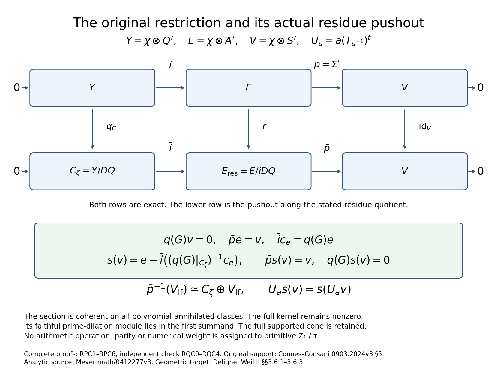
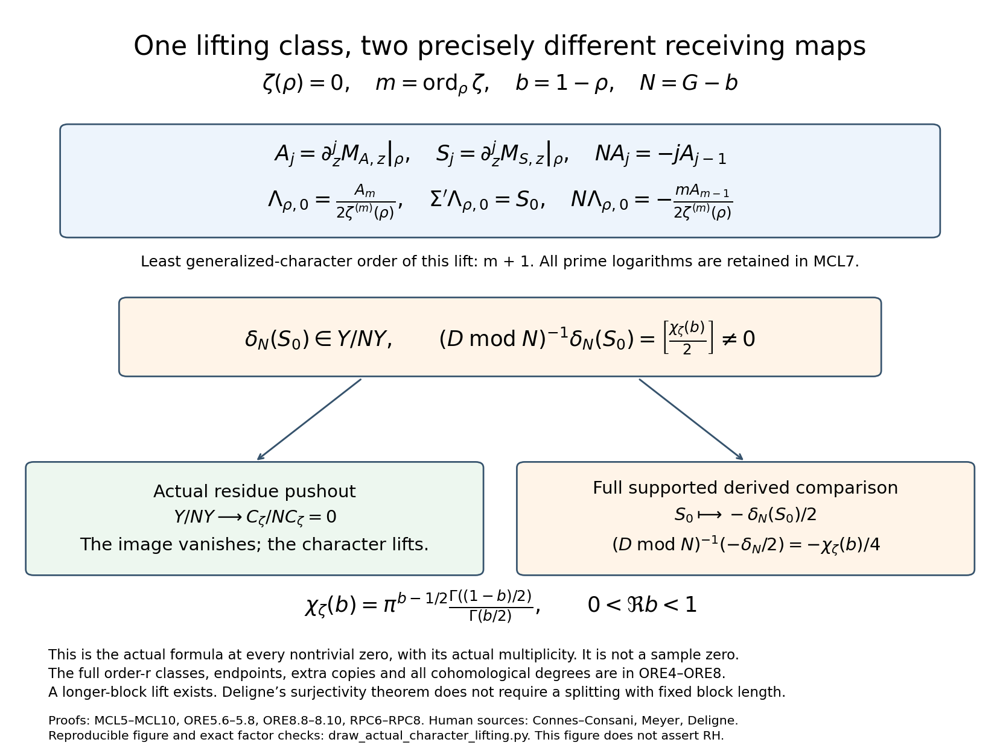

# The original character lift and its complete supported return

Figure 1. Both exact rows, the actual pushout, its cochain placement and the coherent full-group-equivariant section are proved in [RPC1–RPC5](ACTUAL_RESIDUE_PUSHOUT_AND_CHARACTER_LIFTING.md), independently checked in [RQC0–RQC3](ACTUAL_RESIDUE_PUSHOUT_INDEPENDENT_CHECK.md). Every polynomial inverse is the earlier constructed operator on the actual C_zeta. The full prime-dilation kernel remains. The source Z_0, primitive Z_1/tau and integer Z_2 keep their original definitions and retractions; the diagram operates on the constructed receiving spaces.

Figure 2. This is an exact formula at every actual nontrivial zero, with its actual multiplicity m, not a numerical example or an assumed multiple zero. [MCL5–MCL10](ORIGINAL_MELLIN_CHARACTER_LIFTING.md) proves the least lift order and every real/prime action. [ORE5.6–ORE5.8 and ORE8.8–ORE8.10](ORIGINAL_RESTRICTION_EXTENSION_AND_DELIGNE_CROSS.md) proves the full higher-jet class and its actual supported return. [RPC6–RPC8](ACTUAL_RESIDUE_PUSHOUT_AND_CHARACTER_LIFTING.md) gives both exact receiving maps. The complete Gamma multiplier, raw derivative coefficients and signs remain in those formulas. All other cohomological degrees, four endpoint lines, and both complete extra closed copies remain in ORE8.7.

Reproducible vector/raster source: draw_actual_character_lifting.py. Both final PNGs were inspected. Its 105 exact rational checks verify finite instances of the general lift, generator, connecting-rank and residue-transport formulas; they supplement the complete proofs and are not numerical tests of RH.

Human sources: Alain Connes and Caterina Consani, [0903.2024v3 §5](https://arxiv.org/abs/0903.2024v3); Ralf Meyer, [math/0412277v3, The spectral interpretation](https://arxiv.org/abs/math/0412277v3); Pierre Deligne, [Weil II §§3.6.1–3.6.3](https://www.numdam.org/item/PMIHES_1980__52__137_0/). Author-source identities and the explicitly identified French transcription of Deligne are recorded with exact reading coverage in the source ledger. No geometric weight-separation or RH conclusion is supplied by these diagrams.
