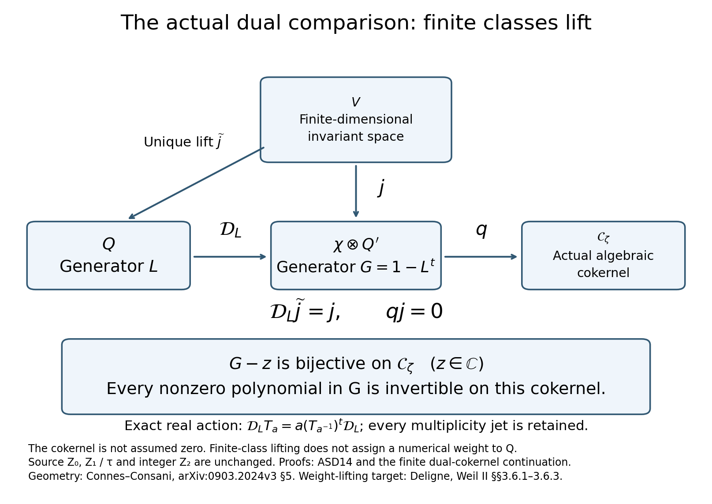
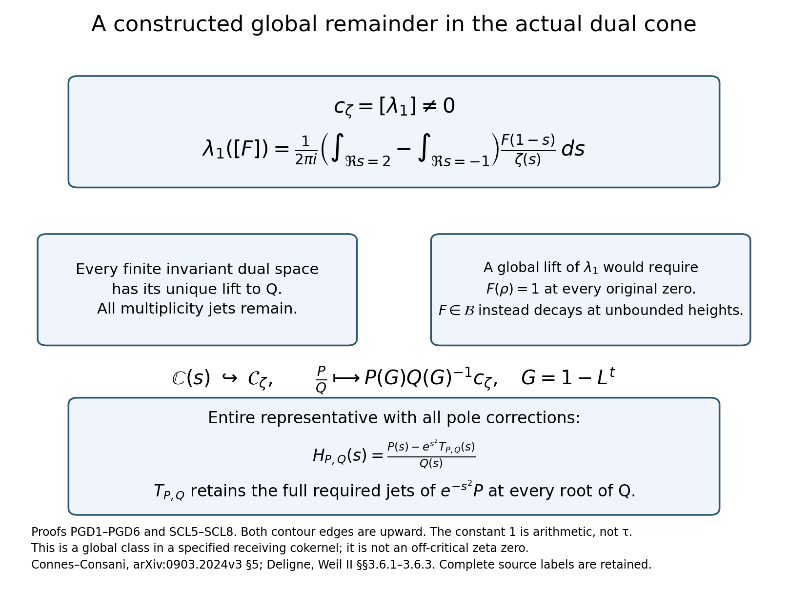

# Illustrations of the actual dual-comparison continuation

Figure 1. Complete proofs: [SCL2–SCL9](SPECTRAL_COKERNEL_DIVISIBILITY_AND_FINITE_LIFTING.md) and [DPL1–DPL9](DUALITY_COKERNEL_POLYNOMIAL_LIFTING_INDEPENDENT.md). The actual target is the character-a-twisted continuous dual, with generator G=1−L^t. The upper space is finite-dimensional and invariant for the specified receiving action; its lift is unique. The whole algebraic cokernel is retained. This picture assigns no weight or parity to primitive tau.

Figure 2. Complete proof: [PGD1–PGD6](GLOBAL_POLYNOMIAL_DUAL_DEFECT.md); independent verification [PGC0–PGC7](GLOBAL_POLYNOMIAL_DUAL_DEFECT_INDEPENDENT_CHECK.md). Both contour edges point upward. All original-zeta factors, multiplicity jets, and the rational representative's entire correction are retained. The polynomial T has the exact prescribed derivatives of orders 0 through k−1 at every denominator root of multiplicity k. The arithmetic constant1 is not primitive tau. The class is not a claimed RH counterexample.

Reproducible sources: check_and_draw_finite_dual_lift.py, with SVG files beside these PNGs. The 36 finite symbolic checks supplement the complete global analytic proofs. Both final figures were inspected and their spacing corrected.

Human sources: Alain Connes and Caterina Consani, [Schemes over F1 and zeta functions](https://arxiv.org/abs/0903.2024v3), §5; Ralf Meyer, [Spectral interpretation](https://arxiv.org/abs/math/0412277v3); Pierre Deligne, [Weil II](https://www.numdam.org/item/PMIHES_1980__52__137_0/), §§3.6.1–3.6.3; Hadamard's product through the indexed original [Connes treatment](https://arxiv.org/abs/2602.04022v1). Exact versions, source files and actual reading coverage remain in SOURCE_READING_USE_PRIVATE.json.
