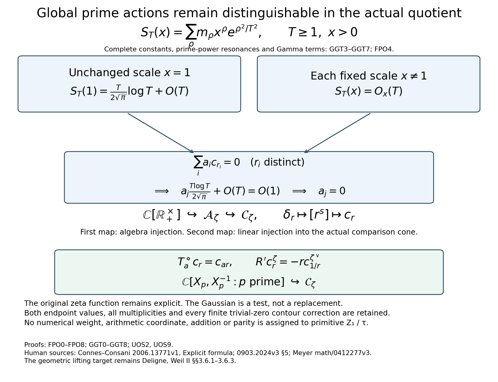
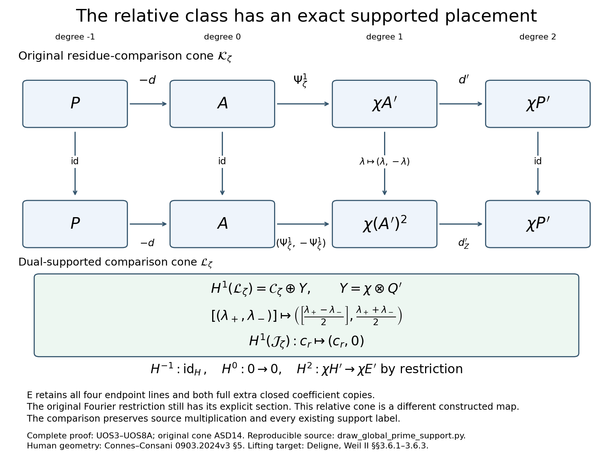

# Global prime action and the exact supported map

Figure 1. Complete proofs: [GGT0–GGT8](GLOBAL_GAUSSIAN_ORIGINAL_ZETA_TRACE.md), [FPO0–FPO8](FAITHFUL_GLOBAL_PRIME_ORBIT.md), independently verified in [FPC0–FPC6](FAITHFUL_GLOBAL_PRIME_ORBIT_INDEPENDENT_CHECK.md). These are proved asymptotic statements for each fixed positive scale and the original full zero multiset, not a numerical plot. FPO4 retains the complete next constants, prime-power resonances, both endpoints and the Gamma integral. The group algebra first injects as an algebra into the multiplier quotient, then linearly into the actual comparison cokernel. The full target cokernel is not supplied with an invented multiplication.

Figure 2. Complete proof: [UOS3–UOS8A](GLOBAL_UNIT_ORBIT_AND_SUPPORTED_COMPARISON.md), with original full cone [ASD14](ACTUAL_SUPPORTED_DUALITY_INDEPENDENT.md). Every degree, sign and half-factor is retained. The chain map is identity in degrees−1,0,2 and anti-diagonal in degree1. Its cohomology map is identity on H, injective c↦(c,0) on the global relative cokernel, and the exact restriction χH′→χE′. All four endpoint lines and both full extra closed coefficient copies survive in E. The existing original Fourier restriction still has its constructed section. No numerical weight is assigned by the illustration.

Reproducible vector and raster source: draw_global_prime_support.py. Both final PNGs were inspected. Seven exact symbolic factor and chain checks supplement the complete analytic and coefficient proofs. Source Z_0, Z_1/tau and Z_2 keep the current user definitions and retractions.

Human sources: Alain Connes and Caterina Consani, [2006.13771v1, Appendix Explicit formula](https://arxiv.org/abs/2006.13771v1) and [0903.2024v3 §5](https://arxiv.org/abs/0903.2024v3); Ralf Meyer, [math/0412277v3](https://arxiv.org/abs/math/0412277v3). The geometric lifting target is Pierre Deligne, [Weil II §§3.6.1–3.6.3](https://www.numdam.org/item/PMIHES_1980__52__137_0/). Exact source versions and actual reading coverage remain in SOURCE_READING_USE_PRIVATE.json.
