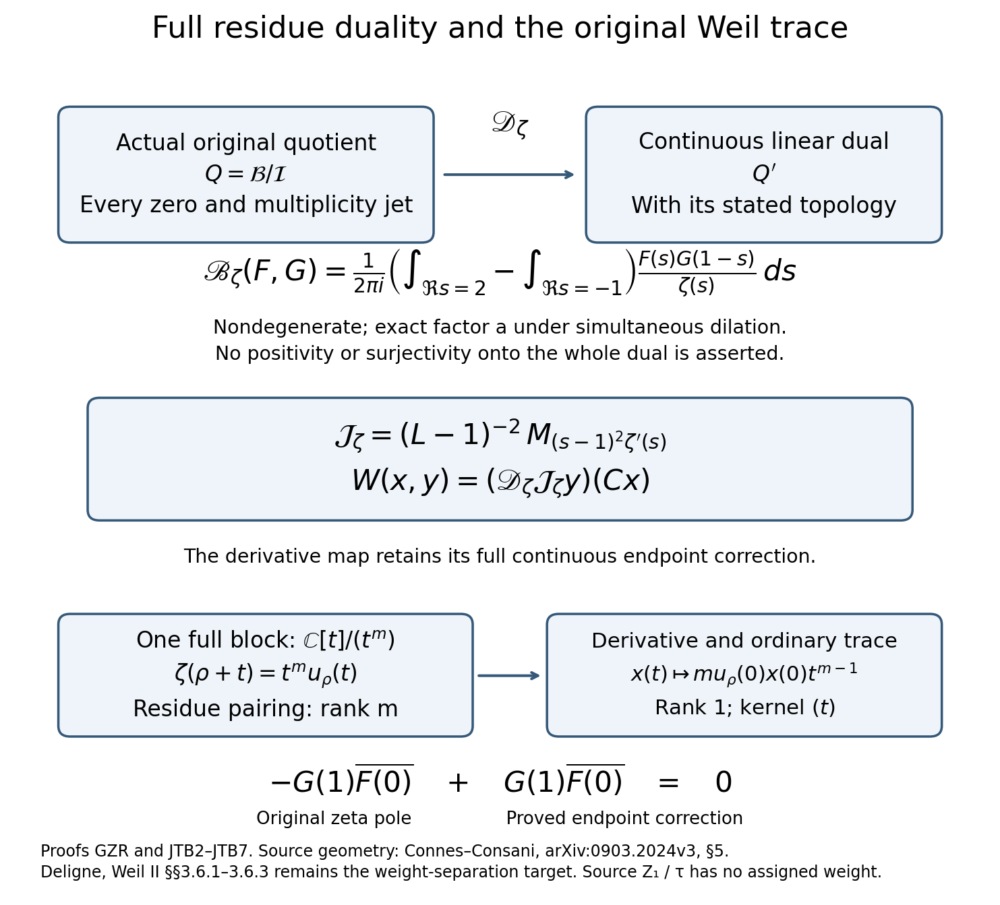

# Original-zeta derivative, full residue duality and the Weil trace

24 September 2026. Complete derivation JTB0–JTB8. This calculation continues the actual supported quotient used by Connes–Consani, with the source comparison DCP retained. It constructs the exact map from the full-multiplicity contour pairing to the ordinary Weil form. It proves neither positivity nor numerical purity.

## JTB0. Source, prerequisites and provenance

The complete preserved user arguments USR-9ad1c0a2d09dba92, USR-f55d16feb948d8c2 and USR-6152e3bc6302258c, and the current prerequisite instruction USR-4322be19bff532cd, were reread for this calculation. They remain in user_corpus_private/USER_MESSAGES.jsonl. The source data and retractions are B1–B5 and R1 in the retained SOURCE_OPERATIONS_AND_PROOFS.md. These references locate the complete arguments; they do not replace them.

The source remains \(Z_0\) absence, \(Z_1\) presence \(\tau\) without \(Z_2\) parity, and the distinct arithmetic layer with its original integer amounts. There is no source \(\tau\) addition. Complex linear operations below occur on the already constructed receiving spaces, after the programme's arithmetic reconstruction. A numerical character of a receiving prime action is not a weight assigned to primitive \(\tau\).

Alain Connes and Caterina Consani's [Schemes over F1 and zeta functions, arXiv:0903.2024v3](https://arxiv.org/abs/0903.2024v3), original author file announc3.tex, §5, provides the sheaf, summation restrictions, Fourier graph and supported spectral quotient. Its source labels are restmaps, bord, hzero, compinv, lemreasspec and court. The present reading covered source lines1461–1668. Ralf Meyer's [A spectral interpretation for the zeros of the Riemann zeta function, math/0412277v3](https://arxiv.org/abs/math/0412277v3), original Meyer.tex, the:Zeta_estimate and the:Lap_range, provides the source closed-image and range results. The programme's exact version, including both signs and the full original multiplier, is SSI1–SSI6 and OMS.

Pierre Deligne's [La conjecture de Weil II](https://www.numdam.org/item/PMIHES_1980__52__137_0/), §§3.6.1–3.6.3, printed pp.212–214, supplies the lifting argument being sought. The local text read here is the French transcription S20_FR_record_export.tex, lines2468–2592, not established author TeX. Its perfect supported duality and proper weight bounds are not inferred from the existence of the pairing below.

The Hadamard product used in JTB4 is the retained complete product S2.6, with attribution there to Jacques Hadamard. The indexed original author source read again here is Alain Connes, [The Riemann Hypothesis: Past, Present and a Letter Through Time, arXiv:2602.04022v1](https://arxiv.org/abs/2602.04022v1), rhready.tex lines501–546, canonical source PUBUNIT-171DAC50D1C3B7A2438B39AE. The complete genus-one statement at lines526–535 is used; its later symmetric-product presentation does not replace the original formulas below. The new calculation is the global derivative operator, its full endpoint return, and the exact factorization through the newly constructed contour pairing. Finite-dimensional residue/trace identities are established algebra; no historical novelty is claimed for them. Earlier programme local residue calculations remain credited in BOUNDARY_DEFECTS_AND_ARITHMETIC_RETURN.tex, especially its cotangent/residue calculation, and the pinned [TAU_BASE_MODEL §6](https://github.com/KokunoYumeto/zeta-function-research-reader/blob/4ba9285b66af58a6d58fc502a494c1fb45ca5b79/workbenches/tau-base-cohomology/TAU_BASE_MODEL.md#L265-L322). Only that earlier receiving residue algebra is used: its older source-absorber notation is not imported as the current primitive \(Z_1/\tau\) definition.

## JTB1. Every receiving object and map used here

Let \(\mathcal B\) be the entire functions with all seminorms
\[
b_{A,M}(F)=\sup_{|\sigma|\le A,t\in\mathbb R}
(1+|t|)^M|F(\sigma+it)|<\infty,
\qquad A,M\in\mathbb Z_{\ge0}.
\tag{JTB1.1}
\]
Let \(\mathscr Z\) be the actual nontrivial zeros of the original \(\zeta\), with their original multiplicities \(m_\rho\). Set
\[
\mathcal I=\{F\in\mathcal B:F^{(j)}(\rho)=0
\text{ for every }\rho\in\mathscr Z,\ 0\le j<m_\rho\},
\qquad Q=\mathcal B/\mathcal I.
\tag{JTB1.2}
\]
Continuous jet evaluation makes \(\mathcal I\) closed. The topology on \(Q\) is this Fréchet quotient topology. SSI proves its exact identification with the original summation cokernel, not an unrestricted product of formal jets. DCP constructs its source-supported realization; all faithful extra closed coefficients remain in that comparison.

The continuous operators on \(\mathcal B\) and their descended operators are
\[
LF=sF,\qquad T_aF(s)=a^sF(s)\quad(a>0),
\qquad RF(s)=F(1-s),\qquad CF(s)=\overline{F(\bar s)}.
\tag{JTB1.3}
\]
Here \(C\) is conjugate-linear. Multiplication by \(s\) and \(a^s\) preserves every vanishing order. The original functional equation and real Dirichlet coefficients, with unique continuation, prove that \(R\) and \(C\) preserve \(\mathcal I\). The operators retain their displayed constants. In particular \(T_aR=aRT_{a^{-1}}\).

Retain the complete source transform
\[
F_*(s)=\frac{s(s-1)}8\pi^{-s/2}\Gamma(s/2)\zeta(s),
\quad F_*(0)=F_*(1)=\frac18,
\tag{JTB1.4}
\]
\[
b_1=8F_*'(1)=1+\frac\gamma2-\frac12\log(4\pi).
\tag{JTB1.5}
\]
This transform is an auxiliary element of the actual summation image, not a replacement of \(\zeta\). Its values at the trivial zeros are retained in GER1.6. GER2 constructs the continuous inverse of \(L-1\) on \(Q\), with representative
\[
\mathscr S_1F(s)=\frac{F(s)-8F_*(s)F(1)}{s-1}.
\tag{JTB1.6}
\]
The numerator has a removable zero at1. All expressions using this inverse below have this already constructed domain and endpoint return.

For a function \(H\) integrable on the two vertical edges, write
\[
\mathfrak C(H)=\frac1{2\pi i}
\left(\int_{2-i\infty}^{2+i\infty}H(s)\,ds
-\int_{-1-i\infty}^{-1+i\infty}H(s)\,ds\right).
\tag{JTB1.7}
\]
Both integrals run upward. Their difference is the positive rectangle orientation after horizontal sides have been justified. The full pairing constructed in GZR is
\[
\mathscr B_\zeta([F],[G])
=\mathfrak C\!\left(\frac{F(s)G(1-s)}{\zeta(s)}\right).
\tag{JTB1.8}
\]
GZR proves convergence, continuity, descent and nondegeneracy with every original zero jet retained. It does not assert a positive form or a topological isomorphism with the entire continuous dual. The proof below uses exactly that pairing.

## JTB2. The full original derivative defines a continuous quotient operator

The function
\[
A_\zeta(s)=(s-1)^2\zeta'(s)
\tag{JTB2.1}
\]
is entire. Its value at1 is \(-1\), because the original pole has residue1. It and its derivatives have polynomial growth on each bounded vertical strip. Here is an explicit bound prerequisite. For an integer \(K\ge1\), repeated integration by parts in Euler summation gives, on \(\Re s>1-2K\),
\[
\zeta(s)=\frac1{s-1}+\frac12+
\sum_{k=1}^{K}\frac{B_{2k}}{(2k)!}(s)_{2k-1}
-\frac{(s)_{2K}}{(2K)!}
\int_1^\infty\widetilde B_{2K}(x)x^{-s-2K}\,dx.
\tag{JTB2.2}
\]
Here \((s)_r=s(s+1)\cdots(s+r-1)\), \((s)_0=1\), and \(\widetilde B_{2K}\) is the bounded periodic Bernoulli polynomial. To obtain this formula, apply the finite Euler summation formula to \(x^{-s}\) on \([1,N]\); its \(r\)-th derivative is \((-1)^r(s)_rx^{-s-r}\). For \(\Re s>1\) all upper boundary terms tend to zero, giving the displayed sign and factors. The remainder integral is locally uniformly convergent on \(\Re s>1-2K\), which extends the equality by the identity theorem. Differentiation inserts \(-\log x\) in the integral. On a fixed strip with \(2K>1+A\), both integrals are uniformly bounded by constants times
\(\int_1^\infty(1+\log x)x^{A-2K}\,dx<\infty\).
The other factors are polynomials in \(s\), apart from the displayed pole. Multiplication by \((s-1)^2\) removes that pole in \(\zeta'\). This proves the asserted strip bound. Higher derivatives follow by further logarithms with the same convergence margin.

It follows that multiplication \(M_{A_\zeta}:\mathcal B\to\mathcal B\) is continuous: for each \(A,M\), a polynomial bound of degree \(d_A\) gives
\[
b_{A,M}(A_\zeta F)\le C_A b_{A,M+d_A}(F).
\tag{JTB2.3}
\]
Since \(A_\zeta\) is entire, this multiplication preserves \(\mathcal I\). Hence the operator
\[
\boxed{\mathcal J_\zeta=(L-1)^{-2}M_{A_\zeta}:Q\longrightarrow Q}
\tag{JTB2.4}
\]
is constructed and continuous. It commutes with \(L\) and every \(T_a\). On each original zero germ it is exactly multiplication by \(\zeta'(s)\): the factor \((s-1)^2\) is invertible there. This assertion is local identification of the already constructed global operator, not a replacement of it by arbitrary interpolation.

## JTB3. The representative, both pole coefficients, and every endpoint term

Apply \(\mathscr S_1\) twice to \(A_\zeta G\). Since
\[
(A_\zeta G)(1)=-G(1),\qquad
(A_\zeta G)'(1)=-G'(1),
\tag{JTB3.1}
\]
the exact result is
\[
\boxed{
\mathscr J_\zeta G(s)=\zeta'(s)G(s)
+\frac{8F_*(s)}{(s-1)^2}
\bigl[G(1)+(s-1)(G'(1)-b_1G(1))\bigr].}
\tag{JTB3.2}
\]
Indeed the first division is \((A_\zeta G+8F_*G(1))/(s-1)\), whose value at1 is \(-G'(1)+b_1G(1)\). The second subtraction gives exactly (JTB3.2). The two applications of the continuous entire operator \(\mathscr S_1\) prove that the displayed meromorphic expression is an element of \(\mathcal B\). No undefined value of \(\zeta'(1)\) is used.

For explicit checking, put \(h=s-1\) and use the original Stieltjes convention
\(\zeta(1+h)=h^{-1}+\gamma-\gamma_1h+\gamma_2h^2/2+\cdots\).
Then
\[
\zeta'(1+h)G(1+h)
=-G(1)h^{-2}-G'(1)h^{-1}
-\tfrac12G''(1)-\gamma_1G(1)+O(h).
\tag{JTB3.3}
\]
The correction in (JTB3.2) contributes
\(G(1)h^{-2}+G'(1)h^{-1}\), with both coefficients unchanged, and its constant term is
\(b_1G'(1)+(4F_*''(1)-b_1^2)G(1)\).
Consequently
\[
\mathscr J_\zeta G(1)=-\tfrac12G''(1)+b_1G'(1)
+(4F_*''(1)-b_1^2-\gamma_1)G(1).
\tag{JTB3.4}
\]
The derivative \(F_*''(1)\) denotes the derivative of the full product (JTB1.4), with its removable value. It is not dropped or replaced by a scale choice.

At zero and at every original trivial zero the exact values are obtained without deleting the correction:
\[
\mathscr J_\zeta G(z)=\zeta'(z)G(z)
+\frac{8F_*(z)}{(z-1)^2}
\bigl[G(1)+(z-1)(G'(1)-b_1G(1))\bigr],
\quad z=0,-2,-4,\ldots.
\tag{JTB3.5}
\]
In particular the term involving \(F_*(-2r)\ne0\) is retained. These are values of the chosen source representative; endpoint evaluation is not asserted to be a well-defined functional on \(Q\).

## JTB4. A global logarithmic-derivative contour identity

For every \(\Phi\in\mathcal B\),
\[
\boxed{\mathfrak C\!\left(\Phi\frac{\zeta'}\zeta\right)
=\sum_{\rho\in\mathscr Z}m_\rho\Phi(\rho)-\Phi(1).}
\tag{JTB4.1}
\]
All integrals and the sum in this identity converge absolutely. This is proved directly, without choosing an infinite sequence of contours close to unknown zeros.

Use the complete Hadamard product S2.6, with every exponential factor. Its logarithmic derivative is
\[
\frac{F_*'(s)}{F_*(s)}
=b_0+\sum_\rho m_\rho\left(\frac1{s-\rho}+\frac1\rho\right),
\quad b_0=\tfrac12\log(4\pi)-1-\tfrac\gamma2.
\tag{JTB4.2}
\]
Compact convergence follows from \(\sum m_\rho|\rho|^{-2}<\infty\), established by the count \(n(R)\le C(R+2)^{3/2}\) in S2.5. On either vertical edge \(c=-1,2\), every \(|s-\rho|\ge1\). With \(R=|s|+2\), the terms with \(|\rho|\le2R\) satisfy
\[
\sum_{|\rho|\le2R}m_\rho
\left|\frac1{s-\rho}+\frac1\rho\right|
\le |s|\sum_{|\rho|\le2R}\frac{m_\rho}{|\rho|}
\le C R^{3/2}.
\tag{JTB4.3}
\]
The last estimate follows by splitting into dyadic annuli and using the same count; a fixed disk around zero is zero-free since \(F_*(0)\ne0\). For the remaining terms, \(|s-\rho|\ge|\rho|/2\), so their sum is bounded by
\(2|s|\sum_{|\rho|>2R}m_\rho|\rho|^{-2}\le C R^{1/2}\).
Thus the sum of absolute values on each edge has polynomial growth. Rapid decrease of \(\Phi\) justifies exchanging the edge integrals and the sum.

For one fixed \(\rho\), the contour difference of
\(\Phi(s)(1/(s-\rho)+1/\rho)\) equals \(\Phi(\rho)\). This follows from a finite rectangle and the vanishing of its horizontal integrals as its height tends to infinity. The constant term has zero contour difference. The zero sum is absolutely convergent by rapid decrease and S2.5. Therefore
\[
\mathfrak C(\Phi F_*'/F_*)=\sum_\rho m_\rho\Phi(\rho).
\tag{JTB4.4}
\]
The original factor comparison, with all derivatives present, is
\[
\frac{F_*'}{F_*}=
\frac{\zeta'}\zeta+\frac1s+\frac1{s-1}
-\frac12\log\pi+\frac12\psi(s/2).
\tag{JTB4.5}
\]
Here \(\psi=\Gamma'/\Gamma\). At0 the poles of \(1/s\) and \(\psi(s/2)/2\) cancel exactly. The remaining multiplier derivative has in the strip \(-1\le\Re s\le2\) only the simple pole at1, of residue1. It has polynomial growth on the two edges and horizontal edges at large height. One can check the growth directly from
\(\psi(z)=-\gamma+\sum_{n\ge0}(1/(n+1)-1/(n+z))\): split at \(n=2|z|+2\), and use the recurrence to shift the bounded real strip away from its poles. The tail is \(O(1)\), while the initial terms have a polynomial bound. Rapid decrease of \(\Phi\) therefore permits the contour shift, giving exactly \(\Phi(1)\). Subtracting this contribution from (JTB4.4) proves (JTB4.1). The term \(-\Phi(1)\) is the original zeta pole and is essential.

## JTB5. Exact global factorization of the Weil form

The previously established reflected Weil form is
\[
W([F],[G])=\sum_\rho m_\rho\,
\overline{F(1-\bar\rho)}G(\rho).
\tag{JTB5.1}
\]
It is conjugate-linear in \(F\), linear in \(G\), continuous, and retains the actual zero multiplicities. The following exact identity holds on the entire original quotient:
\[
\boxed{W(x,y)=\mathscr B_\zeta(\mathcal J_\zeta y,Cx).}
\tag{JTB5.2}
\]

**Proof.** Divide (JTB3.2) by the original \(\zeta\), keeping the complete multiplier (JTB1.4):
\[
\frac{\mathscr J_\zeta G(s)}{\zeta(s)}
=\frac{\zeta'(s)}{\zeta(s)}G(s)
+s\pi^{-s/2}\Gamma(s/2)
\left[\frac{G(1)}{s-1}+G'(1)-b_1G(1)\right].
\tag{JTB5.3}
\]
Multiply by \((CF)(1-s)=\overline{F(1-\bar s)}\). For the first summand, (JTB4.1), applied to \(\Phi(s)=G(s)(CF)(1-s)\), gives
\[
W([F],[G])-G(1)\overline{F(0)}.
\tag{JTB5.4}
\]
For the second summand, \(s\Gamma(s/2)=2\Gamma(1+s/2)\) is holomorphic on the whole closed strip. Its only remaining pole there is \(1/(s-1)\). At1 the coefficient \(s\pi^{-s/2}\Gamma(s/2)\) equals1. Thus the residue is exactly
\[
G(1)\overline{F(0)}.
\tag{JTB5.5}
\]
The Gamma recurrence and its integral, or its full strip estimate used in SSI3, give polynomial growth away from bounded heights. The other factors decrease rapidly, so both horizontal integrals vanish. This proves (JTB5.5) as a contour equality. Equations (JTB5.4) and (JTB5.5) cancel these two explicitly retained contributions and prove (JTB5.2). No endpoint functional is taken on an unspecified quotient class: both terms belong to the chosen representatives and disappear only in their proved sum. ∎

The apparent local loss in the ordinary trace therefore has a complete global operator, \(\mathcal J_\zeta\), and a continuous source representative. It is not described merely by forgetting derivatives.

## JTB6. All multiplicity jets and the exact kernel

At an actual zero \(\rho\) of multiplicity \(m\), set \(t=s-\rho\) only in its receiving germ and write
\[
\zeta(\rho+t)=t^m u_\rho(t),\qquad
u_\rho(t)=\sum_{r\ge0}
\frac{\zeta^{(m+r)}(\rho)}{(m+r)!}t^r,
\quad u_\rho(0)\ne0.
\tag{JTB6.1}
\]
The full primary quotient is \(\mathbb C[t]/(t^m)\), identified by RZ's actual continuous projector and source representatives, not by changing the full quotient topology. The derivative operator there is
\[
\mathcal J_\zeta x(t)
=\bigl(mt^{m-1}u_\rho(t)+t^m u_\rho'(t)\bigr)x(t)
=m u_\rho(0)x(0)t^{m-1}\pmod{t^m}.
\tag{JTB6.2}
\]
The first equality retains the whole original derivative. The second is proved by the displayed ideal \((t^m)\); no term is discarded outside that stated quotient.

Every block has rank1 under \(\mathcal J_\zeta\). For \(m=1\), this is the nonzero scalar \(\zeta'(\rho)\). For \(m>1\), its kernel is precisely the ideal \((t)\), and its image is the one-dimensional socle \(\mathbb C t^{m-1}\). Its square is zero on these multiple-zero blocks because \(2m-2\ge m\). These statements do not assert the existence of any actual multiple zero.

Since the full collection of original jet maps separates \(Q\), equation (JTB6.2) proves the global equality
\[
\boxed{\ker\mathcal J_\zeta
=\{[F]\in Q:F(\rho)=0\text{ for every }\rho\}
=\operatorname{rad}W.}
\tag{JTB6.3}
\]
The final equality also follows from (JTB5.2), nondegeneracy of \(\mathscr B_\zeta\), and bijectivity of \(C\). The exact range is the actual subspace \(\mathcal J_\zeta Q\) of \(Q\). It is not asserted to be an unrestricted product of block socles or a closed subspace.

For a finite block, the residue identity behind the factorization is
\[
\operatorname{Res}_{s=\rho}
\frac{\zeta'(s)F(s)G(1-s)}{\zeta(s)}\,ds
=mF(\rho)G(1-\rho).
\tag{JTB6.4}
\]
Indeed \(\zeta'/\zeta=m/t+u_\rho'/u_\rho\); the second summand is holomorphic. This proves both the factor \(m\) and the precise higher-jet kernel without a simplicity assumption.

## JTB7. Exact prime action and the constructed dual map

Define the continuous linear-dual map associated with the full contour pairing by
\[
\mathscr D_\zeta:Q\longrightarrow Q',\qquad
(\mathscr D_\zeta y)(z)=\mathscr B_\zeta(y,z).
\tag{JTB7.1}
\]
The prime action on \(Q'\) is the contragredient
\((T_a^\vee\ell)(z)=\ell(T_{a^{-1}}z)\). GZR proves that \(\mathscr D_\zeta\) is injective, continuous for the strong dual topology, and has weak-* dense image. No surjectivity onto \(Q'\) is assumed. The exact character is
\[
\mathscr D_\zeta T_a=aT_a^\vee\mathscr D_\zeta,
\qquad
\mathscr D_\zeta L=(1-L^t)\mathscr D_\zeta,
\tag{JTB7.2}
\]
where \(L^t\ell(z)=\ell(Lz)\). The first follows by moving \(T_a\) to the other argument in
\(\mathscr B_\zeta(T_ay,T_az)=a\mathscr B_\zeta(y,z)\).
The second follows in the original integral from \(s+(1-s)=1\).

The conjugate-linear first argument of the Weil form is accounted for by the explicitly constructed \(C\):
\[
W(x,y)=(\mathscr D_\zeta\mathcal J_\zeta y)(Cx).
\tag{JTB7.3}
\]
Thus the full diagram retains both the nondegenerate residue map and the generally degenerate trace map. All operations occur in the receiving complex spaces; neither dualization nor the scalar \(a\) assigns parity or a numerical coordinate to \(\tau\).

Under the exact source-space comparison \(\mathcal T k(u)=2u^{-1/2}k(u)\), the raw Mellin transform satisfies \(\mathcal M_0\mathcal T k=2\mathcal Mk\). Consequently the same displayed contour expression on two raw images is exactly four times the centered expression. This factor follows from bilinearity and is retained in the comparison to the original CC coefficient complex.

## JTB8. Consequence for the active lifting calculation

Figure 1. The upper arrow is the constructed nondegenerate dual injection; the derivative operator gives the exact Weil trace map. The lower row displays its full primary-block rank and the proved endpoint cancellation. The integrals run upward on both displayed vertical lines before their difference is taken. Complete proofs: GZR2–GZR8 and JTB2–JTB7. The two different roles of the pairing and trace are connected by (JTB5.2), not by identifying their kernels. Reproducible source: check_and_draw_residue_bridge.py. Human source geometry: Connes–Consani §5; geometric weight target: Deligne §§3.6.1–3.6.3.

The receiving obstruction space has an actual dual map compatible with all positive real actions and therefore every retained prime action. Its full residue pairing detects all multiplicity jets. The map to the ordinary Weil form is exactly the original derivative operator, with the pole at1 and all Gamma correction factors handled by (JTB3.2)–(JTB5.5). This supplies an exact comparison that the unproved identification of a raw integral pairing with the quotient did not supply.

The character \(a\) in (JTB7.2) alone is not Deligne's strict weight separation. On an actual \(\rho\)-block, the action remains
\[
T_a=a^\rho\sum_{j=0}^{m_\rho-1}
\frac{(\log a)^j}{j!}N_\rho^j.
\tag{JTB8.1}
\]
Its paired block is \(1-\rho\); the twisted contragredient has the same character as its input under (JTB7.2). This is the computed exact map, not a hypothesis about a hypothetical altered prime spectrum. The full source reconstruction is unchanged.

Deligne's §3.6 instead uses both a geometric identification of the support term with \(H^{2N-i-1}(X_s)^\vee(-N)\) and proper geometric bounds to place it in weights at least \(i+1\), while the classes to lift have weights at most \(i\). Neither inequality follows from a bilinear similitude alone. The present calculation therefore establishes the duality/trace comparison on the actual receiver and keeps the full tau weight-separation goal active. It makes no claim that the primitive source forbids a further geometric comparison, or that the user's whole-spectrum argument has been contradicted.

## Full global prime action and actual supported placement

The new complete proofs GGT0–GGT8, FPO0–FPO8 and UOS0–UOS9 (including UOS8A) strengthen the preceding global remainder calculation. The original-zeta Gaussian trace has a TlogT leading term only at the identity scale and at most order T at every other fixed positive scale. Testing a proposed finite relation against every inverse scale proves all coefficients zero. Consequently the entire finite group algebra C[R_+^×], including the Laurent algebra of all original primes, injects into the original multiplier quotient and linearly into the actual comparison cokernel. This computes relations after the actual zero-jet quotient, not only among entire functions before quotienting.

UOS constructs the full chain map into the actual dual-supported comparison cone. It sends c_r to (c_r,0), acts identically on H, and restricts χH′ to χE′ with every endpoint and extra closed copy retained. Its companion mirror is c_r→−r c_(1/r) with the companion denominator; the oriented global-dual mirror has the opposite sign. The ordinary Fourier restriction still has its explicit section. Thus the new classes are relative residue-representation classes with proved supported placement, not a claimed failure of that existing Fourier lift. The source Z_0, Z_1/tau and integer Z_2 have not changed, and the full numerical weight-separation target remains active.

The original Connes–Consani explicit formula has been applied with a proved cutoff extension; the exact archimedean comparison is W_R(f_T,x)=A_T(x)+1, retaining the endpoint at zero and every finite trivial-zero contour correction. Complete human citations, author-source archive and bounded reading coverage are recorded with these proofs. All complete proof bodies and inspected reproducible diagrams are in the cumulative TeX.
