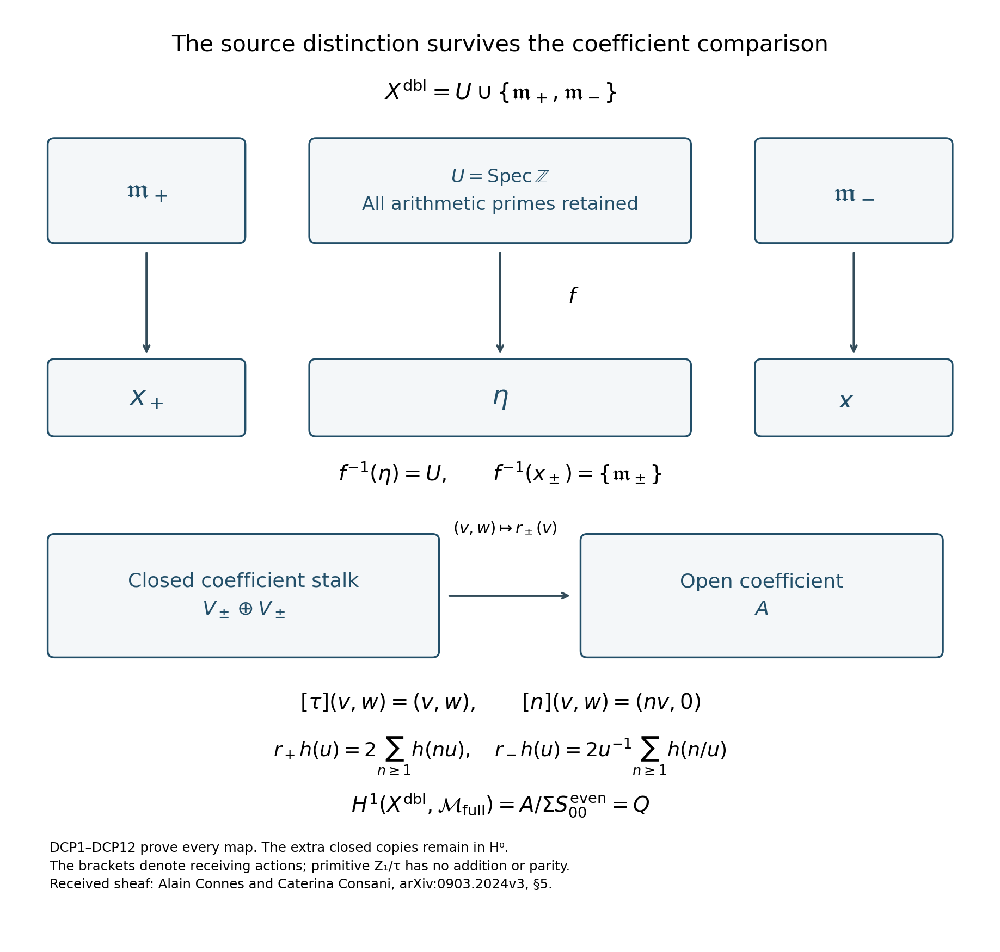
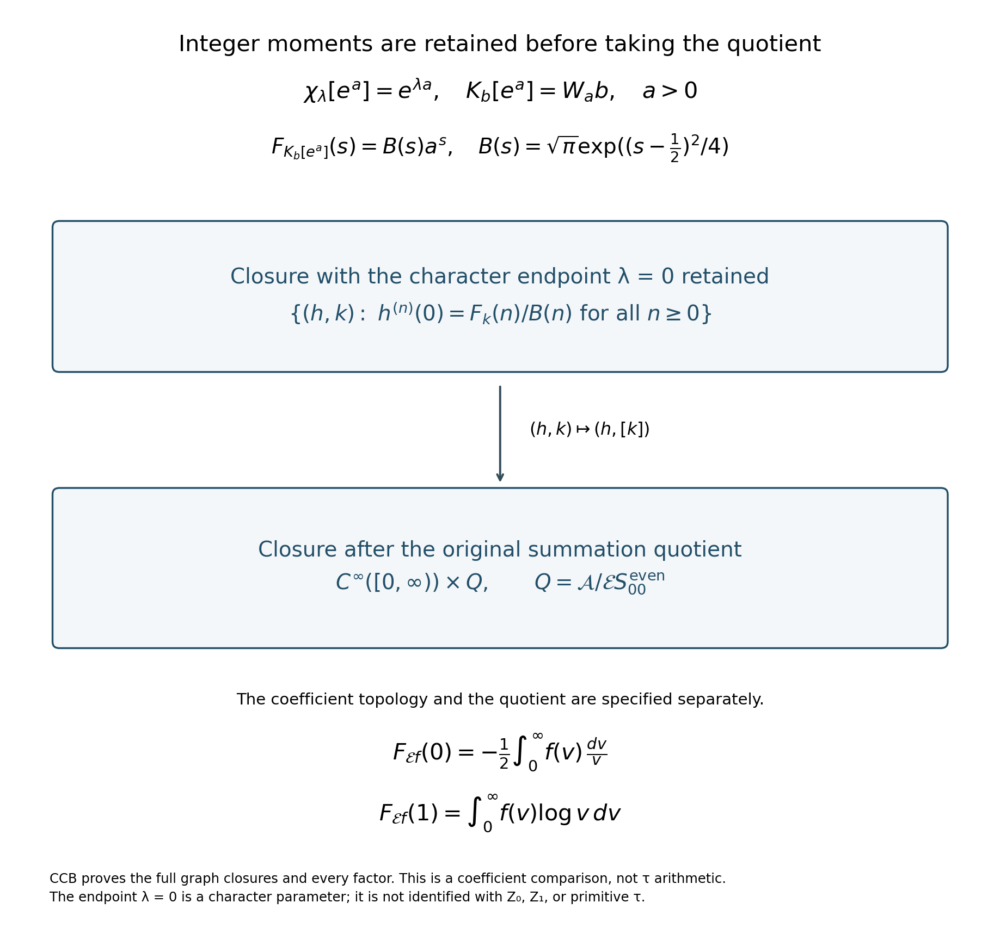

# Source comparison, complete coefficients, and the retained boundary

24 September 2026. A continuation of the actual τ lifting calculation. The four complete proofs following this introduction are CGS, DCP, OMS and CCB. Earlier synthesis and primary-projector results are credited where used, rather than presented as new discoveries.

The user's notation remains \(Z_0\) for absence, \(Z_1\) for primitive presence \(\tau\) without \(Z_2\) parity, and \(Z_2\) for the retained parity data on the specified integer layer. Addition on \(\tau\) was retracted. None is reinstated here. The complete verbatim corpus and its corrections govern the construction; CORPUS_AND_OPERATION_RULES.md records the relevant reading for each receiving calculation. The full reconstructed arithmetic precedes the coefficient operations in this document.

## The concrete source-to-coefficient construction

CGS proves the gluing classification for every module sheaf on the already constructed source receiving space. Its exact datum is
\[
(\mathcal G,A_+,A_-,r:A_+\longrightarrow\Gamma(U,\mathcal G)),
\qquad U=\operatorname{Spec}\mathbb Z.
\]
The complete supported complex is
\[
A_-^\bullet\oplus\operatorname{Fib}
\left(A_+^\bullet\longrightarrow R\Gamma(U,\mathcal G^\bullet)\right).
\]
The inverse functor, all restrictions, the cone differential, and its connecting maps are proved in CGS1–CGS8. This is the concrete instance, with the additional receiving idempotents, of the sheaf gluing construction recalled by Pierre Deligne in [*La conjecture de Weil. II*, §3.4.8](https://www.numdam.org/item/PMIHES_1980__52__137_0/). His §3.6 weight argument remains a further geometric calculation; the gluing classification does not assume its weight inequalities.

DCP inserts an actual Connes–Consani coefficient sheaf into that datum. It doubles the source chart along its entire arithmetic open and constructs
\[
f:X^{\mathrm{dbl}}\longrightarrow Y=\{x_+,\eta,x_-\},
\qquad f^{-1}(\eta)=\operatorname{Spec}\mathbb Z,
\qquad f^{-1}(x_\pm)=\{\mathfrak m_\pm\}.
\]
The arithmetic primes remain distinct in this fibre. The sheaf \(\mathcal N=f^{-1}\Omega\) has chart spaces \(V_\pm=S_{00}^{\mathrm{even}}\oplus\mathbb C^2\), overlap \(A\), and the original restrictions
\[
r_+h(u)=2\sum_{n\ge1}h(nu),\qquad
r_-h(u)=2u^{-1}\sum_{n\ge1}h(n/u).
\]
Their complete domains, convergence, Fourier comparison and endpoint coordinates occur in DCP3. The human construction is Alain Connes and Caterina Consani, [*Schemes over \(\mathbb F_1\) and zeta functions*, §5](https://arxiv.org/abs/0903.2024v3). The original author TeX, lines 1376–1667, was read in full for this receiving calculation.

The inverse-image coefficient alone has the same action for source \(\tau\) and integer \(1\). DCP8 constructs the larger coefficient sheaf
\[
\mathcal M_{\mathrm{full}}
=\mathcal R^{\mathrm{dbl}}\otimes_{\underline{\mathbb Z}}\mathcal N
\cong\mathcal N\oplus(i_+)_*V_+\oplus(i_-)_*V_-.
\]
At a closed stalk this has the faithful source action
\[
[\tau](v,w)=(v,w),\qquad[n](v,w)=(nv,0).
\]
The bracketed operators act on constructed receiving modules. They are not equations assigning numerical coordinates or parity to primitive \(\tau\). The unital scalar-extension map and the distinguished source-integer map are both displayed and proved in DCP8; their difference is retained.

Figure 1. Exact sheaf and cochain diagram. Every arithmetic prime lies in the displayed fibre \(U\). The second closed-stalk components distinguish the source actions of \(\tau\) and integer \(1\); they remain in degree zero. The degree-one comparison is the original zeta quotient. Complete proofs: CGS1–CGS9 and DCP1–DCP12. Human source for the received coefficient complex: Connes–Consani, §5, cited above. This is a diagram of maps, not a metric or a picture of primitive \(\tau\).

## Actual summation, every zero jet, and the original factors

OMS receives the existing S/SSI synthesis proof into the present quotient and checks its comparison with Ralf Meyer, [*A spectral interpretation for the zeros of the Riemann zeta function*](https://arxiv.org/abs/math/0412277v3). It proves on the original domains
\[
\mathcal E S_{00}^{\mathrm{even}}
=\{k\in\mathcal A:F_k^{(j)}(\rho)=0
\text{ for every actual nontrivial zero }\rho,\ 0\le j<m_\rho\}.
\]
The image is closed and has the explicitly constructed continuous source inverse. The full joint zero-jet map of the actual quotient \(Q\) is therefore injective. Its image is a proper dense subspace of the unrestricted product of jets, with a strictly stronger quotient topology. OMS5 proves that distinction, including the estimates that force it.

OMS7A also resolves the earlier adelic closure difference: \(D_{\rm cl}=0\), and the original algebraic quotient is the actual Hausdorff quotient \(Q\), with the identical quotient topology. The full adelic two-term complex consequently has \(H^{-1}=\mathcal B_{\rm pr}\), \(H^0=Q\), and its specific two-extension class vanishes. Both endpoint coordinates at every prime and the separately computed higher derived groups remain. This does not assert that the entire extension group vanishes.

Every original exceptional contribution remains in the inverse. In the centered convention used by OMS, it is the inverse Mellin transform of \(F(s)/\zeta(s)\), with
\[
\frac{f_F^{(2r)}(0)}{(2r)!}=\frac{F(-2r)}{\zeta'(-2r)},\qquad
\int_0^\infty f_F(v)\frac{dv}{v}=-2F(0),\qquad
\int_0^\infty f_F(v)\log v\,dv=F(1).
\]
The raw two-sign convention has its additional factor two throughout. The full Gamma and endpoint multiplier used in the division proof is displayed, evaluated at its exceptional points, and never substituted for the original zeta. OMS6 credits and transports the existing RZ primary projectors, retaining all nilpotents.

## Completion must retain the operations it claims to carry

CCB constructs the exact completions of the original Connes–Consani moving-character complex. The ordinary smooth completion does not support a continuous extension of its radial homotopy; CCB2 proves this with an explicit convergent sequence. CCB3–CCB6 then construct complete spaces where that homotopy is continuous, preserving the entire original operator
\[
y(\lambda D+i\partial_y),
\]
all rational frequencies, both signs and all finite-valuation frames. These are specified receiving spaces, not counterexamples to the user's complete arithmetic construction. The source is Connes–Consani, [*The Riemann–Roch strategy: Complex lift of the Scaling Site*, §§5.4 and 7.1](https://arxiv.org/abs/1805.10501v1).

The later coefficient calculation in CCB also retains the original strong Mellin space before its quotient. For \(x=e^a\), \(a>0\), its two coefficient observations are
\[
\chi_\lambda[x]=e^{\lambda a},\qquad
K_b[x]=W_a b,\qquad b(u)=e^{-(\log u)^2},
\]
\[
F_{K_b[x]}(s)=B(s)a^s,
\qquad B(s)=\sqrt\pi\exp((s-\tfrac12)^2/4).
\]
When the coefficient-character endpoint \(\lambda=0\) is retained, the exact relation is
\[
\partial_\lambda^n\chi(v)(0)
=\frac{F_{K_bv}(n)}{B(n)}\quad(n\ge0).
\]
This endpoint is a parameter of a receiving character, not primitive \(\tau\). CCB proves the corresponding whole-space closure statement and its exact change after passage to \(Q\), including the pole contribution at the integer argument one. These maps specify which data a proposed completion carries; they are not a purity assumption.

Figure 2. The displayed derivatives and Mellin values are equal on the original coefficient image. The graph closure before quotienting retains every such equality. The subsequent projection to the original quotient is a separate operation with its own calculated closure. The proof keeps \(B(n)\), \(\zeta(0)\), the pole at one, and the integer moments. Complete derivation: CCB, final coefficient-closure sections. Original coefficient characters: Connes–Consani, *Complex lift*, cited above.

## The remaining weight calculation is stated on these actual maps

The constructed both-support row is
\[
0\longrightarrow Q\xrightarrow{q\mapsto(q,q)}Q\oplus Q
\xrightarrow{(q_+,q_-)\mapsto q_+-q_-}Q\longrightarrow0.
\]
Its mirror-equivariant section is \(q\mapsto\tfrac12(q,-q)\), with the complete original dilation and orientation sign proved in DCP10–DCP11. At an actual zero its action is
\[
p^\rho\sum_{j=0}^{m_\rho-1}\frac{(\log p)^j}{j!}N_\rho^j.
\]
This is an explicit lifting result on the received source coefficients. It does not derive \(\operatorname{Re}\rho=1/2\). In Deligne's §3.6, the two weight ranges follow from proper base change, inertia, duality and the displayed Tate twists. The present calculations have not proved that geometric weight comparison for the full τ programme. The goal remains active; none of the receiver splittings is marked as its completion.

All four complete derivations follow. Their source files, original author sources, earlier proof dependencies, reproducible diagrams and exact reading ledger accompany this reader. The complete user corpus remains private and is referenced by its stable passage identifiers.
