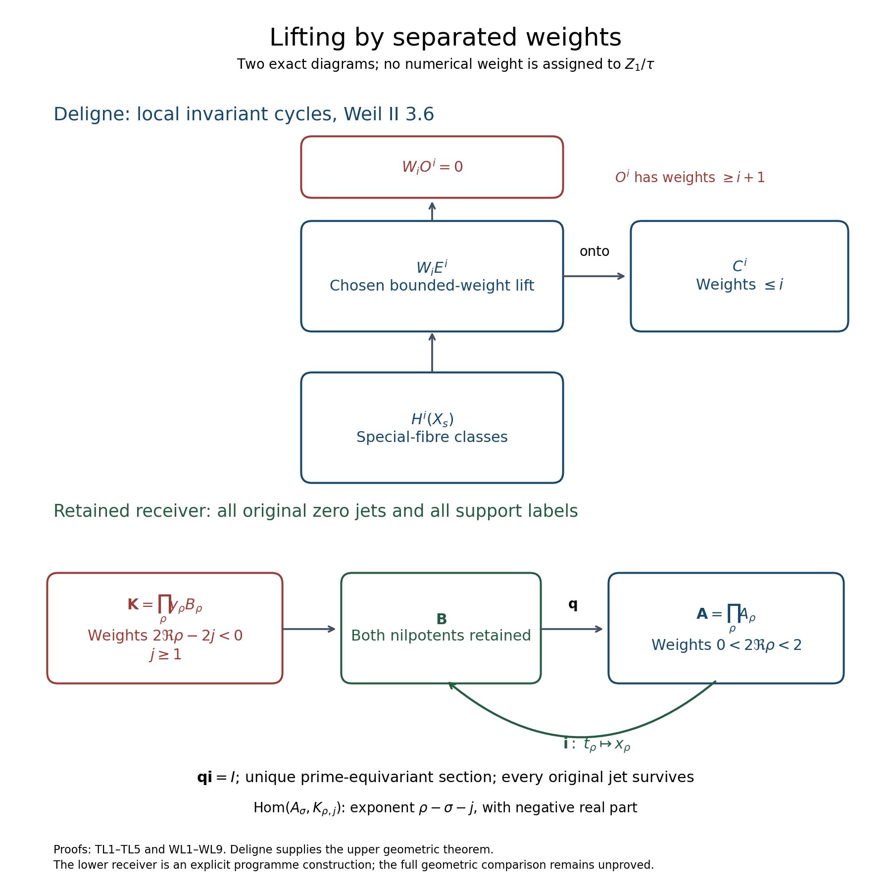
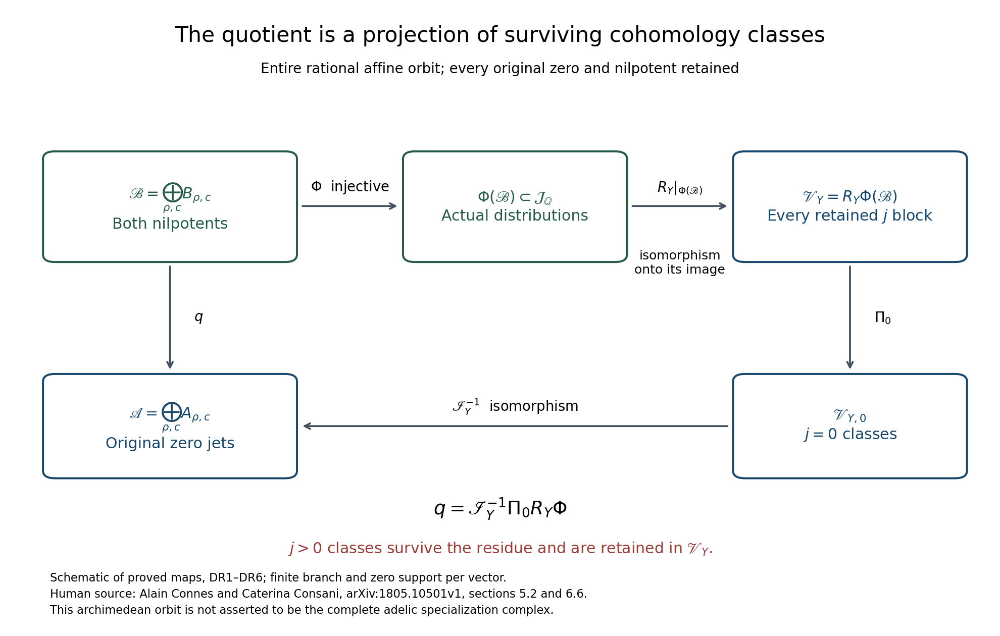

# Lifting by separated weights: the exact Deligne argument and retained programme maps

24 September 2026. Current target: the user's request to prove the lifting-obstruction mechanism for the tau programme. The user-originating proposal is the full-spectrum reconstruction and global quotient argument. Deligne's geometric theorem and Connes–Consani's constructions are credited below. The finite receiving calculation here is a new derivation on the previously retained MJ4 object; it is not asserted to be the missing geometric specialization theorem.

## TL0. The controlling definitions and the prerequisite map

The complete preserved corpus is identified in CORPUS_AND_OPERATION_RULES.md (private construction record; not included). Its current instructions have stable identifiers USR-508e136619bfced2 and USR-4322be19bff532cd. The exact user statements U01–U18 remain in USER_DEFINITIONS_VERBATIM.md (private construction record; not included).

We retain \(Z_0\) as absence, \(0=e=\varnothing\), without source parity; \(Z_1\) as primitive presence \(\tau\), without \(Z_2\) parity; and the supplied numerical values and \(Z_2\) data in the integer layer. No addition, subtraction, vector coordinate, numerical distance, weight or multiplicity is assigned to primitive \(\tau\). U04 retracts the former self-sum, U03 excludes counting copies of \(\tau\), U10–U14 exclude the invented arithmetic midpoint and metric, and U18 requires proofs of derived consequences.

The following complex arithmetic takes place in the already constructed receiving spaces. It does not create arithmetic from primitive presence. The input comparison, retained in IH2–IH3 and QS1, is
\[
\mathcal A=\left\{k\in C^\infty(\mathbb R_{>0}):
\sup_{u>0}(u^N+u^{-N})|(u\partial_u)^j k(u)|<\infty
\quad(N,j\ge0)\right\},
\]
\[
\mathcal E f(u)=u^{1/2}\sum_{n\ge1}f(nu),\qquad
I=\overline{\mathcal E(S_{00}^{\rm even})}^{\,\mathcal A},
\qquad Q=\mathcal A/I,
\]
where \(S_{00}^{\rm even}\) consists of even Schwartz functions with \(f(0)=0\) and \(\int_{\mathbb R}f=0\). The original Mellin transform and action are
\[
F_k(s)=\int_0^\infty k(u)u^{s-1/2}\frac{du}{u},\qquad
W_a k(u)=a^{1/2}k(u/a),\qquad a>0.
\tag{TL0.1}
\]
Substitution \(u=av\), including \(du/u=dv/v\), proves \(F_{W_a k}(s)=a^sF_k(s)\). On the initial half-plane of absolute convergence,
\[
F_{\mathcal E f}(s)=\zeta(s)\int_0^\infty f(v)v^{s-1}\,dv.
\tag{TL0.2}
\]
This is the original zeta function, not a completed replacement. Analytic continuation and the decay conditions give the previously proved jet map, for each actual nontrivial zero \(\rho\) of multiplicity \(m_\rho\),
\[
j_\rho:Q\longrightarrow A_\rho=\mathbb C[t_\rho]/(t_\rho^{m_\rho}),\qquad
j_\rho([k])=\sum_{r=0}^{m_\rho-1}
\frac{F_k^{(r)}(\rho)}{r!}t_\rho^r,
\]
\[
j_\rho W_a=a^\rho\exp((\log a)t_\rho)\,j_\rho.
\tag{TL0.3}
\]
All later polynomial operations are on \(A_\rho\) or its explicitly specified extension. The original jet observations, their common kernel, and the distinction between a quotient and an isomorphism remain in place. In particular the map \(Q\to\prod_\rho A_\rho\) is not here asserted onto or injective.

## TL1. Deligne's lifting theorem, including the obstruction space

The exact source is Pierre Deligne, *La conjecture de Weil II*, §3.6.1–§3.6.3, printed pp.212–214, with §3.6.4 on p.215 for the complex analogue. [Official publication](https://www.numdam.org/item/PMIHES_1980__52__137_0/). The full local French TeX transcription, lines 2468–2569, was read for this calculation. This is a transcription, not author TeX; no claim is made that a source scan was checked in this continuation.

Deligne takes \(S\) to be the spectrum of the henselization of \(k[T]\) at \((T)\), with closed point \(s\), generic point \(\eta\), and geometric generic point \(\bar\eta\). The morphism \(f:X\to S\) is proper; \(X\) is essentially smooth over \(k\); \(X_{\bar\eta}\) is smooth. These are geometric hypotheses of his theorem, not definitions of the tau source. After spreading out, the required diagram carries the arithmetic Frobenius of a finite field \(\mathbb F_q\).

Write \(I_{\rm in}\) for inertia, to distinguish it from TL0's closed image. Hochschild–Serre and the fact that the tame pro-\(\ell\) quotient is \(\mathbb Z_\ell(1)\) give
\[
0\longrightarrow
H^{i-1}(X_{\bar\eta},\mathbb Q_\ell)_{I_{\rm in}}(-1)
\longrightarrow E^i:=H^i(X_\eta,\mathbb Q_\ell)
\xrightarrow{b}
C^i:=H^i(X_{\bar\eta},\mathbb Q_\ell)^{I_{\rm in}}
\longrightarrow0.
\tag{TL1.1}
\]
Here \(H^0(\mathbb Z_\ell(1),V)=V^{\mathbb Z_\ell(1)}\),
\(H^1(\mathbb Z_\ell(1),V)=V_{\mathbb Z_\ell(1)}(-1)\), and the higher groups vanish. The twist is retained.

The cohomology-with-support sequence and proper base change give
\[
H^i(X_s,\mathbb Q_\ell)\xrightarrow{a}E^i
\xrightarrow{\partial}O^i,\qquad
\operatorname{im}a=\ker\partial,
\tag{TL1.2}
\]
\[
O^i=H^{i+1}_{X_s}(X,\mathbb Q_\ell)
\cong H^{2N-i-1}(X_s,\mathbb Q_\ell)^\vee(-N),
\tag{TL1.3}
\]
where the smooth ambient variety has dimension \(N\). The target of the support pairing is \(\mathbb Q_\ell(-N)\). This fixes both the dual and the sign of the twist.

Deligne proves in §3.6.2, using the smooth proper generic fibre and §1.8.8(i), that \(C^i\) has weights at most \(i\). The proper special fibre has \(H^{2N-i-1}(X_s)\) of weights at most \(2N-i-1\). Duality changes a weight \(w\) to \(-w\), and the retained twist \((-N)\) adds \(2N\). Thus every weight of \(O^i\) is at least
\[
-(2N-i-1)+2N=i+1.
\tag{TL1.4}
\]
These weight statements are Deligne's geometric results; they are not inferred merely from the existence of a spectrum.

For completeness, the linear-algebra step is exact. Fix the complex embedding used to measure weights. In a finite-dimensional Frobenius module, let \(W_i\) be the sum of generalized eigenspaces with \(|\alpha|\le q^{i/2}\). An equivariant map preserves each generalized eigenspace: applying \((F-\alpha)^r\) before or after the map gives the same result. Exact sequences restrict to exact sequences on each generalized eigenspace, because the relatively prime factors of the minimal polynomial give polynomial projection operators. Summing those projections proves that \(W_i\) is exact.

Apply this to (TL1.1): \(W_iE^i\to C^i\) is onto. Apply it to the support arrow: \(W_iO^i=0\) by (TL1.4), so \(\partial(W_iE^i)=0\). For any \(c\in C^i\), choose \(e\in W_iE^i\) with \(b(e)=c\). Exactness of (TL1.2) supplies \(x\in H^i(X_s)\) with \(a(x)=e\). Consequently \(ba(x)=c\). This is the proved surjectivity of specialization.

The argument chooses a lift into the correct weight range before killing the support obstruction. It does not assert that every arbitrarily chosen lift in \(E^i\) has zero obstruction.

## TL2. The existing two-nilpotent receiving object

Retain the existing object MJ4–MJ5 without replacing its variables:
\[
B_\rho=\mathbb C[x_\rho,y_\rho]/(x_\rho,y_\rho)^{m_\rho},
\quad J_\rho=M_{x_\rho},\quad N_\rho=M_{y_\rho}.
\]
Its basis consists of the monomials \(x_\rho^u y_\rho^v\) with \(u,v\ge0\) and \(u+v<m_\rho\). The symbol \(M_f\) means multiplication by the displayed polynomial. Define
\[
D_a(x_\rho)=x_\rho,\quad D_a(y_\rho)=a^{-1}y_\rho,\qquad
F_a=a^\rho\exp((\log a)J_\rho)D_a.
\tag{TL2.1}
\]
Every exponential terminates in this algebra. Because \(D_a\) fixes \(x_\rho\), multiplication proves \(F_aF_b=F_{ab}\), including every coefficient. Direct evaluation on monomials gives
\[
F_aJ_\rho=J_\rho F_a,\qquad
F_aN_\rho F_a^{-1}=a^{-1}N_\rho.
\tag{TL2.2}
\]
These operators are separately named: \(J_\rho\) is the retained spectral nilpotent; \(N_\rho\) is the extra Tate-lowering operator. Neither is primitive \(\tau\).

The actual quotient used for lifting is
\[
q_\rho:B_\rho\longrightarrow A_\rho,\qquad
x_\rho\longmapsto t_\rho,\quad y_\rho\longmapsto0_{A_\rho}.
\tag{TL2.3}
\]
The subscript on \(0_{A_\rho}\) specifies the zero of this complex algebra. It does not give an operation on \(\tau\). Degree-\(m_\rho\) monomials map to zero, so the map is well-defined. Its kernel is exactly \(K_\rho=y_\rho B_\rho\). We have the full equivariant exact sequence
\[
0\longrightarrow K_\rho\longrightarrow B_\rho
\xrightarrow{q_\rho}A_\rho\longrightarrow0.
\tag{TL2.4}
\]
The section \(i_\rho(f(t_\rho))=f(x_\rho)\) is well-defined, because \(x_\rho^{m_\rho}=0\), and \(q_\rho i_\rho=\mathrm{id}\). It preserves the original \(J_\rho/T_\rho\) action and every \(F_a/W_a\) action.

## TL3. Computed weights and the actual correction of every section

The full decomposition is
\[
K_\rho=\bigoplus_{j=1}^{m_\rho-1}
y_\rho^j\mathbb C[x_\rho]/(x_\rho^{m_\rho-j}).
\tag{TL3.1}
\]
On its \(j\)-summand, \(F_p=p^{\rho-j}\exp((\log p)J_\rho)\), while \(W_p=p^\rho\exp((\log p)T_\rho)\) on \(A_\rho\). Thus its eigenvalue has weight \(2\operatorname{Re}\rho-2j\); the original block has weight \(2\operatorname{Re}\rho\). These follow from \(w_p(\alpha)=2\log|\alpha|/\log p\) in the receiving representation, not from a presumed weight of \(\tau\).

Set \(\mathcal H_j=\operatorname{Hom}_{\mathbb C}(A_\rho,K_{\rho,j})\). The relevant conjugation operator is
\[
U_p(h)=F_phW_p^{-1}
=p^{-j}\exp((\log p)\mathcal D_j)h,\qquad
\mathcal D_jh=J_\rho h-hT_\rho.
\tag{TL3.2}
\]
Left and right multiplication commute. Since their nilpotence orders are \(m_\rho-j\) and \(m_\rho\), respectively, the binomial expansion proves
\(\mathcal D_j^{\,2m_\rho-j-1}=0\): each term has at least one factor beyond its nilpotence order. Therefore \(R_j=\exp((\log p)\mathcal D_j)-I\) has the same upper bound on its nilpotence order.

With \(d_j=2m_\rho-j-1\), every coefficient is retained in the inverse
\[
(U_p-I)^{-1}\big|_{\mathcal H_j}
=\frac1{p^{-j}-1}
\sum_{n=0}^{d_j-1}
\left(-\frac{p^{-j}}{p^{-j}-1}R_j\right)^n.
\tag{TL3.3}
\]
This is verified by multiplying the finite geometric sum by
\((p^{-j}-1)I+p^{-j}R_j\). The final term is zero by nilpotence. The denominator is nonzero because \(p>1\) and \(j\ge1\); no zero is being inverted.

Now let \(s:A_\rho\to B_\rho\) be any complex-linear section of \(q_\rho\). Its obstruction to equivariance is the explicitly constructed map
\[
c_p=F_psW_p^{-1}-s\in\operatorname{Hom}_{\mathbb C}(A_\rho,K_\rho).
\tag{TL3.4}
\]
Its range is in the kernel because \(q_\rho F_p=W_pq_\rho\) and \(q_\rho s=\mathrm{id}\). Replacing \(s\) by \(s-h\), where \(h\) is kernel-valued, changes this obstruction to \(c_p-(U_p-I)h\). Formula (TL3.3) supplies
\[
h=(U_p-I)^{-1}c_p,\qquad s_{\rm eq}=s-h.
\tag{TL3.5}
\]
Thus the obstruction class in \(\operatorname{coker}(U_p-I)\) vanishes by its computed weight separation. The corrected section is unique: the difference of two corrected sections lies in \(\ker(U_p-I)=0\). Since the explicitly constructed \(i_\rho\) is equivariant, \(s_{\rm eq}=i_\rho\). This also proves simultaneous equivariance at every prime and every \(a>0\), without making separate incompatible choices.

This is a vanishing theorem for an actual lifting obstruction in the retained receiver, not a theorem that assumes its obstruction space has separated weights.

The entire group obstruction also vanishes. On
\(\mathcal H=\operatorname{Hom}(A_\rho,K_\rho)\), let
\(U_a(h)=F_ahW_a^{-1}\). For any cocycle
\(c(ab)=c(a)+U_ac(b)\), commutativity gives
\[
(U_p-I)c(a)=(U_a-I)c(p).
\]
The operators \(U_a\) commute, including with the inverse (TL3.3).
Consequently \(h=(U_p-I)^{-1}c(p)\) satisfies
\[
c(a)=(U_a-I)h\qquad(a>0).
\tag{TL3.6}
\]
Thus every such cocycle is a coboundary, with its unique correction explicitly calculated. For a section, \(c(a)=F_asW_a^{-1}-s\); expanding the product proves the cocycle identity, so this is its actual obstruction.

## TL4. The calculation across all original zeros

Let \(\rho,\sigma\) be any actual nontrivial zeros. On
\(\operatorname{Hom}(A_\sigma,K_{\rho,j})\) the calculation becomes
\[
U_a=a^{\rho-\sigma-j}
\exp((\log a)(L_{J_\rho}-R_{T_\sigma})).
\tag{TL4.1}
\]
The nilpotence exponent is at most \(m_\rho-j+m_\sigma-1\). Because
\[
0<\operatorname{Re}\rho<1,\qquad
0<\operatorname{Re}\sigma<1,\qquad j\ge1,
\]
we have
\[
\operatorname{Re}\rho-\operatorname{Re}\sigma-j<0.
\tag{TL4.2}
\]
Hence the conjugation eigenvalue has modulus strictly below one. Formula (TL3.3), with \(p^{-j}\) replaced by \(p^{\rho-\sigma-j}\), applies to every finite mixed block. No claim \(\operatorname{Re}\rho=1/2\) was used.

For the complete product receivers, give \(\mathbf A=\prod_\rho A_\rho\), \(\mathbf B=\prod_\rho B_\rho\), \(\mathbf K=\prod_\rho K_\rho\) their product topologies. The maps
\[
\mathbf q=\prod_\rho q_\rho,\qquad
\mathbf i=\prod_\rho i_\rho
\]
are continuous, commute with every prime action, and \(\mathbf q\mathbf i=\mathrm{id}\). Exactness follows coordinate by coordinate. A continuous linear map from a product of finite-dimensional complex spaces to a finite-dimensional space depends on only finitely many coordinates: continuity supplies a neighbourhood restricting finitely many coordinates; an unrestricted coordinate subspace must have zero image, because its elements can be multiplied by arbitrarily large scalars while staying in that neighbourhood. Therefore every coordinate of a continuous equivariant map \(\mathbf A\to\mathbf K\) is a finite sum of the cross-block maps in (TL4.1). Every term vanishes by (TL4.2), proving uniqueness of \(\mathbf i\).

This product is the complete receiving observation object. Its relationship with \(Q\) is the specified map \(\mathbf j:Q\to\mathbf A\). We obtain a concrete continuous map
\[
Q\xrightarrow{\mathbf j}\mathbf A
\xrightarrow{\mathbf i}\mathbf B,\qquad
\mathbf q\,\mathbf i\,\mathbf j=\mathbf j.
\tag{TL4.3}
\]
It lifts every retained observation simultaneously. It does not change the observation kernel, prove spectral synthesis, or assert that every independent product tuple is a class of \(Q\).

## TL5. All support labels survive the lift

Let \(\Lambda\) be the original bounded distributive support lattice, denoted here by a capital lambda to distinguish it from a Connes–Consani rank-one group. For any receiving complex vector space \(V\), set
\[
G_\Lambda(V)=
\{(0_V,\lambda):\lambda\in\Lambda\}
\cup\{(v,1_\Lambda):v\in V\}.
\tag{TL5.1}
\]
For a linear map \(f:V\to W\), define
\[
G_\Lambda(f)(v,\lambda)=(f(v),\lambda).
\tag{TL5.2}
\]
This is well-defined: a nontop label forces \(v=0_V\), whose image is \(0_W\). The retained addition in this receiving object is
\((v,\lambda)+(w,\mu)=(v+w,\lambda\vee\mu)\). It is not addition on primitive \(\tau\). Linearity and equality of the joined labels prove that (TL5.2) preserves it. Composition and identities are preserved by direct substitution.

Applying the functor to \(\mathbf q\) and \(\mathbf i\) gives
\[
G_\Lambda(\mathbf q)G_\Lambda(\mathbf i)
=\mathrm{id}_{G_\Lambda(\mathbf A)},\qquad
G_\Lambda(\mathbf q)G_\Lambda(\mathbf i)G_\Lambda(\mathbf j)
=G_\Lambda(\mathbf j).
\tag{TL5.3}
\]
Thus every label survives, including when amplitudes cancel. For a supported zero the exact lift is
\((0_{\mathbf A},\lambda)\mapsto(0_{\mathbf B},\lambda)\); for a nonzero amplitude it is \((a,1_\Lambda)\mapsto(\mathbf i(a),1_\Lambda)\).

A zero-valued linear obstruction lifts to the support-preserving map
\[
(v,\lambda)\longmapsto(0,\lambda).
\tag{TL5.4}
\]
It does not become the constant map to \((0,0_\Lambda)\). This retains the distinction between vanishing arithmetic amplitude and erasing support. Neither receiving zero is called primitive \(\tau\). The proof establishes the section with all labels; it does not postulate an abelian cohomology theory on \(\tau\).

More precisely, if \(Z_\Lambda(V)=\{(0_V,\lambda):\lambda\in\Lambda\}\), then
\[
G_\Lambda(\mathbf q)^{-1}(Z_\Lambda(\mathbf A))
=G_\Lambda(\mathbf K).
\tag{TL5.5}
\]
This follows because its label is unchanged and its amplitude maps to zero exactly on \(\mathbf K\). This amplitude kernel with all labels is not replaced by the inverse image of the single bottom zero.

The independent labels of different observed blocks can also be retained. Their carrier is
\[
\mathfrak A_\Lambda=\prod_\rho G_\Lambda(A_\rho),\qquad
\mathfrak B_\Lambda=\prod_\rho G_\Lambda(B_\rho),\qquad
\mathfrak K_\Lambda=\prod_\rho G_\Lambda(K_\rho).
\tag{TL5.6}
\]
For a tuple \(((a_\rho,\lambda_\rho))_\rho\), the section is exactly
\[
\mathfrak i((a_\rho,\lambda_\rho)_\rho)
=(i_\rho(a_\rho),\lambda_\rho)_\rho,
\qquad
\mathfrak q((b_\rho,\lambda_\rho)_\rho)
=(q_\rho(b_\rho),\lambda_\rho)_\rho.
\tag{TL5.7}
\]
Every coordinate is well-defined by TL5.2, and coordinatewise computation gives
\(\mathfrak q\mathfrak i=\mathrm{id}\), preservation of receiving addition, and equivariance for every original prime action. No label of one block is joined with a label of another block. For any fixed label tuple, the allowed amplitude space in coordinate \(\rho\) is \(A_\rho\) if \(\lambda_\rho=1_\Lambda\), and \(\{0\}\) otherwise. Both maps are continuous on this product of amplitude spaces. No topology on an arbitrary lattice is required.

There is a specified injective comparison
\[
G_\Lambda(\mathbf A)\longrightarrow\mathfrak A_\Lambda,
\qquad (a,\lambda)\longmapsto((a_\rho,\lambda))_\rho.
\tag{TL5.8}
\]
Its domain condition makes every coordinate valid. Equality of image tuples gives equality of every amplitude and of the common label, proving injectivity. The lift and quotient commute with this comparison by substitution into TL5.7. Its image contains only constant label tuples. Thus the common-label object has not been substituted for the object with independent block labels; both and their exact map are retained. Neither carrier is asserted to be the complete source geometry without its geometric comparison.

## TL6. What happens to the two nilpotents

The lift preserves every original spectral jet: \(J_\rho i_\rho=i_\rho T_\rho\). It does not identify the added \(N_\rho\) with \(T_\rho\). For the actual quotient (TL2.3), \(q_\rho N_\rho=0\), so its induced \(N\)-operator on \(A_\rho\) is zero.

For \(m_\rho>1\), \(N_\rho i_\rho(1_{A_\rho})=y_\rho\ne0\). More completely,
\[
\ker N_\rho=
\operatorname{span}\{x_\rho^u y_\rho^v:u+v=m_\rho-1\},
\quad
q_\rho(\ker N_\rho)=\mathbb C\,t_\rho^{m_\rho-1}.
\tag{TL6.1}
\]
Multiplication by \(y_\rho\) sends distinct monomials of lower total degree to distinct surviving monomials, proving the kernel statement. Its image under \(q_\rho\) gives the second equality. Hence an \(N\)-equivariant section cannot be onto \(A_\rho\) when \(m_\rho>1\). This is a computed property of the two specified receiving operators. It is not an impossibility assertion about primitive \(\tau\), and it does not invalidate the prime-equivariant lift already proved.

The previous map \(r_\rho(x_\rho)=r_\rho(y_\rho)=t_\rho\) asks for different data: it identifies both receiving nilpotents. Its exact defect remains
\[
r_\rho F_p-W_pr_\rho
=p^\rho e^{(\log p)t_\rho}
\sum_{u+v<m_\rho}(p^{-v}-1)b_{uv}t_\rho^{u+v}
\quad\text{on }\sum b_{uv}x_\rho^uy_\rho^v.
\tag{TL6.2}
\]
No source operation on \(\tau\) occurs in this formula. The correction audit is explicit: U04's retracted addition, U10's rejected midpoint, and U11's rejected distance are absent from its prerequisites. Its scope remains the receiving comparison MJ4, not a disproof of the user's geometric argument.

## TL7. The relevant Connes–Consani geometry and the actual endpoint weights

Alain Connes and Caterina Consani, *On the Jacobian of \(\overline{\operatorname{Spec}\mathbb Z}\)*, arXiv:2602.15941v1, is used through its original author TeX, byte-matched to the downloaded original source. [Original paper and source](https://arxiv.org/abs/2602.15941v1). Exact reading ranges and archive hashes are in sources/CC_SOURCE_IDENTITY_PRIVATE.json.

Their generic fibre is \(C_\eta=\{\lambda\mathbb Z:\lambda\in\mathbb R^\times\}\cong\mathbb R_{>0}^\times\), author lines 1713–1751. The quotient \(\operatorname{Pic}(\overline{\operatorname{Spec}\mathbb Z})\to\operatorname{Jac}(\overline{\operatorname{Spec}\mathbb Z})\) forgets the positive scale. The projection is
\(\lambda\mathbb Z\mapsto[\mathbb Z]\) on this fibre; its fibre is the entire positive scaling orbit, not a singleton. Their arithmetic divisor carries its stated seminorm and its \(\Gamma\)-module of sections, author lines 1390–1524. Neither structure is silently assigned to primitive \(\tau\).

In their spectral section, author lines 2501–2631, the action is by idèle translations on a monoid. The complete explicit formula retains
\[
\widehat h(0)+\widehat h(1)
-\sum_{\chi}\sum_{\rho\in Z_{\tilde\chi}}\widehat h(\tilde\chi,\rho)
=\sum_v\int_{\mathbb Q_v^\times}'\frac{h(u^{-1})}{|1-u|_v}\,d^*u.
\tag{TL7.1}
\]
The local distribution prescription comes from the chosen additive characters. The semilocal cutoff retains the additional term
\(2h(1)\log\lambda\) and the \(o(1)\) term; it is not identified with a finite-dimensional obstruction space here. The authors associate that leading term with the generic stratum and suggest relative cohomology. These cited statements do not themselves provide the exact specialization diagram (TL1.1)–(TL1.3).

The earlier actual adelic calculation ABR19a–d supplies an independent concrete boundary action. For an even Schwartz function,
\[
m(h)=\left(h(0),\int_{\mathbb R}h(x)\,dx\right),\qquad
R_bh(x)=h(x/b),
\]
\[
m(R_bh)=
\begin{pmatrix}1&0\\0&b\end{pmatrix}m(h).
\tag{TL7.2}
\]
The equality follows by evaluation and the substitution \(x=bu\), with its Jacobian \(b\). On the complete retained prime boundary
\[
\mathcal B_{\rm pr}
=\left(\bigoplus_{p\ {\rm prime}}\mathbb C\,\ell_p\right)
\otimes\mathbb C^2,
\]
the action is the identity on \(\ell_p\) and the matrix in (TL7.2) on the endpoint coordinates. Therefore the endpoint weights are exactly \(0\) and \(2\). Original nontrivial-zero blocks have weights strictly between these endpoints. At any fixed prime, their eigenvalues differ from both \(1\) and \(p\); the corresponding generalized-eigenvalue intertwiner into either endpoint component is zero. This follows by the relatively prime minimal-polynomial argument in TL1, and it retains both endpoints rather than discarding one.

This establishes separation for an actual previously calculated boundary. It does not identify that boundary with the support-obstruction group \(O^i\) in Deligne's diagram. The connecting map must come from the programme's actual geometric complex; the existence of separated receiving eigenvalues is not permission to invent such a map.

There is also a direct connecting-map calculation on the Connes–Consani prime mapping torus
\[
\mathcal T_p=(K^{(p)}\times\mathbb R)/
((u,t)\sim(pu,t+\log p)).
\]
At a finite compact quotient and character \(\chi\), a coefficient system with positive-return operator \(H_p\) has the two-term complex
\[
V\xrightarrow{\chi(p)H_p-I}V.
\tag{TL7.3}
\]
For an exact equivariant coefficient sequence
\(0\to V_A\xrightarrow{\iota}V_B\xrightarrow{\pi}V_C\to0\), the connecting class is explicitly
\[
\delta_\chi(c)=[a],\qquad
\pi b=c,\quad\iota a=(\chi(p)H_p-I)b.
\tag{TL7.4}
\]
Changing \(b\) changes \(a\) by an image of the differential, proving well-definedness. The class is zero exactly when subtracting a preimage produces an invariant lift. All signs and the positive-return convention are proved in the complete companion derivation MT0–MT7.

For the retained original zero jet,
\(H_p=p^\rho e^{(\log p)T}\), put \(z=\chi(p)p^\rho\).
Since \(|z|=p^{\operatorname{Re}\rho}>1\), its differential has the finite inverse
\[
(\chi(p)H_p-I)^{-1}
=\sum_{r=0}^{m_\rho-1}
\frac{(-1)^rz^r(e^{(\log p)T}-I)^r}{(z-1)^{r+1}}.
\tag{TL7.5}
\]
Multiplication verifies this using \(T^{m_\rho}=0\).
This exact receiver has zero cohomology in both degrees for every original nontrivial-zero jet. It therefore cannot provide a nonzero class for the specialization argument by silently identifying its cohomology with the full programme. This is a calculated scope of the particular comparison, not an impossibility theorem about the source. The full companion preserves the torus, Haar measure, characters, nilpotents and all prime-action conventions.

## TL7a. The actual global adelic extension

The full independent derivation AC0–AC9 now applies the calculation to the actual adelic periodization. Retain its two factors:
\[
J(c)(y)=y^{1/2}\mathcal P(\Phi c)(y)=2\mathcal E(\Phi c)(y),
\quad I_0=J(Q_0).
\tag{TL7.6}
\]
The existing faithful coordinates are \((Jc,\beta c)\), and their exact inverse is
\[
(k,b)\longmapsto[t_1\otimes h_k]+j(b),\qquad
h_k(x)=\frac1{4\pi i}\int_{\sigma-i\infty}^{\sigma+i\infty}
\frac{F_k(s)}{\zeta(s)}x^{-s}\,ds,\quad\sigma>1.
\tag{TL7.7}
\]
This inverse is used only on \(I_0\); it follows from the original factor \(2\) and Mellin inversion. AC1–AC2 prove the inverse, its equivalent Möbius formula, convergence and equivariance, with both endpoints retained. The resulting actual two-term complex has the chain isomorphism
\[
[Q_0\xrightarrow J\mathcal A]
\cong\mathcal B_{\rm pr}[1]\oplus[I_0\hookrightarrow\mathcal A].
\tag{TL7.8}
\]
Indeed the differential sends the coordinates \((k,b)\) to \(k\). Thus its endpoint connecting two-extension is zero, and every group-cohomology connecting map from the split endpoint sequence is zero. The proof is on cochains: the section \(k\mapsto[t_1\otimes h_k]\) commutes with the action and hence with the cochain differential. Its lifted cocycle is a cocycle. This is a vanishing result on the actual adelic modules, beyond TL2's auxiliary polynomial receiver.

Its degree-zero cohomology is \(C_{\rm alg}=\mathcal A/I_0\). The Hausdorff quotient and the entire difference remain in the exact sequence
\[
0\longrightarrow\overline{I_0}/I_0\longrightarrow C_{\rm alg}
\longrightarrow Q\longrightarrow0.
\tag{TL7.9}
\]
No closed-image or spectral-synthesis assertion is inserted into this step.

There is also vanishing in every extension degree between any original zero block and the original endpoint space:
\[
\operatorname{Ext}^{n}(A_\rho,\mathcal B_{\rm pr})=
\operatorname{Ext}^{n}(\mathcal B_{\rm pr},A_\rho)=0
\qquad(n\ge0).
\tag{TL7.10}
\]
Here the category is modules over the complex group algebra of the specified positive dilation group. To verify the vanishing, fix a prime \(p\) and its central group-algebra element \(z\). The source and target annihilators are
\((z-p^\rho)^{m_\rho}\) and \((z-1)(z-p)\). They are coprime because \(1<|p^\rho|<p\). The Euclidean identity writes their linear combination as \(1\). On Ext, central multiplication through the two variables agrees: on a free resolution, precomposition equals postcomposition on module-linear cochains. A polynomial killing the module lifts to a null-homotopic resolution map, by lifting into successive kernels using projectivity and exactness. Both annihilators therefore kill Ext, and their combination \(1\) forces it to vanish. AC5 gives the full resolution argument and the explicit unique section polynomial in degree one.

This statement does not replace the different exact sequence
\(0\to\ker L_\rho\to\mathcal A\xrightarrow{L_\rho}A_\rho\to0\).
AC6 calculates its full section defect. AC7 constructs the exact receiving morphism for its spectral data:
\[
A_\rho^*\hookrightarrow Q'\hookrightarrow\mathcal A',\qquad
\lambda_{\rho,r}(k)=\frac1{r!}\int_0^\infty
k(y)y^{\rho-1/2}(\log y)^r\frac{dy}{y}.
\tag{TL7.11}
\]
Every factor, multiplicity and action convention is retained. The source \(Z_1/\tau\) is not made into a test function or a distribution by these receiving maps. AC0 records the complete-history arguments and corrected definitions checked before interpreting this calculation.

## TL7b. The geometric distribution map and its entire rational orbit

There is now an exact realization of TL2's operators in the retained Connes–Consani distribution receiver. Use their original archimedean coordinates \(X,Y\), with \(Y>0\), and their operators \(D=\partial_X+i\partial_Y\) and \(D_Y=YD\). For \(c\in\mathbb Q\), the map is
\[
\Phi_c(x^u y^j)=\delta^{(j)}(X-c)\otimes
Y^{\rho+1}\frac{(\log Y)^{m_\rho-j-1-u}}{(m_\rho-j-1-u)!},
\qquad u+j<m_\rho.
\tag{TL7.12}
\]
The delta derivative has its original distributional sign. Compactly supported tests lie inside \(Y>0\), so every displayed coefficient defines a distribution. Different normal derivatives and different powers of \(\log Y\) are independent, proving injectivity. The operators that realize \(J\) and \(N\) are exactly
\[
\mathscr J=Y\partial_Y-(\rho+1),\qquad
\mathscr N=\partial_X\mathscr J.
\tag{TL7.13}
\]
Applying \(\mathscr J\) lowers the logarithm degree by one with the displayed factorial; applying \(\mathscr N\) also raises the delta-derivative order by one. These are the complete original monomial actions, including their zero values at total degree \(m_\rho\). The construction does not define products of arbitrary distributions.

The exact affine pullback sends
\[
P(a,b)\Phi_c(x^uy^j)=a^{\rho-j}
\sum_{k=0}^{m_\rho-j-1-u}\frac{(\log a)^k}{k!}
\Phi_{(c-b)/a}(x^{u+k}y^j),
\quad a\in\mathbb Q_{>0},\ b\in\mathbb Q.
\tag{TL7.14}
\]
DR2 proves this from the two-dimensional Jacobian \(a^{-2}\), the one-dimensional Jacobian \(a^{-1}\), and the full logarithm expansion. Pullback is a right action: \(P(a,b)P(a',b')=P(a'a,a'b+b')\). The algebraic direct sums over all rational branches and all actual original zeros retain this whole action. No infinite distribution sum is presumed: each vector has finite branch and zero support. The maps remain injective on that entire direct sum, by finite exponential-polynomial independence.

The original \(D_Y\)-residue of TL7.12 is particularly direct. Put \(r=m_\rho-j-1-u\), \(v=\log Y\). Keeping the entire factor and differentiating after multiplying by \(Y^{-1}\) gives
\[
R_Y\Phi_c(x^uy^j)=(-i)^jY^{\rho-j}
\prod_{h=0}^{j-1}(\rho-h+\partial_v)\frac{v^r}{r!}.
\tag{TL7.15}
\]
DR4 expands every coefficient of this product. On the finite polynomial space its diagonal coefficient is \((-i)^j\prod_{h=0}^{j-1}(\rho-h)\), which is nonzero for every original zero in \(0<\Re\rho<1\). The remaining operator lowers polynomial degree, so the finite geometric inverse proves invertibility. The exponents \(\rho-j\) are distinct across different retained pairs \((\rho,j)\): equality would make \(\rho-\rho'\) an integer, and the open strip forces that integer to be zero. Thus the whole residue map is injective on this image. The analogous formula for \(D\) retains \(\rho+1\) and its different cochain factor; DR3–DR4 calculate both.

In particular, the extra \(j>0\) pieces survive as genuine residue classes. The auxiliary quotient \(q_\rho\) is instead the following exact map on this cohomology image:
\[
q_\rho=\mathscr I_{Y,\rho,c}^{-1}\Pi_{Y,0}R_Y\Phi_c,
\qquad
\mathscr I_{Y,\rho,c}(t^u)
=Y^\rho\frac{(\log Y)^{m_\rho-1-u}}{(m_\rho-1-u)!}.
\tag{TL7.16}
\]
Here \(\Pi_{Y,0}\) is the projection onto the \(j=0\) summand. DR5.3 supplies it as a finite Hermite polynomial in \(Y\partial_Y\), proves that it is identity on that summand and zero on every other summand, and gives the full inverse on its image. All unprojected summands remain in the construction. The quotient has not been mistaken for the Dolbeault residue or for an assertion that the lower-weight classes are zero.

DR6 also proves uniqueness of the lift on the complete specified rational orbit, permitting maps between different zero blocks. For a map from the finite-dimensional branch at \(c=0\), its image has finite branch support. Equivariance under dilation forces that finite support to be invariant under \(c\mapsto c/2\), hence contained in \(\{0\}\). At that branch, every original eigenvalue has modulus \(p^{\Re\rho}>1\), while every kernel eigenvalue has modulus \(p^{\Re\rho'-j}<1\). The coprime-polynomial argument kills each possible intertwiner, including its nilpotent part. Translation equivariance then kills it at every rational branch. Therefore the direct sum section is the unique \(P^+(\mathbb Q)\)-equivariant section.

The entire proof DR0–DR8 accompanies this reader. It cites the original author TeX of Connes–Consani, *The Riemann–Roch strategy: Complex lift of the Scaling Site*, §5.2, Lemma adelicomp1 and equation actionpq, and §6.6 before Proposition comparescalcs. [Original source](https://arxiv.org/abs/1805.10501v1). The finite adele variables, endpoint strata and separate arithmetic Frobenius have not been identified with this rational archimedean orbit. No such identification is needed for the proved maps, and none is assumed to finish the tau theorem.

## Figure: the exact location of weight separation

The upper diagram is Deligne's cross, TL1.1–TL1.4. The lower diagram is the constructed receiving sequence TL2.4 and its explicitly computed Hom obstruction TL3.2–TL3.6. The interval \(0<2\operatorname{Re}\rho<2\) is the original open-strip statement; the negative shifts are exactly \(2\operatorname{Re}\rho-2j\), \(j\ge1\). The illustration assigns no weight or coordinate to primitive \(Z_1/\tau\). Source: Pierre Deligne, Weil II §3.6.1–3.6.3; receiving calculations TL2–TL5 and WL1–WL9. Reproducible figure code accompanies the proof.

The second diagram retains the whole specified rational orbit and all actual zero blocks. Its top-right space contains every lower-weight residue class; the vertical projection is the exact additional map DR5 constructs. No equality between that projection and the original differential is implied. Complete formulas and proofs: DR1–DR6. Human source for the geometric operator: Alain Connes and Caterina Consani, arXiv:1805.10501v1, §5.2 and §6.6.

\clearpage

## TL8. Exact status

The completed positive results include the explicit, unique, all-prime-equivariant lift (TL4.3), with support-preserving extensions (TL5.3) and (TL5.7), and its obstruction cancellation (TL3.3)–(TL3.5). The actual adelic complex also has the endpoint extension vanishing (TL7.8) and the all-degree weight-separated vanishing (TL7.10). All original spectral nilpotents survive. The proofs apply to actual nontrivial zeros without assuming their real parts are \(1/2\).

The distribution realization (TL7.12)–(TL7.16) further gives a proved geometric receiving map, both complete residues, the exact projection realizing the auxiliary quotient, and a unique lift over the whole specified rational affine orbit. Its lower-weight classes remain present before that projection.

The requested full tau theorem is not claimed complete: these extensions have not been identified with the complete geometric specialization complex of the original source. The actual adelic endpoint extension is now split explicitly in TL7a, and the archimedean geometric comparison is constructed in TL7b, but no missing specialization arrow or arithmetic Frobenius comparison is assumed. This is the exact present scope, not a universal obstruction or an assertion that the user's proposed argument is impossible.

The immediate continuation is to construct that geometric comparison from the original support/sheaf complexes and the complete user corpus, using the proved lift and retaining every remaining support contribution. No goal-completion or RH claim follows from this document.

## Current propagation from OMS — 24 September 2026

[The complete synthesis proof](ORIGINAL_MELLIN_SPECTRAL_SYNTHESIS.md), OMS1–OMS5, proves that the original summation image is closed and that the full actual-zero jet map on Q has zero common kernel. Its image remains a proper dense subspace of the unrestricted product, carrying the stronger original quotient topology. Earlier statements leaving those two questions undetermined are superseded by that proof, not by an assumption. Every original zero multiplicity and support label remains.

OMS7A proves the exact return to AC0–AC4: the same original spaces give I0=2 E(S)=E(S), with the factor 2 retained in the periodization map and inverse. Thus D_cl=0, C_alg→Q is the identity-induced topological isomorphism, and the specific global two-extension class of the actual adelic two-term complex is zero. Both endpoint contributions at each prime and the higher derived-coinvariant groups remain unchanged. No vanishing of the entire Ext group or full tau purity is inferred.

## Global adelic lifting propagation - 24 September 2026

The complete current proofs are GLOBAL_ADELIC_LIFTING_AND_PRIME_BOUNDARY.md GAP0–GAP9 (including GAP6A–GAP6B), COMPLETE_GENERATOR_ENDPOINT_RETURN.md GER0–GER7, GLOBAL_ENDPOINT_EXTENSION_RETURN.md GEX0–GEX9, and COMPLETE_COMPARISON_TRIANGLE_FORMALITY.md CTF0–CTF8. Every original prime wedge, endpoint pair and nilpotent jet is retained. GER credits the existing RZ endpoint resolvents and gives their explicit original Schwartz return and covariance corrections. GEX proves vanishing of the entire extension groups between the whole actual Q and the stated endpoint modules, in the explicitly constructed algebraic and strict locally convex operator categories. This strengthens the earlier finite-block and particular-extension assertions without assigning that theorem to a larger unspecified category.

GAP and CTF construct the full derived adelic complex, its canonical cohomology map, the exact original CC comparison and its entire cone. The faithful coefficient copies distinguish primitive tau from integer one in both objects. All additional cone contractions and the final-arrow homotopy are explicit; no test-space section Q→A is asserted. On the separate supported-Q row the same polynomial is invertible, rather than zero. Full tau numerical purity does not follow from endpoint separation and remains unproved.
