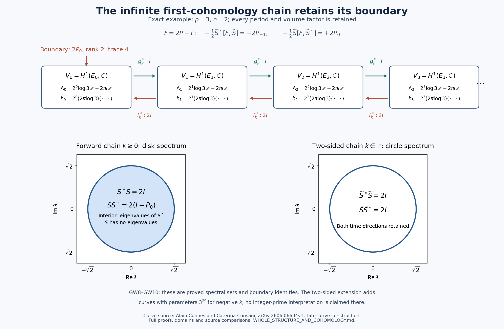
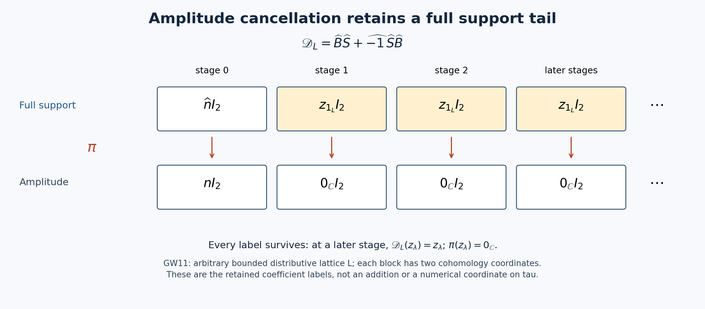

# The whole winding structure

The unit, the complete clock diagram, and the cohomological boundary.

24 September 2026. Complete derivation GW1–GW11. This note follows the user's question about reconstructing the unit from the whole absorption history, including the possibility that a later event changes a previously inferred counting interval. It then calculates a global first-cohomology operator from the actual Connes–Consani curves, evaluates its quantized boundary functional, and lifts the operators through the full support lattice.

The notation is retained: \(Z_0\) is absence, \(Z_1\) is presence, and \(Z_2\) is the user's integer parity datum. The source \(0=e=\varnothing\) and \(\tau_{\langle Z_1;\mathrm{no}\ Z_2\rangle}\) have no parity. No addition, numerical coordinate, distance, or family of counted copies is assigned to tau. Subscripts on auxiliary zero maps identify their domains; they do not introduce another source zero. In particular, the zero endomorphism below is a function on a winding group, not a new assertion about source parity.

The question supplies a proposed reconstruction, not permission to assume its conclusion. We prove the actual maps from the published source. A unique supporting point, its stalk, a distinguished integer, and an infinite observation history are not identified by notation.

## GW1. The complete source object before numerical labels

Alain Connes and Caterina Consani's signed generic monomial object has presentation
\[
G=\langle T,J,\epsilon\mid TJ=JT,\ J^2=\epsilon,\ \epsilon^2=1\rangle,
\qquad M=G\sqcup\{0_M\}.
\tag{GW1.1}
\]
The absorbing section is retained. The source mirror is
\[
A(T)=\epsilon T^{-1},\quad A(J)=J^{-1},\quad A(\epsilon)=\epsilon,
\quad A(0_M)=0_M.
\tag{GW1.2}
\]
The underlying archimedean space before quotient has points \(+,\eta,-\), with opens
\[
\varnothing,\quad\{\eta\},\quad\{+,\eta\},\quad\{-,\eta\},\quad X.
\]
The mirror exchanges the two closed points and fixes the unique generic point. These are source definitions, not consequences claimed for presence alone. Source: [Connes–Consani, *The Absolute Twistor Line and the Geometry of the compactification of Spec Z*, v1](https://arxiv.org/html/2609.00299v1), equations `opens`, `eq:restriction_maps`, Definition `def:alpha_symmetry`; original `CC.tex`, lines 576–609 and 775–806.

Every element of \(G\) has a unique form \(T^mJ^k\), with \(m\in\mathbb Z\) and \(k\in\mathbb Z/4\mathbb Z\). Reduction by the relations gives existence. The homomorphisms
\[
G\longrightarrow\mathbb Z\times\mathbb Z/4\mathbb Z,
\quad T\mapsto(1,0),\ J\mapsto(0,1),
\qquad(m,k)\longmapsto T^mJ^k
\]
are inverse, proving uniqueness. These integer coordinates are a proved description of the source presentation; they have not been extracted from tau.

Define the subgroup intrinsically by
\[
H=\{g\in G:g\text{ has finite order}\}.
\]
The displayed isomorphism proves \(H=\langle J\rangle\). Retain the full exact sequence
\[
1\longrightarrow H\longrightarrow G\xrightarrow{q}W:=G/H\longrightarrow1.
\tag{GW1.3}
\]
The quotient \(W\) is infinite cyclic. The full signed source remains in (GW1.3); its four-element subgroup is not discarded. Direct computation gives
\[
A(m,k)=(-m,2m-k),
\]
and hence inversion on \(W\).

Here is the whole observation object, defined without assigning numbers to individual finite clocks. Let \(\mathcal Q_W\) have an object for every finite-index subgroup \(N\subset W\), and one arrow \(N\to N'\) when \(N\subseteq N'\). Define the functor
\[
\mathcal F_W:\mathcal Q_W\longrightarrow\mathrm{Ab},
\quad N\longmapsto W/N,
\quad (N\subseteq N')\longmapsto(wN\mapsto wN').
\tag{GW1.4}
\]
The formula is well-defined because elements equal modulo \(N\) are equal modulo \(N'\). The quotient maps compose as required. This is one diagram, including all clocks and all their comparisons, attached to the retained source sequence (GW1.3).

The supporting comparison is
\[
b:\{\tau_{\langle Z_1;\mathrm{no}\ Z_2\rangle}\}\longrightarrow X,
\quad b(\tau)=\eta.
\tag{GW1.5}
\]
It is continuous because every inverse image of an open is empty or the singleton. It is mirror-equivariant because \(A\eta=\eta\). Pulling back the source sheaf retains its stalk: the singleton \(\{\eta\}\) is the smallest neighbourhood, so the colimit defining the inverse-image stalk is exactly \(\mathcal O_\eta\). No section of this stalk is thereby identified with tau.

## GW2. The unit and arithmetic as transformations of that whole object

Set
\[
R=\operatorname{End}_{\mathrm{Ab}}(W).
\]
For \(a,b\in R\), define \((a+b)(w)=a(w)b(w)\), and define multiplication by composition. Commutativity of \(W\) makes \(a+b\) a homomorphism. Associativity, the additive inverse \((-a)(w)=a(w)^{-1}\), and both distributive laws follow by evaluating on \(w\) and using the homomorphism law. Thus this is a ring. Its multiplicative identity is the already determined transformation
\[
\mathbf 1_R=\operatorname{id}_W.
\tag{GW2.1}
\]
Uniqueness follows from the identity equations: two identities \(u,v\) satisfy \(u=u\circ v=v\). This defines the unit through its action on the complete object, before naming any particular prime.

To calculate \(R\), choose a generator \(t\) of \(W\). Every endomorphism is uniquely
\[
[n](t^j)=t^{nj}\qquad(n,j\in\mathbb Z).
\]
Indeed its value on \(t\) is a unique power \(t^n\); the homomorphism law determines all powers. Evaluation proves
\[
[n]+[m]=[n+m],\quad[n]\circ[m]=[nm],\quad[1]=\operatorname{id}_W.
\tag{GW2.2}
\]
This is a ring isomorphism \(\mathbb Z\to R\). It is independent of the generator: replacing \(t\) by \(t^{-1}\) gives the same degree \(n\) for each endomorphism. Thus the generator was used to prove the arithmetic description, not to choose a different unit.

All finite-index subgroups are \(\langle t^d\rangle\), with \(d>0\): take the least positive exponent in a nontrivial subgroup and use division with remainder. Every endomorphism preserves each such subgroup. It therefore induces a natural endomorphism of the whole functor (GW1.4):
\[
\iota:R\longrightarrow\operatorname{Nat}(\mathcal F_W,\mathcal F_W),
\qquad a\longmapsto(a_N)_{N\in\mathcal Q_W}.
\tag{GW2.3}
\]
Each natural transformation here has group-homomorphism components. The components commute with every quotient map because both composites are induced by \(a\) on \(W\). The map preserves addition and composition componentwise.

The nonzero integer corresponding to \(\mathbf1_R\) receives the user's \(Z_2\) odd datum through its arithmetic description. This construction is not a map from tau to that integer. Addition has been constructed in the receiving endomorphism ring using the actual winding group law, not at \(Z_1\).

## GW3. Exactly what all clocks determine, and what finitely many leave

Give a clock its size label only now:
\[
\mathsf C_d=W/\langle t^d\rangle.
\]
The induced maps satisfy
\[
[n]_d=[m]_d\quad\Longleftrightarrow\quad d\mid n-m.
\tag{GW3.1}
\]
Necessity follows by evaluating on the class of \(t\); sufficiency follows by evaluating on all its powers. For a finite collection \(d_1,\ldots,d_r\), let \(D\) be their least common multiple. The complete ambiguity is
\[
\{a\in R:a_{d_j}=[n]_{d_j}\text{ for all }j\}
=\{[n+Dk]:k\in\mathbb Z\}.
\tag{GW3.2}
\]
The intersection of the divisibility conditions is exactly divisibility by \(D\), proving the equality. In particular, finite readings that agree with the identity do not distinguish it from \([1+D]\).

For the entire family, \([n]_d=[m]_d\) for every \(d\) implies \(n=m\): if \(n-m\ne0\), choose \(d>|n-m|\). Thus \(\iota\) is injective and
\[
\iota^{-1}\bigl((\operatorname{id}_{\mathsf C_d})_d\bigr)
=\{\operatorname{id}_W\}.
\tag{GW3.3}
\]
This proves an exact global-observation result: all clocks distinguish the integer endomorphisms; no finite collection does so without an extra bound on the candidate degrees. It does not assume an experiment has literally finished infinitely many ticks.

The target of (GW2.3) is also calculable. An endomorphism of \(\mathsf C_d\) is multiplication by a unique residue \(a_d\bmod d\). Compatibility with quotient maps is exactly
\[
a_e\equiv a_d\pmod d\quad(d\mid e).
\]
Conversely, such residues give compatible endomorphisms. Hence
\[
\operatorname{Nat}(\mathcal F_W,\mathcal F_W)
\cong\varprojlim_d\mathbb Z/d\mathbb Z.
\tag{GW3.4}
\]
The whole finite-clock diagram has more endomorphisms than the retained discrete winding group. To prove this strictly, for \(d=2^a m\), \(m\) odd, prescribe
\[
u_d\equiv3\pmod{2^a},\qquad u_d\equiv1\pmod m.
\]
The coprime Chinese remainder construction gives a unique residue. Its compatibility follows from the same congruences under divisibility. One proof of the construction is to choose integers \(r,s\) with \(r2^a+sm=1\); then the residue \(3sm+r2^a\) has the two required values. Every \(u_d\) is a unit. No integer represents this family: all odd moduli would divide its difference from 1, forcing it to be 1, whereas modulo 4 it is 3. Thus the injection (GW2.3) is not surjective.

This calculation retains the exact role of the whole source. The family of finite clocks alone cannot be silently substituted for the discrete winding group. Its canonical identity transformation is nevertheless well-defined. Choosing a coherent generator in each unpointed clock is a further matter: the compatible choices are exactly the unit families in (GW3.4), by the same componentwise argument.

## GW4. Prime objects are recovered inside the same diagram

A prime clock is intrinsically a nontrivial quotient \(W/N\) with no proper nontrivial quotient. A cyclic clock of size \(d\) has a quotient of size \(e\) exactly when \(e\mid d\): the image of a generator must have order dividing \(d\), and divisibility makes the quotient map well-defined. It follows that the prime clocks are exactly those whose calculated sizes are prime.

The action map and its kernel are
\[
R\longrightarrow\operatorname{End}(\mathsf C_d),
\qquad[n]\longmapsto[n]_d,
\qquad\ker=dR.
\tag{GW4.1}
\]
Surjectivity follows because every endomorphism of a cyclic group is a degree map. At a prime clock, the receiver is the field \(\mathbb Z/p\mathbb Z\): a nonzero residue has an inverse by Bezout, since its greatest common divisor with \(p\) is 1. Its annihilator \(pR\) is therefore a maximal, hence prime, ideal.

These account for the nonzero prime ideals of \(R\). Indeed every nonzero ideal of \(\mathbb Z\) is generated by its least positive member, by division with remainder. A composite generator \(ab\), with \(a,b>1\), fails primality, since \(ab\) is in the ideal while neither \(a\) nor \(b\) is. The zero ideal is prime because a product of nonzero integers is nonzero. It is retained as the generic prime, not represented by a simple finite clock.

For positive degrees, a clock \(\mathsf C_p\) first becomes constant at degree \(p\), because \([n]_p=0\) exactly when \(p\mid n\). Before this event every nonzero degree residue is invertible. Quotienting by the identity degree yields the trivial quotient \(W/W\), so it contributes no prime clock. The distinction between the unit and the prime objects follows from their roles in the same diagram; the prime list is not a prior definition of the unit.

## GW5. A later event can change an empirically inferred interval

This section treats the event-time question exactly in its stated observational sense. The receiving time space is an oriented real affine line \(V\): differences of two event times are real numbers, but no origin is required. This is not a metric or a numerical coordinate on tau. For a nonempty event set \(\mathcal E\subset V\), form
\[
K(\mathcal E)=\left\langle t-t':t,t'\in\mathcal E\right\rangle_{\mathbb Z}
\subset\mathbb R.
\tag{GW5.1}
\]
Changing the time origin leaves this subgroup unchanged. A common counting interval for the whole history is a positive generator of this group, when one exists.

Every subgroup \(K\subset\mathbb R\) falls into precisely three cases: \(K=\{0\}\); \(K=h\mathbb Z\) for a unique \(h>0\); or \(K\) is dense. Here is a proof. For nonzero \(K\), let \(c=\inf(K\cap\mathbb R_{>0})\). If \(c=0\), any real open interval \((a,b)\) contains a multiple of a positive \(k\in K\) smaller than \(b-a\); choose the first integer multiple greater than \(a\). Thus \(K\) is dense. If \(c>0\), choose \(h\in K\) with \(c\le h<2c\). If \(h>c\), the infimum supplies \(k\in K\) with \(c\le k<h\), so \(0<h-k<c\), a contradiction. Hence \(h=c\). Division of any real member of \(K\) by \(h\) leaves a remainder in \(K\cap[0,h)\), necessarily zero. Therefore \(K=h\mathbb Z\); its least positive element gives uniqueness.

The finite record \(t_*,t_*+h,\ldots,t_*+Nh\) generates \(h\mathbb Z\). It has the following distinct continuations with the exact same past:

* Continuing at \(t_*+(N+1)h,t_*+(N+2)h,\ldots\) leaves the group \(h\mathbb Z\).
* Adding a late event at \(t_*+(N+\tfrac12)h\) and then continuing at integer multiples yields \((h/2)\mathbb Z\). The generated group contains \(h\) and \((N+\tfrac12)h\), hence \(h/2\); all its generators lie in \((h/2)\mathbb Z\).
* Adding a late event at \(t_*+(N+\sqrt2)h\) yields a dense group. It contains \(h\) and \(\sqrt2h\). It cannot equal \(c\mathbb Z\), since their ratio would then be rational. Irrationality of \(\sqrt2\) follows because a reduced fraction \(a/b\) satisfying \(a^2=2b^2\) would force both \(a\) and \(b\) even. The preceding classification now proves density.

The event sets themselves may remain locally finite in all three examples; density concerns the subgroup of their differences. When the complete group is \(h\mathbb Z\), every duration dividing all its members is of the form \(h/m\), with \(m\) a positive integer: membership of \(h\) in \(u\mathbb Z\) forces \(h=mu\), and conversely each such subdivision works. The positive generator \(h\) is the maximal common unit; “divides every duration” alone does not distinguish it from finer subdivisions. Therefore a finite observation alone does not establish that every future event is an integral multiple of the inferred interval. This proves the observation claim without inserting the missing future arithmetic as a premise.

These examples are not asserted to be additional points of the Connes–Consani source. Its winding group has an actual discrete presentation, already used in GW1. The proof that an observation belongs to that source must use this presentation or an exact reconstruction map. Finiteness of an observation and the existence of a global structural theorem are different information conditions; the examples specify the former precisely.

## GW6. What uniqueness of the supporting point does and does not force

Every clock and \(W\) has the unique map of underlying sets to \(B=\{\tau\}\). For \(a\in R\),
\[
q_B\circ a=q_B,
\qquad
R\longrightarrow\operatorname{End}_{\mathrm{Set}}(B),
\quad a\longmapsto\operatorname{id}_B.
\tag{GW6.1}
\]
This preserves composition. It is not injective: the identity map on \(W\) and the constant group-identity-valued homomorphism are distinct, but have the same image. It is not a claim of an additive morphism into \(Z_1\), where addition is absent. Thus uniqueness of the supporting point by itself does not distinguish the unit action from all other actions. The complete quotient diagram distinguishes them by GW3.3.

The actual source also lets us compute sections above its fixed point. On monomials its mirror-fixed locus is
\[
\operatorname{Fix}(A:M\to M)=\{0_M,1,\epsilon\}.
\tag{GW6.2}
\]
Indeed \((-m,2m-k)=(m,k)\) implies \(m=0\) and \(2k=0\pmod4\), giving \(k=0,2\). The absorbing section is fixed separately. The same computation for \(F_3(m,k)=(3m,3k)\) gives the same locus. These elements are fixed under every odd power; thus the simultaneous odd-power fixed locus is also exactly this set. This is a direct calculation in the monomial presentation, not a replacement of the full spherical algebra by a ring of sums.

Connes–Consani identify the invariant generic stalk with their signed base \(\mathbb F_{1^2}\), and their quotient retains an orbifold isotropy group of order two. Their global-section proposition likewise returns \(\mathbb F_{1^2}\). The source's signed base and isotropy are not the user's \(Z_2\) parity label, nor the source singleton \(B\). Locators: `CC.tex`, lines 882–899, Definition `def:absolute_curve0`, and Proposition `prop:global_sections_frobenius`, lines 1058–1146, [original paper](https://arxiv.org/html/2609.00299v1).

Consequently the inference “one generic point, therefore one distinguished section or one possible counting scale” is not established by uniqueness of that point. Equations (GW6.1)–(GW6.2) show exactly which observation loses the distinction and which sections remain. The unit in GW2 is recovered through the whole winding action, with its source data retained.

## GW7. The counted clock maps exactly into the source's full-period curve

Connes–Consani's other source constructs
\[
E_p=\mathbb C^\times/p^{\mathbb Z}.
\]
Put \(a=\log p\), \(b=2\pi\), with both constants retained. Exponentiation induces
\[
\mathbb C/(a\mathbb Z+ib\mathbb Z)\xrightarrow{\sim}E_p,
\quad[z]\longmapsto[e^z].
\tag{GW7.1}
\]
Changing \(z\) by \(ma+ib\ell\) multiplies its exponential by \(p^m\), proving well-definedness. Conversely, equal image classes have exponential ratio \(p^m\), so their difference is exactly \(ma+ib\ell\). Surjectivity of the complex exponential proves surjectivity. The source's modular coordinate uses \(z/(2\pi i)\); its positive real period then maps to \(-i\log p/(2\pi)\), the negative of the displayed modular generator. This sign and the full factor are retained. Its modular-parameter symbol is not the user's tau.

The count-clock embedding is
\[
\iota_p:\mathsf C_p\hookrightarrow E_p,
\quad[j]_p\longmapsto[p^{j/p}],
\qquad
[x]\in\mathbb R/p\mathbb Z\longmapsto[(a/p)x]\in\mathbb R/a\mathbb Z.
\tag{GW7.2}
\]
The first map is well-defined because adding \(p\) multiplies by \(p\). Equality with the identity class means \(p^{j/p}=p^m\), so \(p\mid j\), proving injectivity. It intertwines every degree map with \([u]\mapsto[u^n]\) by direct substitution. The factor \(a/p\) is essential; applying logarithm to an integer representative does not define this quotient map.

The full kernel of \([u]\mapsto[u^p]\) is
\[
\left\{\left[p^{r/p}\exp(2\pi i s/p)\right]:0\le r,s<p\right\}.
\tag{GW7.3}
\]
These classes are distinct because equality forces both differences \(r-r'\) and \(s-s'\) divisible by \(p\). Every kernel element lifts to \(z\) with \(pz\) in the full lattice, proving that this list is exhaustive. The embedded count clock is its real-direction subgroup; the angular direction has not been discarded.

There are two distinct source-related operations whose exact comparison matters. The Frobenius used to form the source quotient acts on its covering parameter by \(u\mapsto pu\). On \(E_p\) this is the identity, since \([pu]=[u]\). The power map \(u\mapsto u^p\) has the \(p^2\)-element kernel (GW7.3). They cannot be substituted for each other in a weight calculation. Source: [Connes–Consani, *On the Absolute Geometry of Spec Z and the Fargues–Fontaine curve*, v1](https://arxiv.org/abs/2606.06604v1), original `FF.tex`, “The Tate curve E_p,” lines 1548–1579.

## GW8. The full first-cohomology chain and its exact boundary

We now calculate globally, retaining every cohomological component. Fix an integer \(n\ge2\), keep \(a=\log p\), \(b=2\pi\), and define the actual analytic curves
\[
E_k=\mathbb C/(n^ka\mathbb Z+ib\mathbb Z),\qquad k\ge0.
\tag{GW8.1}
\]
These are the quotients \(\mathbb C^\times/(p^{n^k})^{\mathbb Z}\). Composite parameters are stated explicitly, not renamed as prime places. In \(z=x+i\theta\), retain \(dx,d\theta\), orientation \(dx\wedge d\theta\), and metric \(dx^2+d\theta^2\). They descend because lattice translations preserve the forms. The area is exactly \(n^kab\).

The first complex de Rham cohomology is
\[
V_k=H^1(E_k,\mathbb C)=\mathbb C[dx]\oplus\mathbb C[d\theta].
\tag{GW8.2}
\]
For completeness, expand a smooth form in Fourier modes with frequencies \(r=2\pi m/(n^ka)\), \(s=2\pi\ell/b\). A closed one-form at a nonzero frequency has coefficients \(A,B\) satisfying \(rB=sA\). The scalar mode with coefficient \((rA+sB)/(i(r^2+s^2))\) has differential equal to it. Smooth Fourier coefficients decay faster than every power; the displayed division preserves smooth convergence, so all nonconstant closed modes are exact. The two constant forms are not exact, since their periods on the two lattice cycles are respectively \((n^ka,0)\) and \((0,b)\). This proves (GW8.2).

Since \(*dx=d\theta\) and \(*d\theta=-dx\), the full Hermitian form, linear in its first argument, is
\[
h_k(A\,dx+B\,d\theta,C\,dx+D\,d\theta)
=n^kab(A\overline C+B\overline D).
\tag{GW8.3}
\]
This follows by integrating the wedge product with the conjugate Hodge star over the original rectangle. Its positivity is explicit. No coordinate or pairing is assigned to tau.

There are two holomorphic isogenies
\[
g_k:E_{k+1}\longrightarrow E_k,\quad[z]\longmapsto[z],
\qquad
f_k:E_k\longrightarrow E_{k+1},\quad[z]\longmapsto[nz].
\tag{GW8.4}
\]
The first uses the lattice inclusion; its kernel consists of the \(n\) real classes \(rn^ka\), \(0\le r<n\). For the second, multiplication by \(n\) sends the source lattice into the target lattice, and the kernel consists of the \(n\) angular classes \(ib r/n\), \(0\le r<n\). Both are therefore degree \(n\) coverings, with the exact real and angular factors displayed. On the unchanged forms their pullbacks are
\[
g_k^*:V_k\to V_{k+1},\quad(A,B)\mapsto(A,B),
\qquad
f_k^*:V_{k+1}\to V_k,\quad(A,B)\mapsto(nA,nB).
\tag{GW8.5}
\]
Equations (GW8.3)–(GW8.5) give, for \(v\in V_k,w\in V_{k+1}\),
\[
h_{k+1}(g_k^*v,w)=h_k(v,f_k^*w),
\qquad\|g_k^*v\|_{k+1}^2=n\|v\|_k^2.
\tag{GW8.6}
\]
The same norm-square multiplier \(n\) holds for \(f_k^*\) in its own direction. Both compositions are multiplication by \(n\) on first cohomology. These local identities agree with the separate programme calculation `TATE_H1_DERIVATION.md`, T5–T6; their complete proof needed here has been included.

Assemble the whole forward chain as the Hilbert space
\[
\mathcal H_+=\left\{v=(v_k)_{k\ge0}:\sum_{k\ge0}n^kab
(|A_k|^2+|B_k|^2)<\infty\right\},\qquad v_k=(A_k,B_k).
\tag{GW8.7}
\]
Use precisely the pullbacks in (GW8.5), without rescaling them:
\[
(Sv)_0=0,\quad(Sv)_{k+1}=g_k^*v_k=v_k.
\]
Direct substitution in the series gives \(\|Sv\|^2=n\|v\|^2\), and the inner-product identity gives
\[
(S^*v)_k=f_k^*v_{k+1}=nv_{k+1},
\quad S^*S=nI,\quad SS^*=n(I-P_0).
\tag{GW8.8}
\]
Here \(P_0\) is the orthogonal projection to the entire first-cohomology space \(V_0\). Therefore
\[
S^*S-SS^*=nP_0,
\qquad\operatorname{rank}P_0=2,
\qquad\operatorname{Tr}(nP_0)=2n.
\tag{GW8.9}
\]
The boundary has not disappeared on taking infinitely many forward stages. It lies in first cohomology itself; it is not a constant-function \(H^0\) component.

The full spectrum is calculable. For every \(|\lambda|<\sqrt n\), choose \(v_0\ne0\) and set
\[
v_k=(\lambda/n)^k v_0.
\]
Then
\[
S^*v=\lambda v,
\qquad
\|v\|^2=ab(|A_0|^2+|B_0|^2)
\sum_{k\ge0}(|\lambda|^2/n)^k
=\frac{ab(|A_0|^2+|B_0|^2)}{1-|\lambda|^2/n}.
\tag{GW8.10}
\]
Thus every point in the open disk is an eigenvalue of \(S^*\). For \(|\lambda|>\sqrt n\), the series
\[
(S-\lambda I)^{-1}=-\lambda^{-1}\sum_{j\ge0}(S/\lambda)^j
\]
converges in operator norm; the identical argument applies to \(S^*\). For \(|\lambda|=\sqrt n\), truncate the displayed vector for \(S^*\) at stage \(K\). Its squared norm is \((K+1)ab\|v_0\|_{\mathbb C^2}^2\) and its squared residual is \(nab\|v_0\|_{\mathbb C^2}^2\). The residual ratio tends to zero, excluding a bounded inverse on the circle. Taking adjoints preserves invertibility with conjugate spectral parameter. Consequently
\[
\operatorname{spec}(S)=\operatorname{spec}(S^*)
=\{\lambda\in\mathbb C:|\lambda|\le\sqrt n\}.
\tag{GW8.11}
\]
The operator \(S\) itself has no eigenvector: for a nonzero eigenvalue its stage-zero equation forces \(v_0=0\), then all components vanish recursively; at eigenvalue zero, \(S^*S=nI\) proves injectivity. This specifies spectrum and eigenvalues separately.

The exact singular moduli are
\[
|S|=\sqrt n\,I,\qquad |S^*|=\sqrt n\,(I-P_0).
\tag{GW8.12}
\]
The first identity does force any actual eigenvalue of \(S\) to have modulus \(\sqrt n\): take norms in \(Sv=\lambda v\). Here \(S\) has no eigenvalues, and its spectrum is the disk. Its adjoint has constant nonzero singular values together with the two-dimensional zero singular subspace, and has every interior point as an eigenvalue. Thus the proved distinction is between constant singular modulus and confinement of the full spectrum, with the adjoint's eigenvalues calculated separately. It occurs inside first cohomology itself. The exact boundary is (GW8.9).

The boundary also has an integer-valued global index. The range of \(S\) is exactly the closed subspace with stage-zero component zero, while its kernel is zero. Hence
\[
\operatorname{index}S=\dim\ker S-\dim\ker S^*=-2.
\tag{GW8.13}
\]
Throughout \(|\lambda|<\sqrt n\), the estimate
\[
\|(S-\lambda I)v\|\ge(\sqrt n-|\lambda|)\|v\|
\]
proves that the range is closed and the kernel zero; (GW8.10) gives a two-dimensional cokernel. Thus the same index is \(-2\) throughout the open disk.

At a finite cutoff \(0\le k\le K\), with \(K\ge1\), keep both ends. The compressed forward operator \(S_K\) satisfies
\[
S_K^*S_K=n(I-P_K),\qquad S_KS_K^*=n(I-P_0),
\]
\[
S_K^*S_K-S_KS_K^*=n(P_0-P_K),\qquad
\operatorname{Tr}\bigl(n(P_0-P_K)\bigr)=2n-2n=0.
\tag{GW8.14}
\]
These identities follow componentwise from the same weighted adjoint calculation, retaining the terminal block that no longer maps forward. The matrix is strictly block triangular, so its characteristic polynomial is \(t^{2(K+1)}\). It is nilpotent of order \(K+1\), with every eigenvalue zero. Extending these compressions by zero gives strong convergence to \(S\): for any vector, the weighted tail tends to zero, and the shift has the uniform norm bound \(\sqrt n\). Nevertheless their spectral sets do not converge to (GW8.11). This states the exact limitation of finite-cutoff eigenvalues for this receiving chain, rather than asserting a result about a different programme matrix.

## GW9. Completing the chain in both directions changes the result exactly

For comparison, retain the same explicit curves (GW8.1) for every \(k\in\mathbb Z\). Their period lengths are \(n^ka\), including all negative stages. These are well-defined analytic quotients, but the parameters \(p^{n^k}\) at negative \(k\) are not being asserted to be norms of integer prime places.

On
\[
\mathcal H_{\mathbb Z}=\left\{(v_k)_{k\in\mathbb Z}:
\sum_{k\in\mathbb Z}n^kab\|v_k\|_{\mathbb C^2}^2<\infty\right\}
\]
let \((\widetilde Sv)_k=v_{k-1}\). The same direct calculation now gives
\[
\widetilde S^*v=(nv_{k+1})_k,
\quad\widetilde S^*\widetilde S=\widetilde S\widetilde S^*=nI,
\quad\|\widetilde S^{-1}\|=1/\sqrt n.
\tag{GW9.1}
\]
The inverse is the backward shift; the norm follows by shifting the weighted series. The outside-disk Neumann argument from GW8 and the identity
\(\widetilde S-\lambda I=\widetilde S(I-\lambda\widetilde S^{-1})\)
exclude both \(|\lambda|>\sqrt n\) and \(|\lambda|<\sqrt n\) from the spectrum. For \(|\lambda|=\sqrt n\), truncate \(v_k=(\lambda/n)^k v_0\) to \(-K\le k\le K\). For \(\widetilde S^*-\lambda I\) the only residuals occur at the two ends. Their total squared norm is \(2nab\|v_0\|^2\), while the vector's squared norm is \((2K+1)ab\|v_0\|^2\). Thus the circle is in the spectrum. We have proved
\[
\operatorname{spec}(\widetilde S)=\{\lambda:|\lambda|=\sqrt n\}.
\tag{GW9.2}
\]

Extension by zero at negative stages gives an isometric map
\[
J:\mathcal H_+\hookrightarrow\mathcal H_{\mathbb Z},
\quad\widetilde SJ=JS,
\quad J^*\widetilde S^*J=S^*.
\tag{GW9.3}
\]
All identities follow componentwise. Its image is invariant under \(\widetilde S\) but not under \(\widetilde S^*\): the latter moves a vector at stage zero to stage minus one with coefficient \(n\). This is exactly the lost boundary in (GW8.9), now expressed as a map between the two complete constructions.

The difference between the disk and the circle is therefore not inferred from a slogan about infinity. It is proved from the retained first stage, the exact adjoint, and the presence or absence of negative stages. Both objects contain infinitely many stages. The comparison is an explicit isometric inclusion with a non-invariant adjoint action.

The upper row displays the degree-n maps with both original period factors. The lower panels show the proved spectral sets, not numerical samples. The disk includes eigenvalues of the adjoint; the circle belongs to the enlarged two-sided analytic chain. The label nP0 retains the entire two-dimensional first-cohomology boundary. Proofs: GW8.4–GW9.3. Reproducible source: `render_whole_cohomology.py`.

## GW10. Applying the source's quantized differential with every degree factor

In *BC-system, absolute cyclotomy and the quantized calculus*, Connes–Consani use \(F=2P-I\), \(d_FU=FU-UF\), and, for a triangular unitary \(U\), identify the positive kernel term in \(-\tfrac12U^*d_FU\). We now evaluate the complete expression for the actual operators above. The unscaled degree maps have \(A^*A=nI\); they are not declared unitary. Source locator: [Connes–Consani, arXiv:2112.08820v1](https://arxiv.org/abs/2112.08820v1), subsection “The Main Lemma,” `SullivanRH.tex`, lines 540–566, Proposition `fromqi` and Lemma `mainlemma`.

On \(\mathcal H_{\mathbb Z}\), take \(P\) to project onto stages \(k\ge0\), and let \(P_j\) denote projection onto the full two-dimensional stage \(j\). For either \(A=\widetilde S\) or \(A=\widetilde S^*\), (GW9.1) gives the full identity
\[
\begin{aligned}
-\tfrac12 A^*d_FA
&=-\tfrac12\bigl(A^*(2P-I)A-A^*A(2P-I)\bigr)\\
&=-\tfrac12\bigl(2A^*PA-nI-2nP+nI\bigr)\\
&=nP-A^*PA.
\end{aligned}
\tag{GW10.1}
\]
Every identity contribution and degree factor is displayed. The forward map crosses the threshold from stage \(-1\), while the backward map crosses it from stage zero. Componentwise evaluation gives
\[
\widetilde S^*P\widetilde S=nP_{\{k\ge-1\}},
\qquad
\widetilde SP\widetilde S^*=nP_{\{k\ge1\}}.
\]
Subtracting the stated projections in (GW10.1) proves
\[
-\tfrac12\widetilde S^*d_F\widetilde S=-nP_{-1},
\qquad
-\tfrac12\widetilde S\,d_F(\widetilde S^*)=nP_0.
\tag{GW10.2}
\]
Thus the two directions have explicitly opposite boundary signs. For any bounded positive operator \(f\), the products in the next display have finite rank, so their ordinary traces are defined and
\[
-\tfrac12\operatorname{Tr}(f\widetilde S^*d_F\widetilde S)
=-n\operatorname{Tr}(fP_{-1})\le0,
\]
\[
-\tfrac12\operatorname{Tr}(f\widetilde S\,d_F(\widetilde S^*))
=n\operatorname{Tr}(fP_0)\ge0.
\tag{GW10.3}
\]
For the sign, compute the trace on the finite-dimensional stage: each diagonal entry is a positive quadratic-form value divided by the positive squared length of its coordinate vector. Their sum is nonnegative. In the unchanged coordinate basis the exact factor in that length is \(n^jab\); none has been omitted. At \(f=I\), the two traces are respectively \(-2n\) and \(+2n\).

The backward compression on \(P\mathcal H_{\mathbb Z}\cong\mathcal H_+\) is exactly \(S^*\), with kernel \(V_0\); its positive term is \(n\) times the projection onto that kernel. The forward compression is \(S\), whose kernel is zero and whose opposite crossing has the negative term in (GW10.2). This proves the precise connection to the source lemma while retaining the degree factor and checking the orientation. It does not discard a crossing block to obtain positivity.

The source's deck Frobenius \(u\mapsto pu\), the power map \(u\mapsto u^n\), the isogenies between different curves, and the global chain operators now have exact formulas and connecting maps. No equation identifies the last operator and its test space with the arithmetic trace operator and tests that recover the zeros of the original zeta function. In particular the positive trace in (GW10.3) has been proved for its stated receiver; it is not substituted for Weil's complete arithmetic functional. No completion multiplier or archimedean summand has been removed from a zeta formula, because no such replacement formula has been introduced here.

## GW11. Returning the whole calculation through every support label

Keep an arbitrary bounded distributive lattice \(L\), not a Boolean replacement. The retained programme coefficient object is
\[
G_L(\mathbb C)=\{(0,\lambda):\lambda\in L\}
\cup\{(c,1_L):c\in\mathbb C\},
\]
\[
(c,\lambda)+(d,\mu)=(c+d,\lambda\vee\mu),\qquad
(c,\lambda)(d,\mu)=(cd,\lambda\wedge\mu).
\tag{GW11.1}
\]
Write \(z_\lambda=(0,\lambda)\) and \(\widehat c=(c,1_L)\). In particular its additive identity is \(z_{0_L}\), its unit is \(\widehat1\), and its supported zero is \(z_{1_L}\). These names deliberately do not identify the historical coefficient zeros with the current primitive tau. The addition in (GW11.1) is an operation of this specified receiving semiring; it does not reinstate the user's retracted addition on tau.

Source: the retained programme foundation [*Split Support Geometry*, v11](https://github.com/KokunoYumeto/zeta-function-research-reader/blob/a2851f9eb352e7e4376bc629de86fa4ed9c1c434/workbenches/splitzero-tandem/foundations/split-support-geometry-v11/split_support_geometry_arithmetic_curve_v11.tex), credited in that source to The Clankers. The exact proof locators, in original source lines 1219–1307, are:

* Definition `def:lattice-split`.
* Theorem `thm:lattice-normal-form`.

For completeness, the carrier is closed under the operations: any nonzero sum has a summand at top support, and a nonzero product has both factors at top. Associativity and commutativity follow componentwise, while distributivity uses exactly the distributive lattice identity for meet over join. Thus it is a semiring. Amplitude projection
\[
\pi:G_L(\mathbb C)\longrightarrow\mathbb C,\quad(c,\lambda)\mapsto c
\tag{GW11.2}
\]
preserves both operations and the identities. Its zero fibre is the full lattice \(\{z_\lambda:\lambda\in L\}\), with no identifications among its labels before projection.

Take the free semimodule of finite-support sequences
\[
\mathscr V_{L,+}=\bigoplus_{k\ge0}G_L(\mathbb C)^2,
\]
where finite support means that only finitely many coordinates differ from \(z_{0_L}\), including coordinates with zero amplitude but non-bottom support. Define the actual lifts of the two previously calculated operators by
\[
(\widehat Sv)_0=z_{0_L}^{\,2},\quad
(\widehat Sv)_{k+1}=v_k,\qquad
(\widehat Bv)_k=\widehat n\,v_{k+1}.
\tag{GW11.3}
\]
Each map is semimodule-linear by (GW11.1), and maps finite-support sequences to finite-support sequences. Multiplication by \(\widehat n\) preserves every support label, since \(1_L\wedge\lambda=\lambda\). Coordinatewise amplitude projection gives the exact intertwining maps into the dense finite-support part of \(\mathcal H_+\):
\[
\pi\widehat S=S\pi,\qquad \pi\widehat B=S^*\pi.
\tag{GW11.4}
\]
This proves the comparison with the calculated Hilbert adjoint. It does not declare an unspecified adjoint operation on semimodules.

Let \(\widehat P_0\) retain stage zero and replace every other coordinate by \(z_{0_L}\), and let \(\widehat P_{\ge1}\) do the converse. The disjoint-coordinate decomposition gives
\[
I=\widehat P_0+\widehat P_{\ge1},\qquad
\widehat B\widehat S=\widehat n I,\qquad
\widehat S\widehat B=\widehat n\widehat P_{\ge1}.
\tag{GW11.5}
\]
In particular, \(\ker\widehat B\) is the entire stage-zero semimodule \(G_L(\mathbb C)^2\). Indeed \(\widehat n\) is invertible with inverse \(\widehat{1/n}\), so every higher coordinate must equal the actual additive identity. Moreover
\[
\mathscr V_{L,+}\longrightarrow G_L(\mathbb C)^2\oplus\mathscr V_{L,+},
\quad v\longmapsto\bigl(v_0,(v_{k+1})_{k\ge0}\bigr)
\]
is an isomorphism with inverse insertion of the initial block. This is a complete decomposition retaining every labelled zero. Under amplitude projection it becomes the stage decomposition used in GW8.

Now retain both summands of the apparent commutator instead of assuming additive cancellation. The well-defined semiring expression is
\[
\mathscr D_L=\widehat B\widehat S+
\widehat{-1}\,\widehat S\widehat B.
\tag{GW11.6}
\]
Its complete diagonal, with both entries in every stage, is
\[
\mathscr D_L=
\operatorname{diag}\bigl(\widehat n I_2,
z_{1_L}I_2,z_{1_L}I_2,z_{1_L}I_2,\ldots\bigr),
\tag{GW11.7}
\]
with every off-diagonal entry \(z_{0_L}\). To verify it, at stage zero the second summand is absent and the first is \(\widehat n\). At every other stage the sum is exactly
\[
\widehat n+\widehat{-n}=(n+(-n),1_L\vee1_L)=(0,1_L)=z_{1_L}.
\]
Consequently
\[
\pi\mathscr D_L=nP_0\pi,
\qquad
\mathscr D_L\ne\widehat n\widehat P_0\quad(0_L\ne1_L).
\tag{GW11.8}
\]
For the nonidentity, apply both maps to a vector whose only non-absent coordinate is \(\widehat1\) at stage one: the outputs there are \(z_{1_L}\) and \(z_{0_L}\), respectively. More generally a stage-one input \(z_\lambda\) returns \(z_\lambda\) under \(\mathscr D_L\), since \(1_L\wedge\lambda=\lambda\). Thus the whole lattice of distinctions survives in the cancellation tail; only its amplitude is zero. This is the exact additional information the support return contributes to the global boundary calculation.

At finite cutoff \(K\ge1\), first truncate both shifts to stages \(0,\ldots,K\), giving \(\widehat S_K,\widehat B_K\). Form
\[
\mathscr D_{L,K}=\widehat B_K\widehat S_K+
\widehat{-1}\,\widehat S_K\widehat B_K.
\]
Its two endpoint blocks are \(\widehat n I_2\) and \(\widehat{-n}I_2\); every interior block is \(z_{1_L}I_2\). This is not the compression of the already formed infinite operator \(\mathscr D_L\), whose last retained diagonal block would still be \(z_{1_L}I_2\). Its full supported trace is
\[
\operatorname{Tr}_L\mathscr D_{L,K}
=\bigl(2n+(-2n)+0,\ 1_L\bigr)=z_{1_L},
\tag{GW11.9}
\]
where the zero amplitude term includes all interior blocks and the support join is top. Its ordinary amplitude trace is zero, as in GW8.14. For the infinite diagonal (GW11.7), no infinite sum in \(G_L(\mathbb C)\) has been defined; an infinite supported trace is therefore not asserted. The complete sequence of diagonal labels and its action on every finite-support input are already defined and proved.

Figure 2 displays (GW11.7) and its exact amplitude projection. The lower comparison retains a general label \(\lambda\), not only the top label. In the one-element lattice the displayed supported zero equals the additive identity; the nonidentity in (GW11.8) explicitly requires a nontrivial lattice. This is a coefficient lift of the specified cohomology operators. No unconstructed cohomology theory of a split-support curve is silently identified with it.

### Sources and provenance

The finite cyclic-group and subgroup arguments, the endomorphism description of an infinite cyclic group, and unilateral/bilateral shift spectral phenomena are established mathematics; no historical novelty is claimed for them. The programme calculation is their exact assembly with the specified source, full periods, two isogenies, typed support comparison, and latest event-history question. Human source authorship remains Alain Connes and Caterina Consani.

Original author sources actually used: `CC.tex`, arXiv:2609.00299v1, the ranges and named definitions cited above; `FF.tex`, arXiv:2606.06604v1, lines 1515–1593; `SullivanRH.tex`, arXiv:2112.08820v1, lines 540–566 for GW10. The previously retained programme proof `ORDERED_PRIME_ABSORPTION.md`, PA1–PA4, supplies the context being strengthened by GW1–GW4. Its necessary group and quotient proofs are repeated here so this note does not require guessing an omitted definition. The local `TATE_H1_DERIVATION.md` has been read through T3, in part in T4, and in full in T5–T6; its full-period calculation is credited above. Source hashes and exact intake provenance are in the accompanying private reading ledger. Quoted assistant statements in the intake are not accepted as proved claims merely because they were supplied with the request.
