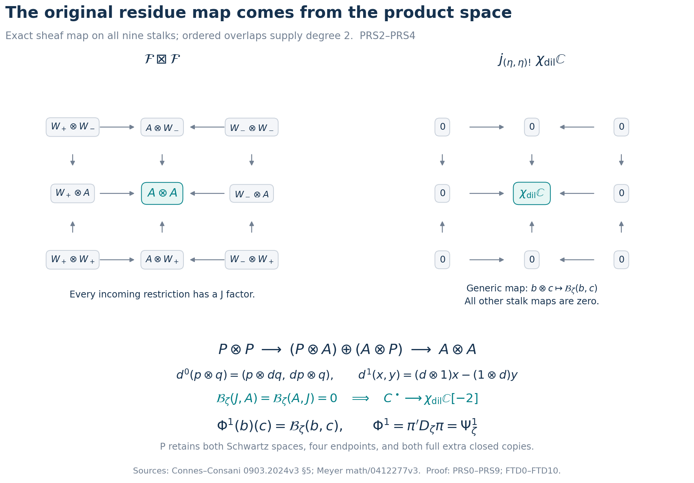
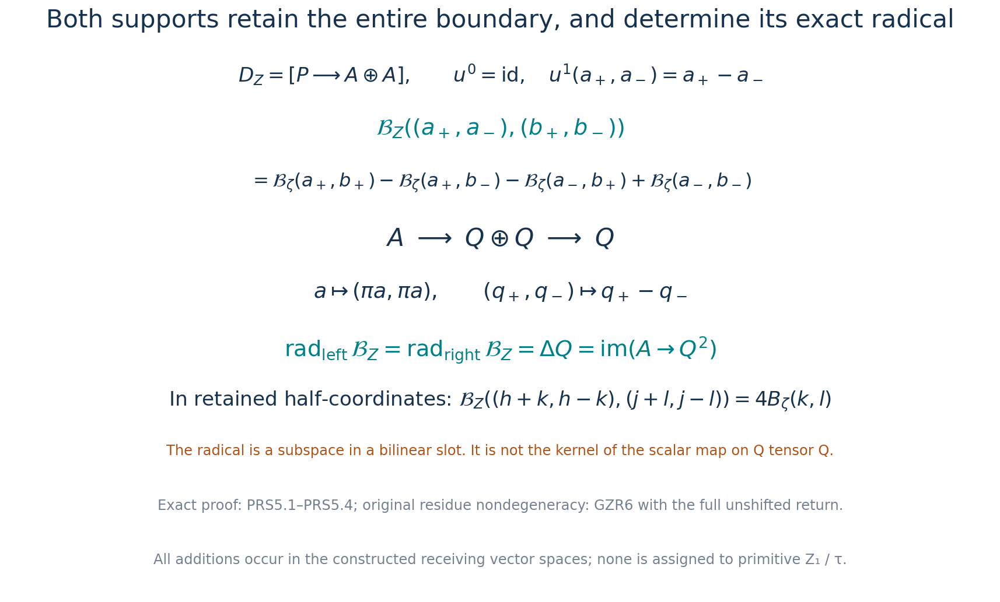
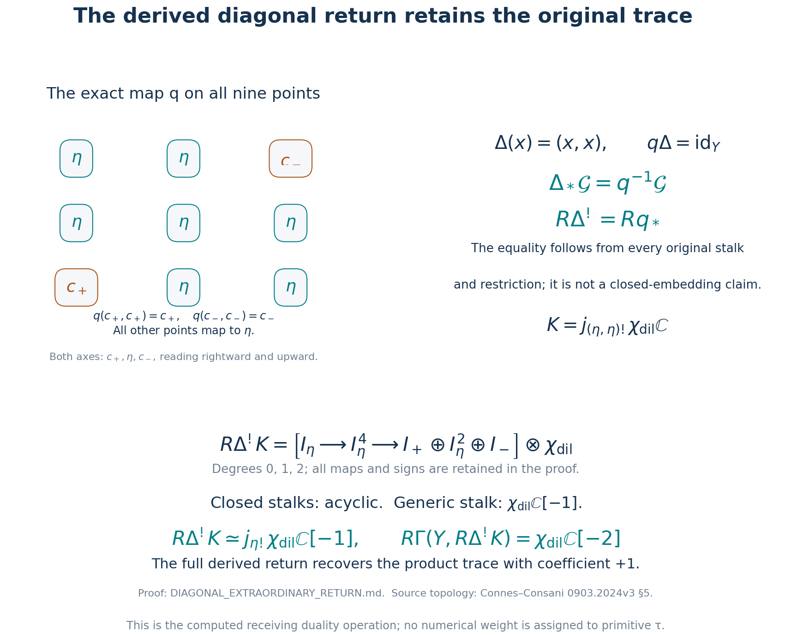
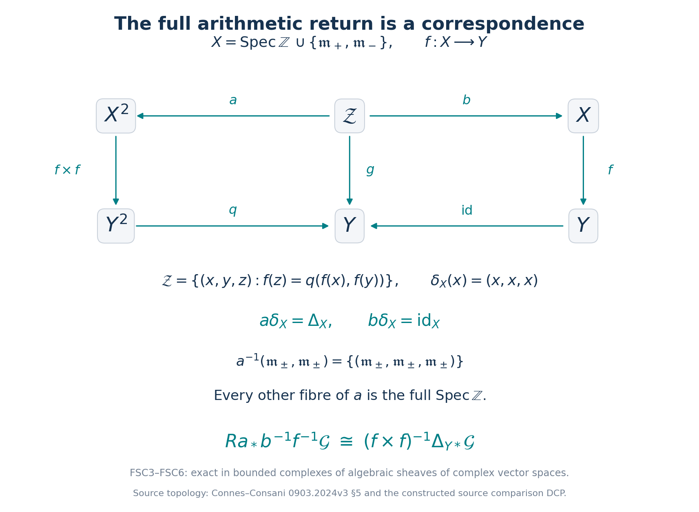
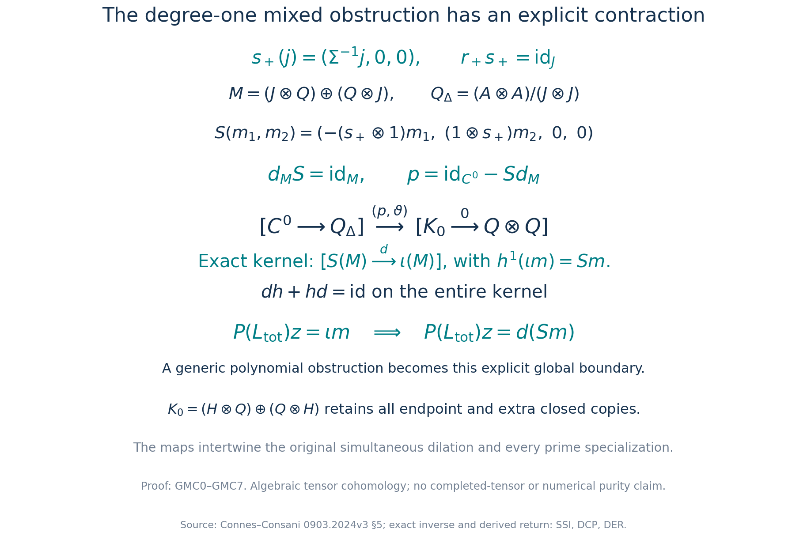
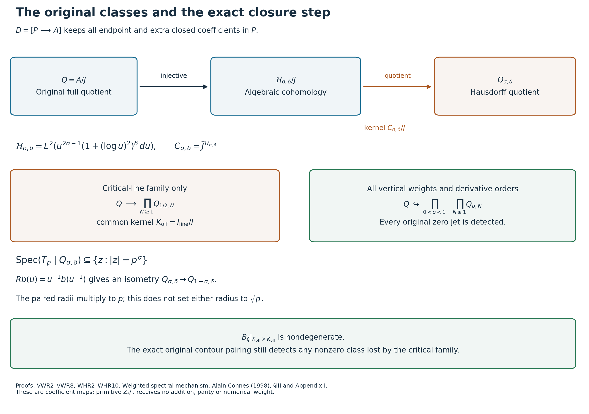
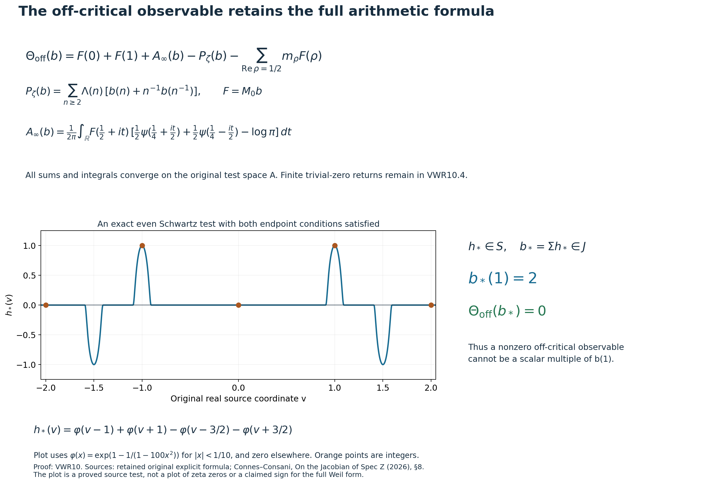

# Derived arithmetic returns and faithful spectral observations

Complete continuation of the Split-Zero cohomology and original-zeta research programme. This reader contains the new proofs at the stated frozen cutoff; earlier definitions and proofs remain in the [preceding cumulative edition](https://github.com/KokunoYumeto/zeta-function-research-reader/blob/36a82ecca98addb8a98b48204e349737856c7223/workbenches/splitzero-tandem/continuations/20260924-cohomology-weight-and-character-lifts/README.md). No RH, purity, or complexity-theory endpoint is claimed. Full multiplicities, original factors, source topologies, kernels and endpoint terms remain in the proofs.

## Included complete arguments

- [The right-adjoint dualizing complex on the original three-point base](https://github.com/KokunoYumeto/zeta-function-research-reader/blob/main/workbenches/splitzero-tandem/continuations/20260925-full-source-tensor-and-original-divisor/counterfactual/FINITE_TOPOLOGY_DUALIZING_COMPLEX.md)
- [The original residue pairing on the product of the actual coefficient spaces](https://github.com/KokunoYumeto/zeta-function-research-reader/blob/main/workbenches/splitzero-tandem/continuations/20260925-full-source-tensor-and-original-divisor/counterfactual/ORIGINAL_RESIDUE_PRODUCT_SHEAF_PAIRING.md)
- [The original residue pairing on the product base and its diagonal pullback](https://github.com/KokunoYumeto/zeta-function-research-reader/blob/main/workbenches/splitzero-tandem/continuations/20260925-full-source-tensor-and-original-divisor/counterfactual/RESIDUE_PRODUCT_DIAGONAL_INDEPENDENT.md)
- [The actual product pairing and its two-support radical](https://github.com/KokunoYumeto/zeta-function-research-reader/blob/main/workbenches/splitzero-tandem/continuations/20260925-full-source-tensor-and-original-divisor/counterfactual/PRODUCT_SHEAF_PAIRING_ILLUSTRATIONS.md)
- [The extraordinary diagonal return of the original residue pairing](https://github.com/KokunoYumeto/zeta-function-research-reader/blob/main/workbenches/splitzero-tandem/continuations/20260925-full-source-tensor-and-original-divisor/counterfactual/DIAGONAL_EXTRAORDINARY_RETURN.md)
- [The derived return and the complete arithmetic source correspondence](https://github.com/KokunoYumeto/zeta-function-research-reader/blob/main/workbenches/splitzero-tandem/continuations/20260925-full-source-tensor-and-original-divisor/counterfactual/DERIVED_RETURN_FULL_SOURCE_CORRESPONDENCE.md)
- [Global contraction of the actual mixed return, with its prime action](https://github.com/KokunoYumeto/zeta-function-research-reader/blob/main/workbenches/splitzero-tandem/continuations/20260925-full-source-tensor-and-original-divisor/counterfactual/GLOBAL_MIXED_RETURN_CONTRACTION.md)
- [Equivariant full-source return and the exact mixed tensor class](https://github.com/KokunoYumeto/zeta-function-research-reader/blob/main/workbenches/splitzero-tandem/continuations/20260925-full-source-tensor-and-original-divisor/counterfactual/FULL_SOURCE_RETURN_EQUIVARIANCE_AND_MIXED_TENSOR_CLASS.md)
- [The original Mellin quotient, weighted Hilbert return, and its exact kernel](https://github.com/KokunoYumeto/zeta-function-research-reader/blob/main/workbenches/splitzero-tandem/continuations/20260925-full-source-tensor-and-original-divisor/counterfactual/WEIGHTED_HILBERT_RETURN_AND_EXACT_KERNEL.md)
- [Every vertical weight, the faithful original return, and its residue pairing](https://github.com/KokunoYumeto/zeta-function-research-reader/blob/main/workbenches/splitzero-tandem/continuations/20260925-full-source-tensor-and-original-divisor/counterfactual/FULL_VERTICAL_WEIGHT_RETURN.md)
- [All tensor powers of the derived return and their actual growth estimates](https://github.com/KokunoYumeto/zeta-function-research-reader/blob/main/workbenches/splitzero-tandem/continuations/20260925-full-source-tensor-and-original-divisor/counterfactual/ALL_TENSOR_DERIVED_RETURN_AND_ACTUAL_GROWTH.md)
- [Independent check of the complete vertical receiving family](https://github.com/KokunoYumeto/zeta-function-research-reader/blob/main/workbenches/splitzero-tandem/continuations/20260925-full-source-tensor-and-original-divisor/counterfactual/FULL_VERTICAL_WEIGHT_RETURN_INDEPENDENT_CHECK.md)
- [The original classes, closure, and global arithmetic observable](https://github.com/KokunoYumeto/zeta-function-research-reader/blob/main/workbenches/splitzero-tandem/continuations/20260925-full-source-tensor-and-original-divisor/counterfactual/VERTICAL_WEIGHT_RETURN_ILLUSTRATIONS.md)
- [The full Gram projection and its resonance return](https://github.com/KokunoYumeto/zeta-function-research-reader/blob/main/workbenches/splitzero-tandem/continuations/20260925-full-source-tensor-and-original-divisor/counterfactual/FULL_GRAM_RESONANCE_RETURN.md)
- [Independent verification of the full Gram resonance calculation](https://github.com/KokunoYumeto/zeta-function-research-reader/blob/main/workbenches/splitzero-tandem/continuations/20260925-full-source-tensor-and-original-divisor/counterfactual/FGR_INDEPENDENT_CHECK.md)
- [Original-zeta harmonic sweeping, the full off-critical distribution, and an exact summation-image test](https://github.com/KokunoYumeto/zeta-function-research-reader/blob/main/workbenches/splitzero-tandem/continuations/20260925-full-source-tensor-and-original-divisor/counterfactual/ORIGINAL_ZETA_HARMONIC_SWEEP_AND_OFFCRITICAL_DEFECT.md)
- [Independent check of the global harmonic defect and original resolvent norm sum](https://github.com/KokunoYumeto/zeta-function-research-reader/blob/main/workbenches/splitzero-tandem/continuations/20260925-full-source-tensor-and-original-divisor/counterfactual/HSW_INDEPENDENT_CHECK.md)
- [Exact original prime dilation and its summation-image return](https://github.com/KokunoYumeto/zeta-function-research-reader/blob/main/workbenches/splitzero-tandem/continuations/20260925-full-source-tensor-and-original-divisor/counterfactual/ORIGINAL_PRIME_DILATION_FORCING_IDENTITY.md)
- [Independent check of the original prime-dilation forcing identity](https://github.com/KokunoYumeto/zeta-function-research-reader/blob/main/workbenches/splitzero-tandem/continuations/20260925-full-source-tensor-and-original-divisor/counterfactual/ORIGINAL_PRIME_DILATION_FORCING_INDEPENDENT_CHECK.md)
- [The Hilbert closure defect on the actual closed support and restriction cross](https://github.com/KokunoYumeto/zeta-function-research-reader/blob/main/workbenches/splitzero-tandem/continuations/20260925-full-source-tensor-and-original-divisor/counterfactual/HILBERT_CLOSURE_CLOSED_SUPPORT_AND_RESTRICTION.md)
- [Hybrid residue cones and the complete closed-support rows](https://github.com/KokunoYumeto/zeta-function-research-reader/blob/main/workbenches/splitzero-tandem/continuations/20260925-full-source-tensor-and-original-divisor/counterfactual/HILBERT_CLOSURE_SUPPORT_INDEPENDENT_CHECK.md)
- [Illustrations of the original-source harmonic comparison](https://github.com/KokunoYumeto/zeta-function-research-reader/blob/main/workbenches/splitzero-tandem/continuations/20260925-full-source-tensor-and-original-divisor/counterfactual/HARMONIC_SOURCE_RETURN_ILLUSTRATIONS.md)
- [Independent verification of WHR3–WHR7](https://github.com/KokunoYumeto/zeta-function-research-reader/blob/main/workbenches/splitzero-tandem/continuations/20260925-full-source-tensor-and-original-divisor/counterfactual/WHR3_7_INDEPENDENT_VERIFICATION_20260925.md)

# The right-adjoint dualizing complex on the original three-point base

24 September 2026. Independent derivation FTD0–FTD10.

## FTD0. Original source, reading and operation domain

The base here is precisely the original Connes–Consani three-point topology
\[
X=\{c_+,c_-,\eta\},\qquad
U_\pm=\{c_\pm,\eta\},\qquad U_\eta=\{\eta\},
\]
whose opens are \(\varnothing,U_\eta,U_+,U_-,X\). All five opens are retained. A sheaf of complex vector spaces is the diagram \(V_+\xrightarrow{r_+}A\xleftarrow{r_-}V_-\), with global sections its fibre product. No arithmetic point of the source fibre \(\operatorname{Spec}\mathbb Z\) is identified with another source point by this calculation.

The complete current [DCP0–DCP12](https://github.com/KokunoYumeto/zeta-function-research-reader/blob/36a82ecca98addb8a98b48204e349737856c7223/workbenches/splitzero-tandem/continuations/20260924-cohomology-weight-and-character-lifts/original-character-lifting/tau_lifting_weights_20260924/SOURCE_CC_DOUBLE_PULLBACK.md) and [CGS0–CGS10](https://github.com/KokunoYumeto/zeta-function-research-reader/blob/36a82ecca98addb8a98b48204e349737856c7223/workbenches/splitzero-tandem/continuations/20260924-cohomology-weight-and-character-lifts/original-character-lifting/tau_lifting_weights_20260924/SOURCE_COEFFICIENT_GLUE.md), including their displayed continuation records, were read. DCP constructs the exact map \(f:X^{\rm dbl}\to X\), its full arithmetic fibre, its inverse-image coefficients, and its faithful scalar extension. The current corpus rules (private construction record; not distributed), the user definitions and complete global arguments retained there remain controlling. Primitive \(Z_1/\tau\) has no addition, parity or numerical weight. The categories below contain receiving vector spaces and their sheaves, not primitive \(\tau\) objects.

The human geometric source is Alain Connes and Caterina Consani, [*Schemes over \(\mathbb F_1\) and zeta functions*, arXiv:0903.2024v3, §5](https://arxiv.org/abs/0903.2024v3). Their original author source, definitions and exact reading coverage are retained in DCP0. Deligne recalls the open/closed gluing category in [*La conjecture de Weil. II*, §3.4.8](https://www.numdam.org/item/PMIHES_1980__52__137_0/), as recorded with source kind and locator in CGS10. The analytic closed-image comparison uses [OMS](https://github.com/KokunoYumeto/zeta-function-research-reader/blob/36a82ecca98addb8a98b48204e349737856c7223/workbenches/splitzero-tandem/continuations/20260924-cohomology-weight-and-character-lifts/original-character-lifting/tau_lifting_weights_20260924/ORIGINAL_MELLIN_SPECTRAL_SYNTHESIS.md), with its original-zeta formula and Ralf Meyer's [arXiv:math/0412277v3](https://arxiv.org/abs/math/0412277v3) framework.

[ASD](https://github.com/KokunoYumeto/zeta-function-research-reader/blob/36a82ecca98addb8a98b48204e349737856c7223/workbenches/splitzero-tandem/continuations/20260924-cohomology-weight-and-character-lifts/original-character-lifting/tau_lifting_weights_20260924/ACTUAL_SUPPORTED_DUALITY_INDEPENDENT.md) already calculated the global continuous transpose and the full support row. The new calculation below constructs the actual sheaf-level right adjoint on this original topology, its stalks and restrictions, and the exact comparison to that transpose. It does not assume that a character twist and a global shift are a Verdier identification.

## FTD1. The diagram category, its projectives and its injectives

Let \(k=\mathbb C\), and let \(\mathsf{Sh}(X,k)\) be the abelian category of all sheaves of \(k\)-vector spaces on this finite topology. A sheaf \(F\) is exactly
\[
F=(V_+\xrightarrow{r_+}A\xleftarrow{r_-}V_-).
\tag{FTD1.1}
\]
To verify the equivalence, assign these values to the three minimal opens and their restriction maps; assign
\[
F(X)=\{(v_+,v_-):r_+v_+=r_-v_-\}.
\]
The only nontrivial gluing is the cover \(U_+\cup U_-=X\), whose compatibility is exactly that equality. All remaining covers include a minimal open itself or are empty. Morphisms are triples commuting with the two arrows. Kernels and cokernels are stalkwise, which proves the asserted abelian structure.

Write a diagram by its entries \((V_+,V_-,A)\). The projectives representing the three evaluations are
\[
P_+=(k,0,k;\mathrm{id},0),\quad
P_-=(0,k,k;0,\mathrm{id}),\quad
P_\eta=(0,0,k;0,0).
\tag{FTD1.2}
\]
Indeed
\(\operatorname{Hom}(P_+,F)=V_+\),
\(\operatorname{Hom}(P_-,F)=V_-\),
and \(\operatorname{Hom}(P_\eta,F)=A\), by evaluating a morphism on the displayed generator. These functors are exact, so the three objects are projective. More generally \(P_x\otimes W\) represents \(\operatorname{Hom}_k(W,F_x)\). Choosing bases gives enough such projectives.

The evaluation-right-adjoint objects are
\[
I_+(W)=(W,0,0;0,0),\quad
I_-(W)=(0,W,0;0,0),\quad
I_\eta(W)=(W,W,W;\mathrm{id},\mathrm{id}).
\tag{FTD1.3}
\]
They satisfy
\[
\operatorname{Hom}(F,I_x(W))=\operatorname{Hom}_k(F_x,W).
\tag{FTD1.4}
\]
For \(x=\eta\), an arbitrary map \(A\to W\) forces the two closed maps to be its compositions with \(r_\pm\), proving the identity. For a closed \(x\), the only nonzero component is the arbitrary map \(V_x\to W\). Since all vector spaces over a field are injective, each right-hand functor is exact: a linear map extends from a subspace by choosing a vector-space complement. Thus every \(I_x(W)\) is injective. These assertions are algebraic; they do not declare every locally convex vector space injective for continuous maps.

## FTD2. Compute \(R\Gamma\) and construct its right adjoint

Let \(k_X=(k,k,k;\mathrm{id},\mathrm{id})\). Then \(\Gamma(X,F)=\operatorname{Hom}(k_X,F)\). The exact projective resolution is
\[
0\to P_\eta
\xrightarrow{(-\mathrm{inc}_+,\mathrm{inc}_-)}
P_+\oplus P_-
\xrightarrow{\epsilon}k_X\to0.
\tag{FTD2.1}
\]
At the generic stalk \(\epsilon(a,b)=a+b\), whose kernel consists of \((-a,a)\); at each closed stalk it is identity. This proves exactness on all stalks. Put the two projective terms in degrees \(-1,0\). The Hom differential is \(-f\,d_P\) in degree0, so this resolution gives the original ordered complex
\[
R\Gamma(X,F)=
[\,V_+\oplus V_-\xrightarrow{\,r_+-r_-\,}A\,]
\quad\text{in degrees }0,1.
\tag{FTD2.2}
\]
This derives the sign from the resolution instead of changing the original ordering.

For a vector space \(W\) in degree0, define
\[
\boxed{
p^!W=
[\,I_\eta(W)\xrightarrow{(\mathrm{ev}_+,-\mathrm{ev}_-)}
I_+(W)\oplus I_-(W)\,]
\quad\text{in degrees }-1,0.}
\tag{FTD2.3}
\]
The two maps are identity on the corresponding closed stalk and zero on the other stalks. Applying \(\operatorname{Hom}(F,-)\) and FTD1.4 gives
\[
[\,\operatorname{Hom}_k(A,W)
\xrightarrow{\lambda\mapsto(\lambda r_+,-\lambda r_-)}
\operatorname{Hom}_k(V_+\oplus V_-,W)\,].
\tag{FTD2.4}
\]
This is precisely the Hom complex
\(\operatorname{Hom}_k(R\Gamma(X,F),W)\), with degrees \(-1,0\). The terms of FTD2.3 are injective, so it computes the derived Hom on the sheaf side.

For a bounded complex \(W^\bullet\), the full formula is
\[
(p^!W)^n=
I_\eta(W^{n+1})\oplus I_+(W^n)\oplus I_-(W^n),
\]
\[
d(a,b_+,b_-)=
(-d_Wa,\ \mathrm{ev}_+a+d_Wb_+,\ -\mathrm{ev}_-a+d_Wb_-).
\tag{FTD2.5}
\]
It is the total complex of FTD2.3 tensored with \(W^\bullet\). Substitution gives \(d^2=0\): the two terms involving each evaluation have opposite signs. The same Hom calculation, with the total-complex signs in FTD2.5, gives for bounded complexes \(F,W\)
\[
\boxed{
R\operatorname{Hom}_X(F,p^!W)
\simeq R\operatorname{Hom}_k(R\Gamma(X,F),W).}
\tag{FTD2.6}
\]
The complexes on both sides are computed by the projective resolution FTD2.1 and injective terms FTD1.3; their degreewise identifications FTD1.4 commute with the displayed differentials. This proves the right adjoint rather than presupposing it.

## FTD3. The actual dualizing complex and all its restrictions

Set \(\omega_X=p^!k\). Its complete stalk complexes are
\[
(\omega_X)_{c_+}=[k\xrightarrow{+1}k],\qquad
(\omega_X)_{c_-}=[k\xrightarrow{-1}k],\qquad
(\omega_X)_\eta=k[1],
\tag{FTD3.1}
\]
where the first two occupy degrees \(-1,0\) and \(k[1]\) places \(k\) in degree \(-1\). The restriction from either closed stalk to \(\eta\) is identity in degree \(-1\) and zero in degree0. These are actual sheaf complexes, not just their dimensions.

If \(j:\{\eta\}\hookrightarrow X\), the sheaf \(j_!k\) is the diagram \((0,0,k)\). The map
\[
j_!k[1]\longrightarrow\omega_X
\tag{FTD3.2}
\]
is identity at \(\eta\) in degree \(-1\) and zero at both closed stalks. It is a cochain map; it is a quasi-isomorphism at \(\eta\), and at each closed point both the source and the target have zero cohomology. Thus it is a sheaf quasi-isomorphism. The complete injective presentation FTD2.3 is nevertheless retained for the following calculations.

This is the right-adjoint dualizing complex for the stated \(R\Gamma\) functor on this finite topology. It is not the constant sheaf shifted by2. No claim that its restriction to every open is the right adjoint of the unmodified global-section functor on that open is needed: the relevant extension-by-zero calculation is given explicitly in FTD5.

## FTD4. Derived internal dual of the original diagram

Use \(W^*=\operatorname{Hom}_k(W,k)\) for the algebraic dual. For any sheaf \(F\) of the form FTD1.1, define
\[
\mathbb D_{\rm alg}F=R\mathcal Hom_X(F,\omega_X).
\]
The internal Hom into \(I_\eta(k)\) is \(I_\eta(A^*)\). To check its stalk at \(c_+\), a map of diagrams on \(U_+\) from \(V_+\to A\) to \(k\to k\) is determined by its map \(A\to k\); its closed map is then composition with \(r_+\). The same proof works at \(c_-\), and at \(\eta\) it is simply \(A^*\). Its restrictions are identities. Similarly
\(\mathcal Hom(F,I_\pm(k))=I_\pm(V_\pm^*)\).
These Hom functors are exact in \(F\), since algebraic dual over \(k\) is exact; equivalently the restricted target objects are injective on each minimal open. Therefore the complete derived dual is
\[
\boxed{
\mathbb D_{\rm alg}F=
[\,I_\eta(A^*)\xrightarrow{(r_+^*,-r_-^*)}
I_+(V_+^*)\oplus I_-(V_-^*)\,]
\quad(\deg=-1,0).}
\tag{FTD4.1}
\]
In particular
\[
(\mathbb D_{\rm alg}F)_{c_+}
=[A^*\xrightarrow{r_+^*}V_+^*],\qquad
(\mathbb D_{\rm alg}F)_{c_-}
=[A^*\xrightarrow{-r_-^*}V_-^*],
\]
\[
(\mathbb D_{\rm alg}F)_\eta=A^*[1].
\tag{FTD4.2}
\]
Both restrictions are identity on the degree-\(-1\) terms and zero in degree0.

Every term in FTD4.1 is injective. Its global derived sections are consequently its ordinary section complex:
\[
\boxed{
R\Gamma(X,\mathbb D_{\rm alg}F)
=[A^*\xrightarrow{(r_+^*,-r_-^*)}V_+^*\oplus V_-^*]
=\operatorname{Hom}_k(R\Gamma(X,F),k).}
\tag{FTD4.3}
\]
This gives the exact sheaf-level source of the algebraic global transpose. It contains no character twist and no additional shift.

## FTD5. Local support identities, all signs and contractions

For a closed point \(c_\pm\), the actual support complex is
\[
K_\pm(F)=[V_\pm\xrightarrow{r_\pm}A]\quad(\deg=0,1).
\tag{FTD5.1}
\]
It is the mapping fibre of the restriction on its minimal chart. FTD4.2 gives
\[
(\mathbb D_{\rm alg}F)_{c_+}=K_+(F)^*.
\]
At \(c_-\) the exact comparison
\[
(\mathbb D_{\rm alg}F)_{c_-}\longrightarrow K_-(F)^*
\tag{FTD5.2}
\]
is multiplication by \(-1\) on \(A^*\) in degree \(-1\) and identity on \(V_-^*\) in degree0. Indeed \(r_-^*(-\alpha)=-r_-^*\alpha\). Thus the original minus-support orientation is retained.

These same formulas can be obtained from the actual extension-by-zero maps. For \(j_+:U_+\hookrightarrow X\),
\[
j_{+!}(F|_{U_+})=(V_+,0,A),\qquad
R\Gamma(X,j_{+!}(F|_{U_+}))=[V_+\xrightarrow{r_+}A].
\]
For \(j_-\), the diagram is \((0,V_-,A)\), and the ordered global differential is \(-r_-\). For the generic open it is \((0,0,A)\), with global complex \(A\) in degree1. The extension-by-zero assertions follow directly from adjunction on diagrams: a map out of the stated diagram has precisely the prescribed components on the open and the zero outside it. Taking algebraic duals gives exactly all three stalks and both restriction maps in FTD4.2. This records which global functor on each open is being dualized.

There is also an exact dual-of-stalk calculation. Let \(\varepsilon_+=1\), \(\varepsilon_-=-1\). The closed costalk of \(\mathbb D_{\rm alg}F\) is the mapping fibre of its restriction to \(\eta\), namely
\[
[A^*\xrightarrow{\alpha\mapsto
(\varepsilon_\pm r_\pm^*\alpha,\alpha)}
V_\pm^*\oplus A^*]
\quad(\deg=-1,0).
\tag{FTD5.3}
\]
Its projection to \(V_\pm^*[0]\) is
\[
(v,\beta)\longmapsto v-\varepsilon_\pm r_\pm^*\beta,
\tag{FTD5.4}
\]
with section \(v\mapsto(v,0)\). The degree-\(-1\) homotopy sends \((v,\beta)\) to \(\beta\). Its differential followed by that homotopy is \((\varepsilon_\pm r_\pm^*\beta,\beta)\), the difference between identity and section-projection; on the degree-\(-1\) term it is identity. Hence
\[
\boxed{R i_\pm^!(\mathbb D_{\rm alg}F)\simeq V_\pm^*[0]}
\tag{FTD5.5}
\]
with a fully specified contraction.

For both closed points, the direct sum of FTD5.1 is the actual complete supported complex \([V_+\oplus V_-\to A\oplus A]\) with differential \((r_+,r_-)\). Its dual identifies with the restriction of \(\mathbb D_{\rm alg}F\) to the two closed points by the degree-\(-1\) sign \((\alpha_+,\alpha_-)\mapsto(\alpha_+,-\alpha_-)\) and identity in degree0. This retains every local support group and its original orientation.

## FTD6. Substitute the original CC sheaf and its faithful source extension

For the original \(\Omega\),
\[
V_\pm=S_{00}^{\rm even}\oplus\mathbb C^2,\qquad
r_+(h,c)=\Sigma h,\qquad r_-(h,d)=R\Sigma h.
\]
Keep the original four endpoint labels \(c_0,c_1,d_0,d_1\), Fourier phase \(e^{-2\pi ivt}\), factor2 in \(\Sigma\), and factor \(u^{-1}\) in \(R\). The full Poisson formula is
\[
\Sigma\widehat h(u)=u^{-1}\Sigma h(u^{-1})
+u^{-1}h(0)-\int_{\mathbb R}h(v)\,dv.
\tag{FTD6.1}
\]
On the specified \(S_{00}^{\rm even}\) the last two terms vanish by its defining conditions; the separate endpoint coordinates remain in \(V_\pm\).

DCP8–DCP9 proves that the faithful source extension pushes to the exact sheaf
\[
\Omega_{\rm full}
=\Omega\oplus i_{+*}V_+^{\rm extra}\oplus i_{-*}V_-^{\rm extra}.
\tag{FTD6.2}
\]
Write \(W_\pm=V_\pm\oplus V_\pm^{\rm extra}\). Its restrictions are \(r_\pm\) on the first summand and zero on the extra one. In every preceding formula replace \(V_\pm\) by these \(W_\pm\) and use those exact restrictions. In particular
\[
\mathbb D_{\rm alg}\Omega_{\rm full}
=\mathbb D_{\rm alg}\Omega
\oplus i_{+*}(V_+^{\rm extra})^*
\oplus i_{-*}(V_-^{\rm extra})^*
\tag{FTD6.3}
\]
with both extra dual terms in degree0. This follows directly from FTD4.1, not from an assumption that pullback commutes with a duality functor on the full arithmetic source. DCP's complete map and arithmetic fibre remain unchanged.

Let \(J=\Sigma S\), \(Q=A/J\). The original image theorem gives \(r_+(W_+)=r_-(W_-)=J\), and
\[
E_\pm=\ker r_\pm=\mathbb C^2_{\pm}\oplus V_\pm^{\rm extra}.
\]
Algebraic duality of the exact vector-space rows gives the complete cohomology sheaves
\[
\mathcal H^{-1}(\mathbb D_{\rm alg}\Omega_{\rm full})
=(Q^*\xrightarrow{\pi^*}A^*\xleftarrow{\pi^*}Q^*),
\]
\[
\mathcal H^0(\mathbb D_{\rm alg}\Omega_{\rm full})
=i_{+*}E_+^*\oplus i_{-*}E_-^*,
\quad \mathcal H^n=0\ (n\ne-1,0).
\tag{FTD6.4}
\]
At both closed stalks the degree-\(-1\) kernel is the annihilator of \(J\); the minus sign does not change that kernel. The degree-zero quotient is \(E_\pm^*\), by restriction to \(\ker r_\pm\). All restrictions on the degree-\(-1\) sheaf are the actual annihilator inclusions.

## FTD7. The continuous dual sheaf and its comparison to the algebraic one

Use \(W'\) exclusively for the actual continuous complex-linear dual. Define the explicit sheaf complex
\[
\boxed{
\mathbb D_c\Omega_{\rm full}
=[I_\eta(A')\xrightarrow{(r_+',-r_-')}
I_+(W_+')\oplus I_-(W_-')]
\quad(\deg=-1,0).}
\tag{FTD7.1}
\]
Give each dual its weak-* topology for exact quotient statements; the displayed transposes are also strong-dual continuous. This is a concrete diagram of the programme's existing continuous duals. It is not asserted to be an abstract Verdier equivalence for arbitrary topological vector spaces.

The natural inclusions of continuous functionals into all algebraic functionals give an injective cochain map
\[
\boxed{\mathbb D_c\Omega_{\rm full}
\longrightarrow\mathbb D_{\rm alg}\Omega_{\rm full}.}
\tag{FTD7.2}
\]
They commute with both restriction maps and differentials because each operation is composition with the same original map. Thus algebraic and continuous duals have a proved comparison rather than being silently interchanged.

For these precise original spaces, the required continuous exactness is proved as follows. The original \(\Sigma:S\to J\) is a topological isomorphism and \(J\) is closed in \(A\). The map \(r_\pm:W_\pm\to J\) has a continuous section obtained from \(\Sigma^{-1}\) and the original Fourier involution, with zero endpoint and extra coordinates. Hence \(W_\pm=E_\pm\oplus W_{\pm,0}\) topologically, with \(W_{\pm,0}\simeq J\). Every continuous functional on \(J\) extends to \(A\) by Hahn–Banach. Therefore
\[
\ker r_\pm'=\pi'Q',\qquad
\operatorname{coker}r_\pm'=E_\pm'
\tag{FTD7.3}
\]
with the exact restriction map to \(E_\pm\). The kernel equality uses the open quotient \(\pi:A\to Q\) to prove continuity of the factor through \(Q\). The cokernel equality uses the stated section and Hahn–Banach, not an algebraic extension of a discontinuous functional.

Consequently FTD6.4 holds for \(\mathbb D_c\) with \(Q',A',E_\pm'\) in place of their algebraic duals. The local support contractions FTD5.2–FTD5.5 also hold word for word with continuous duals: all maps in those explicit finite complexes are continuous. This proves the local identities on the actual programme objects without making a general topological duality claim.

Termwise taking the quotient of FTD7.2 defines a precise sheaf complex measuring discontinuous functionals:
\[
\mathbb D_{\rm disc}
=[I_\eta(A^*/A')\to
I_+(W_+^*/W_+')\oplus I_-(W_-^*/W_-')].
\tag{FTD7.4}
\]
The maps are those induced by the original restrictions. Its stalk cohomology is
\[
\mathcal H^{-1}(\mathbb D_{\rm disc})_{c_\pm}=Q^*/Q',
\quad
\mathcal H^0(\mathbb D_{\rm disc})_{c_\pm}=E_\pm^*/E_\pm',
\]
\[
\mathcal H^{-1}(\mathbb D_{\rm disc})_\eta=A^*/A',
\quad
\mathcal H^0(\mathbb D_{\rm disc})_\eta=0.
\tag{FTD7.5}
\]
Indeed the kernel/cokernel identifications in FTD6.4 and FTD7.3 make both cohomology maps injective, so the long exact sequence of the termwise quotient gives exactly these quotients. In the original sheaf without extra copies, \(E_\pm=\mathbb C^2\) and its degree-zero discontinuity quotient is zero. The full extra copies retain their actual possibly nonzero quotients.

## FTD8. Global sections and the exact relation to ASD

As underlying algebraic sheaves, the terms \(I_x(W')\) in FTD7.1 are injective by FTD1.4, whatever their additional weak-* topology. Thus their algebraic derived global sections are their displayed section complex. With its retained topology this is exactly
\[
\boxed{
R\Gamma(X,\mathbb D_c\Omega_{\rm full})
=[A'\xrightarrow{(r_+',-r_-')}W_+'\oplus W_-']
=(R\Gamma(X,\Omega_{\rm full}))'_c.}
\tag{FTD8.1}
\]
On the right the continuous dual complex uses differential
\(d(\lambda)=-(-1)^n\lambda d\); at \(n=-1\) the sign is positive, giving the displayed original transpose. Finite direct sums of Fréchet spaces have the corresponding continuous dual direct sums, so no tensor-dual interchange is used.

The original \(d:P\to A\) has closed image \(J\) and a continuous section onto \(J\), for example using only the plus chart and \(\Sigma^{-1}\). Its kernel is the complete Fourier graph \(H\), with endpoints and extra copies. Restriction \(P'\to H'\) is onto by Hahn–Banach (or the explicit Fourier-graph projection), and the annihilator of \(H\) is the image of \(d'\). These facts prove
\[
H^{-1}R\Gamma(X,\mathbb D_c\Omega_{\rm full})=Q',
\qquad
H^0R\Gamma(X,\mathbb D_c\Omega_{\rm full})=H'.
\tag{FTD8.2}
\]
The algebraic counterpart is \(Q^*,H^*\), and FTD7.2 induces the actual inclusions \(Q'\hookrightarrow Q^*\), \(H'\hookrightarrow H^*\). Its global quotient has cohomology \(Q^*/Q'\), \(H^*/H'\), by the same exact argument as FTD7.5.

In particular the complete ASD receiving target has the precise sheaf presentation
\[
\boxed{
\chi_{\rm dil}\otimes
(R\Gamma(X,\Omega_{\rm full}))'_c[-2]
=
R\Gamma\!\left(X,\chi_{\rm dil}\otimes
\mathbb D_c\Omega_{\rm full}[-2]\right).}
\tag{FTD8.3}
\]
The character \(\chi_{\rm dil}(a)=a\) and shift \([-2]\) are retained exactly where ASD puts them. They were not part of the right-adjoint complex FTD2.3 and have not been imported into its definition.

## FTD9. A precise same-site nonlift and its actual comparison map

Let
\[
\mathcal T=\chi_{\rm dil}\otimes\mathbb D_c\Omega_{\rm full}[-2].
\]
Its terms are injective algebraic sheaves in degrees1 and2; there is no term in degree0. Since it is a bounded complex of injectives, derived morphisms from the degree-zero sheaf \(\Omega_{\rm full}\) into \(\mathcal T\) are computed by the ordinary Hom complex. Its degree-zero group is zero. Hence
\[
\boxed{
\operatorname{Hom}_{D(\mathsf{Sh}(X,k))}
(\Omega_{\rm full},\mathcal T)=0.}
\tag{FTD9.1}
\]
One can also read this directly from the proved degrees: the source has cohomology only in degree0 and the target only in degrees1,2. The injective calculation supplies a complete proof on this specific category without requiring an unproved topological \(t\)-structure.

The existing global residue morphism is
\[
\Psi^0=0,\qquad
\Psi^1=\pi'D_\zeta\pi:
R\Gamma(X,\Omega_{\rm full})
\longrightarrow
\chi_{\rm dil}(R\Gamma(X,\Omega_{\rm full}))'_c[-2].
\tag{FTD9.2}
\]
It is nonzero in the derived category of vector spaces: on degree-one cohomology it is the proved injection \(D_\zeta:Q\to\chi_{\rm dil}Q'\), and \(Q\ne0\), as witnessed by any actual RZ isolated zero jet. Equations FTD8.3 and FTD9.1 therefore prove that this particular nonzero global morphism cannot be the derived global sections of a degree-zero same-site sheaf morphism \(\Omega_{\rm full}\to\mathcal T\).

This is the exact failure of that proposed lifting operation. It does not say the global pairing is unrelated to sheaf geometry: FTD8.3 constructs its exact sheaf-level target and proves the comparison of every term and map. Nor does it rule out a sheaf correspondence on a product base, a different degree or another specified functor. Such operations are not identified with the vanishing Hom group in FTD9.1.

## FTD10. Real actions, source labels and the exact result

The original real action remains
\[
T_ab(u)=b(u/a),\qquad
\rho_+(a)(h,c_0,c_1)=(h(\cdot/a),c_0,ac_1),
\]
\[
\rho_-(a)(h,d_0,d_1)=(a h(a\cdot),ad_0,d_1).
\]
The equality \(r_\pm\rho_\pm(a)=T_ar_\pm\) proves equivariance of the sheaf diagram. On \(\mathbb D_{\rm alg}\) and \(\mathbb D_c\), take the actual contragredient actions. Then every differential and restriction in FTD4.1 and FTD7.1 is equivariant by transposition. Twisting by \(\chi_{\rm dil}(a)=a\), when it is explicitly used in FTD8.3–FTD9, gives the exact receiving action \(a(T_{a^{-1}})'\). At an original prime, substitute \(a=p\), retaining every original factor and nilpotent in the induced Mellin jets.

The four original endpoint characters \(1,a,a,1\) become \(1,a^{-1},a^{-1},1\) on the untwisted dual, and \(a,1,1,a\) after the stated twist. The extra dual copies retain their full Schwartz and endpoint actions. The source receiving ring \(\mathbb Z^3\) acts by its original three coordinates: primitive \(\tau\)'s supplied image acts as identity everywhere, while integer \(n\) acts by \(n\) on the original component and zero on both extra components. All maps retain these actions, so the full sheaf and dual continue to distinguish source \(\tau\) from integer1.

Every receiving linear map has the established support-carrier lift \((v,\lambda)\mapsto(f(v),\lambda)\). Zero outputs keep their original labels, and independently labelled factors remain separate. This applies to the stalk restrictions, the algebraic/continuous comparison, and the explicit local support contractions. No supported zero is identified with primitive \(\tau\).

The right adjoint, its full stalk complexes, both restriction maps, the local support duals, the faithful added copies and the continuous/algebraic comparison have all been constructed. The equality FTD8.3 identifies exactly what the earlier global transpose is receiving from this topology. The vanishing FTD9.1 concerns the specified same-site, degree-zero sheaf lift; it neither discards the original global residue pairing nor asserts a Deligne weight or an RH conclusion.

## Publication source and dependency links

The source geometry is Alain Connes and Caterina Consani, *Schemes over F1 and zeta functions*, [arXiv:0903.2024v3, §5](https://arxiv.org/abs/0903.2024v3). The weight-control comparison is Pierre Deligne, *La conjecture de Weil. II*, Publications mathematiques de l'IHES52 (1980),137-252, [§§3.3.11 and3.6](https://www.numdam.org/item/PMIHES_1980__52__137_0/). Deligne material was read through the identified French transcription and separately recorded peer source-page checks, not Deligne-authored TeX. These sources are not asserted to contain the new programme derivations. The [preceding complete proof and reading record](https://github.com/KokunoYumeto/zeta-function-research-reader/blob/36a82ecca98addb8a98b48204e349737856c7223/workbenches/splitzero-tandem/continuations/20260924-cohomology-weight-and-character-lifts/BUILD_AND_REVIEW.md) records inherited source versions and actual inspection limits. The investigator's corrected construction remains attributed in the original text above.

# The original residue pairing on the product of the actual coefficient spaces

24 September 2026. Complete receiving derivation PRS0–PRS9.

## PRS0. Source data, provenance and the calculation being attempted

The user's amended instruction is to ask what would advance the target using both the finding and everything already established, then attempt that calculation. The immediately preceding finding is [FTD9](https://github.com/KokunoYumeto/zeta-function-research-reader/blob/main/workbenches/splitzero-tandem/continuations/20260925-full-source-tensor-and-original-divisor/counterfactual/FINITE_TOPOLOGY_DUALIZING_COMPLEX.md): the existing global residue map has a constructed continuous-dual sheaf target, but cannot be the derived global sections of a degree-zero morphism to that target on the same three-point space. The calculation here constructs its actual product-space origin. No source operation is inferred from a receiving scalar calculation.

The current source remains [B1–B5, P1–P5 and R1](https://github.com/KokunoYumeto/zeta-function-research-reader/blob/36a82ecca98addb8a98b48204e349737856c7223/workbenches/splitzero-tandem/continuations/20260924-cohomology-weight-and-character-lifts/original-character-lifting/foundations/user_definitions_20260924/SOURCE_OPERATIONS_AND_PROOFS.md). In the user's notation, \(Z_0\) is absence, \(Z_1/\tau\) is presence without \(Z_2\) parity or addition, and the supplied integer layer retains its integer amounts and \(Z_2\) data. Neither copies of primitive \(\tau\) nor a numerical weight on it are introduced. Every tensor, sum, dual and contour below is an operation on the explicitly constructed receiving vector spaces.

Alain Connes and Caterina Consani construct the three-point base, coefficient restrictions, ordered Čech complex and Fourier lift in [*Schemes over \(\mathbb F_1\) and zeta functions*, 0903.2024v3, §5](https://arxiv.org/abs/0903.2024v3). Their original author TeX and exact locators are retained in [DCP0](https://github.com/KokunoYumeto/zeta-function-research-reader/blob/36a82ecca98addb8a98b48204e349737856c7223/workbenches/splitzero-tandem/continuations/20260924-cohomology-weight-and-character-lifts/original-character-lifting/tau_lifting_weights_20260924/SOURCE_CC_DOUBLE_PULLBACK.md). The faithful source comparison is the complete DCP and [CGS](https://github.com/KokunoYumeto/zeta-function-research-reader/blob/36a82ecca98addb8a98b48204e349737856c7223/workbenches/splitzero-tandem/continuations/20260924-cohomology-weight-and-character-lifts/original-character-lifting/tau_lifting_weights_20260924/SOURCE_COEFFICIENT_GLUE.md) construction, including all arithmetic points and the added closed copies. Ralf Meyer's [*A spectral interpretation for the zeros of the Riemann zeta function*, math/0412277v3](https://arxiv.org/abs/math/0412277v3) supplies the analytic framework used in the retained [OMS proof](https://github.com/KokunoYumeto/zeta-function-research-reader/blob/36a82ecca98addb8a98b48204e349737856c7223/workbenches/splitzero-tandem/continuations/20260924-cohomology-weight-and-character-lifts/original-character-lifting/tau_lifting_weights_20260924/ORIGINAL_MELLIN_SPECTRAL_SYNTHESIS.md). The exact original denominator, division, continuity and two-sided nondegeneracy are proved in [GZR1–GZR8](https://github.com/KokunoYumeto/zeta-function-research-reader/blob/36a82ecca98addb8a98b48204e349737856c7223/workbenches/splitzero-tandem/continuations/20260924-cohomology-weight-and-character-lifts/original-character-lifting/tau_lifting_weights_20260924/GLOBAL_ORIGINAL_ZETA_RESIDUE_DUALITY_INDEPENDENT.md), with their unshifted return in [ASD1 and ASD14](https://github.com/KokunoYumeto/zeta-function-research-reader/blob/36a82ecca98addb8a98b48204e349737856c7223/workbenches/splitzero-tandem/continuations/20260924-cohomology-weight-and-character-lifts/original-character-lifting/tau_lifting_weights_20260924/ACTUAL_SUPPORTED_DUALITY_INDEPENDENT.md).

Pierre Deligne's [*La conjecture de Weil. II*, §§3.3.11, 3.4.8 and 3.6.1–3.6.3](https://www.numdam.org/item/PMIHES_1980__52__137_0/) is the human source for the duality, gluing and lifting comparison being sought. The retained French text is an identified transcription, not author TeX. In particular §3.3.11 identifies the dualizing-complex property used for the Poincaré argument. We calculate our actual complexes rather than assigning them that property.

## PRS1. Full coefficients and original analytic pairing

Write the receiving base as
\[
Y=\{c_+,c_-,\eta\},\quad U_\pm=\{c_\pm,\eta\},\quad U_\eta=\{\eta\}.
\]
Its opens are \(\varnothing,U_\eta,U_+,U_-,Y\). Retain
\[
S=\{h\in\mathcal S(\mathbb R;\mathbb C):h(-v)=h(v),\ h(0)=0,\ \int_{\mathbb R}h(v)\,dv=0\},
\]
\[
A=\{b\in C^\infty(\mathbb R_{>0}):\sup_{u>0}(u^N+u^{-N})|(u\partial_u)^jb(u)|<\infty\text{ for all }N,j\geq0\},
\]
\[
\Sigma h(u)=2\sum_{n\geq1}h(nu),\qquad Rb(u)=u^{-1}b(u^{-1}),\qquad
M_0b(s)=\int_0^\infty b(u)u^s\frac{du}{u}.
\tag{PRS1.1}
\]
The full coefficient sheaf is
\[
\mathcal F=\Omega_{\rm full}=(W_+\xrightarrow{r_+}A\xleftarrow{r_-}W_-),\qquad
W_\pm=(S\oplus\mathbb C^2_\pm)\oplus V_\pm^{\rm extra},
\]
\[
r_+(h,c_0,c_1,v)=\Sigma h,\qquad r_-(h,d_0,d_1,v)=R\Sigma h.
\tag{PRS1.2}
\]
The extra copies are the full copies supplied by DCP, not just their endpoint subspaces. The Fourier convention is \(\widehat h(t)=\int h(v)e^{-2\pi ivt}\,dv\). Its complete Poisson formula is
\[
\Sigma\widehat h(u)=u^{-1}\Sigma h(u^{-1})+u^{-1}h(0)-\int h(v)\,dv.
\tag{PRS1.3}
\]
The two last terms vanish on the stated \(S\); all four endpoint coordinates remain in (PRS1.2). The proved image theorem gives the closed subspace
\[
J=\Sigma S=r_+(W_+)=r_-(W_-),\qquad Q=A/J,
\]
and identifies \(M_0J\) with the entire functions rapidly decreasing on bounded vertical strips whose full required jets vanish at every actual nontrivial zero of \(\zeta\). Thus none of these zeros or their multiplicities is selected in advance.

For \(b,c\in A\) put
\[
\mathcal B_\zeta(b,c)=\frac1{2\pi i}
\left(\int_{2-i\infty}^{2+i\infty}-\int_{-1-i\infty}^{-1+i\infty}\right)
\frac{(M_0b)(s)(M_0c)(1-s)}{\zeta(s)}\,ds.
\tag{PRS1.4}
\]
Both edges are upward. The reciprocal on the right edge is bounded by \(\zeta(2)\); on the left it is bounded by \(4\pi^2\zeta(2)(1+|t|)^{-3/2}\), as derived in GZR2 from the complete multiplier
\[
\chi_\zeta(s)=2^s\pi^{s-1}\sin(\pi s/2)\Gamma(1-s)
=\pi^{s-1/2}\frac{\Gamma((1-s)/2)}{\Gamma(s/2)},\qquad
\zeta(s)=\chi_\zeta(s)\zeta(1-s).
\tag{PRS1.5}
\]
In particular, writing \(b_{2,1}(F)=\sup_{|\sigma|\leq2,t}(1+|t|)|F(\sigma+it)|\),
\[
|\mathcal B_\zeta(b,c)|\leq
\frac{\zeta(2)(1+4\pi^2)}{\pi}\,b_{2,1}(M_0b)b_{2,1}(M_0c).
\tag{PRS1.6}
\]
This proves joint continuity. It is not a completed-zeta pairing. At zero, \(\zeta(0)=-1/2\); at one, its reciprocal has a zero. The trivial zeros lie outside the indicated strip. The original Schwartz return still contains their residues
\[
\operatorname{Res}_{s=-2m}\frac{H(s)}{\zeta(s)}=\frac{H(-2m)}{\zeta'(-2m)},\quad
\zeta'(-2m)=(-1)^m2^{-2m-1}\pi^{-2m}(2m)!\zeta(1+2m),\quad m\geq1.
\tag{PRS1.7}
\]
For an earlier centered representative \(k\), the already constructed return is \(\mathcal Tk(u)=2u^{-1/2}k(u)\), so \(M_0\mathcal Tk=2\mathcal Mk\). In the notation of GZR2 the exact identity is
\[
\mathcal B_\zeta(\mathcal Tk,\mathcal Tl)=4\mathfrak B_\zeta(\mathcal Mk,\mathcal Ml).
\]
The right-hand arguments are the original centered Mellin transforms, while the left-hand arguments are their unshifted physical representatives. The factor four is retained, not replaced by a choice of representative.

The actual division theorem makes \((M_0b)/\zeta\) holomorphic and rapidly decreasing on this closed strip when \(b\in J\). Cauchy's theorem on the rectangle, followed by the vanishing horizontal integrals of length three, then proves \(\mathcal B_\zeta(J,A)=0\). Reflection preserves every zero multiplicity by (PRS1.5), so the same proof gives \(\mathcal B_\zeta(A,J)=0\). Hence
\[
\mathcal B_\zeta(b,c)=B_\zeta(\pi b,\pi c),\qquad
D_\zeta:Q\longrightarrow\chi_{\rm dil}Q',\quad D_\zeta x(y)=B_\zeta(x,y),
\tag{PRS1.8}
\]
where \(\pi:A\to Q\) and \(\chi_{\rm dil}(a)=a\). The two-sided nondegeneracy theorem GZR6 applies through the displayed factor-four return. It asserts zero left and right radicals; it does not assert that the linear map \(Q\otimes Q\to\mathbb C\) is injective or that \(D_\zeta\) is onto.

## PRS2. A genuine product-space sheaf morphism

All tensor products in this proof are algebraic over \(\mathbb C\) unless a topology is explicitly stated. Define the external tensor sheaf on the finite product topology by
\[
\mathcal E_{(x,y)}=\mathcal F_x\otimes\mathcal F_y,
\]
with restriction \(r_{xx'}\otimes r_{yy'}\) for each ordered specialization to a more generic point. These maps compose because the original restrictions do. A finite-topology diagram specifies a sheaf by compatible families on each open; gluing holds componentwise. This constructs \(\mathcal E=\mathcal F\boxtimes\mathcal F\) without a completed tensor-product assertion.

Let \(j_{\eta\eta}:\{(\eta,\eta)\}\hookrightarrow Y^2\) and
\[
\mathcal K=j_{\eta\eta!}\chi_{\rm dil}\mathbb C.
\]
Its stalk at \((\eta,\eta)\) is the displayed character line and its other eight stalks are zero. All nonidentity restrictions are zero. This is extension by zero: a morphism from this diagram is exactly a map from its generic value to the generic value of the target, with no further condition.

Define \(\beta_\zeta:\mathcal E\to\mathcal K\) at the generic pair by
\[
\beta_{\zeta,\eta\eta}(b\otimes c)=\mathcal B_\zeta(b,c),
\tag{PRS2.1}
\]
and by zero on the other eight stalks. Bilinearity gives a unique linear map on the algebraic tensor. For any restriction into the generic pair from a different point, at least one component lies in \(r_+(W_+)=J\) or \(r_-(W_-)=J\). Equation (PRS1.8) kills it. Every other compatibility has both sides zero. Thus (PRS2.1) is an actual sheaf morphism, with all nine stalk maps and restrictions checked.

The bound (PRS1.6) also extends the generic bilinear map continuously to the completed projective tensor product. The sheaf and cohomology calculations below use the already specified algebraic tensor; no equality with a completed Künneth object is required or claimed.

## PRS3. Ordered product Čech complex and trace

Put \(P=W_+\oplus W_-\) and \(d(p_+,p_-)=r_+p_+-r_-p_-\). The original complex is
\[
D=[P\xrightarrow{d}A],\qquad \deg P=0,\quad\deg A=1.
\]
For the two ordered covers \((U_+,U_-)\), the product Čech double complex has total complex
\[
C^0=P\otimes P,\quad
C^1=(P\otimes A)\oplus(A\otimes P),\quad
C^2=A\otimes A,
\]
\[
d_C^0(p\otimes q)=(p\otimes dq,dp\otimes q),\qquad
d_C^1(x,y)=(d\otimes1)x-(1\otimes d)y.
\tag{PRS3.1}
\]
The sign follows from \(d_{D\otimes D}=d\otimes1+(-1)^i1\otimes d\) on first degree \(i\). Direct substitution gives \(d_C^1d_C^0=dp\otimes dq-dp\otimes dq=0\).

Here is why this complex computes the indicated sheaf cohomology. Every nonempty intersection of the product cover is a minimal open \(U_x\times U_y\). Sections over it are its value at \((x,y)\), an exact evaluation functor, so higher cohomology on it vanishes. The augmented Čech resolution is exact stalkwise: at a point belonging to both one-dimensional charts it is the split augmented sequence \(0\to V\to V^2\to V\to0\), and at a point belonging to only one chart it is the identity augmentation. Taking the two successive resolutions gives an exact product resolution, with precisely the total sign in (PRS3.1). Its terms are globally acyclic. Indeed, for the inclusion \(j\) of any such intersection, the intersection with any other minimal product open is again minimal or empty. Thus every stalk of \(j_*G\) is an exact evaluation of \(G\) or zero, proving that this particular \(j_*\) is exact. It also preserves injectives because its left adjoint, restriction, is exact. Applying it to an injective resolution therefore proves \(R\Gamma(Y^2,j_*G)=R\Gamma(\operatorname{dom}j,G)\), whose positive cohomology vanishes by exact evaluation. This proves the required Čech computation rather than assuming a topological Künneth theorem.

For \(\mathcal K\) the same double complex is zero except at bidegree \((1,1)\), where it is \(\chi_{\rm dil}\mathbb C\). Therefore
\[
R\Gamma(Y^2,\mathcal K)=\chi_{\rm dil}\mathbb C[-2],\qquad
\operatorname{tr}_{\eta\eta}:H^2(Y^2,\mathcal K)\to\chi_{\rm dil}\mathbb C,\quad z\mapsto z.
\tag{PRS3.2}
\]
The trace is the coefficient in the ordered pair of overlaps, with sign \(+1\). The resulting cochain map is
\[
C\longrightarrow\chi_{\rm dil}\mathbb C[-2],\qquad
\beta^0=\beta^1=0,\quad \beta^2(b\otimes c)=\mathcal B_\zeta(b,c).
\tag{PRS3.3}
\]
Its cochain equation is exactly the two annihilations in (PRS1.8), applied to the two terms in \(d_C^1\). Endpoints and both full extra copies remain in \(C^0,C^1\); their restrictions are the original zero maps, not discarded summands.

The top cohomology has the precise form
\[
H^2(C)=(A\otimes A)/(J\otimes A+A\otimes J)\xrightarrow{\ \pi\otimes\pi\ }Q\otimes Q.
\tag{PRS3.4}
\]
This arrow is an isomorphism. A bilinear map on \(A\times A\) factors through \(Q\times Q\) exactly when it vanishes on \(J\) in each slot; the universal properties of the two tensors give inverse maps between the quotient and \(Q\otimes Q\). Thus its kernel and surjectivity are both proved. The other two cohomology groups are retained as
\[
H^0(C)=\ker d_C^0,\qquad H^1(C)=\ker d_C^1/\operatorname{im}d_C^0.
\tag{PRS3.5}
\]
No vanishing of these groups is used to define the trace.

## PRS4. Exact return to the original global dual map

The continuous dual complex \(D'_c\) is \([A'\xrightarrow{d'}P']\) in degrees \(-1,0\), with \((d'\lambda)(p)=\lambda(dp)\). Thus \(\chi_{\rm dil}D'_c[-2]\) has degrees \(1,2\). Currying (PRS3.3), retaining the first factor as source, gives
\[
\Phi:D\longrightarrow\chi_{\rm dil}D'_c[-2],\qquad
\Phi^0=0,\quad (\Phi^1b)(c)=\mathcal B_\zeta(b,c).
\tag{PRS4.1}
\]
There is no factor permutation and hence no permutation sign. Continuity is (PRS1.6). The two cochain conditions are
\[
\Phi^1dp=0,\qquad (d'\Phi^1b)(p)=\mathcal B_\zeta(b,dp)=0.
\]
By (PRS1.8), as an equality of the original maps with their complete domains and codomains,
\[
\boxed{\Phi^1=\pi'D_\zeta\pi=\Psi_\zeta^1.}
\tag{PRS4.2}
\]
Consequently this is exactly the global comparison in ASD14 and SCT, with its previously calculated full cone. It is not an independent substitute having the same zero set.

FTD8 constructs its same-space target as \(R\Gamma(Y,\chi_{\rm dil}\mathbb D_c\mathcal F[-2])\). FTD9 proves that the degree-zero same-space sheaf morphism to that specific target vanishes. Equations (PRS2.1)–(PRS4.2) explain the nonzero global map by the external product and its degree-two trace. The two degree-one inputs are essential to this construction. No Poincaré-duality identification is inferred from the resulting degree two.

## PRS5. Both original supports: full matrix and exact radical

Retain the actual two-support complex and its map to the original global complex:
\[
D_Z=[P\xrightarrow{d_Z}A\oplus A],\quad
d_Z(p_+,p_-)=(r_+p_+,r_-p_-),
\]
\[
u^0=\operatorname{id}_P,\qquad u^1(a_+,a_-)=a_+-a_-.
\tag{PRS5.1}
\]
The equality \(u^1d_Z=d\) proves the cochain condition. Pulling (PRS3.3) back through \(u\otimes u\) gives in degree two
\[
\begin{aligned}
\mathcal B_Z((a_+,a_-),(b_+,b_-))={}&\mathcal B_\zeta(a_+,b_+)-\mathcal B_\zeta(a_+,b_-)\\
&-\mathcal B_\zeta(a_-,b_+)+\mathcal B_\zeta(a_-,b_-).
\end{aligned}
\tag{PRS5.2}
\]
Each boundary is killed because each of its components belongs to \(J\). On \(H^1(D_Z)=Q\oplus Q\), its curried map is exactly
\[
\begin{pmatrix}D_\zeta&-D_\zeta\\-D_\zeta&D_\zeta\end{pmatrix}.
\tag{PRS5.3}
\]
The left radical is \(\Delta Q=\{(q,q):q\in Q\}\). Indeed a vector in this diagonal has difference zero. Conversely, if its pairing with all \((y,0)\) vanishes, then \(B_\zeta(q_+-q_-,y)=0\) for all \(y\), and the proved left nondegeneracy gives \(q_+=q_-\). The same argument with right nondegeneracy proves the right radical is also \(\Delta Q\).

The original boundary from the open part is \(A\to Q^2\), \(a\mapsto(\pi a,\pi a)\). Its image is exactly this radical because \(\pi\) is onto. The induced quotient map
\[
(Q\oplus Q)/\Delta Q\longrightarrow Q,\qquad [(q_+,q_-)]\longmapsto q_+-q_-
\tag{PRS5.4}
\]
is an isomorphism: it is onto via \((q,0)\), and its kernel is the displayed diagonal. The induced form is precisely \(B_\zeta\). In the symmetric splitting used in SCT, \((q_+,q_-)=(h+k,h-k)\); (PRS5.2) is therefore \(4B_\zeta(k,l)\), with the factor four retained. This constructs the exact relationship between the open boundary and the pairing radical, without asserting that a single linear functional on \(Q\otimes Q\) is injective.

## PRS6. All real and prime actions, and the source scalar action

For \(a>0\), \(T_ab(u)=b(u/a)\) gives \(M_0T_ab(s)=a^sM_0b(s)\). Therefore, directly in the original integral,
\[
\mathcal B_\zeta(T_ab,T_ac)=a\mathcal B_\zeta(b,c).
\tag{PRS6.1}
\]
The restrictions intertwine this action with
\[
\rho_+(a)(h,c_0,c_1)=(h(\cdot/a),c_0,ac_1),\qquad
\rho_-(a)(h,d_0,d_1)=(a h(a\cdot),ad_0,d_1),
\]
and the retained corresponding actions on the extra copies. Consequently the product sheaf morphism is equivariant for the simultaneous dilation and target character \(a\); the global transpose has action \(a(T_{a^{-1}})'\). Substituting every original prime \(p\) retains all prime factors. Differentiation yields \(B_\zeta(Lx,y)+B_\zeta(x,Ly)=B_\zeta(x,y)\), where \(L=-u\partial_u\); this is an identity of the actual operators, not a choice of numerical weight on source \(\tau\).

The source comparison instead has receiving ring \(\mathbb Z^3\), source integer image \([n]=(n,0,0)\), and \([\tau]=(1,1,1)\). At the generic stalk only its first coordinate acts. The exact scalar balance is
\[
\mathcal B_\zeta(nb,c)=n\mathcal B_\zeta(b,c)=\mathcal B_\zeta(b,nc),\qquad
\mathcal B_\zeta(nb,nc)=n^2\mathcal B_\zeta(b,c).
\tag{PRS6.2}
\]
Thus a simultaneous source integer action is not silently replaced by the dilation character in (PRS6.1). On the full tensor sheaf the commuting scalar actions in the two factors remain independent. At every stalk each restriction respects the original scalar action, including zero integer action on the two extra copies. Primitive \(\tau\)'s supplied multiplicative image acts as identity; that does not identify it with integer one in the full coefficients.

## PRS7. Return to the full arithmetic source and its labels

DCP constructs the continuous map \(f:X^{\rm dbl}\to Y\), whose generic fibre is the complete \(U=\operatorname{Spec}\mathbb Z\), and whose other two fibres are \(m_+,m_-\). No arithmetic primes are removed from \(U\). Pulling (PRS2.1) back along \(f\times f\) gives an exact sheaf map
\[
(f\times f)^{-1}(\mathcal F\boxtimes\mathcal F)
\longrightarrow(f\times f)^{-1}\mathcal K.
\tag{PRS7.1}
\]
At \((x,y)\) its map is (PRS2.1) on the corresponding stalks \(\mathcal F_{f(x)}\otimes\mathcal F_{f(y)}\). Thus its value is the original bilinear form at every pair in \(U\times U\); outside that open at least one target stalk is zero. The pullback target identifies with extension by zero of the constant character line on \(U\times U\). To prove the identification, the restriction on that open is constant because \(f\times f\) is constant there. Extension-by-zero adjunction gives a map from that extension to the pullback; it is identity on each stalk in \(U\times U\), and both stalks are zero elsewhere. It is therefore a sheaf isomorphism. This proves the exact source return used here without assuming that all inverse-image or tensor functors commute with an unspecified duality.

All support labels can be retained through this new receiving operation. Explicitly let \(L\) be the established bounded support lattice and
\[
G_L(V)=\{(0,\lambda):\lambda\in L\}\cup\{(v,1_L):v\in V\}.
\]
For the two independent factors retain their ordered pair of labels. The map
\[
G_L(A)\times G_L(A)\longrightarrow G_{L\times L}(\mathbb C),\quad
((b,\lambda),(c,\mu))\longmapsto(\mathcal B_\zeta(b,c),(\lambda,\mu))
\tag{PRS7.2}
\]
is well defined. A non-top \(\lambda\) forces \(b=0\); a non-top \(\mu\) forces \(c=0\). In either case the output amplitude is zero, so it is allowed at the original ordered support. If both supports are top, any output amplitude is allowed. In particular a zero produced by the pairing retains \((\lambda,\mu)\). The map of each linear tensor stalk and every cochain restriction has the usual label-preserving lift. These are maps of the named receiving carriers, not an addition or a count of primitive \(\tau\).

## PRS8. What the construction says about numerical characters

The direct consequence of (PRS6.1) can be calculated without a weight assumption. For actual eigenvectors \(T_ax=a^\rho x\), \(T_ay=a^\sigma y\), a nonzero \(B_\zeta(x,y)\) forces
\[
a^{\rho+\sigma}=a\quad\text{for every }a>0,
\quad\text{hence}\quad\rho+\sigma=1.
\tag{PRS8.1}
\]
For the last implication put \(a=e^t\), differentiate at \(t=0\), and divide by the nonzero pairing. This calculation pairs the two characters; it is not an equality of either character with its complex conjugate. The original pairing is complex bilinear throughout.

For comparison with all retained jets, on the actual primary quotient at a zero \(\rho\) of order \(m\), the original action is
\[
p^{\rho+t}=p^\rho\sum_{j=0}^{m-1}\frac{(\log p)^j}{j!}t^j
\quad\text{in }\mathbb C[t]/(t^m),
\tag{PRS8.2}
\]
and the reflected factor has argument \(1-\rho-t\). Their product is exactly \(p\) in the full quotient, since the two finite exponential series multiply as the truncation of \(e^{t\log p}e^{-t\log p}=1\). No nilpotent or logarithm is dropped. The exact residue coefficient remains
\[
\operatorname{Res}_{s=\rho}\frac{F(s)G(1-s)}{\zeta(s)}
=\sum_{i+j+k=m-1}\frac{F^{(i)}(\rho)}{i!}
\frac{(-1)^jG^{(j)}(1-\rho)}{j!}
\frac{(1/g)^{(k)}(0)}{k!},\qquad
\zeta(\rho+t)=t^m g(t).
\tag{PRS8.3}
\]
The finite sum follows by multiplying the three full Taylor series and taking the coefficient of \(t^{m-1}\). It is the original denominator, including its unit germ \(g\), not a replacement denominator.

The support radical result (PRS5.4) and the character identity (PRS8.1) are the exact new receiving conclusions. Neither asserts the numerical separation needed by Deligne's lifting proof. The next calculation prompted by the amended rule is the actual diagonal comparison: determine whether the just-constructed product trace returns along the diagonal in a degree and with maps that can produce that separation. That calculation is carried out independently in the accompanying product/diagonal derivation; it cannot be replaced by calling the diagonal a closed immersion without checking the original topology.

## PRS9. Verification and limits of use

All nine stalk compatibilities, the two ordered Čech differentials, the factor-four unshifted return, the exact global currying, both support radicals, every real/prime dilation, source scalar balance and arithmetic pullback have been constructed above. The finite exact checks accompanying this proof test signs and boundary terms; the proof uses the full original spaces. The complete original cone and its nonzero global dual remainder from SCT, RPC and FPO remain present after (PRS4.2). This result supplies a geometric product origin for the existing global map. It supplies no assertion that primitive \(Z_1/\tau\) carries a numerical weight and no RH conclusion.

### The derived diagonal operation restores the original trace

The next calculation is completed in DIAGONAL_EXTRAORDINARY_RETURN.md. Define q:Y^2→Y by q(c+,c+)=c+, q(c-,c-)=c-, and send the other seven points to eta. Its inverse images of the three minimal opens are computed explicitly. The stalk identity Delta_*=q^{-1}, including all restrictions, proves that the derived right adjoint of Delta_* is Rq_*. It is not ordinary diagonal pullback.

For K=j_(eta,eta)!chi C, the full injective complex has terms I_eta, I_eta^4, and I_+ direct-sum I_eta^2 direct-sum I_- in degrees0,1,2. All signs and contractions are retained in the proof. Its cohomology is j_eta!chi C[-1], and derived global sections recover the original chi C[-2] trace with coefficient +1. Thus the degree loss under ordinary pullback is not a general obstruction to a diagonal-derived realization. This follows by the constructed right adjoint, not by an assumed closed immersion or a numerical purity statement. The full global identity RΓ Rq_*=RΓ also retains every other original cohomological degree.

### Full arithmetic correspondence and its derived coefficient return

DERIVED_RETURN_FULL_SOURCE_CORRESPONDENCE.md, FSC0–FSC6, returns the receiving construction to the entire original arithmetic source. FSC2 rules out precisely a continuous single-valued lift of q that fixes the complete arithmetic diagonal. FSC3 immediately constructs the full alternative Z={(x,y,z):fz=q(fx,fy)}, with projections a,b and lifted diagonal x↦(x,x,x). Each nonexceptional a-fibre is the whole Spec Z; the two equal closed-corner fibres are singletons.

FSC6 proves the actual canonical derived comparison Ra_*b^{-1}f^{-1}G ≅ (f×f)^{-1}Delta_*G for bounded complexes of algebraic sheaves of complex vector spaces on Y. It computes the inverse images of all three receiving injectives, their exact direct images, and a functorial injective resolution; no general proper-base-change theorem is assumed. The comparison applies to the full derived input and trace target from DER and to their morphism. Every arithmetic point remains in the correspondence. The coefficient comparison does not assign a numerical weight to primitive Z_1/tau or settle the active numerical weight-separation target.

### The degree-one mixed obstruction has an explicit global equivariant contraction

GLOBAL_MIXED_RETURN_CONTRACTION.md, GMC0–GMC7, follows the generic mixed row into its complete global sheaf complex. The actual section s_+(j)=(Sigma^{-1}j,0,0) is continuous and dilation equivariant, using the already proved summation inverse. It gives S(m_1,m_2)=(-(s_+ tensor1)m_1,(1 tensor s_+)m_2,0,0), with d_M S=id. The exact global cochain map is (id-Sd_M,vartheta), onto K_0 in degree0 and Q tensor Q in degree1, with zero differential. Its entire kernel is [S(M)→iota(M)], contracted by h(iota m)=Sm. Every original prime action intertwines.

Thus the degree-one mixed obstruction is killed by the constructed contraction of ker(F)=[S(M)→iota(M)]. The full mixed subsheaf retains RΓ(Y,N)≃K_0[0], with K_0=(H tensor Q) direct-sum (Q tensor H); it is not asserted to be acyclic. The generic polynomial representative P(L_total)z=iota m becomes the exact global boundary d(Sm). All original endpoint and extra copies remain in K_0=(H tensor Q) direct-sum (Q tensor H); the original residue trace factors through the computed map with coefficient +1. This is a theorem in the specified algebraic tensor/sheaf calculation, with no assumption of completed-tensor cohomology, mirror equivariance of the plus-only section, or numerical purity. The remaining Q operators and all primary nilpotents are retained explicitly in GMC6.3.

## Publication source and dependency links

The source geometry is Alain Connes and Caterina Consani, *Schemes over F1 and zeta functions*, [arXiv:0903.2024v3, §5](https://arxiv.org/abs/0903.2024v3). The weight-control comparison is Pierre Deligne, *La conjecture de Weil. II*, Publications mathematiques de l'IHES52 (1980),137-252, [§§3.3.11 and3.6](https://www.numdam.org/item/PMIHES_1980__52__137_0/). Deligne material was read through the identified French transcription and separately recorded peer source-page checks, not Deligne-authored TeX. These sources are not asserted to contain the new programme derivations. The [preceding complete proof and reading record](https://github.com/KokunoYumeto/zeta-function-research-reader/blob/36a82ecca98addb8a98b48204e349737856c7223/workbenches/splitzero-tandem/continuations/20260924-cohomology-weight-and-character-lifts/BUILD_AND_REVIEW.md) records inherited source versions and actual inspection limits. The investigator's corrected construction remains attributed in the original text above.

# The original residue pairing on the product base and its diagonal pullback

24 September 2026. Independent derivation RPD0–RPD10.

## RPD0. The exact continuation and its sources

[FTD0–FTD10](https://github.com/KokunoYumeto/zeta-function-research-reader/blob/main/workbenches/splitzero-tandem/continuations/20260925-full-source-tensor-and-original-divisor/counterfactual/FINITE_TOPOLOGY_DUALIZING_COMPLEX.md) constructed the right adjoint on the actual Connes–Consani three-point topology, with all stalks, restrictions, and the continuous/algebraic dual comparison. It proved that the existing nonzero global map into the character-twisted dual shifted by \(-2\) cannot be the global sections of a degree-zero same-site sheaf map with that target. Following the amended forward rule and the whole established corpus, the next operation here is the product-site pairing, followed by an explicit diagonal pullback. Neither operation changes the original arithmetic quotient.

The current corpus rules (private construction record; not distributed), [DCP0–DCP12](https://github.com/KokunoYumeto/zeta-function-research-reader/blob/36a82ecca98addb8a98b48204e349737856c7223/workbenches/splitzero-tandem/continuations/20260924-cohomology-weight-and-character-lifts/original-character-lifting/tau_lifting_weights_20260924/SOURCE_CC_DOUBLE_PULLBACK.md), [CGS0–CGS10](https://github.com/KokunoYumeto/zeta-function-research-reader/blob/36a82ecca98addb8a98b48204e349737856c7223/workbenches/splitzero-tandem/continuations/20260924-cohomology-weight-and-character-lifts/original-character-lifting/tau_lifting_weights_20260924/SOURCE_COEFFICIENT_GLUE.md), and the full user arguments recorded by FTD0 remain controlling. Source \(Z_0,Z_1/\tau,Z_2\) keep their supplied meanings. No source addition, numerical weight or parity is assigned to primitive \(\tau\).

The human geometric source is Alain Connes and Caterina Consani, [*Schemes over \(\mathbb F_1\) and zeta functions*, arXiv:0903.2024v3, §5](https://arxiv.org/abs/0903.2024v3), with original author-source coverage recorded in DCP0. The analytic source framework is Ralf Meyer, [arXiv:math/0412277v3](https://arxiv.org/abs/math/0412277v3), with the full original-zeta comparison proved in [OMS](https://github.com/KokunoYumeto/zeta-function-research-reader/blob/36a82ecca98addb8a98b48204e349737856c7223/workbenches/splitzero-tandem/continuations/20260924-cohomology-weight-and-character-lifts/original-character-lifting/tau_lifting_weights_20260924/ORIGINAL_MELLIN_SPECTRAL_SYNTHESIS.md). Deligne's geometric weight argument remains [*La conjecture de Weil. II*, §§3.6.1–3.6.3](https://www.numdam.org/item/PMIHES_1980__52__137_0/), whose actual cross was read and reconstructed in ORE7. No geometric purity statement is transferred by assumption.

The actual residue pairing, including its original function, continuity, full multiplicity, descent and real action, is the existing [GZR0–GZR9](https://github.com/KokunoYumeto/zeta-function-research-reader/blob/36a82ecca98addb8a98b48204e349737856c7223/workbenches/splitzero-tandem/continuations/20260924-cohomology-weight-and-character-lifts/original-character-lifting/tau_lifting_weights_20260924/GLOBAL_ORIGINAL_ZETA_RESIDUE_DUALITY_INDEPENDENT.md). This proof constructs its new sheaf-level product realization and all requested comparison maps, rather than claiming the original pairing is newly derived.

## RPD1. Original spaces and full contour

Use the actual finite base
\[
Y=\{c_+,c_-,\eta\},\qquad
U_\pm=\{c_\pm,\eta\},\quad U_\eta=\{\eta\}.
\]
The faithful original coefficient sheaf is
\[
F=\Omega_{\rm full}
=(W_+\xrightarrow{r_+}A\xleftarrow{r_-}W_-),
\quad
W_\pm=(S\oplus\mathbb C^2)\oplus V_\pm^{\rm extra}.
\tag{RPD1.1}
\]
Here
\[
S=\{h\in\mathcal S(\mathbb R;\mathbb C):
h(-v)=h(v),\ h(0)=0,\ \int_{\mathbb R}h=0\},
\]
\[
A=\{b\in C^\infty(\mathbb R_{>0}):
\sup_{u>0}(u^N+u^{-N})|(u\partial_u)^jb(u)|<\infty
\quad(N,j\ge0)\}.
\]
The restrictions are
\[
r_+(h,c,w)=\Sigma h,\quad r_-(h,d,w)=R\Sigma h,\quad
\Sigma h(u)=2\sum_{n\ge1}h(nu),\quad Rb(u)=u^{-1}b(u^{-1}).
\tag{RPD1.2}
\]
Every endpoint and every extra coordinate has zero restriction and remains in its chart space. The closed image theorem gives
\[
r_+(W_+)=r_-(W_-)=J=\Sigma S,\qquad Q=A/J,\qquad \pi:A\to Q.
\]
The original Čech complex is
\[
D=[P:=W_+\oplus W_-\xrightarrow{d=r_+-r_-}A]
\quad(\deg=0,1).
\tag{RPD1.3}
\]

Write \(\mathcal M_0a(s)=\int_0^\infty a(u)u^s\,du/u\). Define the original raw pairing by
\[
B_A(a,b)=\frac1{2\pi i}
\left(\int_{2-i\infty}^{2+i\infty}
-\int_{-1-i\infty}^{-1+i\infty}\right)
\frac{\mathcal M_0a(s)\mathcal M_0b(1-s)}{\zeta(s)}\,ds.
\tag{RPD1.4}
\]
Both edges are upward. This is the original denominator \(\zeta(s)\). The original comparison with an earlier centered representative is
\(\mathcal T k(u)=2u^{-1/2}k(u)\) and
\(\mathcal M_0\mathcal T k=2\mathcal M k\); consequently the corresponding two-input formula on \(\mathcal T k,\mathcal T\ell\) retains the factor4. No centered replacement is used here.

GZR proves, with
\(b_{2,1}(F)=\sup_{|\sigma|\le2,t\in\mathbb R}(1+|t|)|F(\sigma+it)|\),
\[
|B_A(a,b)|\le
\frac{\zeta(2)(1+4\pi^2)}{\pi}\,
b_{2,1}(\mathcal M_0a)b_{2,1}(\mathcal M_0b).
\tag{RPD1.5}
\]
The integrals converge separately. Its original-source division proof gives
\[
B_A(J,A)=B_A(A,J)=0,\qquad
B_A(a,b)=B_\zeta(\pi a,\pi b).
\tag{RPD1.6}
\]
The endpoint values are \(\zeta(0)=-1/2\) and a simple zero of \(1/\zeta\) at1. The trivial zeros are outside the two stated edges; their original inverse-Mellin residues are
\[
\frac{F(-2r)}{\zeta'(-2r)},\qquad
\zeta'(-2r)=(-1)^r2^{-2r-1}\pi^{-2r}(2r)!\zeta(1+2r).
\tag{RPD1.7}
\]
They remain in the full return theorem invoked for RPD1.6. The functional equation uses the complete multiplier
\[
\zeta(s)=\chi_\zeta(s)\zeta(1-s),\qquad
\chi_\zeta(s)=\pi^{s-1/2}
\frac{\Gamma((1-s)/2)}{\Gamma(s/2)}.
\tag{RPD1.8}
\]
These factors are not replaced by a completed denominator.

The diagonal real action is \(T_ab(u)=b(u/a)\) with the original compatible chart actions. Direct substitution gives
\[
B_A(T_aa,T_ab)=a\,B_A(a,b).
\tag{RPD1.9}
\]
The two factors acquired by the Mellin integrand are \(a^s\) and \(a^{1-s}\), whose product is the actual character \(\chi_{\rm dil}(a)=a\).

## RPD2. Construct the product sheaf morphism on all nine points

The product \(Y\times Y\) has nine points and minimal open \(U_x\times U_y\) at \((x,y)\). Define the external tensor sheaf
\[
(F\boxtimes F)_{(x,y)}=F_x\otimes_kF_y,\qquad k=\mathbb C,
\tag{RPD2.1}
\]
with every restriction the tensor product of the original restrictions. This is the algebraic tensor over the stated receiving field. It is the actual external tensor of sheaves: the inverse-image stalks from both projections are \(F_x,F_y\), and sheaf tensor is computed stalkwise.

Let \(g=(\eta,\eta)\) and \(j_g:\{g\}\hookrightarrow Y^2\). The extension by zero
\[
K=j_{g!}(\chi_{\rm dil}k)
\tag{RPD2.2}
\]
has stalk \(\chi_{\rm dil}k\) at \(g\), zero at every other point, and zero maps on every arrow with zero source. This follows directly from the diagram extension-by-zero adjunction: a map from this diagram is determined by its generic component.

Define \(\beta:F\boxtimes F\to K\) to be \(B_A\) at \(g\) and zero at the other eight points. It is a sheaf morphism. To check every naturality square ending at \(g\), any incoming restriction from a point other than \(g\) has image in \(J\otimes A\), \(A\otimes J\), or \(J\otimes J\), according to whether its first, second, or both coordinates are closed. Equation RPD1.6 makes \(\beta_g\) zero on each such image. All other squares have zero target components. Thus
\[
\boxed{\beta:F\boxtimes F\longrightarrow j_{(\eta,\eta)!}\chi_{\rm dil}k}
\tag{RPD2.3}
\]
is constructed on the entire product topology.

It is equivariant for simultaneous dilation on both factors by RPD1.9, and therefore for every original prime action. No one-dimensional character for two independently chosen dilations is asserted: the proved character covariance is for the stated diagonal group action.

The topology is also explicit. Each original stalk is Fréchet; put the projective locally convex tensor topology on each algebraic tensor in RPD2.1. The original restrictions are continuous, and RPD1.5 makes the generic functional continuous. It extends uniquely to the completed projective tensor because \(k\) is complete. Thus the same component formulas define a continuous morphism on that completed diagram as well. All cohomology tensor identities below refer to the algebraic sheaf calculation unless stated otherwise; no completed-tensor exactness theorem is silently assumed.

## RPD3. Ordered product Čech complex and trace in degree2

Use the plus/minus ordering in each factor. The original length-one projective resolution of \(k_Y\) is FTD2.1, with the map at the generic point \(t\mapsto(-t,t)\). Its external tensor with itself is a length-two projective resolution of \(k_{Y^2}\). Exactness can be checked stalkwise: each factor is a split exact resolution of a one-dimensional vector space, and the tensor total complex has the same degree-zero cohomology and zero higher cohomology. Its projective terms represent the nine stalk evaluations, so it computes derived global sections for every sheaf on \(Y^2\).

Applying this resolution to \(F\boxtimes F\), with the ordinary Koszul identification of the two Hom complexes, gives the ordered product complex
\[
C^0=P\otimes P,\quad
C^1=(A\otimes P)\oplus(P\otimes A),\quad
C^2=A\otimes A,
\tag{RPD3.1}
\]
\[
d_C^0(x\otimes y)=(dx\otimes y,\ x\otimes dy),
\]
\[
d_C^1(a\otimes y,\ x\otimes b)
=-a\otimes dy+dx\otimes b.
\tag{RPD3.2}
\]
Thus \(C=D\otimes D\) with differential \(d\otimes1+(-1)^{\deg}1\otimes d\). The two terms of \(d_C^1d_C^0\) are \(-dx\otimes dy\) and \(+dx\otimes dy\), so their sum is zero.

The degree-two orientation is part of this formula. In the literal Hom of the external projective resolution, the identification with Hom-tensor has sign
\((-1)^{ij}\) for degrees \(i,j\). At \(i=j=1\) it is \(-1\). This is the Koszul sign that gives the degree-one differential in RPD3.2. After this specified identification the top coordinate \(A\otimes A\) is the ordered product Čech coordinate used throughout this note; no further sign is suppressed.

The same resolution on \(K\) has zero terms in degrees0 and1 and \(\chi_{\rm dil}k\) in degree2. Therefore
\[
\boxed{R\Gamma(Y^2,K)=\chi_{\rm dil}k[-2],\qquad
H^2(Y^2,K)=\chi_{\rm dil}k.}
\tag{RPD3.3}
\]
Its trace sends the stated top Čech coordinate to itself. The induced cochain map of RPD2.3 is exactly
\[
\beta_C^0=0,\quad\beta_C^1=0,\quad
\beta_C^2(a\otimes b)=B_A(a,b).
\tag{RPD3.4}
\]
It is a cochain map because the two terms in RPD3.2 belong to \(A\otimes J\) and \(J\otimes A\). This proof gives the degree2 and every sign from the original ordered complex.

The entire algebraic cohomology of \(C\) is retained:
\[
H^0(C)=H\otimes H,\quad
H^1(C)=(H\otimes Q)\oplus(Q\otimes H),\quad
H^2(C)=Q\otimes Q,\quad H=\ker d.
\tag{RPD3.5}
\]
For a direct proof, split the vector-space rows \(0\to H\to P\to J\to0\) and \(0\to J\to A\to Q\to0\) algebraically. This decomposes \(D\) into \(H[0]\), \(Q[-1]\), and the contractible complex \([J\xrightarrow{\mathrm{id}}J]\). Tensoring its explicit identity homotopy, with the Koszul sign, contracts every summand containing this last complex. The resulting cohomology is RPD3.5; its isomorphisms are the canonical products of cohomology classes, so the statement is independent of the chosen splittings. A continuous section \(Q\to A\) is not asserted.

In degree2 one can avoid any splitting: the image of \(d_C^1\) is exactly
\(J\otimes A+A\otimes J\), since the two variables in RPD3.2 range independently. Its quotient is exactly \(Q\otimes Q\). The resulting degree-two map is
\[
\boxed{\overline\beta:Q\otimes Q\to\chi_{\rm dil}k,\qquad
q_1\otimes q_2\mapsto B_\zeta(q_1,q_2).}
\tag{RPD3.6}
\]
Every endpoint and faithful extra copy remains in \(H\) and hence in the first two groups of RPD3.5. The trace has zero components in those degrees; their groups have not been deleted.

## RPD4. Currying gives exactly the existing global residue map

Let \(L=\chi_{\rm dil}k[-2]\). Its only nonzero term is \(L^2=\chi_{\rm dil}k\). Currying RPD3.4 gives the continuous-Hom complex map
\[
\Psi:D\longrightarrow\operatorname{Hom}_c(D,L)
=\chi_{\rm dil}D'_c[-2].
\tag{RPD4.1}
\]
The nonzero terms of this target are \(A'\) in degree1 and \(P'\) in degree2. With the usual Hom differential
\(d_{\rm Hom}f=d_Lf-(-1)^{\deg f}f d_D\), its differential from degree1 is \(+d'\). The complete curried map is
\[
\boxed{\Psi^0=0,\qquad
\Psi^1(a)(b)=B_A(a,b),\qquad
\Psi^1=\pi'D_\zeta\pi.}
\tag{RPD4.2}
\]
There is no additional minus sign in this currying: evaluation is \(f\otimes b\mapsto f(b)\), and the Koszul signs are already those of the tensor and Hom differentials.

Direct verification keeps both equations:
\(\Psi^1(dx)(b)=B_A(dx,b)=0\), and
\(d'\Psi^1(a)(x)=B_A(a,dx)=0\).
These are precisely the two sheaf naturality conditions in RPD2, now evaluated as the global cochain equations. The induced degree-one cohomology map is the existing injection \(D_\zeta:Q\to\chi_{\rm dil}Q'\).

Its continuity into the actual strong dual follows from RPD1.5. For every bounded set \(T\subset A\), its dual seminorm is bounded by
\[
\sup_{b\in T}|B_A(a,b)|
\le\frac{\zeta(2)(1+4\pi^2)}{\pi}
\,b_{2,1}(\mathcal M_0a)\,
\sup_{b\in T}b_{2,1}(\mathcal M_0b).
\]
The last supremum is finite by continuity of \(\mathcal M_0\). Thus this currying lands in the actual continuous dual, rather than requiring an identification with the full algebraic dual.

Finally
\[
\Psi(T_aa)(b)=B_A(T_aa,b)
=a\,B_A(a,T_{a^{-1}}b)
\]
gives exactly the character-twisted contragredient action in ASD. This proves the product-site bridge to its original global \(\Psi\), without contradicting FTD9's different same-site vanishing statement.

## RPD5. The actual diagonal topology and sheaf pullback

Let \(\Delta:Y\to Y^2\), \(x\mapsto(x,x)\). It is continuous because
\(\Delta^{-1}(U\times V)=U\cap V\); its inverse onto its image is either coordinate projection, so it is a topological embedding.

It is not closed. The point \((\eta,\eta)\) is in the closure relation above every point: every nonempty basic open contains it. Hence its closure is all of \(Y^2\). The diagonal contains this point but omits, for example, \((c_+,c_-)\), so its closure is larger than itself. It is not open either: the smallest neighbourhood of \((c_+,c_+)\) contains \((c_+,\eta)\), which is not diagonal. Because a dense locally closed subset would be open, the diagonal is not locally closed.

Inverse-image sheaves on these finite diagrams have the actual stalks at their image points. Consequently
\[
\Delta^{-1}(F\boxtimes F)=F\otimes F
=(W_+\otimes W_+\xrightarrow{r_+\otimes r_+}A\otimes A
\xleftarrow{r_-\otimes r_-}W_-\otimes W_-),
\]
\[
\Delta^{-1}K=j_{\eta!}\chi_{\rm dil}k.
\tag{RPD5.1}
\]
The map \(\Delta^{-1}\beta\) is \(B_A\) at \(\eta\) and zero on the two closed stalks. It remains a nonzero sheaf morphism. Its naturality now requires vanishing on \(J\otimes J\), which follows from the stronger two-slot vanishing RPD1.6.

The original ordered one-dimensional Čech complex gives
\[
R\Gamma(Y,j_{\eta!}\chi_{\rm dil}k)
=\chi_{\rm dil}k[-1].
\tag{RPD5.2}
\]
In particular its \(H^1\) is \(\chi_{\rm dil}k\), whereas its \(H^2\) is zero. The pullback on sheaves is exact over \(k\), but it has not been identified with a closed-diagonal Gysin map; the topology just computed precludes that identification without another constructed operation.

## RPD6. The precise global diagonal comparison and its signs

A concrete diagonal Čech comparison from \(C=D\otimes D\) to the Čech complex \(C_\Delta\) of RPD5.1 has degree0
\[
\kappa^0(x\otimes y)=(x_+\otimes y_+,\,x_-\otimes y_-),
\]
degree1
\[
\kappa^1(a\otimes y,\ x\otimes b)
=a\otimes r_-(y_-)+r_+(x_+)\otimes b,
\qquad \kappa^2=0.
\tag{RPD6.1}
\]
Here \(x=(x_+,x_-)\), \(y=(y_+,y_-)\), and
\[
d_\Delta(z_+,z_-)
=(r_+\otimes r_+)z_+-(r_-\otimes r_-)z_-.
\]
The degree-zero cochain equation is the exact identity
\[
\begin{aligned}
\kappa^1d_C(x\otimes y)
&=(r_+x_+-r_-x_-)\otimes r_-y_-
+r_+x_+\otimes(r_+y_+-r_-y_-)\\
&=r_+x_+\otimes r_+y_+-r_-x_-\otimes r_-y_-\\
&=d_\Delta\kappa^0(x\otimes y).
\end{aligned}
\tag{RPD6.2}
\]
The remaining cochain equation has both sides zero. The comparison is natural in the product sheaf: for a general product-site sheaf, replace each displayed tensor restriction by its actual restriction along the corresponding rectangle. In degree0 it is exactly restriction of compatible global sections to the diagonal. The source complex comes from the projective resolution in RPD3, so its cohomology is the universal derived global-section functor. Therefore this natural cochain comparison extending degree-zero restriction induces the actual global pullback maps on every cohomology group.

Interchanging the choices of plus and minus in the degree-one formula gives another such comparison. Their difference in degree1 is
\(-a\otimes dy+dx\otimes b=d_C^1(a\otimes y,x\otimes b)\).
The map \(h:C^2\to C_\Delta^1\) equal to identity, zero elsewhere, is the explicit cochain homotopy between them. Thus the prescribed orientation is transparent and the induced cohomology map is unchanged.

For the target \(K\), its global product complex is concentrated in degree2 and its diagonal complex in degree1. The degree-preserving diagonal comparison is the zero map. Moreover the source-target square commutes strictly: composing RPD6.1 with \(B_A\) in degree1 gives
\[
B_A(a,r_-y_-)+B_A(r_+x_+,b)=0
\tag{RPD6.3}
\]
by the two original annihilation identities. All other possible components are zero. Thus the nonzero degree2 product trace pulls back to zero, while the nonzero diagonal sheaf pairing occurs in degree1. These statements describe different degrees of the actual comparison, rather than contradicting one another.

The lower-degree groups of the product are also accounted for. Under RPD3.5 the map on \(H^0\) is the diagonal product of global sections. A representative of \(H\otimes Q\) is \(x\otimes b\) with \(dx=0\), and its diagonal image is
\([r_+x_+\otimes b]\in H^1(C_\Delta)\), with \(r_+x_+=r_-x_-\in J\).
A representative of \(Q\otimes H\) is \(a\otimes y\), and its image is
\([a\otimes r_-y_-]\).
Thus both images lie in the mixed \(J\)-terms calculated next. Since the global Fourier graph maps onto \(J\), these two image spaces together give every such mixed term. Endpoints and extra copies have zero restriction and therefore map to zero in this degree, while remaining in \(H\) itself.

## RPD7. The full diagonal quotient and both distinct kernels

Algebraic tensor over \(k\) preserves surjections. Therefore the two diagonal restriction images are both \(J\otimes J\), and
\[
\boxed{H^1(C_\Delta)=Q_\Delta:=(A\otimes A)/(J\otimes J).}
\tag{RPD7.1}
\]
Its degree-zero cohomology is the complete fibre product of
\(W_+\otimes W_+\to J\otimes J\leftarrow W_-\otimes W_-\).
If \(E_\pm=\ker r_\pm=\mathbb C^2_\pm\oplus V_\pm^{\rm extra}\), the kernel of each of these tensor restrictions is
\[
K_\pm^\Delta=
E_\pm\otimes W_\pm+W_\pm\otimes E_\pm.
\]
The intersection of its two indicated summands is \(E_\pm\otimes E_\pm\), as follows by taking a vector-space complement to \(E_\pm\). Consequently the complete degree-zero row is
\[
0\to K_+^\Delta\oplus K_-^\Delta
\to H^0(C_\Delta)\to J\otimes J\to0.
\tag{RPD7.2}
\]
The last map takes the common restriction and is onto because both restriction maps are onto. This retains all diagonal endpoint and extra contributions.

There is a canonical surjection
\[
\vartheta:Q_\Delta\to Q\otimes Q,
\qquad [a\otimes b]\mapsto\pi a\otimes\pi b.
\tag{RPD7.3}
\]
Its exact kernel is
\[
\boxed{
0\to(J\otimes Q)\oplus(Q\otimes J)
\longrightarrow Q_\Delta\xrightarrow{\vartheta}Q\otimes Q\to0.}
\tag{RPD7.4}
\]
For the first injection, \(j\otimes[b]\) maps to \([j\otimes b]\) and \([a]\otimes j\) maps to \([a\otimes j]\). A different lift changes the tensor by \(J\otimes J\), so these maps are well-defined. In \(A\otimes A\),
\((J\otimes A)\cap(A\otimes J)=J\otimes J\), verified by a vector-space complement of \(J\). Their quotients modulo this intersection are respectively \(J\otimes Q\) and \(Q\otimes J\). This proves injectivity, the direct-sum assertion and exactness. It also proves the image description at the end of RPD6.

The scalar diagonal pairing is
\[
\beta_\Delta:Q_\Delta\xrightarrow{\vartheta}Q\otimes Q
\xrightarrow{\overline\beta}\chi_{\rm dil}k.
\tag{RPD7.5}
\]
The kernel in RPD7.4 is the kernel of \(\vartheta\), not the whole kernel of this scalar map. Its complete scalar kernel has the exact row
\[
\boxed{
0\to(J\otimes Q)\oplus(Q\otimes J)
\to\ker\beta_\Delta\to\ker\overline\beta\to0.}
\tag{RPD7.6}
\]
This follows by restricting the surjection \(\vartheta\) to the preimage of \(\ker\overline\beta\); every element of that scalar kernel has a lift, and the kernel of the restriction remains RPD7.4.

For an entirely explicit scalar splitting, choose any actual nontrivial zero \(\rho\), of order \(m\), and the entire Mellin jet isolators \(E_{\rho,j}\) constructed in GZR. Define their unshifted quotient representatives by
\[
e_{\rho,j}=\pi\bigl(M_0^{-1}E_{\rho,j}\bigr)\in Q.
\]
The inverse exists in the original test space by the exact Mellin return. These are not \(\mathcal T k_{\rho,j}\): the latter has Mellin transform \(2E_{\rho,j}\), so using it in both slots would multiply the following value by four. GZR's full residue calculation with the specified \(M_0^{-1}\) representatives gives
\[
B_\zeta(e_{\rho,m-1},e_{1-\rho,0})
=\frac{m!}{\zeta^{(m)}(\rho)}.
\]
Therefore
\[
z_0=e_{\rho,m-1}\otimes
\frac{\zeta^{(m)}(\rho)}{m!}e_{1-\rho,0}
\quad\text{satisfies}\quad\overline\beta(z_0)=1.
\tag{RPD7.7}
\]
The linear map \(z\mapsto z-\overline\beta(z)z_0\) projects onto the entire kernel \(\ker\overline\beta\). This is a chosen scalar splitting, not a claim of group-equivariant splitting. Nondegeneracy of \(B_\zeta\) in its two slots does not make \(\overline\beta:Q\otimes Q\to k\) injective. For example, isolated nonzero primary tensors whose second character is not the reflection of the first have zero pairing by GZR6, while remaining nonzero tensors. All such terms remain in RPD7.6.

## RPD8. The actual diagonal image of the product and the scalar defect

Combining RPD6–RPD7 gives the exact mathematical relation between the two global calculations:
\[
H^1(Y^2,F\boxtimes F)
=(H\otimes Q)\oplus(Q\otimes H)
\longrightarrow Q_\Delta
\]
has image precisely
\((J\otimes Q)\oplus(Q\otimes J)=\ker\vartheta\).
Its cochain representatives were computed in RPD6. Thus the diagonal scalar pairing kills the entire image of global product degree1. The independent quotient \(Q\otimes Q\) on which it is nonzero appears in product degree2, but that degree pulls back to zero because the diagonal Čech dimension is1.

This establishes more than a mismatch of dimensions: the natural comparison map, its image, the remaining quotient, and the full scalar kernel have been explicitly constructed. It neither removes the product pairing nor pretends that its trace can be transferred by a closed-diagonal pullback.

## RPD9. Full multiplicity, companion signs and the exact weight content

At an actual zero \(\rho\) of order \(m\), retain
\[
\zeta(\rho+t)=t^m u_\rho(t),\qquad
u_\rho(t)=\sum_{k\ge0}\frac{\zeta^{(m+k)}(\rho)}{(m+k)!}t^k,
\quad
\frac1{u_\rho(t)}=\sum_{k\ge0}c_{\rho,k}t^k.
\]
The original local residue form is
\[
\sum_{i+j+k=m-1}
\frac{F^{(i)}(\rho)}{i!}
\frac{G^{(j)}(1-\rho)}{j!}
(-1)^j c_{\rho,k}.
\tag{RPD9.1}
\]
All contributing original derivatives and nilpotents remain in the product morphism. GZR's global primary adjoint relation says that it pairs \(Q_\rho\) only with \(Q_{1-\rho}\). Their exact original actions are
\[
T_a|_{Q_\rho}=a^\rho
\sum_{j=0}^{m-1}\frac{(\log a)^j}{j!}N_\rho^j,\qquad
T_a|_{Q_{1-\rho}}=a^{1-\rho}
\sum_{j=0}^{m-1}\frac{(\log a)^j}{j!}N_{1-\rho}^j.
\tag{RPD9.2}
\]
The residue form satisfies
\[
B_\zeta(N_\rho x,y)=-B_\zeta(x,N_{1-\rho}y).
\tag{RPD9.3}
\]
One verifies this by multiplying \(F(\rho+t)\) by \(t\) and observing that the second reflected argument introduces \(-t\). Hence the two finite exponential nilpotents cancel in the simultaneous action and the full character is \(a^{\rho+1-\rho}=a\). This proves the covariance without discarding any Jordan level.

At every prime \(p\), the numerical character weights of the two factors are \(2\Re\rho\) and \(2(1-\Re\rho)\), whose sum is2. The trace target \(\chi_{\rm dil}\) has weight2. The proved equation fixes the sum, not either factor separately. All formulas hold for the actual zero parameter without setting its real part to \(1/2\), so this product realization alone gives no additional weight separation. This is a precise statement about what its exact equations contain, not a claim that an off-critical zero exists.

For the companion denominator \(\zeta(1-s)\), GZR proves
\[
B_\zeta(y,x)=-B_{\zeta^\vee}(x,y).
\tag{RPD9.4}
\]
The factor swap on the tensor complex is
\(x\otimes y\mapsto(-1)^{\deg x\deg y}y\otimes x\);
on its degree2 part this is negative interchange. The geometric coordinate interchange also acts by minus identity on the ordered degree2 trace, because the two Čech directions are interchanged. These signs remain distinct from the companion sign in RPD9.4. No symmetry, Hermitian form or positivity is inferred for \(B_\zeta\) itself.

## RPD10. Source actions, labels and the completed forward step

On the product use the tensor of the receiving rings. Its action on the generic tensor is by the product of the two arithmetic scalar coordinates; the target scalar representation uses that same product. If either argument is in a source-faithful extra closed copy, its restriction to the generic point is zero, as prescribed by the original sheaf. The product sheaf retains every such copy. This does not identify source \(\tau\) with integer1: their actions still differ on those copies. In particular simultaneous source integer action on two inputs multiplies the pairing by \(n^2\), whereas simultaneous original spectral dilation at \(a=n>0\) gives the separate factor \(n\) of RPD1.9. These are different specified operations.

For the established support carriers, a bilinear amplitude map retains the ordered pair of input labels:
\[
((x,\lambda),(y,\mu))\longmapsto
(B_\zeta(x,y),(\lambda,\mu)).
\]
A nonzero amplitude requires both top labels; a zero keeps the full pair. Linear comparison maps preserve each existing label by \((v,\lambda)\mapsto(f(v),\lambda)\). Independent chart and tensor factors keep their separate labels; no supported zero becomes primitive \(\tau\).

The forward calculation after FTD's same-site nonlift is therefore complete: the product-site sheaf morphism exists, its ordered degree2 trace gives exactly the original global residue pairing, and currying gives the actual continuous-dual \(\Psi\). Its diagonal pullback is explicitly computed on sheaves and on every Čech degree. The diagonal is not closed, and the natural global pullback kills the degree2 trace while retaining a distinct degree1 scalar map with kernel RPD7.6. The full multiplicity equations fix the sum of paired numerical weights; they do not establish purity of either factor. This supplies the precise product and diagonal objects for the next geometric calculation, without replacing that calculation by an assumed weight bound.

### The derived diagonal operation restores the original trace

The next calculation is completed in DIAGONAL_EXTRAORDINARY_RETURN.md. Define q:Y^2→Y by q(c+,c+)=c+, q(c-,c-)=c-, and send the other seven points to eta. Its inverse images of the three minimal opens are computed explicitly. The stalk identity Delta_*=q^{-1}, including all restrictions, proves that the derived right adjoint of Delta_* is Rq_*. It is not ordinary diagonal pullback.

For K=j_(eta,eta)!chi C, the full injective complex has terms I_eta, I_eta^4, and I_+ direct-sum I_eta^2 direct-sum I_- in degrees0,1,2. All signs and contractions are retained in the proof. Its cohomology is j_eta!chi C[-1], and derived global sections recover the original chi C[-2] trace with coefficient +1. Thus the degree loss under ordinary pullback is not a general obstruction to a diagonal-derived realization. This follows by the constructed right adjoint, not by an assumed closed immersion or a numerical purity statement. The full global identity RΓ Rq_*=RΓ also retains every other original cohomological degree.

### Full arithmetic correspondence and its derived coefficient return

DERIVED_RETURN_FULL_SOURCE_CORRESPONDENCE.md, FSC0–FSC6, returns the receiving construction to the entire original arithmetic source. FSC2 rules out precisely a continuous single-valued lift of q that fixes the complete arithmetic diagonal. FSC3 immediately constructs the full alternative Z={(x,y,z):fz=q(fx,fy)}, with projections a,b and lifted diagonal x↦(x,x,x). Each nonexceptional a-fibre is the whole Spec Z; the two equal closed-corner fibres are singletons.

FSC6 proves the actual canonical derived comparison Ra_*b^{-1}f^{-1}G ≅ (f×f)^{-1}Delta_*G for bounded complexes of algebraic sheaves of complex vector spaces on Y. It computes the inverse images of all three receiving injectives, their exact direct images, and a functorial injective resolution; no general proper-base-change theorem is assumed. The comparison applies to the full derived input and trace target from DER and to their morphism. Every arithmetic point remains in the correspondence. The coefficient comparison does not assign a numerical weight to primitive Z_1/tau or settle the active numerical weight-separation target.

### The degree-one mixed obstruction has an explicit global equivariant contraction

GLOBAL_MIXED_RETURN_CONTRACTION.md, GMC0–GMC7, follows the generic mixed row into its complete global sheaf complex. The actual section s_+(j)=(Sigma^{-1}j,0,0) is continuous and dilation equivariant, using the already proved summation inverse. It gives S(m_1,m_2)=(-(s_+ tensor1)m_1,(1 tensor s_+)m_2,0,0), with d_M S=id. The exact global cochain map is (id-Sd_M,vartheta), onto K_0 in degree0 and Q tensor Q in degree1, with zero differential. Its entire kernel is [S(M)→iota(M)], contracted by h(iota m)=Sm. Every original prime action intertwines.

Thus the degree-one mixed obstruction is killed by the constructed contraction of ker(F)=[S(M)→iota(M)]. The full mixed subsheaf retains RΓ(Y,N)≃K_0[0], with K_0=(H tensor Q) direct-sum (Q tensor H); it is not asserted to be acyclic. The generic polynomial representative P(L_total)z=iota m becomes the exact global boundary d(Sm). All original endpoint and extra copies remain in K_0=(H tensor Q) direct-sum (Q tensor H); the original residue trace factors through the computed map with coefficient +1. This is a theorem in the specified algebraic tensor/sheaf calculation, with no assumption of completed-tensor cohomology, mirror equivariance of the plus-only section, or numerical purity. The remaining Q operators and all primary nilpotents are retained explicitly in GMC6.3.

## Publication source and dependency links

The source geometry is Alain Connes and Caterina Consani, *Schemes over F1 and zeta functions*, [arXiv:0903.2024v3, §5](https://arxiv.org/abs/0903.2024v3). The weight-control comparison is Pierre Deligne, *La conjecture de Weil. II*, Publications mathematiques de l'IHES52 (1980),137-252, [§§3.3.11 and3.6](https://www.numdam.org/item/PMIHES_1980__52__137_0/). Deligne material was read through the identified French transcription and separately recorded peer source-page checks, not Deligne-authored TeX. These sources are not asserted to contain the new programme derivations. The [preceding complete proof and reading record](https://github.com/KokunoYumeto/zeta-function-research-reader/blob/36a82ecca98addb8a98b48204e349737856c7223/workbenches/splitzero-tandem/continuations/20260924-cohomology-weight-and-character-lifts/BUILD_AND_REVIEW.md) records inherited source versions and actual inspection limits. The investigator's corrected construction remains attributed in the original text above.

# The actual product pairing and its two-support radical

Figure 1. The two diagrams are the actual external tensor and extension-by-zero target on the original three-point product. Every arrow into the generic pair contains an original restriction whose image is J. The original residue form kills it in either slot. The ordered product Čech complex, all signs, trace and exact return to the global map are proved in [PRS2–PRS4](https://github.com/KokunoYumeto/zeta-function-research-reader/blob/main/workbenches/splitzero-tandem/continuations/20260925-full-source-tensor-and-original-divisor/counterfactual/ORIGINAL_RESIDUE_PRODUCT_SHEAF_PAIRING.md), independently derived in [RPD2–RPD4](https://github.com/KokunoYumeto/zeta-function-research-reader/blob/main/workbenches/splitzero-tandem/continuations/20260925-full-source-tensor-and-original-divisor/counterfactual/RESIDUE_PRODUCT_DIAGONAL_INDEPENDENT.md). The independent proof keeps the Koszul identification with the external projective resolution explicit. All endpoint and extra copies are retained in P.

Figure 2. [PRS5.1–PRS5.4](https://github.com/KokunoYumeto/zeta-function-research-reader/blob/main/workbenches/splitzero-tandem/continuations/20260925-full-source-tensor-and-original-divisor/counterfactual/ORIGINAL_RESIDUE_PRODUCT_SHEAF_PAIRING.md) proves the four-term supported form, its exact left and right radicals, and the original diagonal/difference sequence. The coefficient four in the retained half-coordinates is displayed. A bilinear radical is not the entire kernel of the scalar map on a tensor product. [RPD7.4–RPD7.7](https://github.com/KokunoYumeto/zeta-function-research-reader/blob/main/workbenches/splitzero-tandem/continuations/20260925-full-source-tensor-and-original-divisor/counterfactual/RESIDUE_PRODUCT_DIAGONAL_INDEPENDENT.md) constructs both distinct kernels for the diagonal calculation, including an explicit scalar splitting using the full original zero germ.

Figure 3. The map q is specified on all nine original points. The identity Delta_*=q^{-1} is proved on every sheaf stalk and restriction. Its right adjoint is therefore Rq_*, which gives the complete displayed injective complex on the trace target. The exact differentials, all three stalk complexes, a quasi-isomorphism and the coefficient +1 trace return are proved in [the complete derived diagonal calculation](https://github.com/KokunoYumeto/zeta-function-research-reader/blob/main/workbenches/splitzero-tandem/continuations/20260925-full-source-tensor-and-original-divisor/counterfactual/DIAGONAL_EXTRAORDINARY_RETURN.md). The closed acyclic stalks remain in that injective complex; the figure distinguishes its cohomology from its complete representative. The source support and original dilation character are retained.

Figure 4. The complete arithmetic source X, both projections of the correspondence and every fibre are specified in [FSC1–FSC6](https://github.com/KokunoYumeto/zeta-function-research-reader/blob/main/workbenches/splitzero-tandem/continuations/20260925-full-source-tensor-and-original-divisor/counterfactual/DERIVED_RETURN_FULL_SOURCE_CORRESPONDENCE.md). The lifted diagonal retains each arithmetic point. FSC6 proves the displayed derived coefficient isomorphism by an explicit injective resolution, for bounded complexes of algebraic sheaves of complex vector spaces. This is a proved comparison for those coefficients, not a general proper-base-change assertion or a numerical weight theorem.

Figure 5. [GMC0–GMC7](https://github.com/KokunoYumeto/zeta-function-research-reader/blob/main/workbenches/splitzero-tandem/continuations/20260925-full-source-tensor-and-original-divisor/counterfactual/GLOBAL_MIXED_RETURN_CONTRACTION.md) constructs the displayed section from the already proved original summation inverse, proves its equivariance, and supplies the full global quasi-isomorphism and kernel homotopy. Every closed coefficient remains in K_0. The generic polynomial class is followed into the global complex and becomes the displayed boundary. This is a proved mixed-term vanishing calculation, not numerical purity of the remaining original Q.

Reproducible source: draw_product_sheaf_pairing.py. All five final PNGs were inspected. Eight exact finite-dimensional checks use the coefficient fixture A=C^4, J=C, W_+=W_-=C^4; it is not substituted for the original infinite-dimensional spaces. Five further checks use the actual scalar matrices of the derived trace target, making thirteen checks in total. No numerical test of RH is used.

Human sources: Alain Connes and Caterina Consani, [0903.2024v3 §5](https://arxiv.org/abs/0903.2024v3); Ralf Meyer, [math/0412277v3](https://arxiv.org/abs/math/0412277v3); Pierre Deligne, [Weil II §§3.3.11, 3.4.8 and 3.6.1–3.6.3](https://www.numdam.org/item/PMIHES_1980__52__137_0/). The author's TeX and the separately identified Deligne transcription have exact reading/use entries in the private ledger. The original source Z_0, Z_1/tau and Z_2 remain those supplied by the user. These figures concern constructed receiving maps and make no numerical purity claim for primitive tau.

## Publication source and dependency links

The source geometry is Alain Connes and Caterina Consani, *Schemes over F1 and zeta functions*, [arXiv:0903.2024v3, §5](https://arxiv.org/abs/0903.2024v3). The weight-control comparison is Pierre Deligne, *La conjecture de Weil. II*, Publications mathematiques de l'IHES52 (1980),137-252, [§§3.3.11 and3.6](https://www.numdam.org/item/PMIHES_1980__52__137_0/). Deligne material was read through the identified French transcription and separately recorded peer source-page checks, not Deligne-authored TeX. These sources are not asserted to contain the new programme derivations. The [preceding complete proof and reading record](https://github.com/KokunoYumeto/zeta-function-research-reader/blob/36a82ecca98addb8a98b48204e349737856c7223/workbenches/splitzero-tandem/continuations/20260924-cohomology-weight-and-character-lifts/BUILD_AND_REVIEW.md) records inherited source versions and actual inspection limits. The investigator's corrected construction remains attributed in the original text above.

# The extraordinary diagonal return of the original residue pairing

25 September 2026. Independent derivation DER0–DER11. The calculation began late on 24 September and was completed on 25 September.

## DER0. The retained objects and the next actual operation

The original Connes–Consani finite topology is
\[
Y=\{c_+,c_-,\eta\},\qquad U_\pm=\{c_\pm,\eta\},\qquad U_\eta=\{\eta\}.
\]
Its opens are exactly \(\varnothing,U_\eta,U_+,U_-,Y\). We retain the full original coefficient sheaf
\[
F=(W_+\xrightarrow{r_+}A\xleftarrow{r_-}W_-),\qquad
W_\pm=(S\oplus\mathbb C^2)\oplus V_\pm^{\rm extra},
\]
with \(r_+=\Sigma\), \(r_-=R\Sigma\) on \(S\), and zero restriction on every endpoint and extra closed summand. Here
\[
\Sigma h(u)=2\sum_{n\geq1}h(nu),\qquad Rb(u)=u^{-1}b(u^{-1}),
\]
\(S\) is the actual even Schwartz space with \(h(0)=\int_{\mathbb R}h=0\), and \(A\) is the retained strong positive-real Schwartz space. The exact common closed image is \(J\subset A\), and \(Q=A/J\). Write
\[
P=W_+\oplus W_-,\qquad d=r_+-r_-,\qquad
H=\ker(d:P\to A).
\]
No endpoint or extra closed coefficient is removed.

The earlier complete calculations used here are [FTD0–FTD10](https://github.com/KokunoYumeto/zeta-function-research-reader/blob/main/workbenches/splitzero-tandem/continuations/20260925-full-source-tensor-and-original-divisor/counterfactual/FINITE_TOPOLOGY_DUALIZING_COMPLEX.md), [RPD0–RPD10](https://github.com/KokunoYumeto/zeta-function-research-reader/blob/main/workbenches/splitzero-tandem/continuations/20260925-full-source-tensor-and-original-divisor/counterfactual/RESIDUE_PRODUCT_DIAGONAL_INDEPENDENT.md), and the independently checked [PRS0–PRS9](https://github.com/KokunoYumeto/zeta-function-research-reader/blob/main/workbenches/splitzero-tandem/continuations/20260925-full-source-tensor-and-original-divisor/counterfactual/ORIGINAL_RESIDUE_PRODUCT_SHEAF_PAIRING.md). The current corpus and operation rules (private construction record; not distributed), the full corrected \(Z_0,Z_1/\tau,Z_2\) definitions, and the whole-spectrum arguments named there remain controlling. All operations below are on the constructed receiving sheaves. No addition, count, parity or numerical weight is assigned to primitive \(\tau\).

The geometric human source is Alain Connes and Caterina Consani, [*Schemes over \(\mathbb F_1\) and zeta functions*, arXiv:0903.2024v3, §5](https://arxiv.org/abs/0903.2024v3). The source comparison and its full arithmetic fibre are proved in [DCP](https://github.com/KokunoYumeto/zeta-function-research-reader/blob/36a82ecca98addb8a98b48204e349737856c7223/workbenches/splitzero-tandem/continuations/20260924-cohomology-weight-and-character-lifts/original-character-lifting/tau_lifting_weights_20260924/SOURCE_CC_DOUBLE_PULLBACK.md), and the complete coefficient gluing is in [CGS](https://github.com/KokunoYumeto/zeta-function-research-reader/blob/36a82ecca98addb8a98b48204e349737856c7223/workbenches/splitzero-tandem/continuations/20260924-cohomology-weight-and-character-lifts/original-character-lifting/tau_lifting_weights_20260924/SOURCE_COEFFICIENT_GLUE.md). The comparison sought with extraordinary inverse images in Pierre Deligne's [*La conjecture de Weil. II*](https://www.numdam.org/item/PMIHES_1980__52__137_0/) does not make the present diagonal a closed immersion. Its actual topology and the adjunction are calculated below.

Let \(k=\mathbb C\), let \(\chi_{\rm dil}(a)=a\), and let
\[
E=F\boxtimes F,\qquad K=j_{(\eta,\eta)!}\chi_{\rm dil}k
\]
on \(Y^2\). All tensor products are algebraic over \(k\) unless a topology is explicitly stated. The already proved sheaf map \(\beta:E\to K\) has zero components away from \((\eta,\eta)\), and at that point is the original contour
\[
B_A(a,b)=\frac1{2\pi i}
 \left(\int_{\Re s=2}^{\uparrow}-\int_{\Re s=-1}^{\uparrow}\right)
 \frac{M_0a(s)M_0b(1-s)}{\zeta(s)}\,ds,\qquad
M_0a(s)=\int_0^\infty a(u)u^s\frac{du}{u}.
\tag{DER0.1}
\]
The full original function \(\zeta\) remains the denominator. RPD1 and GZR retain the full functional-equation factor
\(\pi^{s-1/2}\Gamma((1-s)/2)/\Gamma(s/2)\), the values at zero and one, every trivial-zero residue, and every nontrivial-zero multiplicity. Those formulas are not replaced here. In particular \(B_A(J,A)=B_A(A,J)=0\), and
\(B_A(T_aa,T_ab)=aB_A(a,b)\).

RPD proved that ordinary diagonal pullback changes the target's nonzero global degree from two to one. Following the amended forward instruction, the next operation is the actual derived right adjoint of this diagonal's direct image. The construction is explicit, including its stalks, restrictions, counit, and the return of the entire coefficient sheaf.

## DER1. An exact second map on the nine-point topology

Write \(+\), \(-\) for \(c_+\), \(c_-\) inside pairs. Define
\[
q:Y^2\longrightarrow Y,\qquad
q(+,+)=c_+,\quad q(-,-)=c_-,\quad
q(x,y)=\eta\ \text{at the other seven points}.
\tag{DER1.1}
\]
Set
\[
O_+=Y^2\setminus\{(-,-)\},\qquad
O_-=Y^2\setminus\{(+,+)\},\qquad
O_\eta=Y^2\setminus\{(+,+),(-,-)\}.
\tag{DER1.2}
\]
Then \(q^{-1}U_x=O_x\). All three are open: \(O_+\) is the union of the minimal rectangles with corners \(++,+-,-+\), \(O_-\) the union for \(+-,-+,--\), and \(O_\eta\) the union for \(+-,-+\). Therefore \(q\) is continuous.

The actual diagonal \(\Delta(y)=(y,y)\) is continuous, since the inverse image of \(U_x\times U_y\) is \(U_x\cap U_y\), and \(q\Delta=\operatorname{id}_Y\). It is not closed: it contains \((\eta,\eta)\), whose closure is all nine points, but contains only three points. It is not open: the minimal neighbourhood of \((c_+,c_+)\) contains \((c_+,\eta)\). These assertions use every point of the original topology.

For any sheaf \(G\) on \(Y\), direct-image stalks have the exact form
\[
(\Delta_*G)_{(x,y)}
=\Gamma(U_x\cap U_y,G)
=\begin{cases}
G_+,&(x,y)=(+,+),\\
G_-,&(x,y)=(-,-),\\
G_\eta,&\text{otherwise}.
\end{cases}
\tag{DER1.3}
\]
The intersections are minimal opens, so the last equalities are evaluations, not limits requiring an acyclicity assumption. All restriction maps are the restrictions in \(G\) prescribed by \(q\). Hence there is a natural, stalkwise identity
\[
\boxed{\Delta_*=q^{-1}.}
\tag{DER1.4}
\]
In particular \(\Delta_*\) is exact. This equality constructs a map between the actual functors; it is not an identification of the nine product points.

## DER2. The adjunction and its full stalk formula

Since \(q^{-1}\) is exact and left adjoint to \(q_*\), the right derived functor \(Rq_*\) is right adjoint to \(q^{-1}\) on bounded derived categories. Here this statement can be verified on injective resolutions: \(q_*\) preserves injectives because its left adjoint is exact, and
\[
\operatorname{Hom}_{Y^2}(q^{-1}G,I^\bullet)
=\operatorname{Hom}_Y(G,q_*I^\bullet)
\]
is an equality of cochain complexes for every bounded-below injective resolution \(I^\bullet\). Together with DER1.4 this constructs
\[
\boxed{R\Delta^!=Rq_*.}
\tag{DER2.1}
\]
The notation on the left means the derived right adjoint to the actual \(\Delta_*\); no closed-immersion formula is invoked.

Let \(P_x=j_{U_x!}k\). As proved in FTD1,
\(\operatorname{Hom}(P_x,G)=G_x\), so the \(P_x\) are projective. Moreover
\[
\Delta_*P_x=q^{-1}P_x=j_{O_x!}k.
\]
The latter equality follows on all stalks: they are \(k\) exactly on \(O_x\), with identity restrictions there and zero elsewhere. Thus
\[
(R\Delta^!K)_x
=R\operatorname{Hom}_{Y^2}(\Delta_*P_x,K)
=R\Gamma(O_x,K).
\tag{DER2.2}
\]
The last equality follows from the exact open-extension adjunction, or by applying \(\operatorname{Hom}(j_{O_x!}k,-)\) to an injective resolution. The restrictions in DER2.2 are restriction from \(O_\pm\) to \(O_\eta\).

For every bounded sheaf complex \(G\) on \(Y^2\), not just \(K\), the same injective computation gives
\[
\boxed{R\Gamma(Y,Rq_*G)=R\Gamma(Y^2,G).}
\tag{DER2.3}
\]
Indeed \(\Gamma(Y,q_*I)=\Gamma(Y^2,I)\) term by term, and \(q_*I\) is injective. Thus the derived return retains the whole global complex.

## DER3. Direct local cohomology, with its restrictions

Label the four rectangles
\[
A_0=U_+\times U_+,\quad B_0=U_+\times U_-,
\quad C_0=U_-\times U_+,\quad D_0=U_-\times U_-.
\]
For this section use the usual ordered Čech differential
\((\delta z)_{ij}=z_j|_{ij}-z_i|_{ij}\) and
\((\delta w)_{ijk}=w_{jk}-w_{ik}+w_{ij}\).
The comparison with the original two-factor orientation is fixed by the injective and counit calculation in DER4–DER6.

For \(O_\eta=B_0\cup C_0\), the two sections of \(K\) are zero and the overlap is \(\{(\eta,\eta)\}\). Therefore its complex is
\[
[\,0\longrightarrow\chi_{\rm dil}k\,]\quad(\deg=0,1).
\tag{DER3.1}
\]
For \(O_+=A_0\cup B_0\cup C_0\), the only nonzero pair-intersection section is the \(B_0C_0\) section \(k\). The triple-intersection section is \(k\), with coefficient \(+1\) in \(\delta\). Thus its complex is
\[
[\,0\longrightarrow\chi_{\rm dil}k
 \xrightarrow{+1}\chi_{\rm dil}k\,]\quad(\deg=0,1,2).
\tag{DER3.2}
\]
For \(O_-=B_0\cup C_0\cup D_0\), the only nonzero pair-intersection section is again \(B_0C_0\), and its coefficient in the triple is again \(+1\). Its complex is DER3.2. Restriction to \(O_\eta\) is identity on the \(B_0C_0\) coordinate in degree one and zero in degree two.

These complexes compute derived sections. Every nonempty intersection is a minimal open rectangle and therefore has exact section evaluation. For its inclusion \(j\), every intersection with another minimal product open is minimal or empty, so every stalk of \(j_*\) is an exact evaluation or zero. This particular \(j_*\) is exact and preserves injectives, hence its terms are globally acyclic. The augmented Čech resolution is stalkwise the augmented simplex resolution for the charts containing that stalk. Its contracting homotopy is insertion of any one containing chart, with the alternating sign of its position. This proves exactness and the stated computation.

It follows, including all restrictions, that
\[
R^i q_*K=0\quad(i\ne1),\qquad
R^1q_*K=j_{\eta!}\chi_{\rm dil}k.
\tag{DER3.3}
\]
The next section retains an actual injective complex and the orientation, rather than replacing it by its cohomology alone.

## DER4. The full injective complex and an explicit contraction

Use the injectives of FTD1:
\[
I_\eta=(k,k,k;\operatorname{id},\operatorname{id}),\quad
I_+=(k,0,0),\quad I_-=(0,k,0).
\]
The sheaf \(P_\eta=j_{\eta!}k\) has the injective resolution
\[
0\to P_\eta\to I_\eta
 \xrightarrow{(\mathrm{ev}_+,-\mathrm{ev}_-)}I_+\oplus I_-\to0.
\tag{DER4.1}
\]
It is exact at the generic stalk and at both closed stalks. Its external tensor square is an injective resolution of the untwisted part of \(K\): exactness follows stalkwise from exactness of tensor product over \(k\), and \(I_x\boxtimes I_y\) is the evaluation-right-adjoint injective at \((x,y)\).

Order its degree-one summands by
\[
(I_{+\eta},I_{-\eta},I_{\eta+},I_{\eta-}),
\]
with coordinates \((a_+,a_-,b_+,b_-)\), and degree-two summands by
\((I_{++},I_{+-},I_{-+},I_{--})\). The differentials are
\[
d^0z=(z,-z,z,-z),
\]
\[
d^1(a_+,a_-,b_+,b_-)
=(-a_++b_+,\ a_++b_-,\ -a_--b_+,\ a_--b_-).
\tag{DER4.2}
\]
At a stalk where a displayed target summand vanishes, its coordinate is zero. In every other term the formula includes the corresponding restriction. These signs are those of
\(d(x\otimes y)=dx\otimes y+(-1)^{\deg x}x\otimes dy\).

Applying \(q_*\) gives a complex \(T^\bullet\) of injectives on \(Y\):
\[
T^0=I_\eta,\qquad T^1=I_\eta^4,\qquad
T^2=I_+\oplus I_\eta\oplus I_\eta\oplus I_-,
\tag{DER4.3}
\]
with exactly DER4.2. To verify the terms, sections of \(I_{xy}\) on \(O_z\) equal \(k\) if \((x,y)\in O_z\), and zero otherwise. Hence \(q_*I_{++}=I_+\), \(q_*I_{--}=I_-\), and the other seven evaluation injectives map to \(I_\eta\).

At \(\eta\), degree two retains only the mixed coordinates \(+-,-+\). At \(c_+\), it retains \(++,+-,-+\); at \(c_-\), it retains \(+-,-+,--\). Every closed-to-generic restriction is identity on the degree-zero and degree-one terms and discards only that closed corner in degree two. This specifies every stalk and every restriction.

Define
\[
T_{\rm small}
=[\,I_\eta\xrightarrow{(-\mathrm{ev}_+,+\mathrm{ev}_-)}
      I_+\oplus I_-\,]\quad(\deg=1,2).
\tag{DER4.4}
\]
There is an inclusion \(\iota:T_{\rm small}\to T\),
\[
\iota^1(a)=(a,0,0,-a),\qquad
\iota^2(u_+,u_-)=(u_+,0,0,u_-),
\tag{DER4.5}
\]
and a retraction \(\pi:T\to T_{\rm small}\),
\[
\pi^0=0,\qquad
\pi^1(a_+,a_-,b_+,b_-)=a_++a_-,
\]
\[
\pi^2(z_{++},z_{+-},z_{-+},z_{--})
=(z_{++}+\mathrm{ev}_+z_{-+},
  \mathrm{ev}_-z_{+-}+z_{--}).
\tag{DER4.6}
\]
All restrictions in these formulas are the actual maps \(I_\eta\to I_\pm\). Substituting DER4.2 proves both cochain identities and \(\pi\iota=\operatorname{id}\).

The complete homotopy \(h:T\to T[-1]\) is
\[
h^1(a_+,a_-,b_+,b_-)=-a_-,\qquad
h^2(z_{++},z_{+-},z_{-+},z_{--})=(0,0,-z_{-+},z_{+-}),
\tag{DER4.7}
\]
with every other component zero. Here \(h^2\) uses only the two \(I_\eta\) coordinates, so it is a sheaf morphism. In degree zero \(h^1d^0=\operatorname{id}\). In degree one,
\[
(dh+hd)(a_+,a_-,b_+,b_-)
=(-a_-,\,a_-,\,b_+,\,b_-+a_++a_-),
\]
which is \(\operatorname{id}-\iota\pi\). In degree two,
\[
(dh+hd)z=(-\mathrm{ev}_+z_{-+},\,z_{+-},\,z_{-+},
          -\mathrm{ev}_-z_{+-}),
\]
again \(\operatorname{id}-\iota\pi\). This proves a strong deformation retract with all terms retained.

The small complex is the shift by \(-1\) of DER4.1's injective resolution. The shifted differential acquires the displayed minus sign. Its quasi-isomorphism
\[
j_{\eta!}\chi_{\rm dil}k[-1]\longrightarrow
R\Delta^!K
\tag{DER4.8}
\]
sends the generic generator to \((1,0,0,-1)\) in \(T^1_\eta\), and has zero closed components. It is a cocycle at \(\eta\); all closed stalks of \(T\) are acyclic. Thus
\[
\boxed{R\Delta^!K\simeq j_{\eta!}\chi_{\rm dil}k[-1].}
\tag{DER4.9}
\]
This calculation differs from the ordinary pullback
\(\Delta^{-1}K=j_{\eta!}\chi_{\rm dil}k\) by an actually derived degree.

FTD's full dualizing complex is
\(\omega_Y=[I_\eta\to I_+\oplus I_-]\), degrees \(-1,0\), differential \((+,-)\). The explicit isomorphism
\[
T_{\rm small}\longrightarrow\chi_{\rm dil}\omega_Y[-2]
\]
is minus identity in degree one and identity in degree two. It commutes with the two displayed differentials and preserves the global trace below. This records the orientation sign in the precise dualizing comparison.

## DER5. The counit, its trace, and every corner coefficient

The adjunction counit is
\[
\epsilon:\Delta_*R\Delta^!K=q^{-1}Rq_*K\longrightarrow K.
\tag{DER5.1}
\]
For the product injective resolution in DER4.2, the evaluation
\(q^{-1}q_*I\to I\) is restriction of a section on \(O_{q(x,y)}\) to the stalk \((x,y)\). It is identity for \(I_{++}\), \(I_{--}\), and is the ordinary restriction \(I_{\eta\eta}\to I_{xy}\) for the other injectives. Consequently DER5.1 is represented, from \(q^{-1}T_{\rm small}\) to that resolution, by
\[
\epsilon^1(a)=
(\mathrm{ev}_{+\eta}a,\ 0,\ 0,\ -\mathrm{ev}_{\eta-}a),
\qquad
\epsilon^2(u_+,u_-)=(u_+,0,0,u_-).
\tag{DER5.2}
\]
The source complex has degree-one \(I_{\eta\eta}\), degree-two \(I_{++}\oplus I_{--}\), and differential \((-\mathrm{ev}_{++},+\mathrm{ev}_{--})\). Applying the target differential to \(\epsilon^1\) gives \((-\mathrm{ev}_{++},0,0,+\mathrm{ev}_{--})\); the two mixed contributions cancel exactly. This proves the cochain condition.

Global sections of \(T_{\rm small}\) are
\[
[\,\chi_{\rm dil}k\xrightarrow{(-1,+1)}
 \chi_{\rm dil}k^2\,]\quad(\deg=1,2).
\]
The degree-two trace is
\[
[(u_+,u_-)]\longmapsto u_++u_-.
\tag{DER5.3}
\]
Its kernel is precisely the image of \((-1,+1)\), so it is an isomorphism on \(H^2\).

Global sections of the original product injective resolution have degree-two \(k^4\), and the image in that degree is the image of the full matrix DER4.2. Its annihilating functional is
\[
(z_{++},z_{+-},z_{-+},z_{--})
 \longmapsto z_{++}+z_{+-}+z_{-+}+z_{--}.
\tag{DER5.4}
\]
The matrix has rank three: its kernel in degree one is exactly the span of \((1,-1,1,-1)\), by solving all four displayed rows. Therefore the kernel of DER5.4 is exactly that image, and DER5.4 is the top trace.

These are the original ordered two-factor traces. In one factor DER4.1 gives cokernel of \((1,-1)\), traced by the sum. Given closed data \((u_+,u_-)\), its two local lifts into \(I_\eta\) are \(u_+\) and \(-u_-\); the original Čech differential \(r_+-r_-\) gives \(u_++u_-\). Taking the external tensor of these two one-factor resolutions uses DER4.2's Koszul sign, and the product of the two sum maps is exactly the sum of all four corners in DER5.4. Thus this is the original ordered product trace, with coefficient \(+1\).

The counit sends \((u_+,u_-)\) to \((u_+,0,0,u_-)\). Equations DER5.3–DER5.4 prove that its map on the actual global degree-two target is identity, without a factor two or a suppressed sign:
\[
R\Gamma(Y,R\Delta^!K)\simeq
R\Gamma(Y^2,K)=\chi_{\rm dil}k[-2].
\tag{DER5.5}
\]
The whole derived trace therefore survives extraordinary return.

## DER6. Why the canonical comparison with ordinary pullback is zero

Apply \(\Delta^{-1}\) to DER5.1. Since
\(\Delta^{-1}\Delta_*=\operatorname{id}\) on this embedding, this is the canonical map
\[
R\Delta^!K\longrightarrow\Delta^{-1}K.
\tag{DER6.1}
\]
Its target resolution, obtained by pulling back the product injective resolution, is
\[
I_\eta\longrightarrow
I_+\oplus I_-\oplus I_+\oplus I_-
\longrightarrow I_+\oplus I_-
\quad(\deg=0,1,2),
\]
\[
d^0z=(\mathrm{ev}_+z,-\mathrm{ev}_-z,
       \mathrm{ev}_+z,-\mathrm{ev}_-z),\qquad
d^1(a_+,a_-,b_+,b_-)=(-a_++b_+,a_--b_-).
\tag{DER6.2}
\]
The two mixed corner injectives pull back to zero. The map from \(T_{\rm small}\) is
\[
c^1(a)=(\mathrm{ev}_+a,0,0,-\mathrm{ev}_-a),\qquad
c^2(u_+,u_-)=(u_+,u_-).
\]
Define a homotopy, with its only nonzero component, by
\[
h^2(u_+,u_-)=(-u_+,0,0,-u_-)
\]
into degree one of DER6.2. Then \(d h=c^2\) in degree two and
\(h d=c^1\) in degree one, since \(d_{T_{\rm small}}=(-,+)\). Hence
\[
\boxed{c=dh+hd.}
\tag{DER6.3}
\]
Thus the canonical comparison is zero in the derived category. This is compatible with the nonzero counit trace before ordinary pullback; the actual homotopy identifies exactly where that pullback loses it. The extraordinary map has been constructed rather than inferred from the failure of ordinary pullback.

## DER7. Return of the complete original coefficient sheaf

The same \(Rq_*\) applies to \(E=F\boxtimes F\), including all \(W_\pm\) endpoint and extra summands. At \(O_\eta\) its complete Čech complex is
\[
W_+\otimes W_-\ \oplus\ W_-\otimes W_+
 \xrightarrow{d_\eta} A\otimes A
\quad(\deg=0,1),
\]
\[
d_\eta(b,c)=(r_-\otimes r_+)c-(r_+\otimes r_-)b.
\tag{DER7.1}
\]
Its image is exactly \(J\otimes J\), since each \(r_\pm\) is onto \(J\). Therefore
\[
(R^1q_*E)_\eta=Q_\Delta:=(A\otimes A)/(J\otimes J).
\tag{DER7.2}
\]

At \(O_+\), write the corner sections as
\[
a\in W_+\otimes W_+,\quad
b\in W_+\otimes W_-,\quad
c\in W_-\otimes W_+.
\]
The full degree-one group is
\((W_+\otimes A)\oplus(A\otimes W_+)\oplus(A\otimes A)\),
with coordinates \((u,v,w)\) on \(A_0B_0,A_0C_0,B_0C_0\). The degree-two group is \(A\otimes A\), and
\[
\begin{aligned}
d^0(a,b,c)=\bigl(&(\operatorname{id}\otimes r_-)b
                   -(\operatorname{id}\otimes r_+)a,\\
                &(r_-\otimes\operatorname{id})c
                   -(r_+\otimes\operatorname{id})a,\\
                &(r_-\otimes r_+)c-(r_+\otimes r_-)b\bigr),\\
d^1(u,v,w)={}&w-(\operatorname{id}\otimes r_+)v
                  +(r_+\otimes\operatorname{id})u.
\end{aligned}
\tag{DER7.3}
\]
Substitution gives \(d^1d^0=0\), with all four terms cancelling by the same two tensor restrictions.

At \(O_-\), use corners
\(b\in W_+\otimes W_-\), \(c\in W_-\otimes W_+\),
\(d_0\in W_-\otimes W_-\).
Order the degree-one coordinates as \(u\) on \(C_0D_0\),
\(v\) on \(B_0D_0\), \(w\) on \(B_0C_0\); they lie in
\((W_-\otimes A)\oplus(A\otimes W_-)\oplus(A\otimes A)\). The full formulas are
\[
\begin{aligned}
d^0(b,c,d_0)=\bigl(&(\operatorname{id}\otimes r_-)d_0
                     -(\operatorname{id}\otimes r_+)c,\\
                 &(r_-\otimes\operatorname{id})d_0
                     -(r_+\otimes\operatorname{id})b,\\
                 &(r_-\otimes r_+)c-(r_+\otimes r_-)b\bigr),\\
d^1(u,v,w)={}&w-(\operatorname{id}\otimes r_-)v
                  +(r_-\otimes\operatorname{id})u .
\end{aligned}
\tag{DER7.4}
\]
Again \(d^1d^0=0\) directly. These are the original three-chart resolutions; the reordered minus coordinates are explicitly stated.

In either closed complex \(d^1\) is onto, since the coefficient of \(w\) is identity. A degree-one cycle is exactly
\[
w=(\operatorname{id}\otimes r_\pm)v
 -(r_\pm\otimes\operatorname{id})u.
\tag{DER7.5}
\]
For the plus complex, the independent \(b\) and \(c\) images fill
\((W_+\otimes J)\oplus(J\otimes W_+)\) in \((u,v)\); the \(a\) contribution is already in that sum. For the minus complex, the independent \(c\) and \(b\) images fill
\((W_-\otimes J)\oplus(J\otimes W_-)\), and the \(d_0\) contribution lies there too. Tensor product over a field is exact, so taking the displayed quotients proves
\[
(R^1q_*E)_{c_\pm}
=(W_\pm\otimes Q)\oplus(Q\otimes W_\pm),\qquad
R^iq_*E=0\quad(i\geq2).
\tag{DER7.6}
\]
Restriction to \(O_\eta\) selects the \(B_0C_0\) coordinate \(w\). Consequently the exact closed-to-generic restrictions are
\[
\sigma_\pm(u,v)
=-(r_\pm\otimes\operatorname{id}_Q)u
 +(\operatorname{id}_Q\otimes r_\pm)v
 \quad\text{in }Q_\Delta .
\tag{DER7.7}
\]
To interpret a tensor in \(J\otimes Q\) or \(Q\otimes J\) in this expression, choose any lift of its \(Q\) coordinate to \(A\). A different lift changes the result by \(J\otimes J\), so the map is well defined. Formula DER7.5 proves that it is the actual restriction, including both signs.

The degree-zero direct image \(q_*E\) is the kernel of each full \(d^0\) above and of DER7.1. These formulas retain every degree-zero coefficient. In particular its plus stalk is the complete fibre product specified by the two equalities
\[
(\operatorname{id}\otimes r_+)a=(\operatorname{id}\otimes r_-)b,
\qquad
(r_+\otimes\operatorname{id})a=(r_-\otimes\operatorname{id})c.
\tag{DER7.8}
\]
They imply the third equality in DER7.3. The minus stalk has the corresponding two equalities in DER7.4. The maps to the generic stalk retain the two cross-corner sections \((b,c)\).

## DER8. The exact mixed image, its quotient, and all lower groups

Let \(G=R^1q_*E\). In the generic stalk define the canonical mixed subspace
\[
M=(J\otimes Q)\oplus(Q\otimes J)\subset Q_\Delta.
\]
As proved directly in RPD7, there is an exact sequence
\[
0\to M\longrightarrow Q_\Delta
 \xrightarrow{\vartheta}Q\otimes Q\to0,
\qquad \vartheta([a\otimes b])=[a]\otimes[b].
\tag{DER8.1}
\]
For completeness, its two injections are lift independent modulo \(J\otimes J\), and
\((J\otimes A)\cap(A\otimes J)=J\otimes J\). The latter follows by decomposing \(A=J\oplus A_0\) as vector spaces and retaining all four tensor summands. This proves injectivity, the direct sum, and exactness without choosing a section of the original quotient as an equivariant map.

Equation DER7.7 and surjectivity \(r_\pm:W_\pm\to J\) show that the image of each closed restriction is precisely \(M\). Define the actual subsheaf
\[
N=\bigl(G_{c_+}\xrightarrow{\sigma_+}M
             \xleftarrow{\sigma_-}G_{c_-}\bigr)\subset G.
\]
Then there is a canonical exact sheaf row
\[
\boxed{0\to N\to R^1q_*E\to j_{\eta!}(Q\otimes Q)\to0.}
\tag{DER8.2}
\]
It is identity on the retained closed stalks and is DER8.1 at the generic stalk. This row is a quotient of the actual returned coefficients.

The original ordered global complex of \(N\) is
\[
G_{c_+}\oplus G_{c_-}
 \xrightarrow{\sigma_+-\sigma_-}M.
\]
It is onto: either closed restriction is already onto \(M\). Its kernel is
\[
H^0(Y,N)=(H\otimes Q)\oplus(Q\otimes H).
\tag{DER8.3}
\]
Indeed the \(J\otimes Q\) equation is
\(-r_+u_++r_-u_-=0\), which is the tensor with \(Q\) of the original equation \(r_+w_+=r_-w_-\); exactness of tensor over \(k\) identifies its kernel with \(H\otimes Q\). The second equation is \(r_+v_+-r_-v_-=0\) in \(Q\otimes J\), giving \(Q\otimes H\). Thus \(H^1(Y,N)=0\).

The sheaf \(j_{\eta!}(Q\otimes Q)\) has zero global sections and original degree-one cohomology \(Q\otimes Q\), by the two-chart complex. The long exact sequence of DER8.2 therefore gives
\[
H^0(Y,R^1q_*E)=(H\otimes Q)\oplus(Q\otimes H),\qquad
H^1(Y,R^1q_*E)=Q\otimes Q .
\tag{DER8.4}
\]

The direct-image sheaf \(q_*E\) also has no \(H^1\). Here is an explicit proof of the necessary surjective restriction, preserving its full degree-zero domain. For a generic compatible pair \((b,c)\) in DER7.1, put
\[
U=(\operatorname{id}\otimes r_-)b\in W_+\otimes J,\quad
V=(r_-\otimes\operatorname{id})c\in J\otimes W_+,
\quad
j=(r_+\otimes\operatorname{id})U
   =(\operatorname{id}\otimes r_+)V .
\]
Choose a linear section \(s_+:J\to W_+\) of the already constructed surjection \(r_+\). Define
\[
a=(\operatorname{id}\otimes s_+)U
 +(s_+\otimes\operatorname{id})V
 -(s_+\otimes s_+)j.
\tag{DER8.5}
\]
Applying \(\operatorname{id}\otimes r_+\) gives \(U\), because the last two terms cancel; applying \(r_+\otimes\operatorname{id}\) gives \(V\), because the first and last terms cancel. Hence \((a,b,c)\) is an actual plus-stalk lift by DER7.8. The minus restriction has the identical construction with \(r_-,s_-\). A vector-space section suffices for this algebraic claim; no additional equivariant section is asserted. Both restrictions onto the generic stalk are consequently surjective, and the original two-chart complex proves \(H^1(Y,q_*E)=0\).

Global sections of \(q_*E\) equal global sections of \(E\), which are \(H\otimes H\) by the exact tensor complex in RPD3. Thus
\[
R\Gamma(Y,q_*E)\simeq(H\otimes H)[0].
\tag{DER8.6}
\]
All endpoint and extra closed coefficients remain inside \(H\) and every \(W_\pm\).

Finally \(Rq_*E\) has cohomology sheaves only in degrees zero and one by DER7.6. The canonical truncation triangle
\[
q_*E\to Rq_*E\to(R^1q_*E)[-1]\to(q_*E)[1]
\]
and the already proved vanishing of \(H^i(Y,-)\) for \(i\geq2\) give
\[
\begin{aligned}
H^0(Y^2,E)&=H\otimes H,\\
H^1(Y^2,E)&=(H\otimes Q)\oplus(Q\otimes H),\\
H^2(Y^2,E)&=Q\otimes Q.
\end{aligned}
\tag{DER8.7}
\]
This is the whole global product calculation returned through the actual adjunction. It preserves the lower groups, not only the top pairing.

## DER9. The returned residue morphism and its scalar kernel

Apply \(Rq_*\) to the original sheaf map \(\beta:E\to K\). In the local Čech complexes, its map is zero except on the \(A\otimes A\) intersection coordinates, where it is exactly DER0.1. In the plus complex it sends \((u,v,w)\) to \(B_A(w)\) in degree one and \(z\) to \(B_A(z)\) in degree two; the terms involving \(u,v\) in DER7.3 are killed because one input lies in \(J\). The minus complex has the same verification using DER7.4. On \(O_\eta\) its degree-one map is \(B_A\). Thus the entire returned cochain map is proved, including its closed acyclic target complexes.

On cohomology sheaves it is
\[
R^1q_*\beta:G\longrightarrow j_{\eta!}\chi_{\rm dil}k,
\]
zero at both closed points and at the generic point
\[
Q_\Delta\xrightarrow{\vartheta}Q\otimes Q
 \xrightarrow{\overline B_\zeta}\chi_{\rm dil}k.
\tag{DER9.1}
\]
Equations DER7.7 and \(B_A(J,A)=B_A(A,J)=0\) prove sheaf naturality. It factors through DER8.2. Its complete scalar kernel is the sheaf with closed stalks \(G_{c_\pm}\) and generic stalk
\(\vartheta^{-1}\ker\overline B_\zeta\); the exact row is
\[
0\to N\longrightarrow\ker(R^1q_*\beta)
 \longrightarrow j_{\eta!}\ker\overline B_\zeta\to0.
\tag{DER9.2}
\]
This explicitly retains the difference between the mixed kernel \(\ker\vartheta=M\) and the generally larger scalar kernel. Nondegeneracy in the two inputs does not assert injectivity of a single functional on \(Q\otimes Q\).

Taking \(H^1(Y,-)\) in DER9.1 and using the trace orientation of DER5 gives the original
\[
Q\otimes Q\xrightarrow{\overline B_\zeta}\chi_{\rm dil}k.
\tag{DER9.3}
\]
There is no sign or factor introduced by this return. One can check the identification of its source independently for every algebraic functional on \(Q\otimes Q\): each such functional, composed with \(A\otimes A\to Q\otimes Q\), gives the same stalkwise product construction; DER5's corner calculation preserves its exact scalar. These functionals distinguish all vectors of \(Q\otimes Q\), so the source edge identification is the displayed identity, not merely an identification detected by one non-injective scalar pairing.

Consequently currying the returned global map yields exactly the already constructed
\[
\Psi:D=[P\xrightarrow d A]\longrightarrow
 \chi_{\rm dil}D_c'[-2],\qquad
\Psi^0=0,\quad \Psi^1=\pi_Q'D_\zeta\pi_Q,
\tag{DER9.4}
\]
where \(\pi_Q:A\to Q\). The continuous dual and all its endpoint and extra terms are those retained in FTD and PRS. The strong-dual continuity is the original contour bound applied to bounded sets; the finite sheaf return has introduced no new analytical completion.

## DER10. Actions, topology and the exact relation to weight control

Every injective matrix, contraction, restriction and counit above is tensored with the same character line \(\chi_{\rm dil}\). The entries are \(0,+1,-1\) and restrictions. Thus all maps commute with the full real action \(a>0\) and every original prime specialization \(a=p\). On the returned input sheaf, the actions are the original tensor actions on every \(W_\pm\), \(A\), \(J\), and \(Q\); their restrictions intertwine by the original construction of \(r_\pm\). No scalar action has been replaced by a prime dilation.

The source receiver's integer action is still \([n]=(n,0,0)\) in the faithful ring \(\mathbb Z^3\), and \([\tau]=(1,1,1)\). The two independent tensor-factor scalar actions remain independent; simultaneous integer inputs multiply the scalar pairing by \(n^2\), whereas simultaneous spectral dilation multiplies it by \(a\). The original closed extra copies therefore remain necessary and are retained in DER7–DER9.

The finite target complexes and all their maps are finite-dimensional continuous maps. For the analytic source, \(B_A\) is jointly continuous with the original GZR seminorm bound and extends to the projective completed tensor. Algebraic tensor cohomology in DER7–DER9 has not been silently replaced by completed tensor cohomology. The derived adjunction proved here is in the stated algebraic sheaf category; its specified finite matrices and analytic pairing are also continuous on their specified spaces. This proves the applicable continuous maps without asserting injectivity of arbitrary topological vector spaces.

For the full lattice receiver, each linear map has its degreewise support-preserving lift \((v,\lambda)\mapsto(fv,\lambda)\). Tensor inputs retain their ordered pair \((\lambda,\mu)\). The geometrical diagonal does not authorize identifying those two independent labels. A zero amplitude from any differential or residue keeps its complete original label. The map \(f:X^{\rm dbl}\to Y\) and its arithmetic fibre remain those of DCP; applying inverse image along \(f\) or \(f\times f\) returns the displayed coefficient maps on that full source without merging its primes.

The exact new conclusion is that extraordinary return repairs the degree loss of ordinary pullback and gives the entire product trace and coefficient quotient. Its weight content is still calculable from the original action:
\[
T_p|_{Q_\rho}
=p^\rho\sum_{j=0}^{m_\rho-1}\frac{(\log p)^j}{j!}N_\rho^j,\qquad
B_\zeta(N_\rho x,y)=-B_\zeta(x,N_{1-\rho}y).
\]
The reflected block has character \(p^{1-\rho}\), with its full nilpotent, and simultaneous pairing gives \(p\). Thus the numerical weights of the two paired characters are
\(2\Re\rho\) and \(2(1-\Re\rho)\), whose sum is two. All finite matrices in DER4 and DER5 act on the topological factors while retaining those coefficient actions, so this derived return neither changes those exponents nor turns a bilinear pairing into a Hermitian one. It does not prove either individual weight to be one.

## DER11. Exact consequence for the ongoing comparison

The previously constructed product morphism now has a complete extraordinary return:
\[
Rq_*(F\boxtimes F)\longrightarrow
R\Delta^!j_{(\eta,\eta)!}\chi_{\rm dil}k
 \simeq j_{\eta!}\chi_{\rm dil}k[-1],
\]
whose global target is \(\chi_{\rm dil}k[-2]\), whose counit preserves the original trace with coefficient \(+1\), and whose degree-one coefficient map is DER9.1. Its closed restriction images are exactly the mixed tensor subspace \(M\), and the actual quotient is \(Q\otimes Q\). The full scalar kernel is DER9.2.

This is an explicit advance from ordinary diagonal pullback: the correct right adjoint retains the missing degree and produces the precise quotient maps. It is not a same-site degree-zero map from \(F\) to that target. Indeed the target has cohomology only in degree one, so such a morphism from a sheaf concentrated in degree zero is zero; the actual source \(Rq_*(F\boxtimes F)\) has the calculated degree-one sheaf \(G\), which supplies the nonzero morphism.

All original zeros, multiplicities, primary nilpotents, endpoint coefficients, extra faithful-source copies, original-zeta factors and source support labels stay in the calculation. The derived return establishes this concrete geometric origin of the pairing. Further weight control has to use its now explicit coefficient maps together with the retained programme results; no unproved Deligne transfer or RH conclusion is inserted.

### Full arithmetic correspondence and its derived coefficient return

DERIVED_RETURN_FULL_SOURCE_CORRESPONDENCE.md, FSC0–FSC6, returns the receiving construction to the entire original arithmetic source. FSC2 rules out precisely a continuous single-valued lift of q that fixes the complete arithmetic diagonal. FSC3 immediately constructs the full alternative Z={(x,y,z):fz=q(fx,fy)}, with projections a,b and lifted diagonal x↦(x,x,x). Each nonexceptional a-fibre is the whole Spec Z; the two equal closed-corner fibres are singletons.

FSC6 proves the actual canonical derived comparison Ra_*b^{-1}f^{-1}G ≅ (f×f)^{-1}Delta_*G for bounded complexes of algebraic sheaves of complex vector spaces on Y. It computes the inverse images of all three receiving injectives, their exact direct images, and a functorial injective resolution; no general proper-base-change theorem is assumed. The comparison applies to the full derived input and trace target from DER and to their morphism. Every arithmetic point remains in the correspondence. The coefficient comparison does not assign a numerical weight to primitive Z_1/tau or settle the active numerical weight-separation target.

### The degree-one mixed obstruction has an explicit global equivariant contraction

GLOBAL_MIXED_RETURN_CONTRACTION.md, GMC0–GMC7, follows the generic mixed row into its complete global sheaf complex. The actual section s_+(j)=(Sigma^{-1}j,0,0) is continuous and dilation equivariant, using the already proved summation inverse. It gives S(m_1,m_2)=(-(s_+ tensor1)m_1,(1 tensor s_+)m_2,0,0), with d_M S=id. The exact global cochain map is (id-Sd_M,vartheta), onto K_0 in degree0 and Q tensor Q in degree1, with zero differential. Its entire kernel is [S(M)→iota(M)], contracted by h(iota m)=Sm. Every original prime action intertwines.

Thus the degree-one mixed obstruction is killed by the constructed contraction of ker(F)=[S(M)→iota(M)]. The full mixed subsheaf retains RΓ(Y,N)≃K_0[0], with K_0=(H tensor Q) direct-sum (Q tensor H); it is not asserted to be acyclic. The generic polynomial representative P(L_total)z=iota m becomes the exact global boundary d(Sm). All original endpoint and extra copies remain in K_0=(H tensor Q) direct-sum (Q tensor H); the original residue trace factors through the computed map with coefficient +1. This is a theorem in the specified algebraic tensor/sheaf calculation, with no assumption of completed-tensor cohomology, mirror equivariance of the plus-only section, or numerical purity. The remaining Q operators and all primary nilpotents are retained explicitly in GMC6.3.

## Publication source and dependency links

The source geometry is Alain Connes and Caterina Consani, *Schemes over F1 and zeta functions*, [arXiv:0903.2024v3, §5](https://arxiv.org/abs/0903.2024v3). The weight-control comparison is Pierre Deligne, *La conjecture de Weil. II*, Publications mathematiques de l'IHES52 (1980),137-252, [§§3.3.11 and3.6](https://www.numdam.org/item/PMIHES_1980__52__137_0/). Deligne material was read through the identified French transcription and separately recorded peer source-page checks, not Deligne-authored TeX. These sources are not asserted to contain the new programme derivations. The [preceding complete proof and reading record](https://github.com/KokunoYumeto/zeta-function-research-reader/blob/36a82ecca98addb8a98b48204e349737856c7223/workbenches/splitzero-tandem/continuations/20260924-cohomology-weight-and-character-lifts/BUILD_AND_REVIEW.md) records inherited source versions and actual inspection limits. The investigator's corrected construction remains attributed in the original text above.

# The derived return and the complete arithmetic source correspondence

25 September 2026. Complete derivation FSC0–FSC6.

## FSC0. Why the whole source must be checked

The product pairing and the derived diagonal return have been constructed on the actual Connes–Consani receiving topology in [PRS](https://github.com/KokunoYumeto/zeta-function-research-reader/blob/main/workbenches/splitzero-tandem/continuations/20260925-full-source-tensor-and-original-divisor/counterfactual/ORIGINAL_RESIDUE_PRODUCT_SHEAF_PAIRING.md), [RPD](https://github.com/KokunoYumeto/zeta-function-research-reader/blob/main/workbenches/splitzero-tandem/continuations/20260925-full-source-tensor-and-original-divisor/counterfactual/RESIDUE_PRODUCT_DIAGONAL_INDEPENDENT.md) and [the derived return](https://github.com/KokunoYumeto/zeta-function-research-reader/blob/main/workbenches/splitzero-tandem/continuations/20260925-full-source-tensor-and-original-divisor/counterfactual/DIAGONAL_EXTRAORDINARY_RETURN.md). The user's complete-spectrum argument requires a further check: retain every original arithmetic point when returning from that receiving base. The calculation here performs this check, identifies the exact limit of a single-map return, and constructs the full correspondence with its coefficient maps.

The source definitions remain [B1–B5 and retraction R1](https://github.com/KokunoYumeto/zeta-function-research-reader/blob/36a82ecca98addb8a98b48204e349737856c7223/workbenches/splitzero-tandem/continuations/20260924-cohomology-weight-and-character-lifts/original-character-lifting/foundations/user_definitions_20260924/SOURCE_OPERATIONS_AND_PROOFS.md). The two-chart arithmetic space used here is the specified source-induced construction [DCP1–DCP2](https://github.com/KokunoYumeto/zeta-function-research-reader/blob/36a82ecca98addb8a98b48204e349737856c7223/workbenches/splitzero-tandem/continuations/20260924-cohomology-weight-and-character-lifts/original-character-lifting/tau_lifting_weights_20260924/SOURCE_CC_DOUBLE_PULLBACK.md); it is not itself a numerical definition of primitive \(Z_1/\tau\). All integer and prime data used below are in the already supplied arithmetic layer. No counting operation on \(\tau\), source addition, new parity, or source weight is used. The user's whole-spectrum, global-quotient and operation-prerequisite arguments are retained in the complete corpus, in particular USR-9ad1c0a2d09dba92, USR-6152e3bc6302258c and USR-4322be19bff532cd.

Human provenance: Alain Connes and Caterina Consani, [*Schemes over \(\mathbb F_1\) and zeta functions*, 0903.2024v3, §5](https://arxiv.org/abs/0903.2024v3), for the receiving base and coefficient geometry. DCP constructs the actual source comparison used here. The full source-return calculation below is a programme derivation, not a claim found verbatim in that paper. The duality target remains Pierre Deligne's [*La conjecture de Weil. II*, §§3.3.11 and 3.6](https://www.numdam.org/item/PMIHES_1980__52__137_0/), without importing its finite-field weight assertions.

## FSC1. The exact spaces and the specified return

Put
\[
X=U\cup\{\mathfrak m_+,\mathfrak m_-\},\qquad U=\operatorname{Spec}\mathbb Z.
\]
The opens of \(X\) are the ordinary opens contained in \(U\), the two full charts \(X_\pm=U\cup\{\mathfrak m_\pm\}\), and \(X\) itself. This is the topology already constructed in DCP; it retains each arithmetic point separately. Let
\[
f:X\to Y=\{c_+,c_-,\eta\},\qquad f(U)=\{\eta\},\quad f(\mathfrak m_\pm)=c_\pm.
\tag{FSC1.1}
\]
The receiving map in the derived return is
\[
q:Y^2\to Y,\qquad
q(c_+,c_+)=c_+,\quad q(c_-,c_-)=c_-,\quad
q(x,y)=\eta\text{ at the other seven points}.
\tag{FSC1.2}
\]
It is continuous: the inverse image of \(U_+\) is the complement of the closed point \((c_-,c_-)\), the inverse image of \(U_-\) is the complement of \((c_+,c_+)\), and the inverse image of \(\{\eta\}\) is the complement of both. Its diagonal section is \(\Delta_Y(y)=(y,y)\).

All squares and products in this note are the indicated topological products and their sheaves. They are not identified with an arithmetic scheme fibre product over an unstated base.

## FSC2. A return map preserving the full arithmetic diagonal cannot lift this q

There is no continuous map \(\widetilde q:X^2\to X\) satisfying both
\[
f\widetilde q=q(f\times f),\qquad \widetilde q\Delta_X=\operatorname{id}_X,
\quad\Delta_X(x)=(x,x).
\tag{FSC2.1}
\]
This is a precise statement about the displayed map \(q\), spaces and two equations, not a nonexistence assertion about the user's source or every geometric return.

To prove it, first calculate the closure of an arithmetic closed point \(p\):
\[
\overline{\{p\}}^{\,X}=\{p,\mathfrak m_+,\mathfrak m_-\}.
\tag{FSC2.2}
\]
Inside \(U\), the ordinary prime point is closed. Every neighbourhood of either \(\mathfrak m_\pm\) contains the entire \(U\), hence contains \(p\). No other point lies in the closure, by these same open sets and the ordinary closure in \(U\). In the product topology, the closure of a singleton pair is the product of the two singleton closures: a basic product neighbourhood meets that singleton exactly when its two component neighbourhoods do. Therefore
\[
(\mathfrak m_+,\mathfrak m_-)\in\overline{\{(p,p)\}}^{\,X^2}
\quad\text{for every arithmetic prime }p.
\]
Continuity and the second equation of (FSC2.1) force
\[
\widetilde q(\mathfrak m_+,\mathfrak m_-)
\in\bigcap_p\overline{\{p\}}^{\,X}
=\{\mathfrak m_+,\mathfrak m_-\}.
\tag{FSC2.3}
\]
The last equality already follows from two distinct prime points, and remains the intersection for the entire spectrum. But the first equation of (FSC2.1) gives
\[
f\widetilde q(\mathfrak m_+,\mathfrak m_-)=q(c_+,c_-)=\eta,
\]
so that same image must belong to \(U=f^{-1}\{\eta\}\). The two specified subsets of \(X\) are disjoint. This proves the claim from the exact topology and map requirements.

The operation prerequisites explain its scope. The diagonal identity was required to keep each recovered arithmetic point, including all prime points, rather than select a constant arithmetic output. The contradiction does not arise from adding primitive \(\tau\) or assigning it a coordinate. It rules out only a continuous single-valued lift of this particular receiving return with that diagonal requirement.

## FSC3. Construct the full return as a correspondence

Define the topological fibre product
\[
\mathcal Z=\{(x,y,z)\in X^2\times X:f(z)=q(f(x),f(y))\}
\tag{FSC3.1}
\]
with its subspace topology. It has continuous projections
\[
a:\mathcal Z\to X^2,\quad a(x,y,z)=(x,y),\qquad
b:\mathcal Z\to X,\quad b(x,y,z)=z.
\tag{FSC3.2}
\]
Their exact relation is
\[
fb=q(f\times f)a.
\tag{FSC3.3}
\]
Every fibre of \(a\) is explicitly determined:
\[
a^{-1}(\mathfrak m_+,\mathfrak m_+)=\{(\mathfrak m_+,\mathfrak m_+,\mathfrak m_+)\},
\]
\[
a^{-1}(\mathfrak m_-,\mathfrak m_-)=\{(\mathfrak m_-,\mathfrak m_-,\mathfrak m_-)\},
\]
\[
a^{-1}(x,y)=\{(x,y,z):z\in U\}\cong U
\quad\text{for every other pair }(x,y).
\tag{FSC3.4}
\]
These are homeomorphisms onto the indicated subspace fibres, since the first two coordinates are fixed. In particular \(a\) is onto and every arithmetic output point is retained in every nonexceptional fibre; the original primes have not been replaced by their image \(\eta\).

There is a continuous lifted diagonal
\[
\delta_X:X\to\mathcal Z,\qquad x\mapsto(x,x,x).
\tag{FSC3.5}
\]
Its image lies in \(\mathcal Z\) because \(q\Delta_Y=\operatorname{id}_Y\). Continuity is that of the ordinary triple diagonal followed by restriction of codomain. The identities
\[
a\delta_X=\Delta_X,\qquad b\delta_X=\operatorname{id}_X
\tag{FSC3.6}
\]
are pointwise. Thus the correspondence preserves every point of the full arithmetic diagonal, exactly where a single-valued return in (FSC2.1) fails. No closedness, properness, or scheme structure is asserted for \(\mathcal Z\) without proof.

## FSC4. Exact coefficient morphisms on the correspondence

For every receiving sheaf \(\mathcal G\) on \(Y\), the equality of continuous maps (FSC3.3) induces the canonical isomorphism
\[
a^{-1}(f\times f)^{-1}q^{-1}\mathcal G
\xrightarrow{\ \cong\ }b^{-1}f^{-1}\mathcal G.
\tag{FSC4.1}
\]
Here is its explicit construction. At \((x,y,z)\), the left stalk is \(\mathcal G_{q(f(x),f(y))}\) and the right stalk is \(\mathcal G_{f(z)}\). The defining equality in (FSC3.1) identifies these as the same stalk; the map is its identity. All restriction maps are induced by the same composite continuous map in (FSC3.3). The stalkwise identity maps therefore define mutually inverse sheaf morphisms. This is also the usual composition isomorphism of inverse-image functors, now with every map specified.

The derived-return calculation proves \(q^{-1}\mathcal G=\Delta_{Y*}\mathcal G\), including all receiving restrictions. Substitution in (FSC4.1) proves the exact return of that diagonal direct image through the correspondence:
\[
a^{-1}(f\times f)^{-1}\Delta_{Y*}\mathcal G
\cong b^{-1}f^{-1}\mathcal G.
\tag{FSC4.2}
\]
Likewise the original product morphism
\(\beta:\mathcal F\boxtimes\mathcal F\to j_{\eta\eta!}\chi_{\rm dil}\mathbb C\)
pulls back along \((f\times f)a\) to a sheaf morphism on \(\mathcal Z\). Its nonzero-amplitude component is exactly the original contour (PRS1.4); neither its denominator nor any support label changes. Pulling further along \(\delta_X\) gives precisely the ordinary diagonal pullback already calculated, since
\((f\times f)a\delta_X=\Delta_Yf\).

These identities concern the constructed inverse-image maps. They do not assume a proper-base-change identity for the projections \(a,b\), nor replace \(R\Delta_Y^!\) by ordinary inverse image. They construct an explicit correspondence preserving the complete arithmetic diagonal and every nonexceptional arithmetic fibre. FSC6 computes its derived coefficient return directly.

## FSC5. Result and the next receiving object

The receiver's derived diagonal return is valid and restores its original global trace. FSC2 proves exactly why that receiver map must not be called a continuous single-valued return of the entire arithmetic source satisfying (FSC2.1). FSC3–FSC4 immediately constructs the full alternative: the topological fibre product, both projections, the lifted full diagonal, every fibre and the actual coefficient isomorphisms. This applies the user's whole-spectrum requirement instead of discarding it at the finite receiving base.

The resulting object for source-level duality is \(\mathcal Z\) with \((a,b,\delta_X)\) and the coefficient morphism (FSC4.2). The next calculation is its actual derived direct-image return. It is carried out in FSC6 below, retaining the full arithmetic fibres. This result asserts neither a numerical weight on primitive \(Z_1/\tau\) nor a proof or disproof of RH.

## FSC6. The full correspondence has an exact derived coefficient return

Write \(r=f\times f\), \(v=qr:X^2\to Y\), and \(g=fb=va:\mathcal Z\to Y\). For every sheaf \(\mathcal G\) of complex vector spaces on \(Y\), the canonical unit gives an actual quasi-isomorphism
\[
\boxed{v^{-1}\mathcal G\longrightarrow Ra_*g^{-1}\mathcal G
=Ra_*b^{-1}f^{-1}\mathcal G.}
\tag{FSC6.1}
\]
The same statement holds for bounded sheaf complexes, with their full differentials. This is a derived calculation on the specified correspondence, not an assumed general base-change theorem.

To prove it, let \(o=(0)\in\operatorname{Spec}\mathbb Z\) be the original generic arithmetic point. Every nonempty open of \(X\) contains \(o\). Thus every nonempty open of \(X^2\) contains \((o,o)\). The triple \((o,o,o)\) belongs to \(\mathcal Z\), and every nonempty relative open of \(\mathcal Z\) contains it: that open is an intersection with an ambient open in \(X^3\), all of whose nonempty product neighbourhoods contain the generic triple. Consequently the constant sheaf with value any complex vector space \(V\) is exactly the direct image of \(V\) from that generic point, on each of \(X^2\) and \(\mathcal Z\). This assertion concerns the open-set sections, all equal to \(V\) on nonempty opens with identity restrictions.

Such a sheaf is injective in the algebraic category of sheaves of complex vector spaces. In fact, for any point inclusion \(i_x\),
\[
\operatorname{Hom}(\mathcal H,i_{x*}V)=\operatorname{Hom}(\mathcal H_x,V).
\]
The stalk functor is exact, and linear maps from a subspace into \(V\) extend by a vector-space complement. Hence the right-hand functor is exact in \(\mathcal H\). This proves injectivity both for the stated generic-point constant sheaves and for the closed-point skyscrapers below; it makes no assertion about injectivity in a category requiring continuous linear maps.

Use the three receiving injectives
\[
I_\eta(V)=(V\xrightarrow{1}V\xleftarrow{1}V),\qquad
I_+(V)=(V\to0\leftarrow0),\qquad I_-(V)=(0\to0\leftarrow V),
\tag{FSC6.2}
\]
where the entries in the last two diagrams are the plus, generic and minus entries in that order. The inverse images of \(I_\eta(V)\) by \(v\) and \(g\) are the constant sheaves just computed. The inverse image of \(I_+(V)\) is the skyscraper at \((\mathfrak m_+,\mathfrak m_+)\) on \(X^2\), respectively at \((\mathfrak m_+,\mathfrak m_+,\mathfrak m_+)\) on \(\mathcal Z\). The minus case has the corresponding minus points. To prove these sheaf identifications, their inverse-image stalks are \(V\) exactly at the indicated fibre points and zero elsewhere. The adjunction map to the skyscraper is identity at that point and an isomorphism on every other zero stalk, and is therefore a sheaf isomorphism.

All of these inverse-image sheaves on \(\mathcal Z\) are injective by the preceding point-inclusion argument. Moreover their direct images along \(a\) are exactly their counterparts on \(X^2\), with the canonical unit equal to identity. For the constant sheaf, \(a^{-1}O\) is nonempty for each nonempty open \(O\subset X^2\) because \(a\) is onto, and it contains the same generic triple. Its sections are \(V\), giving the identity on every nonempty open. For a skyscraper this follows from the literal equality of composites from the indicated point through \(a\). There are no higher derived direct images, since each sheaf on \(\mathcal Z\) is injective.

For completeness every receiving sheaf \(\mathcal G=(V_+\xrightarrow{s_+}B\xleftarrow{s_-}V_-)\) has the following finite, functorial injective resolution:
\[
0\to\mathcal G\longrightarrow
I_\eta(B)\oplus I_+(V_+)\oplus I_-(V_-)
\longrightarrow I_+(B)\oplus I_-(B)\to0.
\tag{FSC6.3}
\]
At the generic stalk the first map is identity and the last target is zero. At the plus stalk the first map is \(x\mapsto(s_+x,x)\), and the differential is \((b,x)\mapsto b-s_+x\); at the minus stalk it is \(x\mapsto(s_-x,x)\) with differential \((b,x)\mapsto b-s_-x\). These maps commute with the original restrictions. Their kernels and surjectivity prove exactness at all three stalks. Every term is injective by the same evaluation adjunction used in FTD.

Inverse image is exact for these sheaves and sends every term of (FSC6.3) to one of the injectives already computed on \(\mathcal Z\). It is therefore an injective resolution of \(g^{-1}\mathcal G\). Applying \(a_*\) gives term by term the identical resolution obtained by \(v^{-1}\) from (FSC6.3), with the same differentials and unit. This proves (FSC6.1). For a bounded complex, use the functorial resolution (FSC6.3) in each degree and its total complex; it is a bounded complex of injectives after \(g^{-1}\), so the same termwise proof applies without dropping any degree.

Combining (FSC6.1) with the exact receiving identity \(q^{-1}=\Delta_{Y*}\) proves
\[
\boxed{Ra_*b^{-1}f^{-1}\mathcal G\cong
(f\times f)^{-1}\Delta_{Y*}\mathcal G.}
\tag{FSC6.4}
\]
In particular one may substitute the already constructed full complex
\(\mathcal G=Rq_*K\) or \(\mathcal G=Rq_*(\mathcal F\boxtimes\mathcal F)\), and the actual morphism between them. All are bounded by DER. The isomorphism is natural in \(\mathcal G\), so it retains that morphism, every term and the counit; it does not assert a new scalar equality merely because cohomology dimensions agree. The full arithmetic source return is therefore constructed as a correspondence with an exact derived coefficient comparison. A numerical weight separation is not inserted into that comparison.

### The degree-one mixed obstruction has an explicit global equivariant contraction

GLOBAL_MIXED_RETURN_CONTRACTION.md, GMC0–GMC7, follows the generic mixed row into its complete global sheaf complex. The actual section s_+(j)=(Sigma^{-1}j,0,0) is continuous and dilation equivariant, using the already proved summation inverse. It gives S(m_1,m_2)=(-(s_+ tensor1)m_1,(1 tensor s_+)m_2,0,0), with d_M S=id. The exact global cochain map is (id-Sd_M,vartheta), onto K_0 in degree0 and Q tensor Q in degree1, with zero differential. Its entire kernel is [S(M)→iota(M)], contracted by h(iota m)=Sm. Every original prime action intertwines.

Thus the degree-one mixed obstruction is killed by the constructed contraction of ker(F)=[S(M)→iota(M)]. The full mixed subsheaf retains RΓ(Y,N)≃K_0[0], with K_0=(H tensor Q) direct-sum (Q tensor H); it is not asserted to be acyclic. The generic polynomial representative P(L_total)z=iota m becomes the exact global boundary d(Sm). All original endpoint and extra copies remain in K_0=(H tensor Q) direct-sum (Q tensor H); the original residue trace factors through the computed map with coefficient +1. This is a theorem in the specified algebraic tensor/sheaf calculation, with no assumption of completed-tensor cohomology, mirror equivariance of the plus-only section, or numerical purity. The remaining Q operators and all primary nilpotents are retained explicitly in GMC6.3.

## Publication source and dependency links

The source geometry is Alain Connes and Caterina Consani, *Schemes over F1 and zeta functions*, [arXiv:0903.2024v3, §5](https://arxiv.org/abs/0903.2024v3). The weight-control comparison is Pierre Deligne, *La conjecture de Weil. II*, Publications mathematiques de l'IHES52 (1980),137-252, [§§3.3.11 and3.6](https://www.numdam.org/item/PMIHES_1980__52__137_0/). Deligne material was read through the identified French transcription and separately recorded peer source-page checks, not Deligne-authored TeX. These sources are not asserted to contain the new programme derivations. The [preceding complete proof and reading record](https://github.com/KokunoYumeto/zeta-function-research-reader/blob/36a82ecca98addb8a98b48204e349737856c7223/workbenches/splitzero-tandem/continuations/20260924-cohomology-weight-and-character-lifts/BUILD_AND_REVIEW.md) records inherited source versions and actual inspection limits. The investigator's corrected construction remains attributed in the original text above.

# Global contraction of the actual mixed return, with its prime action

Programme derivation, 25 September 2026. Proof locators GMC0–GMC7.

## GMC0. The source and the specific calculation

The user's corrected notation is retained: \(Z_0\) is absence, \(0=e=\varnothing\); primitive \(Z_1/\tau\) has no parity or source addition; integers retain their amount and \(Z_2\) parity. No operation below is addition on primitive \(\tau\). All additions, tensors and complexes are in the already constructed receiving complex vector spaces. The current source laws and retraction are B1–B5/P1–P5/R1 in [SOURCE_OPERATIONS_AND_PROOFS.md](https://github.com/KokunoYumeto/zeta-function-research-reader/blob/36a82ecca98addb8a98b48204e349737856c7223/workbenches/splitzero-tandem/continuations/20260924-cohomology-weight-and-character-lifts/original-character-lifting/foundations/user_definitions_20260924/SOURCE_OPERATIONS_AND_PROOFS.md).

This calculation applies the amended forward instruction: use the finding and everything already established to determine and attempt the next calculation. The input is the full returned sheaf, including its closed stalks. An obstruction in its generic stalk must therefore be tested in its global complex before it is called a global obstruction. The result below is an explicit global quasi-isomorphism and homotopy, with the original prime action. It is not a numerical purity assertion or a proof of RH.

The human source of the three-point geometry and coefficient restrictions is Alain Connes and Caterina Consani, [*Schemes over \(\mathbb F_1\) and zeta functions*, 0903.2024v3, §5](https://arxiv.org/abs/0903.2024v3). The comparison target is Pierre Deligne, [*La conjecture de Weil. II*, §§3.3.11 and 3.6.1–3.6.3](https://www.numdam.org/item/PMIHES_1980__52__137_0/). Their weight conclusions are not assumptions here. The exact summation-image theorem SSI and its receiving application DCP prove the inverse used below; full source locators and their actual reading coverage are retained in [SOURCE_CC_DOUBLE_PULLBACK.md](https://github.com/KokunoYumeto/zeta-function-research-reader/blob/36a82ecca98addb8a98b48204e349737856c7223/workbenches/splitzero-tandem/continuations/20260924-cohomology-weight-and-character-lifts/original-character-lifting/tau_lifting_weights_20260924/SOURCE_CC_DOUBLE_PULLBACK.md), DCP0, DCP3 and DCP10. The actual returned sheaf, its signs and its complete restrictions are [DIAGONAL_EXTRAORDINARY_RETURN.md](https://github.com/KokunoYumeto/zeta-function-research-reader/blob/main/workbenches/splitzero-tandem/continuations/20260925-full-source-tensor-and-original-divisor/counterfactual/DIAGONAL_EXTRAORDINARY_RETURN.md), DER7–DER9.

## GMC1. Full spaces, maps and actions

Retain the original spaces
\[
S=\{h\in\mathcal S(\mathbb R):h(-u)=h(u),\ h(0)=0,\ \int_{\mathbb R}h(u)\,du=0\},
\]
\[
A=\{b\in C^\infty(\mathbb R_{>0}):
\sup_{u>0}(u^N+u^{-N})|(u\partial_u)^j b(u)|<\infty
\text{ for all }N,j\geq0\},
\]
\[
\Sigma h(u)=2\sum_{n\geq1}h(nu),\qquad
J=\Sigma S,\qquad Q=A/J.
\tag{GMC1.1}
\]
Here \(J\) is closed and \(\Sigma:S\to J\) is the proved topological isomorphism, not an assumed inverse to a formal sum. The quotient is the actual Fréchet quotient. Its identification uses the original formula
\[
M_0\Sigma h(s)=2\zeta(s)M_Sh(s),\qquad
M_0b(s)=\int_0^\infty b(u)u^s\frac{du}{u}.
\tag{GMC1.2}
\]
No completed replacement of \(\zeta\) is made.

On the original three-point space \(Y\), put
\[
\mathcal F=(W_+\xrightarrow{r_+}A\xleftarrow{r_-}W_-),\qquad
W_\pm=(S\oplus\mathbb C^2_\pm)\oplus V_\pm^{\rm extra}.
\]
The two endpoint coordinates and the whole extra copy have zero restriction; on \(S\), \(r_+=\Sigma\) and \(r_-=R\Sigma\), where \(Rb(u)=u^{-1}b(u^{-1})\). Both images are exactly \(J\). Write
\[
H=\ker[W_+\oplus W_-\xrightarrow{r_+-r_-}A].
\tag{GMC1.3}
\]
Thus \(H\) retains its Fourier graph, four endpoint lines and both full extra copies.

The original action is \(T_t b(u)=b(u/t)\) for \(t>0\), with its already constructed chart actions \(\rho_\pm(t)\), satisfying
\[
r_\pm\rho_\pm(t)=T_t r_\pm.
\tag{GMC1.4}
\]
Their Schwartz summands are invariant. All tensor products in this note are algebraic over \(\mathbb C\). On a tensor, use the simultaneous action, and its full generator
\[
T_t\otimes T_t,\qquad L_{\rm tot}=L\otimes1+1\otimes L,
\qquad Lb=-u\partial_u b.
\tag{GMC1.5}
\]
These formulas are not the source-integer scalar action; both actions remain distinguished as in DCP10.

## GMC2. The existing inverse supplies an equivariant section

Define
\[
s_+:J\longrightarrow W_+,
\qquad s_+(j)=(\Sigma^{-1}j,0,0),
\tag{GMC2.1}
\]
where the two zero entries denote the entire endpoint pair and the entire extra copy. It is continuous because the inverse theorem supplies continuity of \(\Sigma^{-1}\). Its domain is \(J\), not all of \(A\). Direct substitution gives \(r_+s_+=\operatorname{id}_J\).

To prove equivariance, both \(\rho_+(t)s_+j\) and \(s_+T_tj\) belong to the invariant Schwartz summand. Their restrictions are equal by (GMC1.4), and \(r_+\) is injective on that summand. Therefore
\[
\rho_+(t)s_+=s_+T_t\quad(t>0).
\tag{GMC2.2}
\]
Differentiation at \(t=1\) gives the corresponding generator identity, since the Schwartz and \(A\) actions are differentiable there and the maps are continuous. Every prime specialization \(t=p\), every polynomial in the generator, and every polynomial in a fixed prime action also intertwines. This proves the needed section rather than assuming an equivariant vector-space complement.

## GMC3. The actual mixed row and its global differential

DER7–DER8 constructs the sheaf \(G=R^1q_*(\mathcal F\boxtimes\mathcal F)\), with
\[
G_\eta=Q_\Delta=(A\otimes A)/(J\otimes J),
\quad G_{c_\pm}=(W_\pm\otimes Q)\oplus(Q\otimes W_\pm).
\tag{GMC3.1}
\]
Let
\[
M=(J\otimes Q)\oplus(Q\otimes J),\qquad V=Q\otimes Q.
\]
The canonical exact row is
\[
0\longrightarrow M\xrightarrow{\iota}Q_\Delta
\xrightarrow{\vartheta}V\longrightarrow0.
\tag{GMC3.2}
\]
For \(j\otimes q\), the injection uses \(j\otimes\widetilde q\) modulo \(J\otimes J\); changing the lift changes the tensor by \(J\otimes J\). The second summand is defined in the other slot. Exactness and independence are proved in DER8.1; both summands remain.

Set \(C^0=G_{c_+}\oplus G_{c_-}\), \(C^1=Q_\Delta\). Write a degree-zero input as \(c=(u_+,v_+,u_-,v_-)\). The complete differential is \(d=\iota d_M\), where
\[
d_M(c)=\bigl(
-(r_+\otimes1)u_++(r_-\otimes1)u_-,\quad
(1\otimes r_+)v_+-(1\otimes r_-)v_-
\bigr)\in M.
\tag{GMC3.3}
\]
These are the two original restriction signs. This is the full ordered global Čech complex of \(G\), not just its generic row.

For \(m=(m_1,m_2)\in M\), define
\[
S(m)=\bigl(-(s_+\otimes1)m_1,\ (1\otimes s_+)m_2,\ 0,\ 0\bigr)\in C^0.
\tag{GMC3.4}
\]
Substituting (GMC2.1) into all four terms of (GMC3.3) proves
\[
d_M S=\operatorname{id}_M.
\tag{GMC3.5}
\]
Every entry in (GMC3.4) intertwines the simultaneous actions, so \(S\) does also. Tensor continuity is valid on the respective projective tensor topologies. This note asserts algebraic tensor cohomology and does not replace it by completed tensor cohomology.

## GMC4. Explicit global quasi-isomorphism and its kernel homotopy

Put \(K_0=\ker d_M\). Define the two-degree target complex
\[
T^0=K_0,\qquad T^1=V,\qquad d_T=0.
\]
The maps
\[
F^0(c)=c-Sd_Mc,\qquad F^1(z)=\vartheta z
\tag{GMC4.1}
\]
form a cochain morphism \(F:C^\bullet\to T^\bullet\). Indeed \(d_MF^0=0\) by (GMC3.5), and \(\vartheta d=0\) by (GMC3.2). Both degree maps are onto: \(F^0\) is identity on \(K_0\), and \(\vartheta\) is the quotient in (GMC3.2).

The complete kernel complex is
\[
\ker F=[S(M)\xrightarrow{\ d\ }\iota(M)].
\tag{GMC4.2}
\]
On it define the degree-minus-one homotopy
\[
h^1(\iota m)=Sm,\qquad h^0=0.
\tag{GMC4.3}
\]
Then \(dh^1(\iota m)=\iota m\) and \(h^1d(Sm)=Sm\). Thus \(dh+hd=\operatorname{id}\) on the entire kernel. All maps intertwine the original simultaneous dilation and every prime specialization, by GMC2–GMC3. Consequently (GMC4.1) is an explicit equivariant quasi-isomorphism
\[
\boxed{R\Gamma(Y,G)\longrightarrow
K_0[0]\oplus(Q\otimes Q)[-1].}
\tag{GMC4.4}
\]
The statement includes the displayed surjective cochain map and the exact kernel homotopy. It does not claim an equivariant section \(V\to Q_\Delta\) of the generic quotient.

The kernel identification retains every closed input:
\[
K_0\cong(H\otimes Q)\oplus(Q\otimes H).
\tag{GMC4.5}
\]
For the first component, (GMC3.3) imposes \(r_+u_+=r_-u_-\), which is the tensor with \(Q\) of the equation defining \(H\). Tensor over \(\mathbb C\) is exact, hence its kernel is \(H\otimes Q\). The other component gives \(Q\otimes H\) by the same displayed equation in the other slot. Both identifications intertwine the original actions because all maps in their defining kernels do. No endpoint or extra copy has been removed.

## GMC5. What happens to the generic polynomial obstruction

Let \(P\) be any specified nonzero polynomial over \(\mathbb C\) in the actual operator \(L_{\rm tot}\). For \(v\in V\) with \(P(L_{\rm tot})v=0\), choose an actual lift \(z\in Q_\Delta\). Its generic connecting representative is the unique \(m\in M\) such that
\[
\iota m=P(L_{\rm tot})z.
\tag{GMC5.1}
\]
Its class in \(M/P(L_{\rm tot})M\) is independent of the lift: replacing \(z\) by \(z+\iota a\) replaces \(m\) by \(m+P(L_{\rm tot})a\). This is the exact generic obstruction, not an assumption that it is zero.

In the actual global complex its same representative satisfies
\[
\boxed{P(L_{\rm tot})z=d(Sm).}
\tag{GMC5.2}
\]
This follows by (GMC3.5), with precisely the \(m\) in (GMC5.1). Thus the corresponding global cohomology class is annihilated by \(P(L_{\rm tot})\), as the isomorphism (GMC4.4) also shows. The primitive \(Sm\) retains its two plus-chart components and the displayed signs. No polynomial inverse on \(M\) is assumed or needed.

More generally the full mixed subsheaf \(N\subset G\), with the same closed stalks and generic stalk \(M\), has global complex \([C^0\xrightarrow{d_M}M]\). Its projection \(c\mapsto c-Sd_Mc\) is an equivariant quasi-isomorphism to \(K_0[0]\), with the same contracted kernel. This strengthens the earlier cohomological statement \(H^1(Y,N)=0\) by constructing its homotopy and actions.

The same proof, term by term, applies to a polynomial in \(T_p\otimes T_p\) for any actual prime \(p\), because (GMC2.2) holds before taking the polynomial. This is global cancellation of this exact mixed boundary. It neither erases its nonzero generic connecting class nor identifies it with Deligne's different specialization obstruction.

## GMC6. Original residue trace, numerical content and source return

The returned original trace is zero on \(C^0\) and in degree one is
\[
Q_\Delta\xrightarrow{\vartheta}Q\otimes Q
\xrightarrow{\overline B_\zeta}\chi_{\rm dil}\mathbb C.
\tag{GMC6.1}
\]
It therefore factors through the actual map \(F\) of (GMC4.1), with coefficient \(+1\). The full original contour remains
\[
B_\zeta(b,c)=\frac{1}{2\pi i}
\left(\int_{\Re s=2}^{\uparrow}-\int_{\Re s=-1}^{\uparrow}\right)
\frac{M_0b(s)M_0c(1-s)}{\zeta(s)}\,ds.
\tag{GMC6.2}
\]
The preceding residue proofs retain all functional-equation factors, multiplicities, contour orientation and the full comparison with any earlier coordinates. No contour term changes in GMC4 or GMC5.

On actual primary tensor blocks the generator is still
\[
L_{\rm tot}=(\rho+\sigma)\operatorname{id}
+N_\rho\otimes1+1\otimes N_\sigma,
\]
\[
(T_p\otimes T_p)|_{Q_\rho\otimes Q_\sigma}
=p^{\rho+\sigma}
\sum_{j=0}^{m_\rho-1}\sum_{k=0}^{m_\sigma-1}
\frac{(\log p)^{j+k}}{j!\,k!}N_\rho^j\otimes N_\sigma^k.
\tag{GMC6.3}
\]
Every term and multiplicity remains. The trace pairs the reflected blocks \(\sigma=1-\rho\), giving the character \(p\). The contraction changes none of these operators, so the actual calculation controls the mixed return while retaining the original exponents. It supplies no bound \(\Re\rho=1/2\) by itself.

The full arithmetic comparison is the correspondence and canonical derived map of [DERIVED_RETURN_FULL_SOURCE_CORRESPONDENCE.md](https://github.com/KokunoYumeto/zeta-function-research-reader/blob/main/workbenches/splitzero-tandem/continuations/20260925-full-source-tensor-and-original-divisor/counterfactual/DERIVED_RETURN_FULL_SOURCE_CORRESPONDENCE.md), FSC3–FSC6. Its comparison is natural in bounded sheaf complexes. The map (GMC4.4) is a global complex of vector spaces, not a sheaf splitting of \(G\). To transport that global coefficient complex literally, apply the exact functor \(W\mapsto I_\eta(W)=(W\xrightarrow{1}W\xleftarrow{1}W)\) degree by degree. Its exactness follows at every stalk from its identity-valued diagram, and it sends the displayed cochain maps and homotopy to sheaf maps. FSC6 then applies to that specified constant-sheaf complex. This constructs its transport without identifying it with the original sheaf \(G\), whose separate derived return is DER/FSC. Every nonexceptional correspondence fibre remains the entire \(\operatorname{Spec}\mathbb Z\). No claim that an arbitrary arithmetic structure sheaf is constant on that fibre is made.

## GMC7. Precisely what was achieved

The source-derived return prompted a test of the actual mixed obstruction. GMC2 constructs an equivariant section using the previously established global summation inverse. GMC3–GMC5 use it to remove the complete mixed term from the global cohomological obstruction by a displayed contraction. GMC4 retains all lower cohomology and gives an equivariant quasi-isomorphism; GMC6 proves that the original residue trace passes through it unchanged. A generic-stalk obstruction has therefore been followed into the global complex and its exact fate computed.

This is an actual vanishing calculation for the degree-one mixed obstruction, with the explicit contraction of ker(F)=[S(M)→iota(M)] and the retained RΓ(Y,N)≃K_0[0], not a theorem obtained by assuming the numerical weight separation sought in the active goal. That goal still requires a derived numerical constraint on the remaining actual \(Q\) coefficients. The complete retained action (GMC6.3), rather than a renamed or truncated coefficient space, is the input for that next calculation.

## Publication source and dependency links

The source geometry is Alain Connes and Caterina Consani, *Schemes over F1 and zeta functions*, [arXiv:0903.2024v3, §5](https://arxiv.org/abs/0903.2024v3). The weight-control comparison is Pierre Deligne, *La conjecture de Weil. II*, Publications mathematiques de l'IHES52 (1980),137-252, [§§3.3.11 and3.6](https://www.numdam.org/item/PMIHES_1980__52__137_0/). Deligne material was read through the identified French transcription and separately recorded peer source-page checks, not Deligne-authored TeX. These sources are not asserted to contain the new programme derivations. The [preceding complete proof and reading record](https://github.com/KokunoYumeto/zeta-function-research-reader/blob/36a82ecca98addb8a98b48204e349737856c7223/workbenches/splitzero-tandem/continuations/20260924-cohomology-weight-and-character-lifts/BUILD_AND_REVIEW.md) records inherited source versions and actual inspection limits. The investigator's corrected construction remains attributed in the original text above.

# Equivariant full-source return and the exact mixed tensor class

25 September 2026. Independent verification and derivation FEM0–FEM10.

## FEM0. Scope, sources and exact operation domains

This note independently verifies the full derived coefficient comparison in [FSC6](https://github.com/KokunoYumeto/zeta-function-research-reader/blob/main/workbenches/splitzero-tandem/continuations/20260925-full-source-tensor-and-original-divisor/counterfactual/DERIVED_RETURN_FULL_SOURCE_CORRESPONDENCE.md), then calculates the operator structure it transports. It also constructs a particular connecting class in the actual mixed tensor row of [DER7–DER9](https://github.com/KokunoYumeto/zeta-function-research-reader/blob/main/workbenches/splitzero-tandem/continuations/20260925-full-source-tensor-and-original-divisor/counterfactual/DIAGONAL_EXTRAORDINARY_RETURN.md). That row is not silently identified with the original \(\tau\) specialization map or with Deligne's support cross.

The spaces and morphisms remain
\[
X=U\cup\{\mathfrak m_+,\mathfrak m_-\},\quad U=\operatorname{Spec}\mathbb Z,
\quad f:X\to Y=\{c_+,c_-,\eta\},
\]
\[
q:Y^2\to Y,\qquad q(++ )=c_+,\quad q(--)=c_-,
\quad q=\eta\ \text{at the other seven points},
\]
\[
\mathcal Z=\{(x,y,z):f(z)=q(f(x),f(y))\},\quad
a(x,y,z)=(x,y),\quad b(x,y,z)=z,
\]
\[
v=q(f\times f):X^2\to Y,\qquad g=fb=va:\mathcal Z\to Y.
\]
The complete topology, fibre descriptions and nonexistence of a particular single-valued lift were verified in FSC0–FSC5. No such single-valued map is used below.

The coefficient construction is the original Connes–Consani diagram and its source-faithful extension, as proved in [DCP](https://github.com/KokunoYumeto/zeta-function-research-reader/blob/36a82ecca98addb8a98b48204e349737856c7223/workbenches/splitzero-tandem/continuations/20260924-cohomology-weight-and-character-lifts/original-character-lifting/tau_lifting_weights_20260924/SOURCE_CC_DOUBLE_PULLBACK.md). Human sources remain Alain Connes and Caterina Consani, [*Schemes over \(\mathbb F_1\) and zeta functions*, arXiv:0903.2024v3, §5](https://arxiv.org/abs/0903.2024v3), and Ralf Meyer, [*A spectral interpretation for the zeros of the Riemann zeta function*, arXiv:math/0412277v3](https://arxiv.org/abs/math/0412277v3), with the full original-zeta comparison in [OMS](https://github.com/KokunoYumeto/zeta-function-research-reader/blob/36a82ecca98addb8a98b48204e349737856c7223/workbenches/splitzero-tandem/continuations/20260924-cohomology-weight-and-character-lifts/original-character-lifting/tau_lifting_weights_20260924/ORIGINAL_MELLIN_SPECTRAL_SYNTHESIS.md). Deligne's distinct lifting cross, with its precise twists and weight inequalities, is recorded from his original [*La conjecture de Weil. II*, §3.6](https://www.numdam.org/item/PMIHES_1980__52__137_0/) in [ORE7](https://github.com/KokunoYumeto/zeta-function-research-reader/blob/36a82ecca98addb8a98b48204e349737856c7223/workbenches/splitzero-tandem/continuations/20260924-cohomology-weight-and-character-lifts/original-character-lifting/tau_lifting_weights_20260924/ORIGINAL_RESTRICTION_EXTENSION_AND_DELIGNE_CROSS.md).

The complete corrected \(Z_0,Z_1/\tau,Z_2\) definitions and corpus rules (private construction record; not distributed) remain controlling. No source addition, parity, count or weight is assigned to primitive \(\tau\). Polynomial operations occur only in the stated receiving coefficient modules. Every tensor product in the new finite-support argument is algebraic. No inference about a completed tensor product is made.

## FEM1. Verification of the canonical derived unit

Let \(o=(0)\in U\) be the arithmetic generic point. Every nonempty open of \(U\) contains \(o\); the only opens of \(X\) additionally containing \(\mathfrak m_\pm\) contain all of \(U\). Hence every nonempty open of \(X\) contains \(o\). A nonempty product-open neighbourhood in \(X^n\) consequently contains \((o,\ldots,o)\).

The point \((o,o,o)\) belongs to \(\mathcal Z\). If a relative open of \(\mathcal Z\) is nonempty, choose one of its points and an ambient product-open neighbourhood contained in the ambient open defining it. That neighbourhood contains the generic triple, which is also in \(\mathcal Z\). Thus every nonempty open of \(\mathcal Z\) contains that same generic triple. Every nonempty open of \(X^2\) likewise contains \((o,o)\). Any two nonempty opens of either space intersect. Therefore the sheaf of locally constant functions into a vector space \(V\), with \(V\) viewed as a discrete coefficient set, has exactly \(V\) as its sections on every nonempty open: different local values cannot occur on overlapping nonempty opens. It is the point direct image \(i_*V\) from the specified generic point.

For any point inclusion \(i_x\), not just a closed point,
\[
\operatorname{Hom}(\mathcal H,i_{x*}V)
=\operatorname{Hom}_k(\mathcal H_x,V).
\]
The stalk functor is exact, and the vector-space dual-valued Hom on the right is exact in \(\mathcal H_x\): a map out of a subspace extends after choosing a vector-space complement. Thus \(i_{x*}V\) is an injective object of the algebraic category of sheaves of \(k=\mathbb C\) vector spaces.

Retain the evaluation injectives on \(Y\):
\[
I_\eta(V)=(V\xrightarrow1V\xleftarrow1V),\quad
I_+(V)=(V\to0\leftarrow0),\quad
I_-(V)=(0\to0\leftarrow V).
\]
The inverse images of \(I_\eta(V)\) by \(v\) and \(g\) are the generic-point constant sheaves just computed. The inverse images of \(I_\pm(V)\) are the closed skyscrapers at
\[
(\mathfrak m_\pm,\mathfrak m_\pm)\in X^2,\qquad
(\mathfrak m_\pm,\mathfrak m_\pm,\mathfrak m_\pm)\in\mathcal Z.
\]
These fibre points are closed. The assertion is a sheaf isomorphism: the adjunction to the indicated point direct image is identity on that stalk, and both sheaves have zero stalks elsewhere.

All three inverse-image types on \(\mathcal Z\) are therefore injective. Their direct images along \(a\) equal the corresponding inverse images on \(X^2\). For a nonempty open \(O\subset X^2\), its inverse image under \(a\) is nonempty because \(a\) is onto, and constant sections are \(V\), with identity restriction. For either skyscraper, the two point-inclusion composites through \(a\) are literally equal. The canonical unit is identity under these descriptions, and all higher direct images vanish for these injectives.

For a receiving sheaf
\(\mathcal G=(V_+\xrightarrow{s_+}B\xleftarrow{s_-}V_-)\), the full functorial resolution is
\[
0\to\mathcal G\to
I^0\mathcal G:=I_\eta(B)\oplus I_+(V_+)\oplus I_-(V_-)
\xrightarrow{\delta}
I^1\mathcal G:=I_+(B)\oplus I_-(B)\to0.
\tag{FEM1.1}
\]
Its closed components are \(x\mapsto(s_\pm x,x)\) and
\((b,x)\mapsto b-s_\pm x\); at \(\eta\) the augmentation is identity and the target is zero. These formulas prove exactness, functoriality, and compatibility with every restriction.

Applying \(g^{-1}\) to FEM1.1 gives an injective resolution of \(g^{-1}\mathcal G\). Applying \(a_*\) to it gives, term by term and with the same maps, \(v^{-1}\) of FEM1.1. Thus the canonical unit is a quasi-isomorphism
\[
\boxed{\eta_{\mathcal G}:v^{-1}\mathcal G
 \xrightarrow{\ \simeq\ }Ra_*g^{-1}\mathcal G.}
\tag{FEM1.2}
\]
This proves FSC6 in the specified category.

For a bounded complex \(\mathcal G^\bullet\), the explicit total complex is
\[
T^n=I^0(\mathcal G^n)\oplus I^1(\mathcal G^{n-1}),\qquad
d_T(x,y)=(I^0(d_{\mathcal G})x,\ \delta x-I^1(d_{\mathcal G})y).
\tag{FEM1.3}
\]
Functoriality gives \(\delta I^0d=I^1d\,\delta\), hence \(d_T^2=0\). The augmentation is a quasi-isomorphism by the exact two-term columns, and the complex is bounded with injective terms after \(g^{-1}\). The same termwise unit proves FEM1.2 for this full complex. No degree or sign is omitted.

## FEM2. A continuous section and faithful transport of actual morphisms

There is a continuous section
\[
i:Y\to X,\qquad i(\eta)=o,\quad i(c_\pm)=\mathfrak m_\pm
\]
of \(f\). To prove continuity, a nonempty open of \(X\) contained in \(U\) has inverse image \(\{\eta\}\); \(X_\pm\) has inverse image \(U_\pm\); and the empty and full opens have their corresponding inverse images. These are all opens of \(X\).

Consequently
\[
\ell=(i\times i)\Delta_Y:Y\to X^2,\qquad v\ell=\operatorname{id}_Y.
\tag{FEM2.1}
\]
Inverse image is exact and its composition isomorphism gives
\[
\ell^{-1}v^{-1}=\operatorname{id}
\]
on sheaves and on their bounded derived categories. Thus \(v^{-1}\) has a specified left inverse on morphisms. If a derived morphism \(\alpha\) becomes zero after \(v^{-1}\), applying \(\ell^{-1}\) gives \(\alpha=0\). Together with FEM1.2, this proves split faithful transport of morphisms from the stated receiving category through the correspondence.

The section selects the original generic point solely to construct this left inverse. It does not replace any fibre \(U\), identify distinct arithmetic primes, or construct a map \(X^2\to X\) satisfying the impossible requirements in FSC2. Both the full fibres and the specified section remain present.

In particular, a supplied exact coefficient sequence and its connecting morphism are transported with their full maps. A splitting after \(v^{-1}\) of an extension from \(Y\) would pull back by \(\ell^{-1}\) to a splitting of that extension. Thus nonvanishing of an existing extension class in this category is not changed by merely renaming it as a source-correspondence return.

## FEM3. The exact operator and source actions transported

Let an operator \(T\) be an endomorphism of a sheaf or a bounded sheaf complex on \(Y\). Functoriality of FEM1.1 makes every square with \(T\), \(\delta\), \(g^{-1}\), \(a_*\), and \(v^{-1}\) commute. Hence
\[
\eta_{\mathcal G}\,v^{-1}T
=(Ra_*g^{-1}T)\,\eta_{\mathcal G}.
\tag{FEM3.1}
\]
The same proof applies simultaneously to any supplied family of commuting operators and to every relation between their products. No averaging or newly assumed semisimplicity is required.

For the full original coefficient sheaf, these include all real dilations
\[
T_a b(u)=b(u/a),\qquad
\rho_+(a)(h,c_0,c_1)=(h(\cdot/a),c_0,ac_1),
\]
\[
\rho_-(a)(h,d_0,d_1)=(a h(a\cdot),ad_0,d_1),
\tag{FEM3.2}
\]
with the same actions on the complete extra closed copies. They intertwine \(r_\pm\) and \(T_a\). Every original prime operator is the actual substitution \(a=p\).

The supplied source action is separate:
\[
[\tau](v,w)=(v,w),\qquad [n](v,w)=(nv,0)
\]
at the full closed stalk, and \([n]b=nb\), \([\tau]b=b\) at the arithmetic coefficient stalk. It satisfies the supplied source multiplication and the supplied integer-layer addition, while preserving the distinction between \(\tau\) and integer \(1\) on the extra component. Naturality transports these exact endomorphisms as well. On a tensor product, the two source-factor actions remain separate; a simultaneous integer action has generic scalar \(n^2\). Spectral simultaneous dilation has the different factor \(a\) on the residue target. No equality of those actions is inserted.

The chart mirror also has an exact source return. Let \(\sigma:X\to X\) exchange \(\mathfrak m_+,\mathfrak m_-\) and fix \(U\), and let \(w\) exchange the two closed points of \(Y\). The equality
\[
q(w\times w)=wq
\]
follows at the two equal corners and at each of the other seven points. Thus
\(\sigma_{\mathcal Z}(x,y,z)=(\sigma x,\sigma y,\sigma z)\) preserves \(\mathcal Z\), intertwines \(a,b,g,v\), and intertwines the section \(\ell\). These are homeomorphisms with inverse themselves. The inverse-image and direct-image comparison for these homeomorphisms is the termwise identification on the same inverse-image opens, so FEM1.2 respects the supplied mirror maps.

The unshifted operator relation is retained:
\[
T_aR=aRT_{a^{-1}},\qquad M_0Rb(s)=M_0b(1-s).
\tag{FEM3.3}
\]
No \(a^{-1/2}\) modification is made. On a two-factor coefficient it becomes
\((T_a\otimes T_a)(R\otimes R)
=a^2(R\otimes R)(T_{a^{-1}}\otimes T_{a^{-1}})\).
The original residue pairing transforms to its companion denominator, not automatically to itself:
\[
B_\zeta(Rx,Ry)=B_\zeta(y,x)=-B_{\zeta^\vee}(x,y),
\quad \zeta^\vee(s)=\zeta(1-s).
\tag{FEM3.4}
\]
The first equality is substitution in the original integrand, and the second is the already proved reflected contour orientation. Both companion maps are transported by FEM3.1.

For a finite-dimensional actual coefficient subquotient with generator \(L\), FEM3.1 intertwines each polynomial in \(L\), every full generalized eigenspace, and its nilpotents. A chosen union of primary factors is a polynomial projector by Bézout applied to the finite minimal polynomial. The same polynomial therefore transports its exact image and kernel. This transports an existing finite numerical weight truncation; it does not prove a previously unknown bound on its characters.

## FEM4. The actual mixed tensor row and its embedding

Retain the raw generator
\[
L_A=-u\frac{d}{du},\qquad M_0L_Aa(s)=sM_0a(s).
\tag{FEM4.1}
\]
Integration by parts proves the second identity: the boundary term
\(u^sa(u)\) vanishes at both ends for every fixed \(s\), by the defining rapid bounds of \(A\). The operator preserves \(A\), \(J\), and the original quotient \(Q\). On tensors write
\[
L_{\rm tot}=L\otimes1+1\otimes L.
\]
The exact algebraic tensor row is
\[
0\to M=(J\otimes Q)\oplus(Q\otimes J)
\longrightarrow Q_\Delta=(A\otimes A)/(J\otimes J)
\xrightarrow{\vartheta}Q\otimes Q\to0.
\tag{FEM4.2}
\]
All its maps were constructed in DER8. Its generator and simultaneous dilation are the actual tensor actions; its source scalar actions are those of FEM3.

There is the following further exact injection:
\[
\iota:Q_\Delta\longrightarrow(Q\otimes A)\oplus(A\otimes Q),
\quad
[a\otimes b]\longmapsto([a]\otimes b,\ a\otimes[b]).
\tag{FEM4.3}
\]
It is well defined because \(J\otimes J\) maps to zero in both coordinates. Before the quotient its kernel is
\((J\otimes A)\cap(A\otimes J)=J\otimes J\), proved by a vector-space complement of \(J\). Therefore it is injective. Every original operator in FEM3 and the generator commute with this map. No direct-product presentation of all zeta jets has been substituted for \(Q\).

## FEM5. Finite tensor support and the actual absence of finite characters in Q_Delta

Here is the needed algebraic tensor statement with its proof. Let \(U,V\) be vector spaces with operators \(L_U,L_V\), and let
\(W\subset U\otimes V\) be finite-dimensional and invariant under
\(L_U\otimes1+1\otimes L_V\). Define \(V_0\) to be the span of all slices
\[
(\phi\otimes1)w,\qquad \phi\in U^*,\ w\in W .
\]
It is finite-dimensional because a basis of \(W\) consists of finite sums of simple tensors. It is the smallest subspace for which \(W\subset U\otimes V_0\).

Let \(\pi_0:V\to V/V_0\). For \(w\in W\), both
\((1\otimes\pi_0)(L_U\otimes1)w\) and
\((1\otimes\pi_0)(L_U\otimes1+1\otimes L_V)w\) vanish. Their difference is
\((1\otimes\pi_0L_V)w=0\). Applying every \(\phi\) shows \(L_VV_0\subset V_0\). Interchanging the factors proves the corresponding assertion for the finite left support. Therefore a nonzero finite-dimensional invariant tensor space requires a nonzero finite-dimensional invariant space in both factors.

There is also a group version. If \(W\) is invariant under simultaneous invertible actions \(T_g\otimes S_g\), its finite right support satisfies \(S_gV_0=V_0\): the right support of \((T_g\otimes S_g)W=W\) is exactly \(S_gV_0\), since \(T_g\) is invertible. The left support is likewise invariant.

The actual space \(A\) has no nonzero finite-dimensional \(L_A\)-invariant subspace. If it had one, the restriction of \(L_A\) to that complex vector space would have an eigenvector \(a\ne0\), with
\(-ua'(u)=\lambda a(u)\). Differentiating \(u^\lambda a(u)\) gives zero, hence
\(a(u)=c u^{-\lambda}\). The function belongs to \(A\) only if \(c=0\): for an integer \(N>\Re\lambda\), \(u^N|a(u)|\) is unbounded as \(u\to\infty\) when \(c\ne0\). This contradicts the chosen eigenvector.

For clarity, a fixed actual prime operator also has no nonzero finite-dimensional invariant subspace in \(A\). Any such space would contain an eigenvector \(T_pa=c a\). Since \(T_p\) is injective on \(A\), \(c\ne0\). Iterating \(a(u/p)=c a(u)\) gives \(a(p^nu)=c^{-n}a(u)\). Choosing \(N\) with \(p^N>|c|\), the defining bound for \(u^Na(u)\), applied at \(p^nu\), forces \(a(u)=0\) for every \(u\). This contradiction proves the fixed-prime assertion too.

Apply the tensor-support result to the two summands in FEM4.3. Neither \(Q\otimes A\) nor \(A\otimes Q\) has a nonzero finite-dimensional \(L_{\rm tot}\)-invariant subspace. Projection of an invariant subspace of their direct sum to either summand is again finite and invariant, so both projections vanish. The injection FEM4.3 therefore proves
\[
\boxed{(Q_\Delta)_{\rm finite\ character}=0.}
\tag{FEM5.1}
\]
Here the notation means the union of finite-dimensional invariant subspaces for the specified generator. It is a receiving-algebra definition, not the user's source integer-amount datum.

In particular, for every nonzero polynomial \(q(X)\),
\[
\ker(q(L_{\rm tot}):Q_\Delta\to Q_\Delta)=0.
\tag{FEM5.2}
\]
Indeed a vector killed by a polynomial of degree \(r\) has its \(L_{\rm tot}\)-orbit in the span of its first \(r\) iterates; this is a finite-dimensional invariant space. The constant-polynomial case is immediate. The same assertions hold for \(M\subset Q_\Delta\), and the fixed-prime tensor argument gives the analogous injectivity for polynomials in \(T_p\).

This proof uses finite tensor supports at its first step. Completed tensors can have infinite rank, so no conclusion about them follows from FEM5.1.

## FEM6. The resulting exact connecting map

Apply \(q(L_{\rm tot})\) to FEM4.2. For \(v\in\ker q(L_{\rm tot})\subset Q\otimes Q\), choose a lift \(e\in Q_\Delta\). Then \(q(L_{\rm tot})e\in M\), and define
\[
\delta_q(v)=[q(L_{\rm tot})e]\in M/q(L_{\rm tot})M.
\tag{FEM6.1}
\]
Changing \(e\) by \(m\in M\) changes this representative by \(q(L_{\rm tot})m\), so it is lift independent. This is the actual connecting map of the two-term complexes \([\,\cdot\xrightarrow q\cdot\,]\), not an assumed extension class.

It is injective. If its value is zero, write \(q e=q m\) for some \(m\in M\); then \(q(e-m)=0\) in \(Q_\Delta\). FEM5.2 gives \(e=m\), hence \(v=\vartheta(e)=0\). More completely, the exact sequence starts
\[
0\to\ker(q:Q\otimes Q\to Q\otimes Q)
 \xrightarrow{\delta_q}M/qM
 \longrightarrow Q_\Delta/qQ_\Delta
 \longrightarrow (Q\otimes Q)/q(Q\otimes Q)\to0.
\tag{FEM6.2}
\]
Exactness of the subsequent maps follows directly by lifting representatives through the surjection \(\vartheta\).

Every simultaneous dilation \(T_a\otimes T_a\) commutes with \(q(L_{\rm tot})\), so choosing its action on a lift in FEM6.1 proves \(\delta_q\) intertwines every real and prime operator. It likewise intertwines the supplied independent source scalar actions.

Let \(\mathcal R=R\otimes R\) be the raw coefficient mirror. Then
\(L_{\rm tot}\mathcal R=\mathcal R(2-L_{\rm tot})\).
For \(q(X)=(X-\lambda)^r\), put \(q^\vee(X)=(X-(2-\lambda))^r\). Direct multiplication gives
\[
q^\vee(L_{\rm tot})\mathcal R
=(-1)^r\mathcal R q(L_{\rm tot}),
\]
hence the exact mirror comparison of connecting maps is
\[
\delta_{q^\vee}(\mathcal Rv)
=(-1)^r\mathcal R\,\delta_q(v).
\tag{FEM6.3}
\]
The full sign is retained. This is an action statement on the actual tensor row.

## FEM7. A complete representative at actual original-zeta primary blocks

Choose actual nontrivial zeros \(\rho,\sigma\) of the original \(\zeta\), with multiplicities \(m,n\). Let \(E_{\rho,0}\), \(E_{\sigma,0}\) be the entire original Mellin isolators already constructed by [RZ](https://github.com/KokunoYumeto/zeta-function-research-reader/blob/36a82ecca98addb8a98b48204e349737856c7223/workbenches/splitzero-tandem/continuations/20260924-cohomology-weight-and-character-lifts/gct-weight-control/proofs/ORIGINAL_ZETA_RESOLVENT_AND_PROJECTORS.md): each has jet \(1\) at its named primary block and all jets zero at every other zero. Set
\[
a_\rho=M_0^{-1}E_{\rho,0},\qquad
a_\sigma=M_0^{-1}E_{\sigma,0}\in A,
\quad x_\rho=[a_\rho],\quad x_\sigma=[a_\sigma]\in Q.
\tag{FEM7.1}
\]
These are explicitly unshifted representatives. They are not the earlier representatives whose unshifted Mellin transform is \(2E\); no factor four is hidden in the two-factor expression.

Retain
\[
u_k=(L_A-\rho)^k a_\rho,\qquad
v_l=(L_A-\sigma)^l a_\sigma,\qquad
\lambda=\rho+\sigma,\qquad r=m+n-1.
\]
For \(k\geq m\), \(u_k\in J\), and for \(l\geq n\), \(v_l\in J\). Indeed their original Mellin transforms are
\((s-\rho)^kE_{\rho,0}(s)\) and
\((s-\sigma)^lE_{\sigma,0}(s)\), which have every required original-zero jet equal to zero; the exact global image theorem OMS puts them in \(J\). All nontrivial-zero multiplicities, and the original Mellin return's endpoint and Gamma terms, remain those of that theorem.

On the actual primary tensor \(Q_\rho\otimes Q_\sigma\), the nilpotent part of \(L_{\rm tot}-\lambda\) is
\(N_\rho\otimes1+1\otimes N_\sigma\). Its \(r\)-th power is zero, while its \((r-1)\)-st power on \(x_\rho\otimes x_\sigma\) is
\[
\binom{m+n-2}{m-1}\,
N_\rho^{m-1}x_\rho\otimes N_\sigma^{n-1}x_\sigma\ne0.
\tag{FEM7.2}
\]
The binomial expansion proves both statements; the displayed tensor is nonzero because both primary top jets are nonzero. Thus the original tensor retains its exact maximal nilpotent length.

For \(q(X)=(X-\lambda)^r\), expand on its actual lift:
\[
q(L_{\rm tot})(a_\rho\otimes a_\sigma)
=\sum_{k=0}^{r}\binom rk u_k\otimes v_{r-k}.
\tag{FEM7.3}
\]
If \(k\geq m\), the first factor belongs to \(J\); if \(k<m\), then \(r-k\geq n\), so the second belongs to \(J\). Under the exact mixed-subspace identification, the complete representative in FEM6.1 is therefore
\[
\boxed{
\delta_q(x_\rho\otimes x_\sigma)=
\left[
\left(
 \sum_{k=m}^{r}\binom rk u_k\otimes[v_{r-k}],
 \quad
 \sum_{k=0}^{m-1}\binom rk [u_k]\otimes v_{r-k}
\right)
\right]\in M/qM.}
\tag{FEM7.4}
\]
Every binomial coefficient, exponent and original representative has been retained. The class is nonzero by FEM6.1's injectivity and the nonzero input tensor. Its lift independence was proved there; no particular choice of entire isolators is made part of its definition.

The full prime action on the finite tensor is
\[
p^{\rho+\sigma}
 \sum_{a=0}^{m-1}\sum_{b=0}^{n-1}
 \frac{(\log p)^{a+b}}{a!\,b!}\,
 N_\rho^a\otimes N_\sigma^b.
\tag{FEM7.5}
\]
FEM6 equivariance transports exactly this matrix to the connecting class. Its numerical character weight is \(2\Re(\rho+\sigma)\), with all nilpotents unchanged. For the reflected pair \(\sigma=1-\rho\), the character is \(p\) and this weight is two regardless of whether either zero is on the critical line. Thus these classes can be nonzero even when RH holds. They are not counterexamples to RH or a contradiction in the source definitions.

## FEM8. Its exact place in the full global returned complex

The generic connecting class must also be returned through the full sheaf of DER, not used as a substitute for it. Write
\[
G=R^1q_*(F\boxtimes F),\qquad
G_\pm=(W_\pm\otimes Q)\oplus(Q\otimes W_\pm),\qquad
G_\eta=Q_\Delta.
\]
The actual global complex is
\[
[\,G_+\oplus G_-\xrightarrow{d_G=\sigma_+-\sigma_-}Q_\Delta\,],
\quad
\sigma_\pm(u,v)=-(r_\pm\otimes1)u+(1\otimes r_\pm)v.
\tag{FEM8.1}
\]
Its image is \(M\). The original summation is a topological isomorphism \(S\to J\), so its actual section into the full plus stalk is
\[
s_+(j)=(\Sigma^{-1}j,0,0,0_{\rm extra})\in W_+,\qquad r_+s_+=\operatorname{id}_J.
\]
It is continuous and intertwines all real dilations and the supplied source scalars, by the original restriction identities and uniqueness of \(\Sigma^{-1}\).

For \(m=(m_1,m_2)\in(J\otimes Q)\oplus(Q\otimes J)\), define
\[
S(m)=
\bigl(- (s_+\otimes1)m_1,\ (1\otimes s_+)m_2;\ 0,0\bigr)
\in G_+\oplus G_- .
\tag{FEM8.2}
\]
Both signs are forced by FEM8.1. Substitution proves \(d_GS(m)=m\). It intertwines \(L_{\rm tot}\) and every simultaneous dilation. As this section chooses the plus chart, no mirror invariance of that particular section is asserted.

For the representative \(m=q(L_{\rm tot})e\) of FEM6, the identity
\[
q(L_{\rm tot})e=d_GS(m)
\tag{FEM8.3}
\]
is its exact cancellation by a global boundary in the complete complex. It does not give a finite-character lift inside the single generic stalk \(Q_\Delta\); it constructs the required other cochain component.

More completely let \(K_0=\ker d_G=(H\otimes Q)\oplus(Q\otimes H)\). There is an equivariant algebraic quasi-isomorphism
\[
[\,G_+\oplus G_-\xrightarrow{d_G}Q_\Delta\,]
 \longrightarrow K_0[0]\oplus(Q\otimes Q)[-1]
\tag{FEM8.4}
\]
whose degree-zero map is \(p_0=\operatorname{id}-Sd_G\), with \(d_G\) regarded as a map to its exact image \(M\), and whose degree-one map is \(\vartheta\). The first map lands in \(K_0\) because \(d_Gp_0=0\), and it is identity on \(K_0\). The chain identity follows from \(\vartheta d_G=0\). Its kernel is
\([S(M)\xrightarrow{d_G}M]\), and \(S\) is the inverse differential, so that kernel is contractible. These identities prove the quasi-isomorphism and retain the whole lower group \(K_0\).

This assertion is algebraic. Continuity of the displayed factor \(s_+\) does not by itself identify all subspace, quotient and completed-tensor topologies on \(M\) and \(Q_\Delta\); no such identification is needed for FEM8.4. Thus the generic class in FEM7 is explicitly not a global weight obstruction. The full global map and its exact boundary have both been calculated.

## FEM9. What the source return transports toward lifting

FEM1–FEM3 prove that the actual full-source correspondence transports existing sheaf complexes, their exact maps, source actions, all real and prime operators, companion mirror relations, and connecting classes. FEM2 supplies a left inverse on receiving derived morphisms. This is an exact coefficient comparison through the full arithmetic source, not a new purity assumption.

FEM4–FEM7 calculate the finite-character defect of one actual intermediate generic row, with an injective connecting map and its full original-zeta representative. FEM8 then calculates its different behaviour in the complete returned global complex: the exact section \(S\) supplies the global boundary, and the quotient is the full \(Q\otimes Q\), with all lower cohomology retained. This is why a generic nonzero extension class must not be promoted to a global or source obstruction.

The finite numerical characters are preserved throughout, including \(p^\rho\), every \(\log p\) nilpotent coefficient, the reflected character \(p^{1-\rho}\), and the product character \(p\). The demonstrated transport and global cancellation do not alone impose \(2\Re\rho=1\). The distinction from Deligne's actual exact weight truncation is given by these explicit maps: extracting finite-character vectors is not exact on FEM4.2, whereas the full global complex contains the additional boundary that cancels its connecting class. No claim about completed tensors, an unconstructed Frobenius action, a primitive weight on \(Z_1/\tau\), or the truth or falsity of RH is made.

## FEM10. Independent verification of the full global contraction

The complete separate proof [GMC0–GMC7](https://github.com/KokunoYumeto/zeta-function-research-reader/blob/main/workbenches/splitzero-tandem/continuations/20260925-full-source-tensor-and-original-divisor/counterfactual/GLOBAL_MIXED_RETURN_CONTRACTION.md) was read and checked against FEM8. Its summation inverse has the correct domain \(J\), and GMC2 derives equivariance using its injectivity on the original Schwartz summand. GMC3's first section component has the required minus sign, while its second has the required plus sign. Substitution gives \(d_MS=\operatorname{id}\) in both ordered summands of \(M\).

GMC4's surjective cochain map has the exact kernel \([S(M)\to\iota(M)]\), whose inverse differential is the displayed homotopy. Thus it is an equivariant quasi-isomorphism and retains both \(H\otimes Q\) and \(Q\otimes H\), including all endpoints and extra closed copies in \(H\). GMC5's boundary identity is exactly FEM8.3, so it is compatible with the nonzero generic class FEM7.4. It does not require that class to vanish in \(M/qM\). GMC6's residue map factors through the same \(\vartheta\) with coefficient \(+1\), and its prime matrix retains both full nilpotent series. No discrepancy in these formulas was found.

The category qualifications in GMC3–GMC7 are necessary and retained: the theorem concerns algebraic tensors and a global complex of coefficient vector spaces, and the chosen plus section is not asserted to preserve the mirror. FSC6 acts on bounded sheaf complexes; it does not automatically turn this global quasi-isomorphism into a sheaf splitting of \(G\). If this already global coefficient complex is itself supplied to FSC6 as a constant sheaf complex, the exact functor \(W\mapsto I_\eta(W)\) constructs that input and sends each displayed cochain map and homotopy to an actual sheaf map. This retains its global-coefficient type and makes no claim that the resulting constant sheaf is the original returned sheaf \(G\). The original sheaf-level return remains the separate DER/FSC calculation.

## Publication source and dependency links

The source geometry is Alain Connes and Caterina Consani, *Schemes over F1 and zeta functions*, [arXiv:0903.2024v3, §5](https://arxiv.org/abs/0903.2024v3). The weight-control comparison is Pierre Deligne, *La conjecture de Weil. II*, Publications mathematiques de l'IHES52 (1980),137-252, [§§3.3.11 and3.6](https://www.numdam.org/item/PMIHES_1980__52__137_0/). Deligne material was read through the identified French transcription and separately recorded peer source-page checks, not Deligne-authored TeX. These sources are not asserted to contain the new programme derivations. The [preceding complete proof and reading record](https://github.com/KokunoYumeto/zeta-function-research-reader/blob/36a82ecca98addb8a98b48204e349737856c7223/workbenches/splitzero-tandem/continuations/20260924-cohomology-weight-and-character-lifts/BUILD_AND_REVIEW.md) records inherited source versions and actual inspection limits. The investigator's corrected construction remains attributed in the original text above.

# The original Mellin quotient, weighted Hilbert return, and its exact kernel

25 September 2026. Independent derivation WHR0–WHR12. This is a receiving-space calculation with the original zeta function. It neither assigns an additive operation or numerical weight to primitive \(Z_1/\tau\), nor declares the full tau lifting goal complete.

## WHR0. Sources, current definitions, and the actual comparison

The source definitions are [B1–B5/P1–P5 and retraction R1](https://github.com/KokunoYumeto/zeta-function-research-reader/blob/36a82ecca98addb8a98b48204e349737856c7223/workbenches/splitzero-tandem/continuations/20260924-cohomology-weight-and-character-lifts/original-character-lifting/foundations/user_definitions_20260924/SOURCE_OPERATIONS_AND_PROOFS.md). They were read before this calculation. Source \(Z_0\) is absence, \(0=e=\varnothing\), with no source parity; \(Z_1/\tau\) is primitive presence with no parity or addition. Integer amounts and their \(Z_2\) data remain in the arithmetic layer. The Hilbert spaces below are constructed from the already reconstructed complex coefficient space; they are not definitions of primitive tau.

The complete relevant user passages were read in `user_corpus_private/USER_MESSAGES.jsonl`: USR-9ad1c0a2d09dba92, USR-f55d16feb948d8c2, USR-6152e3bc6302258c, and USR-4322be19bff532cd. Their demand for the whole arithmetic and their correction of unsupported operations govern the interpretation here. In particular, the closure step in WHR11 is exhibited as a receiving operation, not attributed to an alleged failure of source arithmetic.

The human spectral source is Alain Connes, [*Trace formula in noncommutative geometry and the zeros of the Riemann zeta function*, arXiv:math/9811068v1](https://arxiv.org/abs/math/9811068v1), Section III, equations (6)–(26), Theorem 1, and Appendix I. Original author TeX read for this derivation: [../connes98_intake/math_9811068v1_author.tex](https://arxiv.org/abs/math/9811068v1), lines 791–931 and 3795–3946; SHA256 `f89f55df9faa2b8a49ccc2fee6a0dd4cbfb8d5279edae86e70979413b055eff6`. Connes already proves the Hilbert spectral mechanism and its multiplicity cutoff. His norm exponent is \(\delta_{\rm CC}/2\); the exponent denoted \(\delta\) below therefore satisfies \(\delta_{\rm CC}=2\delta\). No novelty is claimed for that spectral theorem.

The full coefficient geometry is Alain Connes and Caterina Consani, [*Schemes over \(\mathbb F_1\) and zeta functions*, arXiv:0903.2024v3, §5](https://arxiv.org/abs/0903.2024v3). Its exact programme return, including the source arithmetic and all extra closed coefficients, is [DCP](https://github.com/KokunoYumeto/zeta-function-research-reader/blob/36a82ecca98addb8a98b48204e349737856c7223/workbenches/splitzero-tandem/continuations/20260924-cohomology-weight-and-character-lifts/original-character-lifting/tau_lifting_weights_20260924/SOURCE_CC_DOUBLE_PULLBACK.md). The geometric lifting target remains Pierre Deligne, [*La conjecture de Weil II*, §§3.6.1–3.6.3](https://www.numdam.org/item/PMIHES_1980__52__137_0/). A Hilbert quotient's spectrum is not substituted for Deligne's geometric support-weight comparison.

The original analytic input, with its complete proof, is [SSI1–SSI7](https://github.com/KokunoYumeto/zeta-function-research-reader/blob/36a82ecca98addb8a98b48204e349737856c7223/workbenches/splitzero-tandem/continuations/20260924-cohomology-weight-and-character-lifts/geometric-positive-quotient/EXACT_SCHWARTZ_SUMMATION_IMAGE.md). The primary isolators are [RZ5–RZ6](https://github.com/KokunoYumeto/zeta-function-research-reader/blob/36a82ecca98addb8a98b48204e349737856c7223/workbenches/splitzero-tandem/continuations/20260924-cohomology-weight-and-character-lifts/gct-weight-control/proofs/ORIGINAL_ZETA_RESOLVENT_AND_PROJECTORS.md); the exact factor change between its earlier representatives and the unshifted representatives is retained below. [ASD10](https://github.com/KokunoYumeto/zeta-function-research-reader/blob/36a82ecca98addb8a98b48204e349737856c7223/workbenches/splitzero-tandem/continuations/20260924-cohomology-weight-and-character-lifts/original-character-lifting/tau_lifting_weights_20260924/ACTUAL_SUPPORTED_DUALITY_INDEPENDENT.md) already proves density of \(J\) in \(L^2(du)\). The present calculation does not repeat that result as a new contribution: it computes the full weighted annihilator, exact comparison kernel, and original-complex map.

## WHR1. Original spaces and explicit coordinate map

Retain
\[
 S=\left\{h\in\mathcal S(\mathbb R):h(-v)=h(v),\ h(0)=0,
              \ \int_{\mathbb R}h(v)\,dv=0\right\},
\]
\[
 A=\left\{b\in C^\infty(\mathbb R_{>0}):
 \sup_{u>0}(u^N+u^{-N})|(u\partial_u)^jb(u)|<\infty
 \text{ for all }N,j\geq0\right\},
\]
\[
 \Sigma h(u)=2\sum_{n\geq1}h(nu),\qquad J=\Sigma S,
 \qquad Q=A/J.
 \tag{WHR1.1}
\]
The raw Mellin transform is
\[
 F(s)=\mathcal M_0b(s)=\int_0^\infty b(u)u^s\frac{du}{u}.
 \tag{WHR1.2}
\]
It identifies \(A\) with the space \(\mathcal B\) of entire functions rapidly decreasing on every bounded vertical strip. The original image is
\[
 \mathcal M_0J=I=\{F\in\mathcal B:
 F^{(j)}(\rho)=0\text{ for every actual nontrivial zero }\rho
 \text{ and }0\leq j<m_\rho\}.
 \tag{WHR1.3}
\]
SSI proves this with the pole at one, every trivial zero, and the complete inverse Mellin residues retained. We use that theorem, not a replacement by a completed function.

For \(\delta>0\) define
\[
 H_\delta=L^2\!\left(\mathbb R_{>0},
       (1+(\log u)^2)^\delta\,du\right),
 \quad w_\delta(x)=(1+x^2)^\delta.
 \tag{WHR1.4}
\]
The actual coordinate map and inverse are
\[
 (Ub)(x)=e^{x/2}b(e^x),\qquad
 (U^{-1}g)(u)=u^{-1/2}g(\log u).
 \tag{WHR1.5}
\]
Since \(du=e^x dx\), direct substitution gives exactly
\[
 \|b\|_{H_\delta}^2
 =\int_{\mathbb R}|Ub(x)|^2w_\delta(x)\,dx.
 \tag{WHR1.6}
\]
This is an isometry between two displayed spaces, not a change of the original zeta function. The map \(A\to H_\delta\) is continuous: the defining seminorm with any integer \(N>1\) bounds its squared norm by
\[
 p_{N,0}(b)^2\int_0^\infty
 \frac{(1+(\log u)^2)^\delta}{(u^N+u^{-N})^2}\,du<\infty.
\]
It has dense image, because \(U A\) contains every smooth compactly supported function on \(\mathbb R\), and such functions are dense in the displayed weighted \(L^2\) space by truncation and smoothing.

For logarithmic Fourier calculations we specify the positive phase
\[
 \widehat g(t)=\int_{\mathbb R}g(x)e^{itx}\,dx,
 \qquad g(x)=\frac1{2\pi}\int_{\mathbb R}\widehat g(t)e^{-itx}\,dt.
 \tag{WHR1.7}
\]
Thus \(\widehat{Ub}(t)=F(\tfrac12+it)\). This phase is specified separately from the original real Fourier transform of \(h\), whose phase remains \(e^{-2\pi ivt}\).

## WHR2. Exactly which original Mellin derivatives are continuous

For \(\rho=\beta+i\gamma\) and an integer \(j\geq0\), the original derivative evaluation on \(A\) is
\[
 L_{\rho,j}(b)=F^{(j)}(\rho)
 =\int_0^\infty b(u)u^{\rho-1}(\log u)^j\,du
 =\int_{\mathbb R}Ub(x)x^je^{(\beta-1/2)x+i\gamma x}\,dx.
 \tag{WHR2.1}
\]
It extends continuously to \(H_\delta\) exactly when
\[
 \boxed{\beta=\tfrac12\quad\text{and}\quad j<\delta-\tfrac12.}
 \tag{WHR2.2}
\]
Indeed the squared norm of this integral functional is
\[
 \int_{\mathbb R}|x|^{2j}e^{2(\beta-1/2)x}(1+x^2)^{-\delta}\,dx.
 \tag{WHR2.3}
\]
For \(\beta\ne1/2\), one end has exponential growth. For \(\beta=1/2\), the integral is finite exactly when \(2j-2\delta<-1\). At equality it diverges logarithmically. Necessity is not merely a failure of a particular estimate: if the functional had a continuous extension, the Riesz representation theorem and testing against \(C_c^\infty\subset U A\) would force its representing function to be exactly the one in WHR2.3. Thus divergence rules out the extension.

In the finite case, the exact value is
\[
 \|L_{\rho,j}\|_{H_\delta'}^2
 =\frac{\Gamma(j+\tfrac12)\Gamma(\delta-j-\tfrac12)}{\Gamma(\delta)}.
 \tag{WHR2.4}
\]
Proof: split the integral into its two equal half-lines and substitute \(y=x^2\), obtaining
\(\int_0^\infty y^{j-1/2}(1+y)^{-\delta}dy\). The Euler beta integral gives the displayed formula with its full factors.

For the Hilbert inner product linear in its first input, the original-variable Riesz representative is
\[
 r_{\rho,j}(u)=
 \frac{u^{\bar\rho-1}(\log u)^j}{(1+(\log u)^2)^\delta}.
 \tag{WHR2.5}
\]
No division by \(j!\) has been made; these are the original derivatives.

## WHR3. An explicit actual source function generates the multiplier equation

Set, for \(v\ne0\),
\[
 h_0(v)=\frac{\log|v|-2}{8\sqrt\pi}
              \exp\!\left(-\frac{(\log|v|)^2}{4}\right),
 \qquad h_0(0)=0.
 \tag{WHR3.1}
\]
This is even Schwartz and flat at zero. To check all derivatives, differentiating on \(v>0\) gives a finite sum of terms
\(v^{-k}P(\log v)e^{-(\log v)^2/4}\), with \(P\) a polynomial. Multiplication by any power of \(v\), at either endpoint, leaves a Gaussian in \(\log v\) times an exponential and a polynomial. Every such expression tends to zero. The same argument on \(v<0\) and flatness give a smooth even extension and all Schwartz bounds.

For every complex \(s\), Gaussian integration gives
\[
 \int_0^\infty\frac1{2\sqrt\pi}
 e^{-(\log v)^2/4}v^s\frac{dv}{v}=e^{s^2}.
\]
Differentiating under the Gaussian integral yields, with every coefficient retained,
\[
 \mathcal M_Sh_0(s)
 :=\int_0^\infty h_0(v)v^s\frac{dv}{v}
 =\frac{s-1}{2}e^{s^2}.
 \tag{WHR3.2}
\]
Consequently \(\int_{\mathbb R}h_0=2\mathcal M_Sh_0(1)=0\), so \(h_0\in S\). Define the actual summation image
\[
 b_0=\Sigma h_0=2\sum_{n\geq1}h_0(nu)\in J.
 \tag{WHR3.3}
\]
Absolute integration and summation first on \(\Re s>1\), followed by analytic continuation, give
\[
 \boxed{\mathcal M_0b_0(s)=(s-1)\zeta(s)e^{s^2}.}
 \tag{WHR3.4}
\]
The factor \(s-1\) came from the displayed source moment condition; it is not a new choice of zeta. The original pole at one has its exact retained value
\(\mathcal M_0b_0(1)=\exp(1)\), the usual real exponential value, since \(\operatorname{Res}_{s=1}\zeta(s)=1\). This value is not the source absence symbol \(e\). At every trivial zero \(-2n\), WHR3.4 vanishes; no assertion that those zeros are absent from this original formula is made. On the line \(s=1/2+it\), its zeros are exactly the original critical-line zeros, with their original multiplicities.

Put \(g_0=Ub_0\). It is Schwartz, and its positive-phase Fourier transform is
\[
 m(t)=\widehat g_0(t)
 =(-\tfrac12+it)\zeta(\tfrac12+it)e^{(1/2+it)^2}.
 \tag{WHR3.5}
\]
For every \(a>0\), \(T_ab(u)=b(u/a)\) preserves \(J\):
\[
 T_a\Sigma h=\Sigma(h(\cdot/a)),\qquad h(\cdot/a)\in S.
 \tag{WHR3.6}
\]
This uses the full already reconstructed arithmetic sum, not a selected list of primes.

## WHR4. Weighted duals and frequency cutoffs with proved convergence

Write \(K_\delta=L^2(\mathbb R,w_\delta dx)\). Every continuous complex-linear functional on it has the bilinear form
\[
 \ell_y(g)=\int_{\mathbb R}g(x)y(x)\,dx,
 \qquad y\in K_{-\delta}:=L^2(\mathbb R,w_\delta^{-1}dx),
 \qquad \|\ell_y\|=\|y\|_{K_{-\delta}}.
 \tag{WHR4.1}
\]
The function \(y\) defines a tempered distribution: Cauchy–Schwarz bounds its action on a Schwartz function \(\phi\) by
\(\|y\|_{K_{-\delta}}\|\phi\|_{K_\delta}\).
Define its frequency distribution by
\[
 \langle T_y,\phi\rangle
 =\int_{\mathbb R}y(x)\left(\frac1{2\pi}
                  \int_{\mathbb R}\phi(t)e^{-itx}\,dt\right)dx.
 \tag{WHR4.2}
\]
For \(g\in\mathcal S\), one has exactly
\(\ell_y(g)=\langle T_y,\widehat g\rangle\).

We need density in the weighted dual norm, not merely distributional convergence. Let \(\chi\in C_c^\infty(\mathbb R)\) equal one near zero and let \(\chi_R(t)=\chi(t/R)\), \(R\geq1\). Multiplication \(T_y\mapsto\chi_RT_y\) corresponds to
\[
 y_R=k_R*y,\qquad
 k_R(x)=Rk(Rx),\qquad
 k(x)=\frac1{2\pi}\int_{\mathbb R}\chi(t)e^{itx}\,dt,
 \qquad\int k=1.
 \tag{WHR4.3}
\]
These convolution operators are bounded on \(K_{-\delta}\), uniformly for \(R\geq1\), and
\[
 \|y_R-y\|_{K_{-\delta}}\longrightarrow0.
 \tag{WHR4.4}
\]
Here is a proof with the required topology. From
\(1+(x-z)^2\leq2(1+x^2)(1+z^2)\), weighted translation satisfies
\[
 \|y(\cdot-z)\|_{K_{-\delta}}
 \leq2^{\delta/2}(1+z^2)^{\delta/2}\|y\|_{K_{-\delta}}.
 \tag{WHR4.5}
\]
Minkowski's inequality proves boundedness of convolution by a kernel \(k\) whose absolute integral with the factor \((1+z^2)^{\delta/2}\) is finite. The kernels in WHR4.3 have a common such bound by substitution. Translations are strongly continuous: this follows first for compactly supported smooth functions by dominated convergence, and then for all of \(K_{-\delta}\) by their density and WHR4.5. Finally
\[
 y_R-y=\int_{\mathbb R}k(z)
                    \bigl(y(\cdot-z/R)-y\bigr)\,dz,
\]
and dominated convergence in the weighted norm, using the Schwartz decay of \(k\) and WHR4.5, proves WHR4.4. The same proof gives boundedness of multiplication by any fixed compactly supported smooth frequency function.

## WHR5. The complete annihilator of the actual summation image

Let \(\mathscr Z_c\) be the set of actual original nontrivial zeros with real part \(1/2\). Write them as \(\rho=1/2+i\gamma_\rho\), retaining each multiplicity \(m_\rho\). Define the index set
\[
 \mathscr J_\delta=\{(\rho,j):\rho\in\mathscr Z_c,
                   \ 0\leq j<m_\rho,
                   \ j<\delta-\tfrac12\}.
 \tag{WHR5.1}
\]
The annihilator of \(J\) in the continuous dual of \(H_\delta\) is exactly the norm-closed linear span
\[
 \boxed{J^{\perp,\delta}
   =\overline{\operatorname{span}}^{\,H_\delta'}
                  \{L_{\rho,j}:(\rho,j)\in\mathscr J_\delta\}.}
 \tag{WHR5.2}
\]

**Proof, including the global converse.** Every listed functional is continuous by WHR2 and kills \(J\) by the original identity
\(\mathcal M_0\Sigma h(s)=2\zeta(s)\mathcal M_Sh(s)\), where \(\mathcal M_Sh\) is holomorphic at all nontrivial zeros. Thus the right side is contained in the left.

Conversely take a continuous functional annihilating \(J\), and use WHR4 to write it as \(\ell_y\) after the coordinate map. Since it kills every dilation of \(b_0\), WHR3.6 and
\[
 U T_{e^v}b_0(x)=e^{v/2}g_0(x-v)
\]
give
\[
 C(v):=\int_{\mathbb R}y(x)g_0(x-v)\,dx=0
 \quad\text{for every }v\in\mathbb R.
 \tag{WHR5.3}
\]
The integral and all its derivatives exist by weighted Cauchy–Schwarz. The convolution theorem for tempered distributions, with the conventions WHR1.7 and WHR4.2, now gives
\[
 mT_y=0.
 \tag{WHR5.4}
\]
For completeness, \(C=y*\check g_0\) with \(\check g_0(x)=g_0(-x)\). With \(\mathcal F_-\) denoting the undivided negative-phase transform, the exact two identities are
\[
 \mathcal F_-C=(\mathcal F_-y)(\mathcal F_-\check g_0)
             =(2\pi T_y)m,\qquad
 \frac1{2\pi}\mathcal F_-C=mT_y.
\]
Thus WHR5.4 has no missing Fourier factor. Weighted Cauchy–Schwarz and the translation bound in WHR4.5 make the original correlation and all its derivatives of at most polynomial growth, so this distributional convolution identity applies to the actual integral in WHR5.3.

On any open interval where \(m\ne0\), a compactly supported test function can be divided by \(m\); WHR5.4 therefore makes \(T_y\) zero there. At a zero \(\gamma_\rho\), write
\[
 m(t)=(t-\gamma_\rho)^{m_\rho}v_\rho(t),
 \qquad v_\rho(\gamma_\rho)\ne0.
\]
After multiplying by a local nonzero inverse, the distribution satisfies
\((t-\gamma_\rho)^{m_\rho}T_y=0\). The full local conclusion is a linear combination of \(\delta_{\gamma_\rho}^{(j)}\), \(0\leq j<m_\rho\). One way to see the order bound without omitting any derivative is to subtract the Taylor polynomial of a test function through order \(m_\rho-1\); its remainder is \((t-\gamma_\rho)^{m_\rho}\) times a smooth function, which is killed. The resulting functional depends only on those finitely many Taylor coefficients.

Localize further by a compactly supported frequency function equal to one near this zero and with no other zero in its support. WHR4 proves that the localized distribution still comes from an element of \(K_{-\delta}\). Its corresponding function is \(e^{i\gamma_\rho x}P(x)\), where \(P\) is a polynomial. Its weighted squared norm is finite exactly when its degree is less than \(\delta-1/2\); the highest term controls both tails. Thus only orders in \(\mathscr J_\delta\) occur. With WHR4.2, the functional \(L_{\rho,j}\) corresponds exactly to
\[
 T_{\rho,j}=i^j\delta_{\gamma_\rho}^{(j)},
\]
since \(i^j(-1)^j\partial_t^j\widehat g(\gamma_\rho)=
\int x^je^{i\gamma_\rho x}g(x)dx\).

Finally multiply \(T_y\) by \(\chi_R\). Its support is now a finite set: zeros of the nonzero analytic function \(m\) are locally finite. It is therefore a finite linear combination of the allowed point derivatives. WHR4.4 shows that these finite combinations converge to the original annihilator functional in its actual dual norm. This proves WHR5.2 for the whole infinite zero set, without a numerical sample, a lower bound on zero spacing, a simplicity assumption, or RH. ∎

The same argument gives the stronger explicit cyclic-image statement
\[
 \boxed{\overline{\operatorname{span}\{T_ab_0:a>0\}}^{\,H_\delta}
            =\overline J^{\,H_\delta}.}
 \tag{WHR5.5}
\]
Indeed annihilating the displayed dilation span already gives WHR5.3 and hence every step of the converse proof. Its annihilator is therefore the same as that of \(J\); taking common kernels proves equality of their closures. Thus one constructed actual Schwartz source function, with all its original dilations, suffices for the complete weighted closure, including every original critical-line multiplicity.

## WHR6. Exact closure and exact Hilbert quotient

Let
\[
 J_\delta=\overline J^{\,H_\delta},\qquad
 \mathcal H_\delta=H_\delta/J_\delta.
 \tag{WHR6.1}
\]
The Hilbert-space annihilator theorem and WHR5 give
\[
 \boxed{J_\delta=
 \bigcap_{(\rho,j)\in\mathscr J_\delta}\ker L_{\rho,j}.}
 \tag{WHR6.2}
\]
To justify the annihilator theorem at this precise place, orthogonal projection onto the closed subspace \(J_\delta\) decomposes every vector as a member of \(J_\delta\) plus a member of its orthogonal complement. A vector outside \(J_\delta\) is separated by the inner product with its nonzero orthogonal component. Thus taking common kernels of all annihilators gives exactly the closure, not a possibly larger subspace. Combining this fact with the norm-closed span in WHR5 proves WHR6.2.

In particular \(0<\delta\leq1/2\) gives \(\mathcal H_\delta=0\); there is no allowed jet in that range. For larger \(\delta\), the exact number of visible derivative coordinates at an original zero is
\[
 r_\delta(\rho)=\min\{m_\rho,\ \max(0,\lceil\delta-\tfrac12\rceil)\}
 \quad(\rho\in\mathscr Z_c).
 \tag{WHR6.3}
\]
The strict inequality in WHR5.1 governs the half-integer endpoints. This equals Connes's stated largest-integer cutoff after \(\delta_{\rm CC}=2\delta\).

There is a complete intrinsic sequence model for \(\mathcal H_\delta\), including all convergence restrictions. For finitely supported complex coefficients \(c=(c_{\rho,j})\), put
\[
 D_\delta(c)^2=
 \int_{\mathbb R}\left|\sum c_{\rho,j}x^je^{i\gamma_\rho x}\right|^2
                         (1+x^2)^{-\delta}\,dx.
 \tag{WHR6.4}
\]
For a sequence \(v=(v_{\rho,j})_{\mathscr J_\delta}\), define
\[
 N_\delta(v)=\sup_{c\ne0}
       \frac{|\sum c_{\rho,j}v_{\rho,j}|}{D_\delta(c)}.
 \tag{WHR6.5}
\]
When the index set is empty, the sequence space is the zero space and its norm is zero. For a nonempty index set, distinct finite exponential-polynomials are linearly independent. To prove this, write a finite relation as \(\sum_\gamma e^{i\gamma x}P_\gamma(x)=0\). For a chosen \(\gamma_0\), apply \(\prod_{\gamma\ne\gamma_0}(\partial_x-i\gamma)^{\deg P_\gamma+1}\). All other terms vanish. On the remaining polynomial, the induced factors are \(\partial_x+i(\gamma_0-\gamma)\), each invertible on every bounded-degree polynomial space because its matrix is triangular with nonzero constant diagonal. Thus \(P_{\gamma_0}=0\), and repeating this argument gives every coefficient zero. Consequently the denominator in WHR6.5 is nonzero for a nonzero coefficient family. The space of sequences with finite WHR6.5 is isometrically \(\mathcal H_\delta\), under
\[
 [b]\longmapsto\bigl(L_{\rho,j}(b)\bigr)_{\mathscr J_\delta}.
 \tag{WHR6.6}
\]
Proof: WHR5 identifies the annihilator as the completion of the finite functionals whose norm is WHR6.4. A sequence satisfying WHR6.5 is exactly a bounded linear functional on this dense span. It extends uniquely to its completion and is represented by a vector in its Hilbert dual, equivalently by a unique class in \(H_\delta/J_\delta\). The norm is the supremum in WHR6.5. This argument proves surjectivity of the sequence description; it does not incorrectly replace the receiver by an unrestricted product of jets.

All cross terms in its Gram matrix are explicit:
\[
 K_{(\rho,j),(\sigma,k)}=
 \int_{\mathbb R}x^{j+k}e^{i(\gamma_\rho-\gamma_\sigma)x}
                                     (1+x^2)^{-\delta}\,dx.
 \tag{WHR6.7}
\]
For zero derivatives, the exact Gaussian integral representation is
\[
 K_{(\rho,0),(\sigma,0)}=
 \frac{\sqrt\pi}{\Gamma(\delta)}
 \int_0^\infty t^{\delta-3/2}
     \exp\!\left(-t-\frac{(\gamma_\rho-\gamma_\sigma)^2}{4t}\right)dt.
 \tag{WHR6.8}
\]
It follows by inserting
\((1+x^2)^{-\delta}=\Gamma(\delta)^{-1}\int_0^\infty t^{\delta-1}e^{-t(1+x^2)}dt\)
and evaluating the Fourier transform of the Gaussian. For \(j+k>0\), differentiating WHR6.7 with respect to \(\gamma_\rho-\gamma_\sigma\) gives the exact factor \(i^{-(j+k)}\). Allowed indices ensure integrability of every derivative used. No cross terms have been dropped.

## WHR7. The canonical map from the entire original quotient

The inclusion \(A\to H_\delta\) and \(J\subset J_\delta\) construct a canonical continuous linear map
\[
 q_\delta:Q=A/J\longrightarrow\mathcal H_\delta,
 \qquad [b]_J\longmapsto[b]_{J_\delta}.
 \tag{WHR7.1}
\]
Define, in the original entire Mellin space,
\[
 I_\delta=\{F\in\mathcal B:
 F^{(j)}(\rho)=0\text{ for }(\rho,j)\in\mathscr J_\delta\}.
 \tag{WHR7.2}
\]
Then its kernel and image are exactly
\[
 \boxed{\ker q_\delta\simeq I_\delta/I,}
 \tag{WHR7.3}
\]
\[
 \boxed{\operatorname{im}q_\delta
   =\left\{\bigl(F^{(j)}(\rho)\bigr)_{\mathscr J_\delta}:
                                       F\in\mathcal B\right\}
       \subset\{v:N_\delta(v)<\infty\}.}
 \tag{WHR7.4}
\]
Both equalities follow from WHR6.2 and the proved topological Mellin isomorphism in SSI. The image is dense because \(A\) is dense in \(H_\delta\). Formula WHR7.4 records its exact analytic extension requirement; it does not assert that every Hilbert jet sequence is the restriction of an entire \(F\in\mathcal B\). In particular, for every such image sequence, every fixed derivative order has rapid decay in \(|\gamma_\rho|\), by the defining vertical-strip bounds and Cauchy estimates for \(F\).

Its exact quotient seminorm, directly on the original classes, is
\[
 \|q_\delta([b])\|=
 \inf_{h\in S}\|b+\Sigma h\|_{H_\delta}
 =N_\delta\!\left((F^{(j)}(\rho))_{\mathscr J_\delta}\right).
 \tag{WHR7.5}
\]
The infimum over \(J\) equals the infimum over its closure by norm continuity. This is a global quotient calculation with every original prime summand in \(\Sigma\); it is not a selection of finitely many zero conditions.

For a complete original primary block at \(\rho\), use the global functions \(E_{\rho,j}\) from RZ5, whose full jets are
\[
 E_{\rho,j}^{(k)}(\sigma)
       =j!\,\mathbf1_{\{\sigma=\rho,\ k=j\}},
 \qquad 0\leq k<m_\sigma.
 \tag{WHR7.6}
\]
The unshifted original representatives here are
\(b_{\rho,j}=\mathcal M_0^{-1}E_{\rho,j}\).
They are not the earlier representatives with raw transform \(2E_{\rho,j}\). Thus no factor two, or factor four in a two-input pairing, is hidden in WHR7.6. Every off-critical primary block is in \(\ker q_\delta\). At a critical zero the kernel on its block is exactly the span of \([b_{\rho,j}]\) with \(r_\delta(\rho)\leq j<m_\rho\), and its visible quotient has dimension \(r_\delta(\rho)\). The displayed jet identity proves each assertion without assuming that the global quotient is an unrestricted product of blocks.

The complete original formulas for these same isolators, including the factor \(s(s-1)\pi^{-s/2}\Gamma(s/2)\zeta(s)/8\), its values at zero, one and the negative even integers, every reciprocal Taylor coefficient, and the unshifted inverse Mellin integral, are also written out in [VWR8, equations VWR8.2–VWR8.6](https://github.com/KokunoYumeto/zeta-function-research-reader/blob/main/workbenches/splitzero-tandem/continuations/20260925-full-source-tensor-and-original-divisor/counterfactual/FULL_VERTICAL_WEIGHT_RETURN.md). That full calculation is part of this comparison's retained proof, not an assertion that the displayed Gamma and endpoint factors may be erased.

## WHR8. Original prime actions, exact finite-time norm, and receiver spectral bound

Let \(a>0\), \(t=\log a\). Retain the original action \(T_ab(u)=b(u/a)\), without dividing it by \(a^{1/2}\). Direct calculation gives
\[
 U T_a U^{-1}g(x)=a^{1/2}g(x-t),
\]
\[
 \|T_ab\|_{H_\delta}^2
 =a\int_{\mathbb R}|Ub(y)|^2(1+(y+t)^2)^\delta\,dy.
 \tag{WHR8.1}
\]
The exact ratio maximum is
\[
 \sup_{y\in\mathbb R}\frac{1+(y+t)^2}{1+y^2}
 =\Lambda_+(t):=
 \frac{t^2+2+|t|\sqrt{t^2+4}}2.
 \tag{WHR8.2}
\]
Proof: the ratio is the Rayleigh quotient of the real symmetric matrix
\(\left(\begin{smallmatrix}1+t^2&t\\t&1\end{smallmatrix}\right)\)
on vectors \((1,y)\). Its eigenvalues are the displayed \(\Lambda_+(t)\) and its reciprocal. For \(t\ne0\), a maximal eigenvector has nonzero first coordinate, so this bound is achieved at a finite \(y\); for \(t=0\), the ratio is identically one. Smooth bumps concentrated near that point show that the induced multiplication/translation bound is sharp. Hence
\[
 \boxed{\|T_a\|_{H_\delta\to H_\delta}
        =a^{1/2}\Lambda_+(\log a)^{\delta/2}.}
 \tag{WHR8.3}
\]
The same formula with \(a^{-1}\) gives the exact inverse norm. Because \(J\) is invariant in both directions, so is \(J_\delta\), and there is an invertible induced operator \(\overline T_a\) on \(\mathcal H_\delta\), with the upper bound in WHR8.3.

For every positive integer \(n\), including all finite factors,
\[
 \|\overline T_a^{\,n}\|
 \leq a^{n/2}\Lambda_+(n\log a)^{\delta/2},
 \qquad
 \|\overline T_a^{-n}\|
 \leq a^{-n/2}\Lambda_+(n\log a)^{\delta/2}.
 \tag{WHR8.4}
\]
For example \(\Lambda_+(t)\leq t^2+2\), since
\(|t|\sqrt{t^2+4}\leq t^2+2\). Therefore
\(\Lambda_+(nt)^{\delta/(2n)}\to1\).
The spectral radius formula, applied to the bounded operator and its inverse, proves
\[
 \boxed{\operatorname{Spec}(\overline T_p)
               \subset\{z\in\mathbb C:|z|=\sqrt p\}}
 \quad\text{for every original prime }p.
 \tag{WHR8.5}
\]
For a zero receiver the spectrum is understood on that zero space. For a nonzero receiver, inversion gives the lower modulus bound as well as the upper one. This is an actual consequence of the computed receiver norm. It does not establish injectivity of WHR7.1.

All original derivatives and nilpotents transform by
\[
 (\mathcal M_0T_ab)^{(j)}(\rho)
 =a^\rho\sum_{k=0}^j\binom jk(\log a)^{j-k}F^{(k)}(\rho).
 \tag{WHR8.6}
\]
This follows from \(\mathcal M_0T_ab(s)=a^sF(s)\) and the full Leibniz formula. At a visible block, the generator acts on the derivative coordinates as
\(F_j\mapsto\rho F_j+jF_{j-1}\), with \(F_{-1}=0\). Thus the surviving nilpotent has its actual length \(r_\delta(\rho)\); no semisimplicity has been assumed or concluded from WHR8.5.

The original mirror is also retained exactly:
\[
 Rb(u)=u^{-1}b(u^{-1}),\qquad URb(x)=Ub(-x),\qquad
 \|Rb\|_{H_\delta}=\|b\|_{H_\delta},\qquad
 RT_aR=aT_{a^{-1}}.
 \tag{WHR8.7}
\]
The norm identity follows from the even logarithmic weight. The action identity follows by substitution in the original variable. The original Poisson identity in SSI is
\[
 \Sigma\widehat h(u)=u^{-1}\Sigma h(u^{-1})
               +u^{-1}h(0)-\int_{\mathbb R}h(v)\,dv.
\]
On the actual source \(S\), the last two terms vanish by its specified conditions and \(\widehat h\in S\). Thus \(R\) preserves \(J\), its closure, the quotient, and every comparison map. Its exact derivative action is
\[
 L_{\rho,j}(Rb)=(-1)^jF^{(j)}(1-\rho).
 \tag{WHR8.8}
\]
This proves the mirror comparison with its original endpoint terms and jet signs; it does not replace \(\zeta\) by a completed function or replace the original \(T_a\) by a rescaled representation.

## WHR9. The whole family retains every critical-line multiplicity

For \(\delta'>\delta>0\), the inclusion \(H_{\delta'}\to H_\delta\) has norm at most one. It sends \(J_{\delta'}\) into \(J_\delta\): approximate an element by members of the same original \(J\) in the stronger norm and then use the inclusion. Hence it induces a canonical bounded map
\[
 \mathcal H_{\delta'}\longrightarrow\mathcal H_\delta,
\]
and the original maps \(q_\delta\) commute with these transitions. On derivative observations the transition retains exactly those indices present in \(\mathscr J_\delta\). No assertion of surjectivity of this transition is needed or made.

Use the cofinal sequence \(\delta=1,2,3,\ldots\). This constructs a single compatible map
\[
 q_\infty:Q\longrightarrow\varprojlim_{n\geq1}\mathcal H_n.
 \tag{WHR9.1}
\]
Define
\[
 I_c=\{F\in\mathcal B:F^{(j)}(\rho)=0
        \text{ for every }\rho\in\mathscr Z_c,
                   \ 0\leq j<m_\rho\}.
\]
The exact kernel is
\[
 \boxed{\ker q_\infty\simeq I_c/I.}
 \tag{WHR9.2}
\]
Indeed every fixed integer derivative order satisfies \(j<n-1/2\) for sufficiently large \(n\), so the common kernel of all WHR7.3 imposes exactly all critical-line jets and no others. All multiplicities have been retained in this limit.

This establishes the exact equivalence
\[
 \boxed{q_\infty\text{ is injective}\quad\Longleftrightarrow\quad
    \text{every original nontrivial zero has real part }1/2.}
 \tag{WHR9.3}
\]
Proof: when every such zero is critical, WHR1.3 gives \(I_c=I\). Conversely an off-critical zero \(\rho\) has the actual entire isolator \(E_{\rho,0}\) of WHR7.6. That function lies in \(I_c\), since all critical zeros differ from \(\rho\), but it does not lie in \(I\), since its value at \(\rho\) is one. It gives a nonzero kernel element. This uses a constructed original representative and a proved comparison map, not a declaration that the full quotient already has weight one.

## WHR10. What the original complex does before taking a closure

Retain the full coefficient complex from DCP and ASD,
\[
 D=[P\xrightarrow{d}A],\qquad P=W_+\oplus W_-,
 \quad d=r_+-r_-,\qquad\operatorname{im}d=J,
 \tag{WHR10.1}
\]
in degrees zero and one. Here both complete \(W_\pm\) include their original Schwartz terms, all endpoint terms, and all faithful extra closed coefficients. The map \(d\) is unchanged. Form the receiving complex
\[
 D_\delta=[P\xrightarrow{\iota_\delta d}H_\delta],
 \qquad \iota_\delta:A\hookrightarrow H_\delta.
 \tag{WHR10.2}
\]
The two maps \(\mathrm{id}_P\) and \(\iota_\delta\) define a strict chain map \(D\to D_\delta\). Since \(\iota_\delta\) is injective,
\[
 H^0(D)\xrightarrow{\sim}H^0(D_\delta),
 \qquad H^1(D_\delta)=H_\delta/J
 \tag{WHR10.3}
\]
as algebraic cohomology, equipped in the second expression with its quotient topology if a topological space is required. The induced algebraic map
\[
 Q=A/J\longrightarrow H_\delta/J
 \tag{WHR10.4}
\]
is injective for every \(\delta>0\). Its proof is immediate from the defined inclusion: an original \(b\in A\) becomes zero precisely when \(b\in J\), and that is exactly the original equivalence relation.

The further step from algebraic cohomology to its Hausdorff quotient is the exact sequence
\[
 0\longrightarrow J_\delta/J\longrightarrow H_\delta/J
       \longrightarrow H_\delta/J_\delta\longrightarrow0.
 \tag{WHR10.5}
\]
Here \(J_\delta/J\) is exactly the closure of zero in \(H_\delta/J\). This follows directly from the quotient topology: every neighborhood of the class of \(b\) meets zero exactly when every original neighborhood of \(b\) meets \(J\). Thus WHR7.1 is the composite of the injective algebraic cohomology map WHR10.4 with this specified Hausdorffization. Its lost original classes are exactly
\[
 (A\cap J_\delta)/J\simeq I_\delta/I.
 \tag{WHR10.6}
\]
Every original endpoint and extra coefficient remains in \(P\) and in its complete degree-zero kernel; no such coefficient was removed to obtain these identities. The factor \(a^{1/2}\) and prime norm estimate concern only the constructed \(H_\delta\) receiving action. A spectral-radius theorem for a Hilbert space cannot be applied without change to the non-Hausdorff quotient WHR10.4.

This strict complex map is the global cohomology map of an actual sheaf map. On the established three-point space
\[
Y=\{c_+,c_-,\eta\},\qquad
U_+=\{c_+,\eta\},\quad U_-=\{c_-,\eta\},
\]
define
\[
\mathcal F_\delta=
\bigl(W_+\xrightarrow{\iota_\delta r_+}H_\delta
                  \xleftarrow{\iota_\delta r_-}W_-\bigr).
\tag{WHR10.7}
\]
The values at the two closed stalks are the complete original \(W_\pm\); the value at \(\eta\) is the indicated Hilbert vector space. On \(Y\), its sections are the pairs with equal restrictions; on the three minimal open sets, sections have the stated values. This specifies a sheaf: gluing on the only nontrivial cover \(Y=U_+\cup U_-\) is exactly the displayed equality of restrictions. It is considered as a sheaf of complex vector spaces, with the coefficient topologies also retained for its continuous maps.

The components \(\mathrm{id}_{W_+},\mathrm{id}_{W_-},\iota_\delta\) give
\[
\mathcal F\longrightarrow\mathcal F_\delta,
\tag{WHR10.8}
\]
since each restriction square reads \(\iota_\delta r_\pm=\iota_\delta r_\pm\). The cover \(U_+,U_-\) and its intersection are acyclic for these sheaves: each is a minimal open neighborhood, so its section functor is a stalk evaluation and is exact. Consequently their ordered Čech complexes compute the full algebraic sheaf cohomology. Those complexes are exactly \(D\) and \(D_\delta\), with the original difference \(r_+-r_-\). This proves that WHR10.3–WHR10.6 belong to a constructed comparison of the original sheaf, not merely to an unrelated constant diagram.

For the actual source map \(f:X^{\rm dbl}\to Y\) already proved in DCP, inverse image gives the exact sheaf map
\[
f^{-1}\mathcal F\longrightarrow f^{-1}\mathcal F_\delta.
\tag{WHR10.9}
\]
At every original arithmetic point \(x\in U=\operatorname{Spec}\mathbb Z\), its coefficient map is the same explicitly constructed \(A\hookrightarrow H_\delta\), while the arithmetic points themselves remain distinct in \(X^{\rm dbl}\). At \(m_\pm\), it is the identity on all of \(W_\pm\). The original prime-action restriction squares commute by WHR3.6, and the new inclusion commutes with \(T_a\); hence this is also the actual equivariant source sheaf comparison. This statement proves the map and its stalks; it does not assert an unstated proper-base-change theorem or a geometric identification of its Hilbert quotient with Deligne's invariant cycles.

The closure step itself is also an exact sheaf construction. Put
\[
\overline{\mathcal F}_\delta
=(W_+\xrightarrow0\mathcal H_\delta\xleftarrow0W_-).
\]
Since \(r_\pm(W_\pm)\subseteq J\subseteq J_\delta\), identities on the closed stalks and the quotient map at the generic stalk give
\[
0\longrightarrow j_{\eta!}J_\delta
\longrightarrow\mathcal F_\delta
\longrightarrow\overline{\mathcal F}_\delta
\longrightarrow0.
\tag{WHR10.10}
\]
Exactness is checked on all three stalks: the two closed kernels are zero and the generic kernel is \(J_\delta\). Its ordered Čech sequence is
\[
0\longrightarrow[0\longrightarrow J_\delta]
\longrightarrow[P\xrightarrow d H_\delta]
\longrightarrow[P\xrightarrow0\mathcal H_\delta]
\longrightarrow0.
\]
The resulting complete nonzero cohomology sequence is
\[
0\longrightarrow H\longrightarrow P\xrightarrow d J_\delta
\longrightarrow H_\delta/J
\longrightarrow\mathcal H_\delta\longrightarrow0.
\tag{WHR10.11}
\]
The connecting map is \(p\mapsto dp\), because its degree-zero lift is \(p\) itself and the original differential is \(r_+-r_-\). The image of \(J_\delta\to H_\delta/J\) is exactly \(J_\delta/J\). This is a constructed generic-support sheaf and its exact connecting map, not an identification with Deligne's closed-fibre support group. The same construction for every \(\sigma\), with all original factors, is [VWR6.4–VWR6.6](https://github.com/KokunoYumeto/zeta-function-research-reader/blob/main/workbenches/splitzero-tandem/continuations/20260925-full-source-tensor-and-original-divisor/counterfactual/FULL_VERTICAL_WEIGHT_RETURN.md).

## WHR11. Support labels and source-action scope

All constructed arrows are complex-linear receiving maps, preserve zero, and commute with the original real/prime dilations by WHR3.6 and WHR8.6. For every established lattice carrier
\(G_L(V)=\{(0,\lambda):\lambda\in L\}\cup(V\times\{1_L\})\),
their exact label-preserving lifts are
\[
 (0,\lambda)\longmapsto(0,\lambda),\qquad
 (v,1_L)\longmapsto(f(v),1_L).
 \tag{WHR11.1}
\]
At an amplitude in \(\ker f\), the output is the supported zero with the same top label. It is not global absence and is not primitive \(\tau\). The composition law follows by direct substitution. No lattice label is removed by forming the amplitude quotient.

The source arithmetic action is the existing one on the full coefficient construction. Primitive tau's global identity action and integer one's arithmetic action retain the distinctions supplied by the faithful extra closed copies. WHR10 is the identity on those copies. The new positive Hilbert norm is on the arithmetic coefficient receiver only. A source integer scalar \(n\) and the prime dilation \(T_n\) are not identified: the former is scalar multiplication and the latter is the explicitly written change of argument, with Mellin multiplier \(n^s\).

## WHR12. The result of the next calculation and its exact use

The forward question was whether the global original residue/cohomology comparison can receive a positive norm with a derived \(p^{1/2}\) bound while retaining the original quotient. WHR3–WHR8 carry out that construction and derive its exact finite-time estimate. WHR5–WHR7 then compute the comparison on the entire actual zero set, not merely on known critical zeros or a finite collection. WHR9 keeps every critical-line nilpotent order through the whole family. WHR10 locates the exact additional operation responsible for the possible lost classes: the original map into algebraic cohomology is injective, and Hausdorffization has the explicitly computed kernel.

The conclusion is therefore an exact comparison, not a purity assertion for primitive tau or for all of \(Q\). The remaining full-source use cannot replace WHR9.2 by zero on the grounds that WHR8.5 holds in the receiver: WHR9.3 calculates exactly the strength of that replacement. These formulas provide the concrete full-kernel object to be acted on by the source geometry and Deligne-type lifting map. They retain the original function, every multiplicity, all arithmetic action factors, all closed coefficients, and all support labels.

## Publication source and dependency links

The source geometry is Alain Connes and Caterina Consani, *Schemes over F1 and zeta functions*, [arXiv:0903.2024v3, §5](https://arxiv.org/abs/0903.2024v3). The weight-control comparison is Pierre Deligne, *La conjecture de Weil. II*, Publications mathematiques de l'IHES52 (1980),137-252, [§§3.3.11 and3.6](https://www.numdam.org/item/PMIHES_1980__52__137_0/). Deligne material was read through the identified French transcription and separately recorded peer source-page checks, not Deligne-authored TeX. These sources are not asserted to contain the new programme derivations. The [preceding complete proof and reading record](https://github.com/KokunoYumeto/zeta-function-research-reader/blob/36a82ecca98addb8a98b48204e349737856c7223/workbenches/splitzero-tandem/continuations/20260924-cohomology-weight-and-character-lifts/BUILD_AND_REVIEW.md) records inherited source versions and actual inspection limits. The investigator's corrected construction remains attributed in the original text above.

# Every vertical weight, the faithful original return, and its residue pairing

25 September 2026. Complete derivation, locators VWR0–VWR10.

## VWR0. Source, purpose, and constructed operations

The source is the user's corrected \(Z_0,Z_1,Z_2,\tau\) construction, with B1–B5, P1–P5 and retraction R1 in [the source operations](https://github.com/KokunoYumeto/zeta-function-research-reader/blob/36a82ecca98addb8a98b48204e349737856c7223/workbenches/splitzero-tandem/continuations/20260924-cohomology-weight-and-character-lifts/original-character-lifting/foundations/user_definitions_20260924/SOURCE_OPERATIONS_AND_PROOFS.md). Primitive \(Z_1/\tau\) has neither parity nor addition. No numerical weight, coefficient, multiplicity, norm or sum of copies is assigned to it here. All integrations, Hilbert spaces and complex scalars below are receiving operations on the already reconstructed original zeta coefficient space. They do not reconstruct primitive presence from integer arithmetic.

The full-system and global-quotient arguments in the retained corpus, USR-9ad1c0a2d09dba92, USR-f55d16feb948d8c2 and USR-6152e3bc6302258c, control the interpretation: do not replace the actual whole spectrum with a selected finite or invented spectrum. The amended forward instruction USR-64a88219a3ecddd3 asks what would advance the target using everything already known. The concrete attempt here is to recover, in one faithful comparison, the classes that a single Hilbert receiver can discard, and calculate the original pairing on the entire discarded subspace.

Human provenance: Alain Connes, [*Trace formula in noncommutative geometry and the zeros of the Riemann zeta function*, math/9811068v1](https://arxiv.org/abs/math/9811068v1), §III, Theorem 1, and Appendix I, approximate units and proof of Theorem III.1. His original author TeX was read at lines 521–1035 and 3574–4154. The critical-line weighted spectral mechanism and its multiplicity threshold are his results, not a new discovery here. His parameter is \(\delta_{\rm C}=2\delta\) in the notation below. The present calculation supplies the original full-complex comparison, the full family of vertical receivers, and the retained residue calculation.

The original coefficient sheaf and its two charts come from Alain Connes and Caterina Consani, [*Schemes over \(\mathbb F_1\) and zeta functions*, 0903.2024v3, §5](https://arxiv.org/abs/0903.2024v3), with exact programme source comparison in [DCP0–DCP12](https://github.com/KokunoYumeto/zeta-function-research-reader/blob/36a82ecca98addb8a98b48204e349737856c7223/workbenches/splitzero-tandem/continuations/20260924-cohomology-weight-and-character-lifts/original-character-lifting/tau_lifting_weights_20260924/SOURCE_CC_DOUBLE_PULLBACK.md). The analytic closed-image theorem and actual global zero sections used below are proved in [OMS1–OMS6](https://github.com/KokunoYumeto/zeta-function-research-reader/blob/36a82ecca98addb8a98b48204e349737856c7223/workbenches/splitzero-tandem/continuations/20260924-cohomology-weight-and-character-lifts/original-character-lifting/tau_lifting_weights_20260924/ORIGINAL_MELLIN_SPECTRAL_SYNTHESIS.md), drawing on Ralf Meyer, [math/0412277v3](https://arxiv.org/abs/math/0412277v3). The original contour pairing, its full factors, continuity and two-sided nondegeneracy are proved in [GZR1–GZR7](https://github.com/KokunoYumeto/zeta-function-research-reader/blob/36a82ecca98addb8a98b48204e349737856c7223/workbenches/splitzero-tandem/continuations/20260924-cohomology-weight-and-character-lifts/original-character-lifting/tau_lifting_weights_20260924/GLOBAL_ORIGINAL_ZETA_RESIDUE_DUALITY_INDEPENDENT.md), with the exact original-coordinate return in [ASD1](https://github.com/KokunoYumeto/zeta-function-research-reader/blob/36a82ecca98addb8a98b48204e349737856c7223/workbenches/splitzero-tandem/continuations/20260924-cohomology-weight-and-character-lifts/original-character-lifting/tau_lifting_weights_20260924/ACTUAL_SUPPORTED_DUALITY_INDEPENDENT.md). No infinite residue sum is assumed to converge.

## VWR1. The unchanged full coefficient complex

Keep
\[
S=\{h\in\mathcal S(\mathbb R):h(-v)=h(v),\ h(0)=0,\ \int_{\mathbb R}h(v)\,dv=0\},
\]
\[
A=\left\{b\in C^\infty(\mathbb R_{>0}):
 p_{N,j}(b)=\sup_{u>0}(u^N+u^{-N})|(u\partial_u)^jb(u)|<\infty
 \text{ for all }N,j\ge0\right\},
\]
\[
\Sigma h(u)=2\sum_{n\ge1}h(nu),\quad J=\Sigma S,\quad Q=A/J,
\quad M_0b(s)=\int_0^\infty b(u)u^s\frac{du}{u}.
\tag{VWR1.1}
\]
Here \(J\) is the actual closed Fréchet image, not a selected Hilbert closure. Write \(\mathcal B=M_0A\) and
\[
I=\{F\in\mathcal B:F^{(j)}(\rho)=0\text{ for every actual nontrivial zero }\rho,
 0\le j<m_\rho\}.
\]
The proved original Mellin map gives \(Q\cong\mathcal B/I\). Let
\[
P=W_+\oplus W_-,\qquad D=[P\xrightarrow{d=r_+-r_-}A],\qquad H=\ker d,
\tag{VWR1.2}
\]
in degrees 0,1. Each \(W_\pm\) retains the entire original \(S\), its two labelled endpoint lines, and its whole extra closed coefficient copy. The restrictions are \(\Sigma\) and \(R\Sigma\), zero on those endpoint and extra copies. Thus \(\operatorname{im}d=J\). The raw actions are
\[
T_ab(u)=b(u/a),\quad Lb=-u\partial_ub,\quad Rb(u)=u^{-1}b(u^{-1}),
\]
\[
M_0(T_ab)(s)=a^sM_0b(s),\quad M_0(Lb)(s)=sM_0b(s),\quad
M_0(Rb)(s)=M_0b(1-s).
\tag{VWR1.3}
\]
The source-return construction already proves that all these maps act on the indicated quotient. In particular \(RJ=J\), by the full Poisson identity
\[
\Sigma\widehat h(u)=u^{-1}\Sigma h(u^{-1})+u^{-1}h(0)-\int h.
\tag{VWR1.4}
\]
Its endpoint terms vanish on the stated \(S\), while their separate coefficient lines remain in \(P\).

## VWR2. Constructing the whole receiving family

For \(0<\sigma<1\) and \(\delta>0\) define
\[
\mathcal H_{\sigma,\delta}
=L^2\bigl(\mathbb R_{>0},u^{2\sigma-1}(1+(\log u)^2)^\delta\,du\bigr).
\tag{VWR2.1}
\]
The density and exponent in this formula are part of the object and are retained. The original inclusion \(A\hookrightarrow\mathcal H_{\sigma,\delta}\) is continuous: choose an integer \(N>|\sigma|+1\), bound \(|b(u)|\) by \(p_{N,0}(b)/(u^N+u^{-N})\), and integrate the resulting integrable function at both endpoints. It has dense image because smooth compactly supported functions of \(\log u\) lie in \(A\) and are dense in this weighted \(L^2\) space.

Only to compute the norm, introduce the explicitly invertible coordinate map
\[
(U_\sigma b)(x)=e^{\sigma x}b(e^x),\qquad
(U_\sigma^{-1}g)(u)=u^{-\sigma}g(\log u).
\]
Substitution \(u=e^x\) proves
\[
\|b\|_{\sigma,\delta}^2
=\int_{\mathbb R}|U_\sigma b(x)|^2(1+x^2)^\delta\,dx,
\quad
M_0b(\sigma+it)=\int_{\mathbb R}U_\sigma b(x)e^{itx}\,dx.
\tag{VWR2.2}
\]
This is a coordinate calculation on \(b\), not a replacement of \(\zeta\) or its parameter. In the earlier convention \(Eh=u^{1/2}\sum_{n\ge1}h(nu)\), the exact relation is \(E h(e^x)=\tfrac12U_{1/2}\Sigma h(x)\), so its squared norm is \(\tfrac14\|\Sigma h\|_{1/2,\delta}^2\). The factor is not suppressed.

Let
\[
C_{\sigma,\delta}=\overline J^{\,\mathcal H_{\sigma,\delta}},\qquad
Q_{\sigma,\delta}=\mathcal H_{\sigma,\delta}/C_{\sigma,\delta},\qquad
\alpha_{\sigma,\delta}:Q\longrightarrow Q_{\sigma,\delta},\quad[b]\longmapsto[b].
\tag{VWR2.3}
\]
The closure is explicit. The map is well defined and continuous, and its image is dense by the preceding density. Surjectivity or a topological embedding is not asserted.

## VWR3. Exact prime bound and its dependence on the vertical weight

Put \(t=\log a\). Direct substitution in (VWR2.1) gives
\[
\|T_ab\|_{\sigma,\delta}^2
=a^{2\sigma}\int_0^\infty |b(v)|^2v^{2\sigma-1}
 (1+(\log v+t)^2)^\delta\,dv.
\tag{VWR3.1}
\]
The supremum of \((1+(x+t)^2)/(1+x^2)\) is the largest eigenvalue of
\(\begin{pmatrix}1&t\\t&1+t^2\end{pmatrix}\): evaluating its quadratic form on \((x,1)\), then taking all directions by limits, proves this assertion. Its determinant is 1 and its trace is \(t^2+2\). Therefore
\[
\Lambda_+(t)=\frac{t^2+2+|t|\sqrt{t^2+4}}2,
\qquad
\|T_a\|_{\mathcal H_{\sigma,\delta}}=a^\sigma\Lambda_+(\log a)^{\delta/2}.
\tag{VWR3.2}
\]
Equality follows by functions supported in successively smaller neighborhoods of points approaching the supremum. The formula remains exact at \(a=1\).

Since \(T_aJ=J\), continuity and invertibility give \(T_aC_{\sigma,\delta}=C_{\sigma,\delta}\). The quotient action obeys the same upper bound. For every integer \(n\ge1\) and every prime \(p\),
\[
\|T_p^n\|_{Q_{\sigma,\delta}}
\le p^{n\sigma}\Lambda_+(n\log p)^{\delta/2},\qquad
\|T_p^{-n}\|_{Q_{\sigma,\delta}}
\le p^{-n\sigma}\Lambda_+(n\log p)^{\delta/2}.
\tag{VWR3.3}
\]
Since \(\Lambda_+(t)\le t^2+2\), its fixed-power contribution has \(n\)-th root tending to 1. The spectral-radius formula applied to \(T_p\) and its inverse gives
\[
\operatorname{Spec}(T_p\mid Q_{\sigma,\delta})\subseteq\{z:|z|=p^\sigma\}.
\tag{VWR3.4}
\]
On a zero Hilbert space the spectrum is empty and the inclusion still holds. Thus the square-root estimate at \(\sigma=1/2\) is a proved receiving estimate. The same computation gives the exact radius at every other \(\sigma\); it has not shown that those other receivers vanish.

## VWR4. Exact continuous jets and the whole closure

For \(\rho\in\mathbb C\) the derivative functional on \(A\) is
\[
\ell_{\rho,j}(b)=(M_0b)^{(j)}(\rho)
=\int_0^\infty b(u)u^{\rho-1}(\log u)^j\,du.
\]
It extends continuously to \(\mathcal H_{\sigma,\delta}\) exactly when
\[
\Re\rho=\sigma,\qquad j<\delta-\tfrac12.
\tag{VWR4.1}
\]
Indeed its logarithmic-coordinate dual density is
\(x^je^{(\rho-\sigma)x}\). The squared dual norm is
\(\int |x|^{2j}e^{2(\Re\rho-\sigma)x}(1+x^2)^{-\delta}dx\).
Exponential growth at one endpoint makes this infinite unless the real parts agree. When they agree, comparison at infinity gives precisely (VWR4.1). Necessity follows also from uniqueness of a distribution representing the functional on the dense compactly supported smooth subspace; a continuous functional would have exactly this density in the weighted dual.

For these allowed indices the Riesz vector, with inner product linear in the first argument, is
\[
r_{\rho,j}(u)=u^{\bar\rho-2\sigma}(\log u)^j(1+(\log u)^2)^{-\delta},
\]
\[
\|r_{\rho,j}\|_{\sigma,\delta}^2
=\frac{\Gamma(j+\tfrac12)\Gamma(\delta-j-\tfrac12)}{\Gamma(\delta)}.
\tag{VWR4.2}
\]
To obtain the constant substitute \(y=x^2\) in the integral over both half-lines, giving \(\int_0^\infty y^{j-1/2}(1+y)^{-\delta}dy\), then the beta integral. This establishes the exact vector, not only its existence.

Define \(r_\delta(\rho)\) to be the number of integers \(j\) satisfying \(0\le j<m_\rho\) and \(j<\delta-1/2\). Then
\[
C_{\sigma,\delta}
=\bigcap_{\substack{\rho\in\mathscr Z,\ \Re\rho=\sigma\\0\le j<r_\delta(\rho)}}\ker\ell_{\rho,j}
\quad\text{inside }\mathcal H_{\sigma,\delta}.
\tag{VWR4.3}
\]
Here is a proof of the reverse inclusion, including the global rather than finite support step. Put
\[
h_0(v)=\frac{\log|v|-2}{8\sqrt\pi}e^{-(\log|v|)^2/4}\quad(v\ne0),\qquad h_0(0)=0.
\]
Every derivative at zero and infinity has Gaussian decay in \(\log|v|\) dominating every fixed exponential, so \(h_0\) is even Schwartz. Completing the square in the Gaussian integral gives
\[
\int_0^\infty h_0(v)v^s\frac{dv}{v}=\frac{s-1}{2}e^{s^2},\qquad
\int_{\mathbb R}h_0(v)dv=0.
\]
Thus \(h_0\in S\), and its actual sum \(b_0=\Sigma h_0\in J\) has
\[
M_0b_0(s)=(s-1)\zeta(s)e^{s^2}.
\tag{VWR4.4}
\]
This identity is first obtained by absolutely convergent summation for \(\Re s>1\), then continued. It uses \(\zeta\) itself; the pole at 1 is explicitly canceled in this auxiliary test function, not removed from the programme. On any line \(0<\sigma<1\), its zeros are precisely the actual \(\zeta\) zeros on that line, with their full multiplicities.

A continuous complex-linear functional annihilating \(J\) has a logarithmic density \(w\in L^2((1+x^2)^{-\delta}dx)\). It is a tempered distribution. Annihilation of every dilation of \(b_0\) implies
\[
\widehat{U_\sigma b_0}(-t)\widehat w(t)=0,
\tag{VWR4.5}
\]
using \(\widehat g(t)=\int g(x)e^{itx}dx\); this follows by Fourier transforming \(\int (U_\sigma b_0)(x-y)w(x)dx\) in \(y\). The extra nonzero factor \(e^{\sigma y}\) in the original dilation does not alter its vanishing.

Take \(\theta\in C_c^\infty(\mathbb R)\) equal to 1 near zero. Multiplication of \(\widehat w\) by \(\theta(t/n)\) converges to \(\widehat w\) in the weighted-dual norm: its inverse Fourier operators are an approximate identity; translation on the weighted dual has at most polynomial norm by (VWR3.2), and Minkowski's inequality followed by dominated convergence proves strong convergence. This argument applies first to compactly supported smooth densities and then to all densities by density and the same uniform bound. Each cutoff retains (VWR4.5).

On a compact interval, the real-analytic multiplier in (VWR4.5) has finitely many zeros. Division by its nonzero part removes the distribution away from those points. At a zero of order \(m\), multiplication by \((t-t_0)^m\) annihilates it, so it is a linear combination of the delta distribution and its first \(m-1\) derivatives. This follows by subtracting the order-\(m-1\) Taylor polynomial of each test function; the remainder is divisible by \((t-t_0)^m\). The inverse transform is consequently a finite sum of \(x^je^{i\Im\rho x}\).

Membership in the weighted dual permits only the exponents in (VWR4.1). For completeness, in a finite exponential-polynomial sum a nonzero leading degree \(d\) cannot evade this bound by cancellation: the mean square of the leading trigonometric polynomial on \([R,2R]\) tends to its positive diagonal coefficient sum, since every distinct-frequency cross integral is bounded independently of \(R\). Lower polynomial degrees have smaller order. The weighted integral on successive dyadic intervals is therefore bounded below by a positive multiple of \(R^{2d-2\delta+1}\), and its sum diverges when \(d\ge\delta-1/2\). Repeating after removing the top degree proves the assertion for every term.

Every allowed term annihilates \(J\), since \(M_0J=I\). The finite allowed-jet functionals therefore have dense span in the entire annihilator of \(J\). Taking their common kernel proves (VWR4.3). This is the weighted mechanism of Connes's proof, applied here to the explicit original \(\Sigma\) and to every vertical line. In particular the intersection is the whole Hilbert space when its index set is empty.

## VWR5. The exact comparison and its jointly faithful family

Define the closed subspace of \(\mathcal B\)
\[
I_{\sigma,\delta}=\{F:F^{(j)}(\rho)=0\text{ whenever }\Re\rho=\sigma,
 \rho\in\mathscr Z,\ 0\le j<r_\delta(\rho)\}.
\]
Intersecting (VWR4.3) with \(A\) and using the actual Mellin isomorphism proves
\[
\ker\alpha_{\sigma,\delta}=I_{\sigma,\delta}/I.
\tag{VWR5.1}
\]
Hence the map
\[
\alpha_{\rm all}:Q\longrightarrow
\prod_{0<\sigma<1}\prod_{N=1}^{\infty}Q_{\sigma,N},
\qquad q\longmapsto(\alpha_{\sigma,N}q)_{\sigma,N}
\tag{VWR5.2}
\]
is continuous, equivariant for every raw dilation, and injective. To prove injectivity, let a class have zero image. For every actual zero \(\rho\) and every \(j<m_\rho\), choose \(\sigma=\Re\rho\) and \(N=j+1\); then \(j<N-1/2\), so that derivative vanishes by (VWR5.1). Every full jet vanishes, hence its representative lies in \(I\). The class is zero. This proof retains the whole infinite zero divisor; it does not identify \(Q\) with an unrestricted product of jets or claim the map has continuous inverse onto its image.

For the critical family alone put
\[
I_{\rm line}=\{F\in\mathcal B:F^{(j)}(\rho)=0\text{ at every }\Re\rho=1/2,
 0\le j<m_\rho\},\qquad K_{\rm off}=I_{\rm line}/I.
\tag{VWR5.3}
\]
Then
\[
\bigcap_{N=1}^{\infty}\ker\alpha_{1/2,N}=K_{\rm off}.
\tag{VWR5.4}
\]
This is an actual subspace of the original full quotient. It includes all possible infinite configurations admitted by that quotient topology, not only a direct sum of finite blocks. The assertion \(K_{\rm off}=0\) is equivalent to RH: RH makes \(I_{\rm line}=I\); conversely, the actual single-zero representatives in VWR8 give a nonzero member of \(K_{\rm off}\) for each noncritical zero. This equivalence is proved here to identify the exact subspace being tested; neither its vanishing nor its nonvanishing is assumed.

## VWR6. Location of the loss in the full original complex

Keep every summand of \(P\) and define
\[
D_{\sigma,\delta}^{\rm alg}=[P\xrightarrow d\mathcal H_{\sigma,\delta}].
\tag{VWR6.1}
\]
The original map \(D\to D_{\sigma,\delta}^{\rm alg}\) is identity on \(P\), inclusion on \(A\). It induces identity on \(H^0=H\) and the injective map
\[
A/J\hookrightarrow\mathcal H_{\sigma,\delta}/J.
\tag{VWR6.2}
\]
Injectivity is elementary: an element of \(A\) maps to zero in the right-hand quotient exactly when it already lies in \(J\). Thus no original class is removed at this algebraic step.

The further exact sequence is
\[
0\longrightarrow C_{\sigma,\delta}/J
\longrightarrow\mathcal H_{\sigma,\delta}/J
\longrightarrow\mathcal H_{\sigma,\delta}/C_{\sigma,\delta}
\longrightarrow0.
\tag{VWR6.3}
\]
Its middle term need not be Hausdorff. Intersecting its kernel with the original embedded \(Q\) gives exactly (VWR5.1). All original endpoint and extra copies remain in degree zero throughout. Thus the calculation locates the lost classes in a stated closure operation, not in an asserted failure of \(Z_1/\tau\) arithmetic.

The actual sheaf map is also constructed, without replacing the original sheaf by a constant diagram. Set
\[
\mathcal F_{\sigma,\delta}
=(W_+\xrightarrow{\iota_{\sigma,\delta}r_+}\mathcal H_{\sigma,\delta}
 \xleftarrow{\iota_{\sigma,\delta}r_-}W_-),
\quad \iota_{\sigma,\delta}:A\hookrightarrow\mathcal H_{\sigma,\delta}.
\tag{VWR6.4}
\]
The identity maps on \(W_+,W_-\) and \(\iota_{\sigma,\delta}\) on the generic stalk commute with both displayed restrictions. They therefore give an injective sheaf map \(\mathcal F\to\mathcal F_{\sigma,\delta}\) on the original three-point space. Evaluation on each minimal open is exact, so the two-open Čech complexes compute derived global sections of both sheaves. The induced map is precisely (VWR6.1), with its full original \(P\). Thus it preserves the entire support geometry as a stated coefficient morphism before the cohomological closure step.

For the already constructed full source map \(f:X\to Y\), its pullback is the sheaf map
\(f^{-1}\mathcal F\to f^{-1}\mathcal F_{\sigma,\delta}\).
At every arithmetic point it is the same original inclusion, and at the two added closed source points it is identity on the full \(W_\pm\). These assertions follow from the stalk formula for inverse image; its restrictions commute by the same calculation. If the full correspondence of FSC6 is used, both sheaves and this morphism satisfy its stated algebraic complex-vector coefficient hypotheses, so its derived comparison applies to this actual sheaf map. No assertion identifying sheaf cohomology with a Hausdorff quotient has entered: (VWR6.3) is still the explicit further operation.

Even that further operation has an exact sheaf sequence. Let
\[
\overline{\mathcal F}_{\sigma,\delta}
=(W_+\xrightarrow0 Q_{\sigma,\delta}\xleftarrow0 W_-).
\]
Identity on the closed stalks and projection on the generic stalk give
\[
0\longrightarrow j_{\eta!}C_{\sigma,\delta}
\longrightarrow\mathcal F_{\sigma,\delta}
\longrightarrow\overline{\mathcal F}_{\sigma,\delta}
\longrightarrow0.
\tag{VWR6.5}
\]
Stalkwise exactness proves this sequence, since \(r_\pm(W_\pm)=J\subset C_{\sigma,\delta}\). Its ordered Čech sequence is exactly
\[
0\to[0\to C_{\sigma,\delta}]
\to[P\xrightarrow d\mathcal H_{\sigma,\delta}]
\to[P\xrightarrow0Q_{\sigma,\delta}]\to0.
\]
The connecting map sends \(p\in P\) to \(dp\in C_{\sigma,\delta}\): lift \(p\) by the identity in degree zero and apply the original differential. Its entire nonzero cohomology sequence is consequently
\[
0\to H\to P\xrightarrow d C_{\sigma,\delta}
\longrightarrow\mathcal H_{\sigma,\delta}/J
\longrightarrow Q_{\sigma,\delta}\to0.
\tag{VWR6.6}
\]
The image of the middle arrow is precisely \(C_{\sigma,\delta}/J\); its intersection with the original embedded \(Q\) is exactly the computed kernel. This realizes the closure defect by its full sheaf and cochain maps. The sheaf \(j_{\eta!}C_{\sigma,\delta}\) has its stated generic support; it is not renamed as Deligne's closed-fibre support group.

## VWR7. The mirror, retained prime actions, and every support label

The substitution \(v=1/u\) proves
\[
\|Rb\|_{1-\sigma,\delta}^2
=\int_0^\infty|u^{-1}b(u^{-1})|^2u^{2(1-\sigma)-1}
 (1+(\log u)^2)^\delta du
=\|b\|_{\sigma,\delta}^2.
\tag{VWR7.1}
\]
Thus the original \(R\), with its factor \(u^{-1}\), extends to an isometry \(\mathcal H_{\sigma,\delta}\to\mathcal H_{1-\sigma,\delta}\). It carries the closures of \(J\) onto one another and induces the same isometry on the corresponding quotients. Direct evaluation gives
\[
RT_a=aT_{1/a}R,\qquad R^2=1,
\qquad (M_0Rb)^{(j)}(\rho)=(-1)^j(M_0b)^{(j)}(1-\rho).
\tag{VWR7.2}
\]
Complex conjugation acts at the same real weight and sends the zero label to \(\bar\rho\). The mirror interchanges \(\sigma\) and \(1-\sigma\); its prime radii consequently multiply to \(p\). This gives the exact character-\(a\) similitude without forcing either individual radius to be \(\sqrt p\). Under Deligne's convention \(|\alpha|=p^{w/2}\), the target character has weight 2, while each desired input weight is 1.

Each original supported receiving label can be retained by applying the coefficient map at that label, \((b,\lambda)\mapsto(\alpha_{\sigma,\delta}[b],\lambda)\), whenever that receiving carrier's stated coefficient slot is \(Q\). In the full family the coefficient map is injective and the label is unchanged. This sentence uses only the already constructed labelled coefficient carrier; it does not assert an additional operation on primitive \(\tau\), nor replace an unconstructed support carrier by a Cartesian product.

## VWR8. The complete original pairing on the discarded subspace

Write \(F=M_0b\), \(G=M_0c\). Retain the actual global form
\[
B_\zeta([b],[c])=\frac1{2\pi i}
\left(\int_{2-i\infty}^{2+i\infty}-\int_{-1-i\infty}^{-1+i\infty}\right)
\frac{F(s)G(1-s)}{\zeta(s)}ds.
\tag{VWR8.1}
\]
Both integrals are upward. The two absolute bounds and rapid-division descent are GZR2–GZR3. The pole at 1 is a zero of the reciprocal denominator; \(\zeta(0)=-1/2\); the trivial zeros lie outside these particular contours and remain in the original Schwartz return
\[
\operatorname{Res}_{s=-2r}\frac{F(s)}{\zeta(s)}
=\frac{F(-2r)}{\zeta'(-2r)},\quad
\zeta'(-2r)=(-1)^r2^{-2r-1}\pi^{-2r}(2r)!\zeta(1+2r).
\tag{VWR8.2}
\]
Reflection uses the full original meromorphic multiplier
\[
\zeta(s)=\pi^{s-1/2}\frac{\Gamma((1-s)/2)}{\Gamma(s/2)}\zeta(1-s),
\tag{VWR8.3}
\]
holomorphic and nonzero at every nontrivial zero. No multiplier is deleted in constructing this return.

Here are the actual global sections needed in the proof. Use the existing auxiliary function
\[
F_*(s)=\frac{s(s-1)}8\pi^{-s/2}\Gamma(s/2)\zeta(s)\in I,
\quad F_*(0)=F_*(1)=\frac18,
\]
\[
F_*(-2r)=F_*(1+2r)
=\frac{(1+2r)2r}{8}\pi^{-(1+2r)/2}\Gamma((1+2r)/2)\zeta(1+2r).
\tag{VWR8.4}
\]
It is an auxiliary representative, not the working zeta function. For an actual zero \(\rho\), let \(m=m_\rho\), \(U_\rho(s)=F_*(s)/(s-\rho)^m\), and let
\[
a_{\rho,k}=F_*^{(m+k)}(\rho)/(m+k)!,\quad d_{\rho,0}=a_{\rho,0}^{-1},\quad
d_{\rho,n}=-a_{\rho,0}^{-1}\sum_{r=1}^na_{\rho,r}d_{\rho,n-r}.
\]
Then
\[
E_{\rho,j}(s)=U_\rho(s)\left(\sum_{n=0}^{m-1}d_{\rho,n}(s-\rho)^n\right)(s-\rho)^j
\quad(0\le j<m)
\tag{VWR8.5}
\]
lies in \(\mathcal B\), has exactly the Taylor jet \((s-\rho)^j\) modulo \((s-\rho)^m\), and has zero full jets at every other nontrivial zero. Taylor division at \(\rho\) proves holomorphy; division away from \(\rho\) and multiplication by the finite polynomial preserve the strip decay. These are the original GZR5 sections. Their raw representatives are
\[
b_{\rho,j}(u)=\frac1{2\pi}\int_{\mathbb R}
 E_{\rho,j}(\tfrac12+it)u^{-1/2-it}dt\in A,
\quad M_0b_{\rho,j}=E_{\rho,j}.
\tag{VWR8.6}
\]
Their \(\sigma\)-receiver image is nonzero precisely when \(\sigma=\Re\rho\) and \(j<\delta-1/2\), by VWR4–VWR5. Thus VWR5.2 retains every actual primary vector.

Write the full original germ as
\[
\zeta(\rho+t)=t^mu_\rho(t),\qquad
u_{\rho,k}=\zeta^{(m+k)}(\rho)/(m+k)!,
\]
\[
c_{\rho,0}=u_{\rho,0}^{-1},\quad
c_{\rho,n}=-u_{\rho,0}^{-1}\sum_{r=1}^nu_{\rho,r}c_{\rho,n-r}.
\tag{VWR8.7}
\]
For every local pair the exact finite residue is
\[
\sum_{i+j+k=m-1}\frac{F^{(i)}(\rho)}{i!}
 \frac{G^{(j)}(1-\rho)}{j!}(-1)^jc_{\rho,k}.
\tag{VWR8.8}
\]
This follows by taking the coefficient of \(t^{m-1}\) in \(F(\rho+t)G(1-\rho-t)u_\rho(t)^{-1}\). With either slot an isolator, the global integrand has just the one possible pole; GZR5's uniform strip division proves that the horizontal contour contributions vanish. Hence (VWR8.8) then equals the full form (VWR8.1), not a formal infinite sum.

**The restriction of \(B_\zeta\) to \(K_{\rm off}\times K_{\rm off}\) is two-sided nondegenerate.** To prove it, take a nonzero \([F]\in K_{\rm off}\). It has some nonzero jet, necessarily at a noncritical \(\rho\). Let \(\ell\) be its first nonzero Taylor degree there and set \(G=E_{1-\rho,m-1-\ell}\). Since \(1-\rho\) is also noncritical, \([G]\in K_{\rm off}\). Formula (VWR8.8) gives
\[
B_\zeta([F],[G])=(-1)^{m-1-\ell}
\frac{F^{(\ell)}(\rho)}{\ell!}\frac{m!}{\zeta^{(m)}(\rho)}\ne0.
\tag{VWR8.9}
\]
For nonzero \([G]\in K_{\rm off}\), take its first nonzero Taylor degree \(\ell\) at \(\eta\) and choose \(F=E_{1-\eta,m_\eta-1-\ell}\). The same formula gives \((-1)^\ell G^{(\ell)}(\eta)c_{1-\eta,0}/\ell!\ne0\). This proves the other side. No assertion that \(K_{\rm off}\) contains a nonzero element has been used.

Consequently any quotient map killing a nonzero part of \(K_{\rm off}\) cannot carry this original bilinear form in both slots: a killed vector pairs nontrivially with an actual retained vector. The full family VWR5.2 avoids that loss. More precisely, within \(\mathbb C[t]/t^m\), the kernel of a receiver retaining the first \(r\) Taylor coefficients is \(t^r\mathbb C[t]/t^m\). Its annihilator in the reflected block is \(v^{m-r}\mathbb C[v]/v^m\), because substitution \(v=-t\) and multiplication by the full invertible series \(u_\rho^{-1}\) preserve vanishing order; successively testing \(t^r,\ldots,t^{m-1}\) forces exactly those first \(m-r\) reflected coefficients to vanish. This computes the exact pairing return for every truncated multiplicity as well.

## VWR9. Exact relation to the lifting target and next calculation

The construction proves a faithful global family, the precise kernels of its individual components, a full-complex comparison retaining every closed summand, and a nondegenerate original residue form on the critical-family kernel. In particular, neither an unspecified change in prime counting nor a locally invented spectrum was used. Every primary section comes from the original full \(\zeta\).

The raw prime action on the family has radii \(p^\sigma\); reflection pairs \(p^\sigma\) with \(p^{1-\sigma}\). It therefore accounts for the already proved character-\(a\) bilinear similitude on the whole space, including its possible off-critical subspace. Its target has Deligne weight 2; the individual input weights are \(2\sigma\) and \(2(1-\sigma)\). The critical-line Hilbert estimate does not erase that subspace in the original complex. The mixed global contraction GMC acts on a different, explicitly constructed exact complex and likewise does not delete it.

Pierre Deligne's [Weil II, §3.6.1–3.6.3](https://www.numdam.org/item/PMIHES_1980__52__137_0/) first establishes opposing weight bounds for the actual invariant classes and support group, then uses exactness. The calculation here makes the next test concrete: use the already constructed full-source correspondence and original supported pairing to determine a geometric support restriction on the jointly faithful family (VWR5.2), rather than imposing \(\sigma=1/2\) by taking only one family component. The present derivation has attempted the full-family return and computed its original pairing; it has not proved the numerical exclusion of all \(\sigma\ne1/2\). That exclusion remains the active lifting target, not a premise inserted into a theorem.

## VWR10. The full arithmetic defect and the generic-point comparison

The preceding kernel calculation can be returned to the whole original prime trace, rather than stopping at a Hilbert-space statement. For \(b\in A\), put \(F=M_0b\) and define
\[
P_\zeta(b)=\sum_{n=2}^{\infty}\Lambda(n)
 \bigl(b(n)+n^{-1}b(n^{-1})\bigr),
\]
\[
A_\infty(b)=\frac1{2\pi}\int_{\mathbb R}F(\tfrac12+it)
 \left(\frac12\psi(\tfrac14+it/2)+\frac12\psi(\tfrac14-it/2)-\log\pi\right)dt.
\tag{VWR10.1}
\]
Here \(\Lambda(p^r)=\log p\), and it is zero at other integers; \(\psi=\Gamma'/\Gamma\). Thus all prime repetitions and both Gamma derivatives are explicit.

The full original explicit formula, with its retained endpoint and trivial-zero return, is
\[
Z(F):=\sum_{\rho\in\mathscr Z}m_\rho F(\rho)
=F(0)+F(1)+A_\infty(b)-P_\zeta(b).
\tag{VWR10.2}
\]
This is the earlier programme formula C10.1–C10.4 in [TAU_TWISTOR_TATE_AND_WEIL.md](https://github.com/KokunoYumeto/zeta-function-research-reader/blob/36a82ecca98addb8a98b48204e349737856c7223/workbenches/splitzero-tandem/continuations/20260924-cohomology-weight-and-character-lifts/gct-weight-control/proofs/TAU_TWISTOR_TATE_AND_WEIL.md), with its proof source OZC1–OZC15 and the public [SZW33–SZW38 derivation](https://github.com/KokunoYumeto/zeta-function-research-reader/blob/76f421965914beb133df797835f940849844dc4f/workbenches/splitzero-tandem/branches/tau-zero-prime-positivity/SUPPORTED_ZERO_PRIME_WEIL_DERIVATION.md). C6–C10 were reread for this application. It is not a new explicit formula attributed to this note.

The exact change from that existing test convention is
\[
h(v)=e^{-v/2}b(e^{-v}),\qquad
\int_{\mathbb R}h(v)e^{-(s-1/2)v}dv=F(s).
\tag{VWR10.3}
\]
Substitution \(u=e^{-v}\) proves the second identity, including the reversed integration endpoints. Moreover
\[
\frac{h(\log n)+h(-\log n)}{\sqrt n}
=n^{-1}b(n^{-1})+b(n),
\]
and the source Fourier transform is exactly \(F(1/2+it)\). Since \(\psi(\bar z)=\overline{\psi(z)}\) in this domain, the two half-digamma terms in (VWR10.1) equal the source's real-part expression. This proves the comparison without suppressing either term.

To extend the source's compact smooth tests to this entire \(A\), take smooth logarithmic cutoffs tending to one. Their products with \(b\) converge to \(b\) in every \(p_{N,j}\): on the cutoff tails, use one additional exponential weight from \(p_{N+1,j}\), and retain each derivative of the cutoff by the Leibniz rule. The Mellin transforms therefore converge in \(\mathcal B\). The prime sum is continuous, since for \(N>2\) its absolute tail is bounded by a fixed multiple of
\(p_{N,0}(b)\sum_{n\ge2}(\log n)(n^{-N}+n^{-N-1})\).
The Gamma integrand has logarithmic growth in \(|t|\), controlled by the Mellin strip seminorm with decay power 2. The zero sum is continuous because the actual zero-count bound \(N(T)=O(T\log(eT))\) gives
\(\sum_\rho m_\rho(1+|\Im\rho|)^{-2}<\infty\).
This proves passage to the limit in every term of (VWR10.2), not only the spectral sum.

Publication source credit: Human-source attribution: the unconditional zero-counting estimate is the classical Riemann–von Mangoldt theorem. The inspected native-TeX witness is Alain Connes, [The Riemann Hypothesis: Past, Present and a Letter Through Time](https://arxiv.org/abs/2602.04022v1), the Hardy–Littlewood discussion immediately before “Zero-free regions and zero-density estimates” (author TeX line499). It states the asymptotic that implies the bound used here; this is not a new zero-counting theorem.

For every finite trivial-zero cutoff \(M\), retain also the unreduced identity from the same source:
\[
Z(F)+\sum_{r=1}^{M}F(-2r)-F(1)
=A_\infty(b)+F(0)+\sum_{r=1}^{M}F(-2r)-P_\zeta(b).
\tag{VWR10.4}
\]
The matching finite trivial-zero contributions have not been declared nonexistent, and no limit of this generally uncontrolled trivial-zero sum is taken. Equations (VWR8.2), (VWR8.3), and (VWR10.4) retain their full original return.

The scalar spectral defect after all critical-line observations is now the concrete continuous functional
\[
\begin{aligned}
\Theta_{\rm off}(b)
&=F(0)+F(1)+A_\infty(b)-P_\zeta(b)
 -\sum_{\Re\rho=1/2}m_\rho F(\rho)\\
&=\sum_{\Re\rho\ne1/2}m_\rho F(\rho).
\end{aligned}
\tag{VWR10.5}
\]
Both sums converge absolutely by the preceding estimate. Every element of \(J\) is annihilated, because all its zero values vanish; hence this functional descends continuously to the original \(Q\). It is a spectral distribution, not an assertion that a raw dilation on an infinite-dimensional Hilbert space has an ordinary trace. On the actual isolator (VWR8.6),
\[
\Theta_{\rm off}(b_{\rho,0})=
\begin{cases}m_\rho,&\Re\rho\ne1/2,\\0,&\Re\rho=1/2.\end{cases}
\tag{VWR10.6}
\]
Consequently this observable vanishes identically exactly when \(K_{\rm off}=0\). Higher primary jets need the full residue pairing VWR8, because a value trace alone does not distinguish them.

Alain Connes and Caterina Consani's [*On the Jacobian of \(\overline{\operatorname{Spec}\mathbb Z}\)*, 2602.15941v1, §8](https://arxiv.org/abs/2602.15941v1), original author TeX `Jacobian.tex` lines 2501–2630, gives the idèle-translation and generic-point interpretation used here. Their semilocal formula is, with all its terms,
\[
\operatorname{Tr}\bigl(\theta(h)\widehat P_\lambda P_\lambda\bigr)
=2h(1)\log\lambda+
\sum_{v\in S}\int_{\mathbb Q_v^\times}'
 \frac{h(u^{-1})}{|1-u|}\,d^*u+o(1).
\tag{VWR10.7}
\]
This formula concerns their stated semilocal Hilbert space and compactly supported idèle-class test; it is not substituted for (VWR10.2) by an assumed global limit. The cutoff product is the specified ordered product of two projections. The paper identifies the coefficient \(2h(1)\log\lambda\) with the generic-point contribution. It distinguishes translations from a finite-field Frobenius.

There is an exact test of whether a nonzero defect (VWR10.5) could be only an altered multiple of this evaluation-at-identity contribution in the multiplicative test variable. Choose an even \(\varphi\in C_c^\infty((-1/10,1/10))\) with \(\varphi(0)=1\), and set
\[
h_*(v)=\varphi(v-1)+\varphi(v+1)
 -\varphi(v-3/2)-\varphi(v+3/2).
\tag{VWR10.8}
\]
It is even, zero at zero, and has integral zero because the four translated integrals cancel with their displayed signs. Thus \(h_*\in S\). Its actual sum \(b_* =\Sigma h_*\in J\) satisfies
\[
b_*(1)=2\sum_{n\ge1}h_*(n)=2,
\qquad \Theta_{\rm off}(b_*)=0.
\tag{VWR10.9}
\]
Only the integer \(n=1\) meets the support of a positive-center first bump; neither bump centered at \(3/2\) meets an integer. This proves the value 2 exactly.

It follows that \(\Theta_{\rm off}=c\,[b\mapsto b(1)]\) as functionals on \(A\) forces \(c=0\), and then forces \(\Theta_{\rm off}=0\). Thus a nonzero off-critical defect cannot be absorbed as a changed scalar coefficient of that generic-point evaluation. This tests precisely that proposed absorption, not every possible geometric modification. It uses the entire summation image and its moment constraints; no source parity, addition or count is assigned to primitive \(\tau\). A geometric vanishing result must control the actual functional and the full jet pairing above, while preserving the displayed source maps.

## VWR11. Subsequent exact harmonic and closed-support return

The full continuation is [HSW0–HSW9, including HSW6A–6B](https://github.com/KokunoYumeto/zeta-function-research-reader/blob/main/workbenches/splitzero-tandem/continuations/20260925-full-source-tensor-and-original-divisor/counterfactual/ORIGINAL_ZETA_HARMONIC_SWEEP_AND_OFFCRITICAL_DEFECT.md), [OPD1–OPD6](https://github.com/KokunoYumeto/zeta-function-research-reader/blob/main/workbenches/splitzero-tandem/continuations/20260925-full-source-tensor-and-original-divisor/counterfactual/ORIGINAL_PRIME_DILATION_FORCING_IDENTITY.md), and [HCS0–HCS12](https://github.com/KokunoYumeto/zeta-function-research-reader/blob/main/workbenches/splitzero-tandem/continuations/20260925-full-source-tensor-and-original-divisor/counterfactual/HILBERT_CLOSURE_CLOSED_SUPPORT_AND_RESTRICTION.md), with complete independent proofs alongside each calculation. These extend VWR6–VWR10 on the same original spaces. No receiver replaces the full original quotient.

The constructed original source test \(b_\dagger=\Sigma h_\dagger\in J\) has Mellin transform \(G(s)G(1-s)\), with \(G(s)=2\zeta(s)(s-1)e^{s^2}/2\), and endpoint values \(\exp(1)/2\). Its original zero trace is zero. The exact harmonic value is

\[
\mathcal H_{\rm off}(b_\dagger)=2\sum_\rho m_\rho|\Re\rho-\tfrac12|\|b_\rho\|_{L^2(du)}^2
=2\sum_\rho m_\rho|\Re\langle b_\rho,b_0\rangle|,
\]
\[
b_\rho(u)=u^{-\rho}\int_u^\infty v^{\rho-1}b_0(v)\,dv,\qquad b_0=\Sigma h_0.
\]

HSW5 supplies the complete explicit source functions, and HSW6A gives proved two-sided bounds for this convergent whole-divisor sum by \(\sum_{\rm off}m_\rho|\Re\rho-1/2|/(1+(\Im\rho)^2)\). HSW7 recovers the entire off-critical divisor from the poles and residues of its meromorphic harmonic density. OPD2–OPD5 retains every original prime-dilation return and proves the exact source-pairing identity; those Hilbert norms are norms of canonical representatives, not quotient norms.

HCS returns the actual whole-family closure subspace \(B_{\rm off}\) to the original source sheaf, closed-supported localization and restriction pushout. It constructs the fixed-order critical lifts and the complete surviving off-critical Gamma residual, retaining both factors of \(1/2\), every endpoint/extra copy, and the intermediate cone's additional cyclic component. CHC6.7 proves its global finite-cutoff radical by the original summation-image synthesis and a complete contour shift. These calculations do not prove the harmonic value is zero or the required numerical weight separation. They identify its actual original-source return for the continuing calculation.

## Publication source and dependency links

The source geometry is Alain Connes and Caterina Consani, *Schemes over F1 and zeta functions*, [arXiv:0903.2024v3, §5](https://arxiv.org/abs/0903.2024v3). The weight-control comparison is Pierre Deligne, *La conjecture de Weil. II*, Publications mathematiques de l'IHES52 (1980),137-252, [§§3.3.11 and3.6](https://www.numdam.org/item/PMIHES_1980__52__137_0/). Deligne material was read through the identified French transcription and separately recorded peer source-page checks, not Deligne-authored TeX. These sources are not asserted to contain the new programme derivations. The [preceding complete proof and reading record](https://github.com/KokunoYumeto/zeta-function-research-reader/blob/36a82ecca98addb8a98b48204e349737856c7223/workbenches/splitzero-tandem/continuations/20260924-cohomology-weight-and-character-lifts/BUILD_AND_REVIEW.md) records inherited source versions and actual inspection limits. The investigator's corrected construction remains attributed in the original text above.

# All tensor powers of the derived return and their actual growth estimates

25 September 2026. Independent derivation ATG0–ATG10.

## ATG0. Source, earlier results, and the specific new calculation

The earlier [QS6–QS9](https://github.com/KokunoYumeto/zeta-function-research-reader/blob/36a82ecca98addb8a98b48204e349737856c7223/workbenches/splitzero-tandem/continuations/20260924-cohomology-weight-and-character-lifts/original-character-lifting/deligne_quotient_weight_20260924/QUOTIENTS_AND_TENSOR_WEIGHT_ERROR.md) already compute finite primary tensor blocks and their exact exponential errors. The [Deligne reconstruction, D1–D7 and P2](https://github.com/KokunoYumeto/zeta-function-research-reader/blob/36a82ecca98addb8a98b48204e349737856c7223/workbenches/splitzero-tandem/continuations/20260924-cohomology-weight-and-character-lifts/original-character-lifting/deligne_quotient_weight_20260924/DELIGNE_GLOBAL_QUOTIENT_AND_WEIGHT.md) retains the two distinct amplification mechanisms and the full shifted-zeta tensor Euler product. Those calculations were read for this continuation. They are not claimed as new results here.

The new calculation uses the actual full coefficient sheaf and every product degree after [DER](https://github.com/KokunoYumeto/zeta-function-research-reader/blob/main/workbenches/splitzero-tandem/continuations/20260925-full-source-tensor-and-original-divisor/counterfactual/DIAGONAL_EXTRAORDINARY_RETURN.md), [FEM](https://github.com/KokunoYumeto/zeta-function-research-reader/blob/main/workbenches/splitzero-tandem/continuations/20260925-full-source-tensor-and-original-divisor/counterfactual/FULL_SOURCE_RETURN_EQUIVARIANCE_AND_MIXED_TENSOR_CLASS.md), and [GMC](https://github.com/KokunoYumeto/zeta-function-research-reader/blob/main/workbenches/splitzero-tandem/continuations/20260925-full-source-tensor-and-original-divisor/counterfactual/GLOBAL_MIXED_RETURN_CONTRACTION.md): all \(H\) factors, all \(Q\) factors, the whole diagonal right adjoint, the original residue trace, and quantitative seminorm estimates with their dependence on the tensor exponent.

Human sources remain Alain Connes and Caterina Consani, [*Schemes over \(\mathbb F_1\) and zeta functions*, arXiv:0903.2024v3, §5](https://arxiv.org/abs/0903.2024v3), Ralf Meyer, [arXiv:math/0412277v3](https://arxiv.org/abs/math/0412277v3), and Pierre Deligne, [*La conjecture de Weil. II*](https://www.numdam.org/item/PMIHES_1980__52__137_0/). The exact Mellin image and return are the prior [OMS](https://github.com/KokunoYumeto/zeta-function-research-reader/blob/36a82ecca98addb8a98b48204e349737856c7223/workbenches/splitzero-tandem/continuations/20260924-cohomology-weight-and-character-lifts/original-character-lifting/tau_lifting_weights_20260924/ORIGINAL_MELLIN_SPECTRAL_SYNTHESIS.md) results, and the original residue form is [GZR](https://github.com/KokunoYumeto/zeta-function-research-reader/blob/36a82ecca98addb8a98b48204e349737856c7223/workbenches/splitzero-tandem/continuations/20260924-cohomology-weight-and-character-lifts/original-character-lifting/tau_lifting_weights_20260924/GLOBAL_ORIGINAL_ZETA_RESIDUE_DUALITY_INDEPENDENT.md). The human-source reading kinds and coverage remain those of their retained ledgers; no new original-author reading is claimed by citing these programme calculations.

Primitive \(Z_1/\tau\) receives no addition, parity, numerical coordinate or weight. The whole corrected source and its lattice are retained. Every tensor and polynomial below belongs to the stated complex receiving category. Tensor cohomology is algebraic; each analytic seminorm and each continuous map is separately specified. No completed-tensor cohomology identification is assumed.

Write
\[
F=(W_+\xrightarrow{r_+}A\xleftarrow{r_-}W_-),\quad
W_\pm=(S\oplus\mathbb C^2_\pm)\oplus V_\pm^{\rm extra},
\]
\[
r_+=\Sigma,\quad r_-=R\Sigma\text{ on }S,\qquad
\Sigma h(u)=2\sum_{n\ge1}h(nu),\quad Rb(u)=u^{-1}b(u^{-1}).
\]
All endpoint and extra restrictions are zero. The original common image is the closed subspace \(J\), and
\[
Q=A/J,\quad
D=[P=W_+\oplus W_-\xrightarrow{r_+-r_-}A],\quad H=\ker d.
\]
Let \(E_\pm=\ker r_\pm=\mathbb C^2_\pm\oplus V_\pm^{\rm extra}\). The embeddings \(E_+\to H\), \(e\mapsto(e,0)\), and \(E_-\to H\), \(e\mapsto(0,e)\), have disjoint images. They preserve the original source and spectral actions.

## ATG1. The complete k-fold product complex

Fix an integer \(k\ge1\), and order the coordinates \(1,\ldots,k\). For \(F_k=F^{\boxtimes k}\) on \(Y^k\), the ordered product Čech complex is
\[
D_k=D^{\otimes k},\qquad
D_k^j=\bigoplus_{\substack{I\subset\{1,\ldots,k\}\\|I|=j}}
\bigotimes_{\nu=1}^k V_{\nu,I},\qquad
V_{\nu,I}=\begin{cases}A,&\nu\in I,\\P,&\nu\notin I.\end{cases}
\tag{ATG1.1}
\]
On a homogeneous tensor, its differential is the full formula
\[
d(x_1\otimes\cdots\otimes x_k)
=\sum_{\nu=1}^k(-1)^{\deg x_1+\cdots+\deg x_{\nu-1}}
x_1\otimes\cdots\otimes dx_\nu\otimes\cdots\otimes x_k.
\tag{ATG1.2}
\]
It squares to zero because applying the differentials at two distinct coordinates occurs twice with opposite signs, and each one-factor differential squares to zero.

This computes \(R\Gamma(Y^k,F_k)\). Tensoring the finite projective resolutions of the constant sheaf from FTD2 gives a projective resolution on \(Y^k\): exactness is stalkwise tensor exactness over \(\mathbb C\); each product projective represents evaluation at a minimal product open. Applying Hom gives precisely ATG1.1–ATG1.2, with the displayed ordering. Equivalently, every intersection in the ordered product cover is a minimal open and has exact section evaluation.

Its complete cohomology is canonically
\[
\boxed{
H^j(D_k)=
\bigoplus_{\substack{I\subset\{1,\ldots,k\}\\|I|=j}}
\bigotimes_{\nu=1}^k C_{\nu,I},\qquad
C_{\nu,I}=\begin{cases}Q,&\nu\in I,\\H,&\nu\notin I.\end{cases}}
\tag{ATG1.3}
\]
One proof retains all degrees by choosing vector-space complements in
\(P\to J\subset A\): \(D\) is a direct sum of \(H[0]\), \(Q[-1]\), and a complex \([J\xrightarrow1J]\). The latter is contractible. Its tensor with any bounded complex is contractible by its degree-minus-one contraction tensored with identity; the two cross terms cancel using ATG1.2. Expanding all \(k\) factors proves ATG1.3. The isomorphism is the canonical map sending tensors of cycles to their cohomology classes, so its equivariance does not depend on the complements used in this proof. No equivariant section \(Q\to A\) is asserted.

Every factor \(H\) retains the entire Fourier graph, all four endpoints and both extra closed copies. The formula has not been truncated to degree \(k\).

## ATG2. The actual k-fold diagonal right adjoint

Define
\[
\Delta_k:Y\to Y^k,\quad y\mapsto(y,\ldots,y),
\]
\[
q_k:Y^k\to Y,\qquad
q_k(c_+,\ldots,c_+)=c_+,\quad
q_k(c_-,\ldots,c_-)=c_-,
\]
and \(q_k=\eta\) at every other point. Write
\[
O_+=Y^k\setminus\{c_-^k\},\quad
O_-=Y^k\setminus\{c_+^k\},\quad
O_\eta=Y^k\setminus\{c_+^k,c_-^k\}.
\tag{ATG2.1}
\]
For \(k=1\) these formulas are the original opens. The two removed points are closed, so \(q_k^{-1}U_x=O_x\) proves continuity. Also \(q_k\Delta_k=\operatorname{id}\).

The intersection of \(k\) minimal opens is \(U_+\) when every coordinate is \(c_+\), \(U_-\) when every coordinate is \(c_-\), and \(U_\eta\) otherwise. Therefore, on every stalk and restriction,
\[
\boxed{\Delta_{k*}=q_k^{-1},\qquad R\Delta_k^!=Rq_{k*}.}
\tag{ATG2.2}
\]
The first functor is exact. The second identity follows from \(q_k^{-1}\dashv q_{k*}\), using injective resolutions, as in DER2. For every bounded complex \(G\),
\[
R\Gamma(Y,Rq_{k*}G)=R\Gamma(Y^k,G)
\tag{ATG2.3}
\]
term by term on those resolutions. For \(k\ge2\), the diagonal is not closed and is not assigned a closed-immersion formula.

Here is a complete stalk-complex model for this return on \(F_k\). Define the one-support complexes
\[
C_+=[W_+\xrightarrow{r_+}A],\qquad
C_-=[W_-\xrightarrow{r_-}A]
\quad(\deg=0,1)
\]
and their actual maps to \(D\):
\[
i_+^0(w)=(w,0),\quad i_+^1(a)=a,\qquad
i_-^0(w)=(0,w),\quad i_-^1(a)=-a.
\tag{ATG2.4}
\]
The cochain identities follow by applying \(d=r_+-r_-\). The minus sign is the original ordered support sign.

Put \(D_k=D^{\otimes k}\), \(C_{\pm,k}=C_\pm^{\otimes k}\), and \(i_{\pm,k}=i_\pm^{\otimes k}\). Then the full stalk models are
\[
\begin{aligned}
(Rq_{k*}F_k)_{c_+}&=\operatorname{Cone}(i_{-,k}:C_{-,k}\to D_k),\\
(Rq_{k*}F_k)_{c_-}&=\operatorname{Cone}(i_{+,k}:C_{+,k}\to D_k),\\
(Rq_{k*}F_k)_\eta&=\operatorname{Cone}(i_{+,k}+i_{-,k}:
 C_{+,k}\oplus C_{-,k}\to D_k).
\end{aligned}
\tag{ATG2.5}
\]
Our cone has \(\operatorname{Cone}(f)^n=D_k^n\oplus C^{n+1}\) and differential
\[
d(x,y)=(d_Dx+fy,-d_Cy).
\tag{ATG2.6}
\]
Both closed-to-generic restrictions are identity on \(D_k\), together with the inclusion of the stated support summand into \(C_{+,k}\oplus C_{-,k}\). Thus ATG2.5 includes every restriction, not only the stalk cohomology dimensions.

To prove this model, the local-support complex at a closed point \(c_\pm\) is \(C_\pm\), with map ATG2.4 to global sections. This is the exact mapping-fibre calculation of FTD5. Use the actual finite injective resolution
\[
0\to F\to I_\eta(A)\oplus I_+(W_+)\oplus I_-(W_-)
\to I_+(A)\oplus I_-(A)\to0.
\]
Here the two closed differentials are \((b,w_\pm)\mapsto b-r_\pm w_\pm\). External products of these injectives are injective: the product of \(I_{x_\nu}(V_\nu)\) represents the right adjoint to evaluation at the product point, with coefficient \(\bigotimes V_\nu\). Vector spaces over \(\mathbb C\) are injective, and tensor exactness makes the total external resolution an injective resolution of \(F_k\). On an elementary product injective, sections supported on the all-plus corner vanish unless every factor is \(I_+\); in that remaining case they are exactly the tensor of the coefficient spaces. The analogous assertion holds for the all-minus corner. Thus applying supported sections to this resolution is termwise the tensor of the one-factor supported-section complexes. The map to global sections is the tensor of their one-factor maps. Comparing with their explicit one-factor mapping-fibre representatives gives exactly \(C_{\pm,k}\) and \(i_{\pm,k}\), including the tensor signs in ATG2.4. This argument does not require the unrefined corner-complement intersections to be minimal opens.

The one-factor comparison and its signs can be verified without choosing an unrecorded equivalence. Global sections of the displayed injective resolution give
\[
X^0=A\oplus W_+\oplus W_-,\quad X^1=A\oplus A,\qquad
d_X(b,w_+,w_-)=(b-r_+w_+,\,b-r_-w_-).
\]
The chain map to \(D\) is
\[
\pi^0(b,w_+,w_-)=(w_+,w_-),\qquad \pi^1(u,v)=v-u.
\]
Its kernel is \([A\to\operatorname{diag}(A,A)]\), \(b\mapsto(b,b)\), an explicit contractible complex. Thus \(\pi\) is a quasi-isomorphism. Supported sections at \(c_\pm\) give \([W_\pm\xrightarrow{-r_\pm}A]\); the map from \(C_\pm\) to this complex is identity in degree zero and minus identity in degree one. Its inclusion into \(X\) followed by \(\pi\) is exactly \(i_\pm\) in ATG2.4. Tensoring these comparisons gives commuting maps from the full product support complexes into \(D_k\). Tensor exactness and the displayed contraction prove the required quasi-isomorphisms. The cone models therefore retain the actual restrictions with these signs.

Sections supported on the two disjoint closed corners split as their direct sum: restrict to the complements of the other corner and glue with zero on their intersection. This construction also applies termwise to the injective resolution. The open/closed localization triangle for each complement in ATG2.1 is therefore exactly its cone in ATG2.5. Naturality of the localization construction gives the displayed restrictions.

## ATG3. All cohomology degrees of the returned sheaf

Set \(V_j=H^j(D_k)\), retaining its ordered decomposition ATG1.3, and set
\[
A_{\pm,j}=
\bigoplus_{|I|=j}
\bigotimes_{\nu=1}^k B_{\pm,\nu,I},\qquad
B_{\pm,\nu,I}=\begin{cases}Q,&\nu\in I,\\E_\pm,&\nu\notin I.\end{cases}
\]
The cohomology map \(A_{+,j}\to V_j\) uses the embeddings \(E_+\to H\) and identity on each \(Q\). The map \(A_{-,j}\to V_j\) uses \(E_-\to H\), with the exact scalar \((-1)^j\) from its \(j\) degree-one factors. Denote their images by \(S_{+,j},S_{-,j}\). Both maps are injective by tensor exactness.

For \(j<k\), the two images intersect trivially. In every ordered summand at least one factor is \(H\); its \(E_+\) and \(E_-\) subspaces are disjoint, so the corresponding two tensor subspaces have zero intersection, as a vector-space direct decomposition of that factor proves. At \(j=k\), both source spaces are \(Q^{\otimes k}\), and the map from their sum is
\[
(u,v)\longmapsto u+(-1)^kv.
\tag{ATG3.1}
\]

The exact cohomology sequence of each cone now gives
\[
(R^jq_{k*}F_k)_{c_+}=V_j/S_{-,j},\qquad
(R^jq_{k*}F_k)_{c_-}=V_j/S_{+,j}\quad(0\le j<k),
\tag{ATG3.2}
\]
and both closed stalks vanish in degree \(k\) and above. For the generic stalk, the complete formulas are
\[
(R^jq_{k*}F_k)_\eta
=V_j/(S_{+,j}+S_{-,j})\qquad(0\le j<k-1),
\tag{ATG3.3}
\]
and the actual remaining extension is
\[
\boxed{
0\to V_{k-1}/(S_{+,k-1}+S_{-,k-1})
\to (R^{k-1}q_{k*}F_k)_\eta
\to \ker[(1,(-1)^k):Q^{\otimes k}\oplus Q^{\otimes k}\to Q^{\otimes k}]
\to0.}
\tag{ATG3.4}
\]
Its kernel on the right is isomorphic to \(Q^{\otimes k}\), with the signs in ATG3.1 retained. The generic groups in degree \(k\) and above vanish. For \(k=1\), ATG3.4 is the original row \(0\to J\to A\to Q\to0\). For \(k=2\), it is exactly the earlier mixed row \(0\to(J\otimes Q)\oplus(Q\otimes J)\to Q_\Delta\to Q\otimes Q\to0\), with the explicit identification in DER7.

All restriction maps and extension classes in these formulas are induced by the full cones ATG2.5. In particular this has not replaced the extension in ATG3.4 by a direct sum. For \(k>2\), the lower quotients still contain mixed choices of the two endpoint-support types inside the \(H\) factors. They are not removed by the two all-equal-corner quotients.

## ATG4. Ordered diagonal return of the trace target

For a specified coefficient vector space \(V\) with its already given action, let
\[
K_k(V)=j_{\eta^k!}V=P_\eta^{\boxtimes k}\otimes V .
\]
The one-factor global and one-support complexes for \(P_\eta\) are each \(\mathbb C[-1]\); their support maps are \(+1\) and \(-1\). ATG2.5 therefore gives an especially explicit target model. Its closed stalks are
\[
[\,V\xrightarrow{(-1)^k}V\,]\text{ at }c_+,\qquad
[\,V\xrightarrow{+1}V\,]\text{ at }c_-,
\]
and its generic stalk is
\[
[\,V\oplus V\xrightarrow{(1,(-1)^k)}V\,],
\tag{ATG4.1}
\]
all in degrees \(k-1,k\). The restrictions in degree \(k-1\) include the closed-plus copy as the second generic copy and the closed-minus copy as the first; in degree \(k\) both are identity. These give an actual sheaf complex.

Its only cohomology sheaf is \(j_{\eta!}V\) in degree \(k-1\). A specified quasi-isomorphism sends the generic generator \(z\) to
\[
((-1)^{k+1}z,z)
\]
in the degree-\((k-1)\) term of ATG4.1. Thus
\[
\boxed{R\Delta_k^!K_k(V)\simeq j_{\eta!}V[-(k-1)].}
\tag{ATG4.2}
\]

The complete model ATG4.1 retains the original ordered trace. Its degree-\((k-1)\) sheaf is \(P_-\otimes V\oplus P_+\otimes V\), both globally acyclic with zero global sections; its degree-\(k\) sheaf is the constant \(I_\eta(V)\), with sections \(V\) and no higher cohomology. Hence its global complex has only \(V\) in degree \(k\), and the trace is the identity on that coordinate.

The sign of the displayed quasi-isomorphism can also be checked directly. Put \(\epsilon=(-1)^k\), \(\sigma=(-1)^{k-1}\), and use total differential \(d_{\rm internal}+(-1)^{\rm internal\ degree}d_{\rm Cech}\), with original Čech difference \(r_+-r_-\). A local degree-\((k-1)\) pair \((a,b)\) has differential
\[
(\epsilon a,b;\ -\sigma b,\sigma a)
\]
in the two closed degree-\(k\) coordinates and the two overlap degree-\((k-1)\) coordinates. The image of \(z\) under the quasi-isomorphism has overlap coordinates \((-\epsilon z,z)\). Subtract the boundary with \(a=\sigma z\), \(b=-z\). The overlap becomes zero and the two closed coordinates become \((z,z)\). Their global value is \(z\). This proves the exact trace coefficient \(+1\), for every \(k\).

The counit \(\Delta_{k*}R\Delta_k^!K_k(V)\to K_k(V)\) is restriction/evaluation on an injective resolution, as in DER5. Taking global sections identifies it with the identity between the equal section complexes in ATG2.3. It therefore preserves this same ordered trace, including its coefficient and degree. No Tate or numerical character is created by the shift \(k-1\); the action remains the given action on \(V\).

## ATG5. The k-fold original residue form, full constants and orientation

The original raw two-input form is
\[
B_A(a,b)=\frac1{2\pi i}
\left(\int_{\Re s=2}^{\uparrow}-\int_{\Re s=-1}^{\uparrow}\right)
\frac{M_0a(s)M_0b(1-s)}{\zeta(s)}\,ds.
\]
Keep the full original reciprocal bounds
\[
|\zeta(2+it)^{-1}|\le\zeta(2),\qquad
|\zeta(-1+it)^{-1}|\le
4\pi^2\zeta(2)(1+|t|)^{-3/2}.
\tag{ATG5.1}
\]
The second bound follows from the original multiplier
\[
\chi_\zeta(s)=\pi^{s-1/2}\frac{\Gamma((1-s)/2)}{\Gamma(s/2)},\qquad
|\chi_\zeta(-1+it)|^2=
\pi^{-3}(t/2)\coth(\pi t/2)((t/2)^2+1/4),
\]
with its continuous value at \(t=0\), as proved in GZR2. No completed denominator is used.

Let \(b_{2,1}(F)=\sup_{|\Re s|\le2}(1+|\Im s|)|F(s)|\). The two integrals and
\(\int_{\mathbb R}(1+|t|)^{-2}dt=2\) give
\[
|B_A(a,b)|\le C_\zeta\,b_{2,1}(M_0a)b_{2,1}(M_0b),
\qquad C_\zeta=\frac{\zeta(2)(1+4\pi^2)}{\pi}.
\tag{ATG5.2}
\]
Its exact descent through \(J\) in both slots is the prior original Schwartz-division theorem, including the endpoint and trivial-zero terms.

Define the algebraic tensor form on \(Q^{\otimes k}\) by
\[
B_k(x_1\otimes\cdots\otimes x_k,\ y_1\otimes\cdots\otimes y_k)
=\prod_{\nu=1}^k B_\zeta(x_\nu,y_\nu).
\tag{ATG5.3}
\]
For actual finite sums of test tensors, its full contour formula is
\[
\frac1{(2\pi i)^k}
\sum_{\epsilon_1,\ldots,\epsilon_k\in\{2,-1\}}
(-1)^{\#\{\nu:\epsilon_\nu=-1\}}
\int_{\Re s_1=\epsilon_1}^{\uparrow}\cdots
\int_{\Re s_k=\epsilon_k}^{\uparrow}
\frac{F(s_1,\ldots,s_k)G(1-s_1,\ldots,1-s_k)}
{\prod_{\nu=1}^k\zeta(s_\nu)}\,ds_1\cdots ds_k.
\tag{ATG5.4}
\]
Every original denominator and all \(2^k\) boundary-contour terms remain. Absolute convergence follows first for simple tensors from ATG5.2, and then for finite sums. The separate original division theorem gives descent in each factor.

For the projective tensor seminorm built from the quotient seminorm induced by \(b_{2,1}\), ATG5.2 gives
\[
\boxed{|B_k(X,Y)|\le C_\zeta^k\,
 \overline b_{2,1}^{\,\otimes_\pi k}(X)
 \overline b_{2,1}^{\,\otimes_\pi k}(Y).}
\tag{ATG5.5}
\]
Take an arbitrary finite tensor decomposition, apply the product bound, sum, and infimize over decompositions and representatives. This proves the displayed bound and its continuous extension to the corresponding completed projective tensors, without identifying that completion with algebraic sheaf cohomology.

The generic coefficient map on the product of \(2k\) sites with coordinate order
\((x_1,\ldots,x_k,y_1,\ldots,y_k)\) is ATG5.3, with target
\(K_{2k}(\chi_{\rm dil}^k\mathbb C)\). It kills every incoming restriction because one factor then belongs to \(J\). It is therefore a sheaf map. Its ordered trace uses ATG4 with \(2k\) factors.

If instead it is formed as the tensor of the \(k\) original degree-two pairing maps, using interleaved order
\((x_1,y_1,\ldots,x_k,y_k)\), the graded shuffle on top degree contributes
\[
(-1)^{k(k-1)/2}.
\tag{ATG5.6}
\]
There are exactly \(k(k-1)/2\) crossings of degree-one factors \(y_i,x_j\) with \(i<j\). Thus the standard shuffled derived tensor of the pairing maps is this sign times ATG5.3. The two ordered descriptions and their exact sign are retained; neither is silently substituted for the other.

For all \(a>0\), substitution in each original Mellin coordinate gives
\[
\boxed{B_k(T_a^{\otimes k}X,T_a^{\otimes k}Y)=a^k B_k(X,Y).}
\tag{ATG5.7}
\]
Indeed each factor in the integrand receives \(a^{s_\nu}a^{1-s_\nu}=a\). The target character is therefore the actual \(\chi_{\rm dil}^k\), of numerical weight \(2k\), not a claim that each input has weight \(k\). Currying retains the entire dual complex and the degree shift \(-2k\); all lower \(H\)-containing cohomology factors remain in its source and target, even though this scalar top trace is zero on degrees below \(2k\).

## ATG6. Exact operator growth from the original Schwartz topology

For \(N,j\ge0\), retain the original seminorm
\[
p_{N,j}(a)=\sup_{u>0}(u^N+u^{-N})|(u\partial_u)^ja(u)|.
\]
Since Euler differentiation commutes with \(T_ta(u)=a(u/t)\), direct substitution gives
\[
p_{N,j}(T_ta)
=\sup_{v>0}(t^Nv^N+t^{-N}v^{-N})|(v\partial_v)^ja(v)|
\le \max(t^N,t^{-N})p_{N,j}(a).
\tag{ATG6.1}
\]
For fixed \(t\ge1\), \(N>0\), this exponent is sharp on the original test space: choose a nonzero smooth compactly supported function in logarithmic coordinates and translate its support toward \(+\infty\). On the translated support, the ratio
\((t^Nv^N+t^{-N}v^{-N})/(v^N+v^{-N})\) tends uniformly to \(t^N\). Apply it to the fixed nonzero \(j\)-th Euler derivative of that function. The corresponding seminorm ratio tends to \(t^N\). Thus the source operator seminorm cannot be reduced by treating the coordinate weights as independent of the dilation.

The quotient seminorm
\[
\nu([a])=\inf_{h\in J}p_{1,0}(a+h)
\tag{ATG6.2}
\]
is a genuine norm on the actual \(Q\), though no assertion that this single norm is complete is made. To prove separation, for any actual zero \(\rho=\beta+i\gamma\), \(0<\beta<1\), and integer \(j\ge0\),
\[
|(M_0a)^{(j)}(\rho)|
\le p_{1,0}(a)
 \int_0^\infty\frac{|\log u|^j u^\beta}{u+u^{-1}}\frac{du}{u}
\]
\[
\le j!\left((1-\beta)^{-j-1}+(1+\beta)^{-j-1}\right)p_{1,0}(a).
\tag{ATG6.3}
\]
For the second bound put \(x=\log u\) and use
\((e^x+e^{-x})^{-1}\le e^{-|x|}\), then integrate the two exponential moments. If \(\nu([a])=0\), apply this bound to representatives with arbitrarily small \(p_{1,0}\). All original zero jets vanish. The exact original synthesis theorem then gives \(a\in J\), proving separation.

Taking the infimum in ATG6.1 proves, for \(t\ge1\),
\[
\nu(T_t x)\le t\,\nu(x).
\]
On the algebraic projective tensor norm, it gives the uniform-in-\(k\) formula
\[
\boxed{\nu^{\otimes_\pi k}(T_t^{\otimes k}X)
 \le t^k\nu^{\otimes_\pi k}(X).}
\tag{ATG6.4}
\]
The projective norm is nondegenerate on algebraic tensors: continuous linear functionals on the normed factors separate each finite tensor, by extension from its finite-dimensional factor spans. For simple tensors the projective norm is the product of the factor norms, by the upper bound from that decomposition and the matching lower bound from norm-one functionals. Thus ATG6.4 is a bound on a separating norm of the whole actual tensor quotient, not an observation that discards some primary blocks.

A tempting smaller seminorm does discard such data. The original \(p_{0,0}=2\sup|a|\) satisfies \(p_{0,0}(T_ta)=p_{0,0}(a)\). Its quotient seminorm \(\nu_0\) is invariant under both \(T_t\) and \(T_t^{-1}\). On every actual primary block with \(0<\Re\rho<1\), however,
\[
\nu_0|_{Q_\rho}=0.
\tag{ATG6.5}
\]
For an eigenvector \(x\), invariance and \(T_px=p^\rho x\) imply
\(\nu_0(x)=p^{\Re\rho}\nu_0(x)\), hence zero. Induct up a Jordan chain: all lower vectors already have zero seminorm, so the triangle inequality applied in both directions identifies the seminorm of \(T_px\) with that of \(p^\rho x\), giving the same conclusion. Therefore the isometric bound in this seminorm cannot be used as a bound that still sees these zeros. This is a calculated quotient defect, not a new purity assertion.

The raw Mellin seminorms give the corresponding formula
\[
b_{B,M}(M_0T_ta)\le t^B b_{B,M}(M_0a)\qquad(t\ge1),
\tag{ATG6.6}
\]
because \(|t^s|=t^{\Re s}\) on \(|\Re s|\le B\). Their tensor exponents are \(kB\), with every factor retained.

## ATG6A. Exact comparison with the jointly faithful vertical Hilbert return

After the preceding calculation, the complete independent [VWR0–VWR9](https://github.com/KokunoYumeto/zeta-function-research-reader/blob/main/workbenches/splitzero-tandem/continuations/20260925-full-source-tensor-and-original-divisor/counterfactual/FULL_VERTICAL_WEIGHT_RETURN.md) was read. Its original coefficient maps are
\[
\alpha_{\sigma,N}:Q\longrightarrow
Q_{\sigma,N}=\mathcal H_{\sigma,N}/\overline J^{\,\mathcal H_{\sigma,N}},
\quad
\mathcal H_{\sigma,N}=
L^2(\mathbb R_{>0},u^{2\sigma-1}(1+(\log u)^2)^Ndu).
\]
For \(0<\sigma<1\), \(N\ge1\), its exact source norm and quotient upper bound are
\[
\|T_t\|_{\mathcal H_{\sigma,N}}
=t^\sigma\Lambda_+(\log t)^{N/2},\qquad
\|T_t\|_{Q_{\sigma,N}}\le
t^\sigma\Lambda_+(\log t)^{N/2},
\]
\[
\Lambda_+(v)=\frac{v^2+2+|v|\sqrt{v^2+4}}2.
\tag{ATG6A.1}
\]
VWR4–VWR5 proves the kernel: the receiver sees precisely the original derivatives at zeros with real part \(\sigma\) and derivative order \(j<N-1/2\). The entire family is injective on \(Q\), including all multiplicities.

For every ordered tuple \((\boldsymbol\sigma,\boldsymbol N)\), construct the exact tensor map
\[
\alpha_{\boldsymbol\sigma,\boldsymbol N}:
Q^{\otimes k}\longrightarrow
\widehat{\bigotimes}_{\nu=1}^k Q_{\sigma_\nu,N_\nu}
\tag{ATG6A.2}
\]
by the algebraic tensor of the original maps followed by the Hilbert tensor inclusion. Every map is equivariant, and the family of all these maps is jointly injective on the algebraic tensor. To prove that assertion, continuous linear functionals composed with the maps \(\alpha_{\sigma,N}\) separate \(Q\): a nonzero vector has a nonzero image in some Hilbert quotient, where its inner product with that image is a separating functional. On any finite-dimensional subspace of \(Q\), the restrictions of these functionals span its full dual, since their common annihilator is zero. A nonzero finite tensor is separated by a product of dual functionals on its finite-dimensional factor spans. Expand each of those functionals into a finite linear combination from this separating family; at least one resulting product is nonzero on the tensor. That product factors through one of ATG6A.2. This proves joint injectivity without identifying an algebraic tensor of infinite products with their completed product.

The operator bound on this actual receiving component is
\[
\boxed{\|T_t^{\otimes k}\|_{\boldsymbol\sigma,\boldsymbol N}
 \le t^{\sigma_1+\cdots+\sigma_k}
 \Lambda_+(\log t)^{(N_1+\cdots+N_k)/2}.}
\tag{ATG6A.3}
\]
For elementary tensors it follows by multiplication of the one-factor norms. The Hilbert tensor operator bound follows first on finite sums from the tensor product of positive operators \(T_t^*T_t\), whose norm is bounded by the product of the factor norms, and then by density. Equivalently, the usual Hilbert tensor norm identity for bounded operators follows by applying orthonormal expansions one factor at a time; the reverse inequality is obtained on simple vectors approaching each factor norm. This establishes the operator calculation on the stated completion. It does not replace algebraic sheaf cohomology by that completion.

Taking \(t=p^\ell\) leaves the exact exponential exponent
\(\sigma_1+\cdots+\sigma_k\). The \(\Lambda_+\) factor is polynomial in \(\ell\) for fixed \(k,\boldsymbol N\), so its \(\ell\)-th root tends to one. On an actual tensor of primary blocks, ATG6A.2 can retain a nonzero vector only if
\(\sigma_\nu=\Re\rho_\nu\) in every factor and its derivative orders fall below the respective thresholds. Increasing the \(N_\nu\) retains every derivative. Thus the improved exponent in each component is accompanied by a proved, explicit selection map.

The family with every \(\sigma_\nu=1/2\) has the exact common kernel
\[
\boxed{
\sum_{\nu=1}^k
 Q^{\otimes(\nu-1)}\otimes K_{\rm off}
 \otimes Q^{\otimes(k-\nu)}.}
\tag{ATG6A.4}
\]
Indeed VWR5 identifies the one-factor common kernel as \(K_{\rm off}\). Every map factors through \(Q/K_{\rm off}\), and the induced family on that quotient is jointly injective. The finite-tensor separation argument above therefore proves joint injectivity on \((Q/K_{\rm off})^{\otimes k}\). Tensor exactness over \(\mathbb C\) identifies the kernel of \(Q^{\otimes k}\to(Q/K_{\rm off})^{\otimes k}\) with the displayed sum, proving ATG6A.4.

Consequently the genuine exponent \(k/2\) on the critical Hilbert components and the faithful original estimate \(k\) in ATG6.4 concern explicit different maps. The full vertical family remains faithful and has the component exponents \(\sum\sigma_\nu\); reflection pairs each \(\sigma_\nu\) with \(1-\sigma_\nu\), with the full raw factor \(t\) per pair. No claim that a critical-family kernel is zero was inserted. This comparison retains both the stronger Hilbert bound and its exact original-domain kernel.

## ATG7. The bounds in every H/Q cohomology degree

For a Schwartz function on the original real line put
\[
\sigma_{N,j}(h)=\sup_{x\in\mathbb R}(1+|x|)^N|h^{(j)}(x)|.
\]
Equip \(W_+\oplus W_-\) with the maximum of all \(\sigma_{N,j}\), \(0\le j\le J_0\), on every original and extra Schwartz coordinate, and the absolute values of all endpoint coordinates. Call this seminorm \(w_{N,J_0}\), and restrict it to \(H\).

For \(t\ge1\), the original plus action has
\(\sigma_{N,j}(h(\cdot/t))\le t^{N-j}\sigma_{N,j}(h)\le t^N\sigma_{N,j}(h)\).
The original minus action has
\(\sigma_{N,j}(t h(t\cdot))\le t^{j+1}\sigma_{N,j}(h)\).
The endpoint actions are \(1,t,t,1\), with the same complete action on extra copies. Hence
\[
w_{N,J_0}(\rho(t)x)\le t^{K_+}w_{N,J_0}(x),
\qquad K_+=\max(N,J_0+1).
\tag{ATG7.1}
\]
For \(0<t\le1\) the analogous explicit bound is
\[
w_{N,J_0}(\rho(t)x)\le t^{-K_-}w_{N,J_0}(x),
\qquad K_-=\max(J_0,N-1,0).
\tag{ATG7.2}
\]
The plus derivative factor is at most \(t^{-J_0}\), the minus factor at most \(t^{1-N}\), and the endpoint maximum is one, proving ATG7.2.

Give each ordered summand of ATG1.3 the projective tensor seminorm formed from these original \(H\) seminorms and the separating quotient norm \(\nu\) on \(Q\). The full degree-\(j\) action then satisfies
\[
\boxed{\|\rho_k(t)X\|_{N,J_0;j}
 \le t^{(k-j)K_++j}\|X\|_{N,J_0;j}\qquad(t\ge1).}
\tag{ATG7.3}
\]
Use the sum of the seminorms over the \(\binom{k}{j}\) ordered summands. The estimate on each follows from ATG6.4 and ATG7.1; summing gives the same factor. It retains all endpoint and extra factors. These are seminorms on the explicitly identified algebraic tensor cohomology spaces; no unproved identification with a completed derived tensor topology is used.

The cone restrictions and support maps in ATG2 contain only the original \(r_\pm\), inclusions, tensor differentials and the displayed signs. Their continuity constants may depend on \(k\) and the specified seminorms, but are independent of the repetition of a fixed prime action. Thus the diagonal return does not convert the factor \(t^k\) on \(Q^{\otimes k}\) into \(t^{k/2+c}\) by shifting a cohomological degree.

## ATG8. Actual finite traces and the precise amplification comparison

Let \(\mathscr S\) be any finite set of actual nontrivial zeros, with their original multiplicities, and let
\[
V_{\mathscr S}=\bigoplus_{\rho\in\mathscr S}Q_\rho,\qquad
d_{\mathscr S}=\sum_{\rho\in\mathscr S}m_\rho.
\]
These are actual finite invariant subspaces of \(Q\) by the prior full projectors. Restricting the separating norm in ATG6 to them and to their tensors gives
\[
\left|\operatorname{Tr}\bigl((T_p^{\otimes k})^\ell
 \mid V_{\mathscr S}^{\otimes k}\bigr)\right|
 \le d_{\mathscr S}^{\,k}p^{k\ell},
\qquad p\text{ prime},\ \ell,k\ge1 .
\tag{ATG8.1}
\]
Indeed every eigenvalue of a finite-dimensional operator is bounded in modulus by its operator norm, and its trace is the sum of \(d_{\mathscr S}^k\) eigenvalues with algebraic multiplicity. ATG6.4 bounds that operator norm by \(p^{k\ell}\). This derives the estimate from the actual full quotient topology, not only from a list of finite characters.

For a retained ordered tuple \((\rho_1,\ldots,\rho_k)\), the full operator is
\[
p^{\rho_1+\cdots+\rho_k}
 \prod_{\nu=1}^k\sum_{j=0}^{m_{\rho_\nu}-1}
 \frac{(\log p)^j}{j!}N_\nu^j.
\tag{ATG8.2}
\]
The total nilpotent order is
\(1+\sum_\nu(m_{\rho_\nu}-1)\): the highest surviving power has coefficient
\[
\frac{(\sum_\nu(m_{\rho_\nu}-1))!}
 {\prod_\nu(m_{\rho_\nu}-1)!}
 \prod_\nu N_\nu^{m_{\rho_\nu}-1}\ne0.
\]
Thus every nilpotent and mixed sector is retained. Triangularity proves
\[
\operatorname{Tr}\bigl((T_p^{\otimes k})^\ell
 \mid V_{\mathscr S}^{\otimes k}\bigr)
 =\left(\sum_{\rho\in\mathscr S}m_\rho p^{\ell\rho}\right)^k.
\tag{ATG8.3}
\]

The exact finite exponential rate is the earlier QS7 result:
\[
\limsup_{\ell\to\infty}
 \frac{\log|\operatorname{Tr}((T_p^{\otimes k})^\ell)|}{\ell\log p}
 =k\max_{\rho\in\mathscr S}\Re\rho.
\tag{ATG8.4}
\]
One can verify it without excluding cancellations at individual \(\ell\): the generating function of the traces of a finite matrix is
\(\sum_\lambda d_\lambda/(1-\lambda z)\), with strictly positive algebraic multiplicities. Distinct poles cannot cancel, so its convergence radius is the reciprocal of the maximal eigenvalue modulus. The tensor eigenvalues are those in ATG8.2. This gives ATG8.4.

For a reflection-stable actual finite set, put
\(B=\max_{\rho\in\mathscr S}\Re\rho\ge1/2\).
The supplied bound ATG8.1 has exponent \(k\), hence error \(k/2\) relative to the hoped-for \(k/2\) exponent. The exact measured error is
\[
k(B-1/2).
\tag{ATG8.5}
\]
There is no fixed error furnished by ATG6.4, ATG7.3 or the diagonal trace identity.

The comparison with Deligne is numerical and exact: a separately proved bound with exponent \(k/2+c\), with \(c\) independent of \(k\), would compare with ATG8.4 as \(k(B-1/2)\le c\). Factors depending on \(k\), and polynomial factors in \(\ell\), disappear on taking the \(\ell\)-th root for fixed \(k\); a linear-in-\(k\) exponential error does not. This identifies the effect of estimate shapes, not a new assumed theorem completing the programme. The actual estimate proved here is ATG8.1.

In the already read Deligne proof, D6.8 produces the doubled-input bound with one copy of the preceding error, using the pencil and its actual vanishing-cycle/weight calculation. D6.11 then halves that error. Directly tensoring an old estimate would have two copies and yield no improvement. The entire returned geometry above has now been calculated, but its demonstrated seminorm bounds are of the latter, additive-exponent type.

## ATG9. Whole-spectrum trace domain and its exact regularized estimates

An ordinary trace of \(T_p^{\otimes k}\) on the entire infinite \(Q^{\otimes k}\) has not been defined by the finite traces. In fact, for every \(k\ge2\), this tensor has an infinite-dimensional eigenspace. Choose infinitely many distinct actual zeros \(\rho\), take nonzero top eigenvectors in \(Q_\rho\) and \(Q_{1-\rho}\), and for \(k>2\) append fixed top eigenvectors at fixed zeros. Their eigenvalue is
\[
p^{\,1+\rho_3+\cdots+\rho_k},
\]
independent of the varying reflected pair. The tensors are linearly independent: a finite relation is separated by the actual first-factor primary projectors. Infinitely many actual zeros and those projectors are established in the retained original-zeta sources.

Thus a scalar test depending only on the sum of the generators, with nonzero value at that eigenvalue parameter, still has infinite multiplicity there. It does not give an absolutely summable whole-spectrum trace. This calculation identifies the exact trace-domain issue; it does not discard the whole tensor object.

There is an explicit whole-spectrum trace with the original separate Mellin tests. Let each \(\Phi_\nu\) be in the actual entire Schwartz Mellin space, and choose an integer \(M\ge2\). The original zero-count bound gives
\[
C_M=\sum_{\rho}m_\rho(1+|\Im\rho|)^{-M}<\infty.
\]
To check convergence, divide zero heights into dyadic intervals and use
\(N(T)=O(T\log(eT))\); the resulting majorant is a constant multiple of
\(\sum_{j\ge0}(j+1)2^{-j(M-1)}\), plus the finite low-height contribution.

Define with every original zero and multiplicity
\[
\Theta_{k,\boldsymbol\Phi}(t)=
\sum_{\rho_1,\ldots,\rho_k}
 \prod_{\nu=1}^k
 \bigl(m_{\rho_\nu}\Phi_\nu(\rho_\nu)t^{\rho_\nu}\bigr).
\tag{ATG9.1}
\]
For \(t\ge1\), this is absolutely convergent and
\[
\boxed{|\Theta_{k,\boldsymbol\Phi}(t)|
 \le t^k C_M^k
 \prod_{\nu=1}^k b_{1,M}(\Phi_\nu).}
\tag{ATG9.2}
\]
Here \(0<\Re\rho<1\) and the defining Mellin bound give the majorant term by term; the product of the \(k\) absolutely convergent sums proves the formula. It equals the product of the \(k\) original one-factor smoothed spectral traces. Thus a valid whole-spectrum estimate is available, with all coordinates observed separately, and its exponent is again \(k\). Neither its test domain nor its estimate has been replaced by a formal trace on an unrestricted tensor spectrum.

## ATG10. Full arithmetic return, labels and the exact result

For these \(k\)-fold receiving maps retain the full source correspondence
\[
\mathcal Z_k=
\{(x_1,\ldots,x_k,z)\in X^k\times X:
 f(z)=q_k(fx_1,\ldots,fx_k)\}.
\]
Its two exceptional fibres are the singleton all-plus and all-minus source corners; every other fibre over \(X^k\) is the complete \(U=\operatorname{Spec}\mathbb Z\). Put
\(a_k:\mathcal Z_k\to X^k\), \(b_k:\mathcal Z_k\to X\),
\(v_k=q_k f^k\), \(g_k=fb_k=v_ka_k\). The proof of FSC6 applies with all \(k+1\) coordinates retained: every nonempty relative open contains the original generic tuple; inverse images of the three receiving injectives are the generic-point constant sheaf and the two exceptional point skyscrapers. Their direct images under \(a_k\) are the corresponding injectives on \(X^k\). The same finite functorial resolution proves
\[
v_k^{-1}\mathcal G\xrightarrow{\ \simeq\ }
Ra_{k*}g_k^{-1}\mathcal G
\tag{ATG10.1}
\]
for every bounded receiving sheaf complex. Its section \(y\mapsto(i(y),\ldots,i(y))\) gives the same left inverse on receiving morphisms as FEM2. All action comparisons are termwise identities; no arithmetic prime is lost.

All support labels remain ordered \(k\)-tuples, or ordered \(2k\)-tuples for the two-input tensor pairing. Every differential and every amplitude-zero outcome preserves those labels. The ordinary geometric diagonal does not identify the labels of independent coefficient inputs. No label is silently identified with primitive \(\tau\).

The full product and its derived diagonal return have now been calculated, including every \(H/Q\) degree, the target trace, its action and all quantitative seminorm factors. The actual separating quotient norm gives \(t^k\), the actual top residue form has target character \(t^k\), and the valid whole-spectrum separately tested trace obeys the same exponent bound. None of these statements removes the exponent error by tensor amplification. They specify exactly what the proved geometry and topology supply, while leaving the original character operators and full programme objects unchanged for the further weight calculation.

## Publication source and dependency links

The source geometry is Alain Connes and Caterina Consani, *Schemes over F1 and zeta functions*, [arXiv:0903.2024v3, §5](https://arxiv.org/abs/0903.2024v3). The weight-control comparison is Pierre Deligne, *La conjecture de Weil. II*, Publications mathematiques de l'IHES52 (1980),137-252, [§§3.3.11 and3.6](https://www.numdam.org/item/PMIHES_1980__52__137_0/). Deligne material was read through the identified French transcription and separately recorded peer source-page checks, not Deligne-authored TeX. These sources are not asserted to contain the new programme derivations. The [preceding complete proof and reading record](https://github.com/KokunoYumeto/zeta-function-research-reader/blob/36a82ecca98addb8a98b48204e349737856c7223/workbenches/splitzero-tandem/continuations/20260924-cohomology-weight-and-character-lifts/BUILD_AND_REVIEW.md) records inherited source versions and actual inspection limits. The investigator's corrected construction remains attributed in the original text above.

# Independent check of the complete vertical receiving family

25 September 2026. Mathematical verification VWC0–VWC7. The complete [VWR0–VWR9 proof and the subsequently added VWR10](https://github.com/KokunoYumeto/zeta-function-research-reader/blob/main/workbenches/splitzero-tandem/continuations/20260925-full-source-tensor-and-original-divisor/counterfactual/FULL_VERTICAL_WEIGHT_RETURN.md) were read. This check concerns their constructed coefficient receivers and exact maps, not a numerical weight assigned to primitive \(Z_1/\tau\). Source B1–B5/P1–P5/R1 and the complete relevant corpus references were checked in WHR0; none changes here.

## VWC0. Dependencies and scope

The independent calculation [WHR0–WHR12](https://github.com/KokunoYumeto/zeta-function-research-reader/blob/main/workbenches/splitzero-tandem/continuations/20260925-full-source-tensor-and-original-divisor/counterfactual/WEIGHTED_HILBERT_RETURN_AND_EXACT_KERNEL.md) gives the full proof of weighted Fourier-dual approximation and the exact original summation-image annihilator. It retains the original Mellin transform, the factor two in \(\Sigma\), and every actual zero multiplicity. Alain Connes, [math/9811068v1, Section III, Theorem 1, and Appendix I](https://arxiv.org/abs/math/9811068v1), is the human source of the weighted Hilbert spectral mechanism; his parameter satisfies \(\delta_{\rm C}=2\delta\). VWR and WHR record actual author-source reading coverage. The original cohomology and supported pairing are the retained Connes–Consani coefficient construction and programme SSI/GZR/DCP proofs cited in those complete files.

## VWC1. The measure, norm, and complete prime action

For the exact measure in VWR2.1,
\[
u^{2\sigma-1}(1+(\log u)^2)^\delta\,du
=e^{2\sigma x}(1+x^2)^\delta\,dx,\qquad u=e^x.
\]
Thus \(U_\sigma b(x)=e^{\sigma x}b(e^x)\) has the claimed isometric inverse \(u^{-\sigma}g(\log u)\), and its positive Fourier transform is the original Mellin value at \(\sigma+it\). The alternate exponent \(u^{1-2\sigma}\) would select \(1-\sigma\), and is not the formula used in VWR.

The original action satisfies
\[
U_\sigma T_aU_\sigma^{-1}g(x)=a^\sigma g(x-\log a).
\]
After substitution \(x=y+\log a\), its squared norm is \(a^{2\sigma}\) times the ratio of the displayed logarithmic weights. The ratio maximum is the larger eigenvalue of a determinant-one symmetric matrix with trace \(2+(\log a)^2\). This gives exactly
\[
\|T_a\|=a^\sigma
\left(\frac{(\log a)^2+2+|\log a|\sqrt{(\log a)^2+4}}2\right)^{\delta/2}.
\]
Localized smooth bumps prove sharpness, including continuity at \(a=1\). Since \(\Lambda_+(nt)\leq n^2t^2+2\), the retained factor \(\Lambda_+(nt)^{\delta/(2n)}\) tends to one. Applied both to the quotient action and its inverse, the spectral-radius formula therefore gives exactly the circle \(|z|=p^\sigma\) as a spectral containment. No estimate at an individual finite \(n\) is omitted.

## VWC2. The closure proof holds for every stated vertical line

The exact dual density of \(F^{(j)}(\rho)\) in logarithmic coordinates is
\[
x^j e^{(\rho-\sigma)x}.
\]
Its squared dual norm is
\[
\int_{\mathbb R}|x|^{2j}e^{2(\Re\rho-\sigma)x}(1+x^2)^{-\delta}dx.
\]
It is finite precisely when \(\Re\rho=\sigma\) and \(j<\delta-1/2\); at the endpoint it diverges logarithmically. The direct Riesz representative in the original variable is \(u^{\bar\rho-2\sigma}(\log u)^j(1+(\log u)^2)^{-\delta}\), with the stated beta-integral norm.

The explicit source \(h_0\) has Mellin transform \((s-1)e^{s^2}/2\). Its actual original image \(b_0=\Sigma h_0\) therefore has transform \((s-1)\zeta(s)e^{s^2}\), with no unspecified scalar. On \(0<\sigma<1\), the factor \(s-1\) is nonzero, and this multiplier has exactly the original zeros on that line. For the positive Fourier convention, the correlation
\(\int (U_\sigma b_0)(x-y)w(x)dx\)
has transform
\(\widehat{U_\sigma b_0}(-t)\widehat w(t)\).
Thus the sign in VWR4.5 is correct. Its real support points are \(-\Im\rho\); inversion gives polynomial multiples of \(e^{i\Im\rho x}\), the correct original derivative functionals.

The cutoff proof is uniform in this coordinate calculation: every \(U_\sigma\) produces the same weighted space \(L^2((1+x^2)^\delta dx)\). The proof in WHR4 uses the estimate
\[
\|w(\cdot-z)\|_{L^2((1+x^2)^{-\delta}dx)}
\leq2^{\delta/2}(1+z^2)^{\delta/2}
\|w\|_{L^2((1+x^2)^{-\delta}dx)}
\]
and a Schwartz approximate identity. It gives convergence in the actual dual norm. Every finite frequency cutoff has only finitely many multiplier zeros. Local division and the exact zero order then force only delta derivatives below the original multiplicity. Localizing to one frequency and applying the weighted integrability calculation also forces \(j<\delta-1/2\). Conversely every allowed derivative annihilates the original \(J\). The norm-dense span of these functionals is therefore the whole annihilator, proving VWR4.3 on every stated line, without RH or an assertion about numerical spacing of zeros.

## VWC3. Full-family faithfulness and the location of the closure operation

By the proved original Mellin identification, the kernel of each receiver map is exactly \(I_{\sigma,\delta}/I\). If a class maps to zero in the whole family, choose, for each actual zero \(\rho\) and derivative order \(0\leq j<m_\rho\), the component
\[
\sigma=\Re\rho,\qquad N=j+1.
\]
Then \(j<N-1/2\), so that derivative vanishes. The defining ideal \(I\) imposes exactly all these conditions. This proves joint injectivity; no unrestricted-product identification is used.

The strict original-complex map is identity on the complete \(P\) and inclusion on \(A\). The kernel in degree zero stays \(\ker d\), and its algebraic degree-one map
\[
A/J\longrightarrow\mathcal H_{\sigma,\delta}/J
\]
is injective. The subsequent Hausdorff quotient has kernel \(C_{\sigma,\delta}/J\), and its intersection with the embedded original quotient is precisely \(I_{\sigma,\delta}/I\). Hence the claimed loss is in a specified closure step; it is not an inconsistency of primitive \(\tau\), or an omission of endpoint or extra closed coefficients.

## VWC4. The original mirror and its exact character

Since
\[
U_{1-\sigma}Rb(x)
=e^{(1-\sigma)x}e^{-x}b(e^{-x})
=U_\sigma b(-x),
\]
the mirror is an isometry from the \(\sigma\) receiver to the \(1-\sigma\) receiver. Its original identities \(RT_a=aT_{a^{-1}}R\) and \(F^{(j)}(\rho)\mapsto(-1)^jF^{(j)}(1-\rho)\) follow without a change of arithmetic parameter. The full Poisson identity proves that \(R\) preserves the original \(J\), so it carries their closures and quotients exactly as stated.

The paired radii are \(p^\sigma\) and \(p^{1-\sigma}\), with product \(p\). Under the Deligne convention \(|\alpha|=p^{w/2}\), this product character has weight \(2\); individual weight \(1\) would mean each radius is \(\sqrt p\). The phrase “weight-one paired action” must therefore be replaced by the actual character-\(a\) similitude, or by this explicitly stated convention. This is a terminology correction, not a change of the proved action.

## VWC5. The full residue pairing on the critical-family kernel

The functional-equation multiplier
\[
\pi^{s-1/2}\frac{\Gamma((1-s)/2)}{\Gamma(s/2)}
\]
is meromorphic globally and is holomorphic and nonzero at every nontrivial zero. Accordingly it must be called the full original meromorphic multiplier, not an entire function. The auxiliary \(F_*\) in VWR8.4, with all its displayed factors, is entire; its values \(F_*(0)=F_*(1)=1/8\) are correct, as are the stated values at negative even integers and the reciprocal-Taylor construction.

Let a nonzero original class in \(K_{\rm off}=I_{\rm line}/I\) have first nonzero Taylor degree \(\ell\) at a noncritical \(\rho\), of multiplicity \(m\). The complete original isolator at \(1-\rho\), of degree \(m-1-\ell\), has every other full zero jet zero. Thus the complete contour form has only that one possible residue. Its coefficient is exactly
\[
(-1)^{m-1-\ell}
\frac{F^{(\ell)}(\rho)}{\ell!}\,
\frac{m!}{\zeta^{(m)}(\rho)}.
\]
It is nonzero. Both classes lie in \(K_{\rm off}\), because their critical-line jets vanish. Reversing the slots gives
\[
(-1)^\ell\frac{G^{(\ell)}(\eta)}{\ell!}\,
\frac{m_\eta!}{\zeta^{(m_\eta)}(1-\eta)}
\]
for the reflected point \(1-\eta\), with the equal reflected multiplicity. This verifies two-sided nondegeneracy on the entire \(K_{\rm off}\), including arbitrary classes with infinitely many allowed jets: one nonzero original jet suffices for its actual isolating partner. The finite-residue use is justified by the full original contour decay already proved in GZR5 and retained in VWR8; no infinite residue sum was introduced.

For the truncated block, the annihilator of \(t^r\mathbb C[t]/t^m\) in the reflected block is exactly \(v^{m-r}\mathbb C[v]/v^m\). Multiplication by the full unit series \(\zeta(\rho+t)/t^m\) or its inverse preserves vanishing order. Testing \(t^r,\ldots,t^{m-1}\), successively, forces the first \(m-r\) reflected coefficients to vanish, and that vanishing suffices. This verifies the final block statement with all signs and multiplicities intact.

The VWR formulas checked here are mathematically valid with the two terminology corrections in VWC4–VWC5. Their conclusion is the faithful receiving comparison and its original residue form; no vanishing of \(K_{\rm off}\), numerical purity of the full source, or RH conclusion is asserted.

## VWC6. The global complex comes from the original coefficient sheaf

There is an exact stronger sheaf construction than the intermediate constant-diagram map. On the established three-point space \(Y=\{c_+,c_-,\eta\}\), set
\[
\mathcal F_{\sigma,\delta}
=\bigl(W_+\xrightarrow{\iota_{\sigma,\delta}r_+}
   \mathcal H_{\sigma,\delta}
   \xleftarrow{\iota_{\sigma,\delta}r_-}W_-\bigr),
\]
where \(\iota_{\sigma,\delta}:A\hookrightarrow\mathcal H_{\sigma,\delta}\) is VWR2's constructed inclusion. The sheaf on each minimal open \(U_\pm=\{c_\pm,\eta\}\) has its indicated closed-stalk value; the intersection has value \(\mathcal H_{\sigma,\delta}\); and the value on \(Y\) is the equal-restriction subspace. This proves the sheaf condition directly.

The original full sheaf maps to this one by identities at \(c_\pm\) and \(\iota_{\sigma,\delta}\) at \(\eta\). Both restriction squares commute. Each minimal open has exact section functor because it is stalk evaluation, so the two-open ordered Čech complex computes sheaf cohomology. It is precisely
\[
[W_+\oplus W_-\xrightarrow{\iota_{\sigma,\delta}(r_+-r_-)}
  \mathcal H_{\sigma,\delta}].
\]
Thus VWR6's strict original-complex comparison is the actual global cohomology map of this sheaf comparison. It is not necessary to replace the original sheaf by a constant diagram. All endpoint and extra closed summands are retained by their identity maps.

The actual source map \(f:X^{\rm dbl}\to Y\) then gives
\(f^{-1}\mathcal F\to f^{-1}\mathcal F_{\sigma,\delta}\).
At every original arithmetic point its amplitude map is \(\iota_{\sigma,\delta}\), and at each \(m_\pm\) it is the full identity on \(W_\pm\). Every arithmetic point is still a distinct source point. The original action maps commute with these restrictions and inclusions, proving the equivariant sheaf map as well. This argument uses algebraic sheaf cohomology of the displayed complex vector sheaves; their specified coefficient topologies give the subsequent closure operation, and are not silently substituted for a different derived category.

The subsequently added closure sheaf sequence VWR6.5–VWR6.6 is exact as well. At both closed stalks the projection is the identity, so its kernel is zero. At the generic stalk its kernel is exactly \(C_{\sigma,\delta}\), giving the sheaf \(j_{\eta!}C_{\sigma,\delta}\). The restrictions on the quotient sheaf are zero because the original restriction images lie in \(J\subset C_{\sigma,\delta}\). Its three-term Čech complexes are consequently exactly the ones displayed in VWR6.5. Lifting a degree-zero \(p\in P\) by the identity and applying the original differential gives the connecting morphism \(p\mapsto dp\), with no further sign. Since the image of \(d\) is \(J\), the image of \(C_{\sigma,\delta}\to\mathcal H_{\sigma,\delta}/J\) is \(C_{\sigma,\delta}/J\). This proves the full long exact row and locates the closure defect in its constructed generic-support sheaf; it does not relabel that support as Deligne's closed support.

## VWC7. Original explicit-formula signs, domain, and identity evaluation

The exact test-variable change in VWR10 is correct:
\[
h(v)=e^{-v/2}b(e^{-v}),\qquad
\int_{\mathbb R}h(v)e^{-(s-1/2)v}\,dv
=\int_0^\infty b(u)u^s\,\frac{du}{u}=F(s).
\]
Indeed \(u=e^{-v}\) reverses both integration endpoints and gives \(dv=-du/u\). At the prime repetitions,
\[
\frac{h(\log n)+h(-\log n)}{\sqrt n}
=n^{-1}b(n^{-1})+b(n).
\]
Thus both summands in the prime term, with \(\Lambda(p^r)=\log p\), have the displayed signs and factors.

The archimedean sign can also be checked directly from the original meromorphic functional-equation multiplier
\(\chi_\zeta(s)=\pi^{s-1/2}\Gamma((1-s)/2)/\Gamma(s/2)\).
The identity
\[
\frac{\zeta'}{\zeta}(s)
=\frac{\chi_\zeta'}{\chi_\zeta}(s)
 -\frac{\zeta'}{\zeta}(1-s)
\]
on the original two contours gives the sign relation
\[
Z(F)-F(1)
=-P_\zeta(b)
 -\frac1{2\pi i}\int_{\Re s=-1}^{\uparrow}
                 F(s)\frac{\chi_\zeta'}{\chi_\zeta}(s)\,ds.
\]
This is the usual contour step of the original explicit formula cited in VWR10; it is not an assertion of an unproved summation prescription. Between \(\Re s=-1\) and \(\Re s=1/2\), the logarithmic multiplier has the single pole at \(s=0\), with residue \(+1\). Therefore moving this last contour adds \(+F(0)\). Moreover
\[
-\frac{\chi_\zeta'}{\chi_\zeta}(s)
=\tfrac12\psi(s/2)+\tfrac12\psi((1-s)/2)-\log\pi.
\]
At \(s=1/2+it\), this gives exactly the two half-digamma terms in VWR10.1, including their arguments and the \(-\log\pi\) term. Consequently the full formula has \(+F(0)+F(1)\), \(+A_\infty(b)\), and \(-P_\zeta(b)\), as stated.

The passage from the cited compact tests to \(A\) is valid in every required topology. For a smooth cutoff \(\chi(\log u/R)\), equal to one on a growing logarithmic interval, the Leibniz rule expresses each Euler derivative of the difference as a finite sum supported on \(|\log u|\geq R\). Its \(p_{N,j}\) seminorm is bounded using \(p_{N+1,k}(b)\), \(k\leq j\), times a constant and an exponentially vanishing factor. Thus the cutoff functions converge in \(A\), and their Mellin transforms converge in every \(\mathcal B\) seminorm. The prime series is bounded by the absolutely summable series
\[
p_{N,0}(b)\sum_{n\geq2}(\log n)(n^{-N}+n^{-N-1}),\qquad N>2.
\]
The Gamma integrand has logarithmic growth and is controlled by decay power two of the Mellin transform. The zero-count estimate \(N(T)=O(T\log(\exp(1)T))\), with multiplicities counted, gives
\(\sum_\rho m_\rho(1+|\Im\rho|)^{-2}<\infty\);
the zeros lie in the fixed strip \(0<\Re\rho<1\). Hence the zero series is controlled by a single fixed-strip seminorm. Endpoint evaluations are continuous as well. All four contributions therefore pass to the limit. Every finite trivial-zero cutoff in VWR10.4 remains a finite identity; no convergence of the unbounded trivial-zero sum is assumed.

It follows that \(\Theta_{\rm off}\) is a continuous functional on \(A\), annihilates the actual \(J\), and descends to the original \(Q\). Its value at the original isolator \(b_{\rho,0}\) is exactly \(m_\rho\) at an off-critical zero, and zero otherwise. Thus its identical vanishing is equivalent to \(K_{\rm off}=0\); its value on an individual class need not detect higher nilpotent coordinates.

Finally the source \(h_*\) in VWR10.8 is even, has support away from zero and integral zero. The support radii are strictly less than \(1/10\). At the positive integers only \(n=1\) meets one of its bumps, and \(h_*(1)=1\). Therefore
\[
b_*(1)=2\sum_{n\geq1}h_*(n)=2,\qquad
b_*=\Sigma h_*\in J,\qquad \Theta_{\rm off}(b_*)=0.
\]
The functional equality \(\Theta_{\rm off}=c\,\operatorname{ev}_1\) on \(A\) forces \(2c=0\), hence \(c=0\), and then \(\Theta_{\rm off}=0\). This checks exactly the claimed scalar identity-evaluation comparison. It does not apply the semilocal Connes–Consani cutoff trace formula itself to this noncompact \(b_*\); the extended object being compared is only the scalar evaluation \(b\mapsto b(1)\), which is already continuous on \(A\).

## Publication source and dependency links

The source geometry is Alain Connes and Caterina Consani, *Schemes over F1 and zeta functions*, [arXiv:0903.2024v3, §5](https://arxiv.org/abs/0903.2024v3). The weight-control comparison is Pierre Deligne, *La conjecture de Weil. II*, Publications mathematiques de l'IHES52 (1980),137-252, [§§3.3.11 and3.6](https://www.numdam.org/item/PMIHES_1980__52__137_0/). Deligne material was read through the identified French transcription and separately recorded peer source-page checks, not Deligne-authored TeX. These sources are not asserted to contain the new programme derivations. The [preceding complete proof and reading record](https://github.com/KokunoYumeto/zeta-function-research-reader/blob/36a82ecca98addb8a98b48204e349737856c7223/workbenches/splitzero-tandem/continuations/20260924-cohomology-weight-and-character-lifts/BUILD_AND_REVIEW.md) records inherited source versions and actual inspection limits. The investigator's corrected construction remains attributed in the original text above.

# The original classes, closure, and global arithmetic observable

Figure 1. Every arrow is proved in [VWR2–VWR8](https://github.com/KokunoYumeto/zeta-function-research-reader/blob/main/workbenches/splitzero-tandem/continuations/20260925-full-source-tensor-and-original-divisor/counterfactual/FULL_VERTICAL_WEIGHT_RETURN.md), independently checked in [VWC1–VWC6](https://github.com/KokunoYumeto/zeta-function-research-reader/blob/main/workbenches/splitzero-tandem/continuations/20260925-full-source-tensor-and-original-divisor/counterfactual/FULL_VERTICAL_WEIGHT_RETURN_INDEPENDENT_CHECK.md). The original quotient embeds into algebraic Hilbert cohomology; only the further Hausdorff quotient can kill its classes. The whole vertical family retains every original zero and multiplicity. Its critical subfamily has the exact kernel displayed. The original contour pairing is two-sided nondegenerate even on that kernel; no assertion of a nonzero off-critical class is made. The actual sheaf sequence, every connecting map, and the full arithmetic-source pullback are VWR6.4–VWR6.6. Primitive \(Z_1/\tau\) receives no numerical weight, parity or addition. Human weighted spectral source: Alain Connes, [math/9811068v1, §III and Appendix I](https://arxiv.org/abs/math/9811068v1); original coefficient geometry: Alain Connes and Caterina Consani, [0903.2024v3, §5](https://arxiv.org/abs/0903.2024v3).

Figure 2. The complete formula, every convergence domain, the retained trivial-zero identities and the comparison to the original explicit formula are proved in [VWR10.1–VWR10.9](https://github.com/KokunoYumeto/zeta-function-research-reader/blob/main/workbenches/splitzero-tandem/continuations/20260925-full-source-tensor-and-original-divisor/counterfactual/FULL_VERTICAL_WEIGHT_RETURN.md), independently checked in [VWC7](https://github.com/KokunoYumeto/zeta-function-research-reader/blob/main/workbenches/splitzero-tandem/continuations/20260925-full-source-tensor-and-original-divisor/counterfactual/FULL_VERTICAL_WEIGHT_RETURN_INDEPENDENT_CHECK.md). The plotted even Schwartz function is the exact sum of four specified smooth bumps. Its value at zero and its integral both vanish; its arithmetic sum has value 2 at multiplicative identity. The off-critical spectral functional annihilates that entire original summation image. Thus a nonzero such functional cannot equal a scalar multiple of identity evaluation. This compares precisely that contribution; it does not apply a semilocal trace theorem on an unstated global domain. The generic-point comparison is to Alain Connes and Caterina Consani, [2602.15941v1, §8, equation `semilocTrace`](https://arxiv.org/abs/2602.15941v1). The retained original explicit-formula proof is linked in VWR10.2.

Publication source credit: Human-source attribution: the explicit formula is due to A. P. Guinand, *A summation formula in the theory of prime numbers*, Proc. London Math. Soc. (2)50 (1949),107–119, and André Weil, *Sur les formules explicites de la théorie des nombres premiers*, Comm. Sém. Math. Univ. Lund (1952),252–265. The inspected native-TeX witness is Alain Connes, [arXiv:2602.04022v1](https://arxiv.org/abs/2602.04022v1), “Riemann’s formula, von Mangoldt paper”, equations `mellin`, `bombieriexplicit`, `bombieriexplicit1`, `bombieriexplicit2` (lines463–482). The historical originals are credited through that witness; no new reading of those originals is claimed. The full logarithmic-coordinate transport and admissible-test estimates used in this programme remain in GIQ9 and the earlier complete trace derivation.

The reproducible source for both PNG and SVG files is [draw_vertical_weight_return.py](draw_vertical_weight_return.py). Both final figures were rendered and visually inspected. These are exact coefficient diagrams and a plot of the proved test function; they are not numerical evidence about the locations of unknown zeros.

## Publication source and dependency links

The source geometry is Alain Connes and Caterina Consani, *Schemes over F1 and zeta functions*, [arXiv:0903.2024v3, §5](https://arxiv.org/abs/0903.2024v3). The weight-control comparison is Pierre Deligne, *La conjecture de Weil. II*, Publications mathematiques de l'IHES52 (1980),137-252, [§§3.3.11 and3.6](https://www.numdam.org/item/PMIHES_1980__52__137_0/). Deligne material was read through the identified French transcription and separately recorded peer source-page checks, not Deligne-authored TeX. These sources are not asserted to contain the new programme derivations. The [preceding complete proof and reading record](https://github.com/KokunoYumeto/zeta-function-research-reader/blob/36a82ecca98addb8a98b48204e349737856c7223/workbenches/splitzero-tandem/continuations/20260924-cohomology-weight-and-character-lifts/BUILD_AND_REVIEW.md) records inherited source versions and actual inspection limits. The investigator's corrected construction remains attributed in the original text above.

# The full Gram projection and its resonance return

25 September 2026. Complete derivation FGR0–FGR7. This calculation concerns the complex receiving coefficients of the original programme. It introduces no addition, counting, parity or numerical weight on primitive \(Z_1/\tau\). The original \(Z_0,Z_1,Z_2\) distinctions and the retraction of the tau self-sum remain in force.

## FGR0. Source, purpose, and exact scope

Alain Connes, [*Trace formula in noncommutative geometry and the zeros of the Riemann zeta function*, math/9811068v1](https://arxiv.org/abs/math/9811068v1), §VIII, Lemma 3 and equation (29), obtains harmonic measures as cutoff traces of zero constraints. The original author TeX, [math_9811068v1_author.tex](https://arxiv.org/abs/math/9811068v1), lines 2687–2715, sketches the finite constraint calculation. The sentence asserting asymptotic orthogonality of the individual exponential vectors requires correction: distinct exponents on the same side generally have nonzero limiting inner product. The full Gram inverse, including its off-diagonal entries, repairs that step. The harmonic-measure conclusion survives this correction.

We prove the continuous-window calculation, with all zero multiplicities, for any finite subset of the actual nontrivial zeros of the original \(\zeta\). No off-critical zero is asserted to exist. Every operator below is defined before its trace is taken. This result identifies the exact finite-constraint limit; it does not identify these finite projections with the original full adelic cutoff. In particular, we do not interchange an exhaustion of all zeros with the window limit.

The programme's original objects are \(A,J=\Sigma S,Q=A/J\), and

\[
 M_0b(s)=\int_0^\infty b(u)u^s\frac{du}{u}.
\]

Here \(S\) is the even Schwartz space with \(h(0)=\int h=0\), \(\Sigma h(u)=2\sum_{n\geq1}h(nu)\), and \(A\) consists of smooth functions decreasing with all Euler derivatives faster than every power at both endpoints. The original Mellin image of \(J\) is the ideal of all full nontrivial-zero jets. These previously proved objects remain the inputs. FGR1–FGR6 do not replace \(\zeta\) by a completed function.

## FGR1. Window, original Mellin jets, and complete projection

Let \(\Omega\) be a finite set of distinct actual nontrivial zeros \(\rho=\beta+i\gamma\), each with its full multiplicity \(m_\rho\). Put \(z_\rho=\rho-1/2\) only as a displayed coordinate difference; every formula retains \(\rho\) as the original zero. Set \(M=\sum_{\rho\in\Omega}m_\rho\).

For \(T>0\), let \(\mathscr H_T=L^2([-T,T],dx)\), included in \(L^2(\mathbb R,dx)\) by extension by zero. The exact change of variables

\[
 \xi(x)=e^{x/2}b(e^x),\qquad
 M_0b(s)=\int_{\mathbb R}\xi(x)e^{(s-1/2)x}\,dx
\tag{FGR1.1}
\]

retains the original Mellin parameter and multiplier. The sharp window belongs to a larger measurable receiving space: its inverse is \(b(u)=u^{-1/2}\xi(\log u)\), supported in \([e^{-T},e^T]\). Such a function is not asserted to belong to the original smooth \(A\). Its compactly supported Mellin integral is entire by Cauchy–Schwarz on the finite interval, which supplies the operation prerequisites. For window functions its \(j\)-th Mellin derivative at \(\rho\) is

\[
 \ell_{\rho,j,T}(\xi)=\int_{-T}^T \xi(x)x^j e^{z_\rho x}\,dx,
 \qquad 0\leq j<m_\rho.
\tag{FGR1.2}
\]

Use the inner product conjugate linear in the first argument. The Riesz vector is

Publication source credit: Hilbert duality is the classical Riesz representation theorem. See Terence Tao, [245B, Notes5, Theorem1 and Remark2](https://terrytao.wordpress.com/2009/01/17/254a-notes-5-hilbert-spaces/) (17 January2009); the theorem and its proof were checked. The present argument retains its stated conjugation and inner-product conventions.

\[
 v_{\rho,j,T}(x)=1_{[-T,T]}(x)x^j e^{\overline{z_\rho}x}.
\]

Let \(V_T:\mathbb C^M\to L^2(\mathbb R)\) have precisely these columns, and let \(G_T=V_T^*V_T\). Its entries are the full integrals

\[
 (G_T)_{(\rho,i),(\eta,j)}
 =\int_{-T}^T x^{i+j}e^{(z_\rho+\overline{z_\eta})x}\,dx.
\tag{FGR1.3}
\]

These columns are independent. Indeed, a vanishing linear combination is an exponential polynomial vanishing on an interval, hence everywhere by analyticity. Applying the constant-coefficient differential operators \(\prod_{\eta\ne\rho}(\partial_x-\overline{z_\eta})^{m_\eta}\) isolates a polynomial times \(e^{\overline{z_\rho}x}\). On polynomials the remaining factors \(\partial_x+\overline{z_\rho}-\overline{z_\eta}\) are invertible because their nonzero constant terms make their matrices triangular with nonzero diagonal. Thus each isolated polynomial vanishes, and so do all coefficients.

Consequently \(G_T\) is positive definite and

\[
 P_{\Omega,T}=V_TG_T^{-1}V_T^*
\tag{FGR1.4}
\]

is the orthogonal projection onto the full constraint space. It has rank \(M\). Its orthogonal complement in \(\mathscr H_T\) is exactly the joint kernel of (FGR1.2). This follows directly by multiplication of the matrices in (FGR1.4): the result is self-adjoint, idempotent, identity on the range of \(V_T\), and zero on its orthogonal complement.

Let \((V(t)\xi)(x)=\xi(x-t)\). This is unitary on \(L^2(\mathbb R)\), although its compression to a fixed window need not be. The finite-rank trace is exactly

\[
 \operatorname{Tr}(P_{\Omega,T}V(t))
 =\operatorname{tr}_{\mathbb C^M}
 \left(G_T^{-1}V_T^*V(t)V_T\right).
\tag{FGR1.5}
\]

The capital trace is an operator trace and the lower-case trace is a finite matrix trace. Their equality follows by writing both finite-rank products as sums of rank-one operators. Every Gram cross term remains present.

## FGR2. The right endpoint and its nonorthogonal limit

For \(\beta>1/2\), replace the column basis, within exactly the same span, by

\[
 w^+_{\rho,j,T}(x)=1_{[-T,T]}(x)(T-x)^j
                         e^{-\overline{z_\rho}(T-x)}.
\tag{FGR2.1}
\]

Expansion of \((T-x)^j\) gives a triangular change of basis with diagonal \((-1)^j e^{-\overline{z_\rho}T}\ne0\). Under \(y=T-x\), these are truncations to \([0,2T]\) of

\[
 w^+_{\rho,j}(y)=y^j e^{-\overline{z_\rho}y},\quad y\geq0.
\]

They converge in \(L^2(\mathbb R_+)\). The full limiting Gram matrix is

\[
 G^+_{(\rho,i),(\eta,j)}
 =\frac{(i+j)!}{(z_\rho+\overline{z_\eta})^{i+j+1}}.
\tag{FGR2.2}
\]

The identity follows by \(i+j\) integrations by parts in the exponential integral; its boundary terms vanish since both real parts are positive. The same independence proof as FGR1 makes \(G^+\) positive definite.

For distinct simple exponents, the unit-vector inner product tends to

\[
 \frac{2\sqrt{(\beta_\rho-1/2)(\beta_\eta-1/2)}}
 {z_\rho+\overline{z_\eta}},
\tag{FGR2.3}
\]

which is nonzero. Thus individual asymptotic orthogonality is not the reason the trace becomes a sum.

For comparison with the discrete statement in Connes, take the two abstract exponents \(z=2,w=3\), not proposed zeta zeros. The unit vectors proportional to \(2^n,3^n\), \(-N\leq n\leq N\), have limiting inner product \(\sqrt{(4-1)(9-1)}/(6-1)=\sqrt{24}/5\). This follows by summing the three geometric series. It directly tests the finite-exponential assertion, without changing any programme source object.

## FGR3. The left endpoint and the critical blocks

For \(\beta<1/2\), use

\[
 w^-_{\rho,j,T}(x)=1_{[-T,T]}(x)(T+x)^j
                              e^{\overline{z_\rho}(T+x)}.
\tag{FGR3.1}
\]

This is another invertible triangular change of the original jet columns. In \(y=T+x\), its limit is \(y^je^{\overline{z_\rho}y}\). The complete positive-definite Gram matrix is

\[
 G^-_{(\rho,i),(\eta,j)}
 =\frac{(i+j)!}{(-z_\rho-\overline{z_\eta})^{i+j+1}}.
\tag{FGR3.2}
\]

For each \(\beta=1/2\), choose real orthonormal polynomials \(p_j\), of degree \(j\), for the measure \(dr/2\) on \([-1,1]\). Their existence follows by Gram–Schmidt on \(1,r,r^2,\ldots\); positivity follows because a nonzero polynomial cannot vanish on an interval. Replace the jet basis for that \(\gamma\) by

\[
 w^0_{\gamma,j,T}(x)=(2T)^{-1/2}1_{[-T,T]}(x)
                                  p_j(x/T)e^{-i\gamma x}.
\tag{FGR3.3}
\]

Again the span is unchanged. The Gram matrix for equal \(\gamma\) is identity. For unequal \(\gamma,\gamma'\), integration by parts in
\(\tfrac12\int_{-1}^1p_i(r)p_j(r)e^{i(\gamma-\gamma')Tr}dr\)
gives \(O(T^{-1})\).

All other mixed Gram entries vanish in the limit. For a right-end vector and a critical vector, the absolute value is at most \(C T^{-1/2}\int_0^{2T}y^j e^{-(\beta-1/2)y}dy\), since the fixed polynomial in (FGR3.3) is bounded on its interval. This is \(O(T^{-1/2})\); the left-end proof is identical. For opposite endpoints, write \(y_++y_-=2T\). Their product is bounded by a polynomial in \(T\) times \(e^{-2T\min(\beta_+-1/2,1/2-\beta_-)}\), and integration adds only another factor \(2T\).

Thus in the displayed, invertibly changed basis the full Gram matrix tends to

\[
 G^+\oplus G^-\oplus\bigoplus_{\rho:\,\beta=1/2} I_{m_\rho}.
\tag{FGR3.4}
\]

Every block is invertible. Its inverse is the limit of the inverse Gram matrices: the identity \(G_T^{-1}-G^{-1}=G_T^{-1}(G-G_T)G^{-1}\), together with the positive smallest eigenvalue of the finite limiting matrix, proves this directly.

## FGR4. Full trace limit, including every nilpotent order

In right-end coordinates, the compression of \(V(t)\) for \(t\geq0\) is the half-line operator \((W(t)w)(y)=w(y+t)\). On the limiting span it acts exactly by

\[
 W(t)w^+_{\rho,j}
 =e^{-\overline{z_\rho}t}
   \sum_{r=0}^j\binom jr t^{j-r}w^+_{\rho,r}.
\tag{FGR4.1}
\]

This invariant subspace is finite dimensional, and its trace is
\(\sum_{\beta>1/2}m_\rho e^{-\overline{z_\rho}t}\).
The complete triangular matrix is retained in (FGR4.1); the nilpotent terms have zero trace by direct inspection of its diagonal. They were not deleted from the space.

For \(t<0\), the compression is the adjoint of \(W(-t)\); its trace is the conjugate trace. The full right-end result is therefore
\(\sum_{\beta>1/2}m_\rho e^{-(\beta-1/2)|t|}e^{i\gamma t}\).
The left-end compression is the backward half-line operator for \(t\leq0\) and its adjoint for \(t>0\), giving
\(\sum_{\beta<1/2}m_\rho e^{-(1/2-\beta)|t|}e^{i\gamma t}\).

These are limits of the exact finite-window matrices, not only formal half-line computations. After translation to an endpoint, the column vectors converge in \(L^2(\mathbb R)\) by extension by zero. Each \(V(t)\) is bounded. Hence all matrix coefficients converge. The Gram inverses converge by FGR3. Opposite-end and critical/end mixed coefficients vanish by the same estimates as FGR3, with a fixed shift of at most \(|t|\).

For each critical column, translation changes the polynomial argument by \(t/T\). On the shared window its squared norm error is \(O(t^2/T^2)\); the lost endpoint intervals contribute \(O(|t|/T)\). Thus

\[
 \|V(t)w^0_{\gamma,j,T}-e^{i\gamma t}w^0_{\gamma,j,T}\|_2\longrightarrow0.
\]

Using (FGR1.5) and the limiting blocks gives the full result

\[
 \boxed{\lim_{T\to\infty}\operatorname{Tr}(P_{\Omega,T}V(t))
 =\sum_{\rho\in\Omega}m_\rho
 e^{-|\beta-1/2|\,|t|}e^{i\gamma t}.}
\tag{FGR4.2}
\]

This proof keeps the complete Gram cross terms and all derivative constraints. It does not require distinct same-side vectors to become orthogonal.

## FGR5. Original arithmetic test, harmonic measure, positivity

For \(b\in A\), define the explicit receiving test

\[
 a_b(t)=e^{t/2}b(e^t),\qquad
 V(a_b)=\int_{\mathbb R}a_b(t)V(t)\,dt.
\tag{FGR5.1}
\]

The function \(a_b\) and every derivative decay faster than every exponential at both ends. In particular the operator integral exists in the strong sense and has norm at most \(\|a_b\|_1\). Since \(P_{\Omega,T}\) has rank \(M\),
\(|\operatorname{Tr}(P_{\Omega,T}V(t))|\leq M\).
Dominated convergence in (FGR4.2) proves

\[
 \lim_{T\to\infty}\operatorname{Tr}(P_{\Omega,T}V(a_b))
 =\sum_{\rho\in\Omega}m_\rho
   \int_{\mathbb R}e^{t/2}b(e^t)
              e^{-|\beta-1/2|\,|t|}e^{i\gamma t}\,dt.
\tag{FGR5.2}
\]

For \(d>0\), elementary contour integration, closing the contour above for \(t>0\) and below for \(t<0\), gives

\[
 \int_{\mathbb R}\frac{d}{\pi(d^2+(y-\gamma)^2)}e^{iyt}\,dy
 =e^{-d|t|}e^{i\gamma t}.
\tag{FGR5.3}
\]

Indeed the upper pole is \(\gamma+id\) and its residue, including the factor \(2\pi i\), is \(e^{i\gamma t-dt}\); the lower pole and clockwise orientation give \(e^{i\gamma t+dt}\). At \(t=0\) direct integration gives 1. Fubini is justified by \(\|a_b\|_1\) and the probability mass of the kernel. Hence each off-critical summand in (FGR5.2) equals

\[
 m_\rho\int_{\mathbb R} M_0b(1/2+iy)
       \frac{|\beta-1/2|}{\pi((\beta-1/2)^2+(y-\gamma)^2)}\,dy.
\tag{FGR5.4}
\]

For \(\beta=1/2\), the term is exactly \(m_\rho M_0b(\rho)\). Every original variable, multiplicity, \(1/2\) factor and Haar conversion is displayed. The shifted coordinate was not substituted for the original zeta function.

For any \(a\in L^1(\mathbb R)\), put \(a^*(t)=\overline{a(-t)}\). The equality \(V(a*a^*)=V(a)V(a)^*\) follows from Fubini and the group law. Its compression has nonnegative finite trace. Thus all the finite-window distributions above are positive on convolution squares. The limiting positive distribution replaces an off-critical Mellin evaluation by (FGR5.4). Proving that it equals the original arithmetic distribution requires checking that exact replacement on the full original source.

## FGR6. How much data the replacement changes

The original contribution of the same zero is

\[
 m_\rho M_0b(\rho)
 =m_\rho\int_{\mathbb R}e^{t/2}b(e^t)
                  e^{(\beta-1/2)t}e^{i\gamma t}\,dt.
\tag{FGR6.1}
\]

Subtracting (FGR5.2) retains the exact finite discrepancy

\[
 \sum_{\rho\in\Omega}m_\rho\int_{\mathbb R}e^{t/2}b(e^t)e^{i\gamma t}
 \left[e^{(\beta-1/2)t}-e^{-|\beta-1/2|\,|t|}\right]dt.
\tag{FGR6.2}
\]

If \(\Omega\) includes the reflected pair \(\beta+i\gamma\), \(1-\beta+i\gamma\), with common multiplicity \(m\) and \(d=|\beta-1/2|>0\), its exact integrand difference is

\[
 2m\,e^{t/2}b(e^t)e^{i\gamma t}\sinh(d|t|).
\tag{FGR6.3}
\]

This follows by retaining both exponential contributions: \(e^{dt}+e^{-dt}-2e^{-d|t|}=2\sinh(d|t|)\). No parity, amount, or numerical scaling is attributed to primitive tau. The change occurs in the receiving trace kernel. The global, absolutely convergent version and its original-ideal test are developed in the accompanying harmonic-sweep calculation.

## FGR7. What this construction allows next

The endpoint concentration is now a calculated operation, including the nonorthogonal Gram entries. All finite original zero-jet constraints produce the positive harmonic trace. The raw arithmetic trace has the additional exact term (FGR6.2). This establishes where the positive cutoff model can change the full source comparison; it does not establish that the change vanishes.

Following the user's instruction to use this finding together with the whole programme, the next calculation is to evaluate the discrepancy on an actual element of \(J=\Sigma S\). Such an element is zero in the original quotient before any Hilbert closure. The companion global derivation uses the already constructed generator \(M_0b_0(s)=(s-1)\zeta(s)e^{s^2}\) and its full reflected convolution square. This is a concrete original-source test of descent, rather than an assumption that cutoff positivity supplies the missing Deligne weight separation.

The result does not settle the active tau lifting theorem. All source endpoint and extra coefficient spaces remain those in the full sheaf comparison; this finite Hilbert calculation neither replaces that sheaf nor removes an arithmetic source point.

## Publication source and dependency links

The source geometry is Alain Connes and Caterina Consani, *Schemes over F1 and zeta functions*, [arXiv:0903.2024v3, §5](https://arxiv.org/abs/0903.2024v3). The weight-control comparison is Pierre Deligne, *La conjecture de Weil. II*, Publications mathematiques de l'IHES52 (1980),137-252, [§§3.3.11 and3.6](https://www.numdam.org/item/PMIHES_1980__52__137_0/). Deligne material was read through the identified French transcription and separately recorded peer source-page checks, not Deligne-authored TeX. These sources are not asserted to contain the new programme derivations. The [preceding complete proof and reading record](https://github.com/KokunoYumeto/zeta-function-research-reader/blob/36a82ecca98addb8a98b48204e349737856c7223/workbenches/splitzero-tandem/continuations/20260924-cohomology-weight-and-character-lifts/BUILD_AND_REVIEW.md) records inherited source versions and actual inspection limits. The investigator's corrected construction remains attributed in the original text above.

# Independent verification of the full Gram resonance calculation

25 September 2026. Independent mathematical verification of FGR1–FGR6 in [FULL_GRAM_RESONANCE_RETURN.md](https://github.com/KokunoYumeto/zeta-function-research-reader/blob/main/workbenches/splitzero-tandem/continuations/20260925-full-source-tensor-and-original-divisor/counterfactual/FULL_GRAM_RESONANCE_RETURN.md). Proofs FGC1–FGC7 below also give a compact-uniform error estimate and the exact sharp-window source remainder. These calculations take place in the complex receiving spaces. Primitive \(Z_1/\tau\) acquires no addition, parity, multiplicity or numerical weight.

**Verdict.** FGR1–FGR6 have the correct shift signs, Mellin multiplier, Poisson density, Gram entries and multiplicity factors. Their finite-set conclusion holds for every finite set of distinct actual nontrivial zeta zeros, with all their multiplicities. No critical-line hypothesis or reflection symmetry of that finite set is required. Same-side endpoint vectors do not become orthogonal; use of the complete Gram inverse is essential. The finite calculation does not itself compare the projections with the full adelic cutoff or justify an interchange with an exhaustion of all zeros.

**Human source and reading coverage.** Alain Connes, [*Trace formula in noncommutative geometry and the zeros of the Riemann zeta function*, arXiv:math/9811068v1](https://arxiv.org/abs/math/9811068v1), §VIII, Lemma 3, equations (28)–(29). For this verification the original author TeX was read at lines 2680–2720 of [connes98_intake/math_9811068v1_author.tex](https://arxiv.org/abs/math/9811068v1). Lines 2696–2702 contain the individual asymptotic-orthogonality assertion. The continuous-window calculation and proofs below are programme derivations, not quotations or claims to have read the entire source during this check.

## FGC1. The exact original Mellin receiver and its sharp-window remainder

Let \(A\) be the programme space with seminorms

\[
 p_{N,j}(b)=\sup_{u>0}(u^N+u^{-N})|(u\partial_u)^j b(u)|,
 \qquad N,j\in\mathbb Z_{\geq0}.
\]

Define

\[
 (Ub)(x)=e^{x/2}b(e^x),\qquad
 (U^{-1}a)(u)=u^{-1/2}a(\log u).
\tag{FGC1.1}
\]

These are mutually inverse continuous linear maps between \(A\) and the space \(\mathcal E\) of smooth functions for which
\(\sup_x e^{L|x|}|a^{(j)}(x)|<\infty\) for every real \(L\geq0\) and every \(j\geq0\). To prove the assertion with all factors retained, differentiate explicitly:

\[
 \partial_x^j(Ub)(x)
 =e^{x/2}\sum_{r=0}^j\binom jr(1/2)^{j-r}
 ((u\partial_u)^r b)(e^x),
\]

\[
 (u\partial_u)^j(U^{-1}a)(u)
 =u^{-1/2}\sum_{r=0}^j\binom jr(-1/2)^{j-r}a^{(r)}(\log u).
\tag{FGC1.2}
\]

Each requested target seminorm is bounded by a finite sum of source seminorms, choosing an integer source exponent larger than the target exponent plus \(1/2\). This proves both continuity statements and the exact domains.

The original Mellin formula, without replacing the original zeta function, is

\[
 M_0b(s)=\int_{\mathbb R}(Ub)(x)e^{(s-1/2)x}\,dx.
\tag{FGC1.3}
\]

Differentiating any number of times under this integral is valid locally uniformly in \(s\), by the defining exponential decay of \(\mathcal E\).

For \(T>0\), the sharp window \(1_{[-T,T]}Ub\) corresponds under (FGC1.1) to
\(b_T(u)=1_{[e^{-T},e^T]}b(u)\). Generally \(b_T\notin A\), because it can jump at the two endpoints. Its measurable compact-support Mellin transform is nevertheless entire: on any compact set of \(s\), all its differentiated integrands are integrable over the fixed finite logarithmic interval. Thus the sharp-window formula has an exact receiving domain; it is not implicitly an endomorphism of \(A\).

Let \(\rho\) be an actual zero and \(0\leq j<m_\rho\). The exact identity is

\[
 \ell_{\rho,j,T}(Ub)
 =(M_0b)^{(j)}(\rho)
 -\int_{|x|>T}(Ub)(x)x^j e^{(\rho-1/2)x}\,dx.
\tag{FGC1.4}
\]

If \(b\in J=\Sigma S\), its full zero jets vanish, so

\[
 \ell_{\rho,j,T}(Ub)
 =-\int_{|x|>T}(Ub)(x)x^j e^{(\rho-1/2)x}\,dx.
\tag{FGC1.5}
\]

For every \(L>0\), the absolute value of the right side is \(O_{b,\rho,j,L}(e^{-LT})\). Indeed use \(|Ub(x)|\leq C e^{-(L+|\Re\rho-1/2|+2)|x|}\), absorb the fixed polynomial into one exponential factor, and integrate the remaining exponential tail. The remainder is small, but not asserted to be identically zero. An identification of the finite constraint space with a sharply truncated original source must account for this exact term.

## FGC2. Independence and the full finite projection

Write \(z_\rho=\rho-1/2\) as a coordinate difference, and let \(\Omega\) be any finite set of distinct actual zeros with multiplicities \(m_\rho\). Set \(M=\sum m_\rho\). The case \(M=0\) has zero projection and every following identity is immediate, so suppose \(M>0\).

On \(L^2(\mathbb R,dx)\), with inner product conjugate linear in its first argument, set

\[
 v_{\rho,j,T}(x)=1_{[-T,T]}(x)x^j e^{\overline{z_\rho}x}.
\]

Then \(\langle v_{\rho,j,T},\xi\rangle=\ell_{\rho,j,T}(\xi)\), which verifies the conjugation, not only the span. To check independence, assume
\(\sum_\rho P_\rho(x)e^{\overline{z_\rho}x}=0\) on an interval, with \(\deg P_\rho<m_\rho\). The entire exponential polynomial vanishes identically. Fix \(\rho\) and apply
\(\prod_{\eta\ne\rho}(\partial_x-\overline{z_\eta})^{m_\eta}\). The other summands vanish. On the surviving polynomial, each operator is \(\partial_x+\overline{z_\rho}-\overline{z_\eta}\), invertible on polynomials of degree below \(m_\rho\), since its matrix in the degree basis is triangular with nonzero constant diagonal. Therefore \(P_\rho=0\). This proves independence for all multiplicities.

Let \(V_T\) have these columns. Its Gram matrix is exactly

\[
 (G_T)_{(\rho,i),(\eta,j)}
 =\int_{-T}^T x^{i+j}e^{(z_\rho+\overline{z_\eta})x}\,dx.
\tag{FGC2.1}
\]

Independence makes \(G_T\) positive definite. Multiplication verifies that
\(P_T=V_TG_T^{-1}V_T^*\) is self-adjoint, idempotent, and identity on the column span. For \(V(t)\xi(x)=\xi(x-t)\), finite-rank cyclicity gives

\[
 \operatorname{Tr}(P_TV(t))
 =\operatorname{tr}(G_T^{-1}E_T(t)),
 \qquad E_T(t)=V_T^*V(t)V_T.
\tag{FGC2.2}
\]

A change of column basis by an invertible matrix \(C_T\) changes \(G_T,E_T\) to \(C_T^*G_TC_T,C_T^*E_TC_T\). Their matrix trace in (FGC2.2) is unchanged, since the new product is \(C_T^{-1}G_T^{-1}E_TC_T\). Thus the endpoint and polynomial basis changes below preserve the exact original projection, including every cross term.

## FGC3. Endpoint and critical blocks, with cross-block estimates

For \(\Re z_\rho>0\), use the right-end basis

\[
 w^+_{\rho,j,T}(x)=1_{[-T,T]}(x)(T-x)^j
 e^{-\overline{z_\rho}(T-x)}.
\]

Its transformation from the original columns has nonzero degree diagonal
\((-1)^j e^{-\overline{z_\rho}T}\). In the coordinate \(y=T-x\), its limit is \(y^je^{-\overline{z_\rho}y}\) on \(y\geq0\). For \(\Re z_\rho<0\), use

\[
 w^-_{\rho,j,T}(x)=1_{[-T,T]}(x)(T+x)^j
 e^{\overline{z_\rho}(T+x)}.
\]

Its degree diagonal is \(e^{\overline{z_\rho}T}\), and its limit in \(y=T+x\) is \(y^je^{\overline{z_\rho}y}\). Direct integration gives

\[
 G^+_{(\rho,i),(\eta,j)}
 =\frac{(i+j)!}{(z_\rho+\overline{z_\eta})^{i+j+1}},\qquad
 G^-_{(\rho,i),(\eta,j)}
 =\frac{(i+j)!}{(-z_\rho-\overline{z_\eta})^{i+j+1}}.
\tag{FGC3.1}
\]

The integral identity \(\int_0^\infty y^n e^{-cy}dy=n!c^{-n-1}\) for \(\Re c>0\) follows first for \(n=0\) by its primitive and then inductively by integration by parts. This proves every factor and sign in (FGC3.1). The same exponential-polynomial independence argument proves positivity of both limiting Gram matrices.

For \(\rho=1/2+i\gamma\), choose real polynomials \(p_j\) orthonormal for \(dr/2\) on \([-1,1]\), and use

\[
 w^0_{\gamma,j,T}(x)=(2T)^{-1/2}1_{[-T,T]}(x)
 p_j(x/T)e^{-i\gamma x}.
\tag{FGC3.2}
\]

Its same-frequency Gram matrix is exactly identity: substitution \(x=Tr\) gives \(\frac12\int p_i p_j\,dr=\delta_{ij}\). Distinct critical frequencies give \(O(T^{-1})\), by one integration by parts in the oscillatory integral; their frequency difference is nonzero because the zeros in \(\Omega\) are distinct.

All cross-block estimates are uniform for \(|t|\leq L\) after inserting one shift \(V(t)\), for any fixed \(L\). Here are their bounds with the prerequisites explicit.

* An endpoint vector has absolute value bounded by a fixed polynomial in its endpoint distance times \(e^{-d y}\), where \(d=|\Re z_\rho|>0\). A critical vector is bounded by \(C T^{-1/2}\) on its window. Their overlap integral is therefore \(O(T^{-1/2})\); a shift changes endpoint distances by at most \(L\), which changes only the constant.
* For opposite endpoints, on the overlapping windows their two endpoint distances have sum \(2T+t\) or \(2T-t\). Consequently the product is bounded by \(C_L(1+T)^K e^{-2d_*T}\), where \(d_*\) is the smaller of their two positive decay parameters. Integration adds a factor at most \(2T\). This tends to zero exponentially times a fixed polynomial.
* For a same-side endpoint block, omitting its tail past \(2T\), with a bounded shift, produces another exponentially small polynomial tail.
* For two critical vectors, the shifted shared interval becomes an interval in \([-1,1]\) with endpoints displaced by at most \(L/T\). Their coefficient integrand is a bounded polynomial in \(r,r-t/T\), multiplied by \(e^{i(\gamma-\gamma')Tr}\) and the exact factor \(e^{i\gamma't}\). With equal frequencies, its difference from the unshifted coefficient is \(O_L(T^{-1})\), both on the shared interval and on the lost intervals. With unequal frequencies, integration by parts gives \(O_L(T^{-1})\).

It follows that the Gram matrix in this basis tends to

\[
 B=G^+\oplus G^-\oplus\bigoplus_{\gamma}I_{m_{1/2+i\gamma}}.
\tag{FGC3.3}
\]

Empty blocks are omitted. Its inverse exists, and continuity of inversion in finite matrices follows, for example, from the convergent Neumann series for \((I+B^{-1}(G_T-B))^{-1}\) once the operator norm of its argument is below one. There is no orthogonality assumption inside either endpoint block.

For two simple right-end vectors their individual unit-vector inner product tends to

\[
 \frac{2\sqrt{(\beta_\rho-1/2)(\beta_\eta-1/2)}}
 {z_\rho+\overline{z_\eta}},
\tag{FGC3.4}
\]

which is nonzero. In the discrete finite-window example with columns \(2^n,3^n\), direct geometric sums give the limit \(\sqrt{24}/5\). Thus the correction to individual orthogonality in FGR2 is independently confirmed.

## FGC4. The trace, all multiplicities, and a quantitative extension

At the right endpoint \(y=T-x\), the shift \(V(t)\) becomes \(f(y)\mapsto f(y+t)\). For \(t\geq0\), the limiting half-line compression preserves the finite endpoint span and acts by

\[
 y^j e^{-\overline{z_\rho}y}
 \longmapsto e^{-\overline{z_\rho}t}
 \sum_{r=0}^j\binom jr t^{j-r}y^r e^{-\overline{z_\rho}y}.
\tag{FGC4.1}
\]

Let \(C_+(t)\) be this complete triangular coefficient matrix. The limiting matrix of inner products is \(G^+C_+(t)\), so the full Gram trace is \(\operatorname{tr}C_+(t)\), exactly
\(\sum_{\Re z_\rho>0}m_\rho e^{-\overline{z_\rho}t}\). The off-diagonal nilpotent entries remain present in (FGC4.1); their diagonal sum is zero.

For negative \(t\), the compression is the adjoint of the positive-time compression. Indeed extension by zero followed by compression commutes with taking the adjoint, and \(V(-t)=V(t)^*\). Its trace is the complex conjugate. The right-end contribution at every real \(t\) is therefore
\(\sum_{\Re z_\rho>0}m_\rho e^{-(\beta-1/2)|t|}e^{i\gamma t}\).

At the left endpoint \(y=T+x\), the shift becomes \(f(y)\mapsto f(y-t)\). For \(t\leq0\), its restriction is triangular with diagonal \(e^{-\overline{z_\rho}t}\); for positive time use its adjoint. This yields
\(\sum_{\Re z_\rho<0}m_\rho e^{-(1/2-\beta)|t|}e^{i\gamma t}\).

For a critical column the limiting shift matrix is \(e^{i\gamma t}I\). This is the positive sign: the column oscillation is \(e^{-i\gamma x}\), so replacing \(x\) by \(x-t\) multiplies it by \(e^{i\gamma t}\). Combining the blocks proves

\[
 \lim_{T\to\infty}\operatorname{Tr}(P_TV(t))
 =\sum_{\rho\in\Omega}m_\rho
 e^{-|\beta-1/2||t|}e^{i\gamma t}.
\tag{FGC4.2}
\]

There is also the stronger bound

\[
 \sup_{|t|\leq L}\left|
 \operatorname{Tr}(P_TV(t))-
 \sum_{\rho\in\Omega}m_\rho e^{-|\beta-1/2||t|}e^{i\gamma t}
 \right|=O_{\Omega,L}(T^{-1}).
\tag{FGC4.3}
\]

To prove it without ignoring the mixed entries, write \(G_T=B+R_T\) and \(E_T(t)=E_\infty(t)+S_T(t)\) in the basis of FGC3. Here \(E_\infty\) is block diagonal, its endpoint blocks are the complete compressed-shift matrices of inner products, and its critical blocks are \(e^{i\gamma t}I\). The cross-block bounds prove \(\|R_T\|,\sup_{|t|\leq L}\|S_T(t)\|=O(T^{-1/2})\). The diagonal blocks of each error are \(O(T^{-1})\), or exponentially smaller for endpoints. All constants are finite because \(\Omega\) is fixed.

Expand the inverse with its retained quadratic remainder:

\[
 (B+R_T)^{-1}=B^{-1}-B^{-1}R_TB^{-1}+O(T^{-1}).
\]

The trace difference is

\[
 \operatorname{tr}(B^{-1}S_T(t))
 -\operatorname{tr}(B^{-1}R_TB^{-1}E_\infty(t))
 +O(T^{-1}).
\tag{FGC4.4}
\]

In both displayed traces only the diagonal blocks of the errors contribute, because the other factors are block diagonal. They are \(O(T^{-1})\). The omitted product \(R_TS_T\) and the inverse remainder are also \(O(T^{-1})\). This proves (FGC4.3). In particular the mixed \(T^{-1/2}\) entries were included, and their products explain why the trace has a stronger rate than the column convergence.

The constants are not claimed uniform as \(\Omega\) grows, as an off-critical real part approaches \(1/2\), or as distinct frequencies approach each other. Thus (FGC4.3) does not authorize an infinite-zero/window interchange.

## FGC5. Integrated tests and the exact Poisson factor

For \(b\in A\), put \(a_b(t)=e^{t/2}b(e^t)\). By FGC1 it belongs to \(L^1(\mathbb R)\). The strong operator integral \(V(a_b)=\int a_b(t)V(t)dt\) has norm at most \(\|a_b\|_1\). Rank \(M\) and unitarity give
\(|\operatorname{Tr}(P_TV(t))|\leq M\). Therefore dominated convergence, without any compact-support assumption on \(a_b\), yields

\[
 \lim_{T\to\infty}\operatorname{Tr}(P_TV(a_b))
 =\sum_{\rho\in\Omega}m_\rho\int_{\mathbb R}
 a_b(t)e^{-|\beta-1/2||t|}e^{i\gamma t}\,dt.
\tag{FGC5.1}
\]

For \(d>0\), residue integration of
\(d\,e^{iyt}/[\pi(d^2+(y-\gamma)^2)]\) gives

\[
 \int_{\mathbb R}\frac{d\,e^{iyt}}{\pi(d^2+(y-\gamma)^2)}dy
 =e^{-d|t|}e^{i\gamma t}.
\tag{FGC5.2}
\]

For positive time the upper pole \(\gamma+id\) contributes \(e^{i\gamma t-dt}\); for negative time the lower pole and clockwise orientation give \(e^{i\gamma t+dt}\). At zero the integral of the density is one. Fubini is justified by this mass and \(\|a_b\|_1\), so an off-critical term is exactly

\[
 m_\rho\int_{\mathbb R}M_0b(1/2+iy)
 \frac{|\beta-1/2|}{\pi((\beta-1/2)^2+(y-\gamma)^2)}dy.
\tag{FGC5.3}
\]

There is no additional factor of \(2\pi\). The critical term is \(m_\rho M_0b(\rho)\). Both follow from the same original Mellin convention (FGC1.3).

In fact (FGC5.1) holds for every \(a\in L^1\) in place of \(a_b\), with the same finite sum of kernels. If \(a^*(t)=\overline{a(-t)}\), Fubini gives \(V(a*a^*)=V(a)V(a)^*\). Its finite-rank compressed trace is a sum of squared norms, hence nonnegative. Equivalently the limiting positive measure on the frequency axis is

\[
 \sum_{\substack{\rho\in\Omega\\\beta=1/2}}m_\rho\delta_\gamma
 +\sum_{\substack{\rho\in\Omega\\\beta\ne1/2}}
 m_\rho\frac{|\beta-1/2|\,dy}
 {\pi((\beta-1/2)^2+(y-\gamma)^2)}.
\tag{FGC5.4}
\]

Its total mass is precisely \(M\). This positivity statement is about the calculated finite receiving projection.

## FGC6. The original arithmetic discrepancy and reflected pair

In the original Mellin formula the contribution of \(\rho\) is

\[
 m_\rho M_0b(\rho)=m_\rho\int a_b(t)
 e^{(\beta-1/2)t}e^{i\gamma t}dt.
\]

Subtracting (FGC5.1) gives exactly

\[
 \sum_{\rho\in\Omega}m_\rho\int a_b(t)e^{i\gamma t}
 \left(e^{(\beta-1/2)t}-e^{-|\beta-1/2||t|}\right)dt.
\tag{FGC6.1}
\]

If \(\Omega\) contains both \(\beta+i\gamma\) and \(1-\beta+i\gamma\), each of multiplicity \(m\), and \(d=|\beta-1/2|>0\), the sum of their two exponential differences is

\[
 e^{dt}+e^{-dt}-2e^{-d|t|}=2\sinh(d|t|).
\]

The pair contributes
\(2m\int a_b(t)e^{i\gamma t}\sinh(d|t|)dt\). This verifies the sign and factor in FGR6.3. Reflection symmetry is used only in this pair identity, not in the projection or its convergence theorem.

## FGC7. What this check proves and what the next comparison must retain

No error was found in FGR1–FGR6. The independent proof establishes the finite trace limit with all nilpotent orders and arbitrary finite configurations of zeros, the exact original Mellin return, the positivity measure, and the original arithmetic discrepancy. The quantitative extension (FGC4.3) and the exact source-window remainder (FGC1.5) strengthen the finite result.

For the next actual source comparison, two concrete terms are now explicit: the sharp-window Mellin-jet tail (FGC1.5), and the arithmetic-minus-harmonic expression (FGC6.1). The former tends to zero faster than any fixed exponential for a fixed source test and finite zero set. The latter is a different trace kernel and is not thereby zero. Testing that second expression on actual elements of \(J\), with the full original arithmetic formula, is therefore a mathematically specified next calculation. This check neither assumes an off-critical zero nor proves that no such zero exists.

## Publication source and dependency links

The source geometry is Alain Connes and Caterina Consani, *Schemes over F1 and zeta functions*, [arXiv:0903.2024v3, §5](https://arxiv.org/abs/0903.2024v3). The weight-control comparison is Pierre Deligne, *La conjecture de Weil. II*, Publications mathematiques de l'IHES52 (1980),137-252, [§§3.3.11 and3.6](https://www.numdam.org/item/PMIHES_1980__52__137_0/). Deligne material was read through the identified French transcription and separately recorded peer source-page checks, not Deligne-authored TeX. These sources are not asserted to contain the new programme derivations. The [preceding complete proof and reading record](https://github.com/KokunoYumeto/zeta-function-research-reader/blob/36a82ecca98addb8a98b48204e349737856c7223/workbenches/splitzero-tandem/continuations/20260924-cohomology-weight-and-character-lifts/BUILD_AND_REVIEW.md) records inherited source versions and actual inspection limits. The investigator's corrected construction remains attributed in the original text above.

# Original-zeta harmonic sweeping, the full off-critical distribution, and an exact summation-image test

25 September 2026. Independent mathematical derivation, HSW0–HSW9.

## HSW0. Sources, original objects and scope

The original author TeX of Alain Connes, [*Trace formula in noncommutative geometry and the zeros of the Riemann zeta function*, math/9811068v1](https://arxiv.org/abs/math/9811068v1), was read at lines 2221–2890 of the retained file [../connes98_intake/math_9811068v1_author.tex](https://arxiv.org/abs/math/9811068v1). The portion 2607–2717 was reread separately to recover output truncated in the first read. The locators below refer to that source, not a transcription:

- §VIII introduction, lines 2221–2252: weighted quotients, missing multiplicities, and harmonic resonances.
- §VIII Lemma 1 and Corollary 2, lines 2308–2472: positive-characteristic cutoffs.
- §VIII (16), Theorem 5 and (17)–(26), lines 2495–2618: the global formula, endpoint difference and positive cutoff distribution.
- §VIII Lemma 3 and (27)–(29), lines 2620–2708: the harmonic measure formula, in the positive-characteristic setting.
- §VIII (30)–(33), lines 2717–2833: the proposed number-field passage through the angle of the two cutoff projections and prolate spheroidal functions.
- Lines 2837–2890 begin the separate semiclassical count; they do not prove the global characteristic-zero limit used nowhere below.

The full preceding comparison and its original arithmetic formula were read at [VWR0–VWR10](https://github.com/KokunoYumeto/zeta-function-research-reader/blob/main/workbenches/splitzero-tandem/continuations/20260925-full-source-tensor-and-original-divisor/counterfactual/FULL_VERTICAL_WEIGHT_RETURN.md). The original Mellin quotient and full zero-jet synthesis are [OMS](https://github.com/KokunoYumeto/zeta-function-research-reader/blob/36a82ecca98addb8a98b48204e349737856c7223/workbenches/splitzero-tandem/continuations/20260924-cohomology-weight-and-character-lifts/original-character-lifting/tau_lifting_weights_20260924/ORIGINAL_MELLIN_SPECTRAL_SYNTHESIS.md), using Ralf Meyer, [math/0412277v3](https://arxiv.org/abs/math/0412277v3). The original two-chart arithmetic sheaf is due to Alain Connes and Caterina Consani, [0903.2024v3, §5](https://arxiv.org/abs/0903.2024v3), with the exact source comparison retained in [DCP](https://github.com/KokunoYumeto/zeta-function-research-reader/blob/36a82ecca98addb8a98b48204e349737856c7223/workbenches/splitzero-tandem/continuations/20260924-cohomology-weight-and-character-lifts/original-character-lifting/tau_lifting_weights_20260924/SOURCE_CC_DOUBLE_PULLBACK.md). These sources retain their human authorship. The calculations HSW2–HSW9 are the present independent application to the already reconstructed original coefficient space.

Primitive \(Z_1/\tau\) has no source addition, parity, numerical coordinate or numerical weight here. All sums, complex functions, measures and Hilbert operations below are in the stated receiving spaces. The entire source lattice and the existing coefficient labels stay unchanged. This calculation does not replace a support label by a complex number.

Keep the actual test space
\[
A=\{b\in C^\infty(\mathbb R_{>0}):
p_{N,j}(b)=\sup_{u>0}(u^N+u^{-N})|(u\partial_u)^jb(u)|<\infty
\text{ for every }N,j\ge0\},
\]
\[
S=\{h\in\mathcal S(\mathbb R):h(-v)=h(v),\ h(0)=0,\ \int_{\mathbb R}h(v)\,dv=0\},
\]
\[
\Sigma h(u)=2\sum_{n\ge1}h(nu),\quad J=\Sigma S,\quad Q=A/J,\quad
F(s)=M_0b(s)=\int_0^\infty b(u)u^s\frac{du}{u}.
\tag{HSW0.1}
\]
The image \(J\) is the original closed Fréchet image. The original nontrivial zeros are \(\rho=\beta+i\gamma\), with multiplicity \(m_\rho\); every zero sum below is over distinct zero locations, with \(m_\rho\) explicitly present. The original Mellin ideal consists of functions vanishing to order \(m_\rho\) at every such zero.

## HSW1. Exact test maps to Connes's formula

Restrict to the trivial character of the compact norm-one factor of the rational idèle class group. Its Haar mass is one; the remaining Haar measure is \(du/u\). For \(b\in C_c^\infty(\mathbb R_{>0})\), define, without deleting any density factor,
\[
f_b(u)=u^{1/2}b(u),\qquad
h_b(u)=Rb(u)=u^{-1}b(u^{-1}).
\tag{HSW1.1}
\]
Then the test convention in Connes §VIII, line 2603 is exactly
\[
f_b(u)=u^{-1/2}h_b(u^{-1}).
\tag{HSW1.2}
\]
The Fourier–Mellin convention in his Lemma 3 is
\[
\widehat f_b(z)=\int_0^\infty f_b(u)u^z\frac{du}{u}
=F(\tfrac12+z).
\tag{HSW1.3}
\]
The variable \(z\) in that formula is therefore \(\rho-\tfrac12\), not the original zeta argument \(\rho\).

The inversion \(\widetilde f_b(u)=f_b(u^{-1})\) in source lines 2604–2605 has transform
\[
\widehat{\widetilde f_b}(z)=F(\tfrac12-z).
\tag{HSW1.4}
\]
Reflection of the entire original zero divisor, including multiplicities, proves that summing this expression gives the same total spectral distribution as HSW1.3. Reflection together with conjugation also preserves the harmonic distribution constructed below. Neither test inversion is suppressed.

Let
\[
g_b(x)=e^{x/2}b(e^x).
\]
It is a Schwartz function with every exponential weight. Direct substitution gives
\[
F(\tfrac12+it)=\int_{\mathbb R}g_b(x)e^{itx}\,dx.
\tag{HSW1.5}
\]
The transform has the displayed plus sign and no Fourier multiplier. All later constants use that convention.

Connes's quoted cutoff trace statement initially has compactly supported idèle-class tests. The distributional formulas constructed below extend continuously to the full \(A\). That extension does not assert convergence of his number-field cutoff operators on this larger test space.

## HSW2. Harmonic measure for each actual original zero

For an actual zero put
\[
\delta_\rho=|\beta-\tfrac12|.
\]
If \(\delta_\rho>0\), its harmonic probability measure on the critical line has the explicit density
\[
P_{\delta_\rho}(t-\gamma)\,dt,\qquad
P_\delta(y)=\frac{\delta}{\pi(y^2+\delta^2)}.
\tag{HSW2.1}
\]
If \(\delta_\rho=0\), it is the point mass at \(t=\gamma\). In original \(s\)-coordinates the point of the line is \(s=\tfrac12+it\).

The integral of \(P_\delta\) is one by the arctangent antiderivative. Its exact Fourier identity is
\[
\int_{\mathbb R}e^{itx}P_\delta(t-\gamma)\,dt
=e^{i\gamma x}e^{-\delta|x|}.
\tag{HSW2.2}
\]
For \(x>0\), integrate the rational function times \(e^{itx}\) in the upper half-plane; the pole at \(\gamma+i\delta\) has residue \(e^{i(\gamma+i\delta)x}/(2\pi i)\). The semicircle contribution tends to zero by splitting it into endpoint arcs, where the rational denominator is of order the radius squared, and their complement, where the exponential decays. For \(x<0\) the lower contour has the opposite orientation and gives the same displayed formula. At \(x=0\) it follows from the total mass. This also fixes every sign and factor of \(\pi\).

Define the actual one-zero harmonic observation
\[
\mathcal H_\rho(b)=
\int_{\mathbb R}F(\tfrac12+it)P_{\delta_\rho}(t-\gamma)\,dt
\quad(\delta_\rho>0),
\]
and \(\mathcal H_\rho(b)=F(\rho)\) on the critical line. Fubini is justified by
\(\int|g_b(x)|dx<\infty\) and the probability mass. It yields
\[
\boxed{\mathcal H_\rho(b)=
\int_{\mathbb R}g_b(x)e^{i\gamma x}e^{-\delta_\rho|x|}\,dx.}
\tag{HSW2.3}
\]
By contrast the original zero observation is
\[
F(\rho)=\int_{\mathbb R}g_b(x)e^{i\gamma x}
e^{(\beta-1/2)x}\,dx.
\tag{HSW2.4}
\]
Both integrals converge absolutely. Their distinct kernels have been calculated on the same original test, rather than inferred from a name for the receiving spectrum.

## HSW3. The full infinite harmonic distribution

Write
\[
B_2(F)=\sup_{t\in\mathbb R}(1+|t|)^2|F(\tfrac12+it)|,\qquad
C_2=\sum_\rho m_\rho(1+|\gamma|)^{-2}<\infty.
\]
The finiteness follows from the original zero count \(N(T)=O(T\log(eT))\), by summing over dyadic height intervals. No assertion about their real parts beyond \(0<\beta<1\) is needed.

For every zero,
\[
|\mathcal H_\rho(b)|\le9B_2(F)(1+|\gamma|)^{-2}.
\tag{HSW3.1}
\]
For \(|\gamma|<2\), use the probability mass and \(1\le9(1+|\gamma|)^{-2}\). For \(|\gamma|\ge2\), split at \(|t-\gamma|\le|\gamma|/2\). In that region \(|t|\ge|\gamma|/2\), giving at most \(4B_2(F)(1+|\gamma|)^{-2}\). In its complement,
\[
P_\delta(t-\gamma)\le\frac{4\delta}{\pi\gamma^2}
\le\frac2{\pi\gamma^2},\qquad
\int_{\mathbb R}|F(\tfrac12+it)|dt\le2B_2(F).
\]
This gives at most \(9B_2(F)/(\pi(1+|\gamma|)^2)\) for the second region. Since \(4+9/\pi<9\), HSW3.1 follows. The critical-line point-mass case has the stronger constant one.

Consequently the following distributions are well-defined and continuous on the entire original \(A\):
\[
\mathcal H_{\rm all}(b)=\sum_\rho m_\rho\mathcal H_\rho(b),\qquad
\mathcal H_{\rm off}(b)=\sum_{\beta\ne1/2}m_\rho\mathcal H_\rho(b),
\]
\[
|\mathcal H_{\rm all}(b)|,\ |\mathcal H_{\rm off}(b)|
\le9C_2B_2(F).
\tag{HSW3.2}
\]
Every series here is absolutely convergent.

More concretely,
\[
W_{\rm off}(t)=
\sum_{\beta\ne1/2}
m_\rho\frac{|\beta-1/2|}
{\pi((t-\gamma)^2+|\beta-1/2|^2)}
\tag{HSW3.3}
\]
converges locally uniformly on the real line. On a fixed compact interval, the large-\(|\gamma|\) tail is bounded by a constant multiple of
\(\sum m_\rho/\gamma^2\); the remaining zeros are finite in number and each density is continuous. Thus \(W_{\rm off}\) is continuous, nonnegative, and strictly positive everywhere if there is any off-critical zero.

The full measure is
\[
d\nu_{\rm harm}(t)=
\sum_{\beta=1/2}m_\rho\,\delta_\gamma(dt)
+W_{\rm off}(t)\,dt.
\tag{HSW3.4}
\]
It is a positive tempered measure. Indeed HSW2.2 proves the Poisson convolution identity and hence
\[
\int_{\mathbb R}\frac{P_\delta(t-\gamma)}{1+t^2}\,dt
=\frac{1+\delta}{(1+\delta)^2+\gamma^2}.
\tag{HSW3.5}
\]
Since \(0<\delta<1/2\), the right side is at most
\(3/[2(1+\gamma^2)]\). Summing proves finite weighted mass, including the analogous point-mass terms. Finally,
\[
\mathcal H_{\rm off}(b)=\int_{\mathbb R}F(\tfrac12+it)W_{\rm off}(t)\,dt,\qquad
\mathcal H_{\rm all}(b)=\int_{\mathbb R}F(\tfrac12+it)d\nu_{\rm harm}(t).
\tag{HSW3.6}
\]
Tonelli applied to the absolute integrands, using HSW3.1, proves these identities.

This constructs the rational original-zeta analogue of the harmonic distribution in Connes §VIII Lemma 3. It does not identify it with the limit of a characteristic-zero cutoff trace; that would be a further assertion about those specified operators.

## HSW4. Exact difference from the original off-critical trace

Retain VWR10's original distribution
\[
\Theta_{\rm off}(b)=\sum_{\beta\ne1/2}m_\rho F(\rho).
\]
It descends through \(J\), because every original zero value vanishes on \(J\). Define the exact comparison defect
\[
\mathcal E(b)=\Theta_{\rm off}(b)-\mathcal H_{\rm off}(b).
\tag{HSW4.1}
\]
It is continuous by HSW3 and the original strip estimates.

Horizontal reflection takes \(\rho=\tfrac12+\delta+i\gamma\) to
\(1-\bar\rho=\tfrac12-\delta+i\gamma\), with identical multiplicity. Sum once over the actual right-hand zeros, retaining both members:
\[
\boxed{\mathcal E(b)=
2\sum_{\beta>1/2}m_\rho
\int_{\mathbb R}g_b(x)e^{i\gamma x}
\sinh((\beta-\tfrac12)|x|)\,dx.}
\tag{HSW4.2}
\]
Indeed their two original kernels add to \(2\cosh(\delta x)\), and their two harmonic kernels add to \(2e^{-\delta|x|}\). Their difference is \(2\sinh(\delta|x|)\). The integrals in HSW4.2 form an absolutely summable series because each equals the corresponding two original observations minus two harmonic observations, all already proved summable. The equation does not assert pointwise convergence of an unsmoothed oscillatory kernel sum.

Write the original arithmetic terms in full:
\[
P_\zeta(b)=\sum_{n=2}^\infty\Lambda(n)
\bigl(b(n)+n^{-1}b(n^{-1})\bigr),
\]
\[
A_\infty(b)=\frac1{2\pi}\int_{\mathbb R}F(\tfrac12+it)
\left[
\frac12\psi(\tfrac14+it/2)+\frac12\psi(\tfrac14-it/2)-\log\pi
\right]dt,
\]
where \(\Lambda(p^r)=\log p\) for every \(r\ge1\), and it is zero on other integers. The original explicit formula proved and extended in VWR10 gives the exact global identity
\[
\boxed{\mathcal E(b)
=F(0)+F(1)+A_\infty(b)-P_\zeta(b)-\mathcal H_{\rm all}(b).}
\tag{HSW4.3}
\]
The critical-line sum cancels between the two spectral distributions because its harmonic measures are the same point masses. This is the precise relation among the full arithmetic record, the harmonic potential and the original off-critical distribution.

For every finite trivial-zero cutoff \(M\), keep the unreduced formula
\[
\mathcal E(b)+\sum_{r=1}^M F(-2r)-F(1)
=A_\infty(b)+F(0)+\sum_{r=1}^M F(-2r)
-P_\zeta(b)-\mathcal H_{\rm all}(b).
\tag{HSW4.4}
\]
No limit of the trivial-zero sum is taken. The original return at each such zero still has
\[
\operatorname{Res}_{s=-2r}\frac{F(s)}{\zeta(s)}
=\frac{F(-2r)}{\zeta'(-2r)},\qquad
\zeta'(-2r)=(-1)^r2^{-2r-1}\pi^{-2r}(2r)!\zeta(1+2r).
\tag{HSW4.5}
\]
The multiplier relating the two original zeta arguments is retained:
\[
\zeta(s)=
\pi^{s-1/2}\frac{\Gamma((1-s)/2)}{\Gamma(s/2)}\zeta(1-s).
\tag{HSW4.6}
\]
Nothing in HSW4.3 replaces \(\zeta\) by its completion.

## HSW5. A fully constructed original summation-image test

The following witness is defined using the actual \(\Sigma\), including its factor two. Put
\[
h_0(v)=
\frac{\log|v|-2}{8\sqrt\pi}
\exp\!\left(-\frac{(\log|v|)^2}{4}\right)\quad(v\ne0),
\qquad h_0(0)=0.
\tag{HSW5.1}
\]
It is real, even and Schwartz. Each ordinary derivative at either endpoint is a finite sum of powers of \(v^{-1}\) and \(\log|v|\) times the displayed Gaussian; its quadratic decay in \(\log|v|\) dominates every such exponential and polynomial. In particular the extension at zero is smooth and flat.

For the full Mellin transform, substitute \(v=\exp x\) and differentiate the Gaussian integral:
\[
\int_{\mathbb R}e^{-x^2/4+sx}\,dx=2\sqrt\pi\,e^{s^2},\qquad
\int_0^\infty h_0(v)v^s\frac{dv}{v}
=\frac{s-1}{2}e^{s^2}.
\tag{HSW5.2}
\]
The first identity follows by completing the square for real \(s\), and for all complex \(s\) by entire continuation justified on compact sets by Gaussian domination. At \(s=1\), HSW5.2 and evenness give \(\int_{\mathbb{R}} h_0=0\). Thus \(h_0\in S\).

Let \(b_0=\Sigma h_0\in J\). The original Mellin calculation, first in \(\Re s>1\), is
\[
G(s)=M_0b_0(s)
=2\zeta(s)\frac{s-1}{2}e^{s^2}
=(s-1)\zeta(s)e^{s^2}.
\tag{HSW5.3}
\]
This identity continues everywhere. At \(s=1\) the actual simple pole of \(\zeta\), with residue one, gives \(G(1)=\exp(1)\); at zero, \(\zeta(0)=-1/2\) gives \(G(0)=1/2\).

On \(A\), define the actual multiplicative convolution
\[
(a*c)(u)=\int_0^\infty a(v)c(u/v)\frac{dv}{v},\qquad
a^\#(u)=u^{-1}\overline{a(u^{-1})}.
\]
Both operations preserve \(A\). In logarithmic coordinates the first is ordinary convolution of functions with every exponential Schwartz bound; differentiating under the integral and using
\(e^{N|x|}\le e^{N|y|}e^{N|x-y|}\) bounds every output derivative by an integrable weighted factor times a bounded weighted factor. The involution follows by substitution and the product rule. Absolute convergence proves \(M_0(a*c)=(M_0a)(M_0c)\), first on any fixed vertical line; every line is allowed by the original endpoint decay. The involution has
\[
M_0(a^\#)(s)=\overline{M_0a(1-\bar s)}.
\tag{HSW5.4}
\]

Now construct
\[
b_\dagger=b_0*b_0^\#=b_0*Rb_0,\qquad
F_\dagger(s)=G(s)\overline{G(1-\bar s)}=G(s)G(1-s).
\tag{HSW5.5}
\]
Reality of \(b_0\) proves the second equality. This is an actual element of \(J\), not merely a formal Mellin expression. An explicit preimage is
\[
h_\dagger(t)=\int_0^\infty Rb_0(v)h_0(t/v)\frac{dv}{v}.
\tag{HSW5.6}
\]
To prove \(h_\dagger\in S\), differentiation contributes \(v^{-j}\), and
\((1+|t|)^N\le\max(1,v)^N(1+|t/v|)^N\). The resulting integral of
\(|Rb_0(v)|v^{-j}\max(1,v)^N\,dv/v\) is finite by \(Rb_0\in A\). This proves every Schwartz seminorm and differentiation under the integral. Evenness and value zero follow from \(h_0\). Fubini gives
\(\int h_\dagger=(\int_0^\infty Rb_0(v)\,dv)(\int h_0)=0\).
Finally, absolute convergence gives
\[
\Sigma h_\dagger(u)=
\int_0^\infty Rb_0(v)\,2\sum_{n\ge1}h_0(nu/v)\frac{dv}{v}
=b_\dagger(u).
\tag{HSW5.7}
\]
For this interchange, the absolute sum of the Schwartz function \(h_0\) is bounded by a constant times \(1+v/u\), and the resulting two moments of \(|Rb_0|\) are finite. Thus the original summation map and its two moment constraints are explicitly retained.

The entire auxiliary Mellin function is
\[
\boxed{F_\dagger(s)=
-s(s-1)\zeta(s)\zeta(1-s)
\exp\!\left(s^2+(1-s)^2\right).}
\tag{HSW5.8}
\]
This is a test function, not a replacement zeta function. Each apparent endpoint singularity has the explicit value
\[
F_\dagger(0)=F_\dagger(1)=\frac{\exp(1)}2.
\tag{HSW5.9}
\]
It vanishes to order \(2m_\rho\) at each original nontrivial zero. It also vanishes at every \(-2r\) and \(1+2r\), \(r\ge1\), by the respective original trivial-zero factors. On the critical line,
\[
F_\dagger(\tfrac12+it)=|G(\tfrac12+it)|^2\ge0.
\tag{HSW5.10}
\]
The restriction is not identically zero, since \(G\) is a nonzero entire function and cannot vanish on a line interval.

## HSW6. Quantitative harmonic value on that original zero class

Since \(b_\dagger\in J\), all original zero traces vanish:
\[
Z(F_\dagger)=0,\qquad \Theta_{\rm off}(b_\dagger)=0.
\tag{HSW6.1}
\]
The critical harmonic terms also vanish. By HSW3 and HSW5,
\[
\boxed{\mathcal H_{\rm all}(b_\dagger)
=\mathcal H_{\rm off}(b_\dagger)
=\int_{\mathbb R}|G(\tfrac12+it)|^2W_{\rm off}(t)\,dt.}
\tag{HSW6.2}
\]
This is finite. If any actual off-critical zero exists, it is strictly positive: its Poisson density is strictly positive everywhere, and the nonzero analytic boundary function has positive squared integral on some, indeed every nonempty, interval.

There is an explicit lower bound attached to every actual reflected pair. For \(T>0\), put
\[
A_T=\int_{-T}^T|G(\tfrac12+it)|^2dt>0.
\]
For a right-hand zero \(\rho=\tfrac12+\delta+i\gamma\), its horizontal pair contributes
\[
\mathcal H_{\rm off}(b_\dagger)\ \ge\
\frac{2m_\rho\delta\,A_T}
{\pi((|\gamma|+T)^2+\delta^2)}.
\tag{HSW6.3}
\]
The denominator bounds \((t-\gamma)^2+\delta^2\) from above on that interval, and every other summand is nonnegative. This retains the full multiplicity and the factor two from horizontal reflection.

Consequently \(\mathcal H_{\rm off}\), or \(\mathcal H_{\rm all}\), can descend as a functional through the actual quotient \(A/J\) only if there are no off-critical zeros. The proof uses the single explicitly constructed element \(b_\dagger\in J\); no off-critical zero was assumed to exist. If all zeros are on the line, \(\mathcal H_{\rm all}=Z\) and \(\mathcal H_{\rm off}=0\), so descent does hold. This computes the precise quotient relation rather than identifying harmonic sweeping with the quotient in advance.

The defect on this test is therefore
\[
\mathcal E(b_\dagger)=
-\int_{\mathbb R}|G(\tfrac12+it)|^2W_{\rm off}(t)\,dt.
\tag{HSW6.4}
\]
The full original arithmetic identity on it is
\[
P_\zeta(b_\dagger)=\exp(1)+A_\infty(b_\dagger).
\tag{HSW6.5}
\]
Both Gamma derivatives in \(A_\infty\), both endpoint halves in HSW5.9, and both prime/repetition terms in \(P_\zeta\) remain. For every finite trivial-zero cutoff, all its \(F_\dagger(-2r)\) terms are zero by HSW5.8, not because they were omitted from the formula.

Under HSW1, \(f_{b_\dagger}=f_{b_0}*f_{b_0}^*\), where the group involution is \(f^*(u)=\overline{f(u^{-1})}\). Indeed multiplication by \(u^{1/2}\) preserves multiplicative convolution and sends \(b_0^\#\) to \(f_{b_0}^*\). Thus the nonnegative harmonic value is exactly a positive-type test of the convention in Connes §VIII (24)–(25), with all density factors proved. Positivity of this harmonic functional alone does not prove equality with the original arithmetic functional.

## HSW6A. Faithful quantitative size of the whole off-critical contribution

The positivity test controls the entire original off-critical divisor by one finite weighted size:
\[
S_{\rm off}=\sum_{\beta\ne1/2}
 \frac{m_\rho|\beta-1/2|}{1+\gamma^2}.
\tag{HSW6A.1}
\]
It is finite by \(0<|\beta-1/2|<1/2\) and the original zero-count estimate. No enumeration or selection of finitely many zeros is substituted for this sum.

All constants in the following estimate are fixed by the single explicit \(G\) in HSW5.3:
\[
A_1=\int_{-1}^1|G(\tfrac12+it)|^2dt,\qquad
L_0=\int_{\mathbb R}|G(\tfrac12+it)|^2dt,
\]
\[
B_0=\sup_{t\in\mathbb R}(1+t^2)|G(\tfrac12+it)|^2,\qquad
M_1=\sup_{\substack{0\le\sigma\le1\\t\in\mathbb R}}
 (1+t^2)|G'(\sigma+it)|.
\tag{HSW6A.2}
\]
Here \(A_1>0\) by the identity theorem, and the remaining quantities are finite because \(G=M_0b_0\) and \(b_0\in A\), including all logarithmic derivative moments. In particular the apparent pole at \(s=1\) in the original formula for \(G\) has the explicit cancellation already computed; it is not a singularity in \(M_1\).

The full estimate is
\[
\boxed{
\frac{4A_1}{9\pi}\,S_{\rm off}
\ \le\ \mathcal H_{\rm off}(b_\dagger)\
\le\frac{18M_1^2+5L_0+8B_0}{\pi}\,S_{\rm off}.}
\tag{HSW6A.3}
\]
We prove both inequalities for each zero before summing.

For a zero \(\rho=\beta+i\gamma\), put \(\delta=|\beta-1/2|>0\). On \(|t|\le1\),
\[
(t-\gamma)^2+\delta^2
\le2t^2+2\gamma^2+\tfrac14
\le\tfrac94(1+\gamma^2).
\]
Insert this denominator bound into the nonnegative integral HSW6.2. Its contribution from the one zero is at least
\(4\delta A_1/[9\pi(1+\gamma^2)]\).

For the upper bound, the fact that this is an actual zero, \(G(\rho)=0\), is essential. It gives the exact identity
\[
\mathcal H_\rho(b_\dagger)
=\frac{\delta}{\pi}
 \int_{\mathbb R}\left|
 \frac{G(\tfrac12+it)}{\tfrac12+it-\rho}\right|^2dt.
\tag{HSW6A.4}
\]
Near \(|t-\gamma|\le1\), integrate \(G'\) along the straight segment from \(\rho\) to \(\tfrac12+it\). Every real part of that segment belongs to \([0,1]\); every imaginary part \(y\) satisfies \(|y-\gamma|\le1\), hence
\(1+\gamma^2\le3(1+y^2)\). Therefore
\[
\left|\frac{G(\tfrac12+it)}{\tfrac12+it-\rho}\right|
\le\frac{3M_1}{1+\gamma^2}.
\]
The integral over this interval of length two is bounded by
\(18M_1^2/(1+\gamma^2)^2\), and hence by
\(18M_1^2/(1+\gamma^2)\).

On \(|t-\gamma|>1\), the denominator squared is at least \((t-\gamma)^2\). When \(|\gamma|\le2\), this gives integral at most \(L_0\), and thus at most \(5L_0/(1+\gamma^2)\). When \(|\gamma|>2\), split the remaining integral into \(|t|<|\gamma|/2\) and \(|t|\ge|\gamma|/2\). In the first part \(|t-\gamma|\ge|\gamma|/2\), giving
\[
\frac{4L_0}{\gamma^2}\le\frac{5L_0}{1+\gamma^2}.
\]
In the second part the numerator is at most \(4B_0/(1+\gamma^2)\), and
\(\int_{|v|>1}v^{-2}dv=2\). Its contribution is at most
\(8B_0/(1+\gamma^2)\). These bounds prove
\[
\int_{\mathbb R}\left|
 \frac{G(\tfrac12+it)}{\tfrac12+it-\rho}\right|^2dt
\le\frac{18M_1^2+5L_0+8B_0}{1+\gamma^2}.
\]
Together with HSW6A.4 this is the stated upper estimate for each zero. Multiply both bounds by the original \(m_\rho\), then sum the nonnegative terms. Absolute convergence, already proved independently, and monotone convergence both justify this step. This proves HSW6A.3.

In particular the failure of harmonic descent on this one original zero class is not subject to cancellation among different zeros. Its magnitude
\(-\mathcal E(b_\dagger)=\mathcal H_{\rm off}(b_\dagger)\)
is quantitatively equivalent, with the displayed fixed constants, to the whole weighted distance \(S_{\rm off}\). No positive lower bound on the distances \(\delta_\rho\) was assumed. The zero relation in HSW6A.4 is precisely what prevents an uncontrolled \(1/\delta_\rho\) loss as zeros approach the critical line.

## HSW6B. Canonical original primary representatives and the exact positive norm sum

There is an exact return of HSW6A.4 to the original \(A\) and \(Q\). For every actual nontrivial zero \(\rho\), define
\[
U_\rho(s)=\frac{G(s)}{s-\rho}.
\tag{HSW6B.1}
\]
It is entire because \(G(\rho)=0\). On every vertical strip away from a fixed disk around \(\rho\), division contributes only a rational factor; inside that disk Taylor division is holomorphic. These observations prove every original Schwartz strip bound for \(U_\rho\). Its unique raw inverse Mellin representative is also given by the two explicit integrals
\[
\boxed{
b_\rho(u)=u^{-\rho}\int_u^\infty v^{\rho-1}b_0(v)\,dv
=-u^{-\rho}\int_0^u v^{\rho-1}b_0(v)\,dv.}
\tag{HSW6B.2}
\]
The equality follows from \(G(\rho)=0\), with both endpoint integrals absolutely convergent. Use the first expression as \(u\to\infty\) and the second as \(u\to0\). Every power bound for \(b_0\) then gives every power bound for \(b_\rho\). Differentiation gives
\[
(L-\rho)b_\rho=b_0,\qquad L=-u\partial_u,
\tag{HSW6B.3}
\]
which proves every Euler-derivative bound by induction. Thus \(b_\rho\in A\). Taking the Mellin transform in HSW6B.3 and using vanishing endpoint terms gives \(M_0b_\rho=U_\rho\), first for \(s\ne\rho\) and then at \(\rho\) by holomorphy. Any two solutions in \(A\) differ by a constant times \(u^{-\rho}\), which cannot belong to \(A\) unless that constant is zero. The representative is therefore canonical for the explicitly fixed \(b_0\).

Write the exact original zero germ as
\[
\zeta(\rho+t)=\frac{\zeta^{(m_\rho)}(\rho)}{m_\rho!}t^{m_\rho}
+O(t^{m_\rho+1}).
\]
The full primary jet of HSW6B.1 is
\[
U_\rho(\rho+t)\equiv
\frac{(\rho-1)\exp(\rho^2)\zeta^{(m_\rho)}(\rho)}{m_\rho!}
t^{m_\rho-1}
\pmod{t^{m_\rho}}.
\tag{HSW6B.4}
\]
Every factor in its leading coefficient is nonzero. At every other original nontrivial zero, all required original jets still vanish, because division by \(s-\rho\) is invertible there. Consequently \([b_\rho]\in Q\) is precisely the nonzero top-jet eigenvector in the original primary block, with the coefficient in HSW6B.4 retained; \((L-\rho)[b_\rho]=0\). When \(m_\rho>1\), this is an eigenvector inside the full primary block, not a claim that its nilpotent extension has disappeared.

The Fourier convention HSW1.5 gives the full Plancherel factor
\[
\int_{\mathbb R}|U_\rho(\tfrac12+it)|^2dt
=2\pi\int_{\mathbb R}|e^{x/2}b_\rho(e^x)|^2dx
=2\pi\int_0^\infty|b_\rho(u)|^2du.
\tag{HSW6B.5}
\]
Insert this into HSW6A.4. For every off-critical zero,
\[
\boxed{\mathcal H_\rho(b_\dagger)
=2|\beta-\tfrac12|\,\|b_\rho\|_{L^2(du)}^2.}
\tag{HSW6B.6}
\]
For an on-line zero the harmonic observation is zero by HSW5.10, so HSW6B.6 remains true with its zero coefficient; the norm itself remains strictly positive. Summing the already proved nonnegative convergent series gives
\[
\boxed{
\mathcal H_{\rm off}(b_\dagger)
=\mathcal H_{\rm all}(b_\dagger)
=2\sum_{\rho\in\mathscr Z}
m_\rho|\Re\rho-\tfrac12|\,\|b_\rho\|_{L^2(du)}^2.}
\tag{HSW6B.7}
\]
Thus the global harmonic defect is an exact positive sum on canonical representatives of actual original primary vectors, including every original multiplicity. The earlier uniform estimates in fact give the following bound for every actual nontrivial zero, including a critical-line zero:
\[
\frac{2A_1}{9\pi(1+\gamma^2)}
\le\|b_\rho\|_{L^2(du)}^2
\le\frac{18M_1^2+5L_0+8B_0}{2\pi(1+\gamma^2)}.
\tag{HSW6B.8}
\]
These are bounds for the specified original representatives, not for arbitrary representatives of their classes. The critical-line extension is proved directly in [HSC5](https://github.com/KokunoYumeto/zeta-function-research-reader/blob/main/workbenches/splitzero-tandem/continuations/20260925-full-source-tensor-and-original-divisor/counterfactual/HSW_INDEPENDENT_CHECK.md): estimate the entire quotient G(s)/(s−rho), filling its removable value on the integration line. The denominator bound on [−1,1] and the difference-quotient bounds in HSW6A hold also when the real-part distance is zero. Plancherel then gives HSW6B.8 without dividing by that distance. The complete all-prime source return and Green identity for these same representatives are proved in [OPD1–OPD5](https://github.com/KokunoYumeto/zeta-function-research-reader/blob/main/workbenches/splitzero-tandem/continuations/20260925-full-source-tensor-and-original-divisor/counterfactual/ORIGINAL_PRIME_DILATION_FORCING_IDENTITY.md).

The density of \(J\) in ordinary \(L^2(du)\) is the already established [ASD10.6–ASD10.7](https://github.com/KokunoYumeto/zeta-function-research-reader/blob/36a82ecca98addb8a98b48204e349737856c7223/workbenches/splitzero-tandem/continuations/20260924-cohomology-weight-and-character-lifts/original-character-lifting/tau_lifting_weights_20260924/ACTUAL_SUPPORTED_DUALITY_INDEPENDENT.md), also retained in [WHR0](https://github.com/KokunoYumeto/zeta-function-research-reader/blob/main/workbenches/splitzero-tandem/continuations/20260925-full-source-tensor-and-original-divisor/counterfactual/WEIGHTED_HILBERT_RETURN_AND_EXACT_KERNEL.md); it is not a new result of this note. Thus its quotient norm would be zero. For completeness the same proof can use the specific original \(b_0\) of the present calculation. The map \(b(u)\mapsto e^{x/2}b(e^x)\) is an isometry from \(L^2(du)\) to \(L^2(dx)\). The subspace \(J\) contains every dilation \(T_a b_0\); their images are
\(a^{1/2}g_{b_0}(x-\log a)\). Suppose a vector is orthogonal to all these translates. Plancherel turns the correlation with \(g_{b_0}\) into the inverse Fourier transform of the product of its Fourier transform with the conjugate of \(G(\tfrac12+it)\). That product is integrable by Cauchy–Schwarz. Vanishing of every correlation and uniqueness of the Fourier transform on \(L^1\) force the product to vanish almost everywhere. The factor \(G(\tfrac12+it)\) is nonzero almost everywhere, since its zeros on the line are discrete. Hence the orthogonal vector is zero. The closed span of these actual dilations, and therefore the closure of \(J\), is all of \(L^2(du)\).

Publication source credit: The Fourier L2 identity is classical: R. Roy, F. W. J. Olver, R. A. Askey, R. Wong and W. P. Reinhardt, NIST DLMF Chapter1, [§1.14(i), Parseval formula](https://dlmf.nist.gov/1.14#i). The receiving calculation below retains its own stated Fourier convention and derives the corresponding factors. This pass checked DLMF, not the Titchmarsh predecessor pages cited there.

No norm or inner product on \(Q\) is inferred from HSW6B.7. What it provides is the explicit positive scalar sum of norms of the unique solutions HSW6B.2, tied to the original source vector \(b_0=\Sigma h_0\), with their original quotient classes and all coefficients proved.

## HSW7. The harmonic density retains the entire off-critical divisor

The harmonic density has more information than a critical-line list of eigenvalues. Extend HSW3.3 to a complex argument \(z\):
\[
\mathscr W_{\rm off}(z)=
\sum_{\beta\ne1/2}
m_\rho\frac{\delta_\rho}{\pi((z-\gamma)^2+\delta_\rho^2)}.
\tag{HSW7.1}
\]
On every compact subset avoiding the displayed poles, this series converges uniformly. For \(|z|\le R\) and \(|\gamma|\ge2R+2\), both factors \(z-\gamma\pm i\delta_\rho\) have modulus at least \(|\gamma|/2\), so the summand is bounded by \(2m_\rho/(\pi\gamma^2)\). Only finitely many remaining zero locations occur. This proves a meromorphic function, whose real restriction is \(W_{\rm off}\).

For each horizontal pair \(\tfrac12\pm\delta+i\gamma\) of multiplicity \(m\), its exact rational contribution is
\[
\frac{2m\delta}{\pi((z-\gamma)^2+\delta^2)}
=\frac{m}{\pi i}\left(
\frac1{z-\gamma-i\delta}-\frac1{z-\gamma+i\delta}\right).
\tag{HSW7.2}
\]
No other pair can cancel either pole. A pole location determines its real part \(\gamma\), its distance \(\delta\) from the real line, and its upper or lower half-plane; all pairs contributing at that location are the same pair with their original multiplicity already combined. Hence
\[
\operatorname{Res}_{z=\gamma+i\delta}\mathscr W_{\rm off}
=\frac{m}{\pi i},\qquad
\operatorname{Res}_{z=\gamma-i\delta}\mathscr W_{\rm off}
=-\frac{m}{\pi i}.
\tag{HSW7.3}
\]
The original coordinate map is
\[
s=\tfrac12+iz.
\tag{HSW7.4}
\]
The upper pole gives the original left-hand zero
\(s=\tfrac12-\delta+i\gamma\), and the lower pole gives the original right-hand zero
\(s=\tfrac12+\delta+i\gamma\). HSW7.3 recovers the original integer multiplicity exactly.

Thus the full harmonic density on the line determines the entire original off-critical zero divisor, including multiplicities. Uniqueness is rigorous: its meromorphic extension is unique by the identity theorem on a neighborhood of any real interval, followed by continuation on the connected plane with the discrete pole set removed. Knowledge of the continuous distribution on compact smooth tests determines its density on the real line; no individual cutoff or finite measurement is asserted to perform this continuation stably.

This calculation does not recover every local derivative of \(\zeta\) from the harmonic density alone. The full original residue pairing retains those derivatives as in GZR and VWR8. What HSW7 proves is an exact, faithful encoding of the off-critical divisor by its global harmonic potential. Such encoding is compatible with the failure of descent in HSW6: a functional of the original test can retain spectral information without being a functional on the original quotient.

## HSW8. Cutoff and characteristic dependence: the exact comparison retained

In the original source the semilocal ordered cutoff is
\[
R_\Lambda=\widehat P_\Lambda P_\Lambda.
\]
The orthogonal projection \(Q_\Lambda\) onto the intersection of ranges is a different specified operator. Lemma 1 proves eventual commutation on fixed character sectors in positive characteristic; this is used to pass from the semilocal ordered cutoff to Corollary 2's projection. The global formula (16), lines 2495–2506, then has
\[
\operatorname{Tr}(Q_\Lambda U(h))
=2h(1)\log'\Lambda
+\sum_v\int_{\mathbb Q_v^\times}'\frac{h(u^{-1})}{|1-u|}\,d^*u+o(1)
\tag{HSW8.1}
\]
in the rational notation under discussion. This displayed rational formula is the proposed characteristic-zero analogue, not a theorem proved here by the positive-characteristic statement.

The source's Theorem 5, lines 2523–2540, explicitly assumes a global field of positive characteristic. Its proof keeps \(B_{\Lambda,0}\) and \(Q_{\Lambda,0}\) separate from \(B_\Lambda,Q_\Lambda\), and uses
\[
Q'_{\Lambda,0}=E Q_{\Lambda,0}E^{-1}\le S_\Lambda,\qquad
\Delta_\Lambda(f)=
\operatorname{Tr}((S_\Lambda-Q'_{\Lambda,0})V(f)).
\tag{HSW8.2}
\]
The positive-type assertion concerns this difference, not either trace alone. The intertwining has its full scalar
\[
EU(a)=|a|^{1/2}V(a)E.
\tag{HSW8.3}
\]
The source explicitly says at lines 2615–2616 that its endpoint term \(D\) comes from the distinction between the zero-moment and unrestricted cutoff subspaces. The two endpoint values in HSW4.3 and HSW5.9 therefore cannot be discarded when comparing its positive difference with the actual original zeta formula.

In positive characteristic, the norm subgroup is \(q^{\mathbb Z}\), and Lemma 3 sums centered zero parameters modulo its annihilator. Harmonic measure tested on that periodic transform gives the circle Poisson formula in (29). In the rational calculation above the norm group is \(\mathbb R_{>0}\), and the full real-line density HSW2.1 is used with no periodic identification. These are exact different domains of the same harmonic-measure operation.

The number-field passage in source lines 2747–2833 replaces impossible simultaneous exact compact support in the real and Fourier variables by a prolate spheroidal cutoff. It retains
\[
H_\Lambda=-\partial((\Lambda^2-x^2)\partial)+(2\pi\Lambda x)^2,
\]
and selects the source's even eigenfunctions with index \(n\le4\Lambda^2\), then tensors with the finite-place characteristic function. That discussion is not a proof supplied here of the global asymptotic HSW8.1 or of the required limit of HSW8.2 for the rational field. In particular the full infinite distribution HSW3 was constructed directly and proved convergent; it was not obtained by an unproved interchange of the limits \(\Lambda\to\infty\), number of places and number of zero constraints.

The exact defect that any identification with that harmonic limit must retain is already HSW4.3. On the explicit original zero class HSW5 it is HSW6.4, with the strictly positive lower bound HSW6.3 for each off-critical pair. This is a computed equality of distributions and test maps; it does not promote the characteristic-zero cutoff passage into an established result.

## HSW9. Scope of the result

The calculation supplies three exact global relations on the entire original test space:

1. The original arithmetic defect \(\Theta_{\rm off}\) and the harmonic resonance sum differ by the explicit paired kernel HSW4.2 and the full prime–Gamma–endpoint formula HSW4.3.
2. The single constructive summation-image test \(b_\dagger=\Sigma h_\dagger\) detects the failure of harmonic sweeping to descend to the original quotient: its original zero trace is zero, while every off-critical pair contributes the strictly positive quantity bounded below in HSW6.3. Its complete harmonic value is bounded above and below by fixed positive constants times \(S_{\rm off}\), as proved in HSW6A.3, and equals the exact sum of the canonical original-primary representative norms in HSW6B.7.
3. The full harmonic density has a meromorphic continuation whose poles and residues recover every original off-critical zero and its multiplicity. Thus the harmonic operation does not merely forget those zeros; it carries them in an exact different global observable.

All three use the original \(\zeta\), its prime repetitions, Gamma terms, endpoints, finite trivial-zero contributions, complete multiplicities and actual source summation image. They neither assert that an off-critical zero exists nor prove that the characteristic-zero cutoff identity holds. No numerical purity or positivity premise has been assigned to primitive \(\tau\), and no established support label or coefficient factor was removed.

## Publication source and dependency links

The source geometry is Alain Connes and Caterina Consani, *Schemes over F1 and zeta functions*, [arXiv:0903.2024v3, §5](https://arxiv.org/abs/0903.2024v3). The weight-control comparison is Pierre Deligne, *La conjecture de Weil. II*, Publications mathematiques de l'IHES52 (1980),137-252, [§§3.3.11 and3.6](https://www.numdam.org/item/PMIHES_1980__52__137_0/). Deligne material was read through the identified French transcription and separately recorded peer source-page checks, not Deligne-authored TeX. These sources are not asserted to contain the new programme derivations. The [preceding complete proof and reading record](https://github.com/KokunoYumeto/zeta-function-research-reader/blob/36a82ecca98addb8a98b48204e349737856c7223/workbenches/splitzero-tandem/continuations/20260924-cohomology-weight-and-character-lifts/BUILD_AND_REVIEW.md) records inherited source versions and actual inspection limits. The investigator's corrected construction remains attributed in the original text above.

# Independent check of the global harmonic defect and original resolvent norm sum

25 September 2026. Independent proofs HSC1–HSC6 verify HSW3–HSW7, particularly HSW6A and HSW6B, in [ORIGINAL_ZETA_HARMONIC_SWEEP_AND_OFFCRITICAL_DEFECT.md](https://github.com/KokunoYumeto/zeta-function-research-reader/blob/main/workbenches/splitzero-tandem/continuations/20260925-full-source-tensor-and-original-divisor/counterfactual/ORIGINAL_ZETA_HARMONIC_SWEEP_AND_OFFCRITICAL_DEFECT.md). The previously constructed inputs are the original \(A\), \(S\), \(\Sigma h(u)=2\sum_{n\ge1}h(nu)\), \(J=\Sigma S\), and \(M_0b(s)=\int_0^\infty b(u)u^sdu/u\). No numerical structure is placed on primitive \(Z_1/\tau\).

**Verdict.** The explicit original summation preimage, global convergence, both constants in HSW6A.3, the original resolvent formula, its Plancherel factor, and the meromorphic recovery of the complete off-critical divisor are correct. The norm bounds of HSW6B.8 have a further valid consequence: the same bounds hold for every actual nontrivial zero, including those on the critical line. HSC5 proves this extension directly without division by a zero distance.

Publication source credit: The Fourier L2 identity is classical: R. Roy, F. W. J. Olver, R. A. Askey, R. Wong and W. P. Reinhardt, NIST DLMF Chapter1, [§1.14(i), Parseval formula](https://dlmf.nist.gov/1.14#i). The receiving calculation below retains its own stated Fourier convention and derives the corresponding factors. This pass checked DLMF, not the Titchmarsh predecessor pages cited there.

The harmonic-resonance comparison originates in Alain Connes, [*Trace formula in noncommutative geometry and the zeros of the Riemann zeta function*, math/9811068v1](https://arxiv.org/abs/math/9811068v1), §VIII, Lemma 3 and equation (29). The present check verifies the stated programme calculation; it does not claim that the characteristic-zero cutoff limit was proved in that source. The original author TeX lines 2680–2720 were read during the preceding independent FGR check. The full calculations below retain the source multiplier and do not use a completed zeta function in place of \(\zeta\).

## HSC1. Original summation preimage and its full factors

For \(v\ne0\), put

\[
 h_0(v)=\frac{\log|v|-2}{8\sqrt\pi}
 e^{-(\log|v|)^2/4},\qquad h_0(0)=0.
\]

Every derivative away from zero is a finite linear combination of
\(v^{-j}(\log|v|)^k e^{-(\log|v|)^2/4}\), with the appropriate coefficients on each half-axis. On writing \(|v|=e^x\), any additional power of \(|v|\) or \(|v|^{-1}\) gives an exponential linear in \(x\), dominated as \(x\to\pm\infty\) by the negative quadratic. Thus \(h_0\) is an even Schwartz function and extends flatly across zero.

The Gaussian integral and its first derivative give, with no omitted factor of two,

\[
 \int_{\mathbb R}e^{-x^2/4+sx}dx=2\sqrt\pi e^{s^2},\qquad
 \int_{\mathbb R}x e^{-x^2/4+sx}dx=4\sqrt\pi s e^{s^2},
\]

\[
 M_Sh_0(s)=\int_0^\infty h_0(v)v^s\frac{dv}{v}
 =\frac{s-1}{2}e^{s^2}.
\tag{HSC1.1}
\]

Both Gaussian formulas extend to all complex \(s\) by locally uniform Gaussian domination. Consequently \(\int_{\mathbb R}h_0=2M_Sh_0(1)=0\), so \(h_0\in S\). For \(b_0=\Sigma h_0\), absolute convergence in \(\Re s>1\) permits integration of the series and substitution \(v=nu\). Hence

\[
 G(s)=M_0b_0(s)=2\zeta(s)M_Sh_0(s)
 =(s-1)\zeta(s)e^{s^2}.
\tag{HSC1.2}
\]

The actual factor \(2\) in \(\Sigma\) cancels the displayed denominator \(2\) in (HSC1.1). The identity continues as an entire identity because \(b_0\in A\). It has \(G(0)=1/2\) and \(G(1)=\exp(1)\), using the original zeta value and pole residue.

Set \(c(v)=Rb_0(v)=v^{-1}b_0(v^{-1})\) and

\[
 h_\dagger(t)=\int_0^\infty c(v)h_0(t/v)\frac{dv}{v}.
\tag{HSC1.3}
\]

For nonnegative integers \(N,j\), differentiation and the inequality
\(1+|t|\le\max(1,v)(1+|t/v|)\) give

\[
 \sup_t(1+|t|)^N|h_\dagger^{(j)}(t)|
 \le \sup_w(1+|w|)^N|h_0^{(j)}(w)|
 \int_0^\infty |c(v)|v^{-j}\max(1,v)^N\frac{dv}{v}<\infty.
\tag{HSC1.4}
\]

The same integrable majorants justify differentiation. Thus \(h_\dagger\) is Schwartz, even, and zero at zero. Absolute Fubini for the total integral is justified by
\(\|h_0\|_{L^1}\int_0^\infty|c(v)|dv<\infty\); the inner substitution \(t=vw\) retains its Jacobian \(v\), giving

\[
 \int_{\mathbb R}h_\dagger(t)dt
 =\left(\int_0^\infty c(v)dv\right)
 \left(\int_{\mathbb R}h_0(w)dw\right)=0.
\]

Hence \(h_\dagger\in S\). For fixed \(u>0\), a Schwartz bound gives
\(\sum_{n\ge1}|h_0(nu/v)|\le C(1+v/u)\). The two resulting moments of \(|c|\) are finite. This permits the sum/integral interchange and proves

\[
 \Sigma h_\dagger(u)
 =\int_0^\infty c(v)\,2\sum_{n\ge1}h_0(nu/v)\frac{dv}{v}
 =(b_0*Rb_0)(u)=b_\dagger(u).
\tag{HSC1.5}
\]

This proves actual membership in \(J\), independently of the Mellin-ideal characterization. Mellin convolution and inversion then give

\[
 F_\dagger(s)=G(s)G(1-s)
 =-s(s-1)\zeta(s)\zeta(1-s)e^{s^2+(1-s)^2},
\tag{HSC1.6}
\]

\[
 F_\dagger(0)=F_\dagger(1)=\exp(1)/2,\qquad
 F_\dagger(1/2+it)=|G(1/2+it)|^2.
\tag{HSC1.7}
\]

Every nontrivial zero occurs to order \(2m_\rho\) in (HSC1.6), since the original functional equation preserves the multiplicity at \(1-\rho\). The displayed function is an auxiliary test, not an altered original zeta function.

## HSC2. Global harmonic convergence and the actual zero-class test

Write \(\rho=\beta+i\gamma\), \(d_\rho=|\beta-1/2|\), with distinct zero locations and their multiplicities \(m_\rho\) counted separately. For an off-critical zero put

\[
 P_{d_\rho}(t-\gamma)=\frac{d_\rho}{\pi((t-\gamma)^2+d_\rho^2)}.
\]

For a test \(F=M_0b\), let \(B_2=\sup_t(1+|t|)^2|F(1/2+it)|\). If \(|\gamma|<2\), probability mass gives
\(|\mathcal H_\rho(b)|\le B_2\le9B_2(1+|\gamma|)^{-2}\).
If \(|\gamma|\ge2\), split at \(|t-\gamma|\le|\gamma|/2\). On this part \(|t|\ge|\gamma|/2\), giving the upper bound \(4B_2(1+|\gamma|)^{-2}\). On its complement the density is at most \(2/(\pi\gamma^2)\), since \(d_\rho<1/2\). Also \(\int|F(1/2+it)|dt\le2B_2\). The resulting contribution is at most
\(9B_2/[\pi(1+|\gamma|)^2]\). Their sum is below the claimed constant \(9\). The on-line point-mass case is bounded with constant one.

The original zero-count estimate \(N(T)=O(T\log(eT))\) implies
\(\sum_\rho m_\rho(1+|\gamma|)^{-2}<\infty\). Thus the full harmonic sum is absolutely convergent and continuous on \(A\). The same estimate on compact real intervals proves locally uniform convergence of

Publication source credit: Human-source attribution: the unconditional zero-counting estimate is the classical Riemann–von Mangoldt theorem. The inspected native-TeX witness is Alain Connes, [The Riemann Hypothesis: Past, Present and a Letter Through Time](https://arxiv.org/abs/2602.04022v1), the Hardy–Littlewood discussion immediately before “Zero-free regions and zero-density estimates” (author TeX line499). It states the asymptotic that implies the bound used here; this is not a new zero-counting theorem.

\[
 W_{\rm off}(t)=\sum_{\beta\ne1/2}m_\rho P_{d_\rho}(t-\gamma).
\tag{HSC2.1}
\]

For completeness its weighted mass has the exact identity

\[
 \int_{\mathbb R}\frac{P_d(t-\gamma)}{1+t^2}dt
 =\frac{1+d}{(1+d)^2+\gamma^2}.
\tag{HSC2.2}
\]

Indeed \((1+t^2)^{-1}=\pi P_1(t)\), and the Fourier transform \(\widehat{P_d}(x)=e^{-d|x|}\) proves \(P_1*P_d=P_{1+d}\); evaluating at \(\gamma\) proves (HSC2.2), including its factor \(\pi\). The right side is at most \(3/[2(1+\gamma^2)]\). This proves the stated tempered-measure conclusion after summation.

Since (HSC1.5) gives \(b_\dagger\in J\), its original zero values all vanish. Its critical harmonic terms are zero, whereas its full harmonic value is the convergent nonnegative integral

\[
 \mathcal H_{\rm off}(b_\dagger)
 =\int_{\mathbb R}|G(1/2+it)|^2W_{\rm off}(t)dt.
\tag{HSC2.3}
\]

If the off-critical divisor is nonempty, any one of its densities is strictly positive everywhere. The nonzero entire function \(G\) has positive squared integral on any nonempty real interval, so (HSC2.3) is then strictly positive. This verifies the failure-of-descent test without asserting existence of an off-critical zero. For a reflected pair with distance \(d\), height \(\gamma\), and multiplicity \(m\), restriction to \([-T,T]\) gives the stated bound
\(2md A_T/[\pi((|\gamma|+T)^2+d^2)]\).

In the original arithmetic identity the zero sum is zero on this test, while its two endpoint terms add to \(\exp(1)\). Consequently the claimed identity \(P_\zeta(b_\dagger)=\exp(1)+A_\infty(b_\dagger)\) follows by direct substitution in the retained VWR10 explicit formula. This check does not remove either Gamma term or the prime-repetition terms. The finite trivial-zero terms vanish by the explicit factors in (HSC1.6), rather than by an omitted contribution.

Publication source credit: Human-source attribution: the explicit formula is due to A. P. Guinand, *A summation formula in the theory of prime numbers*, Proc. London Math. Soc. (2)50 (1949),107–119, and André Weil, *Sur les formules explicites de la théorie des nombres premiers*, Comm. Sém. Math. Univ. Lund (1952),252–265. The inspected native-TeX witness is Alain Connes, [arXiv:2602.04022v1](https://arxiv.org/abs/2602.04022v1), “Riemann’s formula, von Mangoldt paper”, equations `mellin`, `bombieriexplicit`, `bombieriexplicit1`, `bombieriexplicit2` (lines463–482). The historical originals are credited through that witness; no new reading of those originals is claimed. The full logarithmic-coordinate transport and admissible-test estimates used in this programme remain in GIQ9 and the earlier complete trace derivation.

## HSC3. Independent check of both global constants

Use exactly the four constants \(A_1,L_0,B_0,M_1\) of HSW6A.2 and put
\(C=18M_1^2+5L_0+8B_0\). The Mellin transform of an element of \(A\) and all of its Mellin derivatives are rapidly decreasing uniformly on a fixed vertical strip. This follows by repeated integration by parts in logarithmic coordinates, using every exponential derivative bound. Hence all four constants are finite and \(A_1>0\).

For one actual off-critical zero, \(0<d<1/2\), the denominator on \(|t|\le1\) satisfies

\[
 (t-\gamma)^2+d^2\le2t^2+2\gamma^2+1/4
 \le\tfrac94(1+\gamma^2).
\]

It follows directly that

\[
 \mathcal H_\rho(b_\dagger)
 \ge \frac{4d A_1}{9\pi(1+\gamma^2)}.
\tag{HSC3.1}
\]

For the upper estimate, \(G(\rho)=0\) gives

\[
 \mathcal H_\rho(b_\dagger)
 =\frac d\pi\int_{\mathbb R}
 \left|\frac{G(1/2+it)}{1/2+it-\rho}\right|^2dt.
\tag{HSC3.2}
\]

On \(|t-\gamma|\le1\), integrate \(G'\) along the segment from \(\rho\) to \(1/2+it\). Its real parts are in \([0,1]\). Its imaginary part \(y\) satisfies \(|y-\gamma|\le1\), so
\(1+\gamma^2\le3(1+y^2)\). The difference quotient is at most \(3M_1/(1+\gamma^2)\), giving integral at most \(18M_1^2/(1+\gamma^2)^2\), hence at most \(18M_1^2/(1+\gamma^2)\).

On \(|t-\gamma|>1\), use \(|1/2+it-\rho|^2\ge(t-\gamma)^2\). If \(|\gamma|\le2\), this part is at most \(L_0\le5L_0/(1+\gamma^2)\). If \(|\gamma|>2\), split it further at \(|t|=|\gamma|/2\). The first part is at most \(4L_0/\gamma^2\le5L_0/(1+\gamma^2)\). In the second part the numerator is at most \(4B_0/(1+\gamma^2)\), and integration of \((t-\gamma)^{-2}\) over \(|t-\gamma|>1\) gives exactly \(2\). Its upper bound is therefore \(8B_0/(1+\gamma^2)\).

Thus the integral in (HSC3.2) is at most \(C/(1+\gamma^2)\). Multiply by \(m_\rho d/\pi\) and sum nonnegative terms. This proves, with the full stated constants,

\[
 \frac{4A_1}{9\pi}\sum_{\beta\ne1/2}
 \frac{m_\rho d_\rho}{1+\gamma^2}
 \le \mathcal H_{\rm off}(b_\dagger)
 \le\frac C\pi\sum_{\beta\ne1/2}
 \frac{m_\rho d_\rho}{1+\gamma^2}.
\tag{HSC3.3}
\]

There is no lower bound assumption on \(d_\rho\). Its disappearance from the upper integral estimate is justified by the actual zero relation \(G(\rho)=0\).

## HSC4. Original resolvent representative and exact norm identity

For every actual nontrivial zero, define

\[
 b_\rho(u)=u^{-\rho}\int_u^\infty v^{\rho-1}b_0(v)dv
 =-u^{-\rho}\int_0^u v^{\rho-1}b_0(v)dv.
\tag{HSC4.1}
\]

The equality follows from the absolutely convergent integral \(G(\rho)=0\). To prove both endpoint bounds independently, for \(u\ge1\) choose \(K>\Re\rho\) and use \(|b_0(v)|\le C_Kv^{-K}\) in the first expression. This gives \(|b_\rho(u)|\le C_Ku^{-K}/(K-\Re\rho)\). For \(0<u\le1\), use \(|b_0(v)|\le C_Kv^K\) in the second expression, yielding \(|b_\rho(u)|\le C_Ku^K/(K+\Re\rho)\). The exponents \(K\) can be arbitrarily large.

Differentiating the first expression gives

\[
 u\partial_u b_\rho=-\rho b_\rho-b_0,\qquad
 (L-\rho)b_\rho=b_0,\quad L=-u\partial_u.
\tag{HSC4.2}
\]

Induction gives all Euler derivative bounds, so \(b_\rho\in A\). A homogeneous solution is \(c u^{-\rho}\), and none except \(c=0\) has both endpoint bounds. Thus this solution in \(A\) is unique. Integration by parts with vanishing endpoint terms gives

\[
 M_0b_\rho(s)=U_\rho(s)=\frac{G(s)}{s-\rho},
\tag{HSC4.3}
\]

where the value at \(s=\rho\) is filled holomorphically. At that zero its residue-class jet is exactly

\[
 U_\rho(\rho+t)\equiv
 \frac{(\rho-1)e^{\rho^2}\zeta^{(m_\rho)}(\rho)}{m_\rho!}
 t^{m_\rho-1}\pmod{t^{m_\rho}}.
\tag{HSC4.4}
\]

The coefficient is nonzero. At other zeros division is by a local unit and preserves all required vanishing. This independently verifies the particular primary vector and its eigenvector identity in the original \(Q\). It does not discard the other orders of a multiple-zero block.

The Fourier convention is
\(U_\rho(1/2+it)=\int e^{x/2}b_\rho(e^x)e^{itx}dx\). Its complete Plancherel identity is

\[
 \int_{\mathbb R}|U_\rho(1/2+it)|^2dt
 =2\pi\int_{\mathbb R}e^x|b_\rho(e^x)|^2dx
 =2\pi\int_0^\infty|b_\rho(u)|^2du.
\tag{HSC4.5}
\]

The Jacobian \(du=e^x dx\) and the Fourier factor \(2\pi\) are both present. Substitution in (HSC3.2) gives

\[
 \mathcal H_\rho(b_\dagger)=2d_\rho\|b_\rho\|_{L^2(du)}^2.
\tag{HSC4.6}
\]

For an on-line zero the left side is zero by (HSC1.7), and the right side is zero because \(d_\rho=0\); its representative is nevertheless nonzero. Summing the nonnegative convergent terms proves the full identity

\[
 \mathcal H_{\rm all}(b_\dagger)
 =\mathcal H_{\rm off}(b_\dagger)
 =2\sum_\rho m_\rho|\Re\rho-1/2|\,
 \|b_\rho\|_{L^2(du)}^2.
\tag{HSC4.7}
\]

All factors from the original source have therefore survived the resolvent return.

## HSC5. Stronger norm bound, valid also on the critical line

The comparison in HSW6B.8 holds for every actual nontrivial zero:

\[
 \boxed{
 \frac{2A_1}{9\pi(1+\gamma^2)}
 \le\|b_\rho\|_{L^2(du)}^2
 \le\frac{18M_1^2+5L_0+8B_0}{2\pi(1+\gamma^2)}.}
\tag{HSC5.1}
\]

To include \(d_\rho=0\), work directly with the entire function \(U_\rho\), rather than divide (HSC4.6) by \(d_\rho\). Away from a possible removable point on the integration line,

\[
 |U_\rho(1/2+it)|^2
 =\frac{|G(1/2+it)|^2}{(t-\gamma)^2+d_\rho^2}.
\]

On \([-1,1]\) the denominator bound in HSC3 still holds for \(0\le d_\rho<1/2\). Hence its integral is at least \(4A_1/[9(1+\gamma^2)]\). A removable point has measure zero and cannot change this estimate; the holomorphic extension also makes the inequality continuous where needed. The difference-quotient proof for the near part in HSC3 works unchanged when \(d_\rho=0\), using the derivative at the removable point. The two far-part bounds are also unchanged. Consequently its complete squared integral is at most \(C/(1+\gamma^2)\). Apply (HSC4.5) to obtain (HSC5.1).

This strengthens a bound on the canonical representatives, not on arbitrary representatives of their quotient classes. It supplies no positive norm on \(Q\). Indeed \(J\) contains all dilations of \(b_0\); under \(Ub(x)=e^{x/2}b(e^x)\) these are \(a^{1/2}Ub_0(x-\log a)\). If an \(L^2\) vector is orthogonal to all translates, the product of its Fourier transform with the conjugate of \(G(1/2+it)\) is an \(L^1\) function whose inverse transform vanishes. Fourier uniqueness makes that product zero almost everywhere. Since the nonzero entire \(G\) has only a discrete set of zeros on the line, the vector must be zero. This proves density of the actual \(J\) and confirms why the representative norm in (HSC4.7) must not be presented as the quotient norm.

## HSC6. Complete meromorphic divisor recovery

For complex \(z\), consider

\[
 \mathscr W_{\rm off}(z)=
 \sum_{\beta\ne1/2}\frac{m_\rho d_\rho}
 {\pi((z-\gamma)^2+d_\rho^2)}.
\tag{HSC6.1}
\]

On \(|z|\le R\), with \(|\gamma|\ge2R+2\), each factor
\(z-\gamma\pm i d_\rho\) has modulus at least \(|\gamma|/2\), because \(d_\rho<1/2\). The term is bounded by \(2m_\rho/(\pi\gamma^2)\). The tail is uniformly summable by the zero count. Finitely many remaining zero locations give finitely many rational terms. Hence the sum is meromorphic with precisely the potential poles stated in HSW7.

An actual horizontal pair \(1/2\pm d+i\gamma\), each of multiplicity \(m\), gives

\[
 \frac{2md}{\pi((z-\gamma)^2+d^2)}
 =\frac{m}{\pi i}
 \left(\frac1{z-\gamma-id}-\frac1{z-\gamma+id}\right).
\tag{HSC6.2}
\]

The residues are \(m/(\pi i)\) above the line and \(-m/(\pi i)\) below it. Coincidence of two upper poles forces equality of both \(\gamma\) and \(d\), hence the same original horizontal pair; an upper pole cannot equal a lower pole because \(d>0\). Thus no other pair cancels these residues. The original coordinate return

\[
 s=1/2+iz
\]

sends the upper pole to \(1/2-d+i\gamma\) and the lower one to \(1/2+d+i\gamma\), with the original integer multiplicity recovered from the displayed residue. This verifies the complete divisor encoding, not only a positive aggregate size.

The density on the real axis determines that meromorphic function uniquely: locally there are no real poles, the identity theorem applies to any real interval, and continuation through the connected complement of the discrete pole set determines it globally. Equality of the corresponding distributions on compact smooth tests implies equality of their continuous densities, giving the same conclusion. This is uniqueness of exact data, not a stability assertion about finite measurements.

The verified sum (HSC4.7), its bounds (HSC3.3), and this divisor encoding concern the actual whole zero divisor. They do not assert its off-critical part is nonempty or empty. The remaining arithmetic comparison cannot replace these exact formulas by positivity alone.

## Publication source and dependency links

The source geometry is Alain Connes and Caterina Consani, *Schemes over F1 and zeta functions*, [arXiv:0903.2024v3, §5](https://arxiv.org/abs/0903.2024v3). The weight-control comparison is Pierre Deligne, *La conjecture de Weil. II*, Publications mathematiques de l'IHES52 (1980),137-252, [§§3.3.11 and3.6](https://www.numdam.org/item/PMIHES_1980__52__137_0/). Deligne material was read through the identified French transcription and separately recorded peer source-page checks, not Deligne-authored TeX. These sources are not asserted to contain the new programme derivations. The [preceding complete proof and reading record](https://github.com/KokunoYumeto/zeta-function-research-reader/blob/36a82ecca98addb8a98b48204e349737856c7223/workbenches/splitzero-tandem/continuations/20260924-cohomology-weight-and-character-lifts/BUILD_AND_REVIEW.md) records inherited source versions and actual inspection limits. The investigator's corrected construction remains attributed in the original text above.

# Exact original prime dilation and its summation-image return

25 September 2026. Complete derivation OPD1–OPD6. All operations concern the original complex coefficient spaces \(S,A,J,Q\). Primitive \(Z_1/\tau\) has no addition, parity or numerical weight. The source \(Z_0,Z_1,Z_2\) data are retained.

The inputs are the original Connes–Consani summation map \(\Sigma h(u)=2\sum_{n\ge1}h(nu)\), the closed original image \(J=\Sigma S\), and the canonical functions constructed in [HSW5–HSW6B](https://github.com/KokunoYumeto/zeta-function-research-reader/blob/main/workbenches/splitzero-tandem/continuations/20260925-full-source-tensor-and-original-divisor/counterfactual/ORIGINAL_ZETA_HARMONIC_SWEEP_AND_OFFCRITICAL_DEFECT.md). Human sources for the coefficient construction are [Alain Connes and Caterina Consani, 0903.2024v3, §5](https://arxiv.org/abs/0903.2024v3), and [Ralf Meyer, math/0412277v3](https://arxiv.org/abs/math/0412277v3). The harmonic trace mechanism is [Alain Connes, math/9811068v1, §VIII](https://arxiv.org/abs/math/9811068v1). The numerical weight-separation target comes from [Pierre Deligne, *La conjecture de Weil. II*, §3.6](https://www.numdam.org/item/PMIHES_1980__52__137_0/); no purity theorem from that setting is assumed here.

## OPD1. The fully specified original representative

Keep

\[
h_0(v)=\frac{\log|v|-2}{8\sqrt\pi}
\exp\!\left(-\frac{(\log|v|)^2}{4}\right)\ (v\ne0),
\quad h_0(0)=0,\quad b_0=\Sigma h_0,
\]

\[
G(s)=M_0b_0(s)=2\zeta(s)\frac{s-1}{2}e^{s^2},
\quad G(0)=\tfrac12,\quad G(1)=\exp(1).
\tag{OPD1.1}
\]

HSW5 proves that \(h_0\in S\), with both original endpoint conditions, and \(b_0\in J\). For each actual nontrivial zero \(\rho=\beta+i\gamma\), including its actual multiplicity, HSW6B constructs

\[
b_\rho(u)=u^{-\rho}\int_u^\infty v^{\rho-1}b_0(v)\,dv
=-u^{-\rho}\int_0^u v^{\rho-1}b_0(v)\,dv\in A,
\]

\[
(L-\rho)b_\rho=b_0,\qquad
L=-u\partial_u,\qquad M_0b_\rho(s)=\frac{G(s)}{s-\rho}.
\tag{OPD1.2}
\]

Both endpoint formulas are retained. Their equality is exactly \(G(\rho)=0\). This is a canonical representative for the stated \(b_0\), not a choice of norm on its quotient class. The full primary coefficient and all multiplicities remain those in HSW6B.4 and the complete jet calculations FGR1–FGR6.

## OPD2. Every positive dilation has an explicit source return

Define \(T_ab(u)=b(u/a)\), and the identical dilation on the real argument of \(h\in S\). Both are continuous on the original Fréchet spaces, and direct substitution in the sum proves \(T_a\Sigma=\Sigma T_a\). The map \(t\mapsto T_{\exp t}b\) is differentiable in every defining seminorm, with derivative \(T_{\exp t}Lb\): on each bounded \(t\)-interval the chain rule and the mean-value integral are controlled by one higher Euler derivative and fixed exponential bounds.

For \(a>0\), define the following exact, oriented integrals; an upper limit \(\log a<0\) means minus the integral with its bounds exchanged:

\[
R_{a,\rho}=\int_0^{\log a} a^\rho e^{-\rho t}T_{\exp t}b_0\,dt,
\qquad
h_{a,\rho}=\int_0^{\log a} a^\rho e^{-\rho t}T_{\exp t}h_0\,dt.
\tag{OPD2.1}
\]

These are convergent Fréchet integrals on a compact parameter interval. More explicitly, each Schwartz seminorm of the integrand for \(h_{a,\rho}\) is bounded uniformly on that interval by a finite constant times a seminorm of \(h_0\). Its evenness and value at zero are unchanged. Also
\(\int_{\mathbb R}T_{\exp t}h_0(v)dv=\exp(t)\int h_0=0\).
Thus \(h_{a,\rho}\in S\). Continuity and the exact summation intertwining give

\[
R_{a,\rho}=\Sigma h_{a,\rho}\in J.
\tag{OPD2.2}
\]

This supplies the full original-source preimage, including the factor two in \(\Sigma\).

Differentiate \(e^{-\rho t}T_{\exp t}b_\rho\) using OPD1.2. Its derivative is \(e^{-\rho t}T_{\exp t}b_0\). The fundamental theorem of calculus in every defining seminorm yields

\[
\boxed{T_ab_\rho=a^\rho b_\rho+R_{a,\rho}.}
\tag{OPD2.3}
\]

For each rational prime, use \(a=p\). On the actual quotient \(Q=A/J\), the source return vanishes, giving the exact eigenvector action \(T_p[b_\rho]=p^\rho[b_\rho]\). On the original representative the entire term OPD2.1 remains.

The cocycle relation, with no suppressed power, is

\[
R_{ab,\rho}=b^\rho R_{a,\rho}+T_aR_{b,\rho}
=a^\rho R_{b,\rho}+T_bR_{a,\rho}.
\tag{OPD2.4}
\]

To prove it apply \(T_aT_b=T_{ab}\) to OPD2.3 twice and compare the coefficient of \((ab)^\rho b_\rho\). Commutativity of the original dilations gives the second expression. This is an exact relation for all positive dilations, not only for finitely many primes.

The return itself has the complete original Mellin formula

\[
M_0R_{a,\rho}(s)=G(s)\frac{a^s-a^\rho}{s-\rho}.
\tag{OPD2.5}
\]

The quotient has removable value \(a^\rho\log a\) at \(s=\rho\). To prove it, apply the continuous Mellin functional to OPD2.1 and integrate \(a^\rho\exp((s-\rho)t)\) over its actual oriented bounds. At \(s=\rho\), integrate the constant directly. In particular the full endpoint values are

\[
M_0R_{a,\rho}(0)=\frac{a^\rho-1}{2\rho},\qquad
M_0R_{a,\rho}(1)=\exp(1)\frac{a-a^\rho}{1-\rho}.
\tag{OPD2.6}
\]

For every \(a\ne1\), the entire multiplier in OPD2.5 is not the zero function. Since \(G\) is also not the zero function, their product is nonzero by the identity theorem. Hence \(R_{a,\rho}\ne0\) for every nonidentity dilation, including when \(\rho\) is on the critical line. The original quotient class is zero by its explicit preimage OPD2.2; the function is not zero.

## OPD3. The complete finite-dilation norm identity

All functions in OPD2 belong to \(A\subset L^2(\mathbb R_{>0},du)\). Use
\(\langle f,g\rangle=\int_0^\infty\overline{f(u)}g(u)du\).
Substitution \(u=av\) gives

\[
\|T_af\|_{L^2(du)}^2=a\|f\|_{L^2(du)}^2.
\tag{OPD3.1}
\]

Expanding the squared norm of the full OPD2.3, keeping its complex scalar and its cross term, proves

\[
\boxed{
(a-a^{2\beta})\|b_\rho\|_{L^2(du)}^2
=2\Re\!\left(a^{\bar\rho}\langle b_\rho,R_{a,\rho}\rangle\right)
 +\|R_{a,\rho}\|_{L^2(du)}^2.}
\tag{OPD3.2}
\]

This applies simultaneously to every prime \(p\). The equality uses the original Hilbert measure, every forcing coefficient, and the actual source return. Although \(R_{a,\rho}\) is zero in \(Q\), its Hilbert norm and its cross term cannot be set to zero in OPD3.2. That Hilbert norm has not descended to \(Q\).

Indeed, \(J\) is dense in ordinary \(L^2(du)\), as proved in ASD10 and WHR. The complete short argument with the present generator is also in HSW6B: under \(f(u)\mapsto e^{x/2}f(e^x)\), the dilates of \(b_0\) become scalar multiples of all translations; their Fourier transform \(G(1/2+it)\) is nonzero almost everywhere. Orthogonality to every translation forces the Fourier product to be zero, and then forces the orthogonal vector to be zero. Thus replacing the original norm by its quotient seminorm would give zero on every class. OPD3.2 deliberately keeps the actual representative and its exact return instead.

## OPD4. Infinitesimal weight displacement as an original-source pairing

For \(b\in A\), the function \(u|b(u)|^2\) vanishes at both endpoints. Integration by parts gives the exact identity

\[
2\Re\langle b,Lb\rangle
=-\int_0^\infty u\partial_u|b(u)|^2du
=\int_0^\infty|b(u)|^2du.
\tag{OPD4.1}
\]

The boundary values vanish by the defining decay of \(A\); no boundary value is merely omitted. Insert the actual differential equation OPD1.2 to obtain

\[
\boxed{(\beta-\tfrac12)\|b_\rho\|_{L^2(du)}^2
=-\Re\langle b_\rho,b_0\rangle.}
\tag{OPD4.2}
\]

The same equality follows by differentiating OPD3.2 at \(a=1\), because the derivative of the source return there is \(b_0\). The direct proof OPD4.1 establishes every domain and endpoint condition independently.

Since \(b_\rho\ne0\), its norm is strictly positive. Consequently the critical-line condition for this actual zero is exactly vanishing of this real source pairing. No orthogonality to all of \(J\) has been postulated. The latter would be incompatible with this nonzero representative because \(J\) is dense.

## OPD5. The whole harmonic defect as a noncancelling source interaction

HSW6B.7 and OPD4.2 combine, with their established absolute convergence, to give

\[
\boxed{
\mathcal H_{\rm off}(b_\dagger)
=2\sum_{\rho\in\mathscr Z}m_\rho
 \left|\Re\langle b_\rho,b_0\rangle\right|.}
\tag{OPD5.1}
\]

This is an identity on the full actual zero divisor. Critical zeros contribute zero, while every original multiplicity remains. The two-sided constants in HSW6A give the same complete upper and lower bounds on this expression by \(S_{\rm off}\). Thus the global harmonic discrepancy has a precise expression in terms of the original summation-image source and its canonical resolvent representatives.

Reflection also gives an exact caution about signed cancellation. Let \(\rho^\flat=1-\bar\rho\) be the horizontal partner. For \(s=1/2+it\),

\[
|s-\rho|^2=(t-\gamma)^2+(\beta-1/2)^2
=|s-\rho^\flat|^2.
\]

HSW6B.5 and \(M_0b_\rho=G/(s-\rho)\) therefore prove

\[
\|b_{\rho^\flat}\|_{L^2(du)}^2=\|b_\rho\|_{L^2(du)}^2,
\qquad
\Re\langle b_{\rho^\flat},b_0\rangle
=-\Re\langle b_\rho,b_0\rangle.
\tag{OPD5.2}
\]

For a critical zero the same statement reduces to zero real pairing. Since OPD5.1 proves absolute summability, pairing the full signed sum is legitimate and yields

\[
\sum_{\rho\in\mathscr Z}m_\rho\Re\langle b_\rho,b_0\rangle=0.
\tag{OPD5.3}
\]

Equation OPD5.3 is therefore compatible with a nonzero unsigned defect. The operation preserving the complete obstruction is the absolute-value sum OPD5.1, not the reflected signed cancellation. This is proved using the same original function and representatives throughout.

## OPD6. Relation to the actual lifting target

The construction computes the full prime return before quotienting and an exact global measure of its possible off-critical contribution. It neither assigns numerical weight to primitive tau nor changes the prime spectrum. It shows precisely how the Hilbert dilation character \(a\) and the original quotient eigenvalue \(a^\rho\) coexist: the source return in OPD2.1 supplies every cross term in OPD3.2.

The next source calculation can now act on the explicit family \(h_{a,\rho}\), or on the full pairing OPD5.1, in the actual closed-support lifting diagram. The target cannot be vanishing of the raw function \(R_{a,\rho}\): OPD2.5 proves it is nonzero even at critical zeros. The exact scalar needed in OPD4 is \(\Re\langle b_\rho,b_0\rangle\), and OPD5 constructs its full noncancelling global sum. The closed-support comparison in the accompanying continuation calculates the actual connecting morphisms with all endpoint/extra terms; the next comparison must connect those morphisms to this calculated scalar. The present identity does not substitute Hilbert quotienting or reflection cancellation for Deligne's derived separation of weights.

## Publication source and dependency links

The source geometry is Alain Connes and Caterina Consani, *Schemes over F1 and zeta functions*, [arXiv:0903.2024v3, §5](https://arxiv.org/abs/0903.2024v3). The weight-control comparison is Pierre Deligne, *La conjecture de Weil. II*, Publications mathematiques de l'IHES52 (1980),137-252, [§§3.3.11 and3.6](https://www.numdam.org/item/PMIHES_1980__52__137_0/). Deligne material was read through the identified French transcription and separately recorded peer source-page checks, not Deligne-authored TeX. These sources are not asserted to contain the new programme derivations. The [preceding complete proof and reading record](https://github.com/KokunoYumeto/zeta-function-research-reader/blob/36a82ecca98addb8a98b48204e349737856c7223/workbenches/splitzero-tandem/continuations/20260924-cohomology-weight-and-character-lifts/BUILD_AND_REVIEW.md) records inherited source versions and actual inspection limits. The investigator's corrected construction remains attributed in the original text above.

# Independent check of the original prime-dilation forcing identity

25 September 2026. Mathematical verification OPC0–OPC6.

## OPC0. Scope and reading

The entire [OPD1–OPD6](https://github.com/KokunoYumeto/zeta-function-research-reader/blob/main/workbenches/splitzero-tandem/continuations/20260925-full-source-tensor-and-original-divisor/counterfactual/ORIGINAL_PRIME_DILATION_FORCING_IDENTITY.md) was read and checked against the explicit original representatives in [HSW5–HSW6B](https://github.com/KokunoYumeto/zeta-function-research-reader/blob/main/workbenches/splitzero-tandem/continuations/20260925-full-source-tensor-and-original-divisor/counterfactual/ORIGINAL_ZETA_HARMONIC_SWEEP_AND_OFFCRITICAL_DEFECT.md). This note verifies its domains, exact source preimage, all signs and scalar factors, the full divisor sum, and the reflected cancellation. It also calculates the Mellin endpoints of the forcing term. No correction to OPD's displayed equations is required.

The human sources remain Alain Connes and Caterina Consani, [0903.2024v3, §5](https://arxiv.org/abs/0903.2024v3), for the original coefficient summation construction; Ralf Meyer, [math/0412277v3](https://arxiv.org/abs/math/0412277v3), for the analytic summation-image setting; and Alain Connes, [math/9811068v1, §VIII](https://arxiv.org/abs/math/9811068v1), for the harmonic trace mechanism. Their exact source reading is recorded in OPD and HSW. This independent check does not claim a new literature reading.

Every operation below is on the stated receiving spaces \(S,A,J,Q\). Primitive \(Z_1/\tau\) receives no addition, parity or numerical weight. Original labels and endpoint copies are not identified with scalar coefficients.

## OPC1. Source and representative domains

Use OPD's original
\[
b_0=\Sigma h_0,\quad
G(s)=2\zeta(s)\frac{s-1}{2}\exp(s^2),\quad
G(0)=\frac12,\quad G(1)=\exp(1),
\]
\[
b_\rho(u)=u^{-\rho}\int_u^\infty v^{\rho-1}b_0(v)\,dv
=-u^{-\rho}\int_0^u v^{\rho-1}b_0(v)\,dv.
\tag{OPC1.1}
\]
The equality of the endpoint integrals follows from \(G(\rho)=0\). The first integral gives all power decay bounds at infinity and the second gives all such bounds at zero. Differentiation gives
\[
(L-\rho)b_\rho=b_0,\qquad L=-u\partial_u,
\]
so induction gives every Euler-derivative bound. Thus \(b_\rho\in A\subset L^2(du)\). Its Mellin transform is \(G(s)/(s-\rho)\); its nonzero top primary jet has precisely the coefficient in HSW6B.4, and \([b_\rho]\ne0\) in \(Q\).

For every \(a>0\), powers \(a^\rho=\exp(\rho\log a)\) use the real logarithm. The dilation \(T_ab(u)=b(u/a)\) is continuous on \(A\). On each bounded \(t\)-interval, differentiating \(T_{\exp t}b\) is justified in each \(p_{N,j}\) by the next Euler derivative and fixed exponential weight bounds. The same assertion on \(S\) follows from its ordinary Schwartz seminorms; evenness, value zero and the integral-zero condition remain, since
\[
\int_{\mathbb{R}} T_{\exp t}h(v)\,dv=\exp(t)\int_{\mathbb{R}} h(v)\,dv.
\]
The identity \(T_a\Sigma=\Sigma T_a\) follows directly from the original sum with its factor two. All integral operations in OPD2 therefore take place in complete specified Fréchet spaces.

## OPC2. All positive dilations, the source return, and full Mellin endpoints

The derivative of \(e^{-\rho t}T_{\exp t}b_\rho\) is
\(e^{-\rho t}T_{\exp t}b_0\). Integrating from zero to \(\log a\), with its orientation also for \(a<1\), and multiplying by \(a^\rho\), gives
\[
T_ab_\rho=a^\rho b_\rho+R_{a,\rho},
\quad
R_{a,\rho}=\int_0^{\log a}a^\rho e^{-\rho t}T_{\exp t}b_0\,dt.
\tag{OPC2.1}
\]
The same integral with \(h_0\) in place of \(b_0\) belongs to \(S\), by OPC1. Continuity of \(\Sigma\) proves
\[
R_{a,\rho}=\Sigma h_{a,\rho}\in J.
\tag{OPC2.2}
\]
Thus the source preimage and quotient vanishing asserted in OPD2 are exact, not formal integrations of an unspecified source.

There is a useful independent calculation of this return. Applying \(M_0\) to OPC2.1 gives
\[
\boxed{M_0R_{a,\rho}(s)
=G(s)\frac{a^s-a^\rho}{s-\rho}.}
\tag{OPC2.3}
\]
The multiplier is entire with value \(a^\rho\log a\) at \(s=\rho\). It has at most a fixed exponential factor in \(\Re s\), bounded on every fixed vertical strip, and only a rational factor at large imaginary parts. The original Schwartz strip bounds are therefore preserved. Direct integration on the source likewise gives
\[
M_Sh_{a,\rho}(s)=
\frac{s-1}{2}\exp(s^2)\frac{a^s-a^\rho}{s-\rho},
\]
where \(M_Sh(s)=\int_0^\infty h(v)v^s\,dv/v\), and multiplication by the original \(2\zeta(s)\) returns OPC2.3.

In particular the exact Mellin endpoints are
\[
\boxed{
M_0R_{a,\rho}(0)=\frac{a^\rho-1}{2\rho},\qquad
M_0R_{a,\rho}(1)=\exp(1)\frac{a-a^\rho}{1-\rho}.}
\tag{OPC2.4}
\]
They retain the original values of \(G\). If \(a\ne1\), the first is nonzero because
\(|a^\rho|=a^\beta\ne1\) for \(0<\beta<1\). The second is also nonzero, since \(a^\beta\ne a\). Therefore the actual representative return is nonzero for every \(a\ne1\), including at a critical-line zero. Its class in \(Q\) is zero because of OPC2.2. These are different, explicitly related statements.

Applying two dilations to OPC2.1 proves
\[
R_{ab,\rho}=b^\rho R_{a,\rho}+T_aR_{b,\rho}
=a^\rho R_{b,\rho}+T_bR_{a,\rho},
\tag{OPC2.5}
\]
exactly as OPD2.4. This verifies compatibility simultaneously for every prime and every positive real dilation.

## OPC3. Norm identity and its complex scalar

Use the convention in OPD,
\(\langle f,g\rangle=\int_0^\infty\overline f g\,du\).
Changing variable \(u=av\) proves
\(\|T_ab_\rho\|^2=a\|b_\rho\|^2\). Expanding the entire right-hand side of OPC2.1 gives
\[
\begin{aligned}
\|a^\rho b_\rho+R_{a,\rho}\|^2
={}&a^{2\beta}\|b_\rho\|^2\\
&+a^{\bar\rho}\langle b_\rho,R_{a,\rho}\rangle
+a^\rho\langle R_{a,\rho},b_\rho\rangle
+\|R_{a,\rho}\|^2.
\end{aligned}
\]
The two cross terms are complex conjugates. Consequently
\[
(a-a^{2\beta})\|b_\rho\|^2
=2\Re\!\left(a^{\bar\rho}\langle b_\rho,R_{a,\rho}\rangle\right)
+\|R_{a,\rho}\|^2.
\tag{OPC3.1}
\]
The conjugation on the scalar in OPD3.2 is correct. All terms are finite because their functions belong to \(A\). No orthogonality or quotient norm is used.

At a critical-line zero and \(a\ne1\), the left side is zero but \(R_{a,\rho}\ne0\) by OPC2.4. The equation then reads
\[
2\Re\!\left(a^{\bar\rho}\langle b_\rho,R_{a,\rho}\rangle\right)
=-\|R_{a,\rho}\|^2<0.
\tag{OPC3.2}
\]
This explicitly confirms that the cross term cannot be omitted even for a critical-line primary vector.

## OPC4. Green identity and infinitesimal sign

For every \(b\in A\), both limits of \(u|b(u)|^2\) are zero. Integration by parts therefore gives
\[
2\Re\langle b,Lb\rangle
=-[u|b(u)|^2]_{0}^{\infty}+\int_0^\infty|b(u)|^2du
=\|b\|^2.
\tag{OPC4.1}
\]
Set \(b=b_\rho\), insert \(Lb_\rho=\rho b_\rho+b_0\), and divide by two:
\[
\boxed{(\beta-\tfrac12)\|b_\rho\|^2
=-\Re\langle b_\rho,b_0\rangle.}
\tag{OPC4.2}
\]
This confirms the sign in OPD4.2. Independently, \(R_{1,\rho}=0\) and
\(\left.\partial_aR_{a,\rho}\right|_{a=1}=b_0\). Differentiating OPC3.1 at one gives
\((1-2\beta)\|b_\rho\|^2=2\Re\langle b_\rho,b_0\rangle\), the same formula. The endpoint proof OPC4.1 does not rely on that differentiation.

The ordinary \(L^2(du)\) norm is not a norm on \(Q\). The density result ASD10, retained in HSW6B, proves that its quotient seminorm is identically zero. The present Green identity concerns the unique original representative OPC1.1 and its actual source \(b_0\).

## OPC5. Full multiplicities, absolute sum and horizontal reflection

HSW6B.7 proves convergence and the exact equality
\[
\mathcal H_{\rm off}(b_\dagger)
=2\sum_\rho m_\rho|\beta-\tfrac12|\|b_\rho\|^2.
\]
Applying OPC4.2 term by term gives
\[
\boxed{\mathcal H_{\rm off}(b_\dagger)
=2\sum_\rho m_\rho
\left|\Re\langle b_\rho,b_0\rangle\right|.}
\tag{OPC5.1}
\]
This verifies OPD5.1, including every original multiplicity. It establishes absolute convergence of the corresponding signed series.

For the horizontal partner \(\rho^\flat=1-\bar\rho\), the original zeta functional equation and conjugation preserve \(m_\rho\). On \(s=\tfrac12+it\),
\[
|s-\rho|^2=(t-\gamma)^2+(\beta-\tfrac12)^2
=|s-\rho^\flat|^2.
\]
The numerator \(G(s)\) is the same fixed function for both original representatives. Applying Plancherel with the factor \(2\pi\) in HSW6B.5 proves
\(\|b_{\rho^\flat}\|^2=\|b_\rho\|^2\). OPC4.2 then gives
\[
\Re\langle b_{\rho^\flat},b_0\rangle
=-\Re\langle b_\rho,b_0\rangle.
\]
At a critical-line zero this real pairing is already zero. Absolute convergence permits pairing the full original divisor, so
\[
\sum_\rho m_\rho\Re\langle b_\rho,b_0\rangle=0.
\tag{OPC5.2}
\]
The signed cancellation and the possibly nonzero unsigned sum therefore coexist exactly. No change of test function or representative has entered either calculation.

## OPC6. Verdict and interpretation within the original maps

OPD1–OPD6 is correct with its stated domains and interpretation. The forcing term, its source preimage, the prime cocycle, the complex norm expansion, the Green sign, the whole multiplicity sum and the reflected cancellation all check independently.

The additional exact endpoint calculation OPC2.4 shows that the original forcing return is present for every nonidentity dilation, including on the critical line. Thus any future statement that a return vanishes must specify its further constructed receiving map. It cannot assert \(R_{a,\rho}=0\) in \(A\) at a critical-line zero. OPD already distinguishes the actual return from its zero class in \(Q\); OPC2.4 and OPC3.2 give complete quantitative checks of that distinction.

The established unsigned sum is a faithful global quantity by the two-sided estimates HSW6A. It has not been proved zero here. No characteristic-zero global cutoff limit, positivity on a quotient Hilbert space, or numerical purity theorem is supplied by this verification.

## Publication source and dependency links

The source geometry is Alain Connes and Caterina Consani, *Schemes over F1 and zeta functions*, [arXiv:0903.2024v3, §5](https://arxiv.org/abs/0903.2024v3). The weight-control comparison is Pierre Deligne, *La conjecture de Weil. II*, Publications mathematiques de l'IHES52 (1980),137-252, [§§3.3.11 and3.6](https://www.numdam.org/item/PMIHES_1980__52__137_0/). Deligne material was read through the identified French transcription and separately recorded peer source-page checks, not Deligne-authored TeX. These sources are not asserted to contain the new programme derivations. The [preceding complete proof and reading record](https://github.com/KokunoYumeto/zeta-function-research-reader/blob/36a82ecca98addb8a98b48204e349737856c7223/workbenches/splitzero-tandem/continuations/20260924-cohomology-weight-and-character-lifts/BUILD_AND_REVIEW.md) records inherited source versions and actual inspection limits. The investigator's corrected construction remains attributed in the original text above.

# The Hilbert closure defect on the actual closed support and restriction cross

25 September 2026. Independent derivation HCS0–HCS12.

## HCS0. Original objects, corpus check and sources

This calculation returns the whole-family critical-line Hilbert defect to the original sheaf, its entire arithmetic source, its supported localization sequence, and its continuous restriction extension. It computes the resulting supported cyclic map before taking any Hausdorff quotient. A second, intermediate cone records both directions of the comparison with the original residue cone.

The complete user passages USR-9ad1c0a2d09dba92, USR-f55d16feb948d8c2 and USR-6152e3bc6302258c, the operation rule USR-4322be19bff532cd and its forward-calculation amendment USR-64a88219a3ecddd3 were reread in the retained private corpus. The current corpus rules (private construction record; not distributed) govern the calculation. Source notation remains \(Z_0,Z_1/\tau,Z_2\). Primitive \(\tau\) has neither addition nor parity; the retracted self-sum is not used. All additions, duals, Hilbert completions and polynomial operations below belong to the already constructed complex receiving spaces. Arithmetic reconstruction precedes these operations. None of the calculated receiver kernels contradicts the user's prior whole-spectrum construction.

Human sources are Alain Connes and Caterina Consani, [*Schemes over \(\mathbb F_1\) and zeta functions*, arXiv:0903.2024v3, §5](https://arxiv.org/abs/0903.2024v3), for the coefficient sheaf and Fourier restrictions; Alain Connes, [*Trace formula in noncommutative geometry and the zeros of the Riemann zeta function*, arXiv:math/9811068v1, §III and Appendix I](https://arxiv.org/abs/math/9811068v1), for the weighted Hilbert spectral realization; Ralf Meyer, [*A spectral interpretation for the zeros of the Riemann zeta function*, arXiv:math/0412277v3](https://arxiv.org/abs/math/0412277v3), for the full closed-image realization; and Pierre Deligne, [*La conjecture de Weil. II*, §§3.6.1–3.6.3, pp.213–214](https://www.numdam.org/item/PMIHES_1980__52__137_0/), for the restriction/closed-support cross whose weights give his lifting result.

Actual reading for this derivation comprised all of [ORE0–ORE10](https://github.com/KokunoYumeto/zeta-function-research-reader/blob/36a82ecca98addb8a98b48204e349737856c7223/workbenches/splitzero-tandem/continuations/20260924-cohomology-weight-and-character-lifts/original-character-lifting/tau_lifting_weights_20260924/ORIGINAL_RESTRICTION_EXTENSION_AND_DELIGNE_CROSS.md), [SCT0–SCT6](https://github.com/KokunoYumeto/zeta-function-research-reader/blob/36a82ecca98addb8a98b48204e349737856c7223/workbenches/splitzero-tandem/continuations/20260924-cohomology-weight-and-character-lifts/original-character-lifting/tau_lifting_weights_20260924/SUPPORTED_COMPARISON_QUOTIENT_TRIANGLE.md), the original supported localization in [ASD5–ASD6](https://github.com/KokunoYumeto/zeta-function-research-reader/blob/36a82ecca98addb8a98b48204e349737856c7223/workbenches/splitzero-tandem/continuations/20260924-cohomology-weight-and-character-lifts/original-character-lifting/tau_lifting_weights_20260924/ACTUAL_SUPPORTED_DUALITY_INDEPENDENT.md), and the full closure-return sequence in [VWR6](https://github.com/KokunoYumeto/zeta-function-research-reader/blob/main/workbenches/splitzero-tandem/continuations/20260925-full-source-tensor-and-original-divisor/counterfactual/FULL_VERTICAL_WEIGHT_RETURN.md). Deligne's retained French transcription [S20_FR_record_export.tex](https://www.numdam.org/item/PMIHES_1980__52__137_0/), lines2468–2595, is the source passage used; it is a transcription, not author TeX. Its retained SHA256 is d6836ae15d98f2b27eb98c9bd039a7d921679becd9fa47ff4717410289dbd351. This is not a claim to have freshly read all four human works in this bounded calculation.

The other exact programme inputs are [OMS](https://github.com/KokunoYumeto/zeta-function-research-reader/blob/36a82ecca98addb8a98b48204e349737856c7223/workbenches/splitzero-tandem/continuations/20260924-cohomology-weight-and-character-lifts/original-character-lifting/tau_lifting_weights_20260924/ORIGINAL_MELLIN_SPECTRAL_SYNTHESIS.md), [GZR](https://github.com/KokunoYumeto/zeta-function-research-reader/blob/36a82ecca98addb8a98b48204e349737856c7223/workbenches/splitzero-tandem/continuations/20260924-cohomology-weight-and-character-lifts/original-character-lifting/tau_lifting_weights_20260924/GLOBAL_ORIGINAL_ZETA_RESIDUE_DUALITY_INDEPENDENT.md), [SCL](https://github.com/KokunoYumeto/zeta-function-research-reader/blob/36a82ecca98addb8a98b48204e349737856c7223/workbenches/splitzero-tandem/continuations/20260924-cohomology-weight-and-character-lifts/original-character-lifting/tau_lifting_weights_20260924/SPECTRAL_COKERNEL_DIVISIBILITY_AND_FINITE_LIFTING.md), [WHR](https://github.com/KokunoYumeto/zeta-function-research-reader/blob/main/workbenches/splitzero-tandem/continuations/20260925-full-source-tensor-and-original-divisor/counterfactual/WEIGHTED_HILBERT_RETURN_AND_EXACT_KERNEL.md), and [VWR0–VWR10](https://github.com/KokunoYumeto/zeta-function-research-reader/blob/main/workbenches/splitzero-tandem/continuations/20260925-full-source-tensor-and-original-divisor/counterfactual/FULL_VERTICAL_WEIGHT_RETURN.md). Their full proofs remain dependencies of this note. No finite list of zeros substitutes for the global closure theorem.

## HCS1. The original coefficient spaces and the precise closure pullback

Keep
\[
S=\{h\in\mathcal S(\mathbb R;\mathbb C):
h(-v)=h(v),\ h(0)=0,\ \int_{\mathbb R}h(v)\,dv=0\},
\]
\[
A=\{b\in C^\infty(\mathbb R_{>0}):
\sup_{u>0}(u^N+u^{-N})|(u\partial_u)^jb(u)|<\infty
\text{ for all integers }N,j\ge0\}.
\tag{HCS1.1}
\]
The original maps are
\[
\Sigma h(u)=2\sum_{n\ge1}h(nu),\qquad
\mathcal M_0b(s)=\int_0^\infty b(u)u^s\,\frac{du}{u},
\qquad Rb(u)=u^{-1}b(u^{-1}).
\tag{HCS1.2}
\]
Write \(J=\Sigma S\), \(Q=A/J\), and \(\pi:A\to Q\). The established closed-image theorem is used with its full inverse on \(S\), not just with necessary zero conditions. In the original Mellin image \(\mathcal B=\mathcal M_0A\),
\[
\mathcal M_0J=I
=\{F\in\mathcal B:F^{(j)}(\rho)=0
\text{ for every nontrivial zero }\rho
\text{ and }0\le j<m_\rho\}.
\tag{HCS1.3}
\]
Every actual multiplicity \(m_\rho\) is retained. The original identity is
\[
\mathcal M_0\Sigma h(s)=2\zeta(s)\mathcal M_Sh(s),\qquad
\mathcal M_Sh(s)=\int_0^\infty h(v)v^s\,\frac{dv}{v}.
\tag{HCS1.4}
\]
It is first absolute in \(\Re s>1\); OMS proves its full meromorphic continuation, including the endpoint constraints, the original pole and the trivial-zero division. Nothing here replaces \(\zeta\) by its completion.

For \(\delta>0\), define the actual receiver
\[
\mathcal H_\delta=L^2\!\left((0,\infty),
(1+\log^2u)^\delta\,du\right),\quad
C_\delta=\overline J^{\,\mathcal H_\delta},\quad
B_\delta=A\cap C_\delta,\quad Q_\delta=\mathcal H_\delta/C_\delta.
\tag{HCS1.5}
\]
The closure theorem WHR5 gives, on the original \(A\),
\[
B_\delta=\{b\in A:
(\mathcal M_0b)^{(j)}(\rho)=0
\text{ whenever }\Re\rho=\tfrac12,\
0\le j<m_\rho,\ j<\delta-\tfrac12\}.
\tag{HCS1.6}
\]
In particular \(B_\delta\) is closed in \(A\). The whole critical-line family, rather than any one finite weight, gives
\[
B_{\rm off}=\bigcap_{N\ge1}B_N
=\mathcal M_0^{-1}I_{\rm line},\qquad
K_{\rm off}=B_{\rm off}/J,
\tag{HCS1.7}
\]
where \(I_{\rm line}\) imposes every jet below the full multiplicity at every critical-line zero. The intersection is closed; \(B_{\rm off}\) and \(K_{\rm off}\) carry their inherited Fréchet and quotient Fréchet topologies. There is no identification of \(B_{\rm off}\) with \(B_\delta\) at a fixed finite \(\delta\).

The topology has three points
\(\mathcal Y=\{c_+,c_-,\eta\}\), minimal opens
\(U_\pm=\{c_\pm,\eta\}\), and open overlap \(\{\eta\}\).
Write the original closed stalks as \(W_\pm\), retaining both endpoint pairs and their full extra closed copies. Thus
\[
P=W_+\oplus W_-=(S\oplus\mathbb C^2)\oplus
(S\oplus\mathbb C^2)\oplus V_{\rm extra},\qquad
E=\mathbb C^4\oplus V_{\rm extra}.
\]
Their restrictions are \(r_+=\Sigma\), \(r_-=R\Sigma\) on their \(S\) coordinates, and zero on every endpoint and extra coordinate. Put
\[
d=r_+-r_-,\qquad d_Z=(r_+,r_-),\qquad H=\ker(d:P\to A).
\tag{HCS1.8}
\]
The full sheaf is \(\mathcal F_A=(W_+\to A\leftarrow W_-)\).
Since both restrictions have image \(J\), they also define actual sheaves
\(\mathcal F_{B_\delta},\mathcal F_{C_\delta},
\mathcal F_{\mathcal H_\delta}\).
The square
\[
\begin{array}{ccc}
\mathcal F_{B_\delta}&\longrightarrow&\mathcal F_A\\
\downarrow&&\downarrow\\
\mathcal F_{C_\delta}&\longrightarrow&\mathcal F_{\mathcal H_\delta}
\end{array}
\tag{HCS1.9}
\]
is cartesian: its closed-stalk squares are identities and its generic-stalk square is exactly
\(B_\delta=A\cap C_\delta\).
The inverse image of the full family of closure sheaves is
\(\mathcal F_{B_{\rm off}}=\bigcap_N\mathcal F_{B_N}\) inside
\(\mathcal F_A\). This constructs the source of the full defect without replacing the original \(Q\) by any Hausdorff quotient.

## HCS2. Closed support retains the whole defect, with every endpoint

For each of the actual spaces \(B=B_\delta\) and \(B=B_{\rm off}\), write \(K=B/J\), and retain \(Z=\{c_+,c_-\}\). The two-open complexes are
\[
R\Gamma(\mathcal Y,\mathcal F_B)=[P\xrightarrow d B],
\qquad
R\Gamma_Z(\mathcal Y,\mathcal F_B)
=[P\xrightarrow{d_Z}B^2]
\tag{HCS2.1}
\]
in degrees0,1. The second complex follows also by taking the mapping fibre of restriction to the generic point. Its map to the first is identity on \(P\), and
\((b_+,b_-)\mapsto b_+-b_-\) in degree1.

Both \(r_+\) and \(r_-\) are onto \(J\). Therefore
\(\operatorname{im}d=J\) and \(\operatorname{im}d_Z=J^2\).
The first kernel is exactly the existing Fourier graph \(H\), and the second kernel is \(E\): each \(S\) restriction is injective while its endpoint and extra coordinates restrict to zero. Hence
\[
H^0\mathcal F_B=H,\quad H^1\mathcal F_B=K,\quad
H_Z^0\mathcal F_B=E,\quad H_Z^1\mathcal F_B=K^2.
\tag{HCS2.2}
\]
All higher groups vanish. The full localization sequence, including its maps, is
\[
\boxed{
0\to E\to H\xrightarrow{\ \Sigma\ }B
\xrightarrow{\,b\mapsto([b],[b])\,}K^2
\xrightarrow{(k_+,k_-)\mapsto k_+-k_-}K\to0.}
\tag{HCS2.3}
\]
Here \(\Sigma\) means the common restriction of the Fourier-graph coordinate; it kills \(E\). Exactness can be checked without a derived formalism: its image is \(J\); the kernel of the diagonal quotient is \(J\); the kernel of the difference is the diagonal \(K\); and difference is onto.

The last map has the continuous, original-dilation-equivariant section
\[
k\longmapsto(k/2,-k/2).
\tag{HCS2.4}
\]
This proves precisely that closed support contains the entire \(K_{\rm off}\) when \(B=B_{\rm off}\), with an explicit return to it. It does not assert that its presence proves nonzero \(K_{\rm off}\). It computes the map for the actual, possibly zero, space. None of its classes is removed by a supported localization kernel.

For the generic extension by zero \(\mathcal N_B=j_{\eta!}B=(0\to B\leftarrow0)\), the same complexes are
\[
R\Gamma\mathcal N_B=[0\to B],\qquad
R\Gamma_Z\mathcal N_B=[0\to B^2].
\]
Their localization sequence is exactly
\[
0\to B\xrightarrow{\rm diagonal}B^2
\xrightarrow{\rm difference}B\to0.
\tag{HCS2.5}
\]
Thus zero closed stalks do not imply zero higher cohomology with closed support. This calculation, rather than a stalk-only argument, is required for the closure defect sheaf.

## HCS3. The complete closure ladder before Hausdorffization

At finite \(\delta\) the actual sheaf sequence is
\[
0\to j_{\eta!}C_\delta\to\mathcal F_{\mathcal H_\delta}
\to\overline{\mathcal F}_\delta\to0,\qquad
\overline{\mathcal F}_\delta
=(W_+\xrightarrow0Q_\delta\xleftarrow0W_-).
\tag{HCS3.1}
\]
It is exact on each stalk, which proves exactness of sheaves. Its global and supported complexes give the complete rows
\[
0\to H\to P\xrightarrow d C_\delta
\to\mathcal H_\delta/J\to Q_\delta\to0,
\tag{HCS3.2}
\]
\[
0\to E\to P\xrightarrow{d_Z}C_\delta^2
\to(\mathcal H_\delta/J)^2\to Q_\delta^2\to0.
\tag{HCS3.3}
\]
The generic row is \(0\to C_\delta\to\mathcal H_\delta\to Q_\delta\to0\).
These rows form a morphism of localization sequences: the maps from generic degree0 to supported degree1 are diagonal, and the supported-to-global degree1 maps are difference. For example, the two global connecting restrictions in the ladder are \(d\) and \(d_Z\), not zero; they have the original \(-\) sign in \(d\) and both \(+\) signs in \(d_Z\).

The algebraic cohomology is \(\mathcal H_\delta/J\). Its subsequent Hausdorffization is the distinct quotient
\[
0\to C_\delta/J\to\mathcal H_\delta/J\to Q_\delta\to0.
\tag{HCS3.4}
\]
The original \(Q\to\mathcal H_\delta/J\) is injective, because \(A\to\mathcal H_\delta\) is injective and \(J\) has not changed. The kernel appears only in \(Q\to Q_\delta\), and its exact value is \(B_\delta/J\). This follows immediately by pulling back \(C_\delta\) to \(A\); it is the sheaf pullback HCS1.9, not an identification imposed afterward.

For the whole critical family put
\[
B=B_{\rm off},\quad K=K_{\rm off},\quad V=Q/K\simeq A/B.
\tag{HCS3.5}
\]
There are two useful distinct exact sequences on the original source sheaf:
\[
0\to\mathcal F_B\to\mathcal F_A\to j_{\eta!}(A/B)\to0,
\tag{HCS3.6}
\]
\[
0\to j_{\eta!}B\to\mathcal F_A\to
\mathcal F_{\rm vis}\to0,\qquad
\mathcal F_{\rm vis}=(W_+\xrightarrow0A/B\xleftarrow0W_-).
\tag{HCS3.7}
\]
They are proved by their displayed stalks and restrictions. HCS3.6 gives the exact sequence \(0\to K\to Q\to V\to0\). HCS3.7 gives
\[
0\to H\to P\xrightarrow d B\to Q\to V\to0,
\qquad
0\to E\to P\xrightarrow{d_Z}B^2\to Q^2\to V^2\to0.
\tag{HCS3.8}
\]
The image of \(B\to Q\) is exactly \(K\). Consequently the entire off-critical kernel is already an image in the original sheaf's connecting sequence. Taking a Hilbert closure neither constructs nor destroys that original subspace; it specifies the later receiver that kills it.

## HCS4. Exact return to every arithmetic source point

The existing source is \(X^{\rm dbl}=U\cup\{m_+,m_-\}\), with \(U=\operatorname{Spec}\mathbb Z\). Its topology retains every nonempty ordinary open of \(U\), \(X_\pm=U\cup\{m_\pm\}\), and \(X^{\rm dbl}\). The proved source map is
\[
f:X^{\rm dbl}\to\mathcal Y,\qquad
f(U)=\eta,\quad f(m_\pm)=c_\pm.
\tag{HCS4.1}
\]
No arithmetic point of \(U\) is identified with another in \(X^{\rm dbl}\); \(f\) is the already specified receiving map, with its whole fibre retained.

Pull back every sheaf and every map in HCS1–HCS3 by \(f^{-1}\). This functor is exact, so the stalkwise sequences remain exact. On \(U\) these are constant sheaves with their displayed coefficient spaces. Every nonempty open of \(U\) is irreducible and connected; its locally constant sections are constant, and restrictions between nonempty opens are identity maps. Such a constant sheaf is flabby and has no higher cohomology on \(U\).

Every neighbourhood of \(m_+\) in \(X_+\) is \(X_+\) itself. Thus sections on \(X_+\) are the stalk at \(m_+\), an exact functor on sheaves of vector spaces; it has no higher derived functors. The same holds for \(X_-\). It follows directly that the cover \(X_+,X_-\), with overlap \(U\), computes all displayed global and supported cohomology. This is the original complex on \(P,B\), or \(P,B^2\), with every point of \(U\) still present. No unproved proper-base-change claim is used.

With closed support \(Z_X=\{m_+,m_-\}\), the localization rows are exactly HCS2.3 and HCS3.8. Also
\[
f^{-1}j_{\eta!}B=j_{U!}\underline B.
\tag{HCS4.2}
\]
This follows from the common stalks (coefficient \(B\) on all of \(U\), zero at \(m_\pm\)) and the same zero boundary restrictions. Its supported degree-one group is still \(B^2\), not zero.

The receiving coefficient ring remains the previously constructed \(\mathbb Z^3\), with \([\tau]=(1,1,1)\) and \([n]=(n,0,0)\). The retained extra closed copies record the other two scalar coordinates. All new maps are identities on those full copies or zero only where the original restrictions were already zero. Nothing here identifies primitive source \(\tau\) with integer \(1\), a scalar zero, or a parity state.

## HCS5. The actual pushout of the original restriction extension

From now on \(B=B_{\rm off}\), \(K=K_{\rm off}\), \(V=Q/K\). All duals are continuous duals; the exact sequences have their weak-* topologies, and every transpose is also continuous for the strong dual topology.

Write \(\chi_{\rm dil}(a)=a\) and
\[
Y=\chi_{\rm dil}Q',\quad
Y_K=\chi_{\rm dil}K',\quad
Y_{\rm vis}=\chi_{\rm dil}V',\quad
\widetilde A=\chi_{\rm dil}A',\quad
\widetilde B=\chi_{\rm dil}B',\quad
\widetilde S=\chi_{\rm dil}S'.
\]
The action is \(a(T_{a^{-1}})'\), with generator \(G=1-L^t\); \(L=-u\partial_u\) on \(A,B,Q,K\). The original parameter has not been shifted on the primal spaces.

Because \(J\) is closed in \(B\), and \(\Sigma:S\to J\) is a topological isomorphism, every continuous functional on \(S\) extends first to \(J\) and then to \(B\) by Hahn–Banach. A functional on \(B\) annihilates \(J\) exactly when it factors continuously through \(K\). Thus
\[
0\to Y_K\xrightarrow{i_B=\pi_B'}\widetilde B
\xrightarrow{\Sigma_B'}\widetilde S\to0
\tag{HCS5.1}
\]
is an actual exact extension, where \(\pi_B:B\to K\).
Restriction of continuous functionals gives the commutative diagram
\[
\begin{array}{ccccccccc}
0&\to&Y&\xrightarrow{\pi'}&\widetilde A&
\xrightarrow{\Sigma'}&\widetilde S&\to&0\\
&&\downarrow r_K&&\downarrow\iota'&&\Vert\\
0&\to&Y_K&\xrightarrow{\pi_B'}&\widetilde B&
\xrightarrow{\Sigma_B'}&\widetilde S&\to&0.
\end{array}
\tag{HCS5.2}
\]
Here \(\iota:B\hookrightarrow A\), and \(r_K\) restricts \(Q'\) to \(K\).
Both downward maps are onto by Hahn–Banach on the closed subspaces. Their kernels identify with the same \(Y_{\rm vis}\): a functional on \(A\) vanishes on \(B\) exactly when it factors through \(A/B=V\); a functional on \(Q\) vanishes on \(K\) exactly when it factors through \(Q/K=V\). The original injection \(\pi'\) identifies those kernels. Consequently the bottom row is precisely the pushout of the top row by \(r_K\). This proves the extension comparison, rather than merely asserting similarity of the two restrictions.

Dualizing HCS2.3 gives the full supported restriction cross
\[
0\to Y_K\xrightarrow{y\mapsto(y,-y)}Y_K^2
\xrightarrow{(y_+,y_-)\mapsto\pi_B'(y_++y_-)}
\widetilde B\to\chi_{\rm dil}H'
\to\chi_{\rm dil}E'\to0.
\tag{HCS5.3}
\]
The map from \(\widetilde B\) has Schwartz coordinate \(\Sigma_B'\) and zero endpoint/extra coordinates. The last map is restriction to \(E\). Exactness of this dual row follows also directly from Hahn–Banach on each closed image in HCS2.3. In particular the entire endpoint and extra part remains, with its original action.

For a nonzero polynomial \(q\), the operator \(q(G)\) is onto on \(\widetilde B\). Here are its prerequisites. On the original Mellin space \(I_{\rm line}\), the transpose's primal operator is multiplication by \(p(s)=q(1-s)\). It is injective. At a root \(\lambda\) of \(p\) of order \(r_\lambda\), membership in its image requires vanishing to order \(r_\lambda+m_\lambda\) if \(\lambda\) is a critical-line zero, and order \(r_\lambda\) otherwise; the original \(I_{\rm line}\) conditions at every other zero remain. These are finitely many additional continuous jet conditions, so the image is closed. Division by \(p\) is continuous there: away from small root discs it follows from the original strip seminorms and the reciprocal polynomial bound; inside each disc, Cauchy's formula on a slightly larger disc controls the divided holomorphic function and its derivatives. The prescribed vanishing makes that quotient remain in \(I_{\rm line}\). Its continuous inverse transports a functional on \(B\) to this closed image, and Hahn–Banach extends it to \(B\). Transposing gives the claimed surjectivity.

Publication source credit: Human-source attribution: the extension of continuous linear functionals is the Hahn–Banach theorem, not a programme result. See Terence Tao, [245B, Notes6: Duality and the Hahn–Banach theorem](https://terrytao.wordpress.com/2009/01/26/245b-notes-6-duality-and-the-hahn-banach-theorem/), Theorem1 and its complex proof (26 January2009). For the locally convex use here, continuity bounds a functional by a continuous seminorm; quotienting its kernel reduces this application to that normed-space theorem. No continuous splitting of the original quotient is thereby asserted.

The same closed-division argument for \(A\), and the original source Schwartz argument in ORE3, give surjectivity on \(\widetilde A,\widetilde S\). These are continuous-dual facts in the stated topology, not assumptions of an algebraic dual replacement.

## HCS6. The full residue return on the defect and its polynomial cokernel

The retained original form is
\[
\mathcal B_\zeta([b],[c])=
\frac1{2\pi i}
\left(\int_{\Re s=2}^{\uparrow}
-\int_{\Re s=-1}^{\uparrow}\right)
\frac{(\mathcal M_0b)(s)(\mathcal M_0c)(1-s)}{\zeta(s)}\,ds.
\tag{HCS6.1}
\]
GZR proves absolute convergence, descent, continuity and two-sided nondegeneracy on \(Q\). VWR8 proves that its restriction to \(K\times K\) is also two-sided nondegenerate, by the actual entire isolators at reflected off-critical zeros. Write
\[
D_\zeta:Q\to Y,\qquad
D_K:K\to Y_K,\qquad
\boxed{D_K=r_KD_\zeta\iota_K,}
\tag{HCS6.2}
\]
where \(\iota_K:K\hookrightarrow Q\). The identity follows by evaluating both sides at every \(k\in K\). Both maps are injective, continuous and intertwine all original \(T_a\), since
\(\mathcal B_\zeta(T_ax,T_ay)=a\mathcal B_\zeta(x,y)\).
The character \(a\) has numerical Deligne weight2; it is not a weight-one statement about either input and does not give a numerical weight to \(\tau\).

For clarity, the primary decomposition used below is finite for each polynomial. The original exact isolators give continuous primary projectors \(P_\rho\) onto each full block
\(\mathbb C[t]/(t^{m_\rho})\) in \(Q\).
At an off-critical zero every vector in this block belongs to \(K\), because its full jets at every critical-line zero vanish. At a critical-line zero \(P_\rho K=0\), by the defining equations for \(B\).
The original inverse of \(L-\rho\) on the complementary kernel of \(P_\rho\) commutes with every other \(P_\lambda\). Indeed the projector and \(L\) commute, and uniqueness of the inverse gives their commutation. Thus that inverse preserves the simultaneous kernel of all critical-line projectors, which is \(K\). The same argument passes to \(V=Q/K\). It follows that the primary blocks of \(K\) are exactly the full off-critical blocks, and those of \(V\) exactly the full critical-line blocks. Their complementary polynomial operators are invertible. No infinite sum of projectors is used.

Let
\[
C_K=Y_K/D_KK.
\tag{HCS6.3}
\]
Every nonzero polynomial \(q(G)\) is bijective on \(C_K\). To prove this, take the finite set of roots of \(q\) and the finite set of reflected roots required on the dual. The preceding projectors decompose \(K\) and \(Y_K\) into their finite primary parts and their complementary parts. On each retained primary part, HCS6.1 is the full residue pairing between reflected blocks and is nondegenerate; \(D_K\) is therefore an isomorphism onto that dual primary part. On the complementary parts \(q\) and its inverse act continuously. Intertwining implies that the inverse preserves \(D_KK\). Hence the primary quotient is zero and \(q\) is invertible on the complementary quotient, proving the assertion for all of \(C_K\). This does not assert \(C_K=0\), or surjectivity of \(D_K\).

This argument applies to the full \(K_{\rm off}\), not automatically to \(K_\delta=B_\delta/J\). For example at a critical-line block of multiplicity \(m\), let \(r\) be the number of jets retained by HCS1.6, capped at \(m\). The corresponding part of \(K_\delta\) is \(t^r\mathbb C[t]/(t^m)\). Pairing it with its reflected counterpart, the exact residue radical is
\[
t^{\max(r,m-r)}\mathbb C[t]/(t^m).
\tag{HCS6.4}
\]
Indeed a nonzero element of leading order \(k\ge r\) pairs nontrivially with an allowed leading order \(m-1-k\) precisely when \(m-1-k\ge r\); the nonzero original residue unit does not alter this triangular criterion. Thus the radical condition is \(k+r\ge m\). In particular a finite-\(\delta\) restricted cone can have nonzero degree-zero cohomology. It would be incorrect to apply the full-\(K_{\rm off}\) injectivity theorem to it without this calculation.

## HCS7. The complete restricted cyclic connecting map

Let \(\mathcal R=\mathbb C[X]\), with \(X=G\), and \(V_q=\mathcal R/(q)\).
Its explicit free resolution gives
\(\operatorname{Ext}^1_{\mathcal R}(V_q,Y_K)=Y_K/qY_K\).
For \(\eta\in\ker(q:\widetilde S\to\widetilde S)\), choose
\(\alpha_B\in\widetilde B\) with \(\Sigma_B'\alpha_B=\eta\).
Then \(q\alpha_B=\pi_B'y_B\) uniquely for \(y_B\in Y_K\), and
\[
\delta_q^K(\eta)=[y_B]\in Y_K/qY_K.
\tag{HCS7.1}
\]
Changing the lift changes \(y_B\) by \(qY_K\). Restricting any original lift in \(\widetilde A\) proves the exact naturality formula
\[
\boxed{\delta_q^K=(r_K\bmod q)\,\delta_q.}
\tag{HCS7.2}
\]
Surjectivity of \(q\) on \(\widetilde B\) proves the full row
\[
0\to\ker q_{Y_K}\to\ker q_{\widetilde B}
\xrightarrow{\Sigma_B'}\ker q_{\widetilde S}
\xrightarrow{\delta_q^K}Y_K/qY_K\to0.
\tag{HCS7.3}
\]

Here is its value with every original constant. At an actual nontrivial zero \(\rho\), of full multiplicity \(m\), put \(b=1-\rho\), \(N=G-b\), \(q=N^r\), \(r\ge1\). Use the raw original evaluations
\[
A_j(c)=(\mathcal M_0c)^{(j)}(\rho),\qquad
S_j(h)=(\mathcal M_Sh)^{(j)}(\rho).
\]
Write \(A_j^B=A_j|_B\). They satisfy
\[
\Sigma_B'A_j^B=
2\sum_{k=0}^j{j\choose k}\zeta^{(k)}(\rho)S_{j-k},
\quad NA_j^B=-jA_{j-1}^B,\quad NS_j=-jS_{j-1}.
\tag{HCS7.4}
\]
The full prime action is
\[
T_a^{\rm dual}A_j^B
=a^{1-\rho}\sum_{\ell=0}^j{j\choose\ell}
(-\log a)^{j-\ell}A_\ell^B,
\tag{HCS7.5}
\]
and the same formula holds for \(S_j\).
Put
\[
\zeta(\rho+t)=t^m u_\rho(t),\qquad
\frac1{2u_\rho(t)}=\sum_{k\ge0}v_kt^k,\qquad
v_0=\frac{m!}{2\zeta^{(m)}(\rho)}.
\]
The exact reciprocal identity determines every \(v_k\), retaining all higher derivatives of the original \(\zeta\). The lifts
\[
\alpha_j^B=j!\sum_{k=0}^j
v_k\frac{A_{m+j-k}^B}{(m+j-k)!}
\quad\text{satisfy}\quad\Sigma_B'\alpha_j^B=S_j.
\tag{HCS7.6}
\]
This follows by multiplying the Taylor series
\(2t^m u_\rho(t)\) by its displayed reciprocal and comparing every coefficient, equivalently substituting HCS7.4.
Their exact residual is
\[
N^r\alpha_j^B=(-1)^rj!\!
\sum_{\substack{0\le k\le j\\m+j-k-r\ge0}}
v_k\frac{A_{m+j-k-r}^B}{(m+j-k-r)!}.
\tag{HCS7.7}
\]
For \(0\le j<r\), every surviving index is less than \(m\).

If \(\Re\rho=1/2\), all those low evaluations on \(B\) are zero. Thus
\[
N^r\alpha_j^B=0,\qquad \delta_q^K(S_j)=0.
\tag{HCS7.8}
\]
This is an explicit fixed-order lift, not an inference from a Hilbert-space spectral slogan. In fact
\[
N\alpha_j^B=-j\alpha_{j-1}^B
-j!v_j A_{m-1}^B/(m-1)!
=-j\alpha_{j-1}^B.
\tag{HCS7.9}
\]
For \(j=0\) the first term is interpreted as zero, and the second is also zero. Hence the entire finite source chain lifts equivariantly. Uniqueness among \(q\)-annihilated lifts follows from invertibility of \(q\) on \(Y_K\) at this critical parameter, proved in HCS6.

If \(\Re\rho\ne1/2\), the full low jet block remains on \(B\). Arbitrary finite higher jets at \(\rho\) can also be prescribed in \(B\): start with the entire isolator \(E_{\rho,0}\), which is a unit at \(\rho\) and vanishes to full multiplicity at every other zero, and multiply it by the finite Taylor polynomial of the desired jet divided by that unit. A polynomial multiplier preserves \(\mathcal B\). All critical-line conditions remain satisfied. Thus no \(A_0^B,\ldots,A_{m+r-1}^B\) is lost through the restriction. The exact original triangular extension remains.

Via the isomorphism induced by \(D_K\) modulo \(q\), the value is
\[
\boxed{
(D_K\bmod q)^{-1}\delta_q^K(S_j)=
\left[
\frac{(-1)^j j!}{2}\,t^{r-1-j}
\pi^{b+t-1/2}
\frac{\Gamma((1-b-t)/2)}{\Gamma((b+t)/2)}
\right]_{\mathbb C[t]/(t^{\min(m,r)})}.}
\tag{HCS7.10}
\]
Here \(t=L_K-b\). This is the actual ORE5 residue computation restricted to the same full primary block; HCS5.2 and HCS6.2 prove equality of its maps before it is used. The factor \(1/2\) comes from the original \(2\) in \(\Sigma\). The Gamma ratio is the original functional-equation multiplier
\(\chi_\zeta(b+t)\), retained with every derivative. It is holomorphic and nonzero in this germ. Consequently the map on this source chain has rank \(\min(m,r)\). For a general polynomial \(q\), the Chinese remainder decomposition over its finitely many roots and the displayed connecting construction give the whole map. Its nontrivial primary values occur exactly on the surviving off-critical blocks; no hypothesis about their existence is imposed.

## HCS8. The exact cone span, without reversing a dual restriction

Set
\[
\Psi_A=\pi'D_\zeta\pi:A\to\widetilde A,\qquad
\Psi_B=\pi_B'D_K\pi_B:B\to\widetilde B.
\]
Direct evaluation gives
\[
\boxed{\Psi_B=\iota'\Psi_A\iota.}
\tag{HCS8.1}
\]
Thus the new pairing is the restriction of the actual original product pairing to both coefficient inputs. The dual map has direction \(\widetilde A\to\widetilde B\). There is no chosen equivariant extension \(\widetilde B\to\widetilde A\).

In degrees \(-1,0,1,2\), define the actual restricted cones
\[
K_B=[P\xrightarrow{-d}B\xrightarrow{\Psi_B}
\widetilde B\xrightarrow{d_B'}\chi_{\rm dil}P'],
\]
\[
L_B=[P\xrightarrow{-d}B\xrightarrow{(\Psi_B,-\Psi_B)}
\widetilde B^2\xrightarrow{d_{Z,B}'}\chi_{\rm dil}P'].
\tag{HCS8.2}
\]
The final differentials, with both endpoint pairs and the whole extra term, are
\[
d_B'\alpha=(\Sigma_B'\alpha,0,0,
-\Sigma_B'R_B'\alpha,0,0,0_{\rm extra}),
\]
\[
d_{Z,B}'(\alpha_+,\alpha_-)
=(\Sigma_B'\alpha_+,0,0,
\Sigma_B'R_B'\alpha_-,0,0,0_{\rm extra}).
\tag{HCS8.3}
\]
Here \(R_B\) is the actual restriction of \(R\); it preserves \(B\) by the reflected full critical-line conditions. All consecutive differentials vanish, since \(\Psi_B\) factors through \(K\) and lands in the annihilator of \(J\).

To compare with the original cones \(K_A=K_\zeta,L_A=L_\zeta\) in both directions, use the intermediate, explicitly constructed complexes
\[
K_\times=[P\xrightarrow{-d}B\xrightarrow{\Psi_A\iota}
\widetilde A\xrightarrow{d_A'}\chi_{\rm dil}P'],
\]
\[
L_\times=[P\xrightarrow{-d}B
\xrightarrow{(\Psi_A\iota,-\Psi_A\iota)}
\widetilde A^2\xrightarrow{d_{Z,A}'}
\chi_{\rm dil}P'].
\tag{HCS8.4}
\]
The exact span of cochain maps is
\[
\begin{array}{ccccc}
K_A&\longleftarrow&K_\times&\longrightarrow&K_B\\
\downarrow\mathcal J_A&&\downarrow\mathcal J_\times&&
\downarrow\mathcal J_B\\
L_A&\longleftarrow&L_\times&\longrightarrow&L_B .
\end{array}
\tag{HCS8.5}
\]
Leftward maps are \((1,\iota,1,1)\) degree by degree, and rightward maps are \((1,1,\iota',1)\), with \((\iota')^2\) in degree1 on \(L_\times\). The vertical maps are identity except for the anti-diagonal \(\alpha\mapsto(\alpha,-\alpha)\) in degree1. Equation HCS8.1 checks the middle square. The last squares follow from \(d_B'\iota'=d_A'\) and \(d_{Z,B}'(\iota')^2=d_{Z,A}'\), since every restriction already lands in \(B\).

Each column has a degreewise exact quotient triangle
\[
0\to K_\bullet\xrightarrow{\mathcal J_\bullet}L_\bullet
\xrightarrow{\nu_\bullet}\widetilde D_\bullet[-1]\to0,
\tag{HCS8.6}
\]
where \(\widetilde D_A=\widetilde D_\times=\widetilde A\),
\(\widetilde D_B=\widetilde B\), and
\(\nu(\alpha_+,\alpha_-)=\alpha_++\alpha_-\).
The quotient arrows in the span are identity leftward and \(\iota'\) rightward. Each graded section is
\(\sigma\alpha=(\alpha/2,\alpha/2)\), and its connecting cochain is
\[
\theta_\bullet\alpha=
(\Sigma_\bullet'\alpha/2,0,0,
\Sigma_\bullet'R_\bullet'\alpha/2,0,0,0_{\rm extra}).
\tag{HCS8.7}
\]
For the intermediate term the restrictions in this formula are the original ones. Substitution proves \(d_L\sigma=\mathcal J\theta\); every map in the span commutes with it. The explicit SCT2 contraction therefore remains a contraction of each corresponding identity-cone kernel, with no endpoint or extra term discarded.

## HCS9. Complete ordinary cohomology and the two exact cokernel maps

Define
\[
T=Y/D_\zeta K,\qquad C_\zeta=Y/D_\zeta Q.
\tag{HCS9.1}
\]
The full ordinary cohomology in degrees \(-1,0,1,2\) is
\[
\begin{array}{c|cccc}
&-1&0&1&2\\ \hline
K_A&H&0&C_\zeta&\chi_{\rm dil}H'\\
L_A&H&0&C_\zeta\oplus Y&\chi_{\rm dil}E'\\
K_\times&H&0&T&\chi_{\rm dil}H'\\
L_\times&H&0&T\oplus Y&\chi_{\rm dil}E'\\
K_B&H&0&C_K&\chi_{\rm dil}H'\\
L_B&H&0&C_K\oplus Y_K&\chi_{\rm dil}E'.
\end{array}
\tag{HCS9.2}
\]
Proof: the degree-zero kernels are \(J\), by injectivity of \(D_\zeta\) or \(D_K\); the preceding image is \(J\). The degree-one kernel of each final difference transpose is respectively \(\pi'Y\) or \(\pi_B'Y_K\). Dividing by the middle image gives exactly the three displayed cokernels. For \(L\), each of the two dual components annihilates \(J\); the coordinates are
\[
(\lambda_+,\lambda_-)\longmapsto
\left(\left[(\lambda_+-\lambda_-)/2\right],
(\lambda_++\lambda_-)/2\right).
\tag{HCS9.3}
\]
Surjectivity of the restrictions to \(S'\) gives the degree-two quotients \(\chi H'\) and \(\chi E'\), with the actual endpoint and extra coordinates. This proves the table, including its zero entries.

The maps on \(H,E'\) or \(H'\) are identities. In degree1 the intermediate-to-original map is
\[
T\to C_\zeta,\quad[y]\mapsto[y],
\]
and on \(L\) it is this map together with identity on \(Y\).
The intermediate-to-restricted map is
\[
T\to C_K,\quad[y]\mapsto[r_Ky],
\]
and on \(L\) it is this map together with \(r_K:Y\to Y_K\).
Both maps are onto, and their kernels fit the exact rows
\[
\boxed{0\to V\xrightarrow{\,[q]\mapsto[D_\zeta q]\,}
T\to C_\zeta\to0,}
\tag{HCS9.4}
\]
\[
\boxed{0\to Y_{\rm vis}\to T\to C_K\to0.}
\tag{HCS9.5}
\]
For HCS9.4, the kernel is \(D_\zeta Q/D_\zeta K\), and injectivity of \(D_\zeta\) identifies it with \(Q/K\). For HCS9.5, surjectivity of \(r_K\) proves onto. If \(r_Ky=D_Kk=r_KD_\zeta k\), then \(y-D_\zeta k\in Y_{\rm vis}\). Moreover \(Y_{\rm vis}\cap D_\zeta K=0\), since restriction of \(D_\zeta k\) is \(D_Kk\), which is zero only for \(k=0\). This proves precisely the second kernel.

The ordinary connecting sequence for the intermediate column is
\[
0\to T\to T\oplus Y
\xrightarrow{(t,y)\mapsto2\pi'y}\widetilde A
\xrightarrow{\Sigma'\text{ in the }S'\text{ coordinate}}
\chi H'\to\chi E'\to0.
\tag{HCS9.6}
\]
The original and restricted columns are the same formula with
\((T,Y,\widetilde A)\) replaced by
\((C_\zeta,Y,\widetilde A)\) and
\((C_K,Y_K,\widetilde B)\).
Evaluating HCS8.7 on the Fourier graph gives
\(\tfrac12\alpha(\Sigma h)+\tfrac12\alpha(R\Sigma\widehat h)
=\alpha(\Sigma h)\), because \(R\Sigma\widehat h=\Sigma h\).
This verifies the connecting map and every factor2 directly.

Although \(q\) is bijective on \(C_\zeta\) and \(C_K\), it need not be bijective on \(T\). HCS9.4 and the kernel-cokernel sequence for \(q\) prove
\[
\ker q_T\simeq\ker q_V,\qquad T/qT\simeq V/qV,
\tag{HCS9.7}
\]
with the latter isomorphism induced by \(D_\zeta\).
Thus this intermediate defect has exactly the finite critical-line primary quotients. Its presence cannot be erased by substituting the polynomial-divisibility result for the other two cokernels.

## HCS10. The full cyclic supported map, including the intermediate defect

For every column, \(G\) in the resolution denotes its actual cochain generator: it is the retained primal dilation generator on \(P,A,B\), and \(1-L^t\) on the uniformly twisted dual terms. Equivariance of the residue and restriction maps proves that these generators define a single \(\mathbb C[X]\)-complex. Use the actual cyclic resolution
\[
\mathscr H^n(K_\bullet)=K_\bullet^n\oplus K_\bullet^{n-1},
\qquad
\partial(u,v)=(d_Ku,d_Kv-(-1)^nq(G)u).
\tag{HCS10.1}
\]
For the restricted column, HCS5 and HCS6 justify the same complete cohomology calculation as the original ORE8, now on the constructed \(B\) row. Its nontrivial supported cyclic sequence is
\[
\boxed{
0\to\ker q_{Y_K}\xrightarrow{\,2\pi_B'\,}
\ker q_{\widetilde B}\xrightarrow{\gamma\mapsto(\Sigma_B'\gamma,0)}
\ker q_{\chi H'}
\xrightarrow{(\eta,e)\mapsto(-\delta_q^K(\eta)/2,e)}
Y_K/qY_K\oplus\ker q_{\chi E'}\to0.}
\tag{HCS10.2}
\]
Here \(\chi H'=\widetilde S\oplus\chi E'\). In degrees \(-1\) and0, the comparison \(K_B\to L_B\) is identity on \(\ker(q:H\to H)\) and \(H/qH\), respectively. In degree1 it is \(0\to\ker q_{Y_K}\). In degree2 it is the displayed \((-\delta_q^K/2,\mathrm{id})\). In degree3 it is the isomorphism
\[
(\chi H')/q(\chi H')\to(\chi E')/q(\chi E'),
\tag{HCS10.3}
\]
since \(q\) is onto on the complementary \(\widetilde S\). All further cohomology vanishes. Thus no endpoint polynomial or extra coefficient was excluded to isolate degree2.

The exact degree-two value at an off-critical primary block is
\[
\boxed{
(S_j,0)\longmapsto
\left(
\left[\frac{(-1)^{j+1}j!}{4}\,
t^{r-1-j}\pi^{b+t-1/2}
\frac{\Gamma((1-b-t)/2)}{\Gamma((b+t)/2)}
\right]_{\mathbb C[t]/(t^{\min(m,r)})},
0\right).}
\tag{HCS10.4}
\]
At a critical-line block this Schwartz coordinate is zero by HCS7.8; the endpoint/extra coordinate is still exactly \(e\). Both factors of \(1/2\), the complete reflected parameter, the multiplicity quotient and the Gamma derivatives have been kept.

For the intermediate column the additional component in HCS9.7 must be calculated. In the original plus-chart splitting,
\[
H^2\mathscr H(K_\times)
=(T/qT)\oplus\ker q_{\chi H'},\qquad
H^2\mathscr H(L_\times)
=(T/qT)\oplus(Y/qY)\oplus\ker q_{\chi E'}.
\tag{HCS10.5}
\]
This splitting is constructed by extending the \(S'\) coordinate of \(H'\) on the plus chart and retaining the endpoint/extra coordinates. It commutes with \(q\); the other summand is represented by degree-one cycles modulo their \(q\)-images. If \(p:Y/qY\to T/qT\) is the natural quotient, the complete map is
\[
\boxed{
([t],\eta,e)\longmapsto
\left([t]-\tfrac12p\delta_q(\eta),
-\tfrac12\delta_q(\eta),e\right).}
\tag{HCS10.6}
\]
To check the sign and the first component, let \(\Sigma'\alpha=\eta\).
In the target Hom complex subtract the boundary of the plus-chart lift \(((\alpha,0),0)\). Its remaining degree-one pair is
\((-q\alpha,0)\). In coordinates HCS9.3, its half-difference and half-sum are both \(-q\alpha/2\). The former gives
\(-p\delta_q(\eta)/2\) in \(T/qT\), and the latter
\(-\delta_q(\eta)/2\) in \(Y/qY\).
The original \([t]\) enters only the half-difference, and the endpoint/extra component is unchanged. This proves all three components.

The maps to the original and restricted columns take this formula respectively to
\[
(\eta,e)\mapsto(-\delta_q(\eta)/2,e),\qquad
(\eta,e)\mapsto(-\delta_q^K(\eta)/2,e),
\]
because the first component maps to the zero quotients
\(C_\zeta/qC_\zeta\) and \(C_K/qC_K\); the second maps by identity or \(r_K\bmod q\). The vanishing of the first component after these maps is proved by those polynomial inverses, not imposed on the intermediate source.

For the other degrees the intermediate supported map is identity on the same degree-\(-1\), degree0 and degree3 groups as above. In degree1 it is
\(\ker q_T\to\ker q_T\oplus\ker q_Y,\ t\mapsto(t,0)\).
This follows from the ordinary degree-one map \(t\mapsto(t,0)\) and \(H^0K_\times=H^0L_\times=0\). The full degree-two groups and map are HCS10.5–HCS10.6. These formulas specify the entire cyclic comparison.

At a critical parameter the term \(T/qT\simeq V/qV\) retains exactly the original critical primary block. Thus the intermediate first component in HCS10.6 can be nonzero even though the restricted row has an explicit lift. At an off-critical parameter \(T/qT=0\), because \(q\) is invertible on \(V\); the complete original \(Y/qY\) residual remains and restricts to the full \(Y_K/qY_K\) residual. This is the exact allocation of both classes in the comparison, without conflating two different quotient targets.

## HCS11. Actions, mirror, support labels, and what this cross proves

All sheaf maps, connecting cochains and cone maps intertwine the original positive dilation \(T_ab(u)=b(u/a)\), not a divided or shifted action. On the Hilbert receiver the exact retained bound is
\[
\|T_a\|_{\mathcal H_\delta}
=a^{1/2}
\left(\frac{(\log a)^2+2+
|\log a|\sqrt{(\log a)^2+4}}2\right)^{\delta/2}.
\tag{HCS11.1}
\]
WHR proves it from the original measure and derives the quotient upper bound. Applying it to powers and to the inverse proves purity of each Hausdorff receiver. HCS3 computes the exact map from the original cohomology to that receiver and its kernel. The supported calculation does not promote the receiver bound to a bound on that kernel.

The original mirror \(R\) preserves \(B\), \(K\) and \(V\), and satisfies
\(RT_a=aT_{a^{-1}}R\). The companion mirror on \(L_B^1\) is
\((\alpha_+,\alpha_-)\mapsto(-R_B'\alpha_-,-R_B'\alpha_+)\);
the corresponding quotient mirror is \(-R_B'\).
The intermediate mirror uses \(R_A'\) on its dual terms and \(R_B\) on its primal term, so every map in HCS8.5 intertwines the companion mirrors. The original and reflected residue denominators remain the companion maps; no equality of two unproved self-mirror pairings is used. On a cyclic resolution the polynomial changes from \(q(X)\) to \(q(1-X)\). Holding \(q\) fixed without that transformation would lose the reflection.

Each proved receiving linear map has the existing exact labelled lift
\((v,\lambda)\mapsto(f(v),\lambda)\) on the full support carrier.
Nontop zero-amplitude inputs keep their labels, and zero outputs retain the original supported zero rather than becoming primitive \(\tau\). Different inputs to a bilinear pairing keep their two independent labels. All coefficient identities above are in the specified receiving fibres, so no operation on primitive \(Z_1/\tau\) is inferred.

This cross supplies a concrete answer to the next calculation after the Hilbert limitation. Closed support does return the entire \(K_{\rm off}\): HCS2.3–HCS2.4 give an equivariant split quotient from its supported degree-one group. The actual restriction extension on that object exists, is a proved pushout, and has the complete connecting value HCS7.10. Its supported value HCS10.4 is nonzero on every surviving off-critical primary block, of exact rank \(\min(m,r)\). At critical parameters, by contrast, HCS7.6–HCS7.9 construct the required fixed-order lifts.

The off-critical source and target in this particular connecting map carry the same character \(a^{1-\rho}\) with the exact displayed nilpotent action. Thus their numerical weights, when evaluated from \(T_p\), are both \(2\Re(1-\rho)\); this map does not create a Deligne weight gap between them. This statement is the computed action of the actual map, not a claim that the source programme lacks another geometric comparison. Deligne's §§3.6.1–3.6.3 additionally prove distinct geometric weight bounds on his restriction and closed-support terms by his geometric constructions. Those bounds cannot be assigned to HCS5.3 merely from the formal existence of support.

The exact new objects left for the ongoing global calculation are the already constructed \(K_{\rm off}\), its actual full source sheaf \(\mathcal F_B\), and the restriction pushout HCS5.2. The finite residual formula is now connected to the full original source, every closure map, and every endpoint. No RH assumption, RH conclusion, or new conditional purity theorem has entered this derivation.

## HCS12. Independent verification boundary

The parallel independent check [CHC](https://github.com/KokunoYumeto/zeta-function-research-reader/blob/main/workbenches/splitzero-tandem/continuations/20260925-full-source-tensor-and-original-divisor/counterfactual/HILBERT_CLOSURE_SUPPORT_INDEPENDENT_CHECK.md) verifies the supported rows, both cone maps and their cohomology, the finite-\(\delta\) residue radical, and the extra intermediate cyclic component. The finite-\(\delta\) radical is a reason to restrict HCS6–HCS10 to the actual whole-family \(B_{\rm off}\), as done above; it is not an omitted exception. The intermediate cokernel is deliberately not given the polynomial-divisibility property proved only for \(C_\zeta\) and \(C_K\).

## Publication source and dependency links

The source geometry is Alain Connes and Caterina Consani, *Schemes over F1 and zeta functions*, [arXiv:0903.2024v3, §5](https://arxiv.org/abs/0903.2024v3). The weight-control comparison is Pierre Deligne, *La conjecture de Weil. II*, Publications mathematiques de l'IHES52 (1980),137-252, [§§3.3.11 and3.6](https://www.numdam.org/item/PMIHES_1980__52__137_0/). Deligne material was read through the identified French transcription and separately recorded peer source-page checks, not Deligne-authored TeX. These sources are not asserted to contain the new programme derivations. The [preceding complete proof and reading record](https://github.com/KokunoYumeto/zeta-function-research-reader/blob/36a82ecca98addb8a98b48204e349737856c7223/workbenches/splitzero-tandem/continuations/20260924-cohomology-weight-and-character-lifts/BUILD_AND_REVIEW.md) records inherited source versions and actual inspection limits. The investigator's corrected construction remains attributed in the original text above.

# Hybrid residue cones and the complete closed-support rows

25 September 2026. Independent mathematical verification CHC1–CHC8. All constructions below are on the retained complex receiving spaces. Primitive source `Z1/tau` receives no parity, addition, coefficient, or numerical weight.

## CHC0. Mathematical purpose and inputs

This derivation verifies the whole Hilbert closure defect on the original closed support, including the precise pullback sheaf, both supported localization rows, and the full comparison from the original residue cones through an intermediate cone to the restricted residue cones. The original endpoint pairs and both complete extra closed copies remain in every complex. The cyclic calculation retains the entire additional intermediate cokernel component.

Human sources are Alain Connes and Caterina Consani, [*Schemes over \(\mathbb F_1\) and zeta functions*, arXiv:0903.2024v3, §5](https://arxiv.org/abs/0903.2024v3), for the coefficient sheaf and original restrictions; Alain Connes, [*Trace formula in noncommutative geometry and the zeros of the Riemann zeta function*, arXiv:math/9811068v1, §III and Appendix I](https://arxiv.org/abs/math/9811068v1), for the Hilbert spectral realization; Ralf Meyer, [*A spectral interpretation for the zeros of the Riemann zeta function*, arXiv:math/0412277v3](https://arxiv.org/abs/math/0412277v3), for the closed-image framework; and Pierre Deligne, [*La conjecture de Weil. II*, §§3.6.1–3.6.3](https://www.numdam.org/item/PMIHES_1980__52__137_0/), for the closed-support lifting cross. The source kinds, exact retained reading coverage and operation prerequisites are those stated in [HCS0](https://github.com/KokunoYumeto/zeta-function-research-reader/blob/main/workbenches/splitzero-tandem/continuations/20260925-full-source-tensor-and-original-divisor/counterfactual/HILBERT_CLOSURE_CLOSED_SUPPORT_AND_RESTRICTION.md).

Read ORE8 and its ORE1 definitions, SCT1–SCT4, VWR5–VWR8, ASD1–ASD6, and UOS3/UOS5–UOS6 as needed to retain the original maps and signs. The exact source synthesis, the continuous isomorphism `Sigma:S→J`, and injectivity of the original residue map `D_zeta:Q→chi Q'` are their stated proved inputs. No fresh literature search is performed or represented as source reading.

Throughout, the topology on `B` is the inherited topology from `A`, and `K=B/J` has its quotient topology. Both choices of `B` are closed in `A`, contain `J`, and give a closed Fréchet subspace `K` of `Q=A/J`. For `B=A∩C`, closedness follows from continuity of `A→H_delta`; for `Boff`, it follows from continuity of all the full critical-line Mellin jets. The natural identification of `B/J` with its image in `A/J` is topological: quotient seminorms for `B/J` are the restrictions of the corresponding quotient seminorms for `A/J`, because in either case the infimum ranges over the same `J`.

## CHC1. Stalks, pullbacks, and the original support complexes

Write `X_3={c_+,eta,c_-}` for the original three-point receiving space, and `Z={c_+,c_-}` for its closed subset. Let `j` include the generic open point, and let `i` include `Z`. Keep
\[
P=W_+\oplus W_-
=V_+\oplus V_-\oplus V_{\rm extra},
\qquad
E=\mathbb C^4\oplus V_{\rm extra},
\]
\[
d(p)=r_+v_+-r_-v_-,\qquad
d_Z(p)=(r_+v_+,r_-v_-),\qquad
H=\ker d=S_{\rm Fourier\ graph}\oplus E.
\]
Here the four endpoints and both complete extra copies have zero restriction, and
\[
r_+(h,c)=\Sigma h,\qquad r_-(g,d)=R\Sigma g=\Sigma\widehat g.
\]
Both restriction images are exactly `J`. In particular `ker d_Z=E` and `im d_Z=J^2`.

For every coefficient space `T` containing `J` through the specified inclusions, put
\[
\mathcal F_T=(W_+\xrightarrow{r_+}T\xleftarrow{r_-}W_-).
\]
Its global and closed-supported complexes, in degrees zero and one, are
\[
D_T=[P\xrightarrow d T],\qquad
D_{Z,T}=[P\xrightarrow{d_Z}T^2].
\tag{CHC1.1}
\]
The supported-to-global map is identity on `P` and
\((t_+,t_-)\mapsto t_+-t_-\) in degree one. This is a cochain map because the latter composed with `d_Z` is exactly `d`.

Let `V=H_delta` and `C=closure_V(J)`. The pullback has stalks
\[
(\mathcal F_A\times_{\mathcal F_V}\mathcal F_C)_{c_\pm}
=W_\pm\times_{W_\pm}W_\pm=W_\pm,
\]
\[
(\mathcal F_A\times_{\mathcal F_V}\mathcal F_C)_\eta
=A\times_V C=A\cap C.
\]
All its restriction maps are the original `r_±`. Therefore it equals `F_B` when `B=A∩C`. Its pullback topology at the generic stalk is the inherited `A` topology: the additional map into `C` is already continuous on this closed subspace.

For `Boff=M_0^{-1}I_line` and one fixed finite `delta`, only
\[
B_{\rm off}\subseteq A\cap C
\tag{CHC1.2}
\]
is established in general. The finite receiver retains only the derivatives below its strict cutoff, whereas `Boff` kills every critical-line derivative. Thus `F_Boff` is a subobject of the displayed pullback; equality requires that the chosen cutoff retain every actual critical multiplicity. Without such a bound, the full critical family gives the exact identity
\[
B_{\rm off}=\bigcap_{N\ge1}(A\cap C_{1/2,N}).
\tag{CHC1.3}
\]
All subsequent algebraic support and cone statements apply to either closed `B` containing `J`.

## CHC2. Complete closed-support localization for F_B and j!B

Put `pi_B:B→K=B/J`. From CHC1.1,
\[
H_Z^0(\mathcal F_B)=E,\quad
H^0(\mathcal F_B)=H,\quad
H_Z^1(\mathcal F_B)=K^2,\quad
H^1(\mathcal F_B)=K,
\]
and every higher group vanishes. Generic restriction has cohomology `B` in degree zero only. The complete localization row is
\[
0\longrightarrow E\xrightarrow{\iota}H
\xrightarrow{\mathrm{res}}B
\xrightarrow{b\mapsto(\pi_Bb,\pi_Bb)}K^2
\xrightarrow{(k_+,k_-)\mapsto k_+-k_-}K
\longrightarrow0,
\tag{CHC2.1}
\]
where
\[
\mathrm{res}((h,c),(\widehat h,d),w)=\Sigma h.
\]
Its image is `J`; its kernel is exactly `E`. The kernel of the diagonal quotient map is also `J`, and the remaining exactness is the diagonal/difference identity on `K^2`. This verifies every map directly.

For `j!B`, both closed stalks are zero. Its global and supported complexes are
\[
R\Gamma(j_!B)=[0\to B],\qquad
R\Gamma_Z(j_!B)=[0\to B^2],
\tag{CHC2.2}
\]
with the same difference map in degree one. Thus its entire nonzero localization row is
\[
0\longrightarrow B\xrightarrow{b\mapsto(b,b)}B^2
\xrightarrow{(b_+,b_-)\mapsto b_+-b_-}B
\longrightarrow0.
\tag{CHC2.3}
\]
The initial `H_Z^0` and `H^0` groups are both zero. The morphism `j!B→F_B` induces the complete map from this row to CHC2.1: the two initial zero groups map to `E,H`, the generic `B→B` map is identity, and the two later maps are `pi_B^2` and `pi_B`. This keeps the generic extension separate from closed-supported cohomology while computing their exact relation.

Let `P_Z` denote the sheaf on the discrete closed set with stalks `W_+,W_-`, so that `Gamma(Z,P_Z)=P`. There is a stalkwise exact sequence
\[
0\to j_!B\to\mathcal F_B\to i_*P_Z\to0.
\tag{CHC2.4}
\]
Its complete nonzero global and supported cohomology rows are respectively
\[
0\to H\to P\xrightarrow d B\xrightarrow{\pi_B}K\to0,
\tag{CHC2.5}
\]
\[
0\to E\to P\xrightarrow{d_Z}B^2
\xrightarrow{\pi_B^2}K^2\to0.
\tag{CHC2.6}
\]
The connecting maps have the displayed positive signs: lift `p∈P` by identity into degree zero of `D_B` or `D_{Z,B}`, and apply the actual differential. The map from CHC2.6 to CHC2.5 is `E→H`, identity on `P`, difference `B^2→B`, and difference `K^2→K`. Its commutativity is the identity `difference ∘ d_Z=d`.

The entire continuous-dual localization row for `F_B`, with the original uniform twist `chi(a)=a`, is
\[
0\to Y_B\xrightarrow{y\mapsto(y,-y)}Y_B^2
\xrightarrow{(y_+,y_-)\mapsto\pi_B'(y_++y_-)}\chi B'
\xrightarrow{\mathrm{res}_B'}\chi H'
\xrightarrow{\iota'}\chi E'\to0,
\tag{CHC2.7}
\]
where `Y_B=chi K'` and
\(\mathrm{res}_B'\alpha=(\Sigma_B'\alpha,0_E)\).
The summation map `Sigma_B:S→J⊂B` retains its original inverse and topology. Hence restriction to `J` is onto by Hahn–Banach, giving the complete `S'` coordinate. All remaining exactness follows from the dual quotient theorem ASD2. These rows are strictly exact for weak-* topologies; each transpose is also strong-dual continuous. Dualizing CHC2.3 gives the split row
\[
0\to\chi B'\xrightarrow{\alpha\mapsto(\alpha,-\alpha)}
(\chi B')^2\xrightarrow{(\alpha_+,\alpha_-)\mapsto\alpha_++\alpha_-}
\chi B'\to0.
\tag{CHC2.8}
\]

## CHC3. Exact comparison with the Hilbert closure sequence

For `C⊂V`, write `Q_V=V/C`, and set
\[
\overline{\mathcal F}_V=(W_+\xrightarrow0Q_V\xleftarrow0W_-).
\]
The exact VWR6 sequence is
\[
0\to j_!C\to\mathcal F_V\to\overline{\mathcal F}_V\to0.
\tag{CHC3.1}
\]
The inclusion `B→C`, the original map `F_B→F_V`, and the map
\(i_*P_Z\to\overline{\mathcal F}_V\) that is identity on both closed stalks and zero on the generic stalk give a morphism from CHC2.4 to CHC3.1. On global cohomology it is the following exact-row diagram:
\[
\begin{array}{ccccccccccccc}
0&\to&H&\to&P&\xrightarrow d&B&\to&K&\to&0&\to&0\\
&&\Vert&&\Vert&&\downarrow&&\downarrow&&\downarrow\\
0&\to&H&\to&P&\xrightarrow d&C&\to&V/J&\to&V/C&\to&0.
\end{array}
\tag{CHC3.2}
\]
The middle comparison sends `[b]_J` to the same class in `V/J` and is injective. Its image lies in `C/J`. For `B=A∩C`, that image is exactly the intersection of `Q⊂V/J` with `C/J`. For `Boff`, it is the indicated smaller subspace, with its exact full-family definition CHC1.3.

The complete supported cohomology row of CHC3.1 is
\[
0\to E\to P\xrightarrow{d_Z}C^2
\to(V/J)^2\to(V/C)^2\to0.
\tag{CHC3.3}
\]
The connecting map is `d_Z`, again by lifting degree-zero cochains. The map from CHC2.6 to this row is identity on `E,P`, inclusion on `B^2`, inclusion on `K^2`, and the zero map into the final term. The map from CHC3.3 to the lower row of CHC3.2 is `E→H`, identity on `P`, and difference on each subsequent pair. This establishes all signs and all endpoint/extra terms at once.

The intermediate `F_C` has localization row
\[
0\to E\to H\to C\to(C/J)^2\to C/J\to0,
\tag{CHC3.4}
\]
with the same diagonal quotient and difference maps. The maps `F_B→F_C→F_V` give identity on `E,H` and the actual inclusions on the other terms. Together with
\(0\to C/J\to V/J\to V/C\to0\), this computes the closure step without deleting its non-Hausdorff term.

These `C,V` cohomology rows are algebraic sheaf/cochain rows with their displayed quotient topologies. No exact continuous-dual localization row for `F_C` is inferred: `J` is dense in `C`, and the original Fréchet inverse `J→S` need not be continuous for the inherited Hilbert topology. The valid continuous-dual rows above use `B` with its inherited `A` topology.

## CHC4. Hybrid residue complexes and their full cohomology

Write `beta:B→A`, `kappa:K→Q`, and `pi_A:A→Q`. They satisfy
\[
\pi_A\beta=\kappa\pi_B.
\]
Let
\[
Y=\chi Q',\qquad \widetilde A=\chi A',\qquad
\Psi_A=\pi_A'D_\zeta\pi_A.
\]
The proposed hybrid complexes in degrees `−1,0,1,2` are exactly
\[
K^\times=[P\xrightarrow{-d}B
\xrightarrow{\Psi_A\beta}\widetilde A
\xrightarrow{d_A'}\chi P'],
\tag{CHC4.1}
\]
\[
L^\times=[P\xrightarrow{-d}B
\xrightarrow{(\Psi_A\beta,-\Psi_A\beta)}\widetilde A^2
\xrightarrow{d_{Z,A}'}\chi P'].
\tag{CHC4.2}
\]
Their final maps remain the original ones:
\[
d_A'\alpha=(r_+'\alpha,-r_-'\alpha,0_{\rm extra}),
\qquad
d_{Z,A}'(\alpha_+,\alpha_-)
=(r_+'\alpha_+,r_-'\alpha_-,0_{\rm extra}).
\]
The products of consecutive differentials vanish because `pi_A d=0` and `pi_A'Y` annihilates both restriction images `J`.

Put
\[
T_K=Y/D_\zeta\kappa(K).
\tag{CHC4.3}
\]
Their complete ordinary cohomology is
\[
\begin{array}{c|cc}
n&H^nK^\times&H^nL^\times\\\hline
-1&H&H\\
0&0&0\\
1&T_K&T_K\oplus Y\\
2&\chi H'&\chi E'.
\end{array}
\tag{CHC4.4}
\]
All other degrees vanish. Indeed the kernel of `Psi_A beta` is exactly `J`: `pi_A'` and `D_zeta` are injective, and `kappa` is an inclusion. This proves degree zero. The degree-one cycle spaces are exactly `pi_A'Y` and `(pi_A'Y)^2`; the boundary images are `pi_A'D_zeta K` and its anti-diagonal. Hence their quotients are as stated, through the precise coordinates
\[
[(\pi_A'\lambda_+,\pi_A'\lambda_-)]
\longmapsto
\left(\left[\frac{\lambda_+-\lambda_-}{2}\right],
\frac{\lambda_++\lambda_-}{2}\right).
\tag{CHC4.5}
\]
Its inverse sends `([lambda],mu)` to the class of
\((\pi_A'(\lambda+\mu),\pi_A'(-\lambda+\mu))\).
Changing `lambda` by `D_zeta k` changes that pair by exactly a boundary. Finally the cokernels of the unchanged last differentials are the full original `chi H'` and `chi E'`, by restriction to `H` and `E`. Thus every retained coefficient is present.

## CHC5. Maps to the original cones and the unchanged SCT triangle

The maps `K×→K_zeta` and `L×→L_zeta` are identity in degrees `−1,1,2` and `beta` in degree zero. Every differential square commutes. Their cohomology maps are identity on `H`, the natural quotient
\[
T_K\longrightarrow C_\zeta:=Y/D_\zeta Q
\]
in degree one (together with identity on `Y` for `L`), and identity on `chi H'` or `chi E'` in degree two.

The degreewise quotient of each injection is `(A/B)[0]`. Its connecting map is positive:
\[
[a]_B\longmapsto[D_\zeta\pi_Aa]\in T_K,
\tag{CHC5.1}
\]
or the same class in the first summand of `T_K⊕Y`. This follows by lifting `a` to degree zero and applying `+Psi_A`. It yields the exact row
\[
0\to Q/K\xrightarrow{\overline D_\zeta}T_K
\to C_\zeta\to0.
\tag{CHC5.2}
\]
Injectivity follows from injectivity of the full residue map, not from a restriction of its pairing.

The hybrid supported comparison `J×:K×→L×` is identity in degrees `−1,0,2` and anti-diagonal in degree one. Its degreewise quotient is still the entire original dual overlap:
\[
0\to K^\times\xrightarrow{\mathcal J^\times}L^\times
\xrightarrow{\nu}\widetilde A[-1]\to0,
\qquad \nu^1(\alpha_+,\alpha_-)=\alpha_++\alpha_-.
\tag{CHC5.3}
\]
The symmetric graded section is `(alpha/2,alpha/2)` and its connecting cochain is unchanged:
\[
\theta\alpha=
\left(\frac{r_+'\alpha}{2},\frac{r_-'\alpha}{2},0_{\rm extra}\right).
\tag{CHC5.4}
\]
Restriction to the actual Fourier graph gives `Sigma'alpha`, including both halves. Thus its complete ordinary nontrivial row is
\[
0\to T_K\xrightarrow{t\mapsto(t,0)}T_K\oplus Y
\xrightarrow{(t,y)\mapsto2\pi_A'y}\widetilde A
\xrightarrow{\alpha\mapsto(\Sigma'\alpha,0_E)}\chi H'
\xrightarrow{\iota'}\chi E'\to0.
\tag{CHC5.5}
\]
The degree-`−1` map is identity on the full `H`; degree zero is zero. The explicit contraction of SCT2 applies without alteration, because its proof uses only CHC5.3, the same graded section, and the same connecting cochain.

## CHC6. Restriction to B-dual cones and the possible radical

Continuous restriction gives the surjection `beta':A'→B'`, by Hahn–Banach. Define
\[
Y_B=\chi K',\qquad
D_B=\kappa'D_\zeta\kappa:K\to Y_B,
\qquad
\Psi_B=\pi_B'D_B\pi_B=\beta'\Psi_A\beta.
\]
The genuine `B`-restricted cones are
\[
K_B=[P\xrightarrow{-d}B\xrightarrow{\Psi_B}\chi B'
\xrightarrow{d_B'}\chi P'],
\]
\[
L_B=[P\xrightarrow{-d}B\xrightarrow{(\Psi_B,-\Psi_B)}(\chi B')^2
\xrightarrow{d_{Z,B}'}\chi P'].
\tag{CHC6.1}
\]
The hybrid-to-restricted maps are identity on `P,B,P'`, and `beta'` on each degree-one dual term. The final square is the actual transpose identity
\[
d_B'\beta'=d_A',\qquad
d_{Z,B}'(\beta'\oplus\beta')=d_{Z,A}'.
\]

Set `R_B=ker D_B` and `T_B=Y_B/D_BK`. Directly repeating the cycle/boundary calculation yields
\[
\begin{array}{c|cc}
n&H^nK_B&H^nL_B\\\hline
-1&H&H\\
0&R_B&R_B\\
1&T_B&T_B\oplus Y_B\\
2&\chi H'&\chi E'.
\end{array}
\tag{CHC6.2}
\]
Thus the hybrid degree-zero vanishing does not require the restricted residue form to be nondegenerate. The maps in degree one are
\[
[y]\longmapsto[\kappa'y],\qquad
([y],z)\longmapsto([\kappa'y],\kappa'z).
\tag{CHC6.3}
\]
They are onto because `K` is closed in `Q` and continuous functionals on it extend to `Q`.

Let `Z_B=chi(Q/K)'`, viewed as the annihilator of `K` in `Y`. The kernels of the two degreewise restriction maps are `Z_B[-1]` and `Z_B^2[-1]`, respectively, through `pi_A'`. Consequently the exact middle rows are
\[
0\to R_B\xrightarrow{k\mapsto D_\zeta\kappa k}Z_B
\to T_K\to T_B\to0,
\tag{CHC6.4}
\]
\[
0\to R_B\xrightarrow{k\mapsto(D_\zeta\kappa k,-D_\zeta\kappa k)}Z_B^2
\to T_K\oplus Y\to T_B\oplus Y_B\to0.
\tag{CHC6.5}
\]
The connecting signs are positive in the first row and the stated anti-diagonal in the second, because they are the actual degree-zero differentials of a lifted `B` representative. In CHC6.5 the middle map is the half-difference/half-sum of the pair, with the first coordinate reduced modulo `D_zeta K`. Degree `−1` and degree two maps are identities on their complete terms.

For `Boff`, VWR8 proves `R_B=0` on both sides. For the finite critical receiver `B=A∩C_delta`, the residue restriction can have a radical. At a critical zero of multiplicity `m`, write `r=r_delta(rho)`. Its retained kernel block is
\[
t^r\mathbb C[t]/(t^m).
\]
The original full residue form pairs it with the reflected block, whose same cutoff is `r`. VWR8's exact germ computation says that the annihilator of the reflected ideal of order `r` is the ideal of order `m-r`; the full invertible zeta germ and the substitution `v=-t` preserve these orders. Intersecting with the original block gives exactly
\[
t^{\max(r,m-r)}\mathbb C[t]/(t^m).
\tag{CHC6.6}
\]
Every off-critical block in \(K\) is whole, and has zero radical by its actual reflected isolator. Globally, \(R_B\) consists exactly of classes with all off-critical jets zero and critical jets zero through order \(\max(r,m-r)-1\). Necessity is tested by the actual global isolators in \(K\).

Here is the full original-space proof of sufficiency, without an infinite residue expansion. Let \(F\in\mathcal M_0B\) satisfy those orders and let \(G\in\mathcal M_0B\) be arbitrary. The product \(F(s)G(1-s)\) belongs to the original entire Mellin space \(\mathcal B\): each factor is holomorphic and rapidly decreasing on each bounded vertical strip, and reflection carries such a strip to another bounded strip. At every off-critical zero the first factor vanishes to full multiplicity. At a critical-line zero the sum of the two vanishing orders is at least \(\max(r,m-r)+r\ge m\), since reflected zeros have the same full multiplicity and the same cutoff. Hence the product belongs to the full ideal \(I=\mathcal M_0J\). By the actual original synthesis theorem [OMS1–OMS5](https://github.com/KokunoYumeto/zeta-function-research-reader/blob/36a82ecca98addb8a98b48204e349737856c7223/workbenches/splitzero-tandem/continuations/20260924-cohomology-weight-and-character-lifts/original-character-lifting/tau_lifting_weights_20260924/ORIGINAL_MELLIN_SPECTRAL_SYNTHESIS.md), there exists an actual \(h\in S\) such that
\[
F(s)G(1-s)=\mathcal M_0\Sigma h(s)
=2\zeta(s)\mathcal M_Sh(s).
\tag{CHC6.7}
\]
The factor \(2\) is retained. Since \(h\) is even and \(h(0)=0\), one has \(h(v)=O(v^2)\) at zero, and the same estimate holds after every Euler derivative. Thus \(\mathcal M_Sh(s)\) is holomorphic on \(\Re s>-2\). Integration by parts with \(v\partial_v\) shows decay faster than any inverse power of \(|\Im s|\), uniformly on every closed bounded strip inside that half-plane. The boundary terms vanish at both ends by the displayed order at zero and Schwartz decay at infinity.

Consequently the original integrand \(F(s)G(1-s)/\zeta(s)\) has the exact continuation \(2\mathcal M_Sh(s)\) on the strip \(-1\le\Re s\le2\), including its values at all original zeros and at the original pole. Cauchy's theorem on a rectangle with vertical sides \(-1\) and \(2\) and horizontal sides at \(\pm T\) gives equality of the two vertical integrals as \(T\to\infty\); each horizontal integral tends to zero by the proved uniform decay and its fixed length \(3\). These are exactly the two original contours in [GZR](https://github.com/KokunoYumeto/zeta-function-research-reader/blob/36a82ecca98addb8a98b48204e349737856c7223/workbenches/splitzero-tandem/continuations/20260924-cohomology-weight-and-character-lifts/original-character-lifting/tau_lifting_weights_20260924/GLOBAL_ORIGINAL_ZETA_RESIDUE_DUALITY_INDEPENDENT.md). Their difference is zero. Reversing the two input roles proves the other radical statement by the same full synthesis. No unrestricted jet product, unproved spectral-density assertion, or infinite residue summation is used.

In particular a critical block with \(0<r<m\) contributes a radical of dimension \(\min(r,m-r)\). Therefore CHC6.2 must retain \(R_B\) at finite cutoffs unless its vanishing has separately been proved.
## CHC7. Cyclic consequence for the hybrid SCT map

This consequence uses precisely the original ORE/SCT convention and does not replace a separate derivation of the `B`-restricted cyclic sequence. Let `q` be a nonzero polynomial in the original generator. For any of these complexes,
\[
\mathscr H^n(M)=M^n\oplus M^{n-1},\qquad
\partial^n(u,v)=(d_Mu,d_Mv-(-1)^nq u).
\tag{CHC7.1}
\]
The quotient in CHC5.3 has Hom complex `tilde A --(+q)→tilde A` in degrees one and two; the original `q` on `tilde A` is onto by ORE3. The hybrid table must nevertheless retain `T_K/qT_K` and `ker q|T_K`, since invertibility of `q` on `C_zeta` does not imply invertibility on `T_K` in CHC5.2.

The full groups are
\[
\begin{array}{c|cc}
n&H^n\mathscr H(K^\times)&H^n\mathscr H(L^\times)\\\hline
-1&\ker(q:H\to H)&\ker(q:H\to H)\\
0&H/qH&H/qH\\
1&\ker(q:T_K\to T_K)&\ker(q:T_K\to T_K)\oplus\ker(q:Y\to Y)\\
2&T_K/qT_K\oplus\ker(q:\chi H'\to\chi H')
&T_K/qT_K\oplus Y/qY\oplus\ker(q:\chi E'\to\chi E')\\
3&(\chi H')/q(\chi H')&(\chi E')/q(\chi E').
\end{array}
\tag{CHC7.2}
\]
All other groups vanish. The degree-two splitting on `K×` is specified by the original equivariant plus-chart extension of the `S'` coordinate of `H'`, together with the identity endpoint/extra extension. A `q`-annihilated `h'` therefore has an actual degree-two lift `(u,0)` with `qu=0`. The general two-term-resolution cohomology sequence shows that the complementary subspace is exactly `T_K/qT_K`. The degree-two `L×` splitting uses the retained direct subcomplex `chi E'` and its unchanged degree-one half-difference/half-sum.

Write `delta_q:ker q|tilde S→Y/qY` for the original ORE connecting class, and let `p:Y/qY→T_K/qT_K` be the actual quotient. In these specified coordinates, the degree-two hybrid supported map is
\[
([t],\eta,e)\longmapsto
\left([t]-\frac12p\delta_q(\eta),
-\frac12\delta_q(\eta),e\right).
\tag{CHC7.3}
\]
Proof: extend `eta` by the plus-chart cochain `u`, choose `alpha` with `Sigma'alpha=eta`, and put `q alpha=pi_A'y_alpha`. In the target Hom complex subtract the boundary of `((alpha,0),0)`. Formula CHC7.1 leaves `(0,(-q alpha,0))`. Its half-difference and half-sum are both `−y_alpha/2`; only the first is reduced modulo `D_zeta K`. This proves both surviving components and their signs. The class from `T_K/qT_K` maps to the first summand by identity, and endpoint/extra classes map by identity. Changing `alpha` changes `y_alpha` by `qY`, so CHC7.3 is independent of the lift.

In degree one the map is `t↦(t,0)`, in degrees `−1,0` it is identity, and in degree three it is the actual restriction `chi H'/q→chi E'/q`, an isomorphism because `q` is onto on the complementary `tilde S` coordinate. The quotient's connecting map sends `gamma∈ker q|tilde A` to `(0,Sigma'gamma,0)` in degree two. To check its zero first coordinate, compare `theta gamma` with the plus-chart extension of `Sigma'gamma`: their difference is `d_A'(-gamma/2)`, and the Hom boundary has no second component because `q gamma=0`.

Here is the complete cochain proof of the degree-two splitting and its behavior under both requested comparison maps. Let
\[
s_+:\chi H'=\widetilde S\oplus\chi E'\longrightarrow\chi P'
\]
extend a Schwartz functional only on the plus chart, and extend each of the four endpoint and both extra functionals on its retained coordinate. Restriction back to `H` is identity. This section is equivariant: the Fourier graph is parametrized by its plus Schwartz coordinate, whose action is exactly the plus-chart action; each endpoint and extra coordinate is unchanged. Therefore `q s_+=s_+q`.

A degree-two hybrid `K` cocycle is `(u,v)∈chi P'⊕tilde A` satisfying
\[
d_A'v=q u.
\]
Put `h'=u|_H`; then `qh'=0`. Since `u-s_+h'` annihilates `H`, choose `alpha∈tilde A` with
\[
d_A'\alpha=u-s_+h'.
\]
Subtract the actual degree-one boundary
\(\partial^1(\alpha,0)=(d_A'\alpha,q\alpha)\).
The remaining cocycle is
\[
(s_+h',v-q\alpha),\qquad v-q\alpha=\pi_A'y
\quad\text{for a unique }y\in Y.
\]
Its splitting coordinate is exactly
\[
([y]\bmod(D_\zeta K+qY),h')
\in T_K/qT_K\oplus\ker q|_{\chi H'}.
\tag{CHC7.4}
\]
If `alpha` is changed by `pi_A'z`, then `y` changes by `−qz`. A general degree-one boundary from `(alpha,b)` adds
\((d_A'alpha,qalpha+Psi_A beta b)\), so it changes `y` only by an element of `qY+D_zeta K`. Conversely those changes are exactly such boundaries. Thus CHC7.4 is a well-defined isomorphism, and its section is the displayed `(s_+h',0)`. This also verifies the placement and sign of the `T_K/qT_K` summand.

For `L×`, a degree-two cocycle is `(u,(v_+,v_-))`. Its endpoint/extra restriction is `e∈ker q|chi E'`. Choose `w=(alpha_+,alpha_-)` with `d_{Z,A}'w=u-e`, which exists because the cokernel of `d_{Z,A}'` is exactly `chi E'`. Subtract the boundary `(d_{Z,A}'w,qw)`. The remaining two degree-one entries annihilate `J`; write them as `pi_A'y_+` and `pi_A'y_-`. Their precise coordinates are
\[
\left(\left[\frac{y_+-y_-}{2}\right]\bmod(D_\zeta K+qY),
\left[\frac{y_++y_-}{2}\right]\bmod qY,e\right).
\tag{CHC7.5}
\]
Different choices of `w` add `q` of a degree-one cycle; degree-zero `B` boundaries add only the anti-diagonal `D_zeta K`. Consequently these are exactly the cohomology coordinates in CHC7.2, independent of all lifts.

Under the maps to the original cones, the plus-chart and endpoint/extra extensions are unchanged. Since `q` is invertible on `C_zeta`, the induced maps on the above degree-two coordinates are exactly
\[
H^2\mathscr H(K^\times)\to H^2\mathscr H(K_\zeta):
([t],\eta,e)\longmapsto(\eta,e),
\]
\[
H^2\mathscr H(L^\times)\to H^2\mathscr H(L_\zeta):
([t],[y],e)\longmapsto([y],e).
\tag{CHC7.6}
\]
Applying these maps to CHC7.3 gives exactly ORE8.8, `(η,e)↦(−delta_q(η)/2,e)`. Thus the disappearance of the first component in the original cones is a proved quotient consequence, not a sign convention.

For restriction to `B`, put `s:T_K→T_B`, `s([y])=[kappa'y]`, and let `s_q` and `kappa'_q` be its and `kappa'`'s maps modulo `q`. Both original extension rows commute with restriction, so the connecting classes satisfy
\[
\delta_{q,B}(\eta)=\kappa'_q\delta_{q,A}(\eta).
\tag{CHC7.7}
\]
This is also a direct lift computation: `alpha` with `Sigma_A'alpha=eta` restricts to `beta'alpha` with `Sigma_B'beta'alpha=eta`, and
\(q\beta'\alpha=\beta'\pi_A'y_\alpha
=\pi_B'\kappa'y_\alpha\).
The same `s_+` is used in `P'` on both sides, and the choices `alpha` and `w` above can be restricted by `beta'`. Hence the degree-two comparison maps are exactly
\[
([t],\eta,e)\longmapsto(s_q[t],\eta,e),
\qquad
([t],[y],e)\longmapsto(s_q[t],\kappa'_q[y],e).
\tag{CHC7.8}
\]
They remain valid even if `R_B` is nonzero, because degree-two Hom cohomology depends on `H^1` and `H^2` of the cones; the degree-zero radical affects a different degree. If `p_B:Y_B/qY_B→T_B/qT_B`, then `s_q p=p_B kappa'_q`. Together with CHC7.7 this proves that CHC7.8 carries CHC7.3 to the exact `B`-restricted degree-two formula
\[
([t_B],\eta,e)\longmapsto
\left([t_B]-\tfrac12p_B\delta_{q,B}(\eta),
-\tfrac12\delta_{q,B}(\eta),e\right).
\tag{CHC7.9}
\]
No injectivity or quotient disappearance for the restricted pairing has been assumed in deriving these commuting squares.

## CHC8. Verified outcome

The proposed hybrid complexes, their maps, and their ordinary cohomology are correct. The complete closed-support and closure rows are CHC2–CHC3, with `d_Z` carrying two positive restrictions and the global differential carrying their difference. The exact pullback assertion needs `B=A∩C` at the stated fixed receiver. For `Boff`, the full-family intersection CHC1.3 is the unconditional statement. Restricting both residue slots to a finite-cutoff `B` can produce the explicit radical CHC6.6; it does not affect hybrid degree-zero vanishing. In cyclic hybrid calculations the extra `T_K/qT_K` component in CHC7.3 must be retained.

## Publication source and dependency links

The source geometry is Alain Connes and Caterina Consani, *Schemes over F1 and zeta functions*, [arXiv:0903.2024v3, §5](https://arxiv.org/abs/0903.2024v3). The weight-control comparison is Pierre Deligne, *La conjecture de Weil. II*, Publications mathematiques de l'IHES52 (1980),137-252, [§§3.3.11 and3.6](https://www.numdam.org/item/PMIHES_1980__52__137_0/). Deligne material was read through the identified French transcription and separately recorded peer source-page checks, not Deligne-authored TeX. These sources are not asserted to contain the new programme derivations. The [preceding complete proof and reading record](https://github.com/KokunoYumeto/zeta-function-research-reader/blob/36a82ecca98addb8a98b48204e349737856c7223/workbenches/splitzero-tandem/continuations/20260924-cohomology-weight-and-character-lifts/BUILD_AND_REVIEW.md) records inherited source versions and actual inspection limits. The investigator's corrected construction remains attributed in the original text above.

# Illustrations of the original-source harmonic comparison

25 September 2026. Reproducible figures for FGR, FGC and HSW. The complete arguments remain in [the Gram derivation](https://github.com/KokunoYumeto/zeta-function-research-reader/blob/main/workbenches/splitzero-tandem/continuations/20260925-full-source-tensor-and-original-divisor/counterfactual/FULL_GRAM_RESONANCE_RETURN.md), [its independent verification](https://github.com/KokunoYumeto/zeta-function-research-reader/blob/main/workbenches/splitzero-tandem/continuations/20260925-full-source-tensor-and-original-divisor/counterfactual/FGR_INDEPENDENT_CHECK.md), and [the global original-zeta calculation](https://github.com/KokunoYumeto/zeta-function-research-reader/blob/main/workbenches/splitzero-tandem/continuations/20260925-full-source-tensor-and-original-divisor/counterfactual/ORIGINAL_ZETA_HARMONIC_SWEEP_AND_OFFCRITICAL_DEFECT.md). The source script is `draw_harmonic_source_return.py`; both PNG and SVG outputs are retained.

The upper diagram displays the actual test \(b_\dagger=\Sigma h_\dagger\in J\), constructed by the original summation map in HSW5. Its Mellin transform is

\[
F_\dagger(s)=-s(s-1)\zeta(s)\zeta(1-s)
\exp(s^2+(1-s)^2),\qquad
F_\dagger(0)=F_\dagger(1)=\exp(1)/2.
\]

Every original nontrivial zero evaluation vanishes on this test, with every multiplicity retained. On the critical line the same test is \(|G(1/2+it)|^2\), where \(G(s)=(s-1)\zeta(s)e^{s^2}\). The left graph consists of numerical samples of this exact, nonnegative function; the proof of nonvanishing on an interval uses analyticity, not the graph. The right graph illustrates a single Poisson probability density with \(d=0.2,\gamma=2\). These parameters are not asserted to describe an actual zeta zero. HSW3 defines the complete density using only the actual zero divisor, and proves convergence of its entire sum.

HSW6 proves the exact comparison on the original zero class; HSW6A proves its two-sided quantitative control by \(\sum_{\Re\rho\ne1/2}m_\rho|\Re\rho-1/2|/(1+(\Im\rho)^2)\). The original prime repetitions, both Gamma derivatives and both endpoint values are retained in HSW4 and HSW6.5. The figure is not a plot of an assumed off-critical zero, nor a proof of RH.

The left graph checks the individual-vector orthogonality assertion in [Alain Connes, *Trace formula in noncommutative geometry and the zeros of the Riemann zeta function*, math/9811068v1, §VIII after Lemma 3](https://arxiv.org/abs/math/9811068v1). For the abstract discrete columns \(2^n,3^n\), \(-N\le n\le N\), their unit-vector inner product approaches \(\sqrt{24}/5\), not zero. These are illustrative exponents, not proposed zeta zeros. FGR2 proves the exact formula. FGR1–FGR5 and FGC2–FGC5 prove that the complete inverse Gram matrix, including its cross terms and every repeated-zero jet, gives the harmonic trace despite this nonorthogonality.

The right graph displays only the exponential part of the exact horizontally paired difference at the example value \(d=0.2\):

\[
e^{dt}+e^{-dt}-2e^{-d|t|}=2\sinh(d|t|).
\]

The full contribution in the original test is

\[
2m\int_{\mathbb R}\exp(t/2)b(\exp t)\exp(i\gamma t)
\sinh(d|t|)\,dt.
\]

FGR6 and HSW4 retain this common factor and its oscillation. The graph makes no pointwise convergence assertion about the unsmoothed sum over all zeros. HSW4 proves absolute summability after the stated test has been applied.

These illustrations concern exact operations in the already constructed complex receiving spaces. Primitive \(Z_1/\tau\) receives no addition, parity, numerical coordinate or numerical weight. The Connes harmonic-measure mechanism retains its human attribution; the complete Gram repair and the particular original-source comparison are identified as the programme calculations above.

The third figure displays [OPD1–OPD5](https://github.com/KokunoYumeto/zeta-function-research-reader/blob/main/workbenches/splitzero-tandem/continuations/20260925-full-source-tensor-and-original-divisor/counterfactual/ORIGINAL_PRIME_DILATION_FORCING_IDENTITY.md). For every actual zero and every rational prime, its canonical original representative obeys \(T_pb_\rho=p^\rho b_\rho+\Sigma h_{p,\rho}\), with the entire source function given by the displayed compact parameter integral. The middle identity follows by expanding the original \(L^2(du)\) norm, including both cross terms and the squared norm of the return. OPD4 derives the infinitesimal equality by integration by parts, proving that the two endpoint values vanish for the actual original test class.

The last line is the global identity on the entire actual zero divisor, proved by OPD5 and HSW6B. Every multiplicity is retained; no finite zero list is substituted. Its convergence follows from HSW3 and HSW6A. Reflection cancels the signed terms exactly as proved in OPD5.2–OPD5.3, while the displayed sum of absolute values retains them. The source return is zero as a class in \(A/J\), but its original Hilbert norm is not zero merely for that reason. OPD3 proves why that norm cannot be used as a quotient norm. This identifies the exact source comparison that a numerical purity argument must control, without assuming its answer.

## Publication source and dependency links

The source geometry is Alain Connes and Caterina Consani, *Schemes over F1 and zeta functions*, [arXiv:0903.2024v3, §5](https://arxiv.org/abs/0903.2024v3). The weight-control comparison is Pierre Deligne, *La conjecture de Weil. II*, Publications mathematiques de l'IHES52 (1980),137-252, [§§3.3.11 and3.6](https://www.numdam.org/item/PMIHES_1980__52__137_0/). Deligne material was read through the identified French transcription and separately recorded peer source-page checks, not Deligne-authored TeX. These sources are not asserted to contain the new programme derivations. The [preceding complete proof and reading record](https://github.com/KokunoYumeto/zeta-function-research-reader/blob/36a82ecca98addb8a98b48204e349737856c7223/workbenches/splitzero-tandem/continuations/20260924-cohomology-weight-and-character-lifts/BUILD_AND_REVIEW.md) records inherited source versions and actual inspection limits. The investigator's corrected construction remains attributed in the original text above.

# Independent verification of WHR3–WHR7

25 September 2026. This private verification concerns only the named receiving-space argument. It assigns no parity, addition, coefficient, or Hilbert structure to primitive source `Z1/tau`. The reviewed manuscript was not edited.

## Task record and reading coverage

This independent mathematical verification checks WHR3–WHR7: the explicit even Schwartz generator, Fourier multiplier annihilator in the weighted dual space, derivative integrability cutoff, convergence of frequency cutoffs, and exact closure and Gram model. All Fourier factors and signs are retained. Primitive Z_1/tau has no parity or addition; these operations occur in the specified receivers.

Read the complete WHR manuscript. Also read the actual RZ5 formulas in [sources/programme_private/source_comparison/ORIGINAL_ZETA_RESOLVENT_AND_PROJECTORS.md](https://github.com/KokunoYumeto/zeta-function-research-reader/blob/36a82ecca98addb8a98b48204e349737856c7223/workbenches/splitzero-tandem/continuations/20260924-cohomology-weight-and-character-lifts/gct-weight-control/proofs/ORIGINAL_ZETA_RESOLVENT_AND_PROJECTORS.md), together with its definitions of the shifted Mellin transform and the function space. Read original author TeX [../connes98_intake/math_9811068v1_author.tex](https://arxiv.org/abs/math/9811068v1), source lines 791–931 and 3795–3946, to verify the stated exponent comparison and multiplicity cutoff. This check treats the SSI equality `M_0 J = I` as the named input theorem, rather than claiming to reprove SSI. No numerical zero sample or zero-spacing assumption is used.

## V1. Generator and original Mellin factors

Put
\[
p(z)=\frac1{2\sqrt\pi}e^{-z^2/4}.
\]
On the positive half-line the proposed generator is exactly
\[
h_0(v)=\frac14(\log v-2)p(\log v).
\]
Every order-\(k\) derivative is a finite sum of
\(v^{-k}P(\log v)e^{-(\log v)^2/4}\). After multiplication by \(v^N\), the substitution \(z=\log v\) gives a polynomial times
\(\exp(-z^2/4+(N-k)z)\), which tends to zero as \(z\to\pm\infty\). In particular every derivative tends to zero at the origin, the extension through the origin is smooth and flat, and the reflected definition is even and Schwartz.

Gaussian integration and differentiation give
\[
\int_{\mathbb R}p(z)e^{sz}\,dz=e^{s^2},\qquad
\int_{\mathbb R}zp(z)e^{sz}\,dz=2s e^{s^2}.
\]
Thus the exact Mellin formula is
\[
\mathcal M_S h_0(s)=\frac14(2s-2)e^{s^2}
=\frac{s-1}{2}e^{s^2}.
\]
Evenness gives \(\int_{\mathbb R}h_0=2\mathcal M_Sh_0(1)=0\), so \(h_0\in S\). For \(\Re s>1\), absolute convergence permits the substitution \(v=nu\) in every summand:
\[
\mathcal M_0(\Sigma h_0)(s)
=2\sum_{n\ge1}n^{-s}\mathcal M_Sh_0(s)
=(s-1)\zeta(s)e^{s^2}.
\]
The factor two in \(\Sigma\) cancels precisely the displayed denominator two in \(\mathcal M_Sh_0\). The equality extends to all \(s\), retaining the removable value \(\exp(1)\), the real exponential value, at \(s=1\). The factors \(s-1\) and \(e^{s^2}\) have no zeros on \(\Re s=1/2\), so each zero on that line has exactly its original zeta multiplicity. The trivial zeros still occur in the entire Mellin formula.

The standard source summation result already used in WHR1 puts \(b_0=\Sigma h_0\) in \(A\). This membership can also be checked directly: for large \(u\), differentiate the original sum and use Schwartz estimates; for small \(u\), Poisson summation, \(h_0(0)=0\), and \(\widehat h_0(0)=0\) give
\[
b_0(u)=u^{-1}\sum_{n\ne0}\widehat h_0(n/u),
\]
whose differentiated series has arbitrarily rapid decay at zero. Consequently \(g_0(x)=e^{x/2}b_0(e^x)\) is Schwartz and
\[
\widehat g_0(t)=(-\tfrac12+it)\zeta(\tfrac12+it)e^{(1/2+it)^2}.
\]

## V2. Weighted dual and cutoff topology

Write \(K_{-\delta}=L^2((1+x^2)^{-\delta}dx)\), and use the bilinear dual pairing \(\ell_y(g)=\int gy\). Weighted Cauchy–Schwarz identifies its exact norm with \(\|y\|_{K_{-\delta}}\); surjectivity follows from the Hilbert representation theorem after conjugating the representative and multiplying by the weight. Every such \(y\) is tempered because Schwartz functions belong continuously to \(K_\delta\).

For translation \(\tau_z y(x)=y(x-z)\), changing variables and using
\[
1+t^2\leq2(1+(t+z)^2)(1+z^2)
\]
give
\[
\|\tau_z y\|_{K_{-\delta}}
\leq2^{\delta/2}(1+z^2)^{\delta/2}\|y\|_{K_{-\delta}}.
\]
This is the stated bound, with the correct direction of the negative weight. Smooth compactly supported functions are dense by truncation and smoothing, because the weight and its reciprocal are bounded on compact intervals. The displayed bound and dominated convergence on compactly supported functions therefore imply strong continuity of all translations.

The frequency distribution in WHR4 is
\[
T_y=\frac1{2\pi}\mathcal F_-y,
\qquad \mathcal F_-f(t)=\int f(x)e^{-itx}\,dx.
\]
Its inverse is \(y(x)=\langle T_y(t),e^{itx}\rangle\), interpreted in distributions. Accordingly multiplication by \(\chi_R(t)=\chi(t/R)\) gives
\[
y_R=k_R*y,\qquad
k_R(x)=Rk(Rx),\qquad
k(x)=\frac1{2\pi}\int\chi(t)e^{itx}\,dt.
\]
There is no sign reversal in this kernel. Fourier inversion gives \(\int k=\chi(0)=1\). The exact uniform estimate needed for cutoff convergence is
\[
\|k_R*y\|_{K_{-\delta}}
\leq 2^{\delta/2}\|y\|_{K_{-\delta}}
\int_{\mathbb R}|k(z)|(1+(z/R)^2)^{\delta/2}\,dz
\leq 2^{\delta/2}\|y\|_{K_{-\delta}}
\int_{\mathbb R}|k(z)|(1+z^2)^{\delta/2}\,dz.
\]
The last integral is finite because \(k\) is Schwartz. Moreover
\[
y_R-y=\int k(z)(\tau_{z/R}y-y)\,dz.
\]
The norm of the integrand is bounded by
\[
|k(z)|\bigl(2^{\delta/2}(1+z^2)^{\delta/2}+1\bigr)
\|y\|_{K_{-\delta}},
\]
an integrable function independent of \(R\ge1\), and tends to zero for every fixed \(z\). This proves convergence in the actual weighted dual norm. The same convolution estimate proves boundedness of every fixed smooth compactly supported frequency multiplier.

## V3. Multiplier equation and every point derivative

The dilation formula is
\[
UT_{e^v}b_0(x)=e^{v/2}g_0(x-v).
\]
If \(\ell_y\) annihilates \(J\), then
\(C(v)=\int y(x)g_0(x-v)dx=0\) for all real \(v\). Here
\(C=y*\check g_0\), with \(\check g_0(x)=g_0(-x)\). Consequently
\[
\mathcal F_-C
=(\mathcal F_-y)(\mathcal F_-\check g_0)
=(2\pi T_y)m,
\qquad
\frac1{2\pi}\mathcal F_-C=mT_y=0.
\]
This calculation explicitly verifies both Fourier factors. The convolution identity is valid in tempered distributions: weighted translation bounds make the displayed convolution a smooth function of polynomial growth, and testing it against Schwartz functions justifies the convolution theorem. Equivalently, for every Schwartz \(\psi\),
\[
\int C(v)\psi(v)\,dv
=\langle T_y,m\widehat\psi\rangle.
\]
Since the positive-phase Fourier transform maps Schwartz space onto itself, this also proves \(mT_y=0\) directly.

Outside the zeros of \(m\), division of compactly supported test functions by \(m\) proves \(T_y=0\). In a neighborhood of a zero \(\gamma\) of order \(q=m_\rho\), write \(m(t)=(t-\gamma)^qv(t)\) with \(v\) nonzero. Multiplication by the smooth local inverse of \(v\) gives \((t-\gamma)^qT_y=0\). Choose a compactly supported cutoff equal to one on a smaller neighborhood of \(\gamma\). Subtracting this cutoff times the degree-\((q-1)\) Taylor polynomial of an arbitrary test function leaves a multiple of \((t-\gamma)^q\) near the support of the localized distribution. The localized distribution therefore depends only on the derivatives of orders \(0,\ldots,q-1\), and is a linear combination of precisely the point derivatives of those orders.

Choose the local cutoff equal to one near \(\gamma\), with no other zero in its support. V2 ensures that the corresponding function still belongs to \(K_{-\delta}\). Explicit inversion of the point derivatives gives
\[
T=\sum_{j=0}^{q-1}a_j\delta_\gamma^{(j)}
\quad\Longleftrightarrow\quad
y(x)=e^{i\gamma x}\sum_{j=0}^{q-1}a_j(-ix)^j.
\]
If the nonzero polynomial on the right has degree \(d\), then its absolute square is bounded above and below by positive multiples of \(|x|^{2d}\) for all sufficiently large \(|x|\). Thus its weighted square integral converges exactly when
\(2d-2\delta<-1\), equivalently \(d<\delta-1/2\). At equality it diverges logarithmically. This proves the strict point-derivative cutoff without permitting a cancellation between different zeros.

For the original derivative functional, the point-distribution factor is
\[
T_{\rho,j}=i^j\delta_{\gamma_\rho}^{(j)}.
\]
Indeed
\[
\langle i^j\delta_{\gamma}^{(j)},\widehat g\rangle
=i^j(-1)^j\int (ix)^jg(x)e^{i\gamma x}\,dx
=\int x^jg(x)e^{i\gamma x}\,dx.
\]
Both factors \(i^j\) are needed, and their product cancels \((-1)^j\) exactly.

Finally \(\chi_RT_y\) has finite support, because the zeros of the nonzero analytic \(m\) are locally finite. It is a finite linear combination of the allowed point derivatives. V2 proves that these finite combinations converge in the weighted dual norm. This is the global converse in WHR5.2; no separation estimate on distinct zero ordinates is needed. The forward inclusion follows from continuity of the original derivatives and their vanishing on every actual \(\Sigma h\). Therefore WHR5.2 is correct globally.

## V4. Closure, derivative count, and the complete sequence space

For a closed subspace of a Hilbert space, separation by the nonzero orthogonal component proves that the common kernel of its continuous annihilator is exactly that subspace. Applying this fact to the norm-closed span just proved gives
\[
\overline J^{H_\delta}
=\bigcap_{(\rho,j)\in\mathscr J_\delta}\ker L_{\rho,j}.
\]
The number of nonnegative integers satisfying \(j<\delta-1/2\), capped by \(m_\rho\), is exactly
\[
\min\{m_\rho,\max(0,\lceil\delta-1/2\rceil)\}.
\]
At a half-integer \(\delta=k+1/2\), only \(j=0,\ldots,k-1\) are included. The count agrees with Connes's original largest integer \(n<(1+\delta_{\rm CC})/2\) after \(\delta_{\rm CC}=2\delta\): its upper threshold is \(\delta+1/2\), and the largest integer strictly below that threshold is \(\lceil\delta-1/2\rceil\). The Connes theorem is stated for \(\delta_{\rm CC}>1\), corresponding to the nonzero-jet range here.

For finitely supported \(c\), the dual element \(\sum c_{\rho,j}L_{\rho,j}\) has exactly the norm \(D_\delta(c)\) displayed in WHR6.4. This norm is nonzero unless \(c=0\). To verify the needed independence, write a finite sum as \(\sum_\gamma e^{i\gamma x}P_\gamma(x)\). For a chosen \(\gamma_0\), apply
\[
\prod_{\gamma\ne\gamma_0}(\partial_x-i\gamma)^{d_\gamma+1},
\qquad d_\gamma=\deg P_\gamma.
\]
It kills every summand with \(\gamma\ne\gamma_0\). On the remaining summand it acts as \(e^{i\gamma_0x}\) times
\[
\prod_{\gamma\ne\gamma_0}
(\partial_x+i(\gamma_0-\gamma))^{d_\gamma+1}P_{\gamma_0}.
\]
Each factor is invertible on the finite-dimensional polynomial space of degree at most \(\deg P_{\gamma_0}\), because it is a nonzero scalar times the identity plus a nilpotent operator. Hence a vanishing initial sum forces \(P_{\gamma_0}=0\). Applying this to every frequency proves independence.

Let \(E\) denote the annihilator, with the dual norm. Every sequence \(v\) with finite \(N_\delta(v)\) defines a bounded complex-linear functional
\[
\sum c_{\rho,j}L_{\rho,j}\longmapsto
\sum c_{\rho,j}v_{\rho,j}
\]
on the dense finite span in \(E\). It extends uniquely to \(E\). Since \(E=(H_\delta/J_\delta)'\) is Hilbert, reflexivity identifies \(E'\) isometrically with \(H_\delta/J_\delta\), through the canonical evaluation map. This proves the claimed surjectivity of the sequence description and its exact norm. No complex conjugate is missing from the numerator of WHR6.5: the pairing there is between a complex-linear functional and its argument, rather than a Hilbert inner product. If the index set is empty, the sole empty sequence has norm zero, agreeing with the zero quotient.

## V5. Gram entries, original quotient map, and exact kernel

Expanding the absolute square in \(D_\delta(c)^2\) gives
\[
D_\delta(c)^2
=\sum_{(\rho,j),(\sigma,k)}
c_{\rho,j}\overline{c_{\sigma,k}}
\int x^{j+k}e^{i(\gamma_\rho-\gamma_\sigma)x}
(1+x^2)^{-\delta}\,dx.
\]
Thus the phase difference and complex conjugations in WHR6.7 are correct. Allowed indices obey \(j+k<2\delta-1\), so every integral converges absolutely. For the zeroth derivative, the Gamma integral and Gaussian Fourier integral give exactly
\[
\frac{\sqrt\pi}{\Gamma(\delta)}
\int_0^\infty t^{\delta-3/2}
\exp\left(-t-\frac{(\gamma_\rho-\gamma_\sigma)^2}{4t}\right)dt.
\]
The relevant index set is nonempty only if \(\delta>1/2\), which also justifies absolute Fubini in this calculation. Differentiating with respect to the frequency difference \(j+k\) times produces \((ix)^{j+k}\). The factor needed to recover the stated Gram entry is therefore \(i^{-(j+k)}\), as written. The same strict inequality \(j+k<2\delta-1\) justifies all these derivatives, including when the frequency difference is zero.

Using the specified SSI input \(\mathcal M_0J=I\), the common-kernel formula gives
\[
A\cap J_\delta=\mathcal M_0^{-1}I_\delta,
\qquad
\ker(A/J\longrightarrow H_\delta/J_\delta)=I_\delta/I.
\]
The image is exactly the allowed derivative sequence of a single entire \(F\in\mathcal B\), and is dense because \(A\) is dense in \(H_\delta\). It need not be the full Hilbert sequence space. For fixed derivative order, a Cauchy circle of fixed radius around \(1/2+i\gamma\), together with the vertical-strip seminorms of \(F\), proves its stated rapid decay as \(|\gamma|\to\infty\).

The quotient norm is the infimum over the closure \(J_\delta\). It equals the infimum over \(J\), because the latter is dense in the former and the norm is continuous. This proves both equalities in WHR7.5.

RZ5 defines \(E_{\rho,j}=e_\rho(s)(s-\rho)^j\) with \(e_\rho=1+O((s-\rho)^{m_\rho})\) at \(\rho\), and full required vanishing at every other zero. Its actual derivative is \(j!\) at the selected \(j\)-th coordinate, with all other relevant derivatives zero. Taking the raw inverse Mellin transform exactly as defined in WHR7 therefore preserves this factorial and introduces no factor two. These jets prove that every off-critical primary block lies in the kernel; on a critical block the kernel is precisely the span of the basis elements with \(j\ge r_\delta(\rho)\). This is a statement about each genuine finite-dimensional primary block, with no assertion that the full quotient is an unrestricted product of them.

## Verification result and optional precision edits

WHR3–WHR7 are mathematically valid with their stated SSI input. No substantive correction is required. All displayed factors and signs checked above are correct. Two optional clarifications would make the prose more explicit without changing any formula:

1. In the Fourier-convolution explanation after WHR5.4, write both equalities `F_- C = (2 pi T_y)m` and `(2 pi)^(-1) F_- C = m T_y`. This distinguishes the divided transform used for `T_y` from the undivided transform of `check g_0`.
2. In the local cutoff argument, specify that the isolating cutoff equals one in a neighborhood of the selected zero. This ensures that its derivative coefficients are the actual local coefficients before applying the weighted integrability cutoff.

All verification work is complete for the delegated range. The root manuscript remains unchanged.

## Publication source and dependency links

The source geometry is Alain Connes and Caterina Consani, *Schemes over F1 and zeta functions*, [arXiv:0903.2024v3, §5](https://arxiv.org/abs/0903.2024v3). The weight-control comparison is Pierre Deligne, *La conjecture de Weil. II*, Publications mathematiques de l'IHES52 (1980),137-252, [§§3.3.11 and3.6](https://www.numdam.org/item/PMIHES_1980__52__137_0/). Deligne material was read through the identified French transcription and separately recorded peer source-page checks, not Deligne-authored TeX. These sources are not asserted to contain the new programme derivations. The [preceding complete proof and reading record](https://github.com/KokunoYumeto/zeta-function-research-reader/blob/36a82ecca98addb8a98b48204e349737856c7223/workbenches/splitzero-tandem/continuations/20260924-cohomology-weight-and-character-lifts/BUILD_AND_REVIEW.md) records inherited source versions and actual inspection limits. The investigator's corrected construction remains attributed in the original text above.
