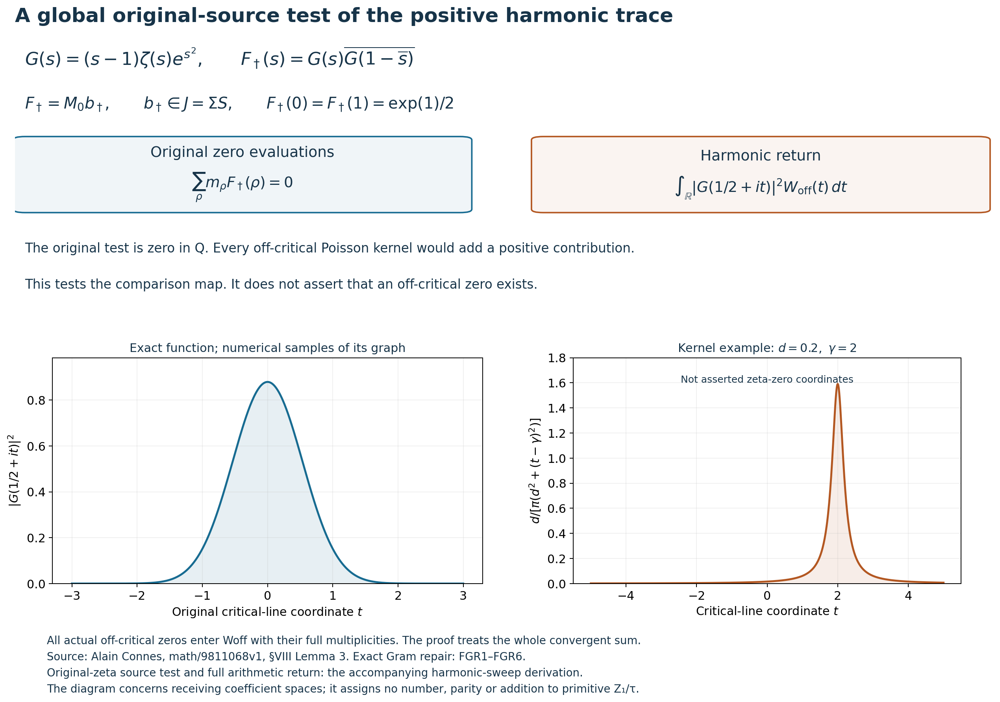
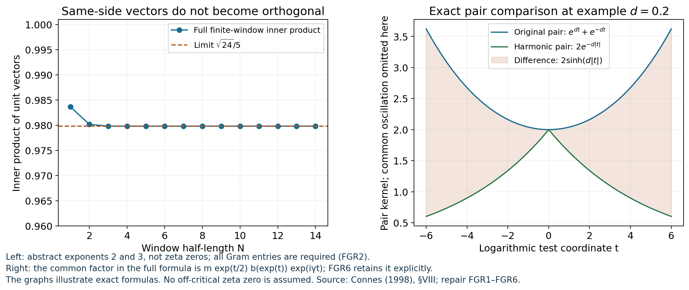
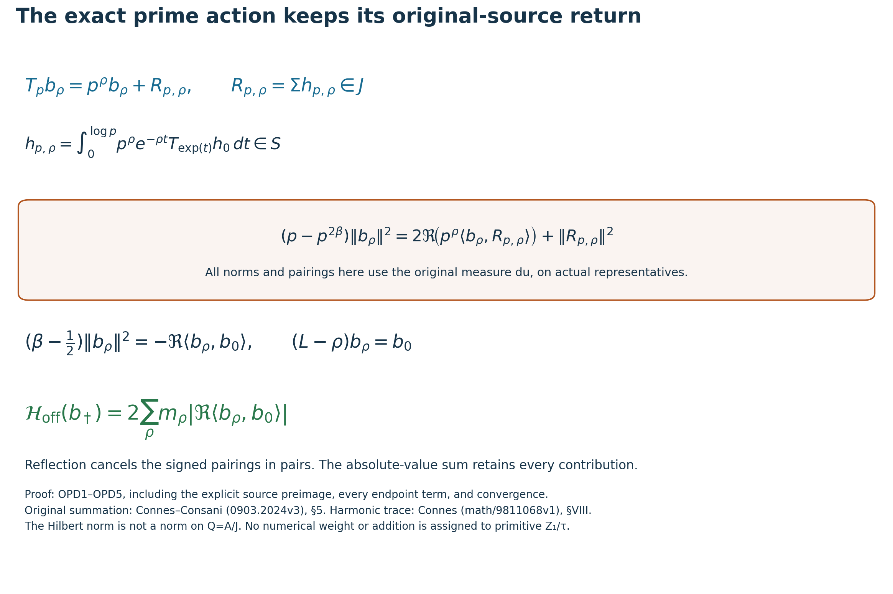

# Illustrations of the original-source harmonic comparison

25 September 2026. Reproducible figures for FGR, FGC and HSW. The complete arguments remain in [the Gram derivation](https://github.com/KokunoYumeto/zeta-function-research-reader/blob/main/workbenches/splitzero-tandem/continuations/20260925-full-source-tensor-and-original-divisor/counterfactual/FULL_GRAM_RESONANCE_RETURN.md), [its independent verification](https://github.com/KokunoYumeto/zeta-function-research-reader/blob/main/workbenches/splitzero-tandem/continuations/20260925-full-source-tensor-and-original-divisor/counterfactual/FGR_INDEPENDENT_CHECK.md), and [the global original-zeta calculation](https://github.com/KokunoYumeto/zeta-function-research-reader/blob/main/workbenches/splitzero-tandem/continuations/20260925-full-source-tensor-and-original-divisor/counterfactual/ORIGINAL_ZETA_HARMONIC_SWEEP_AND_OFFCRITICAL_DEFECT.md). The source script is `draw_harmonic_source_return.py`; both PNG and SVG outputs are retained.

The upper diagram displays the actual test \(b_\dagger=\Sigma h_\dagger\in J\), constructed by the original summation map in HSW5. Its Mellin transform is

\[
F_\dagger(s)=-s(s-1)\zeta(s)\zeta(1-s)
\exp(s^2+(1-s)^2),\qquad
F_\dagger(0)=F_\dagger(1)=\exp(1)/2.
\]

Every original nontrivial zero evaluation vanishes on this test, with every multiplicity retained. On the critical line the same test is \(|G(1/2+it)|^2\), where \(G(s)=(s-1)\zeta(s)e^{s^2}\). The left graph consists of numerical samples of this exact, nonnegative function; the proof of nonvanishing on an interval uses analyticity, not the graph. The right graph illustrates a single Poisson probability density with \(d=0.2,\gamma=2\). These parameters are not asserted to describe an actual zeta zero. HSW3 defines the complete density using only the actual zero divisor, and proves convergence of its entire sum.

HSW6 proves the exact comparison on the original zero class; HSW6A proves its two-sided quantitative control by \(\sum_{\Re\rho\ne1/2}m_\rho|\Re\rho-1/2|/(1+(\Im\rho)^2)\). The original prime repetitions, both Gamma derivatives and both endpoint values are retained in HSW4 and HSW6.5. The figure is not a plot of an assumed off-critical zero, nor a proof of RH.

The left graph checks the individual-vector orthogonality assertion in [Alain Connes, *Trace formula in noncommutative geometry and the zeros of the Riemann zeta function*, math/9811068v1, §VIII after Lemma 3](https://arxiv.org/abs/math/9811068v1). For the abstract discrete columns \(2^n,3^n\), \(-N\le n\le N\), their unit-vector inner product approaches \(\sqrt{24}/5\), not zero. These are illustrative exponents, not proposed zeta zeros. FGR2 proves the exact formula. FGR1–FGR5 and FGC2–FGC5 prove that the complete inverse Gram matrix, including its cross terms and every repeated-zero jet, gives the harmonic trace despite this nonorthogonality.

The right graph displays only the exponential part of the exact horizontally paired difference at the example value \(d=0.2\):

\[
e^{dt}+e^{-dt}-2e^{-d|t|}=2\sinh(d|t|).
\]

The full contribution in the original test is

\[
2m\int_{\mathbb R}\exp(t/2)b(\exp t)\exp(i\gamma t)
\sinh(d|t|)\,dt.
\]

FGR6 and HSW4 retain this common factor and its oscillation. The graph makes no pointwise convergence assertion about the unsmoothed sum over all zeros. HSW4 proves absolute summability after the stated test has been applied.

These illustrations concern exact operations in the already constructed complex receiving spaces. Primitive \(Z_1/\tau\) receives no addition, parity, numerical coordinate or numerical weight. The Connes harmonic-measure mechanism retains its human attribution; the complete Gram repair and the particular original-source comparison are identified as the programme calculations above.

The third figure displays [OPD1–OPD5](https://github.com/KokunoYumeto/zeta-function-research-reader/blob/main/workbenches/splitzero-tandem/continuations/20260925-full-source-tensor-and-original-divisor/counterfactual/ORIGINAL_PRIME_DILATION_FORCING_IDENTITY.md). For every actual zero and every rational prime, its canonical original representative obeys \(T_pb_\rho=p^\rho b_\rho+\Sigma h_{p,\rho}\), with the entire source function given by the displayed compact parameter integral. The middle identity follows by expanding the original \(L^2(du)\) norm, including both cross terms and the squared norm of the return. OPD4 derives the infinitesimal equality by integration by parts, proving that the two endpoint values vanish for the actual original test class.

The last line is the global identity on the entire actual zero divisor, proved by OPD5 and HSW6B. Every multiplicity is retained; no finite zero list is substituted. Its convergence follows from HSW3 and HSW6A. Reflection cancels the signed terms exactly as proved in OPD5.2–OPD5.3, while the displayed sum of absolute values retains them. The source return is zero as a class in \(A/J\), but its original Hilbert norm is not zero merely for that reason. OPD3 proves why that norm cannot be used as a quotient norm. This identifies the exact source comparison that a numerical purity argument must control, without assuming its answer.

## Publication source and dependency links

The source geometry is Alain Connes and Caterina Consani, *Schemes over F1 and zeta functions*, [arXiv:0903.2024v3, §5](https://arxiv.org/abs/0903.2024v3). The weight-control comparison is Pierre Deligne, *La conjecture de Weil. II*, Publications mathematiques de l'IHES52 (1980),137-252, [§§3.3.11 and3.6](https://www.numdam.org/item/PMIHES_1980__52__137_0/). Deligne material was read through the identified French transcription and separately recorded peer source-page checks, not Deligne-authored TeX. These sources are not asserted to contain the new programme derivations. The [preceding complete proof and reading record](https://github.com/KokunoYumeto/zeta-function-research-reader/blob/36a82ecca98addb8a98b48204e349737856c7223/workbenches/splitzero-tandem/continuations/20260924-cohomology-weight-and-character-lifts/BUILD_AND_REVIEW.md) records inherited source versions and actual inspection limits. The investigator's corrected construction remains attributed in the original text above.
