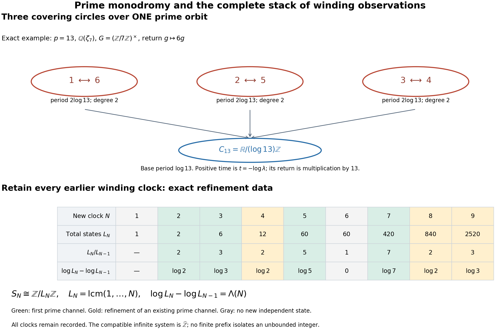

# Positive source measures and the original-zeta divisor

Complete continuation of the Split-Zero cohomology and original-zeta research programme. This reader contains the new proofs at the stated frozen cutoff; earlier definitions and proofs remain in the [preceding cumulative edition](https://github.com/KokunoYumeto/zeta-function-research-reader/blob/36a82ecca98addb8a98b48204e349737856c7223/workbenches/splitzero-tandem/continuations/20260924-cohomology-weight-and-character-lifts/README.md). No RH, purity, or complexity-theory endpoint is claimed. Full multiplicities, original factors, source topologies, kernels and endpoint terms remain in the proofs.

## Included complete arguments

- [The full multiplier domain of the actual specialization source](https://github.com/KokunoYumeto/zeta-function-research-reader/blob/main/workbenches/splitzero-tandem/continuations/20260925-full-source-tensor-and-original-divisor/identity/ACTUAL_DEFECT_MULTIPLIER_DOMAIN.md)
- [Independent mathematical review of ADM0–ADM9](https://github.com/KokunoYumeto/zeta-function-research-reader/blob/main/workbenches/splitzero-tandem/continuations/20260925-full-source-tensor-and-original-divisor/identity/ACTUAL_DEFECT_MULTIPLIER_DOMAIN_AUDIT.md)
- [Gaussian approximation on the complete original source and its actual defect](https://github.com/KokunoYumeto/zeta-function-research-reader/blob/main/workbenches/splitzero-tandem/continuations/20260925-full-source-tensor-and-original-divisor/identity/GAUSSIAN_FULL_SOURCE_APPROXIMATION.md)
- [Independent audit of the full-source Gaussian approximation](https://github.com/KokunoYumeto/zeta-function-research-reader/blob/main/workbenches/splitzero-tandem/continuations/20260925-full-source-tensor-and-original-divisor/identity/GAUSSIAN_FULL_SOURCE_APPROXIMATION_AUDIT.md)
- [The full source boundary and its original-zeta trace](https://github.com/KokunoYumeto/zeta-function-research-reader/blob/main/workbenches/splitzero-tandem/continuations/20260925-full-source-tensor-and-original-divisor/identity/ORIGINAL_DIVISOR_ADDITION.md)
- [The actual specialization defect as a curvature of the original zeta](https://github.com/KokunoYumeto/zeta-function-research-reader/blob/main/workbenches/splitzero-tandem/continuations/20260925-full-source-tensor-and-original-divisor/identity/ORIGINAL_ZETA_DIVISOR_DEFECT_RECEIVER.md)
- [Independent verification of the original-zeta divisor receiver](https://github.com/KokunoYumeto/zeta-function-research-reader/blob/main/workbenches/splitzero-tandem/continuations/20260925-full-source-tensor-and-original-divisor/identity/ORIGINAL_ZETA_DIVISOR_DEFECT_REVIEW.md)
- [Prime monodromy, complete clock observations, and the original zeta weights](https://github.com/KokunoYumeto/zeta-function-research-reader/blob/main/workbenches/splitzero-tandem/continuations/20260925-full-source-tensor-and-original-divisor/identity/PRIME_MONODROMY_STACKED_HISTORY.md)
- [Tau-supported arithmetic source and original-zeta cohomology](https://github.com/KokunoYumeto/zeta-function-research-reader/blob/main/workbenches/splitzero-tandem/continuations/20260925-full-source-tensor-and-original-divisor/identity/README.md)
- [The complete positive source and its exact quotient](https://github.com/KokunoYumeto/zeta-function-research-reader/blob/main/workbenches/splitzero-tandem/continuations/20260925-full-source-tensor-and-original-divisor/identity/SOURCE_MEASURE_ADDITION.md)
- [The complete source image in every positive measure receiver](https://github.com/KokunoYumeto/zeta-function-research-reader/blob/main/workbenches/splitzero-tandem/continuations/20260925-full-source-tensor-and-original-divisor/identity/SOURCE_MEASURE_CLOSURE_AND_ORIGINAL_QUOTIENT.md)
- [Independent review of the source-image closure in every positive receiver](https://github.com/KokunoYumeto/zeta-function-research-reader/blob/main/workbenches/splitzero-tandem/continuations/20260925-full-source-tensor-and-original-divisor/identity/SOURCE_MEASURE_CLOSURE_INDEPENDENT_REVIEW.md)
- [Positive measures on the complete source and exact descent through the original zeta ideal](https://github.com/KokunoYumeto/zeta-function-research-reader/blob/main/workbenches/splitzero-tandem/continuations/20260925-full-source-tensor-and-original-divisor/identity/SOURCE_POSITIVE_MEASURES_AND_DESCENT.md)
- [Root verification of the complete positive source-measure theorem](https://github.com/KokunoYumeto/zeta-function-research-reader/blob/main/workbenches/splitzero-tandem/continuations/20260925-full-source-tensor-and-original-divisor/identity/SOURCE_POSITIVE_MEASURES_ROOT_VERIFICATION.md)

# The full multiplier domain of the actual specialization source

Complete derivation. Stable proof locators **ADM0–ADM9**.

## ADM0. Construction stage and the receiving calculation

The supporting datum is \(\tau\langle Z_1;\mathrm{no}\ Z_2\rangle\). Every scalar, coefficient, quotient and analytic variable below occurs after complete-history arithmetic reconstruction. The two branches retain their own recovered counters. No arithmetic, metric, midpoint, coordinate or retracted addition is assigned to the support.

The current construction guide, the connected correction chain, and WU062/WU064–WU065 govern this operation. The source is the actual AST specialization quotient. AST0–AST9 was read completely, together with GMS1–GMS4 and GMS9–GMS11. ECI5–ECI6 and ECI9–ECI12, and ECR's original-source embedding and separator comparison, were read for the receiving maps below. These are programme proofs, not new readings of their entire human-source literature.

ECI5.2–ECI5.3 already gives the weighted evaluation maps individually; ECI5.5–ECI5.6 gives their full original residue realization and strong convergence. ECR6 and ECI9 already prove the separator's unchanged action on original tests and its different translated action. AST identifies the actual quotient topology and continuous dual. The new calculation constructs their common multiplier domain, the exact action on the literal AST complexes and continuous transposes, and the complete normal-ideal comparison with that same source.

Derived module statements use algebraic modules over the explicitly defined ring \(M\). Each specified fixed multiplier and source map is also continuous for its stated topology. No unspecified continuous derived category or bounded action on the whole Hilbert space is presumed.

## ADM1. The original source and the actual quotient

Retain
\[
S=\{f\in\mathcal S(\mathbb R;\mathbb C):
f(-v)=f(v),\ f(0)=0,\ \int_{\mathbb R}f(v)\,dv=0\},
\]
\[
A=\{a\in C^\infty(\mathbb R_{>0}):
\sup_{u>0}(u^N+u^{-N})|(u\partial_u)^ja(u)|<\infty
\text{ for every }N,j\ge0\},
\]
\[
\Sigma f(u)=2\sum_{k\ge1}f(ku),\quad J=\Sigma S,\quad
q:A\to Q=A/J,\quad B=A'_\beta .
\tag{ADM1.1}
\]
The proved exact-image theorem makes \(J\) closed and \(\Sigma:S\to J\) a topological isomorphism. The original Mellin comparison is
\[
\Theta a(s)=\frac12\int_0^\infty a(u)u^s\frac{du}{u},\qquad
\Theta^{-1}F(u)=\frac{u^{-1/2}}{\pi}
\int_{\mathbb R}F(1/2+it)u^{-it}\,dt.
\tag{ADM1.2}
\]
It identifies \(A\) with the Fréchet space
\[
\mathcal B=\{F\in\mathcal O(\mathbb C):
b_{a,N}(F)=\sup_{|\Re s|\le a}(1+|\Im s|)^N|F(s)|<\infty
\text{ for all }a,N\ge0\}.
\]
It identifies \(J\) with the closed ideal \(\mathcal I\) of all full vanishing jets at every actual nontrivial zero \(\rho\) of original \(\zeta\), to order \(m_\rho\). Thus \(\mathcal Q=\mathcal B/\mathcal I\) is the Mellin presentation of \(Q\).

The retained full divisor comes from the actual source:
\[
f_0(v)=\frac{\pi}{2}v^2(2\pi v^2-3)e^{-\pi v^2},\qquad
F_0(s)=\Theta\Sigma f_0(s)
=\frac{s(s-1)}8\pi^{-s/2}\Gamma(s/2)\zeta(s).
\tag{ADM1.3}
\]
It belongs to \(\mathcal B\), and
\[
F_0(0)=F_0(1)=\frac18,\quad F_0(-1)=F_0(2)=\frac{\pi}{24},\quad
F_0(-2k)=\frac{k(2k+1)(-1)^k\pi^k}{2\,k!}\zeta'(-2k)\ne0.
\tag{ADM1.4}
\]
At an actual nontrivial zero, the original local expression is
\[
F_0(\rho+z)=z^{m_\rho}
\frac{(\rho+z)(\rho+z-1)}8\pi^{-(\rho+z)/2}
\Gamma((\rho+z)/2)\frac{\zeta(\rho+z)}{z^{m_\rho}}.
\tag{ADM1.5}
\]
Every derivative uses the full Leibniz sum of these factors. In particular
\[
(hF)^{(j)}(\rho)=\sum_{k=0}^j\binom jk
h^{(k)}(\rho)F^{(j-k)}(\rho).
\tag{ADM1.6}
\]
No value-only map replaces this complete source ideal. The original unit and prime-power repetitions remain
\[
\zeta(s)=1+\sum_{n\ge2}n^{-s}=\prod_p(1-p^{-s})^{-1},\qquad
-\frac{\zeta'(s)}{\zeta(s)}
=\sum_p\sum_{k\ge1}(\log p)p^{-ks}\quad(\Re s>1).
\tag{ADM1.7}
\]

Let \(\mathscr Z\) denote the distinct actual nontrivial zeros with multiplicities, \(\rho^\#=1-\overline\rho\), and
\[
H=\ell^2(\mathscr Z,m),\quad
\langle x,y\rangle_+=\sum_\rho m_\rho x_\rho\overline{y_\rho},
\quad(\mathsf Jy)_\rho=y_{\rho^\#},\quad
(EF)_\rho=(\Theta_QF)(\rho).
\tag{ADM1.8}
\]
The inner product is linear in its first variable. The original source theorems prove \(E:Q\to H\) continuous and realize every finite value vector by full-jet isolators. Write \(\mathscr Z_L,\mathscr Z_O\) for the line and off-line subsets, without assuming either empty. For the fixed recovered parameter \(r>1\), retain
\[
d_r(\rho)=e^{-i\Im\rho\log r}
(r^{\Re\rho}-r^{1-\Re\rho}),\quad
(D_ry)_\rho=d_r(\rho)y_\rho,\quad
\beta_r=D_r^*\mathsf JE,\quad b_r=\beta_rq.
\tag{ADM1.9}
\]
Thus \((\beta_rF)_\rho=\overline{d_r(\rho)}F(\rho^\#)\).
AST proves
\[
N_O=\ker(P_OE)=\ker\beta_r,\quad A_O=q^{-1}N_O,\quad
\mathcal R=Q/N_O\simeq A/A_O.
\tag{ADM1.10}
\]
These are closed kernels with their original quotient topologies. \(\mathcal R\) is Montel Fréchet. Its strong dual is identified topologically with \(N_O^\perp\subset Q'_\beta\), then \(A_O^\perp\subset B\); AST3 proves the needed bounded lifts. At a line zero, \(N_O\) retains the whole multiplicity block. At an off-line zero it retains every positive-order jet. Only that zero's value enters \(\mathcal R\).

## ADM2. The exact common multiplier domain

Use the original algebra
\[
M=\{h\in\mathcal O(\mathbb C):
\forall a\ge0\ \exists C_a>0,\ d_a\in\mathbb Z_{\ge0}\
|h(x+it)|\le C_a(1+|t|)^{d_a}\quad(|x|\le a)\}.
\tag{ADM2.1}
\]
GMS1 proves that each fixed multiplier acts continuously on \(\mathcal B,\mathcal I,Q\), with
\(b_{a,N}(hF)\le C_a b_{a,N+d_a}(F)\).
Equation (ADM1.6) preserves all full jets.

Put \(w_\rho=1+|\Im\rho|\), and for integers \(N\ge0\) define
\[
p_N(y)^2=\sum_\rho m_\rho w_\rho^{2N}|y_\rho|^2,\quad
H_N=\{y:p_N(y)<\infty\},\qquad H_\infty=\bigcap_{N\ge0}H_N.
\tag{ADM2.2}
\]
The increasing norms \(p_N\) give its topology. A sequence Cauchy in all these norms has a limit in each complete \(H_N\). Coordinate convergence shows these limits are the same sequence, which lies in every \(H_N\). This proves completeness and the Fréchet property.

Let \(P_T\) retain every actual zero with \(|\Im\rho|\le T\), with its full multiplicity weight. There are finitely many such zeros. Directly,
\[
p_N((1-P_T)y)\le(1+T)^{-1}p_{N+1}(y).
\tag{ADM2.3}
\]
The inclusions \(H_{N+1}\to H_N\) are compact, since their finite-rank approximants \(P_T\) converge in operator norm. A bounded subset of \(H_\infty\) has uniformly small tails in each \(p_N\), and its finite-coordinate projections are bounded in finite-dimensional spaces. It is totally bounded in each norm, hence in the Fréchet metric. Completeness makes its closure compact, proving the Montel property. The same estimate proves \(P_Ty\to y\) in \(H_\infty\), uniformly on bounded subsets. Finite-coordinate vectors are dense. The line/off-line projections are contractions and reflection is isometric in every norm, so
\[
H_\infty=H_{\infty,L}\oplus H_{\infty,O}
\tag{ADM2.4}
\]
is a direct sum of closed complemented subspaces.

For \(h\in M\), define the maximal diagonal operator on \(H\):
\[
(\mathfrak m_h^\#y)_\rho=h(\rho^\#)y_\rho,\qquad
\operatorname{Dom}\mathfrak m_h^\#
=\{y\in H:\sum_\rho m_\rho|h(\rho^\#)y_\rho|^2<\infty\}.
\tag{ADM2.5}
\]
It is densely defined and closed. Finite-coordinate vectors lie in its domain; convergence of a graph sequence in \(H\oplus H\) gives coordinatewise \(z_\rho=h(\rho^\#)y_\rho\).
The established strip \(0<\Re\rho<1\), with \(\Im\rho^\#=\Im\rho\), implies
\[
p_N(\mathfrak m_h^\#y)\le C_h p_{N+d_h}(y).
\tag{ADM2.6}
\]
Thus \(H_\infty\) is invariant and each multiplier acts continuously there, obeying all algebra identities.

Conversely \(h_N(s)=(1+s)^N\) belongs to \(M\), and
\[
|1+\rho^\#|=\sqrt{(2-\Re\rho)^2+(\Im\rho)^2}
\ge w_\rho/\sqrt2,\qquad
p_N(y)\le2^{N/2}\|\mathfrak m_{h_N}^\#y\|_H.
\tag{ADM2.7}
\]
The two inequalities prove
\[
\boxed{\ \bigcap_{h\in M}\operatorname{Dom}\mathfrak m_h^\#
=H_\infty,\qquad
\text{the full graph topology equals the }(p_N)\text{ topology}.\ }
\tag{ADM2.8}
\]
No topology on \(M\), or bounded action on all \(H\), is presumed. For the common domain, finite truncations converge in every graph seminorm by (ADM2.3)–(ADM2.6). They also form a core for each individual maximal operator: for any \(y\in\operatorname{Dom}\mathfrak m_h^\#\), the squared graph-tail norm is the sum of the tails of the two convergent series \(\sum m_\rho|y_\rho|^2\) and \(\sum m_\rho|h(\rho^\#)y_\rho|^2\), and therefore tends to zero. Replacing \(h(\rho^\#)\) by \(h(\rho)\) gives the unreflected action \(\mathfrak m_h\) on the same common domain.

## ADM3. The original source and specialization image

The already continuous \(E:Q\to H\) and GMS's full quotient multiplier give
\[
p_N(EF)\le2^{N/2}\|E((1+s)^NF)\|_H.
\tag{ADM3.1}
\]
Thus \(E:Q\to H_\infty\) is continuous without a new zero-count hypothesis. Equivalently, ECI5's original estimate is
\[
p_N(EF)\le C_4 b_{1,N+2}(\widetilde F),\qquad
C_4^2=\sum_\rho m_\rho w_\rho^{-4}<\infty
\tag{ADM3.2}
\]
for every entire representative; taking infima gives the quotient estimate.
Since \(r^x-r^{1-x}\) increases from \(1-r\) to \(r-1\) on \([0,1]\),
\[
p_N(\beta_rF)\le(r-1)p_N(EF).
\tag{ADM3.3}
\]
Consequently \(b_r:A\to H_{\infty,O}\), \(\beta_r:Q\to H_{\infty,O}\), and
\[
\overline\beta_r:\mathcal R\longrightarrow H_{\infty,O}
\tag{ADM3.4}
\]
are continuous; the latter is injective with the original quotient topology.

For a finite off-line vector \(y\), prescribe
\(F(\rho^\#)=y_\rho/\overline{d_r(\rho)}\) on its support and zero values at all other zeros, using the original full-jet isolators. Then \(\beta_rF=y\). Therefore
\[
\overline{E(Q)}^{\,H_\infty}=H_\infty,\qquad
\overline{\beta_rQ}^{\,H_\infty}=H_{\infty,O}.
\tag{ADM3.5}
\]
Its image is also dense in \(H_O\). Give \(I_r=\beta_rQ\) its transported quotient topology from \(\mathcal R\), its subspace topology in \(H_{\infty,O}\), or its subspace topology in \(H_O\). The identity maps from the first to the second and from the second to the third are continuous. Only for the first has inverse continuity of \(\overline\beta_r\) been proved. Density establishes neither surjectivity onto \(H_{\infty,O}\) nor equality of these topologies.

The exact multiplier direction is
\[
E(hF)=\mathfrak m_hEF,\qquad
\beta_r(hF)=\mathfrak m_h^\#\beta_rF.
\tag{ADM3.6}
\]
The second coordinate is \(\overline{d_r(\rho)}h(\rho^\#)F(\rho^\#)\).
Thus \(N_O,A_O,\mathcal R,I_r\) are actual \(M\)-modules and every displayed source, quotient and boundary map is \(M\)-linear. Each fixed multiplier is continuous on the source quotient and the \(H_\infty\)-subspace image topology. Continuity for the coarser Hilbert image topology is not asserted for arbitrary \(h\).

AST's exact parameter maps \(M_{r,t}=V_{r,t}^*\) and inverses have the bounded diagonal constants of AST6.2. The same constants apply to every \(p_N\). They commute with \(\mathfrak m_h^\#\), satisfy \(\beta_r=M_{r,t}\beta_t\), and fix \(\mathcal R\). This extends the actual parameter comparison to the common domain without identifying the numerical defect sizes.

## ADM4. The strong dual domain and actual transpose

Every continuous complex-linear functional on \(H_\infty\) has a unique presentation
\[
\ell_z(y)=\sum_\rho m_\rho y_\rho\overline{z_\rho},\qquad
\sum_\rho m_\rho w_\rho^{-2N}|z_\rho|^2<\infty
\text{ for some }N.
\tag{ADM4.1}
\]
Indeed continuity bounds it by \(Cp_N\) for one increasing norm; extension to the completion \(H_N\) and Hilbert Riesz give this expression. Conversely Cauchy–Schwarz gives
\[
|\ell_z(y)|\le\|z\|_{-N}p_N(y).
\tag{ADM4.2}
\]
Coordinate vectors prove uniqueness. The presentation is anti-linear in \(z\), or linear on its conjugate complex space. We use the actual strong dual topology \(H_\infty'{}_\beta\); no unproved identification with an inductive-limit topology is used.

The map \(R_\infty:\overline H\to H_\infty'{}_\beta\), \(R_\infty(\overline y)=\ell_y\), is continuous, since a bounded test set has bounded \(p_0\). Furthermore
\[
\sup_{y\in K}|\ell_{(1-P_T)z}(y)|
\le\frac{\|z\|_{-N}}{1+T}\sup_{y\in K}p_{N+1}(y).
\tag{ADM4.3}
\]
Thus finite-coordinate functionals, and hence \(R_\infty(\overline H)\), are strongly dense. This does not identify its image topology with the Hilbert topology.

The complete transpose action is
\[
h\cdot\ell=\ell\circ\mathfrak m_h^\#,\qquad
h\cdot\ell_z=\ell_{\,(\overline{h(\rho^\#)}z_\rho)_\rho}.
\tag{ADM4.4}
\]
The sequence on the right has polynomially larger weighted order. Strong continuity follows because \(\mathfrak m_h^\#\) preserves bounded sets. This action need not preserve the embedded \(\overline H\).

Form the actual transposes
\[
\sigma_{r,\infty}=(\beta_r:Q\to H_\infty)',\qquad
a_{r,\infty}=(b_r:A\to H_\infty)'=q'\sigma_{r,\infty}.
\tag{ADM4.5}
\]
They are strongly continuous and \(M\)-linear, for the transpose actions on \(Q',B\). On \(R_\infty(\overline H)\) they are exactly \(\sigma_r,a_r\), by the original pairing. Density (ADM3.5) gives
\[
\ker\sigma_{r,\infty}=\ker a_{r,\infty}
=\{\ell_z:z\text{ is supported on }\mathscr Z_L\}.
\tag{ADM4.6}
\]
They factor through the actual strong dual of \(\mathcal R\):
\[
\gamma_{r,\infty}(\ell)([F])=\ell(\beta_rF).
\tag{ADM4.7}
\]
Its restriction to functionals supported on \(\mathscr Z_O\) is injective. AST's old \(\gamma_r(\overline{H_O})\) is already strongly dense in \(\mathcal R'\), and lies in this image. Every image functional annihilates \(N_O\). Using AST's closed strong embeddings proves
\[
\overline{\operatorname{im}\gamma_{r,\infty}}^\beta=\mathcal R'_\beta,\quad
\overline{\operatorname{im}\sigma_{r,\infty}}^\beta=N_O^\perp,\quad
\overline{\operatorname{im}a_{r,\infty}}^\beta=A_O^\perp.
\tag{ADM4.8}
\]
No surjectivity or closed image is inferred.

For \(h\in M\), the sequence \(h(\rho)\) belongs to one weighted dual space, by the polynomial bound and ECI5's \(\sum m_\rho w_\rho^{-4}<\infty\). Therefore \(E'\ell_{(h(\rho^\#))_\rho}\) is exactly the old ECI5.1 functional
\(\sum m_\rho F(\rho)\overline{h(\rho^\#)}\).
Its full residue representative remains ECI5.5, with
\(m_\rho(-1)^{m_\rho-1}u_\rho(0)\overline{h(\rho^\#)}\) and
\(\zeta(\rho+z)=z^{m_\rho}u_\rho(z)\).
The new domain includes these existing maps and supplies their common receiving space; it does not replace the residue denominator.

## ADM5. The literal AST complexes and their full transpose action

On a positively oriented pole disk, define the common-domain subcomplexes
\[
\mathscr P_{r,\infty}=
[\underline A^{-1}\xrightarrow{+b_r}i_*H_\infty^0],\qquad
\mathscr P_{O,\infty}=
[\underline{A_O}^{-1}\xrightarrow0 i_*H_\infty^0].
\tag{ADM5.1}
\]
These use the same actual \(b_r\), now with its proved smaller codomain. There are literal exact sequences
\[
0\to\mathscr P_{O,\infty}\to\mathscr P_{r,\infty}
\xrightarrow{(\widetilde\pi,0)}\underline{\mathcal R}[1]\to0,
\]
\[
0\to\mathscr P_{r,\infty}\xrightarrow{(1_A,\iota)}
\mathscr P_r\to i_*(H/H_\infty)[0]\to0 .
\tag{ADM5.2}
\]
The second quotient is retained with its quotient topology; its denominator is dense. It is not declared zero, and the inclusion is not declared a quasi-isomorphism. The first sequence is strict on each nonzero coefficient quotient by AST3. The nearby coefficients and specialization source of the common-domain object are unchanged: its localization boundary is \(-b_r:A\to H_\infty\), with image \(I_r\) and source quotient \(\mathcal R\).

For \(h\in M\), give \(A,A_O,\mathcal R\) their actual source actions and \(H_\infty\) the action \(\mathfrak m_h^\#\). Equation (ADM3.6) proves that every map of the first sequence is \(M\)-linear. The second sequence remains a continuous comparison with the original Hilbert complex; arbitrary \(h\) is not declared an operator on its entire Hilbert point term.

The positive differentiate-a-lift connecting map is \(+\overline\beta_r:\mathcal R\to H_\infty\). The literal cone convention retained in AST5 instead has
\[
\mathscr P_{O,\infty}\to\mathscr P_{r,\infty}
\xrightarrow{+\widetilde\pi}\underline{\mathcal R}[1]
\xrightarrow{\kappa_{r,\infty}}\mathscr P_{O,\infty}[1],
\qquad H^{-1}(i^*\kappa_{r,\infty})=-\overline\beta_r.
\tag{ADM5.3}
\]
Indeed a lift \(a\) of a quotient class is represented by the cone cocycle
\((a,-b_ra)\); positive projection to the shifted subcomplex gives \(-b_ra\).
The full coefficient extension \(0\to A_O\to A\to\mathcal R\to0\) remains part of this triangle. Its derived connecting morphism is not replaced by its stalk map or by a presumed \(M\)-linear section.

For the continuous transpose, use the fine resolution
\[
\mathscr E_A^0\quad\longrightarrow\quad
\mathscr E_A^1\oplus i_*H_\infty\quad\longrightarrow\quad
\mathscr E_A^2
\]
in degrees \((-1,0,1)\), with \(d^{-1}f=(-df,b_rf(p))\) and
\(d^0(\omega,y)=-d\omega\).
The coefficient Poincaré contraction applies because \(H_\infty\) is complete and its point summand uses only evaluation. The compact-test dual is the current cone
\[
\mathscr E_{r,\infty}
=\operatorname{Cone}(-\delta_pa_{r,\infty})[-1],
\quad
d^{-1}v=(-d_Tv,0),\quad
d^0(u,\ell)=-d_Tu+\delta_pa_{r,\infty}\ell.
\tag{ADM5.4}
\]
The comparison from the literal Hom differential uses the same degree signs
\((-1,+1,-1)\) proved in ACD2–ACD3. Substituting
\(a_{r,\infty}=b_r'\) verifies the degree-zero square. No exactness of continuous dualization on arbitrary complexes is needed.

Its actual \(M\)-action uses the transpose of \(h_A\) on current tests and (ADM4.4) on the point dual. The equation
\(a_{r,\infty}(\mathfrak m_h^\#)'=h_A'a_{r,\infty}\)
proves the chain identity. The map
\[
\mathscr E_r\to\mathscr E_{r,\infty}
\]
is identity on the current terms and \(R_\infty:\overline H\to H_\infty'\) on the point coordinate. It is the actual continuous transpose of the second sequence's inclusion in (ADM5.2). Its underlying algebraic quotient is the retained point complex
\(i_*(H_\infty'/R_\infty\overline H)[0]\), with its actual quotient topology.

The AST transpose triangle now has the exact full-multiplier form
\[
\underline{\mathcal R'_\beta}[1]\to\mathscr E_{r,\infty}
\to\underline{(A_O)'_\beta}[1]\oplus i_*H_\infty'
\to\underline{\mathcal R'_\beta}[2].
\tag{ADM5.5}
\]
To prove it, restrict currents from \(A\) to \(A_O\) and leave the point coefficient unchanged. Its attaching term becomes zero, since \(a_{r,\infty}\) annihilates \(A_O\). Cancel the common point term in the fibre. The remaining constant-current restriction has kernel
\(A_O^\perp\simeq\mathcal R'_\beta\), by the proved strict strong-dual row AST3.5. Compact-test contractions give (ADM5.5). All maps commute with the transposed \(M\)-actions because \(A_O\) is invariant. The map from AST5.4 into this triangle is identity on its coefficient row and \(R_\infty\) on the point term. It retains the entire previous triangle and identifies the precise enlargement required by arbitrary multipliers.

Both original endpoint lines are reattached by direct summands \(i_*E_p[1]\) and \(i_*E_p'[-1]\). In the original coordinate order
\((c_0,c_1,d_0,d_1)\) the multiplier characters are
\[
(h(0),h(1),h(1),h(0)).
\tag{ADM5.6}
\]
Their continuous transposes have the same scalar characters, without complex conjugation of a complex-linear transpose. Endpoints have zero nearby term and remain separate from all zeta-value kernels.

## ADM6. The already constructed separator on this exact source

To avoid collision with the evaluation map \(E:Q\to H\), write \(E_{\rm sep}(s)\) for the entire function named \(E(s)\) in GSL/GMS. This is the same function, with its entire construction retained:
\[
G(s)=F_0(s)F_0(s+1),\quad r_0(t)=\varepsilon(1+t^2)^{-3},
\quad\chi(x+it)=\eta(x/r_0(t)),
\]
\[
v(w)=\frac{\bar\partial\chi(w)}{G(w)}
\text{ on its zero-free transition corridor},\quad v=0\text{ off it},
\]
\[
u(s)=\frac1\pi\int_{\mathbb C}\frac{e^{(s-w)^2}}{s-w}v(w)\,dA(w),
\qquad E_{\rm sep}(s)=\chi(s)-G(s)u(s).
\tag{ADM6.1}
\]
GSL proves convergence, holomorphic continuation and polynomial strip bounds with these full factors. No new cutoff or chosen value interpolant is substituted. Set
\[
c(s)=1-E_{\rm sep}(s-1)\in M.
\]
Its full jets are
\[
c-1\in(s-\rho)^{m_\rho}\mathcal O_\rho,\qquad
c\in(s-(\rho+1))^{m_\rho}\mathcal O_{\rho+1}.
\tag{ADM6.2}
\]
Thus \(c=1\) on the entire original \(Q\), including all higher jets. It follows on the actual source, not only its finite blocks, that
\[
c_{\mathcal R}=1,\quad
\mathfrak m_c^\#=1\text{ on }H_\infty,\quad
c_{\mathcal R'}=1,\quad c_{H_\infty'}=1,\qquad
\beta_r(cF)=\beta_rF.
\tag{ADM6.3}
\]
The point identity holds because \(\rho^\#\) is an actual original zero. It extends as the identity on \(H\) for this particular multiplier; it does not extend arbitrary \(h\).

Consequently
\[
c\,\kappa_{r,\infty}
=\kappa_{r,\infty}\,c_{\mathcal R}
=\kappa_{r,\infty}
\tag{ADM6.4}
\]
in the derived \(M\)-module sheaf category of the displayed complexes. This is central \(M\)-linearity of their actual connecting map, not a conjugation weight. Its stalk equation is exactly
\(\mathfrak m_c^\#(-\overline\beta_r)=-\overline\beta_r\).
The action need not be the identity on all \(A\) or \(A_O\); it is not an idempotent on the complete source complex. Its endpoint characters remain \(c(0),c(1),c(1),c(0)\), with no imposed zero or one values.

The translated normal action is different. On the same underlying source module put
\[
h\cdot_{+}F(s)=h(s+1)F(s),\quad
(\mathfrak m_{h,+}^\#y)_\rho=h(\rho^\#+1)y_\rho.
\tag{ADM6.5}
\]
Translation preserves \(M\). Every preceding domain estimate holds on the slightly larger strip, and
\[
\beta_r(h\cdot_+F)=\mathfrak m_{h,+}^\#\beta_rF.
\tag{ADM6.6}
\]
These are the actual normal twists, denoted \(Q(-1),\mathcal R(-1),H_\infty(-1)\) with this specified action. On them
\[
c(s+1)=1-E_{\rm sep}(s),\qquad
c_{Q(-1)}=c_{\mathcal R(-1)}=0,\qquad
\mathfrak m_{c,+}^\#=0 .
\tag{ADM6.7}
\]
All original zero jets vanish under the first multiplier, not just their values. The identity between underlying untwisted and twisted vector spaces is semilinear with respect to \(h(s)\mapsto h(s+1)\); it is not an \(M\)-linear identification of the two scalar actions.

The exact coordinate comparison is
\[
(VF)(\lambda)=F(\lambda-1),\qquad
V(h(s+1)F(s))=h(\lambda)VF(\lambda).
\tag{ADM6.8}
\]
Put \(\mathcal I_+=V\mathcal I\), \(\mathcal B_O=\Theta A_O\),
\(\mathcal B_{O,+}=V\mathcal B_O\). The resulting normal quotient source is
\[
\mathcal R_+=\mathcal B/\mathcal B_{O,+}
=\mathcal Q_+/(V N_O),\qquad \mathcal Q_+=\mathcal B/\mathcal I_+.
\tag{ADM6.9}
\]
Here \(V N_O\) means its image under the induced quotient isomorphism. The continuous normal specialization map is
\[
(\beta_{r,+}G)_\rho
=\overline{d_r(\rho)}G(\rho^\#+1),\qquad
\beta_{r,+}V=\beta_r .
\tag{ADM6.10}
\]
It is \(M\)-linear into \(H_\infty(-1)\). The coefficient \(d_r\) is the original adjoint discrepancy, not a newly assigned normal defect.

Every normal source factor remains
\[
F_+(\lambda)=VF_0(\lambda)
=\frac{(\lambda-1)(\lambda-2)}8\pi^{-(\lambda-1)/2}
\Gamma((\lambda-1)/2)\zeta(\lambda-1).
\tag{ADM6.11}
\]
Its values at \(1,2\) are \(1/8\), at \(0,3\) are \(\pi/24\); at \(1-2k\) they are exactly (ADM1.4). Its local full zero germ is (ADM1.5) translated by one, and
\(F_+^{(j)}(\lambda)=F_0^{(j)}(\lambda-1)\).
No factor or derivative is dropped by the comparison.

## ADM7. The full normal ideal maps onto the same actual specialization source

Let
\[
K_O=\mathcal I_+\cap\mathcal B_O,\qquad
q_R:\mathcal B\to\mathcal B/\mathcal B_O\simeq\mathcal R.
\]
There is an exact strict sequence of the actual Fréchet modules
\[
\boxed{\quad
0\to K_O\to\mathcal I_+\xrightarrow{\,q_R|_{\mathcal I_+}\,}
\mathcal R\to0.
\quad}
\tag{ADM7.1}
\]
For surjectivity, take any representative \(F\in\mathcal B\). The complete jet identities give \(cF\in\mathcal I_+\), while
\((c-1)F\in\mathcal I\subset\mathcal B_O\). Thus
\(q_R(cF)=q_R(F)\). Its kernel is exactly the displayed intersection, a closed subspace.

The complete topological quotient comparison and inverse are
\[
\mathcal I_+/K_O\xrightarrow{\sim}\mathcal R,\quad
[G]\mapsto q_R G,\qquad
[F]_{\mathcal B_O}\mapsto[cF]_{K_O}.
\tag{ADM7.2}
\]
If \(F\) changes by \(v\in\mathcal B_O\), then \(cv\in\mathcal I_+\cap\mathcal B_O\), proving well-definedness. If \(G\in\mathcal I_+\), then
\((c-1)G\in\mathcal B_O\cap\mathcal I_+\), proving the reverse composite. Both maps descend from continuous linear maps and are continuous for quotient topologies. This proves strictness of (ADM7.1), without a section of \(\mathcal I_+\to\mathcal R\).

The exact specialization comparison is
\[
\mathcal B\xrightarrow{\,m_c\,}\mathcal I_+
\xrightarrow{\,q_R\,}\mathcal R
\xrightarrow{\,-\overline\beta_r\,}H_{\infty,O},
\qquad
-\overline\beta_r\,q_R m_c
=-\beta_r q_{\mathcal I}.
\tag{ADM7.3}
\]
Here \(q_{\mathcal I}:\mathcal B\to\mathcal Q\) is the original quotient.
The same \(\overline\beta_r\), with its original sign and topology, receives both routes. All kernels remain: \(K_O\) in (ADM7.1), the original full \(\mathcal I\), and \(\mathcal B_O/\mathcal I=N_O\).

There is no silent descent of this map through the normal quotient \(\mathcal Q_+\). In fact every \(M\)-linear map
\(\mathcal Q_+\to\mathcal R\) is zero: it obeys
\(f=c_{\mathcal R}f=f c_{\mathcal Q_+}=0\).
The restriction of \(q_R:\mathcal B\to\mathcal R\) to its normal kernel \(\mathcal I_+\) is onto by (ADM7.1). Hence it descends through \(\mathcal Q_+\) exactly when \(\mathcal R=0\); this is a computed descent condition, not an assumption that either case holds. The same statement applies to the injective image of \(\mathcal R\) under \(\overline\beta_r\).

The original coefficient source is retained exactly. Transporting \(m_c\) back through \(\Theta\) gives
\[
a\longmapsto\frac{u^{-1/2}}{\pi}\int_{\mathbb R}
c(1/2+it)\Theta a(1/2+it)u^{-it}\,dt .
\tag{ADM7.4}
\]
Polynomial multiplier bounds and rapid strip decay prove absolute convergence after each fixed \(u\partial_u\) derivative; the Mellin isomorphism proves continuity for all source seminorms. This is the inverse Mellin representative of the original low-coordinate map, whose target is \(\Theta^{-1}\mathcal I_+\), not automatically \(J\).
In contrast GMS's unshifted normal source-return map is
\[
a\longmapsto \Theta^{-1}[c(s+1)\Theta a(s)]
=\Theta^{-1}[(1-E_{\rm sep}(s))\Theta a(s)]\in J.
\tag{ADM7.5}
\]
Its exact Schwartz representative is obtained by the already proved inverse
\(\Sigma^{-1}:J\to S\); both \(f(0)=0\) and \(\int f=0\) are retained. Since \(qJ=0\), applying \(b_r\) to (ADM7.5) gives zero. Equations (ADM7.3) and (ADM7.5) do different things precisely because of the displayed translation (ADM6.8). This extends the ECR6/ECI9 comparison to the literal AST source and connecting map.

There is also an exact diagram of normal coefficient rows:
\[
\begin{array}{ccccccccc}
0&\to&\mathcal I_+&\to&\mathcal B&\to&\mathcal Q_+&\to&0\\
&&\downarrow&&\Vert&&\downarrow\\
0&\to&\mathcal B_{O,+}&\to&\mathcal B&\to&\mathcal R_+&\to&0 .
\end{array}
\tag{ADM7.6}
\]
The left inclusion follows from \(\mathcal I\subset\mathcal B_O\) and \(V\).
Multiplication \(m_c:\mathcal B\to\mathcal I_+\) is a continuous lift through both actual kernels. Thus the already constructed normal lifting mechanism applies to the AST normal row too, while (ADM7.1) records its unchanged original specialization image.

## ADM8. Derived separation and the actual geometric action scope

The constructed source satisfies \(c_{\mathcal R}=1\), while
\(c_{\mathcal Q_+}=c_{\mathcal R_+}=0\).
For clarity the full algebraic contraction applies without a finite-support hypothesis. If \(X\) is annihilated by \(a\in M\), take a projective resolution \(P^\bullet\xrightarrow{\epsilon}X\) in degrees at most zero. In degree zero, \(\epsilon a_{P^0}=a_X\epsilon=0\); exactness and projectivity lift \(a_{P^0}\) through \(d_P^{-1}\), defining \(H^0:P^0\to P^{-1}\). For \(j<0\), suppose the next-degree identity is proved. Then
\(d_P^j(a_{P^j}-H^{j+1}d_P^j)=a_{P^{j+1}}d_P^j-(a_{P^{j+1}}-H^{j+2}d_P^{j+1})d_P^j=0\).
Exactness and projectivity therefore lift \(a_{P^j}-H^{j+1}d_P^j\) through \(d_P^{j-1}\), defining \(H^j\). This constructs \(d_PH+Hd_P=a_P\) in every degree. On
\(\operatorname{Hom}_M(P^\bullet,Y^\bullet)\), with
\(Df=d_Yf-(-1)^nfd_P\), the homotopy \(Sf=(-1)^nfH\) satisfies
\[
DS+SD=a_Y.
\tag{ADM8.1}
\]
The two terms containing \(d_YfH\) cancel and centrality gives \(fa_P=a_Yf\).
For \(X=\mathcal R\), take \(a=1-c\), and \(Y=\mathcal Q_+\) or \(\mathcal R_+\). For the reverse directions take \(a=c\). This proves
\[
\operatorname{RHom}_M(\mathcal R,\mathcal Q_+)
=\operatorname{RHom}_M(\mathcal Q_+,\mathcal R)=0,\qquad
\operatorname{RHom}_M(\mathcal R,\mathcal R_+)
=\operatorname{RHom}_M(\mathcal R_+,\mathcal R)=0.
\tag{ADM8.2}
\]
These are actual full modules; no bounded Hilbert functional calculus or continuous projectivity is inserted.

For either \(K=\mathcal I_+\) or \(K=\mathcal B_{O,+}\), the actual maps
\(i_K:K\hookrightarrow\mathcal B\) and \(m_c:\mathcal B\to K\) have both composites \(m_c\). On derived Hom from \(\mathcal R\), equation (ADM8.1), with \(a=1-c\), makes these composites homotopic to identity. Thus
\[
\operatorname{RHom}_M(\mathcal R,K)
\xrightarrow[\sim]{\,i_K\,}
\operatorname{RHom}_M(\mathcal R,\mathcal B)
\tag{ADM8.3}
\]
has the displayed full-source inverse \(m_c\). The kernels are still \(K\); no new source section is asserted. Conversely the original specialization boundary remains fixed as in (ADM6.4), because its source is \(\mathcal R\) itself and its point action is the unshifted reflected one.

The distinction between coefficient multipliers and geometry must also be kept in the literal complexes. On a pole disk the sheaf action is \(h(s)\) on \(A\) and \(h(\rho^\#)\) on \(H_\infty\). Its de Rham resolution uses this coefficient action in every form degree. It is not the same operation as a degree-\(n\) map of the underlying disk.

For the actual sphere cover, ACD/DCA's global cochain model is
\[
G_{r,\infty}=
[A^{-1}\xrightarrow{(b_r,b_r)}
H_\infty^0\oplus H_\infty^0\xrightarrow0 A^1],
\tag{ADM8.4}
\]
with the original four endpoint lines in degree \(-1\). Its exact extension of the geometric coefficient actions is
\[
h_A\text{ in degree }-1,\qquad
\mathfrak m_h^\#\oplus\mathfrak m_h^\#\text{ in degree }0,\qquad
\Theta^{-1}m_{h(s+1)}\Theta\text{ in degree }1.
\tag{ADM8.5}
\]
It is a genuine cochain \(M\)-action by (ADM3.6), since the last differential is zero. For \(h(s)=n^s\), the last action is \(nT_n\), the positive geometric degree; the point action is \(U_n^*\), and the source action is \(T_n\), exactly as in ACD7. The weighted geometric trace has source \(nT_{1/n}\), point \(T_n^*\), and last action \(T_{1/n}\); these are recorded separately and are not identified with substitution into the same pullback-character formula. DCA retains the full finite-sheet and raw-cut corrections. All its diagonal operators preserve \(H_\infty\), so its maps and their continuous transposes restrict or extend to the domain objects without changing any sheet coordinate. Noninteger positive parameters remain coefficient operations, not geometric covers.

The corresponding subcomplex uses \(A_O\) in degrees \(-1,1\), with the same point terms. Its quotient is
\[
\mathcal R[1]\oplus\mathcal R(-1)[-1].
\tag{ADM8.6}
\]
Here \(c\) is a true projection onto the first summand, and zero on the second. It is not an idempotent on all of \(G_{r,\infty}\) or its subcomplex. The low connecting component retains (ADM5.3), including the coefficient extension and the point boundary \(-\overline\beta_r\); the normal component comes from
\(0\to A_O(-1)\to A(-1)\to\mathcal R(-1)\to0\),
transported to the lower row of (ADM7.6).
Thus (ADM8.3) controls that actual normal comparison, while the full low source and its specialization image remain. Nothing in this calculation replaces their multiplier action by the shifted one.

## ADM9. Comparison with the existing extension-class maps and source scope

ECR1 constructs the actual \(M\)-map from the original cyclic extension-class module
\(\mathscr C=M/\mathfrak a\), where \(\mathfrak a\) is the full original-zero-jet ideal:
\[
\mathfrak b_t:\mathscr C\to\mathcal Q,\qquad
[h]\mapsto[g_t h],\qquad g_t(s)=e^{ts^2},\quad t>0.
\]
The source estimate
\(|g_t(\sigma+i\gamma)|=e^{t(\sigma^2-\gamma^2)}\)
proves its image lies in \(\mathcal B/\mathcal I\), with every jet retained. The existing map now has the exact domain comparison
\[
\mathscr C\xrightarrow{\mathfrak b_t}Q
\xrightarrow{\pi}\mathcal R
\xrightarrow{\overline\beta_r}H_{\infty,O},\qquad
(\beta_r\mathfrak b_t[h])_\rho
=\overline{d_r(\rho)}e^{t(\rho^\#)^2}h(\rho^\#).
\tag{ADM9.1}
\]
The kernel of this composite is the ideal of multiplier values vanishing on all actual off-line zeros, modulo \(\mathfrak a\). This follows directly from the nonzero exponential and from \(d_r(\rho)\ne0\) exactly off the line. Its finite-coordinate image is all finite off-line vectors: choose \(h\in\mathcal B\subset M\) by the original full-jet isolators, prescribing \(h(\rho^\#)=y_\rho/(\overline{d_r(\rho)}e^{t(\rho^\#)^2})\) on the finite support and zero jets at the remaining zeros. This divides only the prescribed finitely many values, never the whole function by the Gaussian. The image is therefore dense in \(H_{\infty,O}\). No topology is imposed on \(\mathscr C\), and no continuity claim for that unsupplied topology is made.

The multiplier covariance of (ADM9.1) is the reflected covariance (ADM3.6), since \(\mathfrak b_t\) is \(M\)-linear. Its separator calculation is the existing ECR6 identity transported through the newly specified domain: \(c\) is identity on its source quotient and its image. ECI9's normal equation instead uses \(c(s+1)\), exactly as (ADM6.7). ECI5's polynomial-growth residue functions enter the dual domain by (ADM4.1)–(ADM4.8). These are actual connecting maps to both existing approaches; the earlier separator conclusion itself is not claimed as new.

This completes the next calculation required by WU065. The common multiplier domain, its topology, its continuous dual, both literal source triangles, and the full normal-ideal/source comparison have been constructed. The normal ideal maps onto the original specialization source by (ADM7.1), with its complete kernel \(K_O\); the normal quotient and the original source are separated by (ADM8.2). The actual original connecting map remains fixed by the separator. The proof supplies no vanishing of \(D_r\), no new pure weight, and no claim that the source quotient is a finite-dimensional Deligne Frobenius module.

Source-use scope: AST0–AST9; GMS1–GMS4 and GMS9–GMS11, with its earlier full source-return formulas; the previously accepted ADC/ACD/DCA current, specialization and cover constructions; ECI5–ECI6 and ECI9–ECI12; ECR's source embedding and ECR6. The human origins remain Connes–Consani's actual summation sheaf, arXiv:0903.2024v3 §5, and Deligne's exact invariant-cycle cross reconstructed in DC. The new common-domain and receiving maps above are local programme derivations, not statements attributed to those authors. The full original factors and the user correction chain remain in the stated inputs.

## Publication source and dependency links

The source geometry is Alain Connes and Caterina Consani, *Schemes over F1 and zeta functions*, [arXiv:0903.2024v3, §5](https://arxiv.org/abs/0903.2024v3). The weight-control comparison is Pierre Deligne, *La conjecture de Weil. II*, Publications mathematiques de l'IHES52 (1980),137-252, [§§3.3.11 and3.6](https://www.numdam.org/item/PMIHES_1980__52__137_0/). Deligne material was read through the identified French transcription and separately recorded peer source-page checks, not Deligne-authored TeX. These sources are not asserted to contain the new programme derivations. The [preceding complete proof and reading record](https://github.com/KokunoYumeto/zeta-function-research-reader/blob/36a82ecca98addb8a98b48204e349737856c7223/workbenches/splitzero-tandem/continuations/20260924-cohomology-weight-and-character-lifts/BUILD_AND_REVIEW.md) records inherited source versions and actual inspection limits. The investigator's corrected construction remains attributed in the original text above.

# Independent mathematical review of ADM0–ADM9

Reviewed file: [ACTUAL_DEFECT_MULTIPLIER_DOMAIN.md](https://github.com/KokunoYumeto/zeta-function-research-reader/blob/main/workbenches/splitzero-tandem/continuations/20260925-full-source-tensor-and-original-divisor/identity/ACTUAL_DEFECT_MULTIPLIER_DOMAIN.md).

Reviewed SHA256: `CEFA50CAADCB598DF0936191E98A1A6BEAF1495D932D86527CCA110519B9DB7E`.

Review date: 2026-09-25. Reviewer role: independent mathematical derivation and written-proof review in the current agent tree. This is an internal mathematical review, not an external human referee report.

## Coverage and outcome

The complete written ADM0–ADM9 proof was read. ADM0–ADM4 was checked against the common-domain and continuous-dual derivations; ADM5–ADM9 was checked against the actual AST source triangles, the accepted ACD/DCA current and cover maps, the GMS separator and module actions, and ECR1's original Gaussian embedding. The final ADM8 augmented-resolution induction and ADM9 finite interpolation paragraphs were reread after the last edits. No mathematical defect remains identified within this scope.

This receipt concerns the stated domains, topologies, maps, signs, kernels and algebraic derived categories. It does not independently reread all human literature underlying the earlier accepted programme theorems. It does not assert RH, vanishing of the actual adjoint defect, surjectivity of the dense specialization image, or a new purity theorem.

## ADM0–ADM1: original source and receiving objects

The support remains \(\tau\langle Z_1;\mathrm{no}\ Z_2\rangle\), with no new arithmetic, metric or coordinate assigned to it. The entire-source comparison retains the factor \(1/2\) in \(\Theta\), the factor \(1/\pi\) in its inverse, and
\[
F_0(s)=\frac{s(s-1)}8\pi^{-s/2}\Gamma(s/2)\zeta(s).
\]
The stated endpoint values and the expression at \(-2k\) are consistent with this full formula. The source ideal keeps every zero multiplicity. The subsequent value maps are explicitly quotient maps and do not replace that ideal by its reduced support.

The reflection \(\rho^\#=1-\overline\rho\) preserves imaginary part and multiplicity. Thus the stated \(D_r^*\mathsf J E\) coordinate is exactly \(\overline{d_r(\rho)}F(\rho^\#)\). The actual AST quotient \(\mathcal R\) and its original quotient topology are retained.

## ADM2–ADM4: common domain, topology and transpose

The tail estimate
\[
p_N((1-P_T)y)\le(1+T)^{-1}p_{N+1}(y)
\]
proves compactness of successive weighted Hilbert inclusions, the Montel property of the complete Fréchet intersection, and finite-coordinate density uniformly on bounded test sets. The fixed-multiplier estimate uses a nonnegative integer growth exponent, so every displayed \(p_{N+d_h}\) is defined.

The converse common-domain estimate is valid because
\[
|1+\rho^\#|\ge(1+|\Im\rho|)/\sqrt2.
\]
Together with the polynomial multiplier bounds, this proves the exact intersection of all maximal diagonal domains and equality of its graph topology with the \(p_N\) topology. The individual-operator core statement uses the two convergent graph-norm series and does not assume membership in every weighted domain.

The source estimate proves continuity \(E:Q\to H_\infty\); the bound \(|d_r|\le r-1\) gives continuity of \(\beta_r\). Finite full-jet isolators give every finitely supported value vector. The proof correctly keeps separate the quotient topology on \(\beta_rQ\), its \(H_\infty\) subspace topology and its Hilbert subspace topology.

The continuous-dual description follows from a bound by one increasing Hilbert norm. Its weighted sequence representation is unique. The tail estimate in ADM4.3 proves strong density of finite-coordinate functionals and of the embedded conjugate Hilbert space. The transpose is
\[
(\mathfrak m_h^\#)'\ell_z
=\ell_{(\overline{h(\rho^\#)}z_\rho)_\rho}.
\]
The conjugation belongs to the Riesz coordinate of the functional; the complex-linear transpose itself does not conjugate scalar multiplication. The stated transpose kernels and strong closures follow from the proved dense off-line image and AST's closed strong-dual embeddings. No new surjectivity or inductive-limit topology is asserted.

## ADM5: literal source and current triangles

The first coefficientwise exact sequence uses the same point space \(H_\infty\) on both sides and the original strict quotient \(A/A_O\). The second sequence retains \(H/H_\infty\); density is not used to replace this quotient by zero or to claim a quasi-isomorphism.

For the stated cone convention, a quotient class represented by \(a\) has cone lift \((a,-b_ra)\). Its point connecting component is therefore \(-\overline\beta_r\). The separately stated positive differentiate-a-lift boundary is \(+\overline\beta_r\). The full coefficient extension remains in the derived triangle.

The fine-resolution differentials \((-df,b_rf(p))\) and \(-d\omega\), followed by the literal compact-test transpose, agree with the ACD sign comparison \((-1,+1,-1)\). In the displayed current presentation this gives
\[
d^{-1}v=(-d_Tv,0),\qquad
d^0(u,\ell)=-d_Tu+\delta_pa_{r,\infty}\ell.
\]
Restriction to \(A_O\) kills the attaching map. Cancellation of the common point term and the already proved strict coefficient dual row give ADM5.5. This uses the concrete compact-test contractions, not exactness of continuous dualization on arbitrary complexes. The original endpoint characters and their degree shifts are retained.

## ADM6–ADM7: separator, translated action and full kernel

The full separator jets give identity on original \(Q\), \(\mathcal R\) and the reflected common domain. Translation gives zero on \(Q(-1)\), \(\mathcal R(-1)\) and \(H_\infty(-1)\). The calculation keeps \(h(s)\), \(h(s+1)\) and the coordinate map \((VF)(\lambda)=F(\lambda-1)\) distinct, with their exact intertwining equation.

The normal-ideal quotient is proved by the two explicit maps
\[
\mathcal I_+/(\mathcal I_+\cap\mathcal B_O)
\longrightarrow\mathcal R,
\qquad
[F]_{\mathcal B_O}\longmapsto[cF]_{\mathcal I_+\cap\mathcal B_O}.
\]
Both are well defined: \(c\mathcal B\subset\mathcal I_+\), \((c-1)\mathcal B\subset\mathcal I\subset\mathcal B_O\), and \(\mathcal B_O\) is an \(M\)-submodule. Their composites are identities modulo the displayed full intersection. Continuity follows from the quotient topologies. This proves strictness without a section.

The specialization route consequently retains the sign \(-\overline\beta_r\) and the same original image. It does not descend through \(\mathcal Q_+\) unless that image is zero: \(c\) acts as zero on the source normal quotient and as identity on \(\mathcal R\). The different source-return formula with \(c(s+1)\) lands in \(J\), exactly as claimed. ADM7.6 preserves both full normal kernels.

## ADM8: full-module contraction and action scope

The final text supplies the augmented base case: \(\epsilon a_{P^0}=0\) lifts through \(d^{-1}\). For \(j<0\), the identity
\[
d^j(a_{P^j}-H^{j+1}d^j)=0
\]
allows the next projective lift. Hence \(dH+Hd=a_P\). On the Hom complex with
\(Df=d_Yf-(-1)^nfd_P\), the specified \(Sf=(-1)^nfH\) gives
\(DS+SD=a_Y\): the terms containing \(d_YfH\) cancel, and centrality identifies \(fa_P\) with \(a_Yf\).

Taking \(a=1-c\) or \(a=c\) proves the four asserted full algebraic derived-Hom vanishings. The same homotopy proves that inclusion of either displayed normal kernel induces the stated derived-Hom equivalence with inverse induced by multiplication by \(c\). No finite-support hypothesis or continuous projective resolution is used.

The disk sheaf action uses the same coefficient multiplier in all form degrees. The sphere's finite cochain model separately uses \(h(s+1)\) in the top normal term. Since that last differential is zero, this is a valid cochain action, and at \(h(s)=n^s\) it has the required factor \(nT_n\). The weighted trace is retained with its own displayed factors. The quotient \(\mathcal R[1]\oplus\mathcal R(-1)[-1]\) carries the claimed action of \(c\); this does not imply that \(c\) is idempotent on the original entire-source complex.

## ADM9: exact cyclic-class comparison

ECR1's map \([h]\mapsto[e^{ts^2}h]\) is compatible with the full original-zero-jet ideal. Its composition with specialization has the displayed factor
\[
\overline{d_r(\rho)}e^{t(\rho^\#)^2}h(\rho^\#).
\]
For a finite off-line vector \(y\), prescribe precisely
\[
h(\rho^\#)
=\frac{y_\rho}{\overline{d_r(\rho)}e^{t(\rho^\#)^2}}
\]
on its support and zero jets at all remaining zeros. The existing full-jet isolators yield such an \(h\in\mathcal B\subset M\). All divisions occur at finitely many nonzero scalar values; no global inverse Gaussian in \(M\) is used. This proves the finite-coordinate image and the stated density. The kernel formula retains the quotient by the full jet ideal. No topology is introduced on the cyclic class module.

## Review corrections incorporated

The individual maximal-operator core proof now explicitly uses two graph-norm tails. Growth exponents in ADM2.1 are integer indexed. The augmented degree-zero start of the ADM8 induction is written out. ADM9 now states the finite prescribed values and explicitly excludes global Gaussian division. These changes make the written proofs explicit without changing the resulting maps or conclusions.

The scope of the final receipt is the exact SHA256 above. A subsequent mathematical edit requires review of the changed portion before this receipt applies to that edition.

## Publication source and dependency links

The source geometry is Alain Connes and Caterina Consani, *Schemes over F1 and zeta functions*, [arXiv:0903.2024v3, §5](https://arxiv.org/abs/0903.2024v3). The weight-control comparison is Pierre Deligne, *La conjecture de Weil. II*, Publications mathematiques de l'IHES52 (1980),137-252, [§§3.3.11 and3.6](https://www.numdam.org/item/PMIHES_1980__52__137_0/). Deligne material was read through the identified French transcription and separately recorded peer source-page checks, not Deligne-authored TeX. These sources are not asserted to contain the new programme derivations. The [preceding complete proof and reading record](https://github.com/KokunoYumeto/zeta-function-research-reader/blob/36a82ecca98addb8a98b48204e349737856c7223/workbenches/splitzero-tandem/continuations/20260924-cohomology-weight-and-character-lifts/BUILD_AND_REVIEW.md) records inherited source versions and actual inspection limits. The investigator's corrected construction remains attributed in the original text above.

# Gaussian approximation on the complete original source and its actual defect

25 September 2026. Complete derivation, **GAP0–GAP9**.

## GAP0. The construction and the question being attempted

The supporting datum remains \(\tau\langle Z_1;\mathrm{no}\ Z_2\rangle\). Arithmetic, analytic coordinates, vector spaces and parameters below belong to the complete recovered coefficient system, after the global arithmetic comparison. They are not operations on this support. The separate branch counters remain separate. Addition at \(\tau\), an assigned metric there, and a midpoint expression for it are not used.

ECR1 constructs proper injective maps in both directions between the full original quotient and the cyclic original extension-class module. Their composites are Gaussian multiplication, not identity. AST2–AST6 construct the actual specialization quotient and its continuous transpose. The next question is whether those Gaussian composites recover identity in the original source topology and how the whole extension-class trace behaves in the same limit. This note proves those statements. No topology on an unspecified Ext group and no inverse Gaussian multiplier is presumed.

Inputs are the complete ECR0–ECR7 and ECI0–ECI13 proofs, GMS1–GMS3 and GMS9, AST1–AST6, and SDT's source topology. These are programme derivations. The human coefficient construction remains Connes–Consani, *Schemes over* \(\mathbb F_1\) *and zeta functions*, [arXiv:0903.2024v3, §5](https://arxiv.org/abs/0903.2024v3), as reconstructed with the retained author source in the earlier chapters. Deligne's invariant-cycle weight argument is the distinct cross reconstructed in DC0–DC12; none of its arithmetic purity hypotheses is inserted here. The local reading ledger specifies source versions and coverage.

Use the entire-function space
\[
\mathcal B=\{F\in\mathcal O(\mathbb C):
b_{A,N}(F):=\sup_{|x|\le A,\,y\in\mathbb R}
(1+|y|)^N|F(x+iy)|<\infty\quad(A,N\ge0)\}.
\tag{GAP0.1}
\]
Integer \(A,N\) give its Fréchet topology. Let \(M\) be the ring of entire functions of at most polynomial growth on each closed vertical strip; its exponent may depend on the strip. The ideal \(\mathfrak a\subset M\) imposes vanishing to the full multiplicity \(m_\rho\) at every actual nontrivial zero \(\rho\) of the original \(\zeta\). Set
\[
\mathcal I=\mathcal B\cap\mathfrak a,\qquad
Q=\mathcal B/\mathcal I,\qquad
\mathscr C=M/\mathfrak a=M e_0.
\tag{GAP0.2}
\]
The closed subspaces in AST are
\[
N_O=\ker(P_OE:Q\to H_O),\quad N_0=\ker E,
\quad\mathcal R=Q/N_O.
\tag{GAP0.3}
\]
All quotient topologies here are the original Fréchet quotient topologies. In particular no value norm replaces the topology of \(Q\) or \(\mathcal R\).

## GAP1. A full strip estimate and its quotient consequence

For \(0<t\le1\) put \(g_t(s)=e^{ts^2}\). Write \(s=x+iy\). For \(|x|\le A\),
\[
|g_t(s)|=e^{t(x^2-y^2)}\le e^{A^2},\qquad
g_t(s)-1=\int_0^t s^2e^{us^2}\,du.
\tag{GAP1.1}
\]
Consequently
\[
|g_t(s)-1|\le t e^{A^2}(A^2+y^2)
\le t e^{A^2}(A^2+1)(1+|y|)^2,
\]
\[
\boxed{b_{A,N}((g_t-1)F)
\le t e^{A^2}(A^2+1)b_{A,N+2}(F).}
\tag{GAP1.2}
\]
These estimates prove continuity of multiplication and convergence \(m_{g_t}\to1\) uniformly on every bounded subset of \(\mathcal B\), in every defining seminorm. They also prove that the set
\[
\{t^{-1}(g_t-1)F:0<t\le1,\ F\in K\}
\tag{GAP1.3}
\]
is bounded whenever \(K\subset\mathcal B\) is bounded.

Every ideal defined by full vanishing jets is invariant under these multipliers, and every value kernel in (GAP0.3) is invariant as well. For an invariant closed subspace \(L\subset\mathcal B\), let
\(\bar b_{A,N}([F])=\inf_{H\in L}b_{A,N}(F+H)\).
For each representative \(F+H\), the left side of (GAP1.2), with its quotient seminorm, bounds the same quotient element. Taking the infimum over \(H\) proves
\[
\bar b_{A,N}((m_{g_t}-1)[F])
\le t e^{A^2}(A^2+1)\bar b_{A,N+2}([F]).
\tag{GAP1.4}
\]
These seminorms generate the quotient topology: the original family is directed, so an image of a finite intersection of seminorm balls contains an image of one such ball. Applying this to \(L=\mathcal I\), to the inverse images of \(N_O,N_0\), and restricting to invariant closed subspaces proves the same bounded convergence on \(Q,\mathcal R,N_O,N_0\) and their specified subquotients. For a subspace followed by a quotient, use the restricted seminorms and then the same infimum argument. No continuous linear section is required.

## GAP2. The generator, every multiplicity, and the cyclic comparison

The exact semigroup identity is \(m_{g_t}m_{g_u}=m_{g_{t+u}}\). The second integral remainder gives
\[
g_t-1-ts^2=\int_0^t(t-u)s^4e^{us^2}\,du,
\]
\[
b_{A,N}((g_t-1-ts^2)F)
\le\frac{t^2}{2}e^{A^2}(A^2+1)^2b_{A,N+4}(F).
\tag{GAP2.1}
\]
Thus \(t^{-1}(m_{g_t}-1)\to m_{s^2}\) uniformly on bounded subsets of every space just listed, with its stated topology. Multiplication by \(s^2\) is itself continuous there by the same strip estimate.

At a zero of multiplicity \(m\), the entire local multiplier and all its Taylor coefficients are
\[
g_t(\rho+z)=e^{t\rho^2}e^{2t\rho z}e^{tz^2},\qquad
[z^k]g_t(\rho+z)=e^{t\rho^2}
\sum_{v=0}^{\lfloor k/2\rfloor}
\frac{(2t\rho)^{k-2v}t^v}{(k-2v)!v!}.
\tag{GAP2.2}
\]
The length-\(m\) jet matrix has these entries at position \((i,j)\) with \(k=i-j\ge0\), and zero for \(i<j\). Its determinant is \(e^{mt\rho^2}\). These are the full matrices of ECR2; only the passage to the actual length \(m\) truncates them. The convergence proved above is on the complete source, not an inference from separate convergence on finitely many jet matrices.

Retain the exact maps
\[
j:Q\hookrightarrow\mathscr C,\quad [F]\mapsto F e_0,
\qquad b_t:\mathscr C\hookrightarrow Q,\quad h e_0\mapsto[g_th].
\]
Their well-definedness and injectivity follow from full vanishing orders and the fact that \(g_t\) is a unit in each local holomorphic ring. Their exact composites are
\[
b_tj=m_{g_t}\text{ on }Q,\qquad jb_t=m_{g_t}\text{ on }\mathscr C.
\tag{GAP2.3}
\]
Equation (GAP1.4) now proves \(b_tj\to1_Q\) uniformly on bounded subsets of the actual source. There is no topology or convergence claim for \(jb_t\) on \(\mathscr C\), and no statement that either embedding is onto. The properness proofs in ECR1 remain valid.

## GAP3. The original half-Mellin source, with every factor

Retain
\[
A=\{a\in C^\infty(\mathbb R_{>0}):
\sup_{u>0}(u^N+u^{-N})|(u\partial_u)^ja(u)|<\infty
\text{ for all }N,j\ge0\},
\]
\[
\Theta a(s)=\frac12\int_0^\infty a(u)u^s\frac{du}{u},\quad
\Theta^{-1}F(u)=\frac{u^{-1/2}}\pi
\int_{\mathbb R}F(1/2+iy)u^{-iy}\,dy.
\tag{GAP3.1}
\]
The complete source theorem proves these are continuous inverse maps \(A\leftrightarrow\mathcal B\). In ECR3 the inverse of \(g_t\) is
\[
a_{t,1}(u)=\frac{e^{t/4}}{\sqrt{\pi t}}u^{-1/2}
\exp\!\left(-\frac{(\log u-t)^2}{4t}\right).
\tag{GAP3.2}
\]
Define the following actual operator on \(A\):
\[
\boxed{
S_ta(u)=\frac{e^{t/4}}{2\sqrt{\pi t}}
\int_0^\infty (u/v)^{-1/2}
\exp\!\left(-\frac{(\log(u/v)-t)^2}{4t}\right)
a(v)\frac{dv}{v}.}
\tag{GAP3.3}
\]
Here the coefficient \(1/2\) is necessary. For multiplicative convolution
\((a*_Mb)(u)=\int a(u/v)b(v)dv/v\), absolute Fubini and \(u=wv\) give
\[
\Theta(a*_Mb)=2\Theta a\,\Theta b.
\tag{GAP3.4}
\]
Absolute Fubini is valid on every vertical line: \(a,b\in A\) have finite absolute moments of every real order, so the absolute double integral is the product of two such moments. The convolution is in \(A\). To verify this directly, move each logarithmic derivative onto the first factor and use
\((wv)^N+(wv)^{-N}\le(w^N+w^{-N})(v^N+v^{-N})\);
the remaining weighted integral of the second factor is finite, by its estimates with exponent \(N+1\) at both ends. Differentiation under the integral follows from the same bounds. Thus (GAP3.3), which is \(\tfrac12a_{t,1}*_Ma\), satisfies exactly
\[
\Theta S_t=m_{g_t}\Theta.
\tag{GAP3.5}
\]
It follows from (GAP1.2), (GAP2.1) and the continuous inverse that \(S_t\to1_A\) uniformly on bounded sets, \(S_tS_u=S_{t+u}\), and
\[
t^{-1}(S_t-1)\longrightarrow (u\partial_u)^2
\tag{GAP3.6}
\]
in that same operator topology. For the last identity, integration by parts gives \(\Theta(u\partial_u)a=-s\Theta a\), with both endpoint terms zero by the defining source estimates; applying it twice gives \(s^2\). All factors in the original formula (GAP3.3) remain. This is an approximation of test sources. It does not deform \(\zeta\), and it makes no claim about a different real-axis heat integral with an endpoint term.

The source subspace \(J\), defined in AST1 by Schwartz summation, has \(\Theta J=\mathcal I\). Thus \(S_t\) preserves \(J\) and \(A_O=q^{-1}N_O\), and induces the proved operators on \(Q=A/J\) and \(A/A_O=\mathcal R\).

## GAP4. The actual specialization map and its Hilbert receiver

Use precisely AST1's \(H=\ell^2(\mathscr Z,m)\), \(\rho^\#=1-\overline\rho\), and
\[
d_r(\rho)=e^{-i\Im\rho\log r}(r^{\Re\rho}-r^{1-\Re\rho}),
\quad(\beta_rF)_\rho=\overline{d_r(\rho)}F(\rho^\#),\quad r>1.
\tag{GAP4.1}
\]
Let \(G_t^\#\) be the diagonal operator with entry \(g_t(\rho^\#)\). Then
\[
\beta_rm_{g_t}=G_t^\#\beta_r,\qquad
b_rS_t=G_t^\# b_r,\qquad b_r=\beta_rq.
\tag{GAP4.2}
\]
The entry is reflected; it is not replaced by \(g_t(\rho)\) or its absolute value. Since \(0<\Re\rho^\#<1\), \(\|G_t^\#\|\le e^t\). For a fixed \(y\in H\), each coordinate of \((G_t^\#-1)y\) tends to zero and is bounded in modulus by \((e+1)|y_\rho|\). Summability with the original weights \(m_\rho\) proves strong convergence to identity on \(H\). It is uniform on compact subsets: a finite epsilon-net and the uniform operator bound reduce the assertion to the finitely many net points.

On the full \(H\) this is not convergence in operator norm. For each \(t>0\), the unbounded actual zero heights imply \(g_t(\rho^\#)\to0\) along a sequence, so \(\|G_t^\#-1\|\ge1\). This statement uses the full zero set and makes no assertion that off-line zeros exist or have unbounded heights.

For the common smooth domain
\[
H_\infty=\{y:p_N(y)^2=\sum_\rho m_\rho(1+|\Im\rho|)^{2N}|y_\rho|^2<\infty
\text{ for all }N\ge0\},
\tag{GAP4.3}
\]
the stronger estimate is
\[
p_N((G_t^\#-1)y)\le te\,p_{N+2}(y).
\tag{GAP4.4}
\]
Indeed \(|\rho^\#|^2\le1+|\Im\rho|^2\le(1+|\Im\rho|)^2\), and (GAP1.1) with \(A=1\) applies coordinatewise. The space \(H_\infty\) is complete: a sequence Cauchy in all \(p_N\) has compatible limits in the nested complete weighted Hilbert spaces, giving one coordinate vector in their intersection. Every weighted evaluation \(E_N:Q\to H\), \((E_NF)_\rho=(1+|\Im\rho|)^NF(\rho)\), is continuous by ECI5.2. Thus \(E\) and \(\beta_r\) have continuous range in \(H_\infty\). This supplies the domain needed in (GAP4.4) before it is used.

Consequently (GAP4.2) induces bounded-set convergence on the actual \(\mathcal R\) and its continuously injected specialization image with its transported source topology. It preserves the literal short exact sequence of complexes
\[
0\to[\underline{A_O}\xrightarrow0 iH]
\to[\underline A\xrightarrow{b_r}iH]
\to\underline{\mathcal R}[1]\to0.
\tag{GAP4.5}
\]
The two bracketed complexes occupy degrees \((-1,0)\). The maps are \(S_t\) on the displayed source spaces and \(G_t^\#\) on \(H\). All differentials commute by (GAP4.2). AST5's positive quotient and positive final cone projection still give connecting stalk map \(-\bar\beta_r\); its differentiate-a-lift SES convention gives \(+\bar\beta_r\). Neither sign changes in this approximation. This note does not identify the whole derived connecting morphism with just its stalk map.

## GAP5. Strong-dual convergence, with the actual bounded sets

Let \(X\) be any source, invariant subspace or quotient in GAP1 or GAP3, and let \(T_t\) denote its constructed Gaussian operator. Give \(X'\) the strong topology \(\beta(X',X)\), with seminorms \(p_K(\lambda)=\sup_{x\in K}|\lambda(x)|\) for bounded \(K\subset X\). For such \(K\), GAP1 proves that
\(D_K=\{t^{-1}(T_t-1)x:0<t\le1,x\in K\}\)
is bounded in \(X\). Hence
\[
p_K((T_t'-1)\lambda)\le t p_{D_K}(\lambda).
\tag{GAP5.1}
\]
If \(\Lambda\) is bounded in \(X'_\beta\), the right side is bounded by
\(t\sup_{\lambda\in\Lambda}p_{D_K}(\lambda)<\infty\).
This proves convergence uniformly on bounded subsets of the strong dual, not only weak convergence on individual tests. The same argument with the second remainder proves convergence of the dual difference quotient to the transpose of the full generator.

For example the exact transposed relation is
\[
m_{g_t}'\beta_r'=\beta_r'(G_t^\#)',
\qquad S_t'b_r'=b_r'(G_t^\#)'.
\tag{GAP5.2}
\]
No Hermitian conjugation is hidden in this continuous linear transpose. Under AST1's Riesz identification
\(R(\overline y)(h)=\sum m_\rho h_\rho\overline{y_\rho}\),
\((G_t^\#)'R(\overline y)=R(\overline{(G_t^\#)^*y})\),
where \(((G_t^\#)^*y)_\rho=\overline{g_t(\rho^\#)}y_\rho\).
These equations give the literal dual maps and their original multiplicity factors.

## GAP6. Every polynomial-growth class has a strong residue limit

Use ECI5's actual continuous functional
\[
\mathcal W_M(h)(F)=\sum_\rho m_\rho F(\rho)\overline{h(\rho^\#)},
\qquad h\in M,
\tag{GAP6.1}
\]
on \(Q\). It depends only on \(h\bmod\mathfrak a\); its additional kernel is the value-zero ideal modulo \(\mathfrak a\), not an assumed uniform nilradical. The complete full-jet residue receiver for this functional is the one constructed in ECI5–ECI6.

Fix \(h\), and choose \(C_h,d\) with \(|h(\rho^\#)|\le C_h w_\rho^d\), \(w_\rho=1+|\Im\rho|\). The established zero-count estimate gives \(C_0^2=\sum m_\rho w_\rho^{-4}<\infty\). For \(k\ge d+4\), (GAP1.1) and weighted Cauchy–Schwarz yield
\[
\begin{aligned}
|\mathcal W_M(g_th)(F)-\mathcal W_M(h)(F)|
&\le teC_h\sum_\rho m_\rho|F(\rho)|w_\rho^{d+2}\\
&\le teC_h C_0\|E_kF\|_H.
\end{aligned}
\tag{GAP6.2}
\]
The sum is absolutely convergent. The estimate is independent of a representative of \(F\) because it uses the continuous quotient map \(E_k\). Taking the supremum over an arbitrary bounded \(K\subset Q\) proves
\[
\boxed{\mathcal W_M(g_th)\longrightarrow\mathcal W_M(h)
\quad\text{in }Q'_\beta.}
\tag{GAP6.3}
\]
It also gives a uniform rate for any specified set of multipliers sharing the displayed \(C_h,d\). It assigns no topology to \(\mathscr C\).

In contrast, the source classes \(b_t(e_0)=[g_t]\) do not converge in \(Q\) as \(t\downarrow0\). If their limit were \([F]\), continuity of each value functional would give \(F(\rho)=1\) at every actual nontrivial zero. The strip estimate \(b_{1,1}(F)<\infty\) contradicts those values along the unbounded zero heights. Every class has a representative \(F\in\mathcal B\), so this proves nonconvergence. This does not contradict (GAP2.3): there the input lies in \(j(Q)\), whereas \(e_0\notin j(Q)\). It also does not contradict (GAP6.3), which is convergence in the explicitly different strong-dual receiver. No assertion about this sequence in the possibly zero off-line quotient \(\mathcal R\) is made.

## GAP7. Reflection, the normal coordinate and all four endpoints

Retain \(\mathsf K_1F(s)=\overline{F(1-\overline s)}\). Direct substitution gives
\[
g_t^{\#_1}(s)=e^{t(1-s)^2}=d_t(s)g_t(s),\qquad
d_t(s)=e^{t(1-2s)},\qquad d_t^{\#_1}=d_t^{-1}.
\tag{GAP7.1}
\]
Thus \(\mathsf K_1m_{g_t}=m_{d_t}m_{g_t}\mathsf K_1\) exactly at every positive \(t\). The full normal translation and transported reflection factors are
\[
(Vg_t)(\lambda)=e^{t(\lambda-1)^2},\qquad
(Vd_t)(\lambda)=e^{t(3-2\lambda)},\qquad
\mathsf K_3V=V\mathsf K_1.
\tag{GAP7.2}
\]
For a fixed strip,
\[
|d_t(s)-1|\le t e^{1+2A}(1+2A+2|y|)
\le t e^{1+2A}(3+2A)(1+|y|).
\tag{GAP7.3}
\]
This follows by integrating \((1-2s)e^{u(1-2s)}\) from zero to \(t\); its real exponential is bounded by \(e^{1+2A}\). The identical bound applies to \(d_t^{-1}-1\) using \(-(1-2s)\). Both factors therefore tend to identity uniformly on bounded sets of the spaces and strong duals already constructed. Their finite-\(t\) factors remain in the reflection identities; in particular ECI12's dual covariance uses \(m_{d_t^{-1}}'\), not \(m_{d_t}'\).

For the full simultaneous source of GMS9, the exact Gaussian action is
\[
\begin{aligned}
g_t(f,c_0,c_1)&=s_+(S_t\Sigma f)+(0,c_0,e^tc_1),\\
g_t(g,d_0,d_1)&=s_-(S_tR\Sigma g)+(0,e^td_0,d_1).
\end{aligned}
\tag{GAP7.4}
\]
Here \(s_\pm\), \(\Sigma\) and the source reflection \(R\) are the proved maps of that full source decomposition. Thus the four endpoint multipliers are exactly \((1,e^t,e^t,1)\). Continuity of the sections and restrictions, (GAP3.5), and convergence of these four scalars prove bounded-set convergence on that full source. In the separate degree-two normal term the same ring element acts by
\[
g_t(s+1)=e^{t(s+1)^2}.
\tag{GAP7.5}
\]
Apply GAP1 on the enlarged strip \(|\Re(s+1)|\le A+1\) to prove its convergence. This is not the transported original Gaussian \(Vg_t\) in (GAP7.2). Keeping those operations distinct retains GMS9's actual arithmetic degree factor.

## GAP8. The original zeta comparison is unchanged

The source factor remains
\[
F_0(s)=\frac{s(s-1)}8\pi^{-s/2}\Gamma(s/2)\zeta(s),
\quad F_0(0)=F_0(1)=\frac18,\quad
F_0(-1)=F_0(2)=\frac\pi{24},
\]
\[
F_0(-2k)=\frac{k(2k+1)(-1)^k\pi^k}{2\,k!}\zeta'(-2k)
\quad(k\ge1).
\tag{GAP8.1}
\]
At \(\rho\), the exact local unit multiplying \((s-\rho)^{m_\rho}\) is
\[
\frac{s(s-1)}8\pi^{-s/2}\Gamma(s/2)
\frac{\zeta(s)}{(s-\rho)^{m_\rho}}.
\tag{GAP8.2}
\]
Every derivative of the regularized source is the full product derivative
\[
(g_tF_0)^{(j)}(s)=\sum_{v+k_0+k_1+k_2+k_3=j}
\frac{j!}{v!k_0!k_1!k_2!k_3!}g_t^{(v)}(s)
\left(\frac{s(s-1)}8\right)^{(k_0)}
\left(-\frac{\log\pi}2\right)^{k_1}\pi^{-s/2}
2^{-k_2}\Gamma^{(k_2)}(s/2)\zeta^{(k_3)}(s).
\tag{GAP8.3}
\]
At exceptional points evaluate the holomorphic full product, rather than the separately singular factors. Thus its endpoint values are \(1/8,e^t/8\), and its values at \(-2k\) are \(e^{4tk^2}\) times (GAP8.1). These are exact finite-point values, not a convergence assertion for an unrestricted infinite sum of trivial-zero contributions.

The original unit, prime repetitions, functional-equation factor and reflected Gaussian weight remain
\[
\zeta(s)=1+\sum_{n\ge2}n^{-s}=\prod_p(1-p^{-s})^{-1},\quad
-\zeta'(s)/\zeta(s)=\sum_p\sum_{k\ge1}(\log p)p^{-ks}
\quad(\Re s>1),
\]
\[
\chi(s)=2^s\pi^{s-1}\sin(\pi s/2)\Gamma(1-s)
=\pi^{s-1/2}\frac{\Gamma((1-s)/2)}{\Gamma(s/2)},
\quad\zeta(s)=\chi(s)\zeta(1-s),
\]
\[
g_t(\rho)\overline{g_t(\rho^\#)}
=e^{t\{\rho^2+(1-\rho)^2\}}.
\tag{GAP8.4}
\]
The last expression is not substituted by the different positive value \(|g_t(\rho)|^2\). ECR4's original explicit formula, including its prime window, Gamma integral, endpoints and stated finite trivial-divisor cutoff, remains the arithmetic receiver. No new interchange with an infinite trivial-zero sum is used in GAP6.

## GAP9. The separator on the retained specialization source

Let \(c\in M\) be the complete GMS separator, so \(c-1\in\mathfrak a\), and \(c\) vanishes to all normal shifted-zero orders. Since multiplication commutes before every quotient,
\[
cm_{g_t}=m_{g_t}c,\quad c|_Q=1_Q,\quad c|_{\mathcal R}=1_{\mathcal R},
\quad\beta_rcm_{g_t}=\beta_rm_{g_t}.
\tag{GAP9.1}
\]
Taking the proved limit gives the same identity on the entire specialization source, not just on finitely many jets. On the actual target coordinates, \(c(\rho^\#)=1\), so it is identity there too. The different transported normal operator \(c(s+1)=1-E(s)\) instead belongs to \(\mathfrak a\), and its induced map on \(Q\) and \(\mathcal R\) is zero. Both statements preserve their exact domains and shifts.

This answers the attempted approximation question: the complete original source and its strong duals admit the stated Gaussian approximation; every polynomial-growth class has its canonical strong trace limit, even though its generator has no limit in the rapid source. The earlier separator retains the specialization image in this construction. The additional calculation needed to apply the full multiplier algebra to that same boundary is its common target domain and the actual normal-ideal-to-\(\mathcal R\) map; ADM constructs these directly. No vanishing or purity is inferred from a proper embedding, a change of topology, or the existence of the approximation.

## Publication source and dependency links

The source geometry is Alain Connes and Caterina Consani, *Schemes over F1 and zeta functions*, [arXiv:0903.2024v3, §5](https://arxiv.org/abs/0903.2024v3). The weight-control comparison is Pierre Deligne, *La conjecture de Weil. II*, Publications mathematiques de l'IHES52 (1980),137-252, [§§3.3.11 and3.6](https://www.numdam.org/item/PMIHES_1980__52__137_0/). Deligne material was read through the identified French transcription and separately recorded peer source-page checks, not Deligne-authored TeX. These sources are not asserted to contain the new programme derivations. The [preceding complete proof and reading record](https://github.com/KokunoYumeto/zeta-function-research-reader/blob/36a82ecca98addb8a98b48204e349737856c7223/workbenches/splitzero-tandem/continuations/20260924-cohomology-weight-and-character-lifts/BUILD_AND_REVIEW.md) records inherited source versions and actual inspection limits. The investigator's corrected construction remains attributed in the original text above.

# Independent audit of the full-source Gaussian approximation

25 September 2026. Bounded mathematical audit, **GAPA0–GAPA5**.

## GAPA0. Final version, complete coverage and result

The entire written proof [GAUSSIAN_FULL_SOURCE_APPROXIMATION.md](https://github.com/KokunoYumeto/zeta-function-research-reader/blob/main/workbenches/splitzero-tandem/continuations/20260925-full-source-tensor-and-original-divisor/identity/GAUSSIAN_FULL_SOURCE_APPROXIMATION.md), **GAP0–GAP9**, was read and independently checked. The reviewed final SHA256 is

`1cb89804a1ad3990c5eab65c89b2c6c748764461a012194867d2250318a04a0e`.

The mathematical audit passes. Every displayed formula and its stated domain, topology, sign and convergence assertion was checked. No mathematical correction remains in that version. This audit concerns the stated source approximation and its actual receiving maps; it does not add a weight-purity or RH conclusion.

The support remains \(\tau\langle Z_1;\mathrm{no}\ Z_2\rangle\). The operators reviewed here act on the already reconstructed original arithmetic coefficients. The separate branch counters, the retraction of arithmetic on the support, the original zeta function and all source multiplicities remain in force.

## GAPA1. Independent calculations and source coverage

Before the draft was available, the strip estimate, original half-Mellin kernel, reflected adjoint-defect action, trace limit and the failure of a rapid-source limit for the extension generator were derived independently. The complete ECR0–ECR7 and ECI0–ECI13 source proofs were then read, with versions:

- [EXTENSION_CLASS_TO_ORIGINAL_RESIDUE.md](https://github.com/KokunoYumeto/zeta-function-research-reader/blob/main/workbenches/splitzero-tandem/continuations/20260925-full-source-tensor-and-original-divisor/gct/EXTENSION_CLASS_TO_ORIGINAL_RESIDUE.md), SHA256 `0a4e004a008422f622beeca7af8babc9a9f6527c0d4eb43571ea6443c0975250`.
- [EXTENSION_CLASS_INVOLUTION_INDEPENDENT.md](https://github.com/KokunoYumeto/zeta-function-research-reader/blob/main/workbenches/splitzero-tandem/continuations/20260925-full-source-tensor-and-original-divisor/gct/EXTENSION_CLASS_INVOLUTION_INDEPENDENT.md), SHA256 `ba951baf03f04edfeed66f98708e3c3ae5c6b2657b23b569cb108af4316aec31`.

The exact full-source action GMS9.1–GMS9.4 was reread from [CC_GLOBAL_MULTIPLIER_SEPARATION.md](https://github.com/KokunoYumeto/zeta-function-research-reader/blob/36a82ecca98addb8a98b48204e349737856c7223/workbenches/splitzero-tandem/continuations/20260924-cohomology-weight-and-character-lifts/geometric-positive-quotient/sources/programme/cc_sheaf/CC_GLOBAL_MULTIPLIER_SEPARATION.md), including both chart restrictions, both source sections, all four endpoint coordinates and the degree-two action by \(h(s+1)\). AST2–AST6’s actual source quotient, topology and two boundary-sign conventions were checked against [ADJOINT_DEFECT_SOURCE_TOPOLOGY_COMPARISON.md](https://github.com/KokunoYumeto/zeta-function-research-reader/blob/main/workbenches/splitzero-tandem/continuations/20260925-full-source-tensor-and-original-divisor/gct/ADJOINT_DEFECT_SOURCE_TOPOLOGY_COMPARISON.md), final SHA256 `1b38252f2816901d49e87e212db102833c8d6ce5d7a90a655f62860d50b0c89e`.

A separate bounded independent calculation checked the source/quotient estimates and the full strong-dual bounded-convergence topology. It subsequently checked the written GAP1–GAP2 and GAP4–GAP6, including the \(H_\infty\) domain, the exact constant \(te\), and the trace exponent \(k\ge d+4\). These checks supplement the complete GAP0–GAP9 reading reported in GAPA0; they are not a claim that every reviewer read every prerequisite paper.

## GAPA2. Source estimates, quotients, generator and original kernel

For \(0<t\le1\), \(s=x+iy\), and \(|x|\le A\),
\[
g_t(s)-1=\int_0^t s^2e^{us^2}\,du,
\quad |s^2|=x^2+y^2,
\quad |e^{us^2}|\le e^{A^2}.
\]
This proves precisely
\[
b_{A,N}((g_t-1)F)
\le te^{A^2}(A^2+1)b_{A,N+2}(F).
\tag{GAPA2.1}
\]
The proof preserves each full jet ideal and each stated value kernel. Taking the infimum over representatives proves the identical quotient-seminorm estimate; it does not choose a continuous section. Restriction to an invariant closed subspace and then quotienting gives the stated subquotient result. The second integral remainder gives the exact \(t^2e^{A^2}(A^2+1)^2/2\) bound with seminorm index \(N+4\), so the full bounded-set generator statement is justified.

The original half-Mellin transform gives the source convolution factor \(1/2\):
\(\Theta(a*_Mb)=2\Theta(a)\Theta(b)\). For a separate direct check, put \(x=\log(u/v)\). The full kernel in GAP3.3 is
\[
K_t(x)=\frac{e^{t/4}}{2\sqrt{\pi t}}
e^{-x/2}\exp\!\left(-\frac{(x-t)^2}{4t}\right).
\]
Its moment is exactly
\[
\int_{\mathbb R}K_t(x)e^{sx}\,dx
=e^{t/4}\exp\!\left(t(s-1/2)+t(s-1/2)^2\right)
=e^{ts^2}.
\tag{GAPA2.2}
\]
The displayed prefactor, exponent shift and half-Mellin constant all contribute to that equality. Absolute Fubini is justified by the finite absolute moments of the original source. Logarithmic integration by parts has zero boundary terms and gives \(\Theta(u\partial_u)=-s\Theta\); its square gives the claimed positive generator \((u\partial_u)^2\). The full Gaussian jet matrix in GAP2.2, its determinant and all original multiplicities also check.

## GAPA3. Actual specialization, Hilbert topology and strong duals

The exact target multiplier of the actual adjoint-defect map is
\[
(G_t^\#y)_\rho=g_t(\rho^\#)y_\rho,
\qquad \beta_rm_{g_t}=G_t^\#\beta_r.
\tag{GAPA3.1}
\]
The reflected value is not conjugated or replaced by its modulus. Its Hilbert adjoint has diagonal \(\overline{g_t(\rho^\#)}\). This proves the Riesz/continuous-transpose identities in GAP5.2 with their original multiplicity weights.

On the full \(H\), dominated summation proves strong convergence, and the uniform bound \(\|G_t^\#\|\le e^t\) gives uniform convergence on compact sets. Unbounded actual zero heights show \(\|G_t^\#-1\|\ge1\); no Hilbert operator-norm convergence is being asserted. On the explicitly constructed common domain,
\[
p_N((G_t^\#-1)y)\le te\,p_{N+2}(y),
\tag{GAPA3.2}
\]
because \(|\rho^\#|^2\le(1+|\Im\rho|)^2\). Weighted evaluations prove that the entire original source and its specialization image reach this domain continuously. This is a whole-source statement, with no finite-block density assumption.

For the strong-dual claim, if \(K\subset X\) is bounded, then
\[
D_K=\bigcup_{0<t\le1}t^{-1}(T_t-1)K
\]
is bounded by the proved source estimates. Therefore, for every strongly bounded \(\Lambda\subset X'_\beta\),
\[
\sup_{\lambda\in\Lambda}p_K((T_t'-1)\lambda)
\le t\sup_{\lambda\in\Lambda}p_{D_K}(\lambda)\longrightarrow0.
\tag{GAPA3.3}
\]
This verifies both bounded dual inputs and every strong target seminorm. It requires neither an arbitrary algebraic dual nor an unproved dual-family lifting theorem.

The complexes in GAP4.5 occupy degrees \((-1,0)\). Their maps commute with the differential by (GAPA3.1). The positive differentiate-a-lift SES boundary is \(+\overline\beta_r\); the retained positive quotient and positive final cone projection give the distinguished-triangle stalk boundary \(-\overline\beta_r\), represented by \((a,-b_ra)\). GAP4 retains both conventions correctly and does not identify a whole derived morphism from its stalk value alone.

## GAPA4. Trace, reflection, normal degree and original factors

For a fixed polynomial-growth multiplier with \(|h(\rho^\#)|\le C_hw_\rho^d\), the exact difference is bounded by
\[
teC_h\sum_\rho m_\rho|F(\rho)|w_\rho^{d+2}.
\]
Taking \(k\ge d+4\) gives \(2(d+2-k)\le-4\). Cauchy–Schwarz therefore yields precisely GAP6.2 with
\(C_0^2=\sum_\rho m_\rho w_\rho^{-4}\). Weighted evaluation is continuous on the actual quotient, so this proves convergence in \(Q'_\beta\), uniformly on every bounded test set. It makes no topology claim on the cyclic class module. The exact functional identity behind the reflected comparison is
\[
\mathcal W_M(g_th)=m_{g_t^{\#_1}}'\mathcal W_M(h),
\quad g_t^{\#_1}=d_tg_t,
\quad d_t=e^{t(1-2s)}.
\tag{GAPA4.1}
\]
The inverse factor in ECI12’s dual involution remains \(d_t^{-1}\). The normal transported Gaussian \(e^{t(\lambda-1)^2}\) and its factor \(e^{t(3-2\lambda)}\) are distinct from the simultaneous normal-term action \(g_t(s+1)\). All these exact formulas pass.

The argument that \([g_t]\) has no limit in \(Q\) is valid: a limit would have value one at every actual zero, contrary to rapid strip decay along the unbounded actual divisor. No such assertion is transferred to the possibly zero off-line quotient. Convergence of the functional traces does not assert convergence of a bilinear trace tested against a second varying, potentially unbounded class \(b_t(k)\).

The GMS source sections give precisely the four endpoint multipliers \((1,e^t,e^t,1)\). The full original multiplier
\(s(s-1)\pi^{-s/2}\Gamma(s/2)\zeta(s)/8\), its exceptional values, the complete derivative sum, the original functional-equation factor and the finite trivial-divisor scope of GAP8 all check. The separator acts as identity on the original specialization source and as zero only after the stated different normal coordinate transport. No arithmetic weight or vanishing conclusion is inferred from this approximation.

## GAPA5. Correction history and final receipt

The complete initial draft was read at SHA256
`31dbe732c53e454198d7fb5e38337293c744bd2b55c0fd77d18ee2db348c94c7`.
It had no mathematical defect. The review requested two notation clarifications: state degrees \((-1,0)\) explicitly after GAP4.5 and write the denominator in GAP8.1 as \(2\,k!\). Both were applied by the author and checked in the final file.

The exact content comparison was verified by reversing those two text changes and converting CRLF back to LF; the resulting UTF-8 SHA256 is exactly the initial draft hash above. Thus the final change consists of those two requested clarifications and line-ending conversion. The final verified hash is the one in GAPA0. No accepted source proof was edited by this audit.

## Publication source and dependency links

The source geometry is Alain Connes and Caterina Consani, *Schemes over F1 and zeta functions*, [arXiv:0903.2024v3, §5](https://arxiv.org/abs/0903.2024v3). The weight-control comparison is Pierre Deligne, *La conjecture de Weil. II*, Publications mathematiques de l'IHES52 (1980),137-252, [§§3.3.11 and3.6](https://www.numdam.org/item/PMIHES_1980__52__137_0/). Deligne material was read through the identified French transcription and separately recorded peer source-page checks, not Deligne-authored TeX. These sources are not asserted to contain the new programme derivations. The [preceding complete proof and reading record](https://github.com/KokunoYumeto/zeta-function-research-reader/blob/36a82ecca98addb8a98b48204e349737856c7223/workbenches/splitzero-tandem/continuations/20260924-cohomology-weight-and-character-lifts/BUILD_AND_REVIEW.md) records inherited source versions and actual inspection limits. The investigator's corrected construction remains attributed in the original text above.

# The full source boundary and its original-zeta trace

The following complete proofs receive the full Gaussian source approximation and common multiplier domain into the actual specialization construction. GAP and ADM preserve the original source topology, every jet, both endpoint actions and the exact normal comparison. Their independent audits are included in full.

OZD then represents the actual positive boundary energy directly through the logarithmic curvature of original zeta. It proves the global integration domain and retains every derivative, pole and trivial-zero term. The original functional equation cancels precisely its antisymmetric divisor contribution. The complete symmetric receiver remains. OZR independently verifies the proof and extends its exact global test domain to power decay of every order strictly greater than one.

The independent GDE calculation of the actual source Gaussian's operator traces, multiplicity traces, determinants, return comparisons and geometric degree action continues separately. Its unfinished draft is not included in this edition. The included original-zeta calculation extends the earlier GTAH trace; it does not declare a vanished signed trace to be vanished positive energy. The actual weight-separated lifting goal remains unfinished.

{width=100%}

The previous464 source cutoff and reviewed484-page subsequent edition remain preserved. The new complete proofs below belong to this subsequent continuation, not to the preceding publication receipt.

## Publication source and dependency links

The source geometry is Alain Connes and Caterina Consani, *Schemes over F1 and zeta functions*, [arXiv:0903.2024v3, §5](https://arxiv.org/abs/0903.2024v3). The weight-control comparison is Pierre Deligne, *La conjecture de Weil. II*, Publications mathematiques de l'IHES52 (1980),137-252, [§§3.3.11 and3.6](https://www.numdam.org/item/PMIHES_1980__52__137_0/). Deligne material was read through the identified French transcription and separately recorded peer source-page checks, not Deligne-authored TeX. These sources are not asserted to contain the new programme derivations. The [preceding complete proof and reading record](https://github.com/KokunoYumeto/zeta-function-research-reader/blob/36a82ecca98addb8a98b48204e349737856c7223/workbenches/splitzero-tandem/continuations/20260924-cohomology-weight-and-character-lifts/BUILD_AND_REVIEW.md) records inherited source versions and actual inspection limits. The investigator's corrected construction remains attributed in the original text above.

# The actual specialization defect as a curvature of the original zeta

Complete derivation, **OZD0–OZD8**. This receiving calculation extends GTAH5; it does not claim that the positive defect trace was first constructed here.

## OZD0. Construction stage, original objects and the question

The supporting datum remains \(\tau\langle Z_1;\mathrm{no}\ Z_2\rangle\). Every scalar, analytic coordinate and coefficient operation in this note occurs after the complete-history arithmetic reconstruction. The two branches keep their own counters. No addition, arithmetic value, midpoint or metric is assigned to the support.

Let \(\mathscr Z\) be the set of distinct nontrivial zeros of the **original** \(\zeta(s)\), with their original multiplicities \(m_\rho\). Write \(\rho=\sigma+i\gamma\) and \(\rho^\#=1-\overline\rho\). The original functional equation gives \(m_{\rho^\#}=m_\rho\); it does not identify the two points. The source and its original quotient are
\[
\mathcal B=\{F\text{ entire}:\sup_{|\Re s|\le A}(1+|\Im s|)^N|F(s)|<\infty\text{ for every }A,N\},
\quad Q=\mathcal B/\mathcal I,
\tag{OZD0.1}
\]
where \(\mathcal I\) is the full vanishing-jet ideal, to order \(m_\rho\) at every \(\rho\). Put
\[
H=\ell^2(\mathscr Z,m_\rho),\quad (EF)_\rho=F(\rho),\quad
(Jx)_\rho=x_{\rho^\#},\quad
d_r(\rho)=e^{-i\gamma\log r}(r^\sigma-r^{1-\sigma}),\qquad r>1.
\tag{OZD0.2}
\]
Here and below evaluation of a class means evaluation of any representative. AST proves continuity of \(E\), and its full global isolators give every finitely supported value vector in its image. Its actual specialization boundary is
\[
\beta_r=D_r^*JE:Q\longrightarrow H_O,\qquad
\ker\beta_r=N_O,\qquad \mathcal R=Q/N_O,
\tag{OZD0.3}
\]
where \(D_r\) has multiplier \(d_r\), and \(H_O\) is the subspace of values at zeros with \(\Re\rho\ne1/2\). ADM retains its full source topology and common multiplier domain; GAP proves Gaussian approximation in that topology. Neither result replaces this boundary by its zero positive-transfer quotient.

For \(t>0\) use the actual source multiplier \(g_t(s)=e^{ts^2}\). The positive diagonal coefficient of
\((D_r^*JG_t)^*(D_r^*JG_t)\) is
\[
a_{r,t}(\rho)=q_r(\sigma)e^{2t(\sigma^2-\gamma^2)},\qquad
q_r(x)=(r^x-r^{1-x})^2=r^{2x}+r^{2-2x}-2r.
\tag{OZD0.4}
\]
Indeed \(J\) is a linear unitary involution, \(|d_r(\rho^\#)|^2=|d_r(\rho)|^2=q_r(\sigma)\), and hence the product is \(G_t^*D_r^*D_rG_t\). Keep the original divisor trace
\[
\mathcal E_r(t)=\sum_{\rho\in\mathscr Z}m_\rho q_r(\sigma)e^{2t(\sigma^2-\gamma^2)}.
\tag{OZD0.5}
\]
It is finite: \(0<\sigma<1\), \(q_r(\sigma)\le(r-1)^2\), and the full zero count \(\sum_{|\gamma|\le R}m_\rho=O(R\log(R+2))\) bounds the Gaussian series. GTAH5 already gives the related trace with \(e^{-t\gamma^2}\), including the distinction from the ordinary Hilbert trace. Formula (OZD0.5) keeps the exact additional factor \(e^{2t\sigma^2}\) of the source Gaussian.

The next question is an exact one: what does the original functional equation do to this actual boundary trace when the trace is received by \(\log|\zeta|\), with every pole and trivial zero still present? The following calculation answers it on the whole zero set.

## OZD1. Local divisor identity with its coefficient and sign

Classical source credit: the one-variable divisor/current identity is the meromorphic form of the Poincare-Lelong formula. Its coefficient and distributional proof are supplied here, not claimed as a new classical theorem. The original-zeta divisor inputs are credited to T. M. Apostol, NIST DLMF Chapter25, [§25.2(i)](https://dlmf.nist.gov/25.2#i) and [§25.10(i)](https://dlmf.nist.gov/25.10#i).

For \(s=x+iy\) use \(dA=dx\,dy\) and \(\Delta=\partial_x^2+\partial_y^2\). As distributions on \(\mathbb C\),
\[
\Delta\log|s-a|=2\pi\delta_a.
\tag{OZD1.1}
\]
Here is the coefficient computation. Integrate Green's identity over the support of a smooth compact test \(\psi\), with a disk of radius \(\varepsilon\) about \(a\) removed. On its inner boundary the outward normal for this punctured domain is minus the radial direction. The boundary integral for \(\int\log|s-a|\Delta\psi\) is
\[
\int_0^{2\pi}\{-\varepsilon\log\varepsilon\,\partial_r\psi(a+\varepsilon e^{i\theta})
+\psi(a+\varepsilon e^{i\theta})\}\,d\theta.
\]
It tends to \(2\pi\psi(a)\). The omitted disk integral tends to zero because \(\log|s-a|\) is locally integrable. This proves (OZD1.1).

A nonzero meromorphic function near \(a\) has the form \((s-a)^k u(s)\), where \(k\in\mathbb Z\) is its order and \(u\) is holomorphic and nowhere zero. On a small disk \(\log|u|\) is harmonic, being the real part of a holomorphic logarithm. Apply (OZD1.1) and a partition of unity. The original zeta, with its simple pole at \(1\) and its simple trivial zeros at \(-2,-4,\ldots\), consequently satisfies
\[
\boxed{\Delta\log|\zeta(s)|
=2\pi\left(\sum_{\rho\in\mathscr Z}m_\rho\delta_\rho
+\sum_{k\ge1}\delta_{-2k}-\delta_1\right).}
\tag{OZD1.2}
\]
All sums in this local distribution identity are locally finite. The usual original-zeta divisor facts and zero count used here are the same inputs retained in GTAH and AST, not RH or simplicity of the nontrivial zeros.

## OZD2. A global test domain, proved without discarding a boundary

Classical source credit: this is Euler-Maclaurin summation with the Bernoulli remainder retained. Compare T. M. Apostol, NIST DLMF Chapter25, [§25.2(iii)](https://dlmf.nist.gov/25.2#iii). The complete original-strip argument below is proved locally.

We need tests compact in the real coordinate and Gaussian in the entire imaginary coordinate. We first prove the needed global integrability of the original logarithm. For every finite real interval \(K\),
\[
\int_{K\times[j,j+1]}|\log|\zeta(x+iy)||\,dx\,dy
\le C_K\log(|j|+2),\qquad j\in\mathbb Z.
\tag{OZD2.1}
\]

For completeness the required polynomial strip estimate can be obtained with all terms of Euler–Maclaurin. Define Bernoulli polynomials by
\(te^{ut}/(e^t-1)=\sum_{n\ge0}B_n(u)t^n/n!\), and write \((s)_j=s(s+1)\cdots(s+j-1)\), with \((s)_0=1\). For \(\Re s>1-2K_0\),
\[
\zeta(s)=\frac1{s-1}+\frac12
+\sum_{k=1}^{K_0}\frac{B_{2k}}{(2k)!}(s)_{2k-1}
-\frac{(s)_{2K_0}}{(2K_0)!}
\int_1^\infty B_{2K_0}(u-\lfloor u\rfloor)u^{-s-2K_0}\,du.
\tag{OZD2.2}
\]
To obtain the formula initially in \(\Re s>1\), integrate the Dirichlet sum against the counting staircase:
\(\zeta(s)=s\int_1^\infty\lfloor u\rfloor u^{-s-1}du\).
Use \(\lfloor u\rfloor=u-1/2-B_1(u-\lfloor u\rfloor)\). The resulting terms are \(1/(s-1)+1/2\) and \(-s\int B_1u^{-s-1}\). Integrate that last integral successively using \(B_n'=nB_{n-1}\). For \(n\ge2\), the values at the integer endpoints match, so the boundary terms telescope; the odd Bernoulli numbers above degree one vanish. The surviving endpoints give the displayed finite sum and the negative remainder with its full factor. Its integral converges locally uniformly for \(\Re s>1-2K_0\), which proves the continued identity there.

On any fixed strip \(a\le\Re s\le b\), choose \(K_0\) with \(a+2K_0>1\). The periodic Bernoulli factor is bounded, and its integral in absolute value is at most a constant divided by \(a+2K_0-1\). Thus the auxiliary **entire** function \(f(s)=(s-1)\zeta(s)\) has a polynomial bound in \(|\Im s|+1\) on that strip. This function is used only to prove the estimate; the pole of original \(\zeta\) is kept in every divisor formula.

At \(2+ij\), the absolutely convergent original reciprocal Dirichlet series gives
\[
|\zeta(2+ij)|\ge\frac1{\zeta(2)},\qquad
|f(2+ij)|\ge\frac{\sqrt{1+j^2}}{\zeta(2)}.
\tag{OZD2.3}
\]
The reciprocal series follows from multiplying the absolutely convergent prime factors, or from the Dirichlet inverse \(\sum\mu(n)n^{-s}\); its absolute sum is at most \(\zeta(2)\). This operation uses the completely reconstructed arithmetic and original series.

Choose a fixed disk radius \(R_K\) such that the disk centered at \(2+ij\) contains \(K\times[j,j+1]\) for every integer \(j\). The polynomial strip bound gives
\(\int_{D(2+ij,R_K)}\log^+|f|\le C\log(|j|+2)\).
The logarithm of a holomorphic function has the area submean inequality. It follows directly by factoring the finitely many zeros in each smaller closed disk: the circle average of \(\log|z-a|\) is \(\log\max(r,|a|)\), and the logarithm of the remaining nonzero factor has the mean-value property. Integrating the circle inequality in radius proves the area version. Therefore (OZD2.3) gives
\[
\int_{D(2+ij,R_K)}\log|f|\ge
\pi R_K^2\log|f(2+ij)|\ge-\pi R_K^2\log\zeta(2).
\]
Subtract this lower bound from the bound for the positive part to bound the negative part. Finally
\(\log|\zeta|=\log|f|-\log|s-1|\). The last logarithm is locally integrable and has an \(O(\log(|j|+2))\) absolute integral on the same rectangles. This proves (OZD2.1), including the rectangles meeting zeros or the pole.

It follows that every smooth \(\phi\) supported in a fixed real interval, whose derivatives through order two are bounded by a polynomial in \(|y|+1\) times \(e^{-c y^2}\) with \(c>0\), satisfies
\[
\int_{\mathbb C}\log|\zeta|\,\Delta\phi\,dA
=2\pi\left(\sum_\rho m_\rho\phi(\rho)
+\sum_{k\ge1}\phi(-2k)-\phi(1)\right).
\tag{OZD2.4}
\]
The integral is absolutely convergent. To prove the extension from compact tests, choose \(\theta\in C_c^\infty(\mathbb R)\), equal to one on \([-1,1]\), with support in \([-2,2]\), and put \(\theta_R(y)=\theta(y/R)\). The full derivative is
\[
\Delta(\phi\theta_R)=\theta_R\Delta\phi
+2\theta_R'\partial_y\phi+\theta_R''\phi.
\tag{OZD2.5}
\]
The last two terms are supported where \(R\le|y|\le2R\), have respectively factors \(R^{-1}\) and \(R^{-2}\), and their integrals against \(|\log|\zeta||\) tend to zero by (OZD2.1) and the Gaussian bound. Dominated convergence handles the first term. The full zero-count estimate and the same Gaussian bound handle the entire nontrivial-zero sum. The trivial-zero sum is finite because of real compact support. Thus every cutoff contribution has been calculated before taking the limit. No bounded zero calculation is used.

## OZD3. The exact original-zeta receiver of the positive boundary trace

Choose any real \(\eta\in C_c^\infty(\mathbb R)\) equal to one on a neighborhood of \([0,1]\). Define
\[
\phi_{r,t,\eta}(x,y)=\eta(x)q_r(x)e^{2t(x^2-y^2)}.
\tag{OZD3.1}
\]
It belongs to the proved test domain. Put \(h(x)=\eta(x)q_r(x)\) and \(L_r=\log r\). Retain the complete derivatives
\[
q_r'(x)=2L_r(r^{2x}-r^{2-2x}),\qquad
q_r''(x)=4L_r^2(r^{2x}+r^{2-2x}),
\tag{OZD3.2}
\]
\[
\Delta\phi_{r,t,\eta}
=e^{2t(x^2-y^2)}\left[h''+8txh'+16t^2(x^2+y^2)h\right],
\quad h'=\eta'q_r+\eta q_r',\quad
h''=\eta''q_r+2\eta'q_r'+\eta q_r''.
\tag{OZD3.3}
\]
In obtaining (OZD3.3), the \(+4th\) from the second real derivative and the \(-4th\) from the second imaginary derivative cancel exactly. No derivative of \(\eta\) is omitted.

Apply (OZD2.4), using \(\eta(\sigma)=1\) for every nontrivial zero. The exact result is
\[
\boxed{\mathcal E_r(t)=\frac1{2\pi}\int_{\mathbb C}
\log|\zeta(x+iy)|\,\Delta\phi_{r,t,\eta}(x,y)\,dx\,dy
+(r-1)^2e^{2t}
-\sum_{k\ge1}\eta(-2k)q_r(-2k)e^{8tk^2}.}
\tag{OZD3.4}
\]
The pole contribution and every trivial zero encountered by the real support are displayed. In particular a cutoff supported in \((-1/2,3/2)\) has no trivial-zero contribution because it is **zero at their actual locations**, not because zeta has been replaced by a completed function. Formula (OZD3.4) for arbitrary \(\eta\) proves the exact comparison when a wider cutoff includes them.

The result is independent of the chosen cutoff. Subtract the two instances of (OZD2.4): their difference vanishes at every nontrivial zero and at \(1\), so its logarithmic integral equals exactly the difference of the retained trivial-zero sums. This proves independence while keeping all terms.

## OZD4. Original-to-completed comparison with all factors restored

Classical source credit: the Gamma recurrence and reflection inputs are recorded by R. A. Askey and R. Roy, NIST DLMF Chapter5, [5.5.1 and5.5.3](https://dlmf.nist.gov/5.5); the imaginary-axis modulus is [5.4.3](https://dlmf.nist.gov/5.4#E3). This edition checked those formulae in DLMF1.2.8 (15 September2026); its cited Olver/Temme predecessor pages were not independently read in this pass.

The programme source is the already established entire function
\[
F_0(s)=\frac{s(s-1)}8\pi^{-s/2}\Gamma(s/2)\zeta(s).
\tag{OZD4.1}
\]
Off its exceptional loci the full logarithmic comparison is
\[
\log|F_0(s)|=\log|s|+\log|s-1|-\log8
-\frac{x}{2}\log\pi+\log|\Gamma(s/2)|+\log|\zeta(s)|.
\tag{OZD4.2}
\]
Each term is locally integrable, so the identity holds as locally integrable functions and distributions across those loci. Gamma has a simple pole at each \(-2k\), \(k\ge0\), and no zero. Thus its full divisor comparison is
\[
\Delta\log|F_0|=\Delta\log|\zeta|
+2\pi\delta_0+2\pi\delta_1
-2\pi\sum_{k\ge0}\delta_{-2k}.
\tag{OZD4.3}
\]
The constant \(-\log8\) and affine term \(-x\log\pi/2\) have zero Laplacian; their zero contribution follows by differentiation. Combining (OZD4.3) with (OZD1.2) leaves exactly \(2\pi\sum_\rho m_\rho\delta_\rho\). The \(s=0\) cancellation and each trivial-zero cancellation occur between the explicitly displayed terms. The pole at \(1\) cancels with the explicitly displayed endpoint term. This is the comparison behind (OZD3.4); it is not permission to drop those terms from the original-zeta formula.

For compact tests all statements follow directly from OZD1. For the Gaussian tests, absolute logarithmic integrability of \(F_0\) also follows from the same disk argument: \(F_0\in\mathcal B\) bounds its positive logarithm on each fixed strip, while at \(2+iy\)
\[
|F_0(2+iy)|^2=
\frac{(4+y^2)(1+y^2)}{64\pi^2}
\frac{\pi y}{2\sinh(\pi y/2)}|\zeta(2+iy)|^2.
\tag{OZD4.4}
\]
The middle quotient has its continuous value one at \(y=0\). This equality follows from Gamma's reflection formula and recurrence, giving \(|\Gamma(1+iy/2)|^2=\pi y/(2\sinh(\pi y/2))\). With (OZD2.3), its logarithm is bounded below by \(-C(1+|y|)\). The area argument gives an \(O(1+|j|)\) bound for the absolute logarithm on unit-height rectangles. Equation (OZD4.2) then gives the same integrability for the Gamma term. Every Gaussian-tested comparison above is therefore justified by absolute convergence and the exact cutoff argument, not a formal integration at infinity.

## OZD5. What the original functional equation actually cancels

Classical source credit: the original functional equation is Riemann's, with the Gamma quotient as in T. M. Apostol, NIST DLMF Chapter25, [25.4.1-25.4.2](https://dlmf.nist.gov/25.4). No finite-field purity theorem is used in this analytic identity.

Let \(\mathsf R(x,y)=(1-x,y)\), and now choose \(\eta(1-x)=\eta(x)\). Such a smooth cutoff equal to one near \([0,1]\) exists; it can have any specified symmetric compact neighborhood as support. Keep
\[
L(s)=\log|\zeta(s)|,\quad
L_\pm=\tfrac12(L\pm L\circ\mathsf R),\quad
\phi_\pm=\tfrac12(\phi\pm\phi\circ\mathsf R).
\tag{OZD5.1}
\]
These are exact projection maps; \(L=L_++L_-\) and \(\phi=\phi_++\phi_-\). They are not coordinates or operations on \(\tau\).

Original zeta's functional equation, with the full multiplier, is
\[
\zeta(s)=\chi(s)\zeta(1-s),\qquad
\chi(s)=\pi^{s-1/2}\frac{\Gamma((1-s)/2)}{\Gamma(s/2)}
=2^s\pi^{s-1}\sin(\pi s/2)\Gamma(1-s).
\tag{OZD5.2}
\]
Its real Dirichlet coefficients give \(|\zeta(1-s)|=|\zeta(1-\overline s)|\). Consequently
\[
L_-(s)=\tfrac12\log|\chi(s)|,
\tag{OZD5.3}
\]
as locally integrable functions, retaining all Gamma and power factors. The exact divisor of this multiplier is
\[
\frac1{2\pi}\Delta\log|\chi|
=\sum_{k\ge0}\delta_{-2k}-\sum_{k\ge0}\delta_{1+2k}.
\tag{OZD5.4}
\]
This follows from the simple Gamma poles in the quotient: the numerator has poles at \(1,3,5,\ldots\), and the reciprocal denominator has zeros at \(0,-2,-4,\ldots\). The exponential power of \(\pi\) has no divisor. Alternatively it follows by subtracting the reflected original divisor identity; the nontrivial terms cancel by their actual involution and equal multiplicities.

The reflection \(\mathsf R\) preserves area, and its pullback commutes with \(\Delta\). The integrals are absolutely convergent by OZD2 and (OZD5.3). The even–odd cross terms therefore vanish by change of variables. In particular
\[
\frac1{2\pi}\int L\Delta\phi\,dA
=\frac1{2\pi}\int L_+\Delta\phi_+\,dA
+\frac1{4\pi}\int\log|\chi|\Delta\phi_-\,dA.
\tag{OZD5.5}
\]
The last term has been determined exactly, not assigned a sign:
\[
\frac1{4\pi}\int\log|\chi|\Delta\phi_-\,dA
=\sum_{k\ge0}\phi_-(-2k)
=-\phi_-(1)+\sum_{k\ge1}\phi_-(-2k).
\tag{OZD5.6}
\]
Indeed \(\phi_-(1+2k)=-\phi_-(-2k)\), so the two sums in (OZD5.4) have precisely this difference and factor. The sums are finite, and the same global cutoff proof applies.

In (OZD3.4), decompose the pole and trivial-zero terms using \(\phi=\phi_++\phi_-\), then insert (OZD5.5)–(OZD5.6). The entire odd contribution cancels **with its known pole and trivial-zero terms**. The resulting exact identity is
\[
\boxed{\mathcal E_r(t)=\frac1{2\pi}\int_{\mathbb C}L_+\Delta\phi_+\,dA
+\phi_+(1)-\sum_{k\ge1}\phi_+(-2k).}
\tag{OZD5.7}
\]
No reflected zero pair was removed: its two contributions to (OZD0.5) add. In particular
\[
\phi_+(1)=\frac{(r-1)^2}{2}(e^{2t}+1),\qquad
\phi_-(1)=\frac{(r-1)^2}{2}(e^{2t}-1).
\tag{OZD5.8}
\]
For support in \((-1/2,3/2)\) the finite sums in (OZD5.6)–(OZD5.7) are empty, and both displayed endpoint quantities remain. The exact symmetric potential is
\(L_+(s)=\tfrac12\log|\zeta(s)\zeta(1-\overline s)|\); thus (OZD5.7) remains a formula in original zeta, not a completed working replacement.

## OZD6. Faithfulness on the actual boundary and its full source kernel

For fixed \(r>1,t>0\), every summand in (OZD0.5) is nonnegative and its Gaussian factor is strictly positive. Since \(x\mapsto r^x\) is strictly increasing,
\[
\mathcal E_r(t)=0
\quad\Longleftrightarrow\quad
d_r(\rho)=0\text{ for every original }\rho
\quad\Longleftrightarrow\quad\beta_r=0
\quad\Longleftrightarrow\quad\mathcal R=0.
\tag{OZD6.1}
\]
For the second equivalence, one direction follows from the formula for \(\beta_r\); the other uses each actual global value isolator in \(Q\), so a nonzero coordinate multiplier cannot annihilate the whole source. The final equivalence is the proved exact kernel statement (OZD0.3). Thus the positive trace detects the actual boundary, rather than the zero seminorm of a chosen positive completion.

The local trace comparison specifies the retained jet data. At each original zero there is the exact row
\[
0\longrightarrow(h)/(h^{m_\rho})\longrightarrow
\mathbb C[h]/(h^{m_\rho})\xrightarrow{\ h\mapsto0\ }\mathbb C\longrightarrow0.
\tag{OZD6.2}
\]
Multiplication by a holomorphic germ \(b(\rho+h)\) on the middle term has diagonal \(b(\rho)\) repeated \(m_\rho\) times, with its higher Taylor coefficients still present above or below that diagonal according to the ordered basis convention. Its trace is \(m_\rho b(\rho)\). The evaluation map has kernel precisely the displayed nilpotent ideal. Globally \(E\) has kernel \(N_0\). Therefore the divisor trace is a specified value receiver of the original full-jet construction; it does not claim that the jet kernel is zero. The source boundary \(\beta_r\) uses that same value receiver and its exact kernel \(N_O\), so (OZD6.1) makes no stronger faithfulness claim about the full jets.

For the nonholomorphic coefficient \(a_{r,t}(\rho)\), the positive divisor trace in (OZD0.5) is defined on the diagonal values, as in GTAH5. It is not a claim that this coefficient is an entire test for a holomorphic prime explicit formula. OZD1–OZD5 supply its actual distributional receiver and prove its domain, including the required endpoint corrections.

Publication source credit: Human-source attribution: the explicit formula is due to A. P. Guinand, *A summation formula in the theory of prime numbers*, Proc. London Math. Soc. (2)50 (1949),107–119, and André Weil, *Sur les formules explicites de la théorie des nombres premiers*, Comm. Sém. Math. Univ. Lund (1952),252–265. The inspected native-TeX witness is Alain Connes, [arXiv:2602.04022v1](https://arxiv.org/abs/2602.04022v1), “Riemann’s formula, von Mangoldt paper”, equations `mellin`, `bombieriexplicit`, `bombieriexplicit1`, `bombieriexplicit2` (lines463–482). The historical originals are credited through that witness; no new reading of those originals is claimed. The full logarithmic-coordinate transport and admissible-test estimates used in this programme remain in GIQ9 and the earlier complete trace derivation.

## OZD7. The next attempt from the combined source and symmetry results

Publication cutoff note: the subsequently named GDE calculation is unfinished and excluded from this edition. It is a proposed continuation, not a premise or accepted result in OZD.

GAP's Gaussian maps approximate identity on the original quotient and its actual boundary. ADM's separator acts as identity on that same boundary. SPF/SMC classify positive transfer receivers and prove that their quotient kernels can erase the whole actual boundary. These established facts make the faithful trace in (OZD6.1) a relevant next test.

The attempted cancellation through the **original** functional equation has now been computed: its whole antisymmetric contribution is (OZD5.6), already accounted for by the original pole and trivial-zero terms. The surviving symmetric receiver is exactly (OZD5.7). In a narrow cutoff its asserted vanishing would require the definite integral to equal
\(-\pi(r-1)^2(e^{2t}+1)\), with the \(1/(2\pi)\) in (OZD5.7) retained. That equality has not been substituted for a proof.

The subsequent actual calculation is the operator trace of the original degree action on this same energy. GDE computes the pair contributions, cyclic traces, determinants and the full Gaussian source limit. This tests whether the geometric degree relation supplies the cancellation missing from the scalar functional equation. OZD does not infer that all geometric receivers fail; it has calculated this receiver and the exact term it preserves. The original weight-separated vanishing goal remains active.

## OZD8. Sources and proof provenance

The local distribution lemma and the global Euler–Maclaurin/logarithmic estimate are proved in OZD1–OZD2. No assertion of novelty is made for those classical identities. Their new receiving calculation is OZD3–OZD7 on the existing specialization boundary and source Gaussian. The original-zeta functional equation, divisor and zero count are the previously retained human-source inputs; all multipliers used from them are written above.

Publication source credit: Human-source attribution: the unconditional zero-counting estimate is the classical Riemann–von Mangoldt theorem. The inspected native-TeX witness is Alain Connes, [The Riemann Hypothesis: Past, Present and a Letter Through Time](https://arxiv.org/abs/2602.04022v1), the Hardy–Littlewood discussion immediately before “Zero-free regions and zero-density estimates” (author TeX line499). It states the asymptotic that implies the bound used here; this is not a new zero-counting theorem.

Programme proof dependencies include [GTAH0–GTAH6, especially the earlier positive trace in GTAH5](https://github.com/KokunoYumeto/zeta-function-research-reader/blob/36a82ecca98addb8a98b48204e349737856c7223/workbenches/splitzero-tandem/continuations/20260924-cohomology-weight-and-character-lifts/geometric-positive-quotient/GEOMETRIC_TRANSFER_POSITIVE_ADJOINT_DEFECT.md) and [AST0–AST9, especially the actual boundary and its kernel in AST2](https://github.com/KokunoYumeto/zeta-function-research-reader/blob/36a82ecca98addb8a98b48204e349737856c7223/workbenches/splitzero-tandem/continuations/20260924-cohomology-weight-and-character-lifts/geometric-positive-quotient/ADJOINT_DEFECT_SOURCE_TOPOLOGY_COMPARISON.md). The immutable public files were retrieved and compared: GTAH is byte-identical; AST's sole textual change repairs a dependency link, with its mathematical proof unchanged.

The complete [GAP0–GAP9](https://github.com/KokunoYumeto/zeta-function-research-reader/blob/main/workbenches/splitzero-tandem/continuations/20260925-full-source-tensor-and-original-divisor/identity/GAUSSIAN_FULL_SOURCE_APPROXIMATION.md) and [ADM0–ADM9](https://github.com/KokunoYumeto/zeta-function-research-reader/blob/main/workbenches/splitzero-tandem/continuations/20260925-full-source-tensor-and-original-divisor/identity/ACTUAL_DEFECT_MULTIPLIER_DOMAIN.md) proofs and audits accompany this subsequent edition; they are not represented as included in the preceding public cutoff. Their original source and global-isolator dependencies are retained. SPF/SMC enter only the attempted-repair account in OZD7. Full exact source copies and reading hashes accompany the cumulative edition. The canonical literature index was queried before this derivation; its routing record is private and is not represented as reading any returned paper. Original author TeX remains the literature-reading requirement.

## Publication source and dependency links

The source geometry is Alain Connes and Caterina Consani, *Schemes over F1 and zeta functions*, [arXiv:0903.2024v3, §5](https://arxiv.org/abs/0903.2024v3). The weight-control comparison is Pierre Deligne, *La conjecture de Weil. II*, Publications mathematiques de l'IHES52 (1980),137-252, [§§3.3.11 and3.6](https://www.numdam.org/item/PMIHES_1980__52__137_0/). Deligne material was read through the identified French transcription and separately recorded peer source-page checks, not Deligne-authored TeX. These sources are not asserted to contain the new programme derivations. The [preceding complete proof and reading record](https://github.com/KokunoYumeto/zeta-function-research-reader/blob/36a82ecca98addb8a98b48204e349737856c7223/workbenches/splitzero-tandem/continuations/20260924-cohomology-weight-and-character-lifts/BUILD_AND_REVIEW.md) records inherited source versions and actual inspection limits. The investigator's corrected construction remains attributed in the original text above.

# Independent verification of the original-zeta divisor receiver

25 September 2026. Complete independent mathematical review, **OZR0–OZR10**.

## OZR0. Exact object, reading coverage and verdict

The entire proof [ORIGINAL_ZETA_DIVISOR_DEFECT_RECEIVER.md](https://github.com/KokunoYumeto/zeta-function-research-reader/blob/main/workbenches/splitzero-tandem/continuations/20260925-full-source-tensor-and-original-divisor/identity/ORIGINAL_ZETA_DIVISOR_DEFECT_RECEIVER.md), OZD0–OZD8, was read and checked. The reviewed SHA256 is `99db537dc218c77468e315c77bf2dfa393cfcf895559bea932e1cacab3b8dc25`.

For the exact programme interfaces the review also read GTAH0 and GTAH4–GTAH6 in [GEOMETRIC_TRANSFER_POSITIVE_ADJOINT_DEFECT.md](https://github.com/KokunoYumeto/zeta-function-research-reader/blob/36a82ecca98addb8a98b48204e349737856c7223/workbenches/splitzero-tandem/continuations/20260924-cohomology-weight-and-character-lifts/geometric-positive-quotient/GEOMETRIC_TRANSFER_POSITIVE_ADJOINT_DEFECT.md), AST0–AST2 in [ADJOINT_DEFECT_SOURCE_TOPOLOGY_COMPARISON.md](https://github.com/KokunoYumeto/zeta-function-research-reader/blob/main/workbenches/splitzero-tandem/continuations/20260925-full-source-tensor-and-original-divisor/gct/ADJOINT_DEFECT_SOURCE_TOPOLOGY_COMPARISON.md), GAP0 and GAP4 in [GAUSSIAN_FULL_SOURCE_APPROXIMATION.md](https://github.com/KokunoYumeto/zeta-function-research-reader/blob/main/workbenches/splitzero-tandem/continuations/20260925-full-source-tensor-and-original-divisor/identity/GAUSSIAN_FULL_SOURCE_APPROXIMATION.md), and ADM1 in [ACTUAL_DEFECT_MULTIPLIER_DOMAIN.md](https://github.com/KokunoYumeto/zeta-function-research-reader/blob/main/workbenches/splitzero-tandem/continuations/20260925-full-source-tensor-and-original-divisor/identity/ACTUAL_DEFECT_MULTIPLIER_DOMAIN.md). These scoped readings are not claims to have reread every part of those dependencies. Their respective whole-file SHA256 values are:

- GTAH: `dd27d0022c6cc0b82fc0cabcc5d43aed84d18fe762f382ba3be16e2fa50dc739`.
- AST: `1b38252f2816901d49e87e212db102833c8d6ce5d7a90a655f62860d50b0c89e`.
- GAP: `1cb89804a1ad3990c5eab65c89b2c6c748764461a012194867d2250318a04a0e`.
- ADM: `cefa50caadcb598df0936191e98a1a6beaf1495d932d86527cca110519b9db7e`.

**Verdict:** every stated mathematical identity and implication in OZD0–OZD8 passes this review. No mathematical correction is required. The review supplies below a proved extension of the test domain from Gaussian decay to decay of any fixed power strictly greater than one. This is an additional consequence, not a replacement of the actual source Gaussian or a claim of boundary vanishing.

The support remains \(\tau\langle Z_1;\mathrm{no}\ Z_2\rangle\). Arithmetic operations below are on the reconstructed coefficient system. The review supplies no addition, coordinate, parity or metric on that support. In particular none of the scalar reflection calculations changes the user's information-layer notation.

## OZR1. The source boundary and its positive coefficient

Use precisely the existing weighted value space
\[
H=\ell^2(\mathscr Z,m),\qquad
\langle x,y\rangle=\sum_\rho m_\rho x_\rho\overline{y_\rho},
\quad (Jx)_\rho=x_{\rho^\#},\quad \rho^\#=1-\overline\rho.
\]
The involution preserves multiplicities, hence \(J^*=J=J^{-1}\). To make the operator notation completely explicit, \(G_t\) means the bounded diagonal operator with coefficient \(g_t(\rho)=e^{t\rho^2}\). On \(0<\Re\rho<1\), \(\|G_t\|\le e^t\). The operator \(D_r\) is the bounded diagonal operator with the existing coefficient
\[
d_r(\rho)=e^{-i\gamma\log r}(r^\sigma-r^{1-\sigma}),\qquad r>1.
\]
Reflection changes this coefficient to its negative and leaves its squared modulus fixed:
\[
d_r(\rho^\#)=-d_r(\rho),\qquad
|d_r(\rho^\#)|^2=|d_r(\rho)|^2=q_r(\sigma).
\]
Consequently the actual product, before any trace is taken, is
\[
\begin{aligned}
(D_r^*JG_t)^*(D_r^*JG_t)
&=G_t^*JD_rD_r^*JG_t\\
&=G_t^*D_r^*D_rG_t.
\end{aligned}
\tag{OZR1.1}
\]
Its diagonal coefficient is exactly
\[
q_r(\sigma)|g_t(\rho)|^2
=(r^\sigma-r^{1-\sigma})^2e^{2t(\sigma^2-\gamma^2)}.
\tag{OZR1.2}
\]
Both the exponent and the reflection are therefore correct in OZD0. The identity is compatible with GAP4's distinct intertwining formula
\(\beta_rm_{g_t}=G_t^\#\beta_r\), where \(G_t^\#\) has coefficient \(g_t(\rho^\#)\). Moving the Gaussian through the boundary reflects its argument; computing the positive source-side product in (OZR1.1) produces the unreflected argument. These are the same operator calculation in the two displayed positions.

The divisor trace is \(\sum m_\rho a_{r,t}(\rho)\), not the ordinary operator trace \(\sum a_{r,t}(\rho)\). The distinction was already proved in GTAH5 and is preserved in OZD. Since \(q_r(\sigma)\le(r-1)^2\) and \(e^{2t\sigma^2}\le e^{2t}\), the complete zero count proves absolute convergence. For example the dyadic height shell \(2^j\le|\gamma|<2^{j+1}\) contributes at most
\[
C_{r,t}\,2^{j+1}(j+2)e^{-2t\,2^{2j}},
\]
whose series converges. Finitely many low zeros contribute a finite amount. No finite-height replacement is made.

## OZR2. Local divisor sign and original terms

With \(\Delta=\partial_x^2+\partial_y^2\) and \(dA=dx\,dy\), Green's identity on a punctured test-support domain gives
\[
\int \log|s-a|\Delta\psi\,dA
=\lim_{\varepsilon\downarrow0}\int_0^{2\pi}
\bigl[-\varepsilon\log\varepsilon\,\partial_r\psi(a+\varepsilon e^{i\theta})
+\psi(a+\varepsilon e^{i\theta})\bigr]d\theta
=2\pi\psi(a).
\tag{OZR2.1}
\]
The inward radial normal at the removed disk is the outward normal of the remaining domain. This fixes the positive sign of \(2\pi\delta_a\). Local integrability follows from \(\int_0^\varepsilon r|\log r|dr<\infty\).

For a meromorphic germ \((s-a)^ku(s)\), \(u\) nonvanishing holomorphic, the second term \(\log|u|\) is harmonic and contributes no divisor. Thus the exact original-zeta identity is
\[
\Delta\log|\zeta|
=2\pi\left(\sum_{\rho\in\mathscr Z}m_\rho\delta_\rho
+\sum_{k\ge1}\delta_{-2k}-\delta_1\right).
\tag{OZR2.2}
\]
The simple original pole has coefficient \(-1\); each simple trivial zero has coefficient \(+1\). No contribution at \(s=0\) belongs to this original divisor, because \(\zeta(0)=-1/2\). OZD1 retains these distinctions correctly.

## OZR3. Euler–Maclaurin and the global logarithmic estimate

For \(\Re s>1\), the counting-staircase integral is
\[
\zeta(s)=s\int_1^\infty\lfloor u\rfloor u^{-s-1}du.
\]
Writing \(\lfloor u\rfloor=u-\tfrac12-B_1(\{u\})\) gives
\[
\zeta(s)=\frac1{s-1}+\frac12-s\int_1^\infty B_1(\{u\})u^{-s-1}du.
\]
The first integration by parts contributes \(+B_2s/2!\) and the remainder \(-s(s+1)\int B_2(\{u\})u^{-s-2}du/2!\). Repeating retains the same negative remainder sign at every even stage and gives OZD2.2, namely
\[
\frac1{s-1}+\frac12+
\sum_{k=1}^{K_0}\frac{B_{2k}}{(2k)!}(s)_{2k-1}
-\frac{(s)_{2K_0}}{(2K_0)!}\int_1^\infty B_{2K_0}(\{u\})u^{-s-2K_0}du.
\tag{OZR3.1}
\]
The periodic Bernoulli function is bounded. For \(\Re s\ge a\) and \(a+2K_0>1\), the integral is bounded by \(\|B_{2K_0}(\{\cdot\})\|_\infty/(a+2K_0-1)\). Local uniform convergence also proves analytic continuation of this formula on \(\Re s>1-2K_0\). Multiplying by \(s-1\) removes its displayed pole for the purpose of the estimate and yields an entire function \(f(s)=(s-1)\zeta(s)\) with polynomial growth on each fixed vertical strip.

The reciprocal Dirichlet series at \(2+ij\) has absolute sum at most \(\zeta(2)\); hence
\[
|f(2+ij)|\ge\sqrt{1+j^2}/\zeta(2).
\tag{OZR3.2}
\]
For a fixed real interval \(K\), choose a fixed radius \(R_K\) large enough that the open disk \(D_j=D(2+ij,R_K)\) contains \(K\times[j,j+1]\). All these disks lie in one fixed vertical strip. Polynomial growth gives
\[
\int_{D_j}\log^+|f|\,dA\le C_K\log(|j|+2).
\]
The area submean inequality supplies
\[
\int_{D_j}\log|f|\,dA
\ge\pi R_K^2\log|f(2+ij)|\ge-\pi R_K^2\log\zeta(2).
\]
This inequality does not require an upper bound on the number or multiplicity of zeros in \(D_j\). Local logarithmic integrability follows from the local factorization already used above; circle means followed by radius integration prove the inequality. Subtracting yields the same logarithmic bound for the negative part. Finally \(\log|\zeta|=\log|f|-\log|s-1|\), and the absolute integral of the last term on these rectangles is \(O_K(\log(|j|+2))\), including its locally integrable singularity near \(1\). This proves OZD2.1 exactly.

For OZD's Gaussian tests, the terms
\[
\theta_R\Delta\phi,\qquad 2\theta_R'\partial_y\phi,
\qquad \theta_R''\phi
\]
are the full product-rule expansion. On \(R\le|y|\le2R\), the last two have respectively extra factors \(R^{-1}\) and \(R^{-2}\); the rectangle estimate and Gaussian decay force both pairings to zero. Dominated convergence applies to the first and to the original divisor sum. The proof therefore establishes the claimed global test domain, not merely a formal distribution identity applied to an inadmissible test.

## OZR4. Exact test Laplacian and endpoint receiver

Write \(h=\eta q_r\). Direct differentiation gives
\[
\partial_x^2(he^{2t(x^2-y^2)})
=e^{2t(x^2-y^2)}[h''+8txh'+(4t+16t^2x^2)h],
\]
\[
\partial_y^2(he^{2t(x^2-y^2)})
=e^{2t(x^2-y^2)}(-4t+16t^2y^2)h.
\]
The \(4t\) terms cancel, leaving precisely OZD3.3. Also
\[
q_r'=2(\log r)(r^{2x}-r^{2-2x}),\qquad
q_r''=4(\log r)^2(r^{2x}+r^{2-2x}),
\]
with every derivative of \(\eta\) retained in \(h'\) and \(h''\).

At a nontrivial zero the test equals \(q_r(\sigma)e^{2t(\sigma^2-\gamma^2)}\). At the pole it equals \((r-1)^2e^{2t}\). At the \(k\)-th trivial zero it equals \(\eta(-2k)q_r(-2k)e^{8tk^2}\). Substituting into (OZR2.2) and solving for the nontrivial-zero sum yields exactly OZD3.4, including the positive pole term and negative trivial-zero terms on its right side. The latter sum is finite because \(\eta\) is compactly supported. Subtraction for two cutoffs proves cutoff independence with those finite sums retained. A narrow cutoff makes these evaluations zero by support, without altering the original zeta function.

## OZR5. The complete-factor comparison

The exact multiplier is \(s(s-1)\pi^{-s/2}\Gamma(s/2)/8\). Taking logarithms of absolute values gives OZD4.2 almost everywhere; all terms are locally integrable. The Laplacians of \(-\log8\) and \(-x\log\pi/2\) vanish by direct differentiation. Gamma has poles, with order \(-1\), at all \(-2k\), including \(k=0\). Thus
\[
\Delta\log|F_0|=\Delta\log|\zeta|
+2\pi\delta_0+2\pi\delta_1
-2\pi\sum_{k\ge0}\delta_{-2k}
\]
has the correct sign and every endpoint. In particular the two contributions at \(0\) cancel each other; there was no original-zeta zero there to cancel.

At \(s=2+iy\), the squared modulus is exactly
\[
\frac{(4+y^2)(1+y^2)}{64\pi^2}
\frac{\pi y}{2\sinh(\pi y/2)}|\zeta(2+iy)|^2.
\]
The quotient involving \(y\) is positive for both signs of \(y\) and has limit one at zero. The lower bound (OZR3.2) and this identity give \(\log|F_0(2+iy)|\ge-C(1+|y|)\). The same disk argument bounds the absolute logarithm of \(F_0\) on a unit-height rectangle by \(O(1+|j|)\). The exact logarithmic comparison then bounds the Gamma logarithm there by the same order. This proves every Gaussian pairing used in OZD4. There is no exchange of conditionally convergent integrals.

## OZR6. Reflection and the full odd contribution

The reflection is \(\mathsf R(x,y)=(1-x,y)\), rather than complex conjugation alone. It preserves area and commutes with \(\Delta\). The original functional equation has the full multiplier
\[
\chi(s)=\pi^{s-1/2}\frac{\Gamma((1-s)/2)}{\Gamma(s/2)}.
\]
Together with the real-coefficient conjugation identity this gives
\(L-L\circ\mathsf R=\log|\chi|\). Its divisor has zeros at \(0,-2,-4,\ldots\) and poles at \(1,3,5,\ldots\), with their stated simple orders. This proves OZD5.3–OZD5.4.

An even function times an odd function has zero area integral whenever that integral converges absolutely, by the change of variables \(s\mapsto\mathsf R s\). The preceding estimates establish that convergence here. Therefore the cross terms vanish, leaving
\[
\frac1{2\pi}\int L\Delta\phi
=\frac1{2\pi}\int L_+\Delta\phi_+
+\frac1{4\pi}\int\log|\chi|\Delta\phi_-.
\]
The last coefficient is \(1/(4\pi)\), because \(L_-=\tfrac12\log|\chi|\). Applying the divisor of \(\chi\) gives
\[
\frac12\sum_{k\ge0}[\phi_-(-2k)-\phi_-(1+2k)]
=\sum_{k\ge0}\phi_-(-2k)
=-\phi_-(1)+\sum_{k\ge1}\phi_-(-2k).
\tag{OZR6.1}
\]
In the second equality, \(\phi_-\circ\mathsf R=-\phi_-\); in the third, the \(k=0\) point \(0\) is the reflection of \(1\). These are exactly the missing factors that would spoil the calculation if either reflection or endpoint were omitted. They are present in OZD.

The odd part of the original pole term is \(+\phi_-(1)\), and that of the subtracted trivial-zero terms is \(-\sum_{k\ge1}\phi_-(-2k)\). They cancel (OZR6.1) exactly. The surviving identity is consequently OZD5.7. At the pole,
\[
\phi_+(1)=\tfrac12(r-1)^2(e^{2t}+1),\qquad
\phi_-(1)=\tfrac12(r-1)^2(e^{2t}-1),
\]
so both OZD5.8 and the definite-integral value stated in OZD7 are correct. On a narrow cutoff, zero energy requires the unscaled integral to be \(-\pi(r-1)^2(e^{2t}+1)\). The derivation does not assert that this value has been proved.

## OZR7. Exact source kernel and multiplicity trace

Each summand defining \(\mathcal E_r(t)\) is nonnegative and the Gaussian never vanishes. For fixed \(r>1\), its coefficient vanishes exactly when \(\sigma=1/2\). Thus zero energy is equivalent to vanishing of every \(d_r(\rho)\). If one such coefficient is nonzero, choose the existing source isolator whose value at \(\rho^\#\) is one and whose other values are zero. The corresponding coordinate of \(\beta_r\) is \(\overline{d_r(\rho)}\ne0\). Conversely every coefficient zero makes the boundary zero. AST2 gives \(\ker\beta_r=N_O\), so the remaining equivalence with \(\mathcal R=Q/N_O=0\) follows exactly. There is no claim that its positive-transfer completion being zero proves this source quotient zero.

For \(A_\rho=\mathbb C[h]/(h^{m_\rho})\), evaluation has the exact kernel \((h)/(h^{m_\rho})\). In the ordered basis \(1,h,\ldots,h^{m_\rho-1}\), multiplication by \(b(\rho+h)\) has diagonal \(b(\rho)\) repeated \(m_\rho\) times. Its trace is \(m_\rho b(\rho)\). Changing basis changes neither trace nor kernel. If \(m_\rho=1\), the displayed nilpotent ideal is zero, as it should be. Globally the value kernel is the already retained \(N_0\); the off-line value kernel is \(N_O\). Higher jets have not been identified with zero in the original source.

OZD also correctly confines \(a_{r,t}\), which involves conjugate and real-coordinate data, to its diagonal value algebra. It does not falsely declare this coefficient an entire holomorphic multiplier on all source jets. The curvature identity is the receiving map that is actually proved for that coefficient.

## OZR8. Proved stronger test domain

The Gaussian hypothesis of OZD2.4 can be weakened. Let \(p>1\), let \(K\subset\mathbb R\) be compact, and let \(\phi\in C^\infty(\mathbb C)\) have support in \(K\times\mathbb R\). Assume, with one finite constant for the finitely many derivatives, that
\[
|\partial_x^a\partial_y^b\phi(x,y)|
\le C(1+|y|)^{-p}\qquad(a+b\le2).
\tag{OZR8.1}
\]
Then the same exact original divisor identity holds:
\[
\frac1{2\pi}\int_{\mathbb C}\log|\zeta|\Delta\phi\,dA
=\sum_\rho m_\rho\phi(\rho)+\sum_{k\ge1}\phi(-2k)-\phi(1).
\tag{OZR8.2}
\]
Every displayed integral and series is absolutely convergent. Indeed OZD2.1 bounds the integral of its absolute integrand by a constant times
\(\sum_{j\in\mathbb Z}(1+|j|)^{-p}\log(|j|+2)\), which converges for \(p>1\). On each dyadic zero-height shell the absolute divisor contribution is at most
\[
C\,2^{-jp}\bigl(2^{j+1}\log(2^{j+1}+2)\bigr),
\]
and the sum converges because \(1-p<0\). The real compact support leaves only finitely many trivial zeros.

For the cutoff \(\theta_R\) in OZD2, the union of rectangles meeting \(R\le|y|\le2R\) has logarithmic absolute integral \(O_K(R\log(R+2))\). Thus the first derivative error has absolute integral at most
\[
C R^{-1}R^{-p}R\log(R+2)=C R^{-p}\log(R+2)\longrightarrow0,
\]
and the second derivative error is at most \(C R^{-p-1}\log(R+2)\to0\). Dominated convergence handles the other terms. Applying the compact distribution identity and taking this limit proves (OZR8.2).

This stronger domain also preserves the original functional-equation splitting: \(\log|\chi|=L-L\circ\mathsf R\) has the same logarithmic area bound on reflected fixed strips, so OZD5's proof applies verbatim to tests satisfying (OZR8.1). This observation concerns the original-zeta and functional-equation formulas. The completed comparison OZD4 has only the proved linear-height logarithmic bound, so the same argument for each completed-factor integral separately is asserted here for \(p>2\), or for the existing Gaussian tests. No stronger Gamma estimate has been silently assumed.

For an explicit additional positive receiver take
\[
w_p(y)=(1+y^2)^{-p/2},\qquad
\phi_{r,p,\eta}(x,y)=\eta(x)q_r(x)w_p(y).
\]
All derivatives through order two satisfy (OZR8.1). The resulting exact global energy is
\[
\mathcal E^{(p)}_r=\sum_\rho m_\rho q_r(\sigma)(1+\gamma^2)^{-p/2}
=\frac1{2\pi}\int\log|\zeta|\Delta\phi_{r,p,\eta}\,dA
+(r-1)^2-\sum_{k\ge1}\eta(-2k)q_r(-2k).
\tag{OZR8.3}
\]
Here
\[
\Delta\phi_{r,p,\eta}=h''(x)(1+y^2)^{-p/2}
+h(x)\,p\bigl((p+1)y^2-1\bigr)(1+y^2)^{-p/2-2},
\quad h=\eta q_r.
\tag{OZR8.4}
\]
The second formula follows by two direct derivatives of \(w_p\). The pole has weight one at \(y=0\), as do the trivial-zero evaluations, producing all constants in (OZR8.3). The strictly positive weight and the same global isolators prove
\[
\mathcal E^{(p)}_r=0\quad\Longleftrightarrow\quad\beta_r=0.
\tag{OZR8.5}
\]
This is a proved additional receiver of the same actual boundary. It leaves the original Gaussian source, its approximation theorem and all source-jet maps intact.

## OZR9. Result and next mathematical use

The original functional equation controls the antisymmetric logarithmic potential and cancels exactly its known pole and trivial-zero terms. The positive actual-boundary trace is received by the remaining symmetric original-zeta potential. These facts are established by OZD and verified above; neither establishes that this symmetric quantity is zero.

The concrete follow-through is to use the full geometric degree action on that same faithful energy, as the parallel GDE calculation does, retaining its actual point and source actions. The additional power-decay receiver (OZR8.3) allows an exact test of that action without requiring a Gaussian limit. It supplies another proved map to the same source boundary, not a substituted vanishing assumption or a numerical test on a bounded range.

## OZR10. Changed-portion review and explicit wording repair

The revised OZD file has SHA256 `14ad4cf0c961e66abc4080638e2eaa32380a64a27ce35b72778e3ff5b5133d9b`. This review reread the changed OZD5 sentence and the changed OZD8 source-provenance paragraphs. It did not repeat the whole-proof review documented in OZR0–OZR9.

The previous OZD5 sentence said, inaccurately, that both the reflection and the Laplacian preserve area. Its exact replacement is:

> The reflection \(\mathsf R\) preserves area, and its pullback commutes with \(\Delta\).

The replacement is correct. The Jacobian matrix of \(\mathsf R(x,y)=(1-x,y)\) is \(\operatorname{diag}(-1,1)\), whose determinant has absolute value one, proving preservation of the area measure. The chain rule gives
\[
\partial_x^2(f\circ\mathsf R)=(\partial_x^2f)\circ\mathsf R,
\qquad
\partial_y^2(f\circ\mathsf R)=(\partial_y^2f)\circ\mathsf R,
\]
and hence \(\Delta(f\circ\mathsf R)=(\Delta f)\circ\mathsf R\). A differential operator is not the area-preserving transformation in this argument. OZR6 already used this correct statement, but the initial review did not explicitly flag the inaccurate source sentence. This addendum records that missed wording error and its repair. All displayed OZD formulas and the proof using change of variables remain unchanged.

The revised OZD8 links GTAH and AST to their exact proof files at immutable GitHub commit `36a82ecca98addb8a98b48204e349737856c7223`, with the relevant proof locations named. The text attributes byte comparison and the AST dependency-link repair to the completed publication/source verification. It also explicitly keeps the subsequent GAP/ADM proofs separate from the preceding public cutoff. This review checked the resulting source identities and scope wording; it does not claim an additional independent network retrieval. These changes do not add or alter a mathematical premise. Subject to the explicit wording correction just recorded, the mathematical verification and the additional OZR8 consequences remain in force for the revised OZD version.

## Publication source and dependency links

The source geometry is Alain Connes and Caterina Consani, *Schemes over F1 and zeta functions*, [arXiv:0903.2024v3, §5](https://arxiv.org/abs/0903.2024v3). The weight-control comparison is Pierre Deligne, *La conjecture de Weil. II*, Publications mathematiques de l'IHES52 (1980),137-252, [§§3.3.11 and3.6](https://www.numdam.org/item/PMIHES_1980__52__137_0/). Deligne material was read through the identified French transcription and separately recorded peer source-page checks, not Deligne-authored TeX. These sources are not asserted to contain the new programme derivations. The [preceding complete proof and reading record](https://github.com/KokunoYumeto/zeta-function-research-reader/blob/36a82ecca98addb8a98b48204e349737856c7223/workbenches/splitzero-tandem/continuations/20260924-cohomology-weight-and-character-lifts/BUILD_AND_REVIEW.md) records inherited source versions and actual inspection limits. The investigator's corrected construction remains attributed in the original text above.

# Prime monodromy, complete clock observations, and the original zeta weights

24 September 2026. This receives the two identical pasted transcripts accompanying arxiv-pisa.tex and stack2.png. The transcripts are retained verbatim, including their tentative formulations; assistant text within them is not promoted to a user definition. The question investigated here is the user's proposed common global requirement of infinite observation, and its relation to arithmetic weight.

The notation Z_0, Z_1, Z_2, ... continues to mean the user's absence/presence and quantum-number layers. The symbols Q_d below name explicitly constructed d-state winding clocks; they do not silently redefine the user's entire Z_d algebra. The distinction between an absent datum and an existing datum whose observed count is zero remains throughout. Addition at tau is not restored.

The primary source is Alain Connes and Caterina Consani, *Knots, primes and class field theory*, [arXiv:2501.06560v1](https://arxiv.org/abs/2501.06560v1), original arxiv-pisa.tex. The supplied file is byte-identical to the original source. Its mapping-torus propositions, finite-cover theorem and class-field comparison are read directly in TeX. The picture's three upper components are over ONE prime p. Their labels are primes above p in an extension; their vertical drawing positions are not three successive quantum-number levels. M2 constructs an exact example with those three components and their winding data.

Figure M. Above: the three components for p=13 in Q(zeta_7), with return multiplication by 6 modulo 7, covering degree 2 and both real periods retained. Below: the exact first nine stages of the all-clock receiver. The all-N argument is M4–M6, not an extrapolation from this table. The supported original-zeta comparison is M7. Human source: Connes–Consani, original arxiv-pisa.tex, Proposition mappingtorus and its finite-cover calculation. Reproducible figure source: draw_prime_monodromy_history.py; exact displayed data: MONODROMY_FIGURE_CHECKS.json. The drawing is schematic; ellipse sizes are not a metric on the source base.

## M1. Presence and a zero reading have an explicit comparison

Use the actual generic monoid retained in C2 of TAU_TWISTOR_TATE_AND_WEIL.md:

\[
A_\eta=\{0\}\cup\{J^rT^m:r\in\mathbb Z/4\mathbb Z,\ m\in\mathbb Z\},
\qquad J^2=\epsilon,\quad J^0T^0=\tau.
\tag{M1.1}
\]

The multiplication adds m, adds r modulo 4, and has absorbing element 0. Define the presence observation

\[
P:A_\eta\longrightarrow\{0,\tau\},\qquad
P(0)=0,\quad P(J^rT^m)=\tau.
\tag{M1.2}
\]

It is multiplicative because a product of two nonabsorbing elements is nonabsorbing, and a product with 0 is 0. It is invariant under the source mirror J^rT^m -> J^(-r+2m)T^(-m). Thus zero accumulated winding m=0 does not make a present datum absent: the whole fibre m=0 contains tau,J,epsilon,J^3. The winding projection is defined on the nonabsorbing group; P is defined on the pointed monoid. These are two proved maps on the same structure.

This comparison does not settle the user's tentative proposal to rename eta or the pair Z_0/Z_1. The source generic point eta, its stalk A_eta and the stalk unit tau have different types, connected by the stalk's projection to its supporting point and by M1.2. The unit in M1.1 is not identified with integer zero. When an integer count is represented by an exponent m, retain its count label separately from the base label tau, including at m=0. Winding-return parity is an observation on this exponent; it is not an assignment of intrinsic integer parity to tau.

## M2. What the supplied stacked picture represents

Fix a rational prime p and put ell_p=log(p). To avoid collision with the source's additive group denoted H_p in FF.tex, write

\[
\mathcal H_p=\prod_{q\ne p}\mathbb Z_q^\times.
\tag{M2.1}
\]

The original Proposition `mappingtorus` identifies the inverse image of the prime orbit with

\[
\pi^{-1}(C_p)\cong
(\mathcal H_p\times\mathbb R_{>0})/\big((h,\lambda)\sim(ph,p\lambda)\big),
\quad C_p=\mathbb R_{>0}/p^{\mathbb Z}.
\tag{M2.2}
\]

The retained adelic representative has coordinate h_q at every q!=p, coordinate 0 at p, and archimedean coordinate lambda. Multiplication by a positive rational preserves this form exactly when that rational is a power of p, because all its valuations outside p must be zero. This proves the orbit equivalence in M2.2 directly. The full existence and equivariance are the source proposition, with its representative map kept here.

For orientation, let t=-log(lambda). Then M2.2 becomes

\[
(h,t+\ell_p)\sim(ph,t).
\tag{M2.3}
\]

Thus a positive t-circuit returns h to ph. A positive log(lambda)-circuit has inverse return. Both orientations and the original length ell_p remain displayed.

For a finite unramified cover in the source, let G be its finite abelian Galois group and c the image of p, its arithmetic Frobenius. Replacing H_p by G in M2.3 gives

\[
\mathcal M(G,c)= (G\times\mathbb R)/((g,t+\ell_p)\sim(cg,t)).
\tag{M2.4}
\]

Let f be the order of c. Its connected components are indexed by the cosets G/<c>. For a representative g the explicit map

\[
\mathbb R/(f\ell_p\mathbb Z)\longrightarrow\mathcal M(G,c),
\quad [u]\longmapsto[g,u]
\tag{M2.5}
\]

has image that component and is a homeomorphism onto it. Indeed [c^j g,t]=[g,t+j ell_p], so it is surjective there. Equality of [g,u] and [g,v] requires u-v=k ell_p and c^k=1, equivalently u-v is in f ell_p Z. The local covering charts prove continuity and the inverse continuity. The projection to C_p is u modulo ell_p, so its degree is f and its length is f log(p). There are |G|/f such components. In the abelian unramified field extension these cosets are exactly the primes over p, by the source's decomposition-group calculation.

A concrete instance of the three-component picture is the cyclotomic extension Q(zeta_7) and p=13. Here G=(Z/7Z)^times has six elements, c=13 mod 7=6=-1, and c has order 2. The components are

\[
\{1,6\},\quad\{2,5\},\quad\{3,4\}.
\tag{M2.6}
\]

Each component is a two-sheeted circle of length 2 log(13) over the circle of length log(13). Multiplication by 6 exchanges its two states. This is an exact example of the drawing, not a claim that the drawing itself specified 13 or this field.

## M3. The full monodromy closure is the complete winding group

Define K_p=closure of {p^n:n in Z} inside H_p. The map n->p^n extends canonically to a continuous surjection

\[
\Theta_p:\widehat{\mathbb Z}\longrightarrow K_p.
\tag{M3.1}
\]

Here hat(Z) is the inverse limit of ALL finite integer residue groups. To construct the map, for every integer m coprime to p reduce p modulo m and exponentiate using a modulo ord_m(p). These coordinates are compatible under divisibility of m, and give an element of H_p. They agree with p^n on ordinary integers. Continuity follows coordinatewise. The image is compact and contains the dense cyclic subgroup; it is contained in K_p by density of Z in hat(Z), proving surjectivity onto K_p.

There is no kernel. For every d>=2 take

\[
m_d=p^d-1,\qquad \gcd(m_d,p)=1.
\tag{M3.2}
\]

Modulo m_d the element p has EXACT order d. Its d-th power is 1. If 1<=k<d, then 0<p^k-1<p^d-1, so m_d cannot divide p^k-1. This proves the asserted order. Consequently Theta_p(a)=1 implies a=0 modulo d for every d>=2, hence a=0 in hat(Z). A continuous bijection from a compact space to a Hausdorff space is a homeomorphism; all maps here are group homomorphisms. We have proved

\[
\boxed{\Theta_p:\widehat{\mathbb Z}\simeq K_p.}
\tag{M3.3}
\]

This identifies the exact completed image of the source's integer powers. It also proves that the source map from the Frobenius group hat(Z)=pi_1^et(Spec F_p) to H_p is injective, using its specified generator p; no injectivity is deduced merely from injectivity on a dense subgroup. No literature-priority claim is made for this elementary completed-group calculation.

For two primes p,r the generator-preserving isomorphism is
Theta_r Theta_p^(-1):K_p->K_r. It sends p^a to r^a for every profinite exponent a. The embeddings into H_p,H_r and the real periods log(p),log(r) remain separate retained data. On their mapping tori the corresponding isomorphism is

\[
[h,t]\longmapsto
[\Theta_r\Theta_p^{-1}(h),\ (\log r/\log p)t].
\tag{M3.4}
\]

Its well-definedness follows from M2.3; a shift log(p) becomes log(r) and multiplication by p becomes multiplication by r. Its inverse interchanges p and r. Thus the clocks have the same completed group type, with an explicitly retained change in flow parameter.

## M4. The stack keeps every earlier finite-state observation

For each d>=1 let Q_d be the actual d-state winding quotient Z/dZ, obtained within K_p by reduction modulo p^d-1 and discrete exponent as in M3. For d=1 it is the singleton quotient. This construction assigns a cyclic transition to the source winding clock; it does not assert that every object with the user's label Z_d must be this cyclic group.

To keep all previous floors, take the simultaneous receiver

\[
S_N=\operatorname{im}\left(\widehat{\mathbb Z}
\longrightarrow\prod_{d=1}^N Q_d\right),\qquad
L_N=\operatorname{lcm}(1,\ldots,N).
\tag{M4.1}
\]

Two residues define the same tuple precisely when their difference is divisible by every d<=N, equivalently by L_N. Every tuple in this image comes from an ordinary residue modulo L_N. Hence the explicit map

\[
\mathbb Z/L_N\mathbb Z\simeq S_N,\quad
[n]\longmapsto([n]_1,\ldots,[n]_N)
\tag{M4.2}
\]

is bijective and preserves the winding step. The transition S_N->S_(N-1) forgets only the last coordinate and corresponds to reduction modulo L_(N-1), since L_(N-1) divides L_N. The entire compatible system has inverse limit hat(Z): each modulus d occurs as a coordinate, so a compatible system determines, and is determined by, all integer residues. These two assignments are explicit inverse maps.

This gives a stack in which the d-state observation comes with every earlier observation. For example S_3 retains both parity and the three-state reading and has SIX compatible states; S_4 has twelve. A state labelled 0 at any of these coordinates is still a state. To include the user's Z_0 absence, use an additional absent symbol outside the set of present tuples; the absence observation is distinct from the all-zero tuple. The construction imports no tau addition and assigns no intrinsic integer parity to tau.

All source sign data can also be retained in this completion. For the generic nonabsorbing group in M1, the map

\[
J^rT^n\longmapsto(J^r,\Theta_p(n))
\quad\text{into}\quad (\mathbb Z/4\mathbb Z)\times K_p
\tag{M4.3}
\]

is injective: equality fixes r modulo 4 and n by M3.3. On its closure, the source mirror is
(J^r,Theta_p(a))->(J^(-r+2a),Theta_p(-a)), where 2a modulo 4 is defined by a modulo 2. This is a continuous multiplicative involution by direct composition. The full quartic sign and branch data therefore survive the completed winding observations.

## M5. The exact infinite-observation statement holds uniformly

Fix an integer n. Its fibre under observation through level N is

\[
n+L_N\mathbb Z.
\tag{M5.1}
\]

This follows from M4.2. It is infinite for every finite N, while

\[
\bigcap_{N\ge1}(n+L_N\mathbb Z)=\{n\}.
\tag{M5.2}
\]

Indeed a difference belonging to every L_N Z is divisible by every positive integer d. A nonzero integer cannot be divisible by an integer larger than its absolute value. This proves M5.2 without a numerical cutoff or an assumed prime list. Translation by n carries the entire fibre system at 0 to the fibre system at n, proving the same infinite refinement requirement for EVERY integer in this observation model.

This is the exact global assertion supported by the construction: no finite family of these residue observations singles out an unbounded integer, while the complete family does. It concerns recovery FROM these observations. It does not change the original step generating n after n positive steps. The typed maps relating generation and observation are the prefix inclusions of the integer winding history into Z and the diagonal injection Z->lim S_N. They commute with the step n->n+1; one is a direct system of generated histories and the other is an inverse system of observations of those same counts.

The completion also contains coherent states that are not ordinary integers. For example, by the Chinese remainder construction choose residues that converge to 0 in Z_2 and to 1 in every Z_q for q odd. They define an element of hat(Z). It cannot be an integer, since an integer that is 0 in Z_2 is 0, and 0 is not 1 in Z_3. Thus the completion is not silently substituted for the source integers; M5.2 recovers the original integer within its image.

## M6. The retained growth is precisely the original prime-power weight

The total stack S_N has L_N states. Retain its exact growth ratio and logarithmic increment

\[
r_N=L_N/L_{N-1},\qquad
w_N=\log L_N-\log L_{N-1}\quad(N\ge2),\quad L_1=1.
\tag{M6.1}
\]

For each prime p, unique factorization gives
v_p(L_N)=max{a>=0:p^a<=N}. This is because lcm takes the maximum valuation of its arguments. Passing from N-1 to N increases this maximum exactly when N=p^a for some a>=1; the increase is then 1. At most one prime has this property for a given N. Therefore

\[
r_N=\begin{cases}p&N=p^a,\ a\ge1,\\1&N\text{ is not a prime power},\end{cases}
\qquad
\boxed{w_N=\Lambda(N).}
\tag{M6.2}
\]

Lambda is the ordinary von Mangoldt function, with every prime power retained. The new prime line at p is its first occurrence. At p^2,p^3,... the same prime contributes further resolution. A count such as 6 introduces a floor whose observation is already determined by earlier floors; that floor is still present. Explicitly L_2=2, L_3=6, L_4=12, L_5=L_6=60. The step at 4 refines the 2-channel; the step at 6 adds no independent clock state.

This relates the user's first-appearance observation to the higher repeated data rather than replacing one by the other. The earlier prime-activation sieve recovers the set of first primes. The present all-floor receiver recovers their complete prime-power weights. Finite resolution and multiplicity remain available before the infinite limit.

For Re(s)>1 the resulting exact analytic identity is

\[
\boxed{-\frac{\zeta'(s)}{\zeta(s)}
=\sum_{N=2}^{\infty}
\bigl(\log L_N-\log L_{N-1}\bigr)N^{-s}
=\sum_p\sum_{a=1}^{\infty}(\log p)p^{-as}.}
\tag{M6.3}
\]

Proof: finite Euler products expand into the sum of n^(-s) over integers using only those primes. Absolute convergence of sum n^(-Re(s)) permits passage to all primes and gives the original zeta Euler product. Expanding each logarithm gives log(zeta(s))=sum_p sum_(a>=1) p^(-as)/a, with the branch tending to 0 on the positive real axis at infinity. Differentiation on compact subsets of Re(s)>1 is justified by the bound sum_(N>=2) (log N) N^(-sigma)<infinity for any sigma>1. It yields the last series in M6.3. Substitution of M6.2 yields the first. All factors, repetitions and signs are retained.

Thus the uniform need for the whole observation system coexists with an exact, nonconstant growth record. The latter is already the prime-power term entering the original zeta function; replacing it by the single statement that all final histories are infinite would remove this computed datum.

## M7. Substitute the complete history into the supported Weil receiver

For h in C_c^infinity(R), put H(s)=integral h(v)exp(-(s-1/2)v)dv and hat(h)(t)=integral h(v)exp(-itv)dv, with the displayed conventions fixed. In the existing original-zeta receiver of C10, the complete prime term becomes exactly

\[
P_{\rm hist}(h)=\sum_{N=2}^{\infty}
\frac{\log L_N-\log L_{N-1}}{\sqrt N}
\bigl(h(\log N)+h(-\log N)\bigr).
\tag{M7.1}
\]

This sum is finite for each compactly supported h, but its formula is valid on the entire test space; it is not a fixed-range numerical approximation. It equals P(h) term by term by M6.2. Keep

\[
A_\infty(h)=\frac1{2\pi}\int_{\mathbb R}\widehat h(t)
\left(\Re\frac{\Gamma'(1/4+it/2)}{\Gamma(1/4+it/2)}-\log\pi\right)dt.
\]
\[
W_\zeta(h)=H(0)+H(1)+A_\infty(h)-P_{\rm hist}(h)
=\sum_\rho m_\rho H(\rho).
\tag{M7.2}
\]

This is an exact substitution into the proved original-zeta contour formula, retaining its Gamma, endpoint and multiplicity contributions. The finite trivial-zero cutoff triple remains
V_(zeta,B)=Z(H)+sum_(m=1)^B H(-2m)-H(1)=G_B-P_hist(h),
G_B=A_infinity+H(0)+sum_(m=1)^B H(-2m); the integer cutoff B is not sent to infinity without convergence. The complete contour proof is retained with C10 and WU2 in the programme sources.

For the existing support lattice mathcal L keep the source vectors

\[
\begin{aligned}
\boldsymbol B(h)&=\mathbf e_{1_{\mathcal L}}(H(0)+H(1))
+\sum_{\ell\ne1_{\mathcal L}}\mathbf e_\ell H(0),\\
\boldsymbol Z(h)&=\mathbf e_{1_{\mathcal L}}\sum_\rho m_\rho H(\rho),\\
\boldsymbol D_{\rm hist}(h)&=\mathbf e_{1_{\mathcal L}}(P_{\rm hist}(h)-A_\infty(h))
+\sum_{\ell\ne1_{\mathcal L}}\mathbf e_\ell H(0).
\end{aligned}
\tag{M7.3}
\]

M7.2 proves bold(B)-bold(Z)=bold(D_hist) in every support coordinate. Tensoring all terms with [tau] or with [1] gives the two distinct programme coefficient records exactly as in WU1–WU8; their full difference remains in [tau]-[1] before arithmetic evaluation. The support-zero contributions have not been replaced by a classical prime sum, and the new history formula has not silently removed them.

The proof source for the support vectors is [SZW33–SZW38 at the pinned programme edition](https://github.com/KokunoYumeto/zeta-function-research-reader/blob/76f421965914beb133df797835f940849844dc4f/workbenches/splitzero-tandem/branches/tau-zero-prime-positivity/SUPPORTED_ZERO_PRIME_WEIL_DERIVATION.md). Their complete original-zeta comparison is C10 and the retained WU2–WU5. M6.2 proves the present substitution without a new analytic assumption.

## M8. What equal modulus proves for this actual monodromy

Translation by p preserves Haar measure on the compact group K_p. Its operator U_p f(h)=f(ph) is therefore unitary on L^2(K_p): substitution h'=ph proves equality of norms and f(h)->f(p^(-1)h) is its inverse. Under M3.3 a finite character has the form

\[
\chi_{j,d}(\Theta_p(a))=\exp(2\pi i j a/d),
\quad U_p\chi_{j,d}=\exp(2\pi i j/d)\chi_{j,d}.
\tag{M8.1}
\]

These are characters on Q_d pulled back to K_p. Every continuous character K_p->S^1 factors through a finite quotient: continuity puts an open subgroup into a sufficiently short arc about 1; the only subgroup of S^1 contained in that arc is {1}, so that open subgroup lies in the kernel. Hence every such character has the displayed form. This proves exact modulus 1 for the entire character family, including after the infinite observation limit.

For the mapping torus in the t-orientation of M2.3, the function chi_(j,d)(h)exp(i omega t) is well defined precisely when exp(i omega ell_p)=exp(2*pi*i*j/d). Its full frequencies are therefore

\[
\omega=\frac{2\pi}{\log p}\left(k+\frac jd\right),\qquad k\in\mathbb Z.
\tag{M8.2}
\]

This proves a common modulus for the return eigenvalues while retaining the prime-dependent real scale. It is the spectrum of this explicitly defined monodromy representation; no identification with zeta zeros is hidden in the word spectrum.

The factor 1/2 used in the original-zeta Mellin receiver also has an exact source comparison. For the raw dilation D_a f(x)=f(x/a) on L^2(R,dx), substitution x=ay gives ||D_a f||^2=a||f||^2. Thus a positive scalar multiple c(a)D_a is unitary exactly when c(a)=a^(-1/2). The half-power follows from this measure and this dilation, rather than from assigning all integer histories an infinite weight. Define U_a=a^(-1/2)D_a; the full map to the multiplicative receiver V_a k(u)=k(u/a) is

\[
\mathcal E(U_a f)(u)
=u^{1/2}\sum_{n\ge1}a^{-1/2}f(nu/a)
=\mathcal E(f)(u/a)=V_a\mathcal E(f)(u).
\tag{M8.3}
\]

All square roots and the original summation are retained. The next calculation identifies precisely the spectral information in this map.

## M9. The spectral quotient retaining the original zeta zeros

Let S_0^even consist of even Schwartz functions f on R with f(0)=integral f=0. Let A be the smooth functions k on R_(>0) such that, for all nonnegative integers N,j,
sup_(u>0)(u^N+u^(-N))|(u d/du)^j k(u)| is finite. This is a locally convex space with these seminorms; its elements and all logarithmic derivatives decay faster than every power at both endpoints. It sits in L^2(R_(>0),du/u).

The map E from M8.3 sends S_0^even into A. At infinity this follows by summing the Schwartz bounds for f(nu) and its differentiated series with an exponent greater than 1. At zero, Poisson summation with both endpoint values zero gives E(f)(u)=E(hat(f))(1/u); the same argument at infinity for hat(f) supplies the zero-end estimates, including derivatives. The maps U_a and V_a preserve these domains and have the exact covariance M8.3.

Define the full centered Mellin observation

\[
\mathcal M k(s)=\int_0^\infty k(u)u^{s-1/2}\frac{du}{u}.
\tag{M9.1}
\]

It is entire. For every fixed s, including its derivatives in s, it is continuous on A: choose N>|Re(s)-1/2| and use the displayed weighted seminorm to bound the integrand at 0 and infinity; any power of |log u| is still integrable with a slightly larger N. Locally uniform domination also proves complex differentiation under the integral.

For Re(s)>1, absolute convergence and v=nu give

\[
\mathcal M\mathcal E(f)(s)=\zeta(s)
\int_0^\infty f(v)v^s\frac{dv}{v}.
\tag{M9.2}
\]

The right-hand Mellin integral is holomorphic on Re(s)>-2 because even f with f(0)=0 has f(v)=O(v^2) at zero. At s=1 the zero integral condition cancels the simple zeta pole. Analytic continuation therefore gives M9.2 throughout the open critical strip, retaining the ORIGINAL zeta. A zero rho of multiplicity m_rho makes every derivative of the left side of orders 0 through m_rho-1 vanish there. Thus these continuous, nonzero Mellin jet functionals descend to

\[
\mathcal Q=\mathcal A/\overline{\mathcal E(S_0^{\rm even})}^{\mathcal A}.
\tag{M9.3}
\]

The evaluation functional at rho is nonzero on A: choose a nonzero nonnegative compactly supported smooth bump b(u) away from 0 and set k(u)=u^(-i Im(rho))b(u); then M k(rho) is a strictly positive real integral. The jet functionals of all orders are linearly independent before quotient: a linear combination integrates k(u)u^(rho-1/2) times a polynomial in log u; vanishing on every compact bump forces that polynomial to vanish. Continuity and M9.2 prove that the jets up to m_rho-1 remain nonzero independent functionals on Q. This retains multiplicity information without assuming RH.

They have the exact scaling action

\[
\mathcal M(V_a k)(s)=a^{s-1/2}\mathcal M k(s).
\tag{M9.4}
\]

Differentiation retains all jet terms:
(M V_a k)^(j)(rho)=a^(rho-1/2)*sum_(l=0)^j binom(j,l)(log a)^(j-l)*(M k)^(l)(rho).
In particular the evaluation eigenvalue has modulus a^(Re(rho)-1/2). This is the exact place where critical-line modulus is asked of the ACTUAL zeros, rather than of the finite monodromy characters in M8.

There is a concrete reason the positive Haar inner product does not simply descend as a nontrivial Hilbert quotient: E(S_0^even) is dense in L^2(R_(>0),du/u). Here is a complete proof using the programme's retained kernel. The nonzero Gaussian polynomial
f_0(x)=(pi/2)x^2(2*pi*x^2-3)exp(-pi*x^2)
is in S_0^even and has Fourier transform itself, as computed in C6. Put k_0=E(f_0). Its Mellin transform is the entire function

\[
\mathcal M k_0(s)=\frac{s(s-1)}8\pi^{-s/2}\Gamma(s/2)\zeta(s),
\tag{M9.5}
\]

with the factor four relative to xi retained. It is not identically zero: at s=2 its value is pi/24. As an entire nonzero function it has isolated zeros. With the Fourier convention \(\widehat K(t)=\int_{\mathbb R}K(v)e^{-itv}dv\), the logarithmic function \(K_0(v)=k_0(e^v)\) has transform \(\widehat K_0(t)=\mathcal M k_0(1/2-it)\). This transform is consequently nonzero almost everywhere. The minus sign in this comparison is retained.

Suppose F in L^2 is orthogonal to every V_a k_0. Set \(F_{\log}(v)=F(e^v)\) and \(b=\log a\). In logarithmic coordinate the translate is \(K_0(v-b)\), whose Fourier transform is \(e^{-itb}\widehat K_0(t)\). Plancherel, with its full constant, gives

Publication source credit: The Fourier L2 identity is classical: R. Roy, F. W. J. Olver, R. A. Askey, R. Wong and W. P. Reinhardt, NIST DLMF Chapter1, [§1.14(i), Parseval formula](https://dlmf.nist.gov/1.14#i). The receiving calculation below retains its own stated Fourier convention and derives the corresponding factors. This pass checked DLMF, not the Titchmarsh predecessor pages cited there.

\[
0=\langle F,V_a k_0\rangle
=\frac1{2\pi}\int_{\mathbb R}
\widehat F_{\log}(t)\overline{\widehat K_0(t)}e^{itb}dt
\qquad(b\in\mathbb R).
\tag{M9.6}
\]

The product in this integral is L^1 by Cauchy–Schwarz. Uniqueness of the Fourier transform on L^1 gives product=0 almost everywhere. Since the second factor is nonzero almost everywhere, the transform of F_log is zero almost everywhere, and F=0. This proves density of the translates of k_0. M8.3 puts every such translate in E(S_0^even), proving the density claim.

Accordingly the L^2 quotient is zero, whereas Q in M9.3 has the proved nonzero zero-evaluation functionals. The identity inclusion A->L^2 induces the zero map from Q to that Hilbert quotient. Every original zero evaluation annihilates E(S_0^even) but is nonzero, so it cannot extend to a continuous L^2 functional. This proves the exact relation between the two receiving spaces instead of treating their different behaviour as absence of a relation. The richer quotient is constructed explicitly and keeps the original zeros, their multiplicities and the full scaling defect.

The programme's linear coefficient spaces pass through this quotient by the following exact tensor isomorphism. Support records at zero require the separate record-retaining map proved below and in SUPPORT_ZERO_RECEIVER_REPAIR.md; they cannot be recovered from a zero tensor. Let C_rec be the coefficient algebra of WU1: its independent vector-space basis is U=[tau] and N_n=[n] for nonzero integers n, with U the unit, N_n N_m=N_(nm), and N_0=0. Put f=N_1. Let C^(mathcal L) be the free vector space on all retained support labels. All tensor products in the following formula are algebraic, so each element uses finitely many coefficient directions:

\[
\frac{\mathcal A\otimes C_{\rm rec}\otimes\mathbb C^{(\mathcal L)}}
{\overline{\mathcal E(S_0^{\rm even})}^{\mathcal A}
\otimes C_{\rm rec}\otimes\mathbb C^{(\mathcal L)}}
\ \simeq\
\mathcal Q\otimes C_{\rm rec}\otimes\mathbb C^{(\mathcal L)}.
\tag{M9.7}
\]

The map sends the class of k tensor c tensor e_ell to [k] tensor c tensor e_ell. Choose a basis of the two coefficient spaces. Each element then has a unique finite coordinate expansion. Its image is zero exactly when each A-coordinate lies in the closed subspace in the denominator. This proves well-definedness, its exact kernel and surjectivity, hence the displayed isomorphism of the linear spaces. It does not assert that the preceding map from labelled states to tensors retains a label at coefficient zero.

The two sections on Q tensor C^(mathcal L) send q tensor e_ell to q tensor U tensor e_ell and q tensor f tensor e_ell. Arithmetic evaluation sends U to 1 and N_n to n, and composes with each section to the identity. Their difference is q tensor (U-f) tensor e_ell; it is injective because the coefficient functional taking U to 1 and every N_n to 0 recovers q tensor e_ell. Multiplication gives (U-f)^2=U-f and (U-f)f=0, retaining the programme's unit-difference idempotent. The Mellin jets and scaling act on Q. To retain every original support record, including a selected section at q=0, use the disjoint family of pairs (record,q), with record in mathcal L or in mathcal L times {U,f} when the section selection is retained. Every operator acts only on q. Equality of paired observations requires equality of the record and then equality of q; the injective synthesis map proves the latter. The exact maps to the previous tensors, their zero fibres, and the full pairing are proved in ZR1-ZR5 of SUPPORT_ZERO_RECEIVER_REPAIR.md. This is a formal coefficient construction, not addition or subtraction of source tau, and it is not a new assignment of parity to tau.

The results establish a faithful infinite-observation completion, the same refinement requirement for every integer, the full prime-power growth in the original-zeta Weil term, and an exact spectral receiving quotient. They do not establish nonnegativity of M7.2 on all Weil tests or modulus one for every eigenvalue in M9.4. No equality of those moduli has been inserted as a definition or inferred from a shared infinite cardinality.

## Publication source and dependency links

The source geometry is Alain Connes and Caterina Consani, *Schemes over F1 and zeta functions*, [arXiv:0903.2024v3, §5](https://arxiv.org/abs/0903.2024v3). The weight-control comparison is Pierre Deligne, *La conjecture de Weil. II*, Publications mathematiques de l'IHES52 (1980),137-252, [§§3.3.11 and3.6](https://www.numdam.org/item/PMIHES_1980__52__137_0/). Deligne material was read through the identified French transcription and separately recorded peer source-page checks, not Deligne-authored TeX. These sources are not asserted to contain the new programme derivations. The [preceding complete proof and reading record](https://github.com/KokunoYumeto/zeta-function-research-reader/blob/36a82ecca98addb8a98b48204e349737856c7223/workbenches/splitzero-tandem/continuations/20260924-cohomology-weight-and-character-lifts/BUILD_AND_REVIEW.md) records inherited source versions and actual inspection limits. The investigator's corrected construction remains attributed in the original text above.

# Tau-supported arithmetic source and original-zeta cohomology

This cumulative research reader retains the programme's arithmetic reconstruction, complete return observations, source sheaves, original-zeta divisor and trace, support and continuous-duality comparisons, geometric transfers, and the detailed comparison with Deligne's weight-control argument. The original tau support, its information-layer notation, full arithmetic coefficients, separate histories, original zeta factors, endpoints, poles and zero multiplicities are retained.

The reader includes complete programme proofs and scoped mathematical reviews. It does not claim a proof of the Riemann hypothesis or of the target's original weight-separated lifting vanishing.

This subsequent edition adds the complete prequotient positive-measure classification and the original summation-image closure in every such receiver, with exact quotient, involution, change-of-measure and specialization maps. The earlier accepted464-page publication cutoff remains unchanged. SOURCE_MEASURE_RECEIPT.json records the new484-page PDF and inspection.

Read CUMULATIVE_ALGEBRA.pdf. The full TeX and included bodies and figures are present. With a current XeLaTeX installation, run `xelatex -interaction=nonstopmode -halt-on-error CUMULATIVE_ALGEBRA.tex` twice from this directory. Markdown proof sources accompany their generated TeX. Private correspondence and corpus files are excluded.

## Publication source and dependency links

The source geometry is Alain Connes and Caterina Consani, *Schemes over F1 and zeta functions*, [arXiv:0903.2024v3, §5](https://arxiv.org/abs/0903.2024v3). The weight-control comparison is Pierre Deligne, *La conjecture de Weil. II*, Publications mathematiques de l'IHES52 (1980),137-252, [§§3.3.11 and3.6](https://www.numdam.org/item/PMIHES_1980__52__137_0/). Deligne material was read through the identified French transcription and separately recorded peer source-page checks, not Deligne-authored TeX. These sources are not asserted to contain the new programme derivations. The [preceding complete proof and reading record](https://github.com/KokunoYumeto/zeta-function-research-reader/blob/36a82ecca98addb8a98b48204e349737856c7223/workbenches/splitzero-tandem/continuations/20260924-cohomology-weight-and-character-lifts/BUILD_AND_REVIEW.md) records inherited source versions and actual inspection limits. The investigator's corrected construction remains attributed in the original text above.

# The complete positive source and its exact quotient

The following complete proofs calculate positivity before quotienting the original arithmetic source. SPF proves that every continuous positive transfer-adjoint form on that source is represented by a unique positive measure of polynomial growth. Its Gaussian cyclicity argument derives the scalar measure representation rather than assuming it. Direct descent through the full original ideal is exactly support on the actual critical-line zero set.

SMC then proves the exact closure of the original summation image for every such measure. It constructs the completed quotient, its original-source kernel, full involution, original degree action and all bounded changes of measure. The ordinary Mellin density is the earlier M9 result; its complete constants are retained in the comparison. The new simultaneous continuous and atomic receiver gives the exact effect on AST's actual specialization row, with the full original Weil complement still present.

![The two exact rows compare the original full-jet source and its measure completion. SMC1 proves both dense source images; SMC3 proves the lower closed image and orthogonal quotient; SMC4 gives the full kernel and quotient norm. SMC5 retains the actual involution and cover degrees. The lower quotient records only atoms at original line zeros, with every multiplicity displayed. The original source still retains all higher jets and possible off-line blocks. This is a comparison of exact maps, not a numerical zero-location plot.](source_measure_quotient.png){width=100%}

Both new complete proofs and their full reviews follow. The original tau-supported weight-separation target remains active. These source-receiver calculations do not assert the original boundary vanishes. The previously accepted464-page source cutoff remains separately frozen; this is a subsequent edition.

## Publication source and dependency links

The source geometry is Alain Connes and Caterina Consani, *Schemes over F1 and zeta functions*, [arXiv:0903.2024v3, §5](https://arxiv.org/abs/0903.2024v3). The weight-control comparison is Pierre Deligne, *La conjecture de Weil. II*, Publications mathematiques de l'IHES52 (1980),137-252, [§§3.3.11 and3.6](https://www.numdam.org/item/PMIHES_1980__52__137_0/). Deligne material was read through the identified French transcription and separately recorded peer source-page checks, not Deligne-authored TeX. These sources are not asserted to contain the new programme derivations. The [preceding complete proof and reading record](https://github.com/KokunoYumeto/zeta-function-research-reader/blob/36a82ecca98addb8a98b48204e349737856c7223/workbenches/splitzero-tandem/continuations/20260924-cohomology-weight-and-character-lifts/BUILD_AND_REVIEW.md) records inherited source versions and actual inspection limits. The investigator's corrected construction remains attributed in the original text above.

# The complete source image in every positive measure receiver

25 September 2026. Full calculation SMC0–SMC10. Hermitian forms are linear in the first argument. No numerical zero sample enters the proof.

## SMC0. Original objects and operation prerequisites

The supporting datum remains \(\tau\langle Z_1;\mathrm{no}\ Z_2\rangle\), with the user's \(Z_n\) information layers and separate branch histories. Addition at tau remains retracted. Every number, vector operation, integral, real parameter and coefficient field below belongs to the already reconstructed complete arithmetic. No coordinate, parity, value or metric is assigned to tau. The complete correction chains and the direct global quotientability arguments were reread before this calculation.

Retain the original spaces
\[
S=\{f\in\mathcal S(\mathbb R):f(-v)=f(v),\ f(0)=0,\ \int_{\mathbb R}f=0\},
\]
\[
A=\{a\in C^\infty(\mathbb R_{>0}):
\sup_{u>0}(u^N+u^{-N})|(u\partial_u)^ja(u)|<\infty\quad\forall N,j\ge0\},
\]
\[
\Sigma f(u)=2\sum_{n\ge1}f(nu),\qquad J=\Sigma S,\qquad
\Theta a(s)=\frac12\int_0^\infty a(u)u^s\frac{du}{u}.
\tag{SMC0.1}
\]
The factor2 retains both signs of the original even summation. Let
\[
\mathcal B=\{F\text{ entire}:b_{a,M}(F)=
\sup_{|\Re s|\le a}(1+|\Im s|)^M|F(s)|<\infty\quad\forall a,M\ge0\},
\]
\[
\mathcal I=\{F\in\mathcal B:F^{(j)}(\rho)=0\quad
\forall\rho\in\mathscr Z,\ 0\le j<m_\rho\}.
\tag{SMC0.2}
\]
Here \(\mathscr Z\) is the complete actual nontrivial zero set of original \(\zeta\), with original multiplicities \(m_\rho\). SSI1–SSI8 prove that \(\Theta:A\to\mathcal B\) is a topological isomorphism, \(\Theta J=\mathcal I\), and
\[
Q=A/J\xrightarrow{\sim}\mathcal B/\mathcal I.
\tag{SMC0.3}
\]
The factor1/2 changes neither the set \(\mathcal I\) nor the equality of images, and remains in every norm below. These are actual images and original Fréchet quotients.

Let \(\mu\) range over all positive locally finite Borel measures on \(\mathbb R\) such that
\[
\mu([j,j+1])\le C(1+|j|)^d\quad(j\in\mathbb Z)
\tag{SMC0.4}
\]
for some finite constants \(C,d\). Put
\[
H_\mu=L^2(\mathbb R,\mu),\quad
j_\mu F(\lambda)=F(1/2+i\lambda),\quad
\Gamma=\{\gamma\in\mathbb R:\zeta(1/2+i\gamma)=0\}.
\tag{SMC0.5}
\]
SPF0–SPF11 proves that these are exactly the scalar measure receivers of all continuous positive transfer-adjoint forms on the original prequotient source. The closure theorem below has its own direct density proof and does not assume SPF's cyclicity or any density of primal zero jets.

## SMC1. Continuous source maps and a globally dense Gaussian orbit

For \(2M>d+2\), partitioning into unit intervals gives
\[
\|j_\mu F\|_{H_\mu}^2
\le b_{1,M}(F)^2\int(1+|\lambda|)^{-2M}d\mu(\lambda)<\infty.
\tag{SMC1.1}
\]
Thus the map is continuous. The zero measure is allowed throughout. Consider
\[
g(s)=e^{(s-1/2)^2},\qquad
g_t(s)=e^{t(s-1/2)}g(s)\quad(t\in\mathbb R).
\tag{SMC1.2}
\]
Both functions belong to \(\mathcal B\), since their modulus on a bounded real strip is bounded by a strip-dependent constant times \(e^{-\lambda^2}\). Their actual line values are
\[
j_\mu g_t(\lambda)=e^{it\lambda}e^{-\lambda^2}.
\tag{SMC1.3}
\]
Suppose \(h\in H_\mu\) is orthogonal to every vector (SMC1.3). The complex measure
\[
d\nu(\lambda)=h(\lambda)e^{-\lambda^2}d\mu(\lambda)
\tag{SMC1.4}
\]
has finite total variation by Cauchy–Schwarz and the Gaussian integrability following from (SMC0.4). Its Fourier transform \(\int e^{-it\lambda}d\nu\) vanishes for every real \(t\). To spell out uniqueness in precisely this domain, convolve \(\nu\) with \(\eta_\varepsilon(x)=(4\pi\varepsilon)^{-1/2}e^{-x^2/(4\varepsilon)}\). Fourier inversion of the Gaussian and Fubini for the finite measure show \(\eta_\varepsilon*\nu=0\). For each continuous compactly supported \(\varphi\), Fubini gives \(\int(\eta_\varepsilon*\varphi)d\nu=0\). Gaussian approximation converges uniformly to \(\varphi\); finite total variation permits its limit in this integral. Thus \(\int\varphi\,d\nu=0\), so \(\nu=0\). Since the Gaussian is everywhere positive, \(h=0\) almost everywhere. Orthogonal-complement characterization of a closed subspace proves
\[
\overline{\operatorname{span}\{j_\mu g_t:t\in\mathbb R\}}^{H_\mu}
=\overline{j_\mu\mathcal B}^{H_\mu}=H_\mu.
\tag{SMC1.5}
\]
The continuous orbit and all of its parameters are retained. This is a global proof for every measure (SMC0.4).

## SMC2. The actual original-zeta multiplier and every exceptional value

The original Schwartz source vector and its exact transform are
\[
f_0(v)=\frac\pi2v^2(2\pi v^2-3)e^{-\pi v^2},
\qquad
F_0(s)=\Theta\Sigma f_0(s)
=\frac{s(s-1)}8\pi^{-s/2}\Gamma(s/2)\zeta(s).
\tag{SMC2.1}
\]
CFP3 and SPF8 prove this from actual summation, the Gaussian Fourier transform and Poisson summation. In its original convergence half-plane the two Gaussian summands are separately
\[
\int_0^\infty f_0(v)v^s\frac{dv}{v}
=\frac12\pi^{-s/2}\Gamma((s+4)/2)
-\frac34\pi^{-s/2}\Gamma((s+2)/2).
\tag{SMC2.2}
\]
The Gamma recurrence gives their exact product in (SMC2.1). The source function \(k_0(t)=\tfrac12 e^{t/2}\Sigma f_0(e^t)\) is even and, together with every derivative, decreases faster than every exponential in both directions. Its entire transform is (SMC2.1), hence \(F_0\in\mathcal B\). In particular, its line restriction is bounded. The full exceptional values are
\[
F_0(0)=F_0(1)=\frac18,\qquad F_0(-1)=F_0(2)=\frac\pi{24},
\]
\[
F_0(-2r)=\frac{r(2r+1)(-1)^r\pi^r}{2r!}\zeta'(-2r)
=\frac{(1+2r)(2r)}8\pi^{-(1+2r)/2}
\Gamma((1+2r)/2)\zeta(1+2r)\ne0\quad(r\ge1).
\tag{SMC2.3}
\]
They use respectively \(\zeta(0)=-1/2\), its residue1 at1, and the Gamma residue \(2(-1)^r/r!\) at \(-2r\). The original functional equation
\[
\zeta(s)=2^s\pi^{s-1}\sin(\pi s/2)\Gamma(1-s)\zeta(1-s)
\tag{SMC2.4}
\]
gives the simple trivial-zero derivative and the reflected equality in (SMC2.3). At a nontrivial zero, with \(\zeta(\rho+z)=z^{m_\rho}u_\rho(z)\), the exact local expression is
\[
F_0(\rho+z)=z^{m_\rho}\frac{(\rho+z)(\rho+z-1)}8
\pi^{-(\rho+z)/2}\Gamma((\rho+z)/2)u_\rho(z),
\qquad u_\rho(0)\ne0.
\tag{SMC2.5}
\]
All its derivatives retain the full Leibniz sum
\[
F_0^{(j)}(s)=\sum_{k_0+k_1+k_2+k_3=j}
\frac{j!}{k_0!k_1!k_2!k_3!}
\left(\frac{s(s-1)}8\right)^{(k_0)}
\left(-\frac{\log\pi}{2}\right)^{k_1}\pi^{-s/2}
2^{-k_2}\Gamma^{(k_2)}(s/2)\zeta^{(k_3)}(s).
\tag{SMC2.6}
\]
At exceptional points its entire value is supplied by differentiating the convergent source integral. Thus
\[
F_0\mathcal B\subset\mathcal I,
\qquad\{\lambda:F_0(1/2+i\lambda)=0\}=\Gamma.
\tag{SMC2.7}
\]
No assertion \(F_0\mathcal B=\mathcal I\) is needed. Original \(\zeta\) has not been replaced by \(F_0\).

## SMC3. Exact closure of the full original source image

Identify \(L^2(\mathbb R\setminus\Gamma,\mu)\) with the closed subspace of \(H_\mu\) of functions zero almost everywhere on \(\Gamma\). Every member of \(\mathcal I\) has zero value at every point of \(\Gamma\), so
\[
\overline{j_\mu\mathcal I}^{H_\mu}
\subset L^2(\mathbb R\setminus\Gamma,\mu).
\tag{SMC3.1}
\]
Let \(M_{F_0}\) be bounded multiplication by the full line restriction (SMC2.1). Source density (SMC1.5) and boundedness show that the closures of \(M_{F_0}j_\mu\mathcal B\) and \(\operatorname{Ran}M_{F_0}\) agree: approximate each input in \(H_\mu\) by source images and apply the bounded multiplier. This first range is contained in \(j_\mu\mathcal I\).

For an arbitrary \(h\in L^2(\mathbb R\setminus\Gamma,\mu)\), put
\[
h_k=h\,1_{\{|F_0(1/2+i\lambda)|\ge1/k\}},\qquad
v_k=\frac{h_k}{F_0(1/2+i\lambda)},
\tag{SMC3.2}
\]
where the ratio is assigned0 outside the indicated set. Then \(v_k\in H_\mu\), \(\|v_k\|\le k\|h\|\), and \(M_{F_0}v_k=h_k\to h\) in \(H_\mu\) by dominated convergence. This proves the reverse inclusion in (SMC3.1) and the full identity
\[
\boxed{\overline{j_\mu\mathcal I}^{H_\mu}
=\overline{j_\mu\Theta J}^{H_\mu}
=L^2(\mathbb R\setminus\Gamma,\mu).}
\tag{SMC3.3}
\]
The exact orthogonal quotient map is restriction to \(\Gamma\):
\[
H_\mu/\overline{j_\mu\mathcal I}
\xrightarrow{\sim}L^2(\Gamma,\mu|_\Gamma),
\qquad[h]\longmapsto h|_\Gamma.
\tag{SMC3.4}
\]
Its inverse extends a function by0 and takes its quotient class. Both are isometries. The orthogonal projection before taking the quotient is multiplication by \(1_\Gamma\).

## SMC4. The quotient seminorm, all source jets and the exact kernel

For \([F]\in Q\), the norm induced by the completed quotient is exactly
\[
\boxed{\inf_{G\in\mathcal I}\|j_\mu(F-G)\|_{H_\mu}^2
=\int_\Gamma|F(1/2+i\gamma)|^2d\mu(\gamma).}
\tag{SMC4.1}
\]
The distance to a subspace equals its distance to its closure, and (SMC3.3) makes the latter the squared norm of the orthogonal projection. These facts prove the equality, including the infimum rather than an unproved minimizing source vector.

The set \(\Gamma\) is closed and discrete, with finitely many points in each compact interval, since \(F_0\) is nonzero entire. Thus its restricted measure is
\[
\mu|_\Gamma=\sum_{\rho=1/2+i\gamma}w_\rho\delta_\gamma,
\quad w_\rho=\mu(\{\gamma\})=m_\rho c_\rho,
\quad c_\rho=w_\rho/m_\rho\ge0.
\tag{SMC4.2}
\]
The original multiplicity is retained rather than absorbed into the value coordinate. The source-to-quotient map is continuous with dense image and has exact kernel
\[
N_\mu=\{[F]\in Q:F(\rho)=0
\text{ for every line zero with }w_\rho>0\}.
\tag{SMC4.3}
\]
Continuity follows from (SMC1.1), density from the dense original image followed by the surjective orthogonal projection, and the kernel follows from the nonnegative sum in (SMC4.1).

The actual full-jet isolators realize, for each original block, the map
\[
\mathbb C[z]/(z^{m_\rho})\longrightarrow L^2(\Gamma,\mu|_\Gamma),
\qquad \sum_{j=0}^{m_\rho-1}a_jz^j\longmapsto
\begin{cases}
a_0\,1_{\{\gamma\}},&\rho=1/2+i\gamma,\\
0,&\Re\rho\ne1/2.
\end{cases}
\tag{SMC4.4}
\]
The indicator has squared norm \(m_\rho c_\rho\); it is0 as an \(L^2\) class precisely when its atom has zero mass. The higher jets, the possible off-line blocks and the zero-mass line values remain in the explicit source kernel. Their disappearance in this receiver is not their disappearance in \(Q\).

The original source form itself descends without this projection exactly when \(\mu(\mathbb R\setminus\Gamma)=0\). Indeed its vanishing on \(\mathcal I\), hence on its closure (SMC3.3), is equivalent to that closed subspace being zero. This recovers SPF9 and distinguishes direct descent from the universally available projected quotient (SMC3.4).

## SMC5. Original transfer and the full Fourier involution

The original dilation on \(A\) is \(T_a b(u)=b(u/a)\), and
\[
\Theta T_a b(s)=a^s\Theta b(s),\qquad
\widetilde T_a h(\lambda)=a^{1/2+i\lambda}h(\lambda),
\qquad\|\widetilde T_a h\|^2=a\|h\|^2.
\tag{SMC5.1}
\]
This follows by the substitution \(u=av\) and the absolute value of the displayed character. The integer transfer is \(n\widetilde T_{1/n}\), with multiplier \(n^{1/2-i\lambda}\), exactly the adjoint of \(\widetilde T_n\). Restriction to \(\Gamma\) intertwines these operators. The factor \(a^{1/2}\) and integer degree have not been removed.

For the full source involution retain
\[
\mathcal R b(u)=u^{-1}b(u^{-1}),\qquad
\jmath F(s)=F(1-s),\qquad\Theta\mathcal R=\jmath\Theta.
\tag{SMC5.2}
\]
The equality follows by substituting \(v=u^{-1}\) with reversed integration endpoints. SSI7 proves \(\mathcal R\Sigma f=\Sigma\widehat f\), using the complete Poisson identity and the two stated endpoint conditions on \(S\). Define \(\mu^-\) as the image of \(\mu\) by \(\lambda\mapsto-\lambda\). Then
\[
U_-:H_\mu\xrightarrow{\sim}H_{\mu^-},\quad
(U_-h)(\lambda)=h(-\lambda),\qquad
U_-j_\mu F=j_{\mu^-}\jmath F.
\tag{SMC5.3}
\]
Change of variables in the measure proves it is an isometry with inverse of the same formula. Original conjugation symmetry gives \(-\Gamma=\Gamma\), including multiplicities. Hence restriction of measures to \(\Gamma\) commutes with this reflected-measure map, and (SMC5.3) induces the exact involution on the completed quotient as well.

In particular the positive form for \(\mu\) is invariant under \(\jmath\) if and only if \(\mu=\mu^-\). Sufficiency follows from (SMC5.3). For necessity, equality of the two forms identifies, on the Gaussian orbit of (SMC1.2), the Fourier transforms of the finite measures \(e^{-2\lambda^2}\mu\) and \(e^{-2\lambda^2}\mu^-\). The finite-measure uniqueness argument of SMC1 gives equality, and the strictly positive Gaussian can be cancelled as a measure density. Thus imposing the actual source involution imposes a proved symmetry condition on the entire measure, not an arbitrary equality of weights.

## SMC6. Exact comparison maps between different positive receivers

For two measures \(\mu,\nu\) satisfying (SMC0.4), the source identity extends to a bounded map
\[
K_{\mu\nu}:H_\mu\longrightarrow H_\nu,
\qquad K_{\mu\nu}j_\mu F=j_\nu F
\tag{SMC6.1}
\]
if and only if \(\nu\le C\mu\) for some finite \(C\). When this measure inequality holds, the map is the same measurable function viewed in \(L^2(\nu)\); it is well defined and has norm at most \(\sqrt C\). Density gives uniqueness.

Conversely, a map of norm at most \(\sqrt C\) implies the norm inequality on \(\mathcal B\). The measure \(\omega=\mu+\nu\) still satisfies (SMC0.4). SMC1 shows \(j_\omega\mathcal B\) is dense in \(H_\omega\), so this inequality extends by simultaneous norm convergence to every vector of \(H_\omega\). For a bounded Borel set \(E\), its indicator belongs to \(H_\omega\), giving \(\nu(E)\le C\mu(E)\). Exhaustion by bounded sets proves the inequality for all Borel sets. Thus the exact squared operator norm is the least such \(C\), equivalently the essential supremum of \(d\nu/d\mu\) when finite.

The maps commute with every original dilation and with the projection to \(\Gamma\). On the completed quotients their measures become \(\mu|_\Gamma,\nu|_\Gamma\), so the same criterion applies there. This is the precise comparison between positive receivers; a change of measure is not automatically an isomorphism or a bounded change of source topology.

## SMC7. The original Mellin norm and its previously proved density

For \(a\in A\), put \(a_{\log}(x)=e^{x/2}a(e^x)\). Then
\[
\|a_{\log}\|_{L^2(dx)}^2=\int_0^\infty|a(u)|^2du,
\qquad
\Theta a(1/2+it)=\frac12\int_{\mathbb R}a_{\log}(x)e^{itx}dx.
\tag{SMC7.1}
\]
Fourier Plancherel with this sign and factor gives
\[
\int_{\mathbb R}|\Theta a(1/2+it)|^2dt
=\frac\pi2\int_0^\infty|a(u)|^2du.
\tag{SMC7.2}
\]
Thus \(\mu_0=(2/\pi)dt\) is the exact measure whose source pairing is the original \(L^2(du)\) norm. The logarithmic change and Fourier inversion give an onto isometry of the completed spaces.

The centered convention used in M9 was \(\mathcal M k(s)=\int k(u)u^{s-1/2}du/u\), \(\mathcal E f=u^{1/2}\sum_{n\ge1}f(nu)\). Its exact comparison is
\[
\mathcal T k(u)=2u^{-1/2}k(u),\qquad
\Sigma=\mathcal T\mathcal E,\qquad
\Theta\mathcal T=\mathcal M,\qquad
\|\mathcal T k\|_{L^2(du)}^2=4\|k\|_{L^2(du/u)}^2.
\tag{SMC7.3}
\]
All factors are retained. M9 already proved density of \(\mathcal E S\) in its original Hilbert space. Accordingly the following is its proved exact transport and also the \(\mu_0\) case of SMC3, not a newly discovered density theorem:
\[
\overline J^{L^2(du)}=L^2(du),\qquad
L^2(du)/\overline J^{L^2(du)}=0.
\tag{SMC7.4}
\]
Here \(\Gamma\) has Lebesgue measure0, since it is discrete. In contrast, the original Fréchet quotient is still \(Q\) with all original jets. No nonzero positive descended form can be bounded by this ambient \(L^2(du)\) norm: SMC6 would require its atomic measure on \(\Gamma\) to be dominated by \((2/\pi)dt\), forcing every atom to vanish.

## SMC8. A simultaneous receiver retaining the exact change of topology

The actual multiplicity measure on the original line divisor is
\[
\mu_L=\sum_{\rho=1/2+i\gamma}m_\rho\delta_\gamma.
\tag{SMC8.1}
\]
It has polynomial interval growth by the unconditional full zero count. It is singular with respect to \(\mu_0\), and \(\mu_0(\Gamma)=0\). For \(\omega=\mu_0+\mu_L\), restriction to the two disjoint measurable pieces gives the explicit isometry
\[
H_\omega\xrightarrow{\sim}H_{\mu_0}\oplus H_{\mu_L},
\qquad h\longmapsto(h|_{\mathbb R\setminus\Gamma},h|_\Gamma).
\tag{SMC8.2}
\]
The inverse joins the two functions on the displayed pieces. SMC1 proves that the original source, mapping to its two simultaneous observations, is dense in this full direct sum. SMC3 proves that its actual ideal has precisely closure \(H_{\mu_0}\oplus0\). Therefore its completed quotient is exactly \(H_{\mu_L}\), not a presumed quotient of \(H_{\mu_0}\) alone.

Its full source norm is
\[
\|j_\omega\Theta a\|^2
=\int_0^\infty|a(u)|^2du
+\sum_{\rho=1/2+i\gamma}m_\rho|\Theta a(\rho)|^2.
\tag{SMC8.3}
\]
This constructs an exact simultaneous comparison, preserving the continuous and atomic observations separately. It does not derive the atomic measure from the Lebesgue measure or identify the resulting quotient with the full original divisor. The comparison kernel on \(Q\) is precisely \(N_L\) from CPS0.

## SMC9. Receiving the actual specialization row and the entire Weil form

Retain AST's original strict source row
\[
0\longrightarrow N_O\longrightarrow Q\longrightarrow R=Q/N_O\longrightarrow0,
\quad N_O=\{[F]:F(\rho)=0\quad\forall\rho\in\mathscr Z_O\}.
\tag{SMC9.1}
\]
For each positive source measure \(\mu\), the inherited quotient seminorm (SMC4.1) on \(N_O\) has the same completed receiver as on \(Q\). Indeed every finite line-value vector is realized by the original full-jet isolators, all of which lie in \(N_O\); their finite sequences are dense in the weighted atomic \(L^2\) space by convergence of its nonnegative norm sum. The kernel is exactly \(N_O\cap N_\mu\). Thus the source inclusion induces an isometry between these specified completions, with their precise kernels. This does not assert extension of every form intrinsic to \(N_O\).

The induced seminorm on \(R\) is0: for any \(F\), approximate its weighted line-value sequence by those finite sequences from \(N_O\), making its distance to \(N_O\) arbitrarily small. This proves by the actual measure quotient the same zero-positive-receiver result as CPS4. The original strict row and its strong dual remain intact; it does not prove that \(R=0\).

To keep the entire original trace, write
\[
W(F,G)=\sum_{\rho\in\mathscr Z}m_\rho F(\rho)\overline{G(1-\overline\rho)}
=W_L(F,G)+W_O(F,G),
\]
\[
W_L(F,G)=\int_\Gamma F(1/2+i\gamma)\overline{G(1/2+i\gamma)}d\mu_L(\gamma),
\]
\[
W_O(F,G)=\sum_{\rho\in\mathscr Z_O}m_\rho F(\rho)\overline{G(1-\overline\rho)}.
\tag{SMC9.2}
\]
Every sum is absolutely convergent by rapid strip decrease and the full zero count. The positive source quotient constructed here gives exactly \(W_L\). Its difference from the original form is the complete displayed \(W_O\), not an omitted contribution.

For the full arithmetic identity put
\[
A_{F,G}(s)=F(s)\overline{G(1-\overline s)}
=\int_{\mathbb R}h(v)e^{-(s-1/2)v}dv,
\quad\widehat h(t)=\int_{\mathbb R}h(v)e^{-itv}dv.
\]
The established original formula remains
\[
W=A_{F,G}(0)+A_{F,G}(1)+A_\infty(h)-P_{\rm hist}(h),
\]
\[
A_\infty(h)=\frac1{2\pi}\int_{\mathbb R}\widehat h(t)
\left(\Re\frac{\Gamma'(1/4+it/2)}{\Gamma(1/4+it/2)}-\log\pi\right)dt,
\]
\[
P_{\rm hist}(h)=\sum_{n\ge2}\frac{\log L_n-\log L_{n-1}}{\sqrt n}
\bigl(h(\log n)+h(-\log n)\bigr),\qquad L_n=\operatorname{lcm}(1,\ldots,n).
\tag{SMC9.3}
\]
The counting coefficient is exactly the original \(\Lambda(n)\), including every prime-power repetition. For every finite trivial-zero cutoff \(R_0\), retain
\[
V_{\zeta,R_0}=W+\sum_{r=1}^{R_0}A_{F,G}(-2r)-A_{F,G}(1),
\]
\[
G_{R_0}=A_\infty(h)+A_{F,G}(0)+\sum_{r=1}^{R_0}A_{F,G}(-2r),
\qquad V_{\zeta,R_0}=G_{R_0}-P_{\rm hist}(h).
\tag{SMC9.4}
\]
This is an exact finite-cutoff identity for the original divisor, not a numerical test or a divergent infinite trivial-zero sum. Substituting \(W=W_L+W_O\) in these identities retains the entire complement. No measure selected above is declared to reproduce that complement through a positive norm.

## SMC10. Completed next step and its remaining geometric receiver

The previous calculation classified positive forms after the original quotient. The present calculation works before it, computes the full source image closure for every permitted positive measure, and proves its exact quotient, seminorm, kernels, involution and measure-change morphisms. The special Lebesgue density is an earlier theorem; the arbitrary-measure closure and all receiving maps are proved here. SPF independently derives why these measures exhaust all continuous positive source forms.

In response to the question what advances the weight argument, the candidate ambient Mellin pairing has now been calculated, its original summation image completed, and its singular comparison to all nonzero descended forms proved. Adding the actual line-divisor observation constructs (SMC8.2), whose effect on the actual specialization row is fully computed in SMC9. The arithmetic complement \(W_O\) remains the explicit receiving term. Thus the next source-geometric calculation must act on that original term or on AST's original boundary map; selecting another positive source measure cannot hide its kernel, because all such kernels have now been calculated. This statement is the result of the completed measure construction, not an assumed lifting or positivity theorem.

Complete proof dependencies retained alongside this note: SSI0–SSI10, M9, CFP0–CFP12 and CFPA, CPS0–CPS8, SPF0–SPF11, and AST's original strict source and strong-dual rows. Their precise reading and version hashes are recorded in the source-use ledger. The human coefficient source remains Connes–Consani, *Schemes over F1 and zeta functions*, arXiv:0903.2024v3 §5; this calculation uses the previously read author-source construction through SSI and AST and makes no claim of a new whole-paper reading. The original Deligne §3.6 lifting target remains governed by its recorded full source reading and geometric hypotheses.

## Publication source and dependency links

The source geometry is Alain Connes and Caterina Consani, *Schemes over F1 and zeta functions*, [arXiv:0903.2024v3, §5](https://arxiv.org/abs/0903.2024v3). The weight-control comparison is Pierre Deligne, *La conjecture de Weil. II*, Publications mathematiques de l'IHES52 (1980),137-252, [§§3.3.11 and3.6](https://www.numdam.org/item/PMIHES_1980__52__137_0/). Deligne material was read through the identified French transcription and separately recorded peer source-page checks, not Deligne-authored TeX. These sources are not asserted to contain the new programme derivations. The [preceding complete proof and reading record](https://github.com/KokunoYumeto/zeta-function-research-reader/blob/36a82ecca98addb8a98b48204e349737856c7223/workbenches/splitzero-tandem/continuations/20260924-cohomology-weight-and-character-lifts/BUILD_AND_REVIEW.md) records inherited source versions and actual inspection limits. The investigator's corrected construction remains attributed in the original text above.

# Independent review of the source-image closure in every positive receiver

25 September 2026. Complete mathematical review of [SOURCE_MEASURE_CLOSURE_AND_ORIGINAL_QUOTIENT.md](https://github.com/KokunoYumeto/zeta-function-research-reader/blob/main/workbenches/splitzero-tandem/continuations/20260925-full-source-tensor-and-original-divisor/identity/SOURCE_MEASURE_CLOSURE_AND_ORIGINAL_QUOTIENT.md), SMC0–SMC10. Accepted final version SHA256: `29ef32bf1c52ec8f754fb00d33f112b9d7bfce7d77b2e3e997cd0be040455702`.

The complete source text was read at the initial hash `a759b99c54c30f934ca57cc40ebc004b189e0f663a04b6bab8f90abfac770753`. One typographical correction was identified in SMC4.4: its first branch then read `a_0,1_{\{\gamma\}}`. The accepted final version was checked and now displays the mathematically required product \(a_0\,1_{\{\gamma\}}\). Its surrounding sentence and every subsequent norm computation already used that product. No mathematical correction to a theorem or proof was found, and no requested correction remains open.

## SMCR1. Scope and exact prior inputs

SPF0–SPF11 was independently derived in [SOURCE_POSITIVE_MEASURES_AND_DESCENT.md](https://github.com/KokunoYumeto/zeta-function-research-reader/blob/main/workbenches/splitzero-tandem/continuations/20260925-full-source-tensor-and-original-divisor/identity/SOURCE_POSITIVE_MEASURES_AND_DESCENT.md), SHA256 `5f912f03e64e2deed940cbe9efe08d3b040855bc63c9ffe5320dd1c4f361d8a8`. It classifies all continuous positive transfer forms on the actual prequotient source. SMC's density argument is independent of SPF's cyclic representation, as claimed: SMC1 directly proves totality of the original Gaussian orbit for any permitted measure.

The original density proof was also read directly in [PRIME_MONODROMY_STACKED_HISTORY.md](https://github.com/KokunoYumeto/zeta-function-research-reader/blob/main/workbenches/splitzero-tandem/continuations/20260925-full-source-tensor-and-original-divisor/identity/PRIME_MONODROMY_STACKED_HISTORY.md), M9.1–M9.6, including its full Gaussian multiplier, Fourier sign and \(1/(2\pi)\) Plancherel constant. The older theorem is exactly density of \(\mathcal E(S_0^{\rm even})\) in \(L^2(du/u)\). This review's use of that historical source concerns these analytic formulas and their density proof, not any superseded supporting-algebra assignment elsewhere in that historical file.

Publication source credit: The Fourier L2 identity is classical: R. Roy, F. W. J. Olver, R. A. Askey, R. Wong and W. P. Reinhardt, NIST DLMF Chapter1, [§1.14(i), Parseval formula](https://dlmf.nist.gov/1.14#i). The receiving calculation below retains its own stated Fourier convention and derives the corresponding factors. This pass checked DLMF, not the Titchmarsh predecessor pages cited there.

The identities \(\Theta J=\mathcal I\) and the original Fréchet quotient are retained established SSI inputs. The AST identification \(R=Q/N_O\) and its strict strong-dual row are also prior inputs explicitly identified by SMC. This review checks the full receiving calculations, not a new proof of every ancestor source theorem or geometric identification.

## SMCR2. Arbitrary-measure density and ideal closure

SMC1's Gaussian orbit has source representatives in \(\mathcal B\), with exact values \(e^{it\lambda}e^{-\lambda^2}\). Orthogonality gives a finite complex measure \(h e^{-\lambda^2}\mu\): its finite variation follows from Cauchy–Schwarz and the polynomial interval bound. The Fourier uniqueness proof is complete on precisely this finite-measure domain. Gaussian convolution followed by continuous compactly supported tests gives zero measure, and its strictly positive density gives \(h=0\) almost everywhere. Thus the entire source image is dense even when the measure has a continuous part.

In SMC2 the full multiplier belongs to \(\mathcal B\), so its critical-line restriction is bounded. It has exactly the actual line-zero set as its zero set there. Therefore the bounded multiplier applied to the dense source image has dense image in the closure of its full operator range. The functions \(h_k\) and \(v_k\) in SMC3.2 are well-defined measurable Hilbert vectors, with \(\|v_k\|\le k\|h\|\), and prove that this range closure is all functions supported off \(\Gamma\). The reverse containment follows because every original ideal vector vanishes at every point of \(\Gamma\). This proves the complete equality
\[
\overline{j_\mu\mathcal I}=L^2(\mathbb R\setminus\Gamma,\mu)
\]
without asserting \(F_0\mathcal B=\mathcal I\) or a uniformly bounded reciprocal multiplier. The orthogonal quotient and its inverse are exactly restriction and extension by zero.

## SMCR3. Quotient infimum and full original jets

The infimum in SMC4.1 is the distance to the actual source image of \(\mathcal I\). Taking its closure does not change this distance; orthogonal projection then gives exactly the stated integral over \(\Gamma\). This does not claim a minimizing element exists inside the original ideal.

The restricted measure on the closed discrete set is atomic, and each atom's mass is \(w_\rho=m_\rho c_\rho\). The exact kernel is therefore the source classes whose values vanish at every positive-mass line atom. All higher jets and all off-line blocks remain in that kernel. After the indicated product correction, SMC4.4 is the exact full-block map. Its indicator has squared norm \(m_\rho c_\rho\), including zero-mass atoms. The direct-descent criterion and the projected-quotient construction are correctly distinct.

## SMCR4. Involution and change of positive measure

The linear source involution \(F(s)\mapsto F(1-s)\) becomes \(h(\lambda)\mapsto h(-\lambda)\) from \(L^2(\mu)\) to \(L^2(\mu^-)\), with \(\mu^-\) the actual reflected measure. The change-of-variables calculation proves the stated isometry and inverse. Since \(-\Gamma=\Gamma\), the quotient restriction commutes with it. Equality of the original forms forces equality of the two finite Gaussian-weighted Fourier measures and hence \(\mu=\mu^-\). Thus invariance is not presumed for a nonsymmetric measure.

The comparison criterion in SMC6 is exact. Domination \(\nu\le C\mu\) gives a bounded same-function map of norm at most \(\sqrt C\). For necessity, density in \(L^2(\mu+\nu)\) supplies simultaneous convergence in both norms, allowing the inequality to be tested on every bounded-set indicator. Exhaustion then gives domination on all Borel sets. This avoids the incorrect inference of a measure inequality from density in only one of the two spaces. The least domination constant is the squared norm; the claim includes zero measures with the corresponding zero-space interpretation. The projection and reflected-divisor receiving maps have the stated domains.

## SMCR5. Full Mellin constants and attribution of the earlier density theorem

For \(a_{\log}(x)=e^{x/2}a(e^x)\), the substitution \(u=e^x\) gives
\(\|a_{\log}\|^2=\int_0^\infty|a(u)|^2du\). The exact transform is one half of the positive-sign Fourier integral, whose Plancherel constant is \(2\pi\). Therefore its squared norm is \((\pi/2)\int|a|^2du\), and the precise receiver measure is \((2/\pi)d\lambda\). The constants in SMC7.1–SMC7.2 are correct.

The comparison \(\mathcal T k=2u^{-1/2}k\) has squared norm factor four, obeys \(\Sigma=\mathcal T\mathcal E\), and satisfies \(\Theta\mathcal T=\mathcal M\) with the exact earlier centered Mellin convention. Thus SMC7.4 is correctly attributed to the earlier M9 density proof and transported with all its factors. The new arbitrary-measure theorem independently specializes to it because \(\Gamma\) is Lebesgue-null. Atomic descended measures cannot be dominated by this ambient Lebesgue measure unless every atom is zero, which proves the asserted absence of a nonzero ambient-norm-bounded descended form.

## SMCR6. Simultaneous receiver and the actual specialization seminorm

The Lebesgue and line-atomic measures are mutually singular. Restriction to their two disjoint measurable supports gives the displayed direct-sum isometry, and the joining inverse is well defined modulo the respective null sets. The direct Gaussian-density proof applies to their sum measure, so it proves density of simultaneous source observations in the whole direct sum, not just each coordinate separately. SMC3 then gives exactly the continuous summand as the ideal closure. The source norm in SMC8.3 retains both observations and their exact constants.

For the actual AST kernel \(N_O\), all finite line-value isolators lie in \(N_O\). They are dense in every weighted atomic receiver that results from SMC4. Their inherited seminorm completion is therefore the same as the completion of \(Q\), with kernel \(N_O\cap N_\mu\). Taking distance to \(N_O\) gives zero seminorm on the original quotient \(R\). This is an inherited completion statement; SMC correctly makes no assertion that every form intrinsic to \(N_O\) extends to \(Q\), or that the original Fréchet obstruction quotient itself is zero.

## SMCR7. Original factors and arithmetic complement

The exceptional values in SMC2.3 agree with the complete original multiplier: the values at zero and one are \(1/8\); the values at negative one and two are \(\pi/24\); the negative-even coefficient retains the original trivial-zero derivative and the Gamma residue. The full local germ and the four-factor Leibniz expression retain every unit derivative. These comparisons preserve the original zeta rather than replacing it by a changed divisor.

The original Weil pairing in SMC9 retains the whole off-line reflected contribution \(W_O\), every multiplicity, both endpoints, the Gamma logarithmic derivative and \(-\log\pi\), all prime-power coefficients, and the finite original trivial-divisor terms with their signs. The positive receiver constructed from the measure gives \(W_L\), and the file explicitly keeps \(W_O\) as their difference. It makes no claim that the original AST boundary vanishes, that RH follows from the selected positive measure, or that all original jets survive the positive completion.

The review therefore accepts the final stated mathematical receiving arguments, including the verified notation repair in SMC4.4. No rendering, packaging, publication or new whole-human-paper reading is represented by this review.

## Publication source and dependency links

The source geometry is Alain Connes and Caterina Consani, *Schemes over F1 and zeta functions*, [arXiv:0903.2024v3, §5](https://arxiv.org/abs/0903.2024v3). The weight-control comparison is Pierre Deligne, *La conjecture de Weil. II*, Publications mathematiques de l'IHES52 (1980),137-252, [§§3.3.11 and3.6](https://www.numdam.org/item/PMIHES_1980__52__137_0/). Deligne material was read through the identified French transcription and separately recorded peer source-page checks, not Deligne-authored TeX. These sources are not asserted to contain the new programme derivations. The [preceding complete proof and reading record](https://github.com/KokunoYumeto/zeta-function-research-reader/blob/36a82ecca98addb8a98b48204e349737856c7223/workbenches/splitzero-tandem/continuations/20260924-cohomology-weight-and-character-lifts/BUILD_AND_REVIEW.md) records inherited source versions and actual inspection limits. The investigator's corrected construction remains attributed in the original text above.

# Positive measures on the complete source and exact descent through the original zeta ideal

25 September 2026. Independent derivation SPF0–SPF11. Inner products and Hermitian forms are linear in the first argument.

## SPF0. The prequotient source and the classification

The support remains \(\tau\langle Z_1;\mathrm{no}\ Z_2\rangle\). The following coefficient spaces, numbers, arithmetic labels, linear operations and integrals occur after the complete arithmetic reconstruction. No coefficient value, addition, parity, coordinate or metric is assigned to \(\tau\). The original branch records remain separate.

Retain the complete Fréchet source before quotienting:
\[
\mathcal B=\{F\text{ entire}:b_{A,M}(F)=
\sup_{|\Re s|\le A}(1+|\Im s|)^M|F(s)|<\infty
\quad(A,M\in\mathbb Z_{\ge0})\},
\]
\[
T_aF(s)=a^sF(s),\qquad \mathsf U_n=nT_{1/n},
\quad a>0,\ n\ge1\text{ a recovered integer}.
\tag{SPF0.1}
\]
The factor \(n\) is the actual integer cover degree. General positive real \(a\) is a coefficient parameter; no fractional-degree cover is asserted.

**Classification.** All jointly continuous positive semidefinite Hermitian forms \(\mathfrak b\) on \(\mathcal B\) satisfying
\[
\mathfrak b(T_nF,G)=\mathfrak b(F,nT_{1/n}G)
\qquad(n\ge1)
\tag{SPF0.2}
\]
are exactly
\[
\boxed{\mathfrak b(F,G)=\int_{\mathbb R}
F(1/2+i\lambda)\overline{G(1/2+i\lambda)}\,d\mu(\lambda),}
\tag{SPF0.3}
\]
where \(\mu\) is a unique positive locally finite Borel measure with polynomial interval mass growth. Explicitly this means that for some finite \(C,d\ge0\),
\[
\mu([j,j+1])\le C(1+|j|)^d\qquad(j\in\mathbb Z).
\tag{SPF0.4}
\]
This is equivalent to the positive-measure temperedness condition
\(\int(1+\lambda^2)^{-r}d\mu(\lambda)<\infty\) for some nonnegative integer \(r\). The zero measure is allowed. No discrete spectral assumption, simplicity assertion, finite-support density hypothesis, or RH assumption enters this source classification.

The original full-jet ideal is
\[
\mathcal I=\{F\in\mathcal B:F^{(j)}(\rho)=0
\text{ for every actual nontrivial zero }\rho\text{ of original }\zeta,
\ 0\le j<m_\rho\}.
\tag{SPF0.5}
\]
Descent of the form to the actual Fréchet quotient \(\mathcal Q=\mathcal B/\mathcal I\) holds **exactly** when
\[
\boxed{\operatorname{supp}\mu\subset
\Gamma=\{\lambda\in\mathbb R:\zeta(1/2+i\lambda)=0\}.}
\tag{SPF0.6}
\]
The proof retains the complete original-zeta source multiplier, exceptional values, and all original zero multiplicities. It does not replace \(\zeta\) by that multiplier.

## SPF1. The exact inverse transform of every source vector

Define the auxiliary time-function space
\[
\mathcal E=\left\{h\in C^\infty(\mathbb R):
e_{N,M,j}(h)=\sup_{t\in\mathbb R}
e^{N|t|}(1+|t|)^M|h^{(j)}(t)|<\infty
\quad(N,M,j\in\mathbb Z_{\ge0})\right\}.
\tag{SPF1.1}
\]
The exact transform pair is
\[
\mathcal Lh(s)=\int_{\mathbb R}h(t)e^{(s-1/2)t}dt,
\qquad
\mathcal L^{-1}F(t)=\frac1{2\pi}
\int_{\mathbb R}F(1/2+iy)e^{-iyt}dy.
\tag{SPF1.2}
\]
These are mutually inverse continuous maps \(\mathcal E\leftrightarrow\mathcal B\). Only their source topology and exact integral constants are needed here; no new Mellin–Plancherel norm is asserted.

For the forward assertion, exponential bounds make the first integral entire, including every derivative in \(s\). On a fixed strip, integration by parts \(k\) times in \(t\) writes \((iy)^k\mathcal Lh(\sigma+iy)\) as the integral of the \(k\)-th derivative of \(e^{(\sigma-1/2)t}h(t)\), with its corresponding sign. All endpoint terms vanish by the defining exponential decay. The Leibniz expansion has finitely many terms, each bounded in \(L^1(dt)\), uniformly for \(|\sigma|\le A\), by finitely many \(e_{N,M,j}\) with \(N>A+1\). This proves every \(b_{A,M}\) bound and continuity.

For the inverse assertion, the second integral and all its derivatives in \(t\) converge absolutely because \(F\) decreases faster than every inverse polynomial on that line. If \(a\in\mathbb R\), rectangular contour displacement gives
\[
h^{(j)}(t)=\frac{(-1)^j}{2\pi}
\int_{\mathbb R}(a+iy)^jF(1/2+a+iy)e^{-(a+iy)t}dy.
\tag{SPF1.3}
\]
To justify the displacement, integrate the entire function
\((s-1/2)^jF(s)e^{-(s-1/2)t}\) over the rectangle between the two real parts and heights \(\pm R\). For each fixed \(t\), rapid strip decay bounds the two horizontal integrals by \(C_t(1+R)^{-2}\) after choosing a sufficiently high defining seminorm. They tend to zero; the vertical integrals converge absolutely. This proves (SPF1.3) with its sign before any estimate.

For \(t\ge0\) choose \(a=N+1\), and for \(t<0\) choose \(a=-(N+1)\). Taking \(A\ge N+2\) in the source seminorm gives
\[
|h^{(j)}(t)|\le C_{N,j}b_{A,j+2}(F)e^{-(N+1)|t|}.
\tag{SPF1.4}
\]
Multiplication by \(e^{N|t|}(1+|t|)^M\) has a finite supremum, so \(h\in\mathcal E\) and the inverse is continuous. Fourier inversion on the line \(s=1/2+iy\) proves \(\mathcal Lh=F\) there; the identity theorem proves equality on the whole plane. Conversely Fourier inversion proves \(\mathcal L^{-1}\mathcal Lh=h\). Thus every source vector, not merely a presumed dense subspace, has the exact inverse (SPF1.2).

## SPF2. The positive source completion and the original degree

Continuity of \(\mathfrak b\) supplies \(A,M,C\) with
\[
\mathfrak b(F,F)\le C b_{A,M}(F)^2.
\tag{SPF2.1}
\]
This follows by bounding a continuous form by finitely many defining seminorms and using the increasing seminorm family. Positivity gives Cauchy–Schwarz by expanding \(\mathfrak b(F+zG,F+zG)\); hence its zero-norm space is its full radical. Complete the quotient by that radical to a Hilbert space \(H_{\mathfrak b}\), with continuous dense-image map
\[
\jmath:\mathcal B\longrightarrow H_{\mathfrak b},
\qquad\langle\jmath F,\jmath G\rangle=\mathfrak b(F,G).
\tag{SPF2.2}
\]

The transfer relation and \(\mathsf U_nT_n=nI\) give
\(\mathfrak b(T_nF,T_nG)=n\mathfrak b(F,G)\). Applying this to the inverse maps and composing gives the same identity for all positive rationals. The source action is continuous in its real logarithmic parameter: the integral identity
\(e^{hs}-1=hs\int_0^1e^{uhs}du\) and one additional rapid-strip seminorm prove continuity. Density of the positive rationals and joint continuity of the form therefore give
\[
\mathfrak b(T_aF,T_aG)=a\mathfrak b(F,G)
\quad(a>0).
\tag{SPF2.3}
\]
Consequently
\[
V_t\jmath F=e^{-t/2}\jmath T_{e^t}F
\tag{SPF2.4}
\]
defines a strongly continuous unitary group on the completion. It is first an isometry with inverse on the dense source image. Its extensions are unitary; strong continuity on that dense image and the norm bound prove it everywhere. The exact original map is still
\[
\boxed{\jmath T_{e^t}=e^{t/2}V_t\jmath.}
\tag{SPF2.5}
\]
The factor \(e^{t/2}\), and therefore the degree \(n\), is retained. This is an auxiliary unitary comparison of the original representation, not a replacement of its original operators.

## SPF3. Multiplication is an actual convergent group integral

For \(h\in\mathcal E\), \(G\in\mathcal B\), and \(F=\mathcal Lh\),
\[
b_{A,M}(h(t)e^{t(s-1/2)}G(s))
\le |h(t)|e^{(A+1/2)|t|}b_{A,M}(G).
\tag{SPF3.1}
\]
The right side is integrable. The integrals over compact intervals converge as their intervals exhaust \(\mathbb R\) in every defining source seminorm. Completeness gives their limit in \(\mathcal B\), and continuous point evaluation identifies it:
\[
\int_{\mathbb R}h(t)e^{t(s-1/2)}G(s)dt=F(s)G(s).
\tag{SPF3.2}
\]
Thus both sides are actual source elements. Applying \(\jmath\) and (SPF2.4),
\[
\boxed{V(h)\jmath G=\jmath(FG),\qquad
V(h)=\int_{\mathbb R}h(t)V_tdt.}
\tag{SPF3.3}
\]
The latter is a bounded Hilbert operator of norm at most \(\|h\|_1\). This is a source integral first and its Hilbert image second. It does not assume that arbitrary spectral multipliers preserve the original source.

## SPF4. The Gaussian source is cyclic in every positive receiver

Retain the exact pair
\[
g(s)=e^{(s-1/2)^2},\qquad
\chi(t)=\frac1{2\sqrt\pi}e^{-t^2/4},\qquad
\mathcal L\chi=g,
\]
\[
\phi(\lambda)=\int_{\mathbb R}\chi(t)e^{it\lambda}dt
=e^{-\lambda^2}>0.
\tag{SPF4.1}
\]
The equality follows by the Gaussian integral, first for real \(s-1/2\) by completing its square and then everywhere by entire continuation. In particular \(\chi\in\mathcal E\), \(g\in\mathcal B\), and \(\|\chi\|_1=1\).

For any strongly continuous unitary group, the proved positive-measure construction CFPA.1–CFPA.7 gives, for each \(x\), a finite positive measure \(\nu_x\), of mass \(\|x\|^2\), with
\[
\langle V_tx,x\rangle=\int e^{it\lambda}d\nu_x(\lambda),
\qquad
\|V(h)x\|^2=\int\left|\int h(t)e^{it\lambda}dt\right|^2d\nu_x(\lambda).
\tag{SPF4.2}
\]
That proof uses positive definite functions, Gaussian regularization, Fourier inversion and tightness, and includes uniqueness of the finite measure. It does not assume a discrete spectrum or a spectral multiplicity theorem. In the present case it shows that \(V(\chi)\) is injective: zero norm in its second formula gives \(\int e^{-2\lambda^2}d\nu_x=0\); the strictly positive integrand implies \(\nu_x=0\) and \(x=0\).

Put \(v=\jmath g\), and let
\[
C=\overline{\operatorname{span}\{V_tv:t\in\mathbb R\}}
\subset H_{\mathfrak b}.
\tag{SPF4.3}
\]
This subspace is invariant under every \(V_t\) and its inverse, so its orthogonal projection and the projection \(P\) onto its orthogonal complement commute with every \(V_t\) and every bounded integral \(V(h)\).

Given an arbitrary \(F\in\mathcal B\), obtain its exact \(h=\mathcal L^{-1}F\in\mathcal E\) from SPF1. The two source multiplication identities give
\[
V(\chi)\jmath F=\jmath(gF)=V(h)v.
\tag{SPF4.4}
\]
The right side belongs to \(C\), because its finite-interval integrals and their Hilbert limit belong to that closed subspace. Apply \(P\) and commute it with \(V(\chi)\):
\(V(\chi)P\jmath F=0\). Injectivity gives \(P\jmath F=0\). Since \(\jmath\mathcal B\) is dense, \(P=0\). Therefore
\[
\boxed{C=H_{\mathfrak b}.}
\tag{SPF4.5}
\]
This proves cyclicity, including the zero-space case. No source density of polynomial-Gaussian vectors or finite original jets is presumed.

## SPF5. A complete scalar measure model, with no hidden spectral fibres

Take the finite positive measure \(\nu=\nu_v\) from (SPF4.2). Define on finite sums
\[
W\left(\sum_j a_jV_{t_j}v\right)
=\sum_j a_je^{it_j\lambda}\quad\text{in }L^2(\mathbb R,\nu).
\tag{SPF5.1}
\]
This is well defined and isometric, since the squared norm on either side is
\(\sum_{i,j}a_i\overline{a_j}\int e^{i(t_i-t_j)\lambda}d\nu\).
Its source domain is dense by (SPF4.5). The characters span a dense subspace of \(L^2(\nu)\): a vector orthogonal to every character defines, after complex conjugation, a finite complex measure by Cauchy–Schwarz; its Fourier transform is zero, so it is zero by the finite-measure Fourier uniqueness proved in CFPA. Hence the vector is zero. Thus \(W\) extends to a unitary map onto \(L^2(\nu)\), with
\[
Wv=1,\qquad WV_tW^{-1}=M_{e^{it\lambda}},\qquad
WV(h)W^{-1}=M_{\int h(t)e^{it\lambda}dt}.
\tag{SPF5.2}
\]
The last formula follows by dominated integration for \(h\in L^1\); both sides have norm at most \(\|h\|_1\).

Applying \(W\) to the full equality (SPF4.4) now gives
\[
\phi(\lambda)(W\jmath F)(\lambda)=F(1/2+i\lambda)
\quad\nu\text{-almost everywhere}.
\tag{SPF5.3}
\]
As \(\phi\) is everywhere nonzero, define the locally finite positive Borel measure
\[
\boxed{d\mu(\lambda)=e^{2\lambda^2}d\nu(\lambda).}
\tag{SPF5.4}
\]
It is locally finite because the density is bounded on each compact interval. Multiplication by \(\phi\) is a unitary map \(L^2(\nu)\to L^2(\mu)\): its inverse is division by the same nonzero function with these specified weighted domains. Consequently
\[
\mathcal W=M_\phi W:H_{\mathfrak b}\xrightarrow{\sim}L^2(\mu),
\quad\mathcal W\jmath F=F(1/2+i\lambda),
\quad\mathcal Wv=\phi.
\tag{SPF5.5}
\]
This proves (SPF0.3), absolute convergence of the mixed integral by Cauchy–Schwarz, and completeness of the scalar receiving model. It also proves that the value image of the original source is dense in this \(L^2(\mu)\), by the definition of \(\jmath\) and the proved unitary. No separate finite-support argument is used for a possibly continuous measure.

The original coefficient action in this exact model is
\[
\mathcal W\jmath T_aF(\lambda)
=a^{1/2+i\lambda}F(1/2+i\lambda),
\qquad
\mathsf U_n\longmapsto n^{1/2-i\lambda}.
\tag{SPF5.6}
\]
Both the original degree and the inverse coefficient character remain.

## SPF6. Source continuity forces precisely tempered growth

For \(\gamma\in\mathbb R\), use the actual source Gaussian
\[
g_\gamma(s)=e^{(s-1/2-i\gamma)^2}.
\]
Its source estimate is
\[
b_{A,M}(g_\gamma)\le
e^{(A+1/2)^2}(1+|\gamma|)^M
\sup_{u\in\mathbb R}(1+|u|)^Me^{-u^2}.
\tag{SPF6.1}
\]
Indeed its modulus at \(\sigma+iy\) is
\(e^{(\sigma-1/2)^2-(y-\gamma)^2}\), and
\(1+|y|\le(1+|\gamma|)(1+|y-\gamma|)\).
The remaining supremum is finite. The just-proved scalar model and (SPF2.1) give
\[
\int e^{-2(\lambda-\gamma)^2}d\mu(\lambda)
=\mathfrak b(g_\gamma,g_\gamma)
\le C'(1+|\gamma|)^{2M}.
\tag{SPF6.2}
\]
The integrand is at least \(e^{-2}\) on \([\gamma-1,\gamma+1]\). Therefore
\[
\mu([\gamma-1,\gamma+1])\le e^2C'(1+|\gamma|)^{2M}.
\tag{SPF6.3}
\]
This proves (SPF0.4) and the stronger uniform moving-interval bound, without a zero-spacing hypothesis or a discretization of the spectrum.

For clarity, the growth equivalences require no further analytic theorem. Summing (SPF0.4) over integer intervals proves
\(\mu([-R,R])\le C''(1+R)^{d+1}\). Choosing an integer \(r\) with \(2r>d+1\) and summing the weighted interval masses proves
\[
\int_{\mathbb R}(1+\lambda^2)^{-r}d\mu(\lambda)<\infty.
\tag{SPF6.4}
\]
Conversely a finite integral in (SPF6.4) bounds the mass of \([j,j+1]\) by that integral times
\(\sup_{\lambda\in[j,j+1]}(1+\lambda^2)^r\), a fixed constant times \((1+|j|)^{2r}\). For a positive measure this is the exact temperedness condition being used.

## SPF7. Sufficiency and uniqueness of the positive measure

Let \(\mu\) be any positive locally finite Borel measure satisfying (SPF0.4), or equivalently (SPF6.4). Choose \(M\) with \(2M>d+2\). Then
\[
\int |F(1/2+i\lambda)|^2d\mu(\lambda)
\le b_{1,M}(F)^2
\int(1+|\lambda|)^{-2M}d\mu(\lambda)<\infty.
\tag{SPF7.1}
\]
The last integral converges by partition into unit intervals and the specified growth. Cauchy–Schwarz gives the mixed integral and joint continuity. Positivity is direct. On the line,
\(\overline{n^{1-(1/2+i\lambda)}}=n^{1/2+i\lambda}\), so direct substitution gives exactly (SPF0.2). Thus every indicated measure is permitted.

To prove uniqueness, retain the same Gaussian \(g\). For every real \(t\), the form determines
\[
e^{-t/2}\mathfrak b(T_{e^t}g,g)
=\int_{\mathbb R}e^{it\lambda}e^{-2\lambda^2}d\mu(\lambda).
\tag{SPF7.2}
\]
The weighted measure on the right is finite by (SPF0.4). Fourier uniqueness identifies it from all these values. Since \(e^{-2\lambda^2}\) is everywhere nonzero, it identifies \(\mu\) itself. This completes necessity, sufficiency and uniqueness in (SPF0.3).

Its radical is exactly
\[
\operatorname{rad}\mathfrak b
=\{F\in\mathcal B:F(1/2+i\lambda)=0\quad\mu\text{-almost everywhere}\}.
\tag{SPF7.3}
\]
This is a kernel of a proved map from the original source. It is not an assertion that any of those vectors was already zero in that source.

## SPF8. The complete original-zeta multiplier lies in the original ideal

Retain the entire source vector, with the full original zeta visible:
\[
f_0(v)=\frac\pi2v^2(2\pi v^2-3)e^{-\pi v^2},\qquad
k_0(t)=\frac12e^{t/2}\Sigma f_0(e^t),
\quad\Sigma f(u)=2\sum_{n\ge1}f(nu),
\]
\[
\boxed{\mathcal Lk_0(s)=F_0(s)
=\frac{s(s-1)}8\pi^{-s/2}\Gamma(s/2)\zeta(s).}
\tag{SPF8.1}
\]
The entire source computation CFP3 proves it with all constants. To record its original summands directly, on \(\Re s>1\) absolute summation gives
\[
\mathcal Lk_0(s)=\zeta(s)\int_0^\infty f_0(v)v^s\frac{dv}{v},
\]
\[
\int_0^\infty f_0(v)v^s\frac{dv}{v}
=\frac12\pi^{-s/2}\Gamma((s+4)/2)
-\frac34\pi^{-s/2}\Gamma((s+2)/2)
=\frac{s(s-1)}8\pi^{-s/2}\Gamma(s/2).
\tag{SPF8.2}
\]
The two endpoint source conditions are \(f_0(0)=0\) and \(\int f_0=0\). Fourier differentiation of the Gaussian proves \(\widehat f_0=f_0\), so Poisson summation gives
\(\Sigma f_0(u)=u^{-1}\Sigma f_0(u^{-1})\), hence \(k_0(-t)=k_0(t)\). For each derivative order \(j\), differentiating the summands for \(t\ge0\) gives a finite polynomial in \(ne^t\), times \(e^{t/2}e^{-\pi n^2e^{2t}}\). Thus for suitable finite \(C_j,D_j\),
\[
|k_0^{(j)}(t)|\le C_j
\exp(D_j|t|-(\pi/2)e^{2|t|}).
\tag{SPF8.3}
\]
For negative \(t\) this follows by differentiating the proved evenness identity. Termwise differentiation is justified by uniform convergence of the polynomial-Gaussian series on every compact interval, and the displayed summable bound controls its positive tail. Therefore \(k_0\in\mathcal E\), and SPF1 proves \(F_0\in\mathcal B\). Entire continuation of the integral proves (SPF8.1) through all exceptional points.

Every exceptional contribution is retained:
\[
F_0(0)=F_0(1)=\frac18,
\]
\[
F_0(-2r)=\frac{r(2r+1)(-1)^r\pi^r}{2r!}\zeta'(-2r)
=\frac{(1+2r)(2r)}8\pi^{-(1+2r)/2}
\Gamma((1+2r)/2)\zeta(1+2r)\ne0\quad(r\ge1).
\tag{SPF8.4}
\]
At zero these values use the Gamma principal part \(2/s\) and \(\zeta(0)=-1/2\); at one they use the original zeta residue one. At negative even integers they use the Gamma residue \(2(-1)^r/r!\) and the simple trivial zero of the original zeta. Its derivative and the reflected value follow from the full original functional equation
\[
\zeta(s)=2^s\pi^{s-1}\sin(\pi s/2)\Gamma(1-s)\zeta(1-s).
\tag{SPF8.5}
\]
The sine zero is simple and the remaining factors at \(-2r\) are nonzero, fixing the trivial multiplicity rather than assuming cancellation without its coefficients.

At any actual nontrivial zero \(\rho\), the complete multiplier
\(M_0(s)=s(s-1)\pi^{-s/2}\Gamma(s/2)/8\) is a holomorphic nonzero germ. If \(\zeta(\rho+z)=z^{m_\rho}u_\rho(z)\), the exact germ is
\[
F_0(\rho+z)=z^{m_\rho}
\frac{(\rho+z)(\rho+z-1)}8
\pi^{-(\rho+z)/2}\Gamma((\rho+z)/2)u_\rho(z).
\tag{SPF8.6}
\]
All derivatives of this unit remain. Explicitly
\[
F_0^{(r)}=\sum_{j=0}^r\binom rj M_0^{(j)}\zeta^{(r-j)},
\]
\[
M_0^{(j)}(s)=\sum_{j_0+j_1+j_2=j}
\frac{j!}{j_0!j_1!j_2!}
\left(\frac{s(s-1)}8\right)^{(j_0)}
\left(-\frac{\log\pi}2\right)^{j_1}\pi^{-s/2}
2^{-j_2}\Gamma^{(j_2)}(s/2).
\tag{SPF8.7}
\]
The integral supplies the entire derivative at exceptional points. In particular the zeros of this source multiplier are exactly the original nontrivial zeros with unchanged multiplicities. It follows from the actual definition (SPF0.5) that
\[
F_0\in\mathcal I,\qquad F_0\mathcal B\subset\mathcal I.
\tag{SPF8.8}
\]
No equality between \(\mathcal I\) and this principal product ideal is asserted or needed.

## SPF9. Exact descent through the complete original ideal

A positive form descends through \(\mathcal B\to\mathcal Q\) exactly when every vector of \(\mathcal I\) has zero norm. Positivity and Cauchy–Schwarz then kill both mixed terms, proving independence of representatives. Conversely independence forces those norms to vanish. A descended form is continuous in the actual quotient topology, since the quotient map is open and the continuous prequotient form is constant on its fibres in each variable.

If the form descends, apply it to the particular original source vector \(F_0\in\mathcal I\):
\[
0=\mathfrak b(F_0,F_0)
=\int_{\mathbb R}
\left|\frac{(1/2+i\lambda)(-1/2+i\lambda)}8
\pi^{-(1/2+i\lambda)/2}
\Gamma((1/2+i\lambda)/2)\zeta(1/2+i\lambda)\right|^2d\mu(\lambda).
\tag{SPF9.1}
\]
All factors outside \(\zeta\) in this integral are finite and nonzero. Nonnegativity shows that \(\mu\) gives zero measure to their product's nonzero set: it is the union of the sets where that absolute value is at least \(1/j\). Its zero set \(\Gamma\) is closed. Hence \(\operatorname{supp}\mu\subset\Gamma\).

Conversely if this support inclusion holds, each \(F\in\mathcal I\) vanishes at every \(1/2+i\lambda\) on the support; already its zeroth jet is enough. The source form gives it zero norm and therefore descends. This proves both directions of (SPF0.6) while retaining all higher-jet conditions in the ideal. Those higher jets remain actual source classes in the quotient; the theorem determines which observations any positive receiver retains.

The source integral version is also exact: by (SPF3.3),
\[
V(k_0)\jmath G=\jmath(F_0G).
\tag{SPF9.2}
\]
On a descended receiver the right side is zero. On the prequotient scalar receiver the left side is the bounded multiplier by the entire original expression \(F_0(1/2+i\lambda)\). Thus descent is precisely where this proved multiplication operator becomes zero, not where an endpoint, Gamma factor, or original zeta is declared absent.

## SPF10. Recovery of every multiplicity-weighted discrete form

The set \(\Gamma\) is discrete, because it lies in the isolated-zero set of the nonzero entire source function \(F_0\). It is countable, with only finitely many points in each compact interval. Any locally finite measure supported there is uniquely
\[
\mu=\sum_{\rho=1/2+i\gamma\in\mathscr Z}
w_\rho\,\delta_\gamma,
\qquad w_\rho=\mu(\{\gamma\})\ge0.
\tag{SPF10.1}
\]
The interval mass bound gives polynomial growth of each \(w_\rho\). Define the coefficient relative to the original trace multiplicity by
\[
c_\rho=\frac{w_\rho}{m_\rho},\qquad
w_\rho=m_\rho c_\rho.
\tag{SPF10.2}
\]
Then \(c_\rho\) has polynomial growth because \(m_\rho\ge1\), and the descended form is exactly
\[
\mathfrak b([F],[G])=
\sum_{\rho\in\mathscr Z_{\rm line}}m_\rho c_\rho
F(\rho)\overline{G(\rho)}.
\tag{SPF10.3}
\]
Conversely polynomial growth of \(c_\rho\), together with the actual unconditional zero count
\(\sum_{|\Im\rho|\le R}m_\rho=O(R\log(R+2))\), proves the measure (SPF10.1) has polynomial interval mass: each interval sum is bounded by its maximal coefficient times the full multiplicity count in the encompassing bounded-height region. Thus every CFP family is recovered, and no additional restriction is introduced by using a measure.

On each original full multiplicity block, the exact observation is
\[
\mathbb C[z]/(z^{m_\rho})\longrightarrow L^2(\mu),\qquad
\sum_{j=0}^{m_\rho-1}a_jz^j\longmapsto
\begin{cases}a_0\mathbf 1_{\{\gamma\}},&\rho=1/2+i\gamma,
\\0,&\Re\rho\ne1/2.
\end{cases}
\tag{SPF10.4}
\]
The indicator's squared norm is \(w_\rho=m_\rho c_\rho\), and it is zero as an \(L^2\) class if this weight is zero. This map is realized on the actual original global isolators, not on a presumed unrestricted product of jets. It retains the multiplicity in the norm and kills the indicated higher jets only in this receiver. No simplicity theorem is claimed.

## SPF11. What was constructed and which source result it precedes

Before taking the original zeta quotient, every positive tempered measure is permitted; a continuous part is allowed. The complete source action, its unitary comparison, and the cyclic Gaussian construct the exact scalar measure with all domains and integral constants. The Fréchet continuity of the source is what forces polynomial interval growth.

The exact quotient map has a sharper restriction: its full original source vector \(F_0\), with endpoint values \(1/8\), original Gamma factor, powers of \(\pi\), trivial-zero derivative coefficients and full nontrivial multiplicities, forces the measure onto the actual critical-line zeros. The measure model then recovers CFP exactly. The theorem does not infer that every original zero is on that line; it proves the precise descent condition and its kernel data from the source rather than assigning a positive spectrum to the quotient.

The source proof used CFPA.1–CFPA.7, read in full and retained in [CONTINUOUS_POSITIVE_TRANSFER_FORMS.md](https://github.com/KokunoYumeto/zeta-function-research-reader/blob/main/workbenches/splitzero-tandem/continuations/20260925-full-source-tensor-and-original-divisor/gct/CONTINUOUS_POSITIVE_TRANSFER_FORMS.md), SHA256 `ce8da36c1c6a61acbd2a083751cd86597b4dbb8d2940892592a458f242034d1e`. That appendix proves the scalar positive-measure theorem and finite-measure Fourier uniqueness rather than citing an unexamined Stone theorem. SPF4–SPF5 prove cyclicity and the complete scalar model, which are new receiving steps here. CFP3's Gaussian/Poisson/Mellin calculation was reread and expanded in SPF8 to prove the full source membership. The exact original ideal and global isolators are the retained RD1/RTT0 constructions; SPF10 uses their actual finite-block maps only. No newly located human source is represented as read, no numerical spectrum is substituted for the full divisor, and no publication action is part of this independent derivation.

## Publication source and dependency links

The source geometry is Alain Connes and Caterina Consani, *Schemes over F1 and zeta functions*, [arXiv:0903.2024v3, §5](https://arxiv.org/abs/0903.2024v3). The weight-control comparison is Pierre Deligne, *La conjecture de Weil. II*, Publications mathematiques de l'IHES52 (1980),137-252, [§§3.3.11 and3.6](https://www.numdam.org/item/PMIHES_1980__52__137_0/). Deligne material was read through the identified French transcription and separately recorded peer source-page checks, not Deligne-authored TeX. These sources are not asserted to contain the new programme derivations. The [preceding complete proof and reading record](https://github.com/KokunoYumeto/zeta-function-research-reader/blob/36a82ecca98addb8a98b48204e349737856c7223/workbenches/splitzero-tandem/continuations/20260924-cohomology-weight-and-character-lifts/BUILD_AND_REVIEW.md) records inherited source versions and actual inspection limits. The investigator's corrected construction remains attributed in the original text above.

# Root verification of the complete positive source-measure theorem

The entire SPF0–SPF11 proof in SOURCE_POSITIVE_MEASURES_AND_DESCENT.md was read and checked. Reviewed SHA256: `5f912f03e64e2deed940cbe9efe08d3b040855bc63c9ffe5320dd1c4f361d8a8`.

1. **Source transform.** The contour displacement in SPF1 retains the factor1/(2pi), the derivative sign, and the shift1/2. Taking the displaced real part with the sign of the time variable proves every exponential seminorm of the inverse. Rapid strip decay makes the horizontal contour pieces vanish before the time estimate. Fourier inversion then proves both inverse identities. The auxiliary time space is the actual image of the whole source.

2. **Original transfers.** The integer identity gives the norm scaling by the actual degree n; composing inverse maps gives positive rationals. Continuity of the source action extends the identity to all positive parameters. The auxiliary unitary action retains its exact comparison factor exp(t/2) to the original action. This argument takes place after complete arithmetic reconstruction.

3. **Integrated operators.** SPF3's source-seminorm integrable bound makes multiplication an actual integral in the complete source before mapping to the Hilbert space. Its image is the bounded integrated unitary action. No unproved measurable multiplier is applied to the original source.

4. **Cyclicity.** The finite scalar measures from the previously proved CFPA give injectivity of Gaussian convolution because its Fourier transform never vanishes. The orthogonal complement of the Gaussian orbit is reducing. Commuting its projection with the integrated Gaussian and using the source multiplication identity forces that complement to vanish on the entire dense source image. This establishes the scalar spectral multiplicity; it does not presume it.

5. **Scalar model.** The map from the Gaussian orbit to characters has exactly equal Gram matrices. Finite-measure Fourier uniqueness gives dense range. Multiplication by exp(-lambda squared) transports L2(nu) isometrically onto L2(exp(2 lambda squared)nu), with the specified inverse and domains. The original source vector then maps to its actual line values. This proves the entire receiver is represented, including possible continuous measure.

6. **Growth and uniqueness.** Translated Gaussians have the stated polynomial seminorm bound; their positive lower bound on a unit interval proves polynomial interval mass. Conversely that bound makes every mixed source integral jointly continuous. The Gaussian-weighted Fourier transform determined by the form identifies the measure uniquely. The polynomial interval and positive tempered-measure conditions are equivalent by the displayed interval estimates.

7. **Original ideal.** SPF8 retains both original Gaussian summands, the full zeta multiplier, the Gamma residues, endpoint values, trivial-zero derivatives and all nontrivial multiplicity germs. Its rapid time derivative estimates prove source membership. Only the proved inclusion F0 B in I is used; equality with a principal source ideal is never assumed.

8. **Descent.** Applying a descended positive form to the actual F0 in I forces zero measure outside its line zero set. Conversely that support condition kills every member of the original full-jet ideal. The quotient topology gives continuity. Atomic weights retain the original trace multiplicity, and the full-jet kernel is explicitly identified through the established global isolators.

No mathematical defect was found in this full review. This verifies the new SPF derivation; it does not claim a new independent derivation of every earlier SSI/RTT/CFPA dependency. Their existing complete proofs and review scopes remain retained. SMC independently proves the Gaussian source density in every permitted measure, the original ideal closure, quotient and change-of-measure maps. Neither derivation proves the original weight-separated lifting obstruction vanishes.

## Publication source and dependency links

The source geometry is Alain Connes and Caterina Consani, *Schemes over F1 and zeta functions*, [arXiv:0903.2024v3, §5](https://arxiv.org/abs/0903.2024v3). The weight-control comparison is Pierre Deligne, *La conjecture de Weil. II*, Publications mathematiques de l'IHES52 (1980),137-252, [§§3.3.11 and3.6](https://www.numdam.org/item/PMIHES_1980__52__137_0/). Deligne material was read through the identified French transcription and separately recorded peer source-page checks, not Deligne-authored TeX. These sources are not asserted to contain the new programme derivations. The [preceding complete proof and reading record](https://github.com/KokunoYumeto/zeta-function-research-reader/blob/36a82ecca98addb8a98b48204e349737856c7223/workbenches/splitzero-tandem/continuations/20260924-cohomology-weight-and-character-lifts/BUILD_AND_REVIEW.md) records inherited source versions and actual inspection limits. The investigator's corrected construction remains attributed in the original text above.
