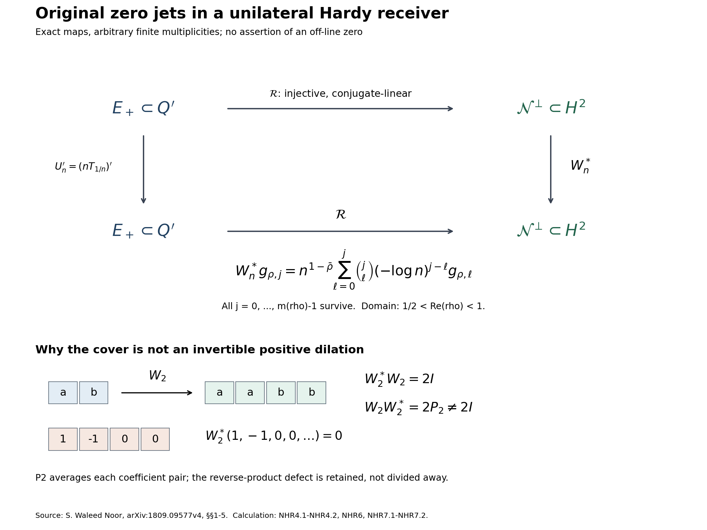

# An indexed Hardy-space source applied to the original zeta jet quotient

Private mathematical continuation, 2026-09-25. This does not alter the frozen published edition or the owners' source files.

## NHR0. What was requested, what is retained, and what this adds

The delegated task was to use the existing disk index to find and actually apply one underused human result to the original-source quotient or complementary return. The resulting calculation below embeds every finite collection of right-off-line original zero jets in a positive Hardy-space receiver. It also computes why Noor's unconditional vanishing theorem does not annihilate those vectors: every nonzero finite combination is outside its precise adjoint domain. The defect is an explicit power-log boundary expression, not an appeal to an unspecified obstruction.

The input is the already constructed arithmetic coefficient quotient
\[
 Q=\mathcal B/I,
 \qquad I=\{F\in\mathcal B:F^{(j)}(\rho)=0\text{ at every actual nontrivial zero, }j<m_\rho\}.
\]
Here \(\mathcal B\) is the existing entire, rapidly decreasing vertical-strip test space. The original arithmetic has already been reconstructed before these complex coefficient operations. This note supplies no addition on primitive \(\tau\); the retracted equation \(\tau+\tau=\tau\) is not used. Presence/support labels are not replaced by coefficients. The maps below are not maps identifying \(\tau\) with integer one. Left-off-line and critical-line jets remain in the original \(Q\); this note constructs a receiver on a specified subspace of its dual, not a replacement quotient deleting those other jets.

This is different from the received WHR/VWR results. WHR8–12 and VWR4–9 calculate weighted Hilbert closures of the *original source*, including their exact kernels and the nondegenerate original reciprocal-zeta pairing on \(K_{\rm off}\). ATG6A–10 calculates the full tensor comparisons and their exponents. Their conclusions are retained. Here the domain is instead the algebraic span of finite jet *functionals*, and the receiving operators are the unilateral covers in Noor's paper. The map and its domain are written out in NHR7.

## NHR1. Human source, version, reading and prior-use evidence

S. Waleed Noor, **A Hardy space analysis of the Báez-Duarte criterion for the RH**, arXiv **1809.09577v4**, 9 May 2019; *Advances in Mathematics* **350** (2019), 242–255, DOI [10.1016/j.aim.2019.04.064](https://doi.org/10.1016/j.aim.2019.04.064). [Versioned source](https://arxiv.org/src/1809.09577v4), [record](https://arxiv.org/abs/1809.09577v4).

The existing canonical index routes this as **PUBUNIT-803463A3EF787AE3E69C519B**. Its indexed author TeX is `F:/user/Documents/arxiv_latex/_expanded_by_topic/zeta_variants+hilbert_polya_RH+casimir_spectral/746764d0717d96f4/hilbert_polya_berry_keating_spectral_RH/1809.09577/Paper_6-2.tex`. SHA256:
`bc3075483547782dce36bf55a6349899a26766fcfc8ae9f265079ec74601f2d3`.

The TeX extracted from the downloaded **versioned v4 source archive** has the identical SHA256. The archive hash is `dfc0fa6465dd18461eb323028474972295ed3b7be0a784de0a9d492766c01ce9`. Only its TeX member was extracted. The bundled PDF was not opened or extracted.

Read scope: author TeX preamble/introduction and §§1–5, through line 387. The mathematical inputs used are:

- §1.2, lines 114–133, labels `norm A`, `H and A isomorphism`, `unitary map Hardy Bergman`: the exact weighted sequence/Bergman/Hardy isometries.
- §1.3, lines 135–159, `Local Dirichlet membership`: \(\mathcal D_{\delta_1}=\{a+(z-1)u:u\in H^2\}\).
- §2, lines 203–261, `Main Theorem`, `H2 Membership lemma`, `R_k`: the functions \(h_k\), their arithmetic source and membership in \(H^2\).
- §3, lines 262–288, `W_n`, `Alternative h_k`: the unrescaled covers and invariant span.
- §§4–5, lines 289–387, `(I-S)hk`, `N perp`, `domT* main`: density of \((I-S)\mathcal N\) and the unconditional theorem \(\mathcal N^\perp\cap\mathcal D_{\delta_1}=\{0\}\).

Noor cites Báez-Duarte, Bagchi, Nyman, Sarason and the Dirichlet-space literature. Those underlying originals were **not** newly read in this bounded continuation; their credit here is mediated through the inspected Noor source. The exact receiver calculations below are independently derived rather than attributed to an unread original.

Evidence of underuse is bounded, not a claim about all programme history. The 2026-09-19 `INDEX_DERIVED_READING_QUEUE.json` contains this unit under `zeta_core` and `hardy_approximation`, explicitly marked `unread_in_this_pass`. It is absent from that pass's 19-source `SOURCE_READING_LEDGER.json`. A fresh query of both research/local and canonical/staging indexes for `1809.09577` returned its research source and no local-work result. A literal search for `Noor|1809\.09577|local Dirichlet` in the four named receiving/reading workspaces found no further MD/TeX/JSON occurrence after excluding the known reading queue. Thus it was already *routed*, but no application was found in those checked receiving records. This does not establish priority or exhaustive historical non-use.

## NHR2. Exact receiving objects

Use inner products linear in the first variable. Put
\[
 \ell^2_\omega=\left\{a:\sum_{n\ge1}\frac{|a(n)|^2}{n(n+1)}<\infty\right\},
 \quad \Psi a(z)=\sum_{n\ge0}a(n+1)z^n,
 \quad Tf=\frac{((1-z)f)'}{1-z},\quad \Phi=T^{-1}\Psi.
\]
Noor §1.2 proves/records these exact isometries, including the stated weights. With
\[
 r_k(n)=k\{n/k\},\quad
 h_k(z)=\frac1{1-z}\log\frac{1+z+\cdots+z^{k-1}}k,
 \quad\mathcal N=\operatorname{span}\{h_k:k\ge2\},
\]
Noor §2 gives \(\Phi r_k=h_k\). The analytic logarithm is the branch real on \(0<z<1\); the term \(-\log k\) is retained. In particular \(\Phi\boldsymbol1=-1\), not \(+1\).

For \(1/2<\Re s<1\), write \(\alpha=\bar s\), and define
\[
 a_s(n)=\frac{n(n+1)}\alpha\bigl(n^{-\alpha}-(n+1)^{-\alpha}\bigr),
\]
\[
 g_s(z)=\sum_{j\ge0}c_s(j)z^j,\qquad
 c_s(j)=\frac{j^{1-\alpha}-(j+1)^{1-\alpha}}\alpha,
 \quad0^{1-\alpha}=0.
 \tag{NHR2.1}
\]
All powers of positive integers use the real logarithm. The stated open strip justifies the value at zero. No formula here is being claimed at \(s=0\), \(s=1\), or on the boundary \(\Re s=1/2\).

The step-function embedding \(Ua(x)=a(n)\) on \((1/(n+1),1/n]\) is an isometry into \(L^2(0,1;dx)\), since the interval length is exactly \(1/[n(n+1)]\). The orthogonal step projection of \(x^{\bar s-1}\) is \(Ua_s\), by integrating that function over each interval. Consequently, including every derivative order,
\[
 \|\partial_{\bar s}^{j}g_s\|_{H^2}^2
 =\|\partial_{\bar s}^{j}a_s\|_\omega^2
 \le\int_0^1x^{2\Re s-2}|\log x|^{2j}dx
 =\frac{(2j)!}{(2\Re s-1)^{2j+1}}.
 \tag{NHR2.2}
\]
The equality used here follows from \(\Phi a_s=g_s\), verified directly next. These bounds, locally uniform in the strip, also justify Hilbert-space differentiation.

Indeed put \(q_\alpha(n)=n^{1-\alpha}/\alpha\), with \(q_\alpha(0)=0\). The coefficient of \(z^{n-1}\) in \(Tg_s\) is
\[
 (n+1)q_\alpha(n)-nq_\alpha(n+1)=a_s(n).
\]
Also \(c_s(n)=O(n^{-\Re s})\), so \(g_s\in H^2\). The exact isometry \(T:H^2\to\mathcal A\) now proves \(\Phi a_s=g_s\), completing the justification of NHR2.2 without a changed norm.

## NHR3. The original zeta pairing, with its full multiplier

Almost everywhere on the \(n\)-th interval,
\[
 Ur_k(x)=k\left\{\frac1{kx}\right\}-\left\{\frac1x\right\}.
\]
For example write \(1/x=n+t\), \(0\le t<1\), and divide \(n\) by \(k\); both fractional parts then give the identity directly. Projection and the convention on the inner product give
\[
 \langle h_k,g_s\rangle_{H^2}
 =\int_0^1\left(k\left\{\frac1{kx}\right\}-\left\{\frac1x\right\}\right)x^{s-1}dx.
\]
Set \(A(s)=\int_0^1\{1/x\}x^{s-1}dx\). For \(\Re s>1\), integrating the floor function term by term yields
\(A(s)=1/(s-1)-\zeta(s)/s\). The left side is holomorphic for \(\Re s>0\), so this equality continues there, with the removable value at 1 understood. Splitting the first integral at \(1/k\) gives, with no endpoint omitted,
\[
 k\int_0^1\{1/(kx)\}x^{s-1}dx
 =k^{1-s}A(s)+\frac{1-k^{1-s}}{s-1}.
\]
Subtracting \(A(s)\) proves
\[
 \boxed{\langle h_k,g_s\rangle=(1-k^{1-s})\frac{\zeta(s)}s.}
 \tag{NHR3.1}
\]
This is a formula for the *original* \(\zeta\), not a substitution of a completed function. The factor \(1/s\), cover factor \(k^{1-s}\), logarithmic branch and boundary terms remain visible.

For an actual right-off-line zero \(\rho\), of its actual order \(m_\rho\), define
\[
 g_{\rho,j}=\left.\partial_{\bar s}^{j}g_s\right|_{s=\rho},
 \qquad0\le j<m_\rho.
\]
Differentiating NHR3.1 gives
\[
 \langle h_k,g_{\rho,j}\rangle
 =\left.\partial_s^j\left((1-k^{1-s})\zeta(s)/s\right)\right|_{\rho}=0.
 \tag{NHR3.2}
\]
Thus every full retained jet belongs to \(\mathcal N^\perp\). No simplicity assumption or existence of any off-line zero is imposed. As a sign check, \(\langle1,g_{\rho,j}\rangle=(-1)^{j+1}j!/\rho^{j+1}\).

## NHR4. Raw covers and every nilpotent coefficient

Keep Noor's original
\[
 W_nf(z)=(1+z+\cdots+z^{n-1})f(z^n).
\]
Its coefficient sequence repeats each coefficient in a consecutive block of length \(n\), so
\[
 (W_n^*b)_m=\sum_{r=0}^{n-1}b_{nm+r},\qquad
 W_n^*W_n=nI,\qquad W_nW_n^*=nP_n,
 \tag{NHR4.1}
\]
where \(P_n\) is the orthogonal projection averaging each such block. For \(n>1\), \(P_n\ne I\): the sequence \((1,-1,0,\ldots)\) is in the kernel when its two nonzero entries lie in the first block. Thus the reverse product has an explicitly retained defect.

The coefficients telescope, including the first block, to
\[
 W_n^*g_s=n^{1-\bar s}g_s.
\]
Differentiating gives every jet:
\[
 \boxed{W_n^*g_{\rho,j}
 =n^{1-\bar\rho}\sum_{\ell=0}^j
 \binom j\ell(-\log n)^{j-\ell}g_{\rho,\ell}.}
 \tag{NHR4.2}
\]
For divided jets \(e_j=g_{\rho,j}/j!\), this is \(n^{1-\bar\rho}\exp(-\log n\,N)\), where \(Ne_j=e_{j-1}\) and \(Ne_0=0\). For \(n>1\) its Jordan length is exactly \(m_\rho\); independence is proved in NHR6. No rescaling by \(n^{-1/2}\) has been made.

The original positive-transfer classification CFP concerns an invertible dilation group with a specified adjoint identity. NHR4.1 is a unilateral cover and fails the requisite inverse composition by \(n(I-P_n)\). Therefore it is not a counterexample to CFP; the displayed map tells exactly which operator prerequisite differs.

## NHR5. The adjoint domain in Noor's vanishing theorem

Let \(S\) be the unilateral shift and \(B=I-S\). The operator \(B\) is bounded, injective and has dense range. Its inverse \(M=B^{-1}\), multiplication by \(1/(1-z)\), has domain \(\operatorname{ran}B\) and is onto \(H^2\). From the definition of adjoint,
\[
 \operatorname{dom}M^*=\operatorname{ran}B^*.
\]
Indeed \(\langle M Bf,y\rangle=\langle f,y\rangle\) is representable as \(\langle Bf,v\rangle\) for all \(f\) exactly when \(y=B^*v\). Now
\[
 (I-S^*)d=d_0+(z-1)S^*d.
\]
Conversely \(a+(z-1)u=(I-S^*)(a+zu)\). Noor's local Dirichlet characterization therefore gives exactly
\[
 \operatorname{dom}M^*=\operatorname{ran}(I-S^*)=\mathcal D_{\delta_1}.
 \tag{NHR5.1}
\]
Noor §§4–5 proves \(\overline{(I-S)\mathcal N}=H^2\), hence
\(\mathcal N^\perp\cap\operatorname{dom}M^*=\{0\}\). This is the unconditional human theorem being tested against the actual programme receiver.

The exact initial partial sum of NHR2.1 is
\[
 \boxed{\sum_{m=0}^{N}c_s(m)=-\frac{(N+1)^{1-\bar s}}{\bar s}.}
 \tag{NHR5.2}
\]
This is an **initial partial sum**, not an infinite tail. In this strip those ordinary tails do not converge. A solution to \(d_m-d_{m+1}=c_s(m)\) must instead satisfy
\[
 d_m=d_0+\frac{m^{1-\bar s}}{\bar s}.
\]
It cannot be in \(\ell^2\). Thus \(g_s\notin\operatorname{dom}M^*\), independently of whether \(s\) is a zero.

There is also an exact function-level expression. Defining the polylogarithm here by its absolutely convergent power series in the disk,
\[
 \operatorname{Li}_{\alpha-1}(z)=\sum_{n\ge1}n^{1-\alpha}z^n,
\]
directly summing NHR2.1 proves
\[
 g_s(z)=-\frac{1-z}{\bar s\,z}\operatorname{Li}_{\bar s-1}(z),
 \tag{NHR5.3}
\]
with removable value \(-1/\bar s\) at \(z=0\). No polylog boundary asymptotic is needed for the domain conclusion; NHR5.2 computes it exactly at the coefficient level.

## NHR6. No finite multiplicity cancellation repairs that domain failure

Take a finite set of distinct parameters \(\rho_r\) in the stipulated strip, and a finite coefficient array \(b_{rj}\), not all zero. The corresponding receiver vector has coefficients
\[
 b_m=F(m)-F(m+1),\qquad
 F(x)=\sum_r x^{1-\bar\rho_r}P_r(\log x)\quad(x>0),\quad F(0)=0.
 \tag{NHR6.1}
\]
For the highest nonzero jet \(j\) at a fixed \(\rho_r\), the leading coefficient of \(P_r\) is \(b_{rj}(-1)^j/\bar\rho_r\ne0\). This follows by differentiating \(x^{1-\alpha}/\alpha\) exactly, retaining all lower coefficients from derivatives of \(1/\alpha\).

A representation \(b=(I-S^*)d\), \(d\in\ell^2\), would give \(d_m=d_0+F(m)\), so \(F(m)\) would be bounded. Each term has \(0<\Re(1-\bar\rho_r)<1/2\), hence \(F'(x)\to0\). Boundedness on the integers would consequently give boundedness on the real half-line by the mean-value integral on every interval \([m,m+1]\).

Let \(\beta>0\) be the largest real exponent in NHR6.1, and \(D\) the highest logarithmic degree among the terms with that real exponent. Then
\[
 e^{-\beta t}t^{-D}F(e^t)=T(t)+o(1),
\]
where \(T\) is a nonzero finite trigonometric polynomial with distinct frequencies and the nonzero highest coefficients just calculated. Its Cesàro mean square tends to the sum of their squared moduli: integrating each cross frequency gives a bounded integral divided by the averaging length. Therefore \(T(t)\) cannot tend to zero. Boundedness of \(F\), however, would force the left side to tend to zero. This contradiction proves
\[
 \boxed{\operatorname{span}_{\rm fin}\{g_{\rho,j}\}\cap\mathcal D_{\delta_1}=\{0\}.}
 \tag{NHR6.2}
\]
The argument applies even before restricting the parameters to zeros. It also proves all these finite jet vectors linearly independent: a zero coefficient sequence is in \(\mathcal D_{\delta_1}\), contradicting the same argument for a nonzero array. This is a proof for arbitrary finite multiplicities and distinct parameters, not a numerical test or an assumption about simple zeros.

## NHR7. Exact typed map from the original quotient dual

For an actual right-off-line zero put
\[
 \varepsilon_{\rho,j}:Q\longrightarrow\mathbb C,
 \qquad\varepsilon_{\rho,j}([F])=F^{(j)}(\rho),\quad j<m_\rho.
\]
These functionals are well defined and continuous in the original quotient topology. Their finite families are independent: multiplication by \(e^{s^2}\), whose value never vanishes, is an invertible triangular map on each finite jet space. Finite Hermite interpolation therefore chooses a polynomial \(P\) so that \(P(s)e^{s^2}\) has any prescribed finite jet array; this function belongs to \(\mathcal B\). Equivalently one may use the owner's full original isolators, retaining their reciprocal Taylor coefficients.

Let \(E_+\subset Q'\) be their **algebraic finite span**. The exact receiving map is
\[
 \boxed{\mathcal R:E_+\longrightarrow\mathcal N^\perp,
 \qquad\mathcal R\left(\sum b_{\rho,j}\varepsilon_{\rho,j}\right)
 =\sum\overline{b_{\rho,j}}\,g_{\rho,j}.}
 \tag{NHR7.1}
\]
It is conjugate-linear and injective by NHR6, or a complex-linear injection \(\overline{E_+}\hookrightarrow\mathcal N^\perp\). Conjugation is necessary for the chosen inner product, not a hidden identification of labels.

Retain the original raw dilation multiplier \(T_n:F(s)\mapsto n^sF(s)\). The original companion \(U_n=nT_{1/n}\) multiplies by \(\chi_n(s)=n^{1-s}\). It preserves \(\mathcal B\) and \(I\), since this entire multiplier and its derivatives are bounded by constants on each fixed vertical strip. Its transpose on the continuous dual is
\[
 U_n'\varepsilon_{\rho,j}
 =n^{1-\rho}\sum_{\ell=0}^j\binom j\ell(-\log n)^{j-\ell}\varepsilon_{\rho,\ell}.
\]
Comparing with NHR4.2 proves the full commuting relation
\[
 \boxed{\mathcal R U_n'=W_n^*\mathcal R.}
 \tag{NHR7.2}
\]
On each finite received primary block, \(W_n^*\) is invertible, and the original \(T_n'\) is transported as \(n(W_n^*|_{\rm block})^{-1}\). This is a block statement, not a global inverse of \(W_n^*\). All factorial conventions and signs were retained.

## NHR8. What this concretely settles for the programme

The indexed source supplies a positive receiving space where the finite original complementary jets do not disappear. Their raw transfer eigenvalues, their complete Jordan blocks and the exact \(\zeta\) pairing are calculated. The temptation to apply Noor's unconditional domain theorem and conclude that they vanish fails at a now-explicit place: every nonzero finite combination has the power-log boundary term NHR6.1 and is outside that domain. A dense domain cannot be substituted for domain membership. The raw reverse-cover composition also retains the nonzero projector defect \(n(I-P_n)\), so it cannot be treated as the positive invertible action classified by CFP.

This is a specific, fully calculated failed application of the vanishing theorem and a successful finite-jet comparison with the original source. It does not show that off-line zeros exist or do not exist. It does not identify all of \(\mathcal N^\perp\) with this finite span, extend \(\mathcal R\) to the full dual or a completion, identify left and right branches, identify a Hardy inner product with the owner's full reciprocal-zeta residue pairing, or prove a geometric purity theorem. No completed zeta multiplier was introduced or canceled.

The next structural use is now specified by the calculation rather than another finite norm estimate: the original source return must act on the explicit boundary classes \(x^{1-\bar\rho}P(\log x)\), not on a falsely assumed local-Dirichlet image. The present note calculates those classes and their raw cover action completely; it does not label the missing global return as a theorem.

Figure: the upper square is NHR7.2, with the conjugate-linear injection and full jet formula retained. The lower coefficient diagram explains the exact reverse-composition defect in NHR4.1, using the genuine operator at n=2 rather than an invented zero sample. Source: Noor §§1–5; proof locators NHR4.1–4.2, NHR6 and NHR7.1–7.2. The reproducible source is `draw_receiver.py`; SVG and PNG are retained. The PNG was rendered and visually inspected for labels, formula signs and clipping.

## NHR9. Independent check and received-source coverage

A separate mathematical subagent checked NHR2–NHR7 independently. Two precision corrections were integrated before this note was written: (i) NHR5.2 is an initial partial sum, not a tail; (ii) NHR7.1 is conjugate-linear, not complex-linear on \(E_+\). The independent calculation checked the isometry, original-zeta integral, all jet factors, finite linear independence and the entire finite-span domain failure. This is not human peer review or a blanket certification of ancestor work.

Programme source coverage in this continuation: the native SPF0–11 and SMC0–10 notes in `SOURCE_MEASURE_CONTINUATION_484.zip`; selected later WHR8–12, VWR4–9 and ATG6A–10. Earlier CFP/CPS/AST had already been checked in the preceding bounded review. This note does not claim to have independently re-proved the full 484-page ancestor or the full later cumulative paper.
