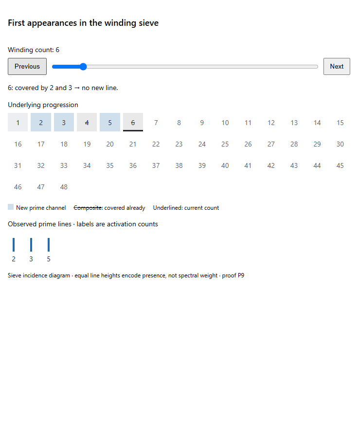

# Fixed support, winding arithmetic and complete prime clocks

This edition publishes the complete P1–P14 prime-clock calculation and its cumulative LaTeX source. It follows the investigator's proposal to retain a non-parity-labelled fixed support, winding histories and prime first appearances, and to calculate their relation to common modulus and arithmetic weight.

## Read the work

- [Complete cumulative manuscript](CLOCK_ARITHMETIC_CUMULATIVE.md)
- [Complete cumulative LaTeX](CLOCK_ARITHMETIC_CUMULATIVE.tex)
- [Prime clocks, orchard visibility and spectrum: P1–P14](PRIME_CLOCKS_ORCHARD_AND_SPECTRUM.md)
- [Fixed generic point and mirror parity: CC1–CC5](CC_FIXED_GENERIC_POINT_AND_MIRROR_PARITY.md)
- [Winding, parity and the integer spectrum: W1–W10](WINDING_PARITY_AND_INTEGER_SPECTRUM.md)
- [Deligne's common-modulus statement and winding comparison: D1–D5](DELIGNE_COMMON_MODULUS_AND_WINDING.md)

P11 proves the exact finite-observation ambiguity and infinite-prime separation. P12–P13 retain the full signed completion and all prime powers. P14 gives the finite-clock sums, adjoints, support projections, mixed common-divisor relation, and full signed comparison. In particular, the operator modulus factor is not asserted to establish arithmetic Frobenius eigenvalue purity or RH.

The complementary [backward-history dilation calculation](../clock-history-common-radius/README.md) remains separately available. This publication preserves the originating task's P14 proof rather than replacing it with that continuation.

## First appearances

[HTML visualization source](prime-first-appearance.html) · [Narrow-layout image](PRIME_FIRST_APPEARANCE_NARROW.png)

The image is supplied by the originating task. The HTML is its original embeddable widget source; GitHub displays source rather than executing the widget. Publishing it does not claim to repair the failed in-chat visualization. Equal line heights encode channel presence, not spectral weight.

## Sources and edition scope

Human sources include Alain Connes and Caterina Consani, [the absolute twistor line, §§3–7](https://arxiv.org/html/2609.00299v1), and [absolute geometry and the Fargues–Fontaine curve](https://arxiv.org/html/2606.06604v1); and Pierre Deligne, [La conjecture de Weil. II](https://www.numdam.org/item/PMIHES_1980__52__137_0/), especially Definitions 1.2.1–1.2.7 and Corollaries 3.3.4–3.3.6. The individual manuscripts retain their proof locators and source-reading records.

All nine supplied source files are preserved byte-for-byte. Earlier labels such as “private continuation” describe their drafting state, not access restrictions on this user-authorized publication. References to local reading ledgers are historical provenance locators, not downloadable dependencies. Private conversation ledgers are not included. The [source manifest](SOURCE_MANIFEST.json) records the exact snapshot hashes. No fresh PDF compilation, Lean check or independent validation of the entire cumulative manuscript is claimed by this publication action.
